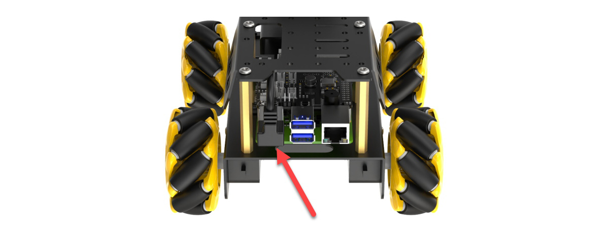

# 学前先看

## 1. 认识TurboPi

### 1.1 产品介绍

TurboPi是一款基于树莓派开发的智能视觉机器人，它采用麦克纳姆轮底盘，并搭载高清摄像头，配合OpenCV能实现颜色识别、目标追踪、智能巡线、二维码识别等功能。

TurboPi搭载RGB发光超声波传感器，可以控制灯光变化，并能实现智能避障。此外，它还支持拓展多种传感器，实现更多感知的融合。

### 1.2 产品清单


## 2. 图文组装教程

### step1：安装超声波和云台舵机


### step2：安装小车底盘


### step3：安装巡线传感器


### step4：安装云台舵机支架


### step5：安装树莓派主板与扩展板


### step6：超声波、巡线传感器接线


### step7：安装电池盒


### step8：安装麦轮


### step9：安装头部舵机与摄像头


### step10：总接线示意图


### step11：安装上盖


<p id="anchor_3"></p>

## 3. 设备充电、开机及自检

**开机之前请先按照上文"第1章 学前先看\第2课 组装教程"内容组装好机器人。**

### 3.1 电池充电及安装

由于运输途中电池不能充满，所以在初次开机前，建议先给电池充满电，以下是具体充电方法：

1) 拿出电池充电器，将两节18650的电池（选配）按照正负极对应（正对正，负对负）装到电池充电器中，注意！电池正负极切勿装反！再通过数据线将电池充电器连接或用充电头（5V 1-2A，需自备）。


2) 等待充电完成（适配器指示灯在未通电的状态下为绿色，通电后为红色代表充电中（充电时长约为5个小时左右）、指示灯由红色变为绿色代表充电完成），充电完成后，请尽快拔掉充电器，切勿一直充电。

### 3.2 安装电池

1. 安装电池前请确保电池盒的开关拨到"**OFF**"档。


2. 将充满电的电池安装到电池盒中，并盖上电池盖。注意！电池正负极切勿装反！

### 3.3 确认摄像头连接

在开机之前请先确认摄像头连接线是否已连接牢固（摄像头连接线可接入树莓派主板上4个USB接口的任意一个）。



### 3.4 开机状态说明

1) 将电池盒的开关拨到"**ON**"档，再将树莓派扩展板的开关由"**OFF**"推动到"**ON**"，此时树莓派的LED1、LED2常亮，稍等片刻后LED2由常亮变为每隔1秒闪亮一次、云台回到初始姿态、蜂鸣器发出"嘀"的一声，即设备成功开机。

:::{Note}
- 树莓派本身也是电脑，开机启动需要一小段时间，开机时间约30秒左右，请耐心等待。
- LED1为电源指示灯，通电时点亮，设备运行过程中是常亮的状态，若灯光变暗则表示电源没电了，需要充电；
- LED2为通信指示灯，设备出厂默认的网络连接模式为直连模式，设备开机成功后LED2每隔1S闪烁一次；若将其设置为局域网模式，LED2则会常亮（关于网络连接模式的设置与介绍，可参照"[上手试玩\1. 手机APP安装和连接]()"课程进行了解）；
- 设备运行过程中，若LED1与LED2灯光变暗，并保持常亮的状态，则表示电源没电了，需要充电。
:::

2) 设备开机成功后，出厂默认为AP直连模式，并将产生一个以HW开头的热点。


### 3.5 启动自检程序

机器人在开机成功后，可通过按键KEY1来启动自检服务，用以对机器人的舵机、电机进行检测，可以帮助用户排查接线是否正确。

若启动自检后设备无法按照下文所示内容进行转动，则需参照 "**第1章 学前先看\第2课 组装教程**"重新接线。

1) 按下扩展板上的KEY1按键即可开启自检功能。


2) 舵机与电机将按下图所示顺序依次转动。


### 3.6 查看电池电量

有以下两种方式可查看：

- #### 通过观察扩展板LED的灯查看。

树莓派扩展板上的LED灯亮微弱蓝光时，说明电池电量不足，无法维持开机及玩法运行，需尽快给电池充电。


- #### 通过手机APP画面内查看

在手机APP的回传画面中会直接显示电池的实时电量，当电压小于7V时，电池电量不足，需尽快给电池充电（手机APP体验学习可前往"**第2章 上手试玩**"）。


本节结束后，请依次前往"**[学前先看\4. 远程桌面工具安装与连接]()**"搭建开发环境，再前往"**[学前先看\5. 云台位置调节]()**"对云台进行偏差调节（切勿跳过此步骤！）。

<p id="anchor_4"></p>

## 4. 远程桌面工具安装与连接

### 4.1 准备工作

- #### 4.1.1 硬件准备

准备一台笔记本电脑，如使用台式电脑请自备无线网卡 (需支持5G频段) 。

- #### 4.1.2 VNC远程工具的安装

VNC是一款图形化远程控制软件。通过连接树莓派的Wi-Fi热点，可以直接在电脑端控制树莓派，VNC的安装步骤如下：

1)  双击本节目录下的安装程序"**VNC-Viewer-6.17.731-Windows**"，将安装语言选择为"**English**"，并点击"**OK**"按键。


2)  点击"**Next**"按键。


3)  勾选同意协议，并点击"**Next**"按键。


4)  保持默认安装位置，并点击"**Next**"按键。跳转至下一界面时，直接点击"**Install**"按键。


5)  等待片刻后，出现安装完成的提示界面，点击"**Finish**"按键即可。


6)  安装完成，点击图标即可打开VNC。

- #### 4.1.3 设备开机

参照"**[学前先看\3. 设备充电、开机及自检]()**"课程，打开设备开关，将设备开机。稍等片刻后，扩展板上的LED1会开始闪烁，蜂鸣器会鸣叫一次，代表设备开机成功。

### 4.2 设备连接

1)  TurboPi开机成功后，默认连接模式是AP直连模式，此时将会产生一个以"HW"开头的热点，我们可以在电脑端搜索并连接这个热点，如下图所示：


2)  点击连接，输入密码"**hiwonder**"。


3)  连接成功后，打开VNC Viewer，在地址栏输入树莓派默认的IP地址：192.168.149.1，按下回车。如果出现安全连接相关的提示框，点击"Continue"按键即可。  


4)  在账号登录窗口填写所需信息，账号栏（Username）输入"**pi**"，密码栏（Password）输入"**raspberrypi**"，并勾选记住密码（Remember password）。点击"OK"按键后，便可远程打开树莓派桌面。


5)  桌面如下图所示。（如果出现黑屏，只显示鼠标指针，可尝试重启树莓派。）


### 4.3 界面介绍

通过VNC成功连接TurboPi之后，操作界面如下所示：


下表为常用功能说明：

<table  class="docutils-nobg" border="1">
<colgroup>
<col  />
<col  />
</colgroup>
<tbody>
<tr>
<td >图标</td>
<td >功能</td>
</tr>
<tr>
<td ></td>
<td ><p>应用菜单，点击之后可选择不同应用。</p>
<p></p></td>
</tr>
<tr>
<td ></td>
<td >系统自带浏览器</td>
</tr>
<tr>
<td ></td>
<td >文件管理器</td>
</tr>
<tr>
<td ></td>
<td >LX终端，点击之后，可在打开界面输入命令行。</td>
</tr>
<tr>
<td ></td>
<td >回收站，可找回近期删除的文件。</td>
</tr>
<tr>
<td ></td>
<td >上位机软件，可通过此软件调整云台舵机位置、调节颜色阈值。</td>
</tr>
<tr>
<td ></td>
<td >点击可使系统桌面显示全屏或退出全屏。</td>
</tr>
<tr>
<td ></td>
<td >退出全屏。</td>
</tr>
<tr>
<td ></td>
<td ><p>电源，点击可选择关机、重启、退出</p>
<p></p></td>
</tr>
</tbody>
</table>

### 4.4 系统目录简要说明

- #### 4.4.1 桌面分布

通过VNC远程连接后，系统桌面如下图所示：


1)  其中我们主要看这个图标。双击后，点击"**执行**"。


这个工具用来对颜色阈值参数进行调节，以及调试云台的舵机。


2)  点击"**Connect**"，可以显示当前摄像头回传的实时画面。点击"**Disconnect**"则可关闭摄像头。


3)  工具界面可以分为以下三个部分，如下表所示：

| 序号 | 名称 | 功能 |
|:--:|:--:|:--:|
| ① | 摄像头回传区 | 用于显示回传画面，左侧为处理后的画面，右侧为原始画面。 |
| ② | 颜色阈值参数调节按钮 | 用于调节颜色阈值，选择需要调节的识别颜色及增删颜色种类及保存效果。 |
| ③ | 舵机控制区 | 用于调节云台1号和2号舵机的初始位置，以及保存修改后的数值。 |

4)  关于工具的具体使用，例如舵机调试，可参考"**[5. 云台位置调节](#anchor_5)**"；颜色阈值参数学习可参考"**[上手试玩\3. 颜色阈值调试]()**"。

- ####  4.4.2程序结构说明

1)  按下"**Ctrl+Alt+T**"打开命令行终端，输入指令，列出当前所有文件。我们主要看以下几个目录即可。

```commandline
ls
```


|      目录名      |              作用              |
|:----------------:|:------------------------------:|
| hiwonder-toolbox |         Wi-Fi管理工具          |
|     TurboPi      | 存放所有玩法及涉及到的程序源码 |
|     LAB_Tool     | 颜色阈值调试工具及头部舵机控制 |

2)  接下来进入玩法及程序源码目录，输入指令。

```commandline
cd TurboPi/
```

3)  然后输入指令，以树状图的形式列出该目录下的所有文件夹及文件，我们主要了解下图红框所示的几个目录即可。

```commandline
tree -L 1
```


|    目录/文件名    |              说明              |
|:-----------------:|:------------------------------:|
| CameraCalibration |  相机标定相关目录（仅需了解）  |
|     Camera.py     |         摄像头测试程序         |
|     Functions     |        玩法程序所在目录        |
|    HiwonderSDK    | 底层驱动库及扩展板模块测试例程 |
|  MecanumControl   |    麦轮基本运动程序所在目录    |

4)  输入指令，通过树状图直接打开麦轮基本运动程序所在目录。

```commandline
tree -l 1 /home/pi/TurboPi/MecanumControl/
```


|     目录/文件名      |         说明         |
|:--------------------:|:--------------------:|
| Car_Drifting_Demo.py |     小车漂移程序     |
| Car_Forward_Demo.py  |     小车前进程序     |
|   Car_Move_Demo.py   | 小车前后左右移动程序 |
|  Car_Slant_Demo.py   |   小车斜向运动程序   |
|   Car_Turn_Demo.py   |     小车转向程序     |

5)  输入指令，通过树状图直接打开玩法程序所在目录，我们只需了解下图红框所示的即可。

```commandline
tree -L 1 /home/pi/TurboPi/Functions/
```


|      目录/文件名      |    说明    |
|:---------------------:|:----------:|
|     Avoidance.py      |  智能避障  |
|    ColorDetect.py     |  颜色识别  |
|   ColorTracking.py    |  目标追踪  |
|    FaceTracking.py    |  人脸追踪  |
| GestureRecognition.py |  手势识别  |
|    LineFollower.py    | 红绿灯行驶 |
|     QuickMark.py      | 二维码识别 |
|    VisualPatrol.py    |  智能巡线  |

<p id="anchor_5"></p>

## 5. 云台位置调节

TurboPi在组装过程中，若因舵机主轴偏移，或更换舵机，以及其他操作使舵机主轴发生偏移产生偏差，就需要进行偏差调试，而偏差分为小偏差和大偏差两种情况。根据情况不同，调试的方法也有所不同。下面我们一起来学习如何判断大小偏差，和偏差调节的方法。

### 5.1 准备工作

1)  根据"**[3. 设备充电、开机及自检](#anchor_3)**"内容，将TurboPi成功开机。

2)  再参考"**[4. 远程桌面工具安装与连接](#anchor_4)**"内容，通过VNC远程连接工具连接TurboPi。

### 5.2 判断大小偏差

1)  TurboPi开机成功后，舵机会自动复位，此时我们若看到云台摄像头的下方边缘与超声波模块上方边缘对齐平行以及摄像头后方连接件的竖直方向与云台垂直（如下图所示），则表明云台偏差无需调整，可跳过本节内容。


2)  若舵机与中心线夹角小于13°(即舵机的脉宽范围在\[1350，1650\])，通过上位机调节可以归位，则为小偏差，可以通过"[5.3 小偏差调节](#anchro_5_3)"来进行调节；偏差情况以2号舵机为例，如下图所示：


**PWM舵机的脉宽范围为：\[500,2500\]，对应的角度范围为0°~180°，角度换算公式为：脉宽 = (角度 \* 11.1) + 500。云台舵机初始角度为90°，即脉宽为1500。**

3)  如舵机与中心线的夹角大于13°，通过上位机调节也无法归位，则为大偏差，可以通过"[5.4 大偏差调节](#anchro_5_4)"来进行调节；偏差情况以2号舵机为例，如下图所示：


<p id="anchro_5_3"></p>

### 5.3 小偏差调节

小偏差的调节可直接在上位机的界面拖动舵机的偏差滑杆来调节；点击，在弹出的页面中点击"**执行**"打开上位机。


1)  我们拖动2号舵机的滑杆（servo2），使TurboPi的U型支架与底座支架平行。

:::{Note}
我们这里可调动的范围是在1350~1650之间，如果能在此范围内可以将U型支架与底座支架调节至平行，则为小偏差。如果调整范围超过此范围，则为大偏差，则可以通过"[5.4 大偏差调节](#anchro_5_4)"来进行调节。
:::


2)  然后点击"**Save**"，将调节的偏差值保存到TurboPi中。


<p id="anchor_5_4"></p>

### 5.4 大偏差调节

大偏差的调节则需要将舵机从云台上拆下来，进行中位后，再重复小偏差调节的步骤。

1)  TurboPi开机成功后，舵机会自行复位，此时可以发现2号舵机有明显的偏差，偏差角度大于13°。


2)  将TurboPi断电（以下涉及拆卸步骤，切勿在通电下进行）。

3)  将2号舵机主轴上的螺丝拧下。


4)  再将2号舵机上的U型支架拔下来。


5)  然后再打开树莓派的开关（即开机后蜂鸣器发出"滴"的一声提示），此时舵机会自动中位；待舵机中位后，将设备关机。

6)  设备关机后，将U型支架，按照下图所示位置，安装到2号舵机上。（注意：在安装的过程中，请不要扭动舵机，若不小心扭动了舵机请重复第5步。）


7)  接着将主轴螺丝拧上，再参照"[5.3 小偏差调节](#anchro_5_3)"的步骤，对舵机进行微调。

