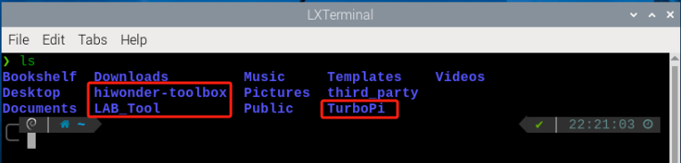
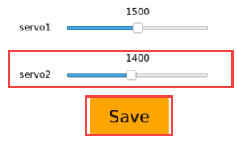

# 1. Getting Ready

## 1. Introduction to TurboPi

### 1.1 Product Introduction

TurboPi is an intelligent visual robot powered by Raspberry Pi. It is built on Mecanum wheel chassis, loaded with HD camera and uses OpenCV to process color recognition, target tracking, line following, QR code recognition and other functions.

Equipped with RGB glowy ultrasonic sensor whose light can be adjusted, TurboPi is able to avoid obstacle smartly. In addition, it also supports variety of sensors to turn your creative AI ideas into reality!

### 1.2 Package List


### 1.3 Usage Precautions
Please pay attention to the following points when using and storing this product:

(1) This product contains conductive components. Avoid contact with metal objects when powered on.

(2) After the robot is powered on, do not forcibly move the servo, as this may cause damage.

(3) If the robot runs for an extended period, the servos may become hot. Allow the robot to "rest" and wait for the servos to cool before resuming operation.

(4) Keep your face, glasses, and other body parts away from the robot while it is operating. Do not place fingers within the joint movement range to prevent injury. Also, be cautious of falls from high edges.

(5) The robot's servos are precision components and consumable parts. They may need replacement after long-term or intensive use.

(6) If the product will not be used for an extended period, fully charge the battery, remove it, and store it in a cool, dry place.

### 1.4 Copyright Notice
This manual is the property of Shenzhen Hiwonder Technology Co., Ltd. No organization or individual is permitted to reproduce, copy, translate, or distribute any content from this manual without authorization.
Any unauthorized use or infringement of this manual's copyright will be subject to legal action by our company.
### 1.5 Disclaimer
The product described in this manual (including hardware, software, etc.) is provided "as is." Every effort has been made to ensure the accuracy of this manual, but we cannot guarantee it is completely free from errors or omissions. This document is regularly reviewed, and we welcome feedback for improvements.
Product features and specifications may change with version upgrades. For the latest product information, please contact customer service when placing your order.
Furthermore, unless explicitly stated by Hiwonder, we are not responsible for any losses resulting from product malfunctions or damage under extreme conditions outside of typical use cases.

## 2. Introduction to Raspberry Pi 5

Raspberry Pi, known as "树莓派" in Chinese, abbreviated as RPi or RasPi/RPI. It is a credit-card sized computer developed by the Raspberry Pi Foundation in the UK. It is hoped that it can help children worldwide to learn programming and understand how computers work. The Raspberry Pi can connect to a keyboard, mouse, and Internet cable. It also features a TV output interface for analog video signals and an HDMI high-definition video output interface. It is a capable little device that enables people of all ages to explore computing and to learn how to program in languages like Python. And it is capable of doing everything you'd expect a desktop computer to do, from browsing the internet and playing high-definition video, to making spreadsheets, word-processing, and playing games.


<p style="text-align:center">Raspberry Pi icon</p>

### 2.1 Brief Introduction of Raspberry Pi 5

Raspberry Pi 5 features a 64-bit quad-core Cortex A76 processor with 2.4 GHz operating frequency. Compared to the Raspberry Pi 4, the CPU performance has increased by 2 to 3 times. Apart from the significant improvement in graphics performance with the 800MHz VideoCore VII GPU, it also supports dual 4Kp60 display output via HDMI, and advanced camera through restructuring Raspberry Pi Image Signal Processor. It provides consumers with a smooth desktop experience and opens up new applications for industrial customers.

This is the first full-sized Raspberry Pi computer, utilizing chips built internally by Raspberry Pi. RP1 provides the majority of the I/O functions for Raspberry Pi 5 and achieves a significant leap in peripheral performance and functionality. The total USB bandwidth has more than doubled, thus speeding up the transfer rate to external UAS drives and other high-speed peripherals. The dedicated dual-channel 1Gbps MIPI camera and display interface on earlier models have been replaced by a pair of quad-channel 1.5Gbps MIPI transceivers, tripling the total bandwidth and supporting a maximum of two cameras or displays in any combination. By supporting SDR104 high-speed mode, the peak performance of the SD card is doubled. This platform introduces a single-channel PCI Express 2.0 interface for the first time, providing support for high-bandwidth peripherals.

### 2.2 Hardware Structure and Feature

**2.2.1 Hardware structure of Raspberry Pi 5 is as pictured**


**2.2.2 Main features**

(1) Four Arm Cortex-A76 cores @ 2.4GHz, with hardware AES encryption support, 512KB L2 cache per core, and a 2MB L3 cache;

(2) 4GB or 8GB LPDDR4X-4267 SDRAM;

(3) Dual 4Kp60 HDMI display output, supporting HDR, and a 4Kp60 HEVC decoder;

(4) VideoCore VII Graphics, support OpenGL-ES 3.1、Vulkan 1.2;

(5) Raspberry Pi Image sensor processor;

(6) Raspberry Pi connector for PCIe (one 2.0 port, additional HAT is needed);

(7) 802.11ac Dual-band Wi-Fi and Bluetooth 5.0 (support BLE);

(8) Gigabit Ethernet;

(9) Two USB2.0, two USB 3.0 (capable of achieving full throughput simultaneously);

(10) Poe support (additional HAT is needed);

(11) Two-lane 4-lane MIPI CSI/DSI connector, support 2x display; or 2x camera; or one display + one camera;

(12) Raspberry Pi 40 pin GPIO connector;

(13) fan port;

(14) Real-time clock;

(15) Power supply key;

**2.2.3 Advantages**

(1) Powerful computational performance;

(2) Open-source hardware and ease of use;

(3) Compared to Microsoft systems, tools are free;

(4) A low-cost development platform and troubleshooting tool;

(5) All applications can be opened without internet access;

(6) Compact size, equivalent to the size of a credit card;

It is precisely because of these advantages that people around the world choose Raspberry Pi more often to learn programming skills, build hardware projects, undertake home automation projects, and even use them in industrial applications.

### 2.3 Parameter Comparison


### 2.4 Dimension Diagram (unit: mm)


### 2.5 The Use of Raspberry Pi

(1）Web server

The Raspberry Pi can stay around the clock because it only requires very little power. No need for cooling fans or large amounts of electricity; accessing web pages through the internet or solely within a local network is also sufficiently fast.

(2）Laptop

The Raspberry Pi can be used as the "brain" of a laptop, just need to equip it with a computer screen.

(3）Home theater set-top box

There are many free operating systems that can turn the Raspberry Pi into a set-top box that can run your favorite content.

(4）Game simulator

Use the free RetroPie OS on any Raspberry Pi to play Game Boy, arcade, SNES and other games.

(5）Monitor

With simple steps and an external camera, a simple monitoring system can be built.

(6）Wi-Fi extender

If you cannot get a good Wi-Fi signal in some rooms of your home, your Raspberry Pi can help by turning into an extender. On the Raspberry Pi's built-in Wi-Fi, only a USB Wi-Fi adapter is required to repeat the signal.

(7）Music streamer and multi-room audio

Using the right software and some Raspberry Pi, you can create an inexpensive sound system to play music in different locations in your home.

As mentioned above, Raspberry Pi is not only a small developer, but also a "caring companion" in life.

## 3. Burn Raspberry Pi Image

Raspberry Pi can work after operating system is installed to SD card. System image and tools can be found in the same folder.

### 3.1 Preparation

**3.1.1 Hardware:**

Prepare a card reader, SD card (over 16GB) and a computer (WIN10).

**3.1.2 Software:**

Install SD card formatting tool, SD Card Formatter and image burning tool, Win32DiskImager. This section uses these two tools as examples for illustration.

### 3.2 Format SD Card 

:::{Note}

 if SD card is empty, you can skip this step.

:::

(1) Insert SD card to card reader, and then connect it to your computer.

(2) Open SD Card Formatter. Select corresponding card, and then click "**Format**".


(3) If window below appears, click "Yes". It takes time to format. Please be patient!


### 3.3 Burn Image

(1) Open Win32DiskImager. Click on  to select system image. (TurboPi image can be found in the same folder. Download and extract the image before operation. The following pictures are just for reference, please subject to the actual TurboPi's system image.) In "**Device**" bar, select boot of SD card. Next, click "**Write**".


:::{Note}

the storage path for image file cannot contain Chinese.

:::

(2) Click "**Yes**" when the following window pops up.


(3) Once "Write Successful" prompt shows up, the image is written successfully. If error is reported, please close firewall, and then reinsert SD card to operate again.


:::{Note}

if you are asked to whether to format partition after writing image, just ignore it.

:::


## 4. Assembly 

### step1：Install ultrasonic sensor and pan-tilt servo


### step2：Install Mecanum wheel chassis


### step3：Install line follower


### step4：Install pan-tilt servo bracket


### step5：Install Raspberry Pi 5 and expansion board


### step6：Ultrasonic sensor and line follower wiring


### step7：Install battery box


### step8：Install Mecanum wheels


### step9：Install head servo and camera


### step10：Wiring Diagram


### step11：Install top bracket


<p id="anchor_3"></p>

## 5. Charging and Power-On Status Description

:::{Note}

please assemble robot according to[Getting Ready\4.Assembly]()

:::

### 5.1 Charge Battery

For delivery safety, battery is not fully charged. Before operating robot, please fully charge the battery.

(1) Put two 18650 batteries into the battery charger. Note: Don't invert battery terminals! Then connect battery charger and charger head of 5V 3A (It is not included, and you need to use your own charger head.) Lastly, plug the charger head into power outlet.


(2) It takes about 5 hours to fully charge the battery. Indicator is green when the battery charger is not plugged into power outlet. It turns red when charging, and turns green once fully charged. Remember to unplug the charger in time. Never leave the battery charging all the time!

### 5.2 Install Battery

(1) Turn off the battery case first. 


(2) Put the battery fully charged into the battery case. Don't invert battery terminal!

### 5.3 Check Whether Camera is Connected

Check whether the camera cable is secure before starting robot. (Camera cable should be connected to any USB port on Raspberry Pi.)


### 5.4 Start TurboPi

(1) Turn on battery case. Then start TurboPi. (The switch is on Raspberry Pi expansion board.) At this time, LED1 and LED 2 on Raspberry Pi keep on. Then LED2 flickers every 1s, pan tilt recovers initial posture and buzzer emits a beep, which means that TurboPi boots up successfully. 

:::{Note}

① LED1 is power indicator. When robot is turned on, LED1 keeps on. If it dims, it means that the battery level is low and you need to charge in time. 

② LED2 is communication indicator. The network connection mode defaults to direct connection mode. After robot boots up, LED2 flickers every 1s. Under LAN mode, LED2 keeps on. For how to set network connection mode, please refer to "[Quick User Experience\1.APP Installation and Connection](https://docs.hiwonder.com/projects/TurboPi/en/latest/docs/2.quick_user_experience.html#app)".

③ If LED and LED2 keep on but dim when robot is working, it means that the battery level is low and you need to charge in time. 

:::

(2) Robot defaults to AP direct connection mode. It generates a WiFi starting with HW once booting up.


### 5.5 Run Self-detection Program

After robot starts, you can press KEY1 to run self-detection program to detect servos and motors so as to ensure wiring is correct. 
If robot cannot move as below after self-detection program runs, you need to rewire according to "[Getting Ready\4.Assembly]()".

(1) Press KEY1 on expansion board to start self-detection.


(2) Servos and motors move in the order as pictured.


### 5.6 Check Battery Level

There are two ways to check battery level. 

**Method 1: infer battery level based on LED.**

When LED on Raspberry Pi dims, it means battery level is low, and you need to charge robot as soon as possible.


**Method 2: check it on the APP**

The app's feedback screen will directly display the real-time battery level. When the battery voltage is below 7V, charge the battery in time. You can go to "[App Control]()" to experience app control.


Having completed above operations, calibrate deviation of pan tilt according to "[ Getting Ready\7.Adjust Pan-Tilt](#anchor_5)". Please don't skip this step.

<p id="anchor_4"></p>

## 6. Remote Desktop Installation and Connection

### 6.1 Preparation

**6.1.1 Hardware**

Prepare a computer. If you are using desktop computer, wireless network card is required.The network card should support 5G band.

**6.1.2 Install VNC**

VNC is a graphical remote desktop control software. Through connecting your computer to the WiFi generated by Raspberry Pi, you can control Raspberry Pi. Installation of VNC is as below.

(1) Double-click the installation program "VNC-Viewer-6.17.731-Windows" in the same directory as this section. Select the installation language as "English" and lick "OK".


(2) Click "**Next**".


(3) Tick **"I accept the terms in the License Agreement"**. Then click **"Next"**.


(4) Remain default location where the software is installed. Click **"Next"** to proceed next interface. Then directly click **"Install"**.


(5) When the installation completes, click **"Finish"**.


(6) Clickto open VNC.

**6.1.3 Start Robot**

Start Robot When LED1 on expansion board starts flickering and buzzer emits one beep, robot boots up successfully.

### 6.2 Connect to Robot

(1) After turning Robot on successfully, the default mode is AP direct connection mode. Robot generates a WiFi starting with HW. Connect your computer to this WiFi.


(2) Input password. The password is **"hiwonder"**.


(3) After connection, open VNC Viewer. Input the default IP address of Raspberry Pi, **192.168.149.1**, and then press Enter. If you receive security warning, select **"Continue"**.


(4) Input username and password. **(Username: pi  Password: raspberrypi)**. Click **"OK"** to enter Raspberry Pi desktop.


(5) The desktop is as pictured. If black screen occurs or only cursor leaves on the screen, restart Raspberry Pi.


### 6.3 Introduction to Desktop

The desktop is as pictured after connecting Robot through VNC successfully.


The following table demonstrates common functions:

<table  class="docutils-nobg" border="1">
<colgroup>
<col  />
<col  />
</colgroup>
<tbody>
<tr>
<td >Icon</td>
<td >Function</td>
</tr>
<tr>
<td ></td>
<td ><p>Application menu. Click to select different applications.</p>
<p></p></td>
</tr>
<tr>
<td ></td>
<td >Browser.</td>
</tr>
<tr>
<td ></td>
<td >File manager.</td>
</tr>
<tr>
<td ></td>
<td >LX terminal. Click to input command line in the opened interface.</td>
</tr>
<tr>
<td ></td>
<td >Trash. You can find the files deleted here.</td>
</tr>
<tr>
<td ></td>
<td >PC software. You can adjust pan tilt and adjust color threshold on it.</td>
</tr>
<tr>
<td ></td>
<td >Full screen or exit full screen.。</td>
</tr>
<tr>
<td ></td>
<td >Exit full screen.</td>
</tr>
<tr>
<td ></td>
<td ><p>Shut down, reboot and logout</p>
<p></p></td>
</tr>
</tbody>
</table>

## 7. Introduction to System Directory

### 7.1 Desktop Layout

The remote desktop is as pictured.


(1) We mainly focus onDouble click this icon and click "Execute" .


This tool is used to adjust color threshold and debug pan tilt servo.


(2) Click "Connect" to display camera returned image. If you want to turn off camera, click "Disconnect".


(3) The interface is divided into three parts.

| NO. | Name | Function |
|:--:|:--:|:--:|
| ① | Camera returned image | On left is the processed image. On right is raw image. |
| ② | Color threshold adjustment area | The sliders are used to adjust color threshold. In the drop-down menu, you can select the color to be adjusted. You add new color or delete exited color. |
| ③ | Servo control area | Adjust the initial position of NO.1 and NO.2 servos and save the modified values. |

(4) For detailed instruction, refer to files in "**[8. Adjust Pan-Tilt](#anchor_5)**"and "**[Quick User Experience\Adjust Color Threshold](https://docs.hiwonder.com/projects/TurboPi/en/latest/docs/2.quick_user_experience.html#id16)**"。

###  7.2 Program Structure

(1) Press "Ctrl+Alt+T" to open terminal. Type "ls" command to list all files. You only need to check these three folders marked on the picture.。

```commandline
ls
```



<div style="width: fit-content;margin:0 auto">

|       Name       |                          Function                           |
| :--------------: | :---------------------------------------------------------: |
| hiwonder-toolbox |                    Wi-Fi management tool                    |
|     TurboPi      |            store the source codes of robot games            |
|     LAB_Tool     | color threshold adjustment tool and hand servo control tool |

</div>

(2) Type "cd TurboPi/" command to enter the catalog where source codes are saved.

```commandline
cd TurboPi/
```

(3) Type "tree -L 1" command to list all folders and files in tree structure. Catalogs marked on the figure below need to be focused.

```commandline
tree -L 1
```


<div style="width: fit-content;margin:0 auto">

|       Name        |                         Explanation                          |
| :---------------: | :----------------------------------------------------------: |
| CameraCalibration |      catalog of camera calibration (only for learning)       |
|     Camera.py     |                    test program of camera                    |
|     Functions     |                   catalog of game programs                   |
|    HiwonderSDK    | test routine of bottom driver library and expansion board module |
|  MecanumControl   |     catalog of basic movement program of Mecanum wheels      |

</div>

(4) Type command "tree -l 1 /home/pi/TurboPi/MecanumControl/" to open the catalog where basic movement program of Mecanum wheels are stored in tree structure. 

```commandline
tree -l 1 /home/pi/TurboPi/MecanumControl/
```


<div style="width: fit-content;margin:0 auto">

|       Catalog        |                   Explanation                    |
| :------------------: | :----------------------------------------------: |
| Car_Drifting_Demo.py |               car drifting program               |
| Car_Forward_Demo.py  |              going forward program               |
|   Car_Move_Demo.py   | moving forward, backward, left and right program |
|  Car_Slant_Demo.py   |             oblique movement program             |
|   Car_Turn_Demo.py   |                 turning program                  |

</div>

(5) Type "tree -L 1 /home/pi/TurboPi/Functions/" command to open the catalog where game programs are kept in tree structure.

```commandline
tree -L 1 /home/pi/TurboPi/Functions/
```


<div style="width: fit-content;margin:0 auto">

|         Name          |     Explanation     |
| :-------------------: | :-----------------: |
|     Avoidance.py      | Obstacle avoidance  |
|    ColorDetect.py     |  Color recognition  |
|   ColorTracking.py    |   Target tracking   |
|    FaceTracking.py    |    Face tracking    |
| GestureRecognition.py | Gesture recognition |
|    LineFollower.py    | Autonomous driving  |
|     QuickMark.py      | QR code recognition |
|    VisualPatrol.py    |   Line following    |

</div>

<p id="anchor_5"></p>

## 8. Adjust Pan-Tilt

 If servo main shaft or other operations deviates during assembling TurboPi, you need to calibrate deviation. The deviation is divided into two cases: small deviation and large deviation. Depending on the situation, the debugging methods also vary. See below to check how to calibrate deviation under two cases.

### 8.1 **Preparation**

(1) Start TurboPi according to "**[ Getting Ready\5. Charging and Power-On Status Description](#anchor_3)**"

(2) Connect to TurboPi system desktop through VNC according to the instruction in "**[Getting Ready\6. Remote Desktop Installation and Connection](#anchor_4)**"

### 8.2  Judge the Deviation Degree

(1) Servos automatically reset as TurboPi starts. If these three parts of robot are parallel, you don't need to calibrate deviation and skip following operations.


(2) If the angle between servo and center line is less than 13°, you can directly adjust the deviation through PC software since the deviation is minor. For detailed instruction, please refer to "[8.3 Calibrate Minor Deviation](#anchro_5_3)".


(3) If the angle between servo and center line is greater than 13°, you cannot directly adjust the deviation through PC software since the deviation is large. For detailed instruction, please refer to "[8.4 Calibrate Large Deviation](#anchro_5_4)".


<p id="anchro_5_3"></p>

### 8.3 Calibrate Minor Deviation

For minor deviation, you can directly drag slider on PC software framed on the picture below to adjust deviation. Openand then select "Execute" to open PC software.


(1) Drag servo2 slider to adjust NO.2 servo so as to make U-shaped bracket of TurboPi parallel with the base bracket.

:::{Note}
 adjustment range is from 1350 to 1650. If they are still not parallel when you adjust the slider within this range, it means that the deviation is great, so you need to calibrate the deviation according to "[8.4 Calibrate Large Deviation](#anchro_5_4)".
:::


(2) Click "Save" to save the deviation value.




<p id="anchor_5_4"></p>

### 8.4 Calibrate Large Deviation

Before calibrating large deviation, you need to remove the servo from pan tilt. Next, center the servo, and then calibrate the deviation.

(1) Servos automatically reset as TurboPi starts. Obviously, NO.2 servo has deviation. Angle between servo and center line is greater than 13°. 


(2) Turn off TurboPi. Never operate when TurboPi is turned on.

(3) Remove screw on the main shaft of NO.2 servo. 


(4) Slightly pull out the U-shaped bracket.


(5) Turn on robot. (The switch is on Raspberry Pi) Robot emits a beep when it starts. At this time, servos are automatically centered. After servos are centered, turn off robot.。

(6) Install U-shaped bracket on NO.2 servo as pictured. Note: don't move servo when installing the bracket. If you move the servo accidentally, please repeat Step 5.


(7) Put the screw back. Then make fine adjustment according to "[8.3 Calibrate Minor Deviation](#anchro_5_3)".
