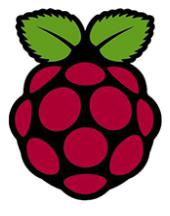
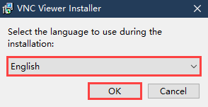
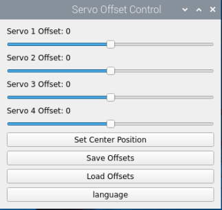
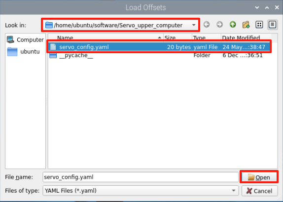

# 1. Read First

## 1.1 Introduction to TurboPi

**1.1.1 Product Introduction**

TurboPi is an AI-powered vision wheeled robot developed based on the Raspberry Pi platform. It features a Mecanum wheel chassis and a 2-DOF pan-tilt camera. Supporting Python programming, TurboPi is capable of ultrasonic distance-based obstacle avoidance, AI color recognition, object tracking, visual line following, and more. It serves as an excellent tool for users to explore robotics and AI technologies while enjoying the fun brought by innovation.


**1.1.2 Usage Precautions**

Please pay attention to the following points when using and storing this product:

(1) This product contains conductive components. Avoid contact with metal objects when powered on.

(2) After the robot is powered on, do not forcibly move the servo, as this may cause damage.

(3) If the robot runs for an extended period, the servos may become hot. Allow the robot to "**rest**" and wait for the servos to cool before resuming operation.

(4) Keep your face, glasses, and other body parts away from the robot while it is operating. Do not place fingers within the joint movement range to prevent injury. Also, be cautious of falls from high edges.

(5) The robot's servos are precision components and consumable parts. They may need replacement after long-term or intensive use.

(6) If the product will not be used for an extended period, fully charge the battery, remove it, and store it in a cool, dry place.

**1.1.3 Copyright Notice**

This manual is the property of Shenzhen Hiwonder Technology Co., Ltd. No organization or individual is permitted to reproduce, copy, translate, or distribute any content from this manual without authorization.
Any unauthorized use or infringement of this manual's copyright will be subject to legal action by our company.

**1.1.4 Disclaimer**

The product described in this manual (including hardware, software, etc.) is provided "**as is**". Every effort has been made to ensure the accuracy of this manual, but we cannot guarantee it is completely free from errors or omissions. This document is regularly reviewed, and we welcome feedback for improvements.
Product features and specifications may change with version upgrades. For the latest product information, please contact customer service when placing your order.
Furthermore, unless explicitly stated by Hiwonder, we are not responsible for any losses resulting from product malfunctions or damage under extreme conditions outside of typical use cases.

## 1.2 Package List

(1) TurboPi Standard Packing List

<table class="docutils-nobg" border="1" style="text-align: center">
  <thead>
    <tr>
      <th>No.</th>
      <th style="text-align: center;width:33%">Components</th>
      <th>Quantity</th>
      <th>Picture</th>
    </tr>
  </thead>
  <tbody>
    <tr>
      <td>1</td>
      <td>Chassis</td>
      <td>1</td>
      <td></td>
    </tr>
    <tr>
      <td>2</td>
      <td>Base bracket</td>
      <td>1</td>
      <td></td>
    </tr>
    <tr>
      <td>3</td>
      <td>Tail extension bracket</td>
      <td>1</td>
      <td></td>
    </tr>
    <tr>
      <td>4</td>
      <td>Pan-head U-shaped bracket</td>
      <td>1</td>
      <td></td>
    </tr>
    <tr>
      <td>5</td>
      <td>Ultrasonic wave bracket</td>
      <td>1</td>
      <td></td>
    </tr>
    <tr>
      <td>6</td>
      <td>Pan-tilt camera holder</td>
      <td>1</td>
      <td></td>
    </tr>
    <tr>
      <td>7</td>
      <td>Raspberry Pi 5 </td>
      <td>1</td>
      <td></td>
    </tr>
    <tr>
      <td>8</td>
      <td>Raspberry Pi expansion board</td>
      <td>1</td>
      <td></td>
    </tr>
    <tr>
      <td>9</td>
      <td>Active heatsink + Thermal silicone pads</td>
      <td>1</td>
      <td></td>
    </tr>
    <tr>
    <td>10</td>
      <td>Raspberry Pi boardcard reader</td>
      <td>1</td>
      <td></td>
    </tr>
    <tr>
      <td>11</td>
      <td>32G TF card</td>
      <td>1</td>
      <td></td>
    </tr>    
    <tr>
      <td>12</td>
      <td>USB cable</td>
      <td>1</td>
      <td></td>
    </tr>
    <tr>
      <td>13</td>
      <td>HD camara</td>
      <td>1</td>
      <td></td>
    </tr>
    <tr>
      <td>14</td>
      <td>LFD-01 micro servo</td>
      <td>2</td>
      <td></td>
    </tr>
    <tr>
      <td>15</td>
      <td>4-channel line follower</td>
      <td>1</td>
      <td></td>
    </tr>
    <tr>
      <td>16</td>
      <td>Glowy ultrasonic sensor</td>
      <td>1</td>
      <td></td>
    </tr>
    <tr>
      <td>17</td>
      <td>18650 battery case</td>
      <td>1</td>
      <td></td>
    </tr>
    <tr>
      <td>18</td>
      <td>Lithium baterries</td>
      <td>2</td>
      <td></td>
    </tr>
    <tr>
      <td>19</td>
      <td>Micro USB cable</td>
      <td>1</td>
      <td></td>
    </tr>
    <tr>
      <td>20</td>
      <td>Battery charge</td>
      <td>1</td>
      <td></td>
    </tr>
    <tr>
      <td>21</td>
      <td>TT motors</td>
      <td>4</td>
      <td></td>
    </tr>
    <tr>
      <td>22</td>
      <td>Mecanum wheels <br> (Wheel A *2; Wheel B *2)</td>
      <td>4</td>
      <td></td>
    </tr>
    <tr>
      <td>23</td>
      <td>Coupling + disc head half machine tooth tapping</td>
      <td>4</td>
      <td>
        
        
      </td>
      <tr>
      <td>24</td>
      <td>Balls</td>
      <td>3</td>
      <td></td>
    </tr>
    <tr>
      <td>25</td>
      <td>4pin wire</td>
      <td>3</td>
      <td></td>
    </tr>
        <tr>
      <td>26</td>
      <td>Ribbon</td>
      <td>5</td>
      <td></td>
    </tr>
    <tr>
      <td>27</td>
      <td>Screwdriver</td>
      <td>1</td>
      <td></td>
    </tr>
    <tr>
      <td>24</td>
      <td>Accessory bag<br>(M2*8 Knurled double pass copper column*4<br>M2*4 round head screw*15<br>M2*12 round head screw*2<br>M2.5*6 round head screw*9<br>M3*25 round head screw*12<br>M4*8 round head screw*15<br>M3*6 round head screw*8<br>M2*4 round head self-tapping screw*12<br>M2*6 round head self-tapping screw*2<br>M3*4 flat head screw*8<br>double-ended nylon
spacer*6<br>single-ended nylon
spacer*6<br>M3 nut*12<br>M2 nut*4<br>Nylon rivet*3)</td>
      <td>1</td>
      <td></td>
    </tr>
  </tbody>
</table>
(1) Advanced Packing List

<table class="docutils-nobg" border="1" style="text-align: center">
  <thead>
    <tr>
      <th>No.</th>
      <th style="text-align: center;width:33%">Components</th>
      <th>Quantity</th>
      <th>Picture</th>
    </tr>
  </thead>
  <tbody>
    <tr>
      <td>1</td>
      <td>Chassis</td>
      <td>1</td>
      <td></td>
    </tr>
    <tr>
      <td>2</td>
      <td>Base bracket</td>
      <td>1</td>
      <td></td>
    </tr>
    <tr>
      <td>3</td>
      <td>Tail extension bracket</td>
      <td>1</td>
      <td></td>
    </tr>
    <tr>
      <td>4</td>
      <td>Pan-head U-shaped bracket</td>
      <td>1</td>
      <td></td>
    </tr>
    <tr>
      <td>5</td>
      <td>Ultrasonic wave bracket</td>
      <td>1</td>
      <td></td>
    </tr>
    <tr>
      <td>6</td>
      <td>Pan-tilt camera holder</td>
      <td>1</td>
      <td></td>
    </tr>
    <tr>
      <td>7</td>
      <td>Raspberry Pi 5 </td>
      <td>1</td>
      <td></td>
    </tr>
    <tr>
      <td>8</td>
      <td>Raspberry Pi expansion board</td>
      <td>1</td>
      <td></td>
    </tr>
    <tr>
      <td>9</td>
      <td>Active heatsink + Thermal silicone pads</td>
      <td>1</td>
      <td></td>
    </tr>
    <tr>
    <td>10</td>
      <td>Raspberry Pi boardcard reader</td>
      <td>1</td>
      <td></td>
    </tr>
    <tr>
      <td>11</td>
      <td>32G TF card</td>
      <td>1</td>
      <td></td>
    </tr>    
    <tr>
      <td>12</td>
      <td>USB cable</td>
      <td>1</td>
      <td></td>
    </tr>
    <tr>
      <td>13</td>
      <td>HD camara</td>
      <td>1</td>
      <td></td>
    </tr>
    <tr>
      <td>14</td>
      <td>LFD-01 micro servo</td>
      <td>2</td>
      <td></td>
    </tr>
    <tr>
      <td>15</td>
      <td>4-channel line follower</td>
      <td>1</td>
      <td></td>
    </tr>
    <tr>
      <td>16</td>
      <td>Glowy ultrasonic sensor</td>
      <td>1</td>
      <td></td>
    </tr>
    <tr>
      <td>17</td>
      <td>18650 battery case</td>
      <td>1</td>
      <td></td>
    </tr>
    <tr>
      <td>18</td>
      <td>Lithium baterries</td>
      <td>2</td>
      <td></td>
    </tr>
    <tr>
      <td>19</td>
      <td>Micro USB cable</td>
      <td>1</td>
      <td></td>
    </tr>
    <tr>
      <td>20</td>
      <td>Battery charge</td>
      <td>1</td>
      <td></td>
    </tr>
    <tr>
      <td>21</td>
      <td>TT motors</td>
      <td>4</td>
      <td></td>
    </tr>
    <tr>
      <td>22</td>
      <td>Mecanum wheels <br> (Wheel A *2; Wheel B *2)</td>
      <td>4</td>
      <td></td>
    </tr>
    <tr>
      <td>23</td>
      <td>Coupling + disc head half machine tooth tapping</td>
      <td>4</td>
      <td>
         
      </td>
      <tr>
      <td>24</td>
      <td>Balls</td>
      <td>3</td>
      <td></td>
    </tr>
    <tr>
      <td>25</td>
      <td>4pin wire</td>
      <td>3</td>
      <td></td>
    </tr>
        <tr>
      <td>26</td>
      <td>Ribbon</td>
      <td>5</td>
      <td></td>
    </tr>
    <tr>
      <td>27</td>
      <td>Screwdriver</td>
      <td>1</td>
      <td></td>
    </tr>
    <tr>
      <td>28</td>
      <td>Accessory bag<br>(M2*8 Knurled double pass copper column*4<br>M2*4 round head screw*15<br>M2*12 round head screw*2<br>M2.5*6 round head screw*9<br>M3*25 round head screw*12<br>M4*8 round head screw*15<br>M3*6 round head screw*8<br>M2*4 round head self-tapping screw*12<br>M2*6 round head self-tapping screw*2<br>M3*4 flat head screw*8<br>double-ended nylon
spacer*6<br>single-ended nylon
spacer*6<br>M3 nut*12<br>M2 nut*4<br>Nylon rivet*3)</td>
      <td>1</td>
      <td></td>
    </tr>
     <tr>
      <td>29</td>
      <td>WonderEcho Pro AI Voice interaction box</td>
      <td>1</td>
      <td></td>
    </tr>
    <tr>
      <td>30</td>
      <td>WonderEcho Pro AI Voice interaction box</td>
      <td>1</td>
      <td></td>
    </tr>
  </tbody>
</table>

## 1.3 Introduction to Raspberry Pi 5

Raspberry Pi, RPi or RasPi for short, is a credit card-sized computer developed by the Raspberry Pi Foundation in the UK. It was created with the vision of helping children around the world learn programming and understand how computers work. Raspberry Pi can be connected to a keyboard, mouse, and Ethernet cable. It includes both analog video output and HDMI high-definition video output, making it accessible to users of all ages. It's an excellent tool for learning programming languages like Python. In addition to learning, Raspberry Pi can handle many of the tasks a desktop computer can do, such as web browsing, playing HD videos, working with spreadsheets, word processing, and even gaming! 



<p style="text-align:center">Raspberry Pi Logo</p>

**1.3.1 Overview of Raspberry Pi 5**

Raspberry Pi 5 features a 64-bit quad-core Cortex A76 processor with 2.4 GHz operating frequency. Compared to the Raspberry Pi 4, the CPU performance has increased by 2 to 3 times. Apart from the significant improvement in graphics performance with the 800MHz VideoCore VII GPU, it also supports dual 4Kp60 display output via HDMI, and advanced camera through restructuring Raspberry Pi Image Signal Processor. It provides consumers with a smooth desktop experience and opens up new applications for industrial customers.

This is the first full-sized Raspberry Pi computer, utilizing chips built internally by Raspberry Pi. RP1 provides the majority of the I/O functions for Raspberry Pi 5 and achieves a significant leap in peripheral performance and functionality. The total USB bandwidth has more than doubled, thus speeding up the transfer rate to external UAS drives and other high-speed peripherals. The dedicated dual-channel 1Gbps MIPI camera and display interface on earlier models have been replaced by a pair of quad-channel 1.5Gbps MIPI transceivers, tripling the total bandwidth and supporting a maximum of two cameras or displays in any combination. By supporting SDR104 high-speed mode, the peak performance of the SD card is doubled. This platform introduces a single-channel PCI Express 2.0 interface for the first time, providing support for high-bandwidth peripherals.

**1.3.2 Structure and Features of Raspberry Pi 5**

* **Hardware Layout**


* **Main features**

(1) Four Arm Cortex-A76 cores @ 2.4GHz, with hardware AES encryption support, 512KB L2 cache per core, and a 2MB L3 cache;

(2) 4GB or 8GB LPDDR4X-4267 SDRAM;

(3) Dual 4Kp60 HDMI display output, supporting HDR, and a 4Kp60 HEVC decoder;

(4) VideoCore VII Graphics, support OpenGL-ES 3.1、Vulkan 1.2;

(5) Raspberry Pi Image Signal Processor (ISP);

(6) The Raspberry Pi PCIe connector provides one PCIe 2.0 lane and requires an additional HAT for use;

(7) 802.11ac dual-band Wi-Fi and Bluetooth 5.0 with BLE support;

(8) Gigabit Ethernet;

(9) 2 × USB 2.0 ports and 2 × USB 3.0 ports, full bandwidth supported simultaneously;

(10) PoE support, PoE HAT required;

(11) Dual-channel, 4-lane MIPI CSI/DSI transceivers, supporting combinations of 2 × displays, 2 × cameras, or 1 display + 1 camera;

(12) 40-pin Raspberry Pi GPIO header;

(13)  Fan connector;

(14) Real-Time Clock (RTC);

(15) Power button;

**Advantages**

(1) Powerful computational performance;

(2) Open-source hardware and ease of use;

(3) Free development tools compared to Microsoft-based platforms;

(4) Cost-effective development platform and useful for troubleshooting;

(5) All applications can be used offline;

(6) Compact size—credit card dimensions;

Thanks to these advantages, Raspberry Pi is widely used around the world to learn programming, build hardware projects, develop home automation systems, and even for industrial applications. 

**1.3.3 Dimension Diagram (unit: mm)**


**1.3.4 The Use of Raspberry Pi**

(1）Web server

Raspberry Pi consumes very little power, allowing it to run 24/7 without the need for cooling fans. It is capable of serving web pages over the internet or a local network at adequate speeds.

(2）Laptop

Connecting Raspberry Pi to a monitor, you can make yourself a laptop. 

(3）Home theater set-top box

With various free operating systems available, Raspberry Pi can be transformed into a set-top box for streaming your favorite content. 

(4）Game simulator

With the free RetroPie OS, Raspberry Pi can run games from platforms like Game Boy, arcade systems, SNES, and more. 

(5）Surveillance Monitor 

A simple surveillance system can be built using a Raspberry Pi and an external camera with minimal investment.

(6）Wi-Fi Range Extender 

If certain areas of your home have weak Wi-Fi signals, Raspberry Pi can help by acting as a repeater. Just add a USB Wi-Fi adapter to relay the signal. 

(7）Music streamer and multi-room audio

With the right software and a few Raspberry Pi boards, you can create an affordable multi-room audio system for music playback throughout your home. 


These are just some of the many use cases of Raspberry Pi. It's not only a powerful development tool but also a handy companion in everyday life. More applications await your exploration! 

## 1.4 Burn Raspberry Pi Image

:::{Note}

Raspberry Pi can work after operating system is installed to SD card. System image and tools can be found in the same folder.

The SD card included with this product has been preloaded with the system image. There is no need to reflash the image as instructed in this course.

Flashing a new image will format the SD card, erasing all existing data. Please back up any important files before proceeding.

This section is part of a general-purpose course. The image file names shown are for demonstration only—please refer to the actual image file provided with your product.

:::

**1.4.1 Preparation**

**(1) Hardware:**

Prepare a card reader, SD card (over 32GB) and a computer (WIN10).

**(2) Software:**

Install SD card formatting tool, SD Card Formatter and image burning tool, Win32DiskImager. This section uses these two tools as examples for illustration.

**1.4.2 Format SD Card** 

:::{Note}

if SD card is empty, you can skip this step.

:::

(1) Insert SD card to card reader, and then connect it to your computer.

(2) Open SD Card Formatter. Select corresponding card, and then click "**Format**".


(3) If window below appears, click "**Yes**". It takes time to format. Please be patient!


**1.4.3 Burn Image**

(1) Open Win32DiskImager. Click on  to select system image. (TurboPi image can be found in the same folder. Download and extract the image before operation. The following pictures are just for reference, please subject to the actual TurboPi's system image.) In "**Device**" bar, select boot of SD card. Next, click "**Write**".


:::{Note}

The storage path for image file cannot contain Chinese.

:::

(2) Click "**Yes**" when the following window pops up.


(3) Once "**Write Successful**" prompt shows up, the image is written successfully. If error is reported, please close firewall, and then reinsert SD card to operate again.


:::{Note}

If you are asked to whether to format partition after writing image, just ignore it.

:::

(4) After the image has been successfully flashed, eject the SD card and remove it from the card reader. Then insert it into the Raspberry Pi mainboard as shown in the figure below.


<p id="anchor_1_5"></p>

## 1.5 Assembly 

<p class="step">Step1：Install ultrasonic sensor and pan-tilt servo</p>


<p class="step">Step2：Install Mecanum wheel chassis</p>


<p class="step">Step3：Install line follower</p>


<p class="step">Step4：Install pan-tilt servo bracket</p>


<p class="step">Step5：Install Raspberry Pi 5 and expansion board</p>


<p class="step">Step6：Ultrasonic sensor and line follower wiring</p>


<p class="step">Step7：Install battery box</p>


<p class="step">Step8：Install  U shaped bracket and Mecanum wheels </p>


<p class="step">Step9：Install head servo and camera</p>


<p class="step">Step10：Wiring Diagram</p>


<p class="step">Step11：Install top bracket</p>


<p class="step">Post installation</p>


<p id="anchor_1_6"></p>

## 1.6 Charging and Power-On Status Description

:::{Note}

Before powering on, please make sure the robot is fully assembled according to the instructions in  [1.5 Assembly](#anchor_1_5)

:::

**1.6.1 Battery Charging and Installation**

Due to transportation restrictions, the battery is not fully charged upon delivery. It is recommended to fully charge the battery before the first use. Follow the steps below:

(1) Put two 18650 batteries into the battery charger. Note: Don't invert battery terminals! Then connect battery charger and charger head of 5V 3A (It is not included, and you need to use your own charger head.) Lastly, plug the charger head into power outlet.


(2) The charger's indicator light is green when unplugged, and turns red when charging. It takes approximately 3 hours to fully charge the batteries and the light turns green again. Unplug the charger promptly after charging. Do not leave it connected for an extended period.

**1.6.2 Installing the Battery**

(1) Before installing, make sure the switch on the battery case is set to **"OFF".**


(2) Insert the fully charged batteries into the battery case and close the battery cover. Caution: Do not reverse the battery polarity!

**1.6.3 Check Whether Camera is Connected**

Before powering on, ensure the camera's USB cable is securely connected. It can be plugged into any of the four USB ports on the Raspberry Pi controller.


**1.6.4 Start TurboPi**

(1) Turn on battery case. Then start TurboPi. (The switch is on Raspberry Pi expansion board.) At this time, LED1 and LED 2 on Raspberry Pi keep on. Then LED2 flickers every 1s, pan tilt recovers initial posture and buzzer emits a beep, which means that TurboPi boots up successfully. 

:::{Note}

* The Raspberry Pi is a computer and requires some time to boot. Startup takes around 30 seconds, so please be patient. 
* LED1 is the power indicator. It lights up when powered and stays on during operation. If it dims, it means the battery is low and needs to be recharged.
* LED2 is the communication indicator. By default, the device uses AP (Access Point) mode, where LED2 blinks once every second after boot-up. If switched to LAN mode, LED2 will stay on constantly. For more details, refer to"[**2.Quick User Experience\2.1 APP Installation and Connection**](2.quick_user_experience.md#app-installation-and-connection)".

* If both LED1 and LED2 are dim and remain constantly on, the battery is low and needs recharging.

  :::

(2) Upon successful startup, the device will automatically generate a Wi-Fi hotspot beginning with "**HW**" in AP mode.


**1.6.5 Run Self-detection Program**

After robot starts, you can press KEY1 to run self-detection program to detect servos and motors so as to ensure wiring is correct. 
If robot cannot move as below after self-detection program runs, you need to rewire according to "[**Read First\1.5 Assembly**](#anchor_1_5)".

(1) Press KEY1 on expansion board to start self-detection.


(2) Servos and motors move in the order as pictured.


**1.6.6 Check Battery Level**

There are two ways to check battery level. 

**Method 1: Low Voltage Alarm**

The robot has a low voltage alert. When the voltage drops below 7.1V, the buzzer will emit a continuous beeping sound.

If the LED on the Raspberry Pi expansion board shows a weak blue light, the battery is too low to keep the device running and needs to be recharged immediately.


**Method 2: App Interface**

The real-time battery level is displayed on the video feedback screen in the app. When the voltage drops below 7.1V, a low battery warning is shown and the battery must be recharged promptly. For more on the app experience, see  "[**Play Modes in the App**](2.quick_user_experience.md#play-modes-in-the-app)" 


Having completed above operations, calibrate deviation of pan tilt according to "[ **Read First\1.9 Adjust Pan-Tilt**](#anchor_5)". Please don't skip this step.

<p id="anchor_1_7"></p>

## 1.7 Remote Desktop Installation and Connection

:::{Note}

For this section, you'll need a laptop. If you're using a desktop, make sure you have a wireless network adapter. You can refer to the demonstration video in this section's folder.
This guide uses the Windows version as an example. For Mac installation, please search for relevant resources online.

:::

**1.7.1 Getting Started**

* **Installing the VNC Remote Tool**

If you wish to operate the robot from your computer, view the program logic, or modify the code in the future, you need to install the VNC software by following the steps in this chapter.

VNC (Virtual Network Computing) is a graphical remote desktop control software. By connecting to the Wi-Fi hotspot broadcast by the Raspberry Pi, you can remotely control the device from your computer. The steps below explain how to install and use VNC Viewer.

(1) Double-click the installation program [VNC-Viewer-6.17.731-Windows](resources_download.md) in the same directory as this section. choose the installation language as **"English",** then click **"OK".**



(2) On the next screen, click **"Next".**


(3) Agree to the license agreement, then click **"Next".** Keep the default installation path, and click **"Next".**


(4) Click **"Install"** to begin installation.


(5) Wait for the installation to complete, then click **"Finish".** 


(6) After installation, launch VNC Viewer by clicking its desktop icon   .

* **Power on**

Follow the previous steps to assemble the hardware and connect the power adapter. Flip the power switch on the Raspberry Pi expansion board to the "**ON**" position. Wait a few seconds. Once LED2 on the expansion board switches from being constantly on to blinking once every second, the device has successfully powered on.

**1.7.2 Connect to Robot**

(1) After the robot is powered on, it will create a Wi-Fi hotspot starting with **"HW".** On your computer, open the Wi-Fi settings and search for a network with a name that begins with **"HW",** as shown below:


(2) Input password. The password is **"hiwonder"**.


(3) After connection, open VNC Viewer. Input the default IP address of Raspberry Pi, **192.168.149.1**, and then press Enter. If you receive security warning, select **"Continue"**.


(4) A login dialog box will pop up, asking for Username and Password.

The default login credentials depend on the controller version and product type for TurboPi, MasterPi, and ArmPi mini.

① For Pi 4B 

**Username**: pi   

**Password:** raspberry

② For Pi5

**Username:** pi 

**Password:** raspberrypi

For other products, all versions of Raspberry Pi controller adapts

**Username:** pi 

**Password:** raspberrypi.

Check the **"Remember password"** option, then click **"OK"**. You should now see the Raspberry Pi desktop.


(5)  There may be a warning dialog box, which is a standard Raspberry Pi message. Click **"OK"** to close it. If the screen is black and only a cursor is visible, try restarting the Raspberry Pi.

:::{Note}

Each feature experiment will have detailed startup steps in the subsequent course chapters. Please follow them accordingly.

:::


**1.7.3 Introduction to Desktop**

The desktop is as pictured after connecting Robot through VNC successfully.


The following table demonstrates common functions:

<table  class="docutils-nobg" border="1">
<colgroup>
<col  />
<col  />
</colgroup>
<tbody>
<tr>
<td >Icon</td>
<td >Function</td>
</tr>
<tr>
<td ></td>
<td ><p>Application menu. Click to select different applications.</p>
<p></p></td>
</tr>
<tr>
<td ></td>
<td >Browser.</td>
</tr>
<tr>
<td ></td>
<td >File manager.</td>
</tr>
<tr>
<td ></td>
<td >LX terminal. Click to input command line in the opened interface.</td>
</tr>
<tr>
<td ></td>
<td >Trash. You can find the files deleted here.</td>
</tr>
<tr>
<td ></td>
<td >PC software. You can adjust pan tilt and adjust color threshold on it.</td>
</tr>
<tr>
<td ></td>
<td >Full screen or exit full screen.。</td>
</tr>
<tr>
<td ></td>
<td >Exit full screen.</td>
</tr>
<tr>
<td ></td>
<td ><p>Shut down, reboot and logout</p>
<p></p></td>
</tr>
</tbody>
</table>


## 1.8 Introduction to Docker Container and How to Access

**1.8.1 Introduction to Docker**

Docker is an open-source platform and tool that helps you package, distribute, and run applications in containers. A container is a lightweight, standalone, and executable software package that includes everything needed to run an application: code, runtime, system tools, libraries, and settings. Docker allows developers to bundle applications with their dependencies—not just the app itself—so they can be deployed quickly and consistently across different environments.

Technically, Docker leverages Linux containerization technology to ensure higher isolation between applications. This enables multiple containers to run on the same physical machine while remaining completely independent from each other.

In summary, Docker can be understood as a tool that improves application portability and ease of management, greatly simplifying software development and deployment.


<p style="text-align:center">Docker's Logo</p>

For further learning about Docker, you may refer to the relevant lessons in "**Docker Container Tutorial**" within the course materials, or visit official Docker resources and websites for more information.

Official Website: http://www.docker.com

Chinese Website: https://www.docker-cn.com

Docker Hub (Image Repository): <https://hub.docker.com>

**1.8.2  Common Docker Commands**

All functionalities and programs of this product are designed to run inside Docker containers. To help users get started quickly, the following section introduces commonly used Docker commands.

(1) Power on the device. Use the VNC Remote Desktop Tool to connect to the robot system via remote desktop under the directory of [1.7 Remote Desktop Installation and Connection](#anchor_1_7).


(2) Click the top-left desktop icon  to open the Terminator ROS2 terminal.


This is the command-line interface of the Raspberry Pi.

(3) Double-click the "**Tool**" icon  to launch the robot system configuration tool, then click "**Execute**".


(4) and select the appropriate language model in the pop-up interface. This configuration requires setting up the large model according to the selected language version.


(5) After selection, click **Save \> Apply \> Exit** to activate the new configuration.


(6) When the buzzer beeps once, it means the robot type has been successfully switched. Open the terminal again  to view the ROS2 environment.

<p id="anchor_1_8_2_2"></p>

* **View Containers**

The system is preset to enter the container at startup. The following is for your understanding.

Command syntax: docker ps \[OPTIONS\]

Common options:

① -a: Lists all containers, including running and exited

② -l: Shows the most recently created container

③ -n=?: Shows the most recent n containers

④ -q: Quiet mode, only shows container IDs

This command displays all running and previously run containers. Output includes the container ID, image name, creation time, and current status.

```
docker ps -a
```


* **Enter a Container**

**The system is preset to enter the container at startup. The following is for your understanding.**

Use the container ID obtained in section "[**1.8.2  Common Docker Commands -> View Containers**](#anchor_1_8_2_2)" to enter the container that contains the functional programs.

You can shorten the container ID as long as it remains unique.


* **Exit a Container**

There are two ways to exit:

(1) Enter the command directly in the terminal and press Enter — this will stop the container and exit.

```
exit
```

(2) Use the shortcut key combination **Ctrl + P + Q** — this will detach from the container without stopping it. You can then enter a command in the terminal to check the running containers.

```
docker ps
```


<p id="anchor_5"></p>

## 1.9 Adjust Pan-Tilt

 If servo main shaft or other operations deviates during assembling TurboPi, you need to calibrate deviation. The deviation is divided into two cases: small deviation and large deviation. Depending on the situation, the debugging methods also vary. See below to check how to calibrate deviation under two cases.

**1.9.1 Preparation**

(1) Start TurboPi according to "**[1.6 Charging and Power-On Status Description](#anchor_1_6)**"

(2) Connect to TurboPi system desktop through VNC according to the instruction in "**[1.7 Remote Desktop Installation and Connection](#anchor_1_7)**"

**1.9.2  Judge the Deviation Degree**

(1) Servos automatically reset as TurboPi starts. If these three parts of robot are parallel, you don't need to calibrate deviation and skip following operations.


(2) If the angle between servo and center line is less than 13°, you can directly adjust the deviation through PC software since the deviation is minor. For detailed instruction, please refer to "[**1.9.3 Calibrate Minor Deviation**](#anchor_1_9_3)".


(3) If the angle between servo and center line is greater than 13°, you cannot directly adjust the deviation through PC software since the deviation is large. For detailed instruction, please refer to "[**1.9.4 Calibrate Large Deviation**](#anchor_1_9_4)".


<p id="anchor_1_9_3"></p>

**1.9.3 Calibrate Minor Deviation**

For minor deviation, you can directly drag slider on PC software framed on the picture below to adjust deviation. Open  and then select "**Execute**" to open PC software.




(1) Drag servo2 slider to adjust NO.2 servo so as to make U-shaped bracket of TurboPi parallel with the base bracket.

:::{Note}
 adjustment range is from 1350 to 1650. If they are still not parallel when you adjust the slider within this range, it means that the deviation is great, so you need to calibrate the deviation according to "[**1.9.4 Calibrate Large Deviation**](#anchor_1_9_4)".
:::



(2) Click "**Save**" to save the deviation value.


<p id="anchor_1_9_4"></p>

**1.9.4 Calibrate Large Deviation**

Before calibrating large deviation, you need to remove the servo from pan tilt. Next, center the servo, and then calibrate the deviation.

(1) Servos automatically reset as TurboPi starts. Obviously, NO.2 servo has deviation. Angle between servo and center line is greater than 13°. 


(2) Turn off TurboPi. Never operate when TurboPi is turned on.

(3) Remove screw on the main shaft of NO.2 servo. 


(4) Slightly pull out the U-shaped bracket.


(5) Turn on robot. (The switch is on Raspberry Pi) Robot emits a beep when it starts. At this time, servos are automatically centered. After servos are centered, turn off robot.

(6) Install U-shaped bracket on NO.2 servo as pictured. 

:::{Note}

Don't move servo when installing the bracket. If you move the servo accidentally, please repeat Step 5.

:::


(7) Put the screw back. Then make fine adjustment according to "[**1.9.3 Calibrate Minor Deviation**](#anchor_1_9_3)".
