# 2. Quick User Experience

## 2.1 APP Installation and Connection 

This lesson will introduce how to install the app on your phone and connect it to your TurboPi.

:::{Note}

① Please grant all permissions requested during installation to ensure the app functions properly.

② Make sure your phone’s location services (GPS) and Wi-Fi are enabled before launching the app.

:::

### 2.1.1 Installation

For Android devices:**[APP Installation Pack (Android)](https://play.google.com/store/apps/details?id=com.Wonder.Pi)**

For iOS devices : Go to the App Store, search for “[WonderPi](https://apps.apple.com/cn/app/wonderpi/id1477946178)”, and download the app.

The WonderPi app is used to control the TurboPi robot. In this lesson, we’ll guide you through how to connect TurboPi with the app.

:::{Note}

- Before connecting, make sure TurboPi is powered on.

- Turn on your phone’s GPS and Wi-Fi before opening the app.

- This guide uses an Android device as an example; the steps are similar for iOS.

:::

### 2.1.2 APP Connection

(1) Turn on the power switch on the Raspberry Pi expansion board to start TurboPi. For detailed steps, refer to: "[Read First\1.6 Charging and Power-On Status Explanation](https://docs.hiwonder.com/projects/TurboPi/en/latest/docs/1.getting_ready.html#charging-and-power-on-status-description)".

(2) Once TurboPi is successfully powered on, it will enter AP (Access Point) Mode and create a Wi-Fi hotspot beginning with **“HW”**.

* **Connection Modes Overview**

There are two connection modes, namely direct connection mode and LAN mode. APP functions are the same under these two modes.

(1) AP direct connection mode: TurboPi creates a hotspot that your phone can connect to directly, but no Internet access in this mode.

(2) STA LAN mode: TurboPi connects to a specified Wi-Fi network, and Internet access is available in this mode.

* **Connecting in AP Mode (Recommended First Step)**

When TurboPi powers on, it automatically enters AP mode and broadcasts a hotspot starting with “HW”.

(1) 1)Open the WonderPi app and select **"Standard" > "TurboPi"**.

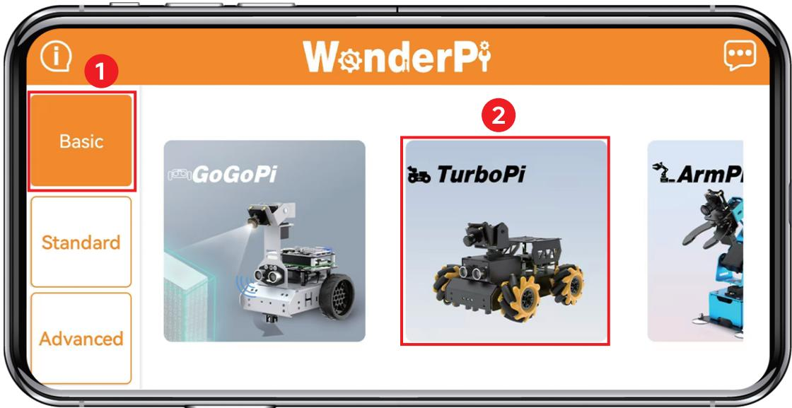

(2) Tap **"+"** in bottom right corner, and then select **Direct Connection Mode**.

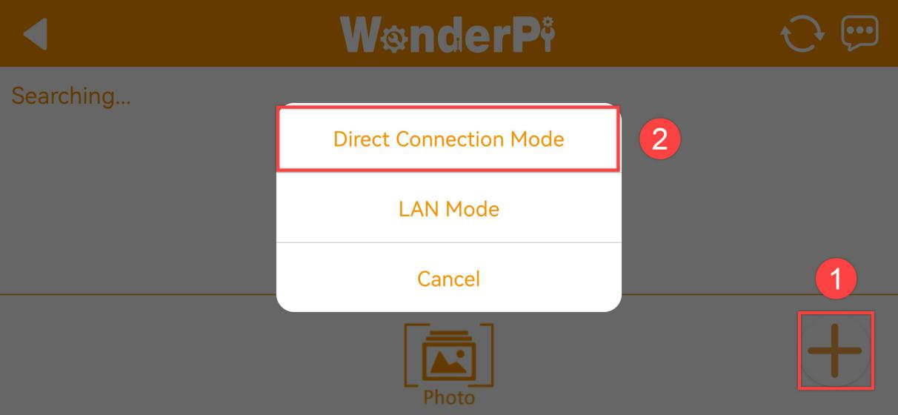

(3)  Tap **“Go to connect device hotspots”**, which will take you to the Wi-Fi settings page. Find the Wi-Fi hotspot that starts with **“HW”** and connect to it by entering the password: **hiwonder.**

(4) After connecting, return to the WonderPi app.

:::{Note}
For iOS users: Make sure the Wi-Fi icon appears in the status bar before switching back to the app, or the device might not be detected. If the app doesn’t detect the device right away, tap the refresh icon  in the upper-right corner.
:::

(5) Once the app connects to TurboPi, you’ll see an icon like the one below indicating a successful connection.

:::{Note}
if you are informed of "No Internet. Whether to keep connection", just select "**keep connected**".
:::

(6) Tap robot icon to enter mode selection interface.

For detailed instructions on each play mode, refer to: "**[2.2 APP Control](#anchor_2)**".

* **Connecting in LAN Mode (STA Mode**)

(1) First, disconnect from TurboPi’s AP mode hotspot and connect your phone to a Wi-Fi network. For example, connect to a network named **“Hiwonder”**.

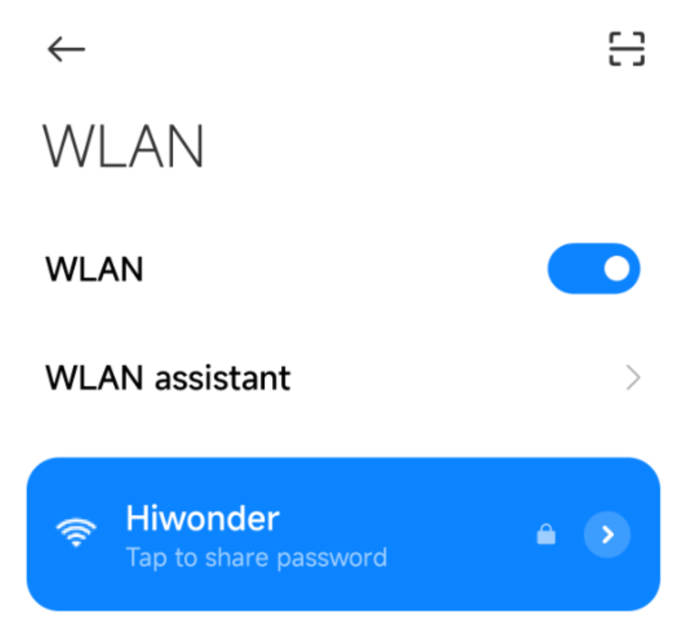

(2) After connection, open **"WonderPi"**. Select **"Standard ->TurboPi"** in sequence.

(3) Tap "**+**" in bottom right corner, and then select LAN Mode.

(4) The app will prompt you to enter the Wi-Fi password for the network you're connected to. Make sure you enter the correct password, a wrong password will prevent the connection. After entering the password, tap **“OK”**.

(5) Tap "**Go to connect device hotspot**"  to switch to the Wi-Fi settings.

(6) Connect to the TurboPi hotspot (starting with “HW”) using the password hiwonder. After connecting, return to the WonderPi app.

(7) It will begin configuring the network automatically.

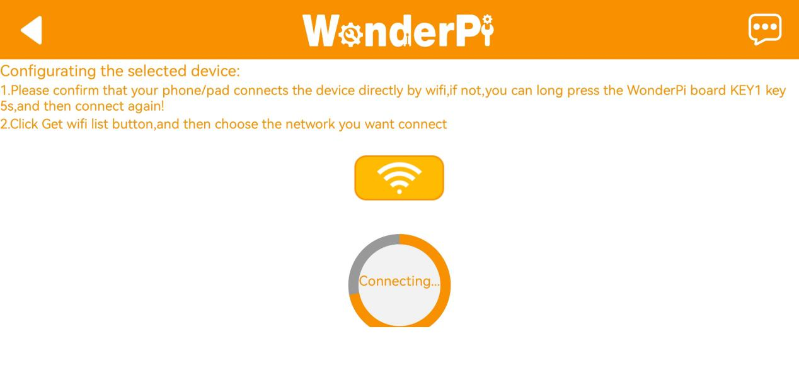

(8) Wait a few seconds. Once the TurboPi icon appears on the main screen and the LED on the expansion board stays on, the setup is complete.

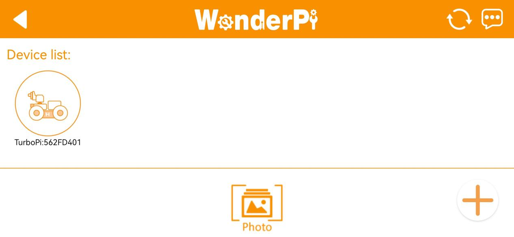

(9) Long-press the TurboPi icon in the app to view its assigned IP address and Device ID.

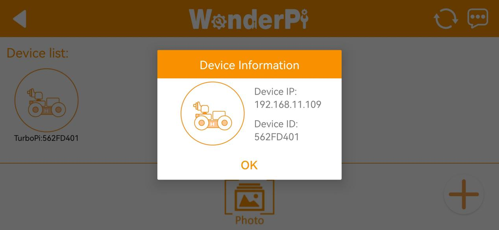

(10)  Tap the TurboPi icon to access the play mode menu.

For detailed introduction to robot games, please refer to the file in"**[2.2 APP Control](#anchor_2)**".

## 2.2 Play Modes in the App

### 2.2.1 Getting Started

Before getting started, make sure TurboPi is powered on.  

Follow the tutorial in [1.Read First->1.9 Pan-Tilt Adjustment]() to calibrate the pan-tilt servo’s position and eliminate any deviation.

Then, refer to [2 Getting Started->2.1 App Installation and Connection->2.1.1 Installation]() to install the WonderPi mobile app and connect it to your TurboPi.

### 2.2.2 Start Exploring Play Modes

Once the connection is successful, tap the TurboPi icon to enter the mode selection screen. Tap any icon on the screen to enter the corresponding play mode.

* **Robot Control**

Tap **“Robot Control"** to enter this mode. The robot will automatically reset to its default posture.

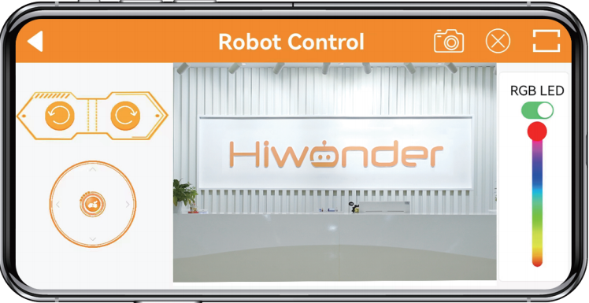

This interface is divided into three sections:

(1) Left Panel – Movement Controls: Use the virtual joystick to control the robot’s movements.

(2) Center Panel – Video Feed & Pan-tilt Control: The center displays the real-time camera feed. You can swipe on the screen to adjust the camera angle.

(3) Right Panel – Ultrasonic RGB Light Control: Use the slider to change the RGB lighting status of the ultrasonic sensor module.

:::{Note}

The camera Pan-tilt has movement limits. If you reach the limit and continue swiping in the same direction, the phone will give haptic feedback. Please stop swiping in that direction.

:::

* **Target Tracking**

:::{Note}

* The selected color range should be appropriate—not too large or too small. A range that's too wide may include unwanted colors, while too narrow may cause the robot to lose track of the target.

* MAvoid having objects with colors similar to the target in the camera view.

:::

(1) Tap **"Pan-tilt Tracking"** to enter the mode. In this mode, the robot car will follow an object based on its color.

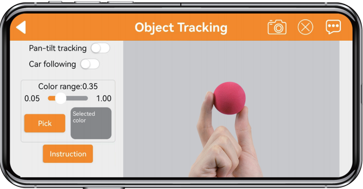

(2) Drag the red circle in the live camera feed to the object you want to track. Tap “Confirm Color” to set the target color.

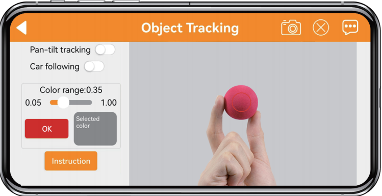

(3) The selected color will be displayed under “Tracking Color”.

(4) Choose a tracking mode, then start the feature. When the target object moves, the robot will follow it.

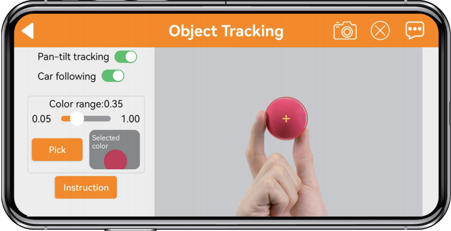

* **Color-Based Line Following**

:::{Note}

* You can use colored tape to create a track.
* Choose a color range that is not too wide or too narrow. Also, make sure no similar colors appear in the camera view.

:::

(1) Tap **“Start Following”** from the mode selection screen to enter this mode. Tap the **“Pick Color”** button.

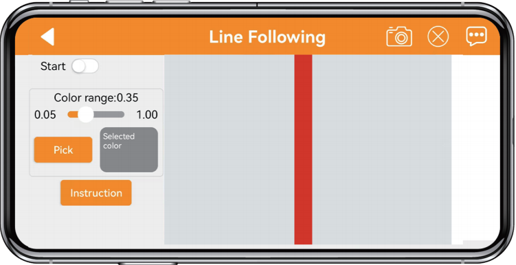

(2) Drag the red circle in the camera feed to the track (e.g., red tape) and tap **“Confirm Color”.**

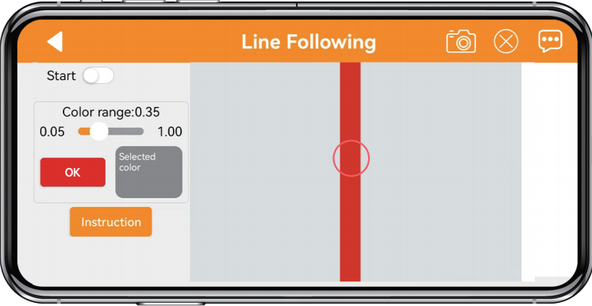

(3) The selected color will be displayed under **“Tracking Color”**.

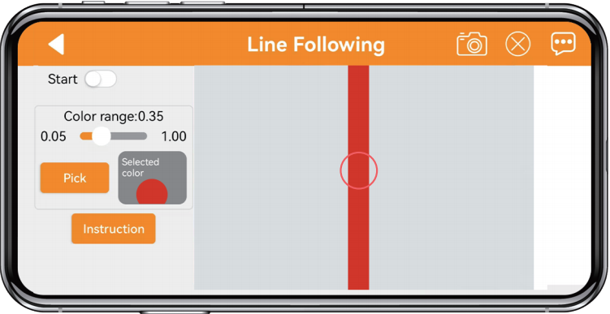

(4) Tap **“Start”** to begin. The robot will follow the colored line automatically.

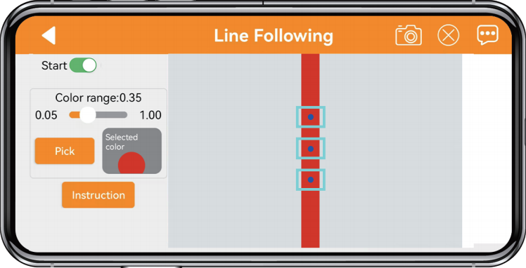

* **QR Code Recognition**

:::{Note}

* The maximum recognition distance is approximately 35 cm (13.8 inches).

* Phone brightness should be neither too dark nor too bright, as it may affect recognition accuracy.

:::

Tap **“QR Code Recognition”** to enter this mode. Tap **“Start”** to activate the feature. Select a QR code tag and hold it in front of the camera, one at a time. Once the robot recognizes the tag, it will execute the corresponding action.

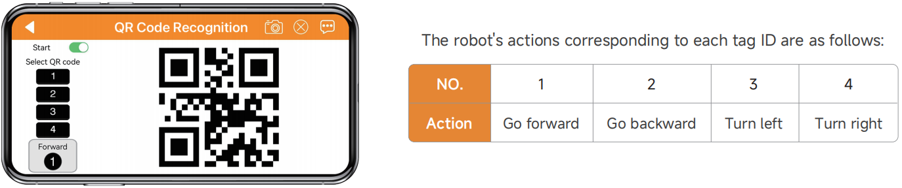

* **Obstacle Avoidance**

:::{Note}

* Place the robot on a spacious surface with enough room to move freely.

* Obstacles should be taller than the ultrasonic sensor for detection.

:::

Tap **“Obstacle Avoidance”** to enter the mode and tap **“Start”** to begin. The robot will move forward automatically. When it detects an obstacle, it will turn left until the path is clear, then continue moving forward.

