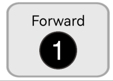
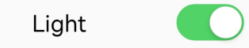
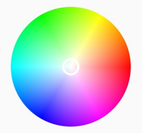
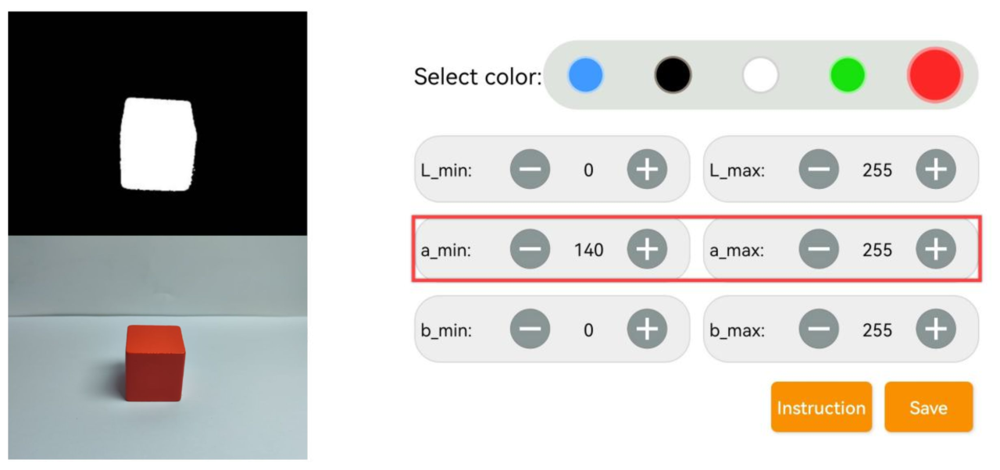

# 2. Quick User Experience

## 2.1 APP Installation and Connection 

The following instructions use TurboPi as an example and apply to other Hiwonder Raspberry Pi series products as well.
In this section, you will learn how to use APP "WonderPi" to control TurboPi. The installation method is as follows.

:::{Note}

① Make sure all APP permissions are turned on in settings, otherwise APP functions will be limited!

② Turn on Location and WiFi before operation.

:::

### 2.1.1 Offline Installation

**[APP Installation Pack (Android)](https://play.google.com/store/apps/details?id=com.Wonder.Pi)**

**[APP Installation Pack (iOS)](https://apps.apple.com/cn/app/wonderpi/id1477946178)**

:::{Note}
- Please turn TurboPi on before connecting. 

- Make sure all APP permissions are turned on in settings, otherwise APP functions will be limited!

- Turn on Location and WiFi before operation.

:::

### 2.1.2 APP Connection

(1) Start robot. (The switch is on Raspberry Pi expansion board). For detailed instruction, please refer to the file in "**[Getting Ready\1.6 Charging and Power-On Status Explanation](https://docs.hiwonder.com/projects/TurboPi/en/latest/docs/1.getting_ready.html#charging-and-power-on-status-description)**".

(2) After TurboPi boots up successfully, it enters AP direct connection mode, and generates a WiFi starting with **"HW"**. Join this WiFi, and then you can experience robot games

* **Introduction to Connection Mode**

There are two connection modes, namely direct connection mode and LAN mode. APP functions are the same under these two modes.

(1) AP direct connection mode: RaspberryPi generates a WiFi which can be connected by phones. But this WiFi has no internet access. 

(2) STA LAN mode: Raspberry Pi actively connects to specific WiFi. In this mode, you can access internet.

* **Direct Connection Mode (MUST-READ)** 

:::{Note}
After TurboPi boots up successfully, it enters AP direct connection mode, and generates a WiFi starting with **"HW"**.
:::

(1) Open"**WonderPi**". Select **"Standard ->TurboPi"** in sequence.

(2) Tap **"+"** in bottom right corner, and then select **Direct Connection Mode**.

(3) Tap **"Go to connect device hotspot"**. Join WiFi starting with "HW". The password is **"hiwonder"**.

(4) Return back to APP after connection.

:::{Note}
 for iOS user, please don't return to APP until WiFi icon appears on status bar, otherwise robot cannot be searched. If robot cannot be searched by APP, tap  to refresh.
:::

(5) APP automatically connects to robot. When robot icon below occurs, connection completes. 

:::{Note}
if you are informed of "No Internet. Whether to keep connection", just select "keep connected".
:::

(6) Tap robot icon to enter mode selection interface.

For detailed introduction to robot games, please refer to the file in "**[2.2 APP Control](#anchor_2)**".

**1.2.3  LAN Connection Mode**

(1) Disconnect the WiFi generated by TurboPi. Connect your phone to a WiFi. Take **"Hiwonder"** as example.

(2) After connection, open **"WonderPi"**. Select **"Standard ->TurboPi"** in sequence.

(3) Tap "+" in bottom right corner, and then select LAN Mode.

(4) Input the password of the WiFi your phone joins. Ensure the password you input is correct, otherwise APP fails to connect to robot. Tap **"OK"**.

(5) Tap "Go to connect device hotspot".

(6) Join the WiFi starting with **"HW".** The password is **"hiwonder"**. After connection, return back to APP.

(7) APP automatically configures network.

(8) After a while, robot icon below occurs, and LED on expansion board keeps on.

(9) Long press robot icon to check TurboPi's IP and ID.

(10) Tap robot icon to enter mode selection interface.

For detailed introduction to robot games, please refer to the file in"**[2.2 APP Control](#anchor_2)**".

## 2.2  APP Control

### 2.2.1 Preparation

Start TurboPi. Then adjust pan tilt deviation according to the file in "**[Getting Ready\1.9 Adjust Pan-Tilt](https://docs.hiwonder.com/projects/TurboPi/en/latest/docs/1.getting_ready.html#id21)**"

Install APP and connect robot to APP according to the instruction in "**[Quick User Experience->2.1.APP Installation and Connection](#anchor_1)**".

### 2.2.2 Experience Robot Games

Tap robot icon to enter mode selection interface.

There are 6 robot games.

* **Robot Control** 

(1) Control TurboPi to move and color of ultrasonic sensor light. The interface is divided into four parts. See below to check functions of icons.

---
① Status bar: exit game, screenshot and hide status bar. 

② Control area: control robot to move.

③ Camera returned image: battery voltage is displayed in bottom right corner.

④ Ultrasonic RGB light adjustment: control the RGB light of ultrasonic module to open, close and emits different colors.

---

|                             Icon                             |                           Function                           |
| :----------------------------------------------------------: | :----------------------------------------------------------: |
|  |       Return. Return back to mode selection interface.       |
|  | Screenshot. Photo is saved in the gallery  |
|  |                        Hide menu bar                         |
|  |        Drag central button to control TurboPi to move        |
|  | Tap or long press this icon to control TurboPi to turn counterclockwise. |
|  | Tap or long press this icon to control TurboPi to turn clockwise. |
|  | Battery level is displayed in the lower right corner (Note: please charge the battery in time when the battery voltage is below 7V) |
|  | Tap the button to turn on or off RGB LED of ultrasonic sensor. You can adjust the color of RGB LED through dragging the slider. |

If you want to return back to mode selection interface, tap blank area to make status bar pop up, and then tap .

* **Color Recognition** 

TurboPi can recognize red, green and blue. When recognizing red, it nods. When recognizing blur or green, it shakes head.

:::{Note}
- Please operate in well-lit indoor, and avoid direct lighting.
- Remove objects in same or similar color to the target, otherwise recognition will be interfered "**[Quick User Experience\2.3 Adjust Color Threshold](#anchor_3)**".
:::

(1) Tap "Color Recognition" icon to enter game interface. The interface is divided into three parts.

---
① Status bar.

② Game control area and color threshold adjustment area.

③ Camera returned image.

---

(2) Start the game. Then you can put red, green and blue objects in sequence in front of camera. Take green as example. When TurboPi recognizes green, this item will be framed on the camera returned image. At the same time, TurboPi emits a beep, and then **"shakes head".**

| Color |            Recognition result             |
| :---: | :---------------------------------------: |
|  Red  |  Buzzer emits one beep, and camera nods.  |
| Green | Buzzer emits one beep, and camera shakes. |
| Blue  | Buzzer emits one beep, and camera shakes. |

(3) If you want to return back mode selection interface, tap blank area to make status bar pop up, and then tap  .

* **Target Tracking** 

Tap icon to enter game interface. TurboPi moves with the target.

:::{Note}
- Please operate in well-lit indoor, and avoid direct lighting.
- Remove objects in same or similar color to the target, otherwise recognition will be interfered.
- If TurboPi cannot recognize color well, you can adjust color threshold according to "**[2.Quick User Experience\2.3 Adjust Color Threshold](#anchor_3)**"
:::

(1) If you want to achieve car following, click two buttons "pan-tilt tracking" and "car following" at the same time. 

---
① Status bar.
② Game control area.
③ Camera returned image.

---

(2) Turn on pan-tilt tracking, and then select one color. TurboPi's camera will move with the target and its body won't move. Next, turn on car following mode to enable its body to also move with the target. When recognizing object of specific color, TurboPi moves with the target.

|                                          Icon                                       | Function |
|:-------------------------------------------------------------------------------------------:|:--:|
|   | Turn on/ off pan-tilt tracking. |
|   | Turn on/ off car following. |
|  | Select color. |
|   | Display the color to be tracked. |

(3) If you want to return back mode selection interface, tap blank area to make status bar pop up, and then tap .

* **Line Following** 

Tap icon to enter game interface. After game starts, TurboPi go forward along black line or red line.

:::{Note}
- Please operate in well-lit indoor, and avoid direct lighting.
- Remove objects in same or similar color to the target, otherwise recognition will be interfered.
- If TurboPi cannot recognize color well, you can adjust color threshold according to "**[2.3 Adjust Color Threshold](#anchor_3)**".
:::

① Status bar.

② Game control area.

③ Camera returned image.

(1) Turn on "Start following". Then select color. TurboPi will go forward along line of specific color.

|                                          Icon                                          | Function |
|:------------------------------------------------------------------------------------------:|:--:|
|  | Start/ stop the game |
|  | Select line color. |
|  | Display the color to be tracked. |

(2) If you want to return back mode selection interface, tap blank area to make status bar pop up, and then tap .

* **QR Code Recognition** 

Tap icon to enter game interface. TurboPi can recognize different QR code to perform corresponding action.

:::{Note}

* Don't hold QR code too close to and too far away from the camera. It is recommended to keep the distance between QR code and camera 35cm.

* Please operate in well-lit indoor, and avoid direct lighting.
  :::

---
① Game control area and QR code selection area.

② QR code display area.

---

(1) Start color recognition. Then select different QR code. TurboPi will perform corresponding action when recognizing different QR codes.

|                                          Icon                                          | Function |
|:------------------------------------------------------------------------------------------:|:--:|
|                     | TurboPi goes forward |
|                     | It goes backward |
|                     | It moves left |
|                     | It moves right |
|  | Display the selected QR code |

(2) If you want to return back mode selection interface, tap blank area to make status bar pop up, and then tap .

* **Obstacle Avoidance** 

Tap icon to enter game interface. TurboPi can detect whether there is obstacle in front of it with ultrasonic sensor.

:::{Note}
 please don't let TurboPi to detect object that is close to it for a long time.
:::

① Game control area and distance threshold setting area.

② Camera returned image.

③ Adjust color of light and set motor speed.

(1) Tap icon to enter game interface. TurboPi keeps going forward. When detecting obstacle, it turns left and keeps going forward if there is no obstacle ahead. 

|                                          Icon                                          | Function |
|:------------------------------------------------------------------------------------------:|:--:|
|  | Start/ stop the game |
|  | Adjust distance threshold in cm. |
|  | Turn on/ off RGB light |
|  | Adjust color of RGB light |
|  | Adjust motor speed. The greater the value, the faster motor moves. |

(2) If you want to return back mode selection interface, tap blank area to make status bar pop up, and then tap .

## 2.3 Adjust Color Threshold

Different light source will have different influence on the colors, which will result in recognition discrepancy. To tackle this problem, you can adjust color threshold via "WonderPi" APP.

### 2.3.1 Preparation

Start TurboPi. Open "WonderPi" APP, and connect it to TurboPi. For how to connect robot to APP, operate referring to "**[2.1 APP Installation and Connection ](#anchor_1)**".

### 2.3.2 Interface Layout

Tap  in upper right corner to enter color threshold adjustment interface.

The table below list function of specific icon.

<table class="docutils-nobg" border="1">
<colgroup>
<col  />
<col  />
</colgroup>
<tbody>
<tr>
<td ><strong>Icon</strong></td>
<td ><strong>Function</strong></td>
</tr>
<tr>
<td ></td>
<td >
Processed camera returned image.

Target object is white, and other area is black.
</td>
</tr>
<tr>
<td ></td>
<td >Raw camera returned image.</td>
</tr>
<tr>
<td ></td>
<td >Select the color to be adjusted.</td>
</tr>
<tr>
<td ></td>
<td >
Adjust L component of camera returned image. "L_min" is lower limit and "L_max" is upper limit.

</tr>
<tr>
<td ></td>
<td >
Adjust A component of camera returned image. "a_min" is lower limit and "a_max" is upper limit.

</tr>
<tr>
<td ></td>
<td >
Adjust B component of camera returned image. "b_min" is lower limit and "b_max" is upper limit.

</tr>
<tr>
<td ></td>
<td >Get instruction to check how to adjust color threshold.</td>
</tr>
<tr>
<td ></td>
<td >Save the adjusted color threshold.</td>
</tr>
<tr>
<td ></td>
<td >Return back to mode selection interface.</td>
</tr>
<tr>
<td ></td>
<td >Hide navigation bar.</td>
</tr>
<tr>
<td ></td>
<td >Display Hiwonder info.</td>
</tr>
</tbody>
</table>

### 2.3.3 Adjust Color Threshold

(1) Select color to be adjusted. Take red as example.

(2) Put red object within camera recognition zone. Set L_min, a_min and b_min to 0, and L_max, a_max and b_max to 255.

(3) Tap "Instruction" icon to check how to adjust color threshold.

:::{Note}
if you need to close Instruction window, select "OK".
:::

(4) Red approaches "+a" zone, so you need to adjust A component.

(5) Keep "a_max" value the same, and then increase "a_min" value till red object turns white and other area is black.

(6) Adjust "L" and "B" values. If it belongs to light red, increase L_min. Otherwise, decrease L_max. If it belongs to warm tone, increase B_min. Otherwise, decrease B_max.

(7) Remember to save the value after adjustment.

