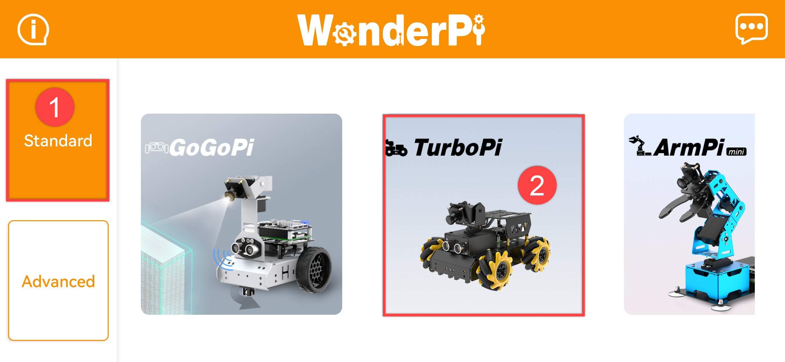
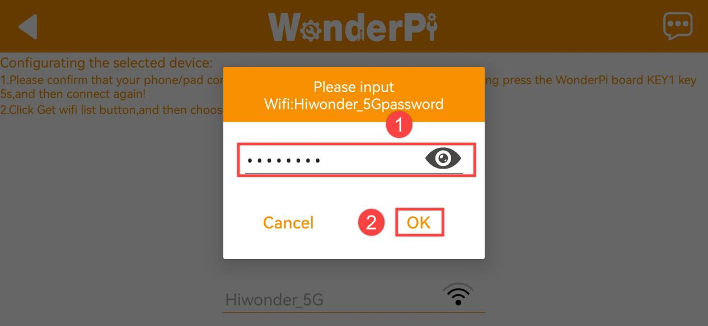
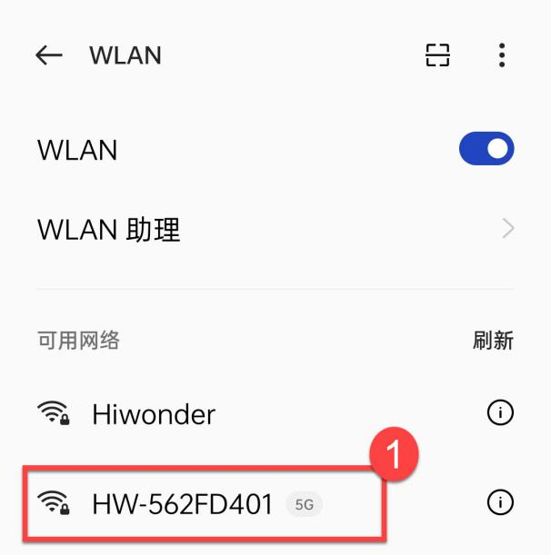
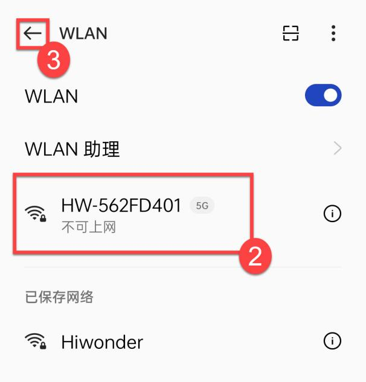
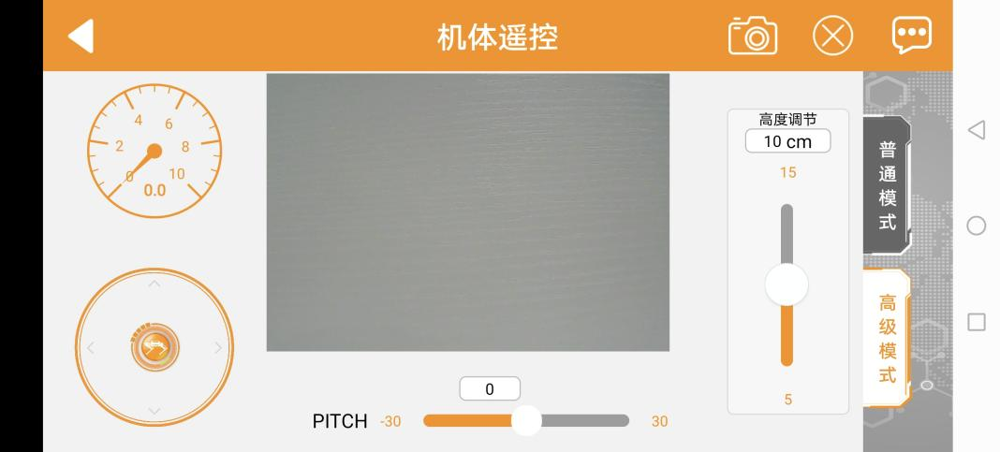
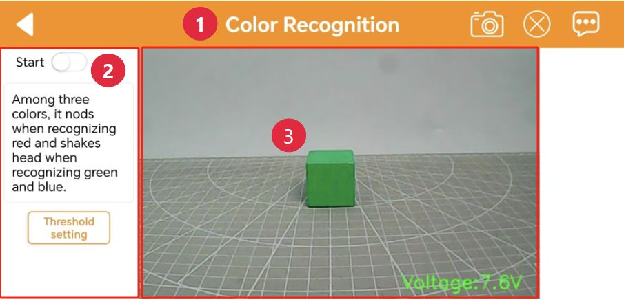
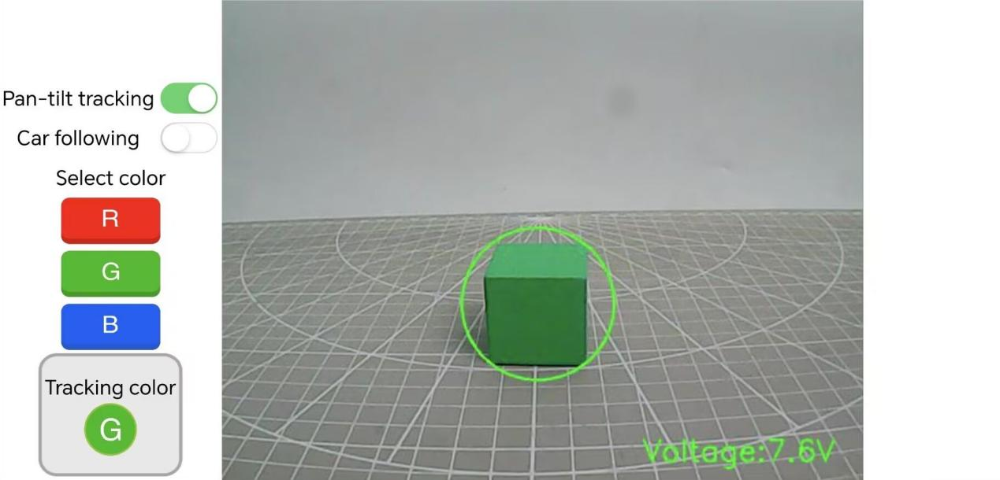

# 上手试玩

## 1. 手机APP安装和连接

本节课会讲解如何安装手机APP以及连接设备。

:::{Note}
1.  安装时请对APP开放所有权限，以免影响APP的正常使用。
2.  打开APP前，需开启手机的位置信息和Wi-Fi功能。
:::

### 1.1 安装方法

**[安卓系统](https://play.google.com/store/apps/details?id=com.Wonder.Pi)**

**[iOS系统](https://apps.apple.com/cn/app/wonderpi/id1477946178)**

:::{Note}
- 连接前，请将TurboPi开机。
- 打开APP前，需开启手机的GPS定位和Wi-Fi功能。
- 本节文档以安卓系统为例，操作方法同样适用于iOS系统。
:::

### 1.2 设备连接

1)  打开树莓派扩展板上的电源开关，启动TurboPi。如需了解具体操作步骤，可查看目录"**[学前先看\3. 设备充电、开机及自检](https://docs.hiwonder.com/projects/TurboPi/en/latest/docs/1.getting_ready.html#id5)**"下的文档。

2)  TurboPi开机成功后，会进入AP直连模式，并生成一个以"**HW**"开头的热点，在开始前先对连接模式进行了解。

- #### 1.2.1 连接模式简介

以下为TurboPi的两种网络模式：

1.  AP 直连模式：开发板能够开启热点被手机连接上。(但不能联通外部网络)

2.  STA局域网模式：开发板能够主动去连接指定的热点/Wi-Fi。(可联通外部网络)

- #### 1.2.2 直连模式连接方法（必看）

:::{Note}
TurboPi启动成功后会进入AP直连模式并生成一个**以"HW"为开头的热点。**
:::

1)  打开手机APP"**WonderPi**"，依次点击"**初级套件**"、"**TurboPi**"。

2)  点击界面右下角的"**+**"按钮，选择"**直连模式**"。

3)  点击"**去连接设备热点**"按键，前往设置界面，连接TurboPi生成的热点，连接时需输入密码"**hiwonder**"。

4)  连接成功后返回手机APP。

:::{Note}
iOS系统下，需等待手机状态栏显示Wi-Fi图标后再返回APP，否则可能会搜索不到设备。若出现搜索不到设备的情况，可点击APP界面右上方的刷新图标。
:::

5)  此时APP将自动连接设备，稍等片刻，当搜索到下图所示图标时，即为连接成功。

:::{Note}
若出现"网络不可用，是否继续连接"的提示弹窗，单击"保持连接"按键即可。
:::

6)  点击上图的TurboPi图标即可进入玩法模式选择界面，如下所示：

如需了解各个玩法的具体使用方法，可查看目录"**[2. 手机APP试玩](#anchor_2)**"下的文档。

- #### 1.2.3 局域网模式连接方法

1.  断开之前TurboPi直连模式下的热点，将手机连接至一个Wi-Fi，这里以连接名称为："**Hiwomder**"的Wi-Fi为例。

2.  连接完成之后，打开"**WonderPi**"，依次点击"**初级套件**"、"**TurboPi**"。

3.  然后单击右下角"**+**"按钮，选择"**局域网模式**"。

4.  此时APP会提示输入你所连接Wi-Fi的密码（请确认密码是否输入正确，如果输入错误会导致连接失败），输入完成后点击"**好的**"。

5.  再点击"**去连接设备热点**"。

6.  此时手机会自动跳转到Wi-Fi连接页面，找到"**HW**"开头的热点，输入密码 "**hiwonder**"连接它。连接完成之后点击"**返回**"按钮。

7. 连接完成后，可以看到APP已经开始自动配置网络了。

8. 稍等片刻，主界面会显示TurboPi的图标，同时扩展板上的LED灯也会常亮。

9. 长按APP中的TurboPi图标，可以查看分配给TurboPi的IP地址和ID。

10. 点击TurboPi的图标，就可以进入到玩法页面了。

如需了解各个玩法的具体使用方法，可查看下文"**2. 手机APP试玩**"文档。

## 2. 手机APP试玩

### 2.1 准备工作

将TurboPi开机，先参照"**[学前先看/ 5. 云台位置调节](https://docs.hiwonder.com/projects/TurboPi/en/latest/docs/1.getting_ready.html#id21)**"课程对云台舵机的偏差进行调节。

再参照"**[1. 手机APP安装与连接](#anchor_1)**"教程，安装手机APP，并连接TurboPi机器人。

### 2.2 开始试玩

连接完成后，点击TurboPi图标，进入模式选择界面。

在模式选择界面中点击玩法对应的图标即可进入玩法界面。

- #### 2.2.1 机体遥控

1)  该玩法可以实时控制小车运动及超声波的RGB灯；界面分为四个部分，各部分的描述以及功能图标如下所示：

---
- 状态栏：可以控制玩法的退出、回传画面的截图以及状态栏的隐藏；
- 控制栏：可以控制小车运动；
- 回传画面：显示摄像头的回传画面，并显示设备的电压值；
- 超声波RGB灯的调节：可以控制超声波模块的RGB灯开启、关闭以及亮起不同颜色的灯。
---

 |                                           **图标**                                            |                                                    **对应功能**                                                     |
|:-------------------------------------------------------------------------------------------:|:---------------------------------------------------------------------------------------------------------------:|
 |     |                                                返回按键，返回上一级的玩法选择菜单                                                |
|     | 对回传画面进行截图，并且保存到连接界面的图库中 |
|     |                                                      隐藏菜单栏                                                      |
|                      |                                          拖动中间的按钮，可控制TurboPi车体朝各个方向运动。                                           |
 |   |                                          点击或长按此图标，可控制TurboPi车体原地逆时针转动。                                          |
|   |                                          点击或长按此图标，可控制TurboPi车体原地顺时针转动。                                          |
 |  |                                   在画面的右下角会显示TurboPi的电池电压。（注意：电池电压低于7V时需进行充电。）                                   |
|   |                              点击"**RGB灯**"按钮，可关闭、开启超声波的RGB灯；滑动彩色的滑杆，可调节超声波RGB灯的颜色。                               |

如需返回到玩法选择界面，点击空白区域调出状态栏，再点击左侧的图标即可。

- #### 2.2.2 颜色识别

该玩法可以识别红、绿、蓝三种颜色，识别到红色点头，识别到蓝色或绿色摇头。

:::{Note}
- 请在光线充足的室内环境下进行，但尽量避免在强光直射下进行。
- 识别时，摄像头画面内请勿应无同目标颜色相同或相近的杂物，避免干扰识别。
- 如识别效果不佳，可前往目录"**[3. 颜色阈值调试](#anchor_3)**"查看文档，学习颜色阈值的调节方式。
:::

1)  点击"**颜色识别**"，进入玩法界面。该界面分为三个部分：

---
- 界面上方的是状态栏。
- 界面左侧是玩法的开启、关闭与颜色阈值调试区域；
- 界面右侧是摄像头回传画面区域。
---

2)  点击"**开始识别**"按钮，可依次将红色、蓝色、绿色的物体单独放置于摄像头前。以绿色为例，当识别到绿色时，TurboPi会在回传画面中将识别到的绿色框出来，然后蜂鸣器会先发出"**滴**"的一声提示，再执行"**摇头**"动作；

识别到绿色并将它框出来。

对应蜂鸣器会发出"**滴**"提示，并将识别到的颜色显示在左下角。

| **识别颜色** |         **识别结果**         |
|:------------:|:----------------------------:|
|      红      | 蜂鸣器"滴"一声，摄像头点头。 |
|      绿      | 蜂鸣器"滴"一声，摄像头摇头。 |
|      蓝      | 蜂鸣器"滴"一声，摄像头摇头。 |

3)  如需返回到玩法选择界面，点击当前界面的空白区域，调出标题栏，随后点击按键即可。

- #### 2.2.3 目标追踪

点击"目标追踪"，进入玩法界面。该玩法开启后可以实现小车随着目标颜色的移动而移动的功能。

:::{Note}
- 请在光线充足的室内环境下进行，但尽量避免在强光直射下进行。
- 识别时，摄像头画面内请勿应无同目标颜色相同或相近的杂物，避免干扰识别。
- 如识别效果不佳，可前往目录"**[3. 颜色阈值调试](#anchor_3)**"查看文档，学习颜色阈值的调节方式。
:::

1)  若要实现车身跟随的玩法，需要同时选中"**云台追踪**"和"**车身跟随**"这两个按钮。

---
- 界面上方的是状态栏
- 界面左侧是追踪开关区域；
- 界面右侧是摄像头回传画面区域。
---

2)  点击"**云台追踪**"按钮，再选择目标颜色即可启动追踪玩法，此时TurboPi的摄像头将跟随选定的颜色目标运动，车体不动；再点击"**车身跟随**"按钮，即可启动车身跟随玩法，此时TurboPi的车体和云台会跟随选定的颜色目标运动。

|                                          **按钮图标**                                           | **功能说明** |
|:-------------------------------------------------------------------------------------------:|:--:|
|   | 开启/关闭云台追踪玩法。 |
|   | 开启/关闭车身跟随玩法。 |
|  | 选择追踪的目标颜色。 |
|   | 显示目标颜色信息。 |

3)  如需返回到玩法选择界面，点击当前界面的空白区域，调出标题栏，随后点击按键即可。

- #### 2.2.4 智能巡线

点击"**智能巡线**"，进入玩法界面。启动该玩法后，可以让小车沿着黑线或红线前进。

:::{Note}
- 请在光线充足的室内环境下进行，但尽量避免在强光直射下进行。
- 识别时，摄像头画面内请勿应无同目标颜色相同或相近的杂物，避免干扰识别。
- 如识别效果不佳，可前往目录"**[3. 颜色阈值调试](#anchor_3)**"查看文档，学习颜色阈值的调节方式。
:::

- 界面上方的是状态栏；
- 界面左侧是巡线开关区域；
- 界面右侧是摄像头回传画面区域。

1.  点击"**开始巡线**"按钮，并选择巡线颜色，TurboPi将沿着目标颜色的线条前进。

|                                          **按钮图标**                                          | **功能说明** |
|:------------------------------------------------------------------------------------------:|:--:|
|  | 开启/关闭玩法。 |
|  | 选择巡线目标颜色。 |
|  | 显示选中追踪的颜色。 |

2.  如需返回到玩法选择界面，点击当前界面的空白区域，调出标题栏，随后点击按键即可。

- #### 2.2.5 二维码识别

点击"**二维码**"识别，进入玩法界面。该玩法启动后可以让小车的摄像头识别不同的二维码，执行对应的动作。

:::{Note}
1.  识别二维码时距离不宜太近或太远，一般二维码图片与摄像头相距为35cm为最佳。
2.  请在光线充足的室内环境下进行，但尽量避免在强光直射下进行。
:::

---
-  界面左侧是二维码开关及选择区域；

-  界面右侧是二维码画面。
---

1.  点击"**开始识别**"按钮，并选择不同的二维码，TurboPi将在识别到不同的二维码之后执行不同的动作。

|                                          **按钮图标**                                          | **功能说明** |
|:------------------------------------------------------------------------------------------:|:--:|
|                     | 小车执行前进动作的二维码 |
|                     | 小车执行后退动作的二维码 |
|                     | 小车执行左移动作的二维码 |
|                     | 小车执行右移动作的二维码 |
|  | 显示选中的二维码信息 |

2.  如需返回到玩法选择界面，点击当前界面的空白区域，调出标题栏，随后点击按键即可。

- #### 2.2.6 智能避障

点击"**智能避障**"，进入玩法界面。该玩法启动后可让小车通过超声波识别前方是否有障碍物并避开。

:::{Note}
请勿长时间近距离的检测物体
:::

- 界面左侧避障玩法开关及障碍物阈值设置区域；

- 界面中间是摄像头回传画面区域

- 界面右侧是RGB彩灯和电机速度设置区域。

1.  点击"**开始避障**"按钮，TurboPi将一直前进，检测到障碍物会左转直到没有障碍物，然后继续前进。

|                                          **按钮图标**                                          | **功能说明** |
|:------------------------------------------------------------------------------------------:|:--:|
|  | 开启/关闭玩法。 |
|  | 调节障碍物阈值，单位为cm。 |
|  | 超声波RGB彩灯开启/关闭。 |
|  | 超声波RGB灯光颜色调节。 |
|  | 电机速度调节，数值越大，电机速度越快。 |

2.  如需返回到玩法选择界面，点击当前界面的空白区域，调出标题栏，随后点击按键即可。

## 3. 颜色阈值调试

在不同光源下，物体颜色的呈现效果是不同的，而这一现象会对涉及颜色识别的功能玩法产生一定程度的影响。针对这一问题，本节课会学习如何使用手机APP"**WonderPi**"来调节颜色阈值。

### 3.1 准备工作

将TurboPi开机，安装手机APP"WonderPi"，并用其连接TurboPi。如需了解具体操作步骤，可查看目录"**[1. 手机APP安装与连接](#anchor_3)**"下的教程。

### 3.2 界面介绍

进入玩法模式选择界面后，点击下图所示按键，即可进入颜色阈值调节界面。

下表是颜色阈值调节界面的功能说明：

<table class="docutils-nobg" border="1">
<colgroup>
<col  />
<col  />
</colgroup>
<tbody>
<tr>
<td ><strong>图标</strong></td>
<td ><strong>功能说明</strong></td>
</tr>
<tr>
<td ></td>
<td >
摄像头回传画面的处理后图像。

图像中，颜色物体区域表示为白色，其余部分表现为黑色。
</td>
</tr>
<tr>
<td ></td>
<td >摄像头回传画面的原始图像。</td>
</tr>
<tr>
<td ></td>
<td >选择当前调节的颜色。</td>
</tr>
<tr>
<td ></td>
<td >
调节回传画面的L分量（白~黑）范围，"L_min"是范围下限，"L_max"是范围上限。

点击按键可减小对应数值，点击按键可增大数值。
</td>
</tr>
<tr>
<td ></td>
<td >
调节回传画面的A分量（绿~红）范围，"a_min"是范围下限，"a_max"是范围上限。

点击按键可减小对应数值，点击按键可增大数值。
</td>
</tr>
<tr>
<td ></td>
<td >
调节回传画面的B分量（黄~蓝）范围，"b_min"是范围下限，"b_max"是范围上限。

点击按键可减小对应数值，点击按键可增大数值。
</td>
</tr>
<tr>
<td ></td>
<td >打开操作说明窗口，可查看颜色阈值调节方法。</td>
</tr>
<tr>
<td ></td>
<td >保存调节的阈值。</td>
</tr>
<tr>
<td ></td>
<td >返回玩法模式选择界面。</td>
</tr>
<tr>
<td ></td>
<td >隐藏导航栏。</td>
</tr>
<tr>
<td ></td>
<td >显示幻尔科技的信息窗口。</td>
</tr>
</tbody>
</table>

### 3.3 调节颜色阈值

1.  进入颜色阈值调节界面，选择需要调节阈值的颜色，此处以红色为例。

2.  将红色物体放置在摄像头的视野范围内，将L、A、B分量的最小值都调为"0"，最大值都调为"**255**"。

3.  点击"**操作说明**"按键，查看颜色阈值的调节方法。

:::{Note}
如需关闭操作说明窗口，点击"好的"即可。
:::

4.  由LAB颜色空间分布图可知，红色靠近"+a"，即需要优先调整A分量。

5.  "**a_max**"的数值保持不变，增大"**a_min**"的数值，直至处理后图像中的红色物体区域显示为白色，其余部分显示为黑色。

6.  根据所处环境来调整L分量和B分量。若红色物体在环境下颜色偏浅，增大亮度的最小值(**L_min**)；在环境下颜色偏深，则减小亮度的最大值(**L_max**)。若红色物体在环境下偏暖色调，增大色度的最小值(**b_min**)；在环境下偏冷色调，减小色度的最大值(**b_max**)。

7.  完成阈值调节后，点击"**保存**"按键，保存调节好的阈值范围。

