# 3. Mecanum Wheel Robot Basic Lesson

## 3.1 Introduction to Mecanum Wheel Movement

### 3.1.1 Overview

The TurboPi chassis is equipped with Mecanum wheels, which allow for omnidirectional movement. Depending on the direction of the rollers set at a 45° angle, Mecanum wheels can be classified into two mirror-image types: Type A and Type B, as shown in the diagram below.

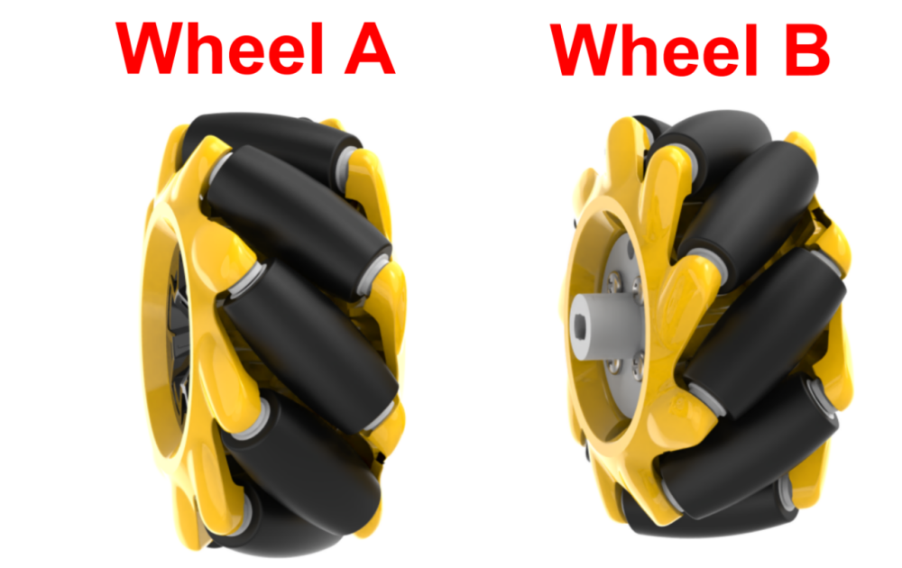

Mecanum wheels offer excellent maneuverability, stability, and omnidirectional mobility. By using four wheels in a specific configuration, TurboPi is capable of moving freely in any direction.

### 3.1.2 Working Principle

* **Hardware Structure**

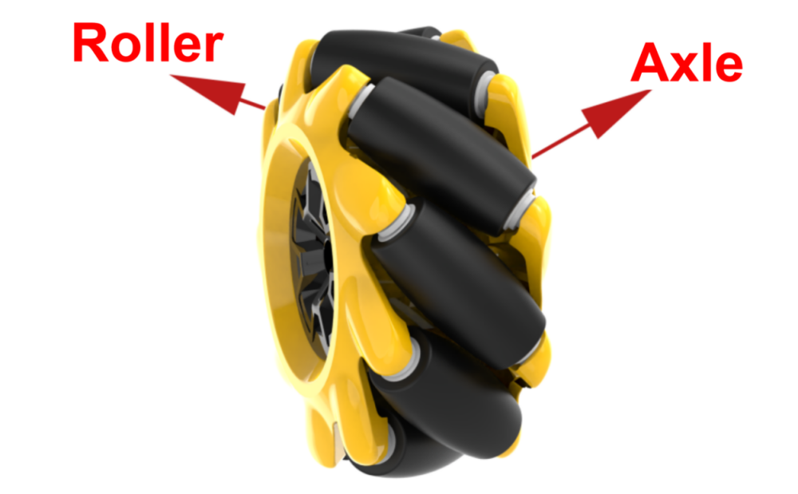

A Mecanum wheel consists of a main wheel hub and multiple rollers mounted around the hub. The rollers are angled at 45 degrees relative to the axis of the hub. Typically, Mecanum wheels are used in sets of four, two left-handed wheels (Type A) and two right-handed wheels (Type B), which are arranged symmetrically.

There are several common configurations, such as AAAA, BBBB, AABB, ABAB, BABA, etc. However, not all configurations support full-range movement functions like forward/backward motion, rotation, and lateral movement. The TurboPi uses the ABAB configuration, which enables true omnidirectional movement.

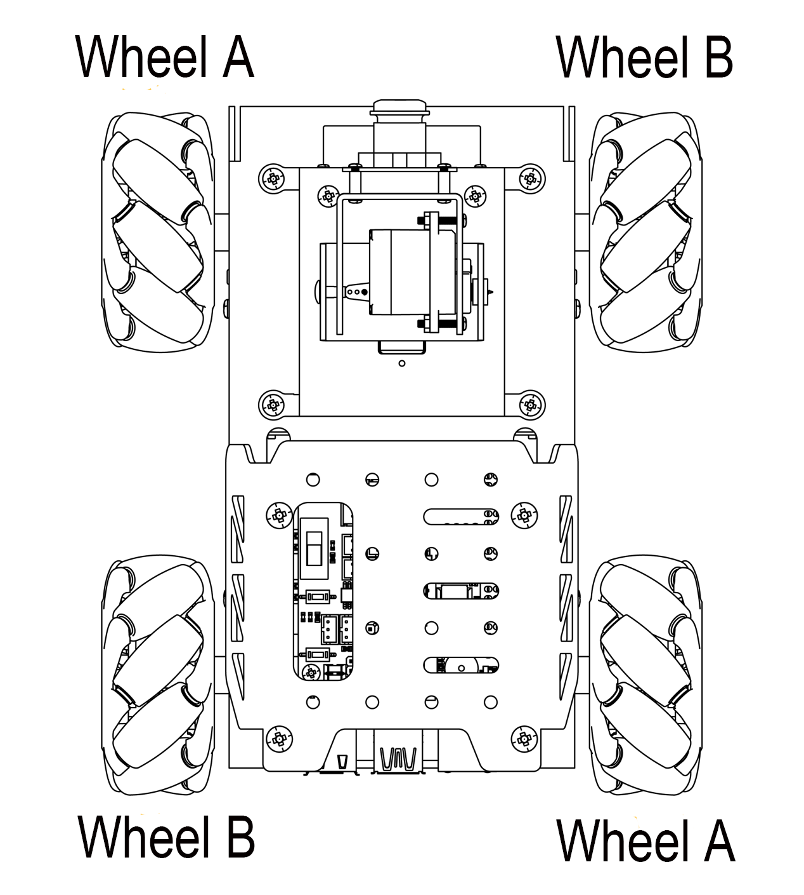

* **Physical Characteristics**

The motion of a Mecanum wheel robot is determined by the direction and speed of each individual wheel. The forces generated by each wheel combine to produce a resultant force vector, allowing the robot to move freely in any desired direction without changing the orientation of the wheels.

Because of the angled rollers distributed around the edge of the wheel, lateral movement is also possible. The rollers follow a unique path. When the wheel rotates around its central axis, the roller surfaces form a cylindrical envelope, allowing the robot to roll continuously in a given direction.

In kinematic analysis, the motion of Mecanum wheels can be described using a kinematic model. This includes several key parameters:

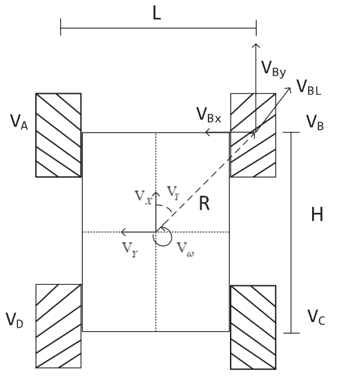

(1) V<sub>x</sub>: Linear velocity of the chassis along the X-axis, typically the forward/backward direction.

(2) V<sub>y</sub>: Linear velocity of the chassis along the Y-axis, typically the left/right or lateral direction.

(3) V<sub>ω</sub>: Angular velocity of the chassis, the rotation speed around its own center.

(4) V<sub>A</sub>、V<sub>B</sub>、V<sub>C</sub>、V<sub>D</sub>: Real-time rotational speeds of the four individual wheels.

For example, the motion of the front-right wheel (Wheel B) on a 2D plane can be decomposed into:

(1) VBx: Linear velocity of the chassis along the X-axis, typically the forward/backward direction.

(2) VBy: Linear velocity of the chassis along the Y-axis, typically the left/right or lateral direction.

(3) L: The distance between the centers of the left and right wheels.

(4) H: The distance between the centers of the front and rear wheels.

(5) θ<sub>ω</sub>: The angle between the robot's center of mass and the front-right wheel, typically 45°.

Based on these parameters, we can perform kinematic analysis of the Mecanum wheel chassis to determine how wheel speeds contribute to the overall movement of the robot in any direction.

### 3.1.3 Kinematic Analysis and Formula Derivation (Optional Reading)

To simplify the kinematic model, we make the following two idealized assumptions:

① The Mecanum wheels do not slip on the ground, and the ground provides sufficient friction.

② The four wheels are positioned at the corners of a rectangle or square, and all wheels are parallel to their corresponding axes.

In this model, the robot's rigid body movement is decomposed into three linear components: translation along the X-axis, translation along the Y-axis, and rotation around the Z-axis. By calculating the individual wheel speeds required for these three simple motions, we can combine them to compute the required rotational speed for each wheel during compound motion of simultaneous translation and rotation.

V<sub>A</sub>,V<sub>B</sub>,V<sub>C</sub>, and V<sub>D</sub> represent the rotational speeds of wheels A, B, C, and D, respectively, which correspond to the motor speeds. V<sub>X</sub> is the robot's translational velocity along the X-axis, V<sub>y</sub> is the translational velocity along the Y-axis, and V<sub>ω</sub> is the angular velocity of the chassis around the Z-axis. 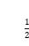 L represents half of the robot's wheelbase, and  H represents half of the track width.

(1) When the robot moves along the X-axis, the speed component of each wheel can be calculated using the following formula:

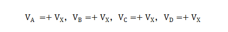

V<sub>A</sub>,V<sub>B</sub>,V<sub>C</sub>, and V<sub>D</sub> are the real-time speeds of the four Mecanum wheels in the X-axis direction.

(2) When the robot moves along the Y-axis, the speed component of each wheel can be calculated using the following formula:

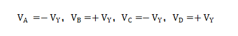

V<sub>y</sub> is the speed of the Mecanum wheels in the Y-axis direction.

(3) When the robot rotates around the Z-axis, the speed component of each wheel can be calculated using the following formula:

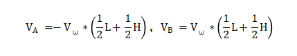


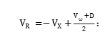Vω is the angular velocity of the Mecanum chassis, which is the rotation speed around its own center).

(4) By combining the velocities along the X, Y, and Z axes, the rotational speed required for each of the four wheels can be derived according to the robot's overall motion state.

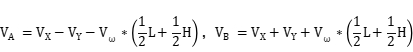

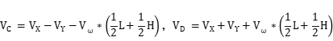

## 3.2 Moving Forward

###  3.2.1 Brief Overview of Operation

Based on the characteristics of Mecanum wheels, all four wheels must rotate forward simultaneously for the robot car to move straight ahead, as shown in the force analysis diagram below.

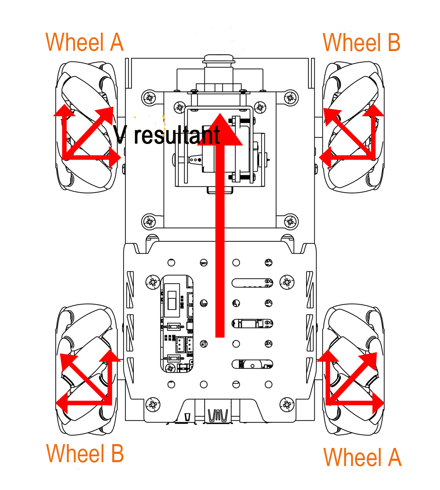

According to principles of physics and kinematics, forces of equal magnitude but opposite directions cancel each other out.

Assuming the A and B wheels rotate forward at the same speed, the rightward forces generated by wheels A1 and A2 will cancel out the leftward forces generated by wheels B1 and B2. This leaves only the forward-directed force components from A1, A2, B1, and B2.

The net force vector points forward. According to Newton's Second Law of Motion (F = ma), this forward force produces forward acceleration, resulting in a net velocity V directed forward.

###  3.2.2 Enabling and Disabling the Feature

:::{Note}

When entering commands, be sure to use correct case and spacing. You can use the Tab key to auto-complete keywords.

:::

(1) Power on the device and connect via VNC remote desktop tool.


(2) Click the terminal icon  in the upper-left corner of the system desktop to open a command-line window.


(3) Enter the following command to navigate to the directory where the control feature is located, then press Enter.

```
cd ~/ros2_ws/src/example/example/mecanum_control
```

(4) Entering the following command and press Enter.

```
python3 car_forward_demo.py
```

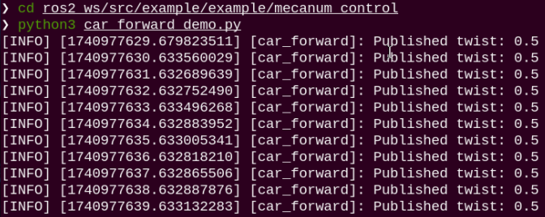

(5) To stop the program, press Ctrl + C in the same terminal window. If the program does not stop immediately, repeat this step until it terminates.

###  3.2.3 Project Outcome

Once the feature starts, TurboPi will continuously move forward.

###  3.2.4 Program Brief Analysis

The source code for this demo is located at [ros2_ws/src/example/example/mecanum_control/car_forward_demo.py](../_static/source_code/mecanum_control.zip)

{lineno-start=1}

```
#!/usr/bin/env python3
# encoding: utf-8

# Car Moving Forward （小车前进）

import rclpy
import signal
from rclpy.node import Node
from geometry_msgs.msg import Twist

class CarMoveDemo(Node):
    def __init__(self):
        super().__init__('car_forward') 
        signal.signal(signal.SIGINT, self.stop)  
        self.mecanum_pub = self.create_publisher(Twist, 'cmd_vel', 1)  # Chassis Control （底盘控制）
        self.timer = self.create_timer(1.0, self.timer_callback)

    def timer_callback(self):    
        twist = Twist()
        twist.linear.x = 0.5  # Set Linear Velocity （设置线速度）
        self.mecanum_pub.publish(twist)
        self.get_logger().info(f"Published twist: {twist.linear.x}")
        
    def stop(self, signum, frame):
        self.mecanum_pub.publish(Twist())
        rclpy.shutdown()

def main():
    rclpy.init()  
    node = CarMoveDemo()
    try:
        rclpy.spin(node)
    except KeyboardInterrupt:
        node.mecanum_pub.publish(Twist())
    finally:
        node.destroy_node()
        rclpy.shutdown()

if __name__ == "__main__":
    main()
```

The motor is controlled using the function self.create_publisher(Twist, 'cmd_vel', 1)**.** The definition of parameter in the code twist.linear.x = 0.9:

The value 0.9 represents the linear velocity of the motor, with a valid range of -1 to 1. A negative value causes the motor to rotate in reverse. A value between 0 and 1 makes the robot's wheels move forward—the greater the value, the faster the wheels spin. It is recommended to set the parameter above 0.35 for noticeable wheel movement. A value between -1 and 0 makes the wheels move in reverse—the smaller the value, the faster the reverse speed. It is recommended to set the parameter below -0.35 for noticeable wheel movement.

###  3.2.5 Feature Extensions

By default, the program sets the forward speed to 0.5. We can try adjusting the robot's speed—here, we'll change the speed to 0.9. The specific steps are as follows:

(1) Click the terminal icon  in the upper-left corner of the system desktop to open a command-line window.

(2) Enter the command to switch to the directory where the demo program is located, then press Enter.

```
cd ~/ros2_ws/src/example/example/mecanum_control
```

(3) Enter the command to open the program file and press Enter.

```
vim car_forward_demo.py
```

(4) Locate the section of code you want to modify, then press the "**i**" key on the keyboard. When a prompt appears in the bottom-left corner, you've entered editing mode.

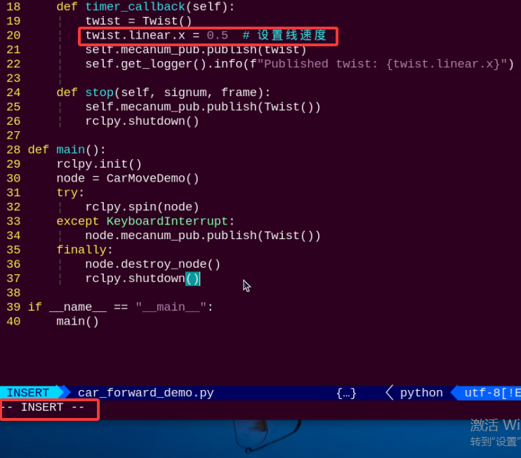

(5) In the twist.linear.x function, the parameter represents the motor's linear velocity. Here, we'll change it to 0.9. After making the change, press the "**Esc**" key, then type the command below and press Enter to save and exit the program.

```
:wq
```

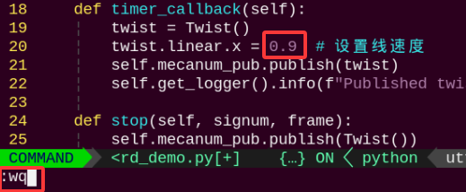

:::{Note}

The valid speed range is -1~1. A positive value causes the motor to rotate forward; a negative value causes it to rotate in reverse. If set to a negative value, the movement direction of the robot may change. It is recommended to set the value within the range of 0~1.

:::

(6) After completing the modification, you can follow the instructions in the previous section to run the program again and observe the effect.

## 3.3 Turning

###  3.3.1 Brief Overview of Operation

According to the characteristics of Mecanum wheels, when the wheels on the left side of the robot rotate in reverse and the wheels on the right side rotate forward, the robot will rotate counterclockwise on the spot. Conversely, when the left wheels rotate forward and the right wheels rotate in reverse, the robot will rotate clockwise on the spot.

The force analysis diagrams for the two cases are as follows:

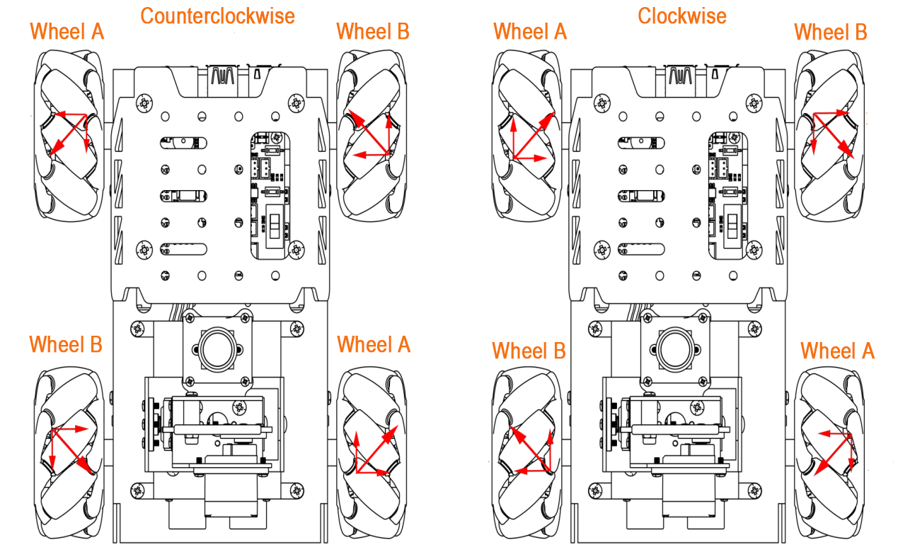

(1) When the left wheels rotate in reverse and the right wheels rotate forward:

The left wheels push backward, and the right wheels pull forward, which causes the entire robot to rotate counterclockwise.

(2) When the left wheels rotate forward and the right wheels rotate in reverse:

The left wheels pull forward, and the right wheels push backward, which causes the entire robot to rotate clockwise.

The unique properties of Mecanum wheels determine that when the rotation directions of the left and right wheels are opposite, a rotational torque is generated, causing the robot to spin in place. The difference in rotation direction between the left and right wheels generates a twisting torque, making the robot rotate around its central axis. By controlling the rotation speed and direction of the left and right wheels, the robot can perform on-the-spot rotation.

<p id="anchor_3_3_2"></p>

###  3.3.2 Enabling and Disabling the Feature

:::{Note}

When entering commands, be sure to use correct case and spacing. You can use the Tab key to auto-complete keywords.

:::

(1) Power on the device and connect via VNC remote desktop tool.


(2) Click the terminal icon  in the upper-left corner of the system desktop to open a command-line window.

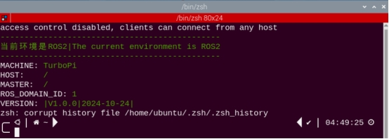

(3) Enter the following command to navigate to the directory where the control feature is located, then press Enter.

```
cd ~/ros2_ws/src/example/example/mecanum_control
```

(4) Entering the following command and press Enter.

```
python3 car_turn_demo.py
```

(5) To exit the feature, press Ctrl+C in the terminal. If the feature does not exit immediately, press Ctrl+C multiple times.

###  3.3.3 Project Outcome

After starting the feature, the TurboPi will first rotate counterclockwise in place, then rotate clockwise in place.

###  3.3.4 Program Brief Analysis

The source code for this demo is located at [/ros2_ws/src/example/example/mecanum_control/car_turn_demo.py](../_static/source_code/mecanum_control.zip)

{lineno-start=1}

```
#!/usr/bin/env python3
# encoding: utf-8

# Car Steering （小车转向）

import rclpy
import signal
from rclpy.node import Node
from geometry_msgs.msg import Twist

class CarMoveDemo(Node):
    def __init__(self):
        super().__init__('car_turn') 
        signal.signal(signal.SIGINT, self.stop)  
        self.mecanum_pub = self.create_publisher(Twist, 'cmd_vel', 1)  # Chassis Control （底盘控制）
        self.timer = self.create_timer(1.0, self.timer_callback)
        self.state = 0  # Current State （当前状态）
        self.twist = Twist()  # Motion Command （运动命令）

    def timer_callback(self):
        if self.state == 0:
            self.twist.angular.z = 5.0 # Left （左）
        elif self.state == 1:
            self.twist.angular.z = -5.0  # Right （右）
            
        self.mecanum_pub.publish(self.twist)
        self.get_logger().info(f"Published twist: angular.z = {self.twist.angular.z}")
        
        # Update State （更新状态）
        self.state = (self.state + 1) % 2  # Loop State （循环状态）

    
        
    def stop(self, signum, frame):
        self.mecanum_pub.publish(Twist())
        rclpy.shutdown()

def main():
    rclpy.init()  
    node = CarMoveDemo()
    try:
        rclpy.spin(node)
    except KeyboardInterrupt:
        node.mecanum_pub.publish(Twist())
    finally:
        node.destroy_node()
        rclpy.shutdown()

if __name__ == "__main__":
    main()
```

The motor is controlled using the function self.twist.angular.z. For example, in the line self.twist.angular.z = -5.0, the parameter -5.0 represents the angular velocity of the robot turning clockwise. The larger the value, the faster the angular velocity. The range for clockwise rotation is from -10 to 0.

###  3.3.5 Feature Extensions

By default, the program sets the turning angular velocity to 5.0. You can try adjusting the rotation speed of the robot. Here, we will change the counterclockwise rotation speed to 6.0. The specific modification steps are as follows:

(1) Click the icon  in the upper-left corner of the desktop to enter the terminal.

(2) Enter the command to switch to the directory where the demo program is located, then press Enter.

```
cd ~/ros2_ws/src/example/example/mecanum_control
```

(3) Enter the command to open the program file and press Enter.

```
vim car_turn_demo.py
```

(4) Find the section of code you want to modify and press the "i" key to enter edit mode.

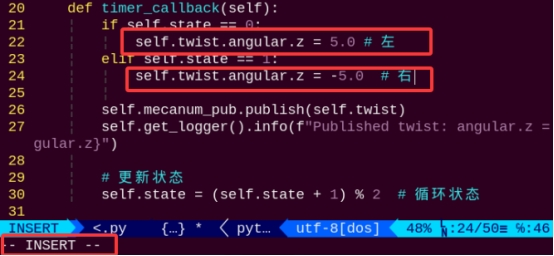

(5) In the self.twist.angular.z function, the parameter represents the angular velocity of the robot's turning motion. A positive value means counterclockwise rotation, and a negative value means clockwise rotation. The default value is 5.0, now changing it to 6.0.

```
:wq
```

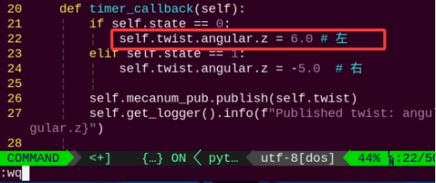

:::{Note}

The adjustable speed range is from -10.0 to 10.0. A positive value makes the robot rotate counterclockwise, and a negative value makes it rotate clockwise. It is recommended to adjust the speed incrementally based on actual needs.

:::

After the modification, refer to [3.3.2 Enabling and Disabling the Feature](#anchor_3_3_2) to run the program again and observe the effect.

## 3.4 Forward, Backward, and Sideways Movement

### 3.4.1 Brief Overview of Operation

According to the characteristics of Mecanum wheels, when all wheels rotate forward, the robot moves forward, when all wheels rotate backward, the robot moves backward. When all A wheels rotate backward and B wheels rotate forward, the robot strafes to the left, when all B wheels rotate backward and A wheels rotate forward, the robot strafes to the right. The force analysis diagrams for forward, backward, and sideways movement are as follows:

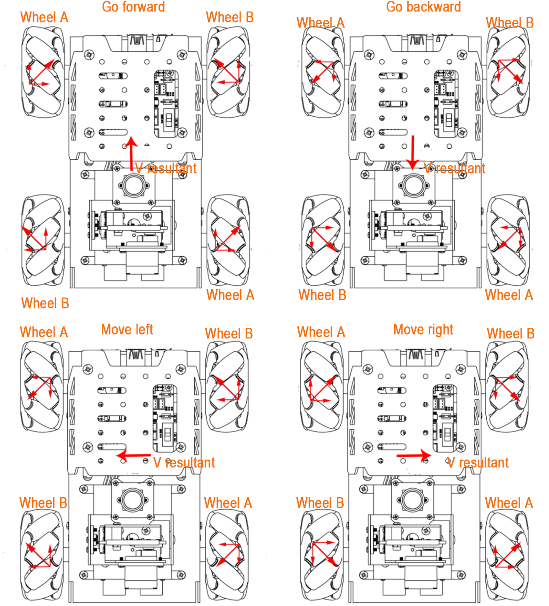

According to the principles of physics and kinematics, equal and opposite forces cancel each other out. Assuming the A and B wheels rotate forward at the same speed, the rightward force generated by the A wheels and the leftward force generated by the B wheels cancel each other out. The resulting force points forward. Based on Newton's second law of motion (F = ma), the acceleration is directed forward, and therefore the resulting velocity "**Vₑ**" also points forward. The velocity decomposition for other directions is derived using the same logic.

**(1) Forward and Backward Movement:**

When all wheels rotate forward, the robot moves forward. When all wheels rotate backward, the robot moves backward. Because the thrust directions of all four wheels are aligned, driving the robot to move forward or backward.

**(2) Leftward Movement:**

When the two left wheels rotate backward and the two right wheels rotate forward, the left wheels push backward and the right wheels pull forward. This generates a leftward force that causes the robot to strafe left.

**(3) Rightward Movement:**

When the two right wheels rotate backward and the two left wheels rotate forward, the right wheels push backward and the left wheels pull forward. This generates a rightward force that causes the robot to strafe right.

<p id="anchor_3_4_2"></p>

###  3.4.2 Enabling and Disabling the Feature

:::{Note}

When entering commands, be sure to use correct case and spacing. You can use the Tab key to auto-complete keywords.

:::

(1) Power on the device and connect via VNC remote desktop tool.


(2) Click the terminal icon  in the upper-left corner of the system desktop to open a command-line window.


(3) Enter the following command to navigate to the directory where the control script is located, then press Enter.

```
cd ~/ros2_ws/src/example/example/mecanum_control
```

(4) Entering the following command and press Enter.

```
python3 car_move_demo.py
```

(5) To exit the feature, press Ctrl+C in the terminal. If the feature does not exit immediately, press Ctrl+C multiple times.

###  3.4.3 Project Outcome

After starting the gameplay, the TurboPi will move in the following sequence: forward → backward → strafe left → strafe right.

###  3.4.4 Program Brief Analysis

The source code for this demo is located at [/ros2_ws/src/example/example/mecanum_control/car_move_demo.py](../_static/source_code/mecanum_control.zip)

{lineno-start=1}

```
#!/usr/bin/env python3
# encoding: utf-8

# Car Moving in All Directions （小车前后左右运动）

import rclpy
import signal
from rclpy.node import Node
from geometry_msgs.msg import Twist

class CarMoveDemo(Node):
    def __init__(self):
        super().__init__('car_move') 
        signal.signal(signal.SIGINT, self.stop)  
        self.mecanum_pub = self.create_publisher(Twist, 'cmd_vel', 1)  # Chassis Control （底盘控制）
        self.timer = self.create_timer(1.0, self.timer_callback)
        self.state = 0  # Current State （当前状态）
        self.twist = Twist()  # Motion Command （运动命令）

    def timer_callback(self):
        if self.state == 0:
            self.twist.linear.x = 0.5  # Forward （向前）
            self.twist.linear.y = 0.0
        elif self.state == 1:
            self.twist.linear.x = -0.5  # Backward （向后）
            self.twist.linear.y = 0.0
        elif self.state == 2:
            self.twist.linear.x = 0.0
            self.twist.linear.y = 0.5  # Left （向左）
        elif self.state == 3:
            self.twist.linear.x = 0.0
            self.twist.linear.y = -0.5  # Right （向右）

        self.mecanum_pub.publish(self.twist)
        self.get_logger().info(f"Published twist: linear.x = {self.twist.linear.x}, linear.y = {self.twist.linear.y}")
        
        # Update State （更新状态）
        self.state = (self.state + 1) % 4  # Loop State （循环状态）

    
        
    def stop(self, signum, frame):
        self.mecanum_pub.publish(Twist())
        rclpy.shutdown()

def main():
    rclpy.init()  
    node = CarMoveDemo()
    try:
        rclpy.spin(node)
    except KeyboardInterrupt:
        node.mecanum_pub.publish(Twist())
    finally:
        node.destroy_node()
        rclpy.shutdown()

if __name__ == "__main__":
    main()
```

The motor is controlled using the function self.twist.linear.x and self.twist.linear.y. For example, in the code self.twist.linear.x = 0.5 and self.twist.linear.y = 0.0, the x parameter is set to 0.5 and the y parameter is set to 0.0, which makes the robot move forward.

###  3.4.5 Feature Extensions

By default, the robot's speed when strafing left is set to 0.5. You can try adjusting the movement speed. Here, we'll change the strafing-left speed to 0.6. The specific steps are as follows:

(1) Click the icon  in the upper-left corner of the desktop to enter the terminal.

(2) Enter the command to switch to the directory where the demo program is located, then press Enter.

```
cd ~/ros2_ws/src/example/example/mecanum_control
```

(3) Enter the command to open the program file and press Enter.

```
vim car_move_demo.py
```

(4) Find the section of code you want to modify and press the **"i"** key to enter edit mode.

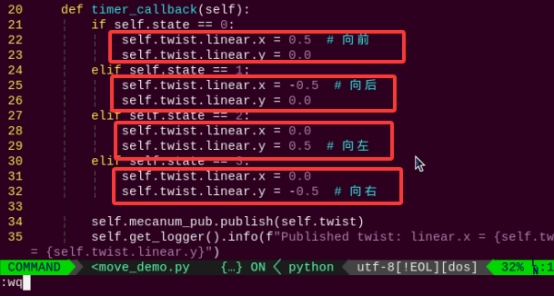

(5) In the function self.twist.linear.x, the parameter controls the forward and backward speed of the motors. In the function self.twist.linear.y, the parameter controls the left and right movement speed of the motors. By default, the strafing-left speed is set to 0.5, i.e., self.twist.linear.y = 0.5. Change the leftward speed to 0.6, i.e., self.twist.linear.y = 0.6, then press the "**Esc**" key and enter the following command, then press Enter to save and exit:

```
:wq
```

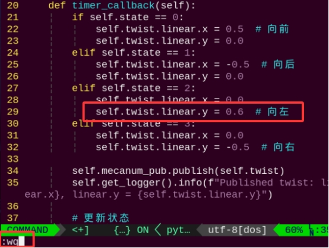

:::{Note}

The adjustable range for speed is "**-1~1**". A positive value causes the robot to move left, and a negative value causes it to move right.

:::

(6) After making the change, follow the steps in [3.4.2  Enabling and Disabling the Feature](#anchor_3_4_2) to run the program again and observe the updated effect.

## 3.5 Diagonal Movement

###  3.5.1 Brief Overview of Operation

According to the characteristics of Mecanum wheels, when A wheels remain stationary and B wheels rotate forward, the robot moves diagonally forward to the left. When B wheels rotate in reverse, the robot moves diagonally backward to the right. When B wheels remain stationary and A wheels rotate forward, the robot moves diagonally forward to the right. When A wheels rotate in reverse, the robot moves diagonally backward to the left. The force analysis diagram for the robot's diagonal movement is as follows:

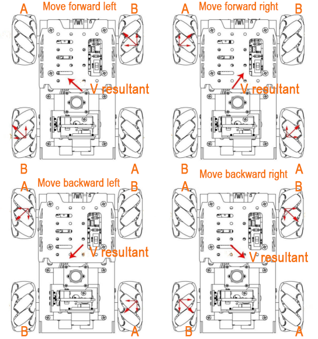

(1) When A wheels are stationary and B wheels rotate forward:

The B wheels push forward while the A wheels remain still, which generates a torque toward the front-left direction, causing the robot to move diagonally forward-left.

(2) When B wheels are stationary and A wheels rotate forward:

The A wheels pull forward while the B wheels remain still, which generates a torque toward the front-right direction, causing the robot to move diagonally forward-right.

(3) When A wheels are stationary and B wheels rotate in reverse:

The B wheels pull backward while the A wheels remain still, which generates a torque toward the back-right direction, causing the robot to move diagonally backward-right.

(4) When B wheels are stationary and A wheels rotate in reverse:

The A wheels push backward while the B wheels remain still, which generates a torque toward the back-left direction, causing the robot to move diagonally backward-left.

<p id="anchor_3_5_2"></p>

###  3.5.2 Enabling and Disabling the Feature

:::{Note}

When entering commands, be sure to use correct case and spacing. You can use the Tab key to auto-complete keywords.

:::

(1) Power on the device and connect via VNC remote desktop tool.


(2) Click the terminal icon  in the upper-left corner of the system desktop to open a command-line window.

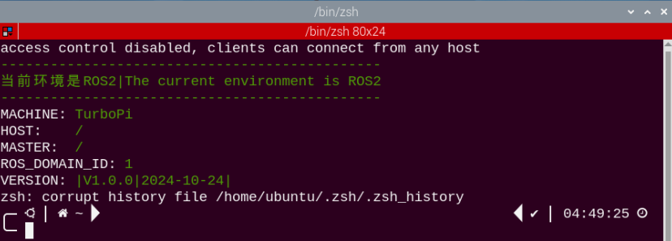

(3) Enter the following command to navigate to the directory where the control feature is located, then press Enter.

```
cd ~/ros2_ws/src/example/example/mecanum_control
```

(4) Entering the following command and press Enter.

```
python3 car_slant_demo.py
```

(5) To stop the program, press Ctrl + C in the same terminal window. If the program does not stop immediately, repeat this step until it terminates.

###  3.5.3 Project Outcome

Once the gameplay is started, the TurboPi will move in the following sequence: forward-left, forward-right, backward-left, backward-right.

###  3.5.4 Program Brief Analysis

The source code for this demo is located at [/ros2_ws/src/example/example/mecanum_control/car_slant_demo.py](../_static/source_code/mecanum_control.zip)

{lineno-start=1}

```
#!/usr/bin/env python3
# encoding: utf-8

# Diagonal Movement of the Car （小车斜向运动）

import rclpy
import signal
from rclpy.node import Node
from geometry_msgs.msg import Twist
import time

class CarMoveDemo(Node):
    def __init__(self):
        super().__init__('car_slant') 
        signal.signal(signal.SIGINT, self.stop)  
        self.mecanum_pub = self.create_publisher(Twist, 'cmd_vel', 1)  # Chassis Control （底盘控制）
        time.sleep(1)
        self.timer = self.create_timer(1.0, self.timer_callback)
        self.state = 0  # Current State （当前状态）
        self.twist = Twist()  # Motion Command （运动命令）

    def timer_callback(self):
        if self.state == 0:
            self.twist.linear.x = 0.5  
            self.twist.linear.y = 0.5
        elif self.state == 1:
            self.twist.linear.x = 0.5 
            self.twist.linear.y = -0.5
        elif self.state == 2:
            self.twist.linear.x = -0.5
            self.twist.linear.y = 0.5  
        elif self.state == 3:
            self.twist.linear.x = -0.5
            self.twist.linear.y = -0.5  

        self.mecanum_pub.publish(self.twist)
        self.get_logger().info(f"Published twist: linear.x = {self.twist.linear.x}, linear.y = {self.twist.linear.y}")
        
        # Update State （更新状态）
        self.state = (self.state + 1) % 4  # Loop State （循环状态）

    
        
    def stop(self, signum, frame):
        self.mecanum_pub.publish(Twist())
        rclpy.shutdown()

def main():
    rclpy.init()  
    node = CarMoveDemo()
    try:
        rclpy.spin(node)
    except KeyboardInterrupt:
        node.mecanum_pub.publish(Twist())
    finally:
        node.destroy_node()
        rclpy.shutdown()

if __name__ == "__main__":
    main()
```

The motor is controlled using the function self.twist.linear.x and self.twist.linear.y. For example, the code self.twist.linear.x = 0.5 and self.twist.linear.y = -0.5 means that the x parameter is set to 0.5 and the y parameter is set to -0.5, which makes the robot move diagonally toward the upper right.

###  3.5.5 Feature Extensions

By default, the robot moves diagonally at a 45-degree angle. You can try adjusting the diagonal movement angle. Here to change the angle for forward-left movement to 0.6. The detailed steps are as follows:

(1) Click the terminal icon  in the upper-left corner of the system desktop to open a command-line window.

(2) Enter the command to switch to the directory where the demo program is located, then press Enter.

```
cd ~/ros2_ws/src/example/example/mecanum_control
```

(3) Enter the command to open the program file and press Enter.

```
vim car_slant_demo.py
```

(4) Locate the code indicated by the red box, then press the "**i**" key to enter edit mode. When content appears in the lower-left corner, it means you are now in edit mode.

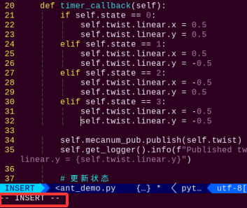

(5) In the self.twist.linear.x and self.twist.linear.y functions, the parameters respectively represent forward and left/right movement. Here the value is modified to 0.6. After editing, press the "**Esc**" key, type the command, and press Enter to save and exit:

```
:wq
```

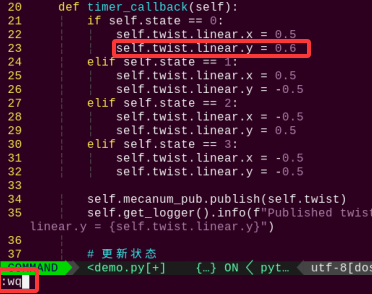

:::{Note}

The adjustment range for directional values is "**-1 to 1**", y = -0.5 indicates rightward movement, x = 0.5 indicates forward movement, y = 0.5 indicates leftward movement, and x = -0.5 indicates backward movement.

:::

(6) After making the change, follow the steps in [3.5.2 Enabling and Disabling the Feature](#anchor_3_5_2) to run the program again and observe the updated effect.

## 3.6 Drifting Motion

###  3.6.1 Brief Overview of Operation

According to the characteristics of Mecanum wheels, when the front wheels remain stationary and the rear A wheel rotates forward while the B wheel rotates backward, the robot drifts counterclockwise. When the rear B wheel rotates forward and the A wheel rotates backward, the robot drifts clockwise.

(1) When the front wheels remain stationary, and the rear A wheel rotates forward while the B wheel rotates backward:

The A wheel pulls forward, and the B wheel pushes backward, generating a counterclockwise torque, causing the robot to drift counterclockwise.

(2) When the front wheels remain stationary, and the rear B wheel rotates forward while the A wheel rotates backward:

The B wheel pulls forward, and the A wheel pushes backward, generating a clockwise torque, causing the robot to drift clockwise.

The unique properties of Mecanum wheels determine that when the rotation directions of the left and right wheels are opposite, a rotational torque is generated, causing the robot to drift in place. With only the rear wheels rotating and the front wheels stationary, a torsional torque is produced, causing the robot to rotate around its central axis and drift. By controlling the speed and direction of the rear wheels, the drifting motion of the robot can be achieved.

The force analysis diagram for the robot's drifting motion is as follows:

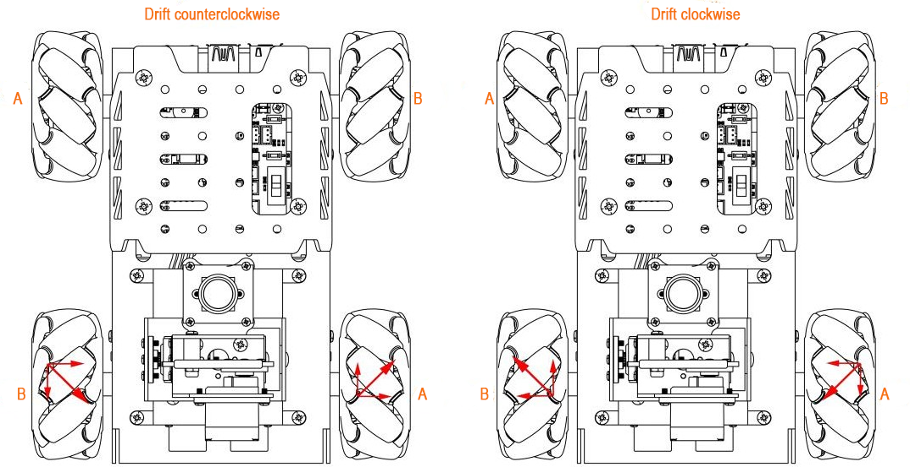

According to physical kinematics, forces of equal magnitude and opposite direction cancel each other out. Take counterclockwise drifting as an example: if the rear A and B wheels rotate at the same speed, the upward force component from the A wheels and the downward force component from the B wheels cancel each other, resulting in a net force to the right.

According to Newton's Second Law of Motion (F = ma), the direction of acceleration is to the right, and thus the resulting velocity is also directed to the right. Since the front wheels do not move, the robot drifts in that direction. The same logic applies to clockwise drifting.

<p id="anchor_3_6_2"></p>

###  3.6.2 Enabling and Disabling the Feature

:::{Note}

When entering commands, be sure to use correct case and spacing. You can use the Tab key to auto-complete keywords.

:::

(1) Power on the device and connect via VNC remote desktop tool.


(2) Click the terminal icon  in the upper-left corner of the system desktop to open a command-line window.


(3) Enter the following command to navigate to the directory where the control feature is located, then press Enter.

```
cd ~/ros2_ws/src/example/example/mecanum_control
```

(4) Entering the following command and press Enter.

```
python3 car_drifting_demo.py
```

(5) To stop the program, press Ctrl + C in the same terminal window. If the program does not stop immediately, repeat this step until it terminates.

###  3.6.3 Project Outcome

After the feature starts, the TurboPi will drift counterclockwise first, then clockwise, and continue to alternate in a loop.

###  3.6.4 Program Brief Analysis

The source code for this demo is located at [/ros2_ws/src/example/example/mecanum_control/car_drifting_demo.py](../_static/source_code/mecanum_control.zip)

{lineno-start=1}

```
#!/usr/bin/env python3
# encoding: utf-8

# Car Drifting （小车漂移）

import rclpy
import signal
from rclpy.node import Node
from geometry_msgs.msg import Twist

class CarMoveDemo(Node):
    def __init__(self):
        super().__init__('car_drifting') 
        signal.signal(signal.SIGINT, self.stop)  
        self.mecanum_pub = self.create_publisher(Twist, 'cmd_vel', 1)  # Chassis Control （底盘控制）
        self.timer = self.create_timer(3.0, self.timer_callback)
        self.state = 0  # Current State （当前状态）
        self.twist = Twist()  # Motion Command （运动命令）

    def timer_callback(self):
        if self.state == 0:
            self.twist.linear.y = -0.2 
            self.twist.angular.z = 0.5 # Left （左）
            
        elif self.state == 1:
            self.twist.linear.y = 0.2 
            self.twist.angular.z = -0.5  # Right （右）
            
            
        self.mecanum_pub.publish(self.twist)
        self.get_logger().info(f"Published twist: angular.z = {self.twist.angular.z}")
        
        # Update State （更新状态）
        self.state = (self.state + 1) % 2  # Loop State （循环状态）

    
        
    def stop(self, signum, frame):
        self.mecanum_pub.publish(Twist())
        rclpy.shutdown()

def main():
    rclpy.init()  
    node = CarMoveDemo()
    try:
        rclpy.spin(node)
    except KeyboardInterrupt:
        node.mecanum_pub.publish(Twist())
    finally:
        node.destroy_node()
        rclpy.shutdown()

if __name__ == "__main__":
    main()
```

The motor is controlled using the function self.twist.linear.x and self.twist.angular.z. For example, with the code self.twist.linear.x = 0.5 and self.twist.angular.z = 4.0, the robot will perform a counterclockwise drift.

###  3.6.5 Feature Extensions

By default, the drift angular speed is set to 4.0. You can try adjusting the drift speed. Here to modify the counterclockwise drift speed to 5.0. The specific steps are as follows:

(1) Click the terminal icon  in the upper-left corner of the system desktop to open a command-line window.

(2) Enter the command to switch to the directory where the demo program is located, then press Enter.

```
cd ~/ros2_ws/src/example/example/mecanum_control
```

(3) Enter the command to open the program file and press Enter.

```
vim car_drifting_demo.py
```

(4) Locate the code indicated by the red box, then press the **"i"** key to enter edit mode. When content appears in the lower-left corner, it means you are now in edit mode.


(5) In the self.twist.angular.z function, the parameter represents the angular direction of forward movement.  

Change the default value to 5.0, then press the **"Esc"** key, enter the command and press Enter to save and exit.

```
:wq
```

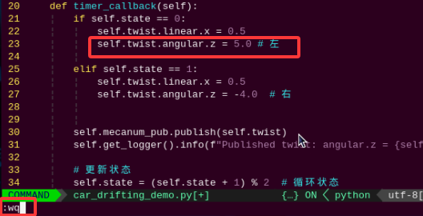

:::{Note}
The adjustable range for the speed is -10.0 to 10.0. A positive value means the robot rotates counterclockwise, while a negative value means it rotates clockwise. It is recommended to adjust the speed incrementally based on actual needs.
:::

(6) After making the change, follow the steps in "[**3.6.2 Enabling and Disabling the Feature**](#anchor_3_6_2)" to run the program again and observe the updated effect.


## 3.7 URDF Model  

### 3.7.1 Introduction and Getting Started with URDF Model

#### 3.7.1.1 URDF Model Introduction

URDF is a format based on the XML specification, designed for describing the structure of robots. Its purpose is to provide a robot description standard that is as general and widely applicable as possible.

Robots are typically composed of multiple links and joints. A link is defined as a rigid object with certain physical properties, while a joint connects two links and constrains their relative motion.

By connecting links with joints and imposing motion restrictions, a kinematic model is formed. The URDF file specifies the relationships between joints and links, their inertial properties, geometric characteristics, and collision models.

#### 3.7.1.2 Comparison between Xacro and URDF Model

The URDF model serves as a description file for simple robot models, offering a clear and easily understandable structure. However, when it comes to describing complex robot structures, using URDF alone can result in lengthy and unclear descriptions.

To address this limitation, the xacro model extends the capabilities of URDF while maintaining its core features. The Xacro format provides a more advanced approach to describing robot structures. It greatly improves code reusability and helps avoid excessive description length.

For instance, when describing the two legs of a humanoid robot, the URDF model would require separate descriptions for each leg. On the other hand, the Xacro model allows for describing a single leg and reusing that description for the other leg, resulting in a more concise and efficient representation.

<p id ="p3-7-1-3"></p>

#### 3.7.1.3 URDF Model Basic Syntax

* **XML Basic Syntax**

Since URDF models are written based on the XML specification, it is necessary to understand the basic structure of the XML format.

**Elements:**

An element can be defined as desired using the following formula:

\<element\>

\</element\>

**Properties:**

Properties are included within elements to define characteristics and parameters. Please refer to the following formula to define an element with properties:

\<element property_1="property value1" property_2="property value2"\>

\</element\>

**Comments:**

Comments have no impact on the definition of other properties and elements. Please use the following formula to define a comment:

\<**！** -- comment content --\>

* **Link**

The Link element describes the visual and physical properties of the robot's rigid component. The following tags are commonly used to define the motion of a link:


\<visual\>: Describe the appearance of the link, such as size, color, and shape.

\<inertial\>: Describe the inertia parameters of the link, which will be used in the dynamics calculation.

\<collision\>: Defines the collision properties of the link.

Each tag contains its own child elements and serves different purposes. Refer to the table below for details.

| **Tag**  | **Function**                                                 |
| :------- | :----------------------------------------------------------- |
| origin   | Describe the pose of the link. It contains two parameters, including xyz and rpy. xyz describes the pose of the link in the simulated map. rpy describes the pose of the link in the simulated map. |
| mess     | Describe the mass of the link.                               |
| inertia  | Describe the inertia of the link. As the inertia matrix is symmetrical, these six parameters need to be input, ixx, ixy, ixz, iyy, iyz and izz, as properties. These parameters can be calculated. |
| geometry | Describe the shape of the link. It uses mesh parameter to load texture file, and employs filename parameters to load the path for texture file. It has three child tags, namely box, cylinder and sphere, representing rectangles, cylinders and spheres. |
| material | Describe the material of the link. The parameter name is the required filed. The tag color can be used to change the color and transparency of the link. |

* **Joint**

In a URDF model, joints are defined using the \<joint\> tag. They describe the kinematic and dynamic properties of the robot’s joints, as well as constraints on motion such as position and velocity limits. According to the type of motion, joints in a URDF model can be categorized into six types:

| **Type and Explanation**                                     | **Tag**    |
| :----------------------------------------------------------- | :--------- |
| Rotational joint: can rotate infinitely around a single axis | continuous |
| Rotational joint: similar to continuous, but with rotation angle limits | revolute   |
| Prismatic joint: allows translation along an axis, with position limits | prismatic  |
| Planar joint: allows translation or rotation in orthogonal directions within a plane | planar     |
| Floating joint: allows both translation and rotation         | floating   |
| Fixed joint: a special joint that does not allow any motion  | fixed      |

When defining joint behavior, the following tags are commonly used:


\<parent_link\>: Specifies the parent link.

\<child_link\>: Specifies the child link.

\<calibration\>: Used to calibrate the joint angle.

\<dynamics\>: Describes certain physical properties of the motion.

\<limit\>: Defines motion constraints.

Each tag contains its own child elements and serves different purposes. Refer to the table below for details.

| **Tag**           | **Function**                                                 |
| :---------------- | :----------------------------------------------------------- |
| origin            | Describes the pose of the parent link. It contains two parameters, including xyz and rpy. xyz describes the pose of the link in the simulated map. rpy describes the pose of the link in the simulated map. |
| axis              | Specifies the axis of rotation or translation along the parent link’s X, Y, or Z axis. |
| limit             | Defines motion constraints for the child link. lower and upper attributes specify the range of motion in radians for revolute joints, while the effort attribute specifies the force/torque limit during motion, with both positive and negative values measured in newtons (N). The velocity attribute limits the rotational speed, measured in meters per second (m/s). |
| mimic             | Indicates that this joint’s motion is dependent on another joint. |
| safety_controller | Defines safety parameters that protect the joint from exceeding safe motion limits. |

* **robot Tag**

The top-level tag of a complete robot is \<robot\>. All \<link\> and \<joint\> tags must be included within \<robot\>, as shown below:


* **gazebo Tag**

This tag is used in conjunction with the Gazebo simulator. Within this tag, simulation parameters and import Gazebo plugins can be defined, as well as specify Gazebo's physical properties, and more.


* **Write Simple URDF Model**

**Name the model of the robot**

To start writing the URDF model, we need to set the name of the robot following this format: **\<robot name=“robot model name”\>**. Lastly, input **\</robot\>** at the end to represent that the model is written successfully.


**Set links**

1.  To write the first link and use indentation to indicate that it is part of the currently set model. Set the name of the link using the following format: **\<link name="link name"\>**. Finally, conclude with **\</link\>** to indicate the successful completion of the link definition.


2.  When writing the link description, use indentation to indicate that the description belongs to the current link. Start the description with **\<visual\>** and end it with **\</visual\>**.


3.  The **"\<geometry\>"** tag is employed to define the shape of a link. Once the description is complete, include **"\</geometry\>"**. Within the "\<geometry\>" tag, indentation is used to specify the detailed description of the link's shape. The following example demonstrates a link with a cylindrical shape: **"\<cylinder length="0.01" radius="0.2"/\>"**. In this instance, "length="0.01" signifies a length of 0.01 meters for the link, while "radius="0.2" denotes a radius of 0.2 meters, resulting in a cylindrical shape.


4.  The "\<origin\>" tag is utilized to specify the position of a link, with indentation used to indicate the detailed description of the link's position. The following example demonstrates the position of a link: "\<origin rpy="0 0 0" xyz="0 0 0" /\>". In this example, "rpy" represents the angles of the link, while "xyz" represents the coordinates of the link's position. This example places the link at the origin of the coordinate system.


5.  The "\<material\>" tag is used to define the visual appearance of a link, with indentation used to specify the detailed description of the link's color. To start describing the color, include "\<material\>", and end with "\</material\>" when the description is complete. The following example demonstrates setting a link color to yellow: **\<color rgba="1 1 0 1" /\>**. In this example, rgba="1 1 0 1" represents the color threshold for achieving the set color.


**Set Joint**

1.  To write the first joint, use indentation to indicate that the joint belongs to the current model being set. Then, specify the name and type of the joint as follows: "\<joint name="joint name" type="joint type"\>". Finally, include **\</joint\>** to indicate the completion of the joint definition.


2.  Write the description section for the connection between the link and the joint. Use indentation to indicate that it is part of the currently defined joint. The parent parameter and child parameter should be set using the following format: "\<parent link="parent link"/\>", and "\<child link="child link" /\>". When the joint rotates, the parent link serves as the pivot, and the child link rotates relative to it.


3.  “\<origin\>” describes the position of the joint, with indentation used to specify the detailed coordinates of the joint. The image below describes the position of the joint: “\<origin xyz=“0 0 0.1” /\>”. xyz is the coordinate of the joint, indicating that the joint is located at x=0, y=0, z=0.1 in the coordinate system.


4.  “\<axis\>” describes the orientation of the joint, with indentation used to specify its precise posture. The figure below shows the posture of a joint \<axis xyz="0 0 1" /\>, where xyz defines the orientation of the joint.


5.  \<limit\> is used to restrict joint motion, with indentation applied to specify detailed angle constraints. The code below shows a joint whose maximum torque does not exceed 300 N, with an upper rotation limit of 3.14 radians and a lower limit of -3.14 radians. These limits are defined according to the following formula: effort = **joint torque (N)**, velocity = **joint speed**, lower = **lower bound of the rotation angle (radians)**, upper = **upper bound of the rotation angle (radians)**.


6.  \<dynamics\> describes the dynamic properties of the joint, with indentation used to specify detailed motion parameters. The figure below shows an example of a joint’s dynamics parameters: \<dynamics damping="50" friction="1" /\>  
    where damping specifies the damping value, and friction specifies the friction coefficient.


**The complete code is shown as follows:**


### 3.7.2 Robot URDF Model

#### 3.7.2.1 Getting Started

To understand the URDF model, refer to the [3.7.1.3 URDF Model Basic Syntax](#p3-7-1-3) in this document.

#### 3.7.2.2 Viewing the Robot Model Code

1)  Click the terminal icon  in the system desktop to open a command-line window.

2. Enter the command and press **Enter** to navigate to the directory that contains the simulation model files.

   ```
   cd ros2_ws/src/simulations/turbopi_description/urdf
   ```

   

3. Enter the command to open the robot simulation model file and view the model code.

   ```
   vim turbopi.xacro
   ```


#### 3.7.2.3 URDF Model Visualization

1)  Click the terminal icon  in the system desktop to open a command-line window.

2. Enter the following command and press **Enter** to start the RVIZ simulation.

   ```
   ros2 launch turbopi_description display.launch.py
   ```

   

   

3)  Dragging the sliders on the left allows the corresponding components to rotate.

