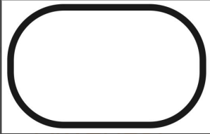
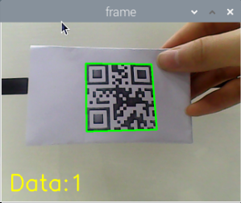

# 4. ROS+Open CV Course

## 4.1 Single Color Recognition

###  4.1.1 Brief Overview of Operation

In this section, the camera is used to detect colors. When a red object is recognized, it will be circled on the screen and the message "**Color: red**" will be printed.

The implementation of color recognition is divided into two parts: color detection and response execution.

In the recognition process, Gaussian filtering is first applied to reduce noise in the image. Then, the image is converted to the Lab color space to better distinguish colors.

Based on this, color thresholds are used to identify the color of the object within the circle. A mask is then applied to the image, which involves selecting parts of the image, graphics, or objects to globally or locally block out areas in the image for processing.

After masking, morphological operations including opening and closing are performed on the object image to refine the results.

Opening operation: Involves erosion followed by dilation. Effect: Removes small objects, smooths object boundaries, and does not affect object area, and helps eliminate small noise and separates connected objects.

Closing operation: Involves dilation followed by erosion. Effect: Fills small holes inside objects, connect adjacent objects, and bridge broken contours, while also smoothing boundaries without changing the area.

Once the recognition is complete, the buzzer is configured so that the robot can respond based on the detection. For detailed feedback behaviors corresponding to different detections, please refer to [4.1.3 Project Outcome](#anchor_4_1_3) of this document.

<p id="anchor_4_1_2"></p>

###  4.1.2 Enabling and Disabling the Feature

:::{Note}

When entering commands, be sure to use correct case and spacing. You can use the Tab key to auto-complete keywords.

:::

(1) Power on the device and connect via VNC remote desktop tool.


(2) Click the terminal icon  in the upper-left corner of the system desktop to open a command-line window.


(3) Enter the following command and press Enter to navigate to the directory where the feature's program is stored:

```
cd /home/ubuntu/ros2_ws/src/example/example
```

(4) Enter the following command and press Enter to start the feature.

```
python3 color_warning.py
```

(5) To exit the feature, press Ctrl+C in the terminal. If the feature does not exit immediately, press Ctrl+C multiple times.

<p id="anchor_4_1_3"></p>

###  4.1.3 Project Outcome

When the feature is activated, the camera is used to detect colors. When a red object is recognized, it will be circled on the screen and the message "**Color: red**" will be printed.

:::{Note}

* For best results, perform traffic sign recognition in a well-lit environment to avoid errors caused by poor lighting.

* During the recognition process, avoid having objects in the camera's field of view that are similar or identical in color to the target object, as this may cause misidentification.

* If the color recognition is inaccurate, refer to the section "[**4.1.5 Feature Extensions → Adjusting Color Thresholds**](#anchor_4_1_5)" in this document to configure the color threshold settings.

:::

###  4.1.4 Program Brief Analysis

The source code for this demo is located at [/home/ubuntu/ros2_ws/src/example/example/color_warning.py](../_static/source_code/example.zip)

* **Import the Necessary Libraries**

(1) In Python, libraries are imported using the import statement. In this program, libraries such as cv2 for image processing, numpy for numerical computation, and rclpy for the ROS2 framework are included to support image operations, mathematical calculations, and robot control.

{lineno-start=4}

```
import cv2
import math
import time
import threading
import numpy as np
import rclpy
from rclpy.node import Node
from sensor_msgs.msg import Image
from ros_robot_controller_msgs.msg import BuzzerState, RGBStates
from cv_bridge import CvBridge
import sdk.yaml_handle as yaml_handle
import sdk.Misc as Misc
```

(2) Other commonly used libraries include those for OpenCV, time management, mathematics, and threading. To call a function from a library, use the format of library_name.function_name(parameter1, parameter2, …)

{lineno-start=68}

```
            time.sleep(0.01)
```

For example, calling time.sleep() uses the sleep function from the time library, which creates a delay.

Python also includes built-in libraries such as time, cv2, and math, which can be imported and used directly. Additionally, custom libraries can be created and used. For instance, the previously mentioned "**yaml_handle**" file is a user-defined module for reading data.

* **Aliasing Function Libraries**

Some library names may be long or hard to remember. To simplify function calls, aliases are often used. For example:

{lineno-start=14}

```
import sdk.yaml_handle as yaml_handle
```

After aliasing, functions from the ros_robot_controller_sdk library can be called in a format of yaml_handle.function_name(parameter1, parameter2), which makes the code more convenient and easier to read.

{lineno-start=55}

```
        lab_data = yaml_handle.get_yaml_data(yaml_handle.lab_file_path)
```

* **Main Function Analysis**

In Python, the main function of a program is defined as "**\_\_name\_\_ == '\_\_main\_\_:**'".

(1) Converting ROS Image Messages to Usable Images

{lineno-start=87}

```
        # Convert ROS image message to OpenCV image (将ROS图像消息转换为OpenCV图像)
        img = self.bridge.imgmsg_to_cv2(msg, "bgr8")
```

When the feature is activated, the system retrieves an image from the ROS image message and stores it in the variable img.

(2) Image Processing

When an image is received, the run() function is triggered for image processing.

{lineno-start=90}

```
        # Process image and detect color (处理图像并检测颜色)
        frame = self.run(img)
```

(3) Gaussian Blur

Images often contain noise, which can reduce clarity and make it harder to detect features. To reduce noise, different filtering methods can be applied depending on the type of noise. Common techniques include Gaussian blur, Median blur, and Mean blur.

Gaussian blur is a linear smoothing filter especially effective for reducing Gaussian noise. It's widely used in image processing for denoising.

{lineno-start=107}

```
        frame_gb = cv2.GaussianBlur(frame_resize, (3, 3), 3)
```

First parameter: `frame_resize` – the input image

Second parameter: `(3, 3)` – the size of the Gaussian kernel

Third parameter: `3` – the standard deviation in the X direction

(4) Convert Image to LAB Color Space

Use the `cv2.cvtColor()` function to convert between color spaces.

{lineno-start=108}

```
        frame_lab = cv2.cvtColor(frame_gb, cv2.COLOR_BGR2LAB)
```

First parameter: `frame_gb` – the input image

Second parameter: `cv2.COLOR_BGR2LAB` – conversion code that converts BGR format to LAB. If you want to convert from BGR to RGB instead, use `cv2.COLOR_BGR2RGB`.

(5) Convert Image to Binary Format

Binary images contain only 0 and 1 values, making them simpler and easier to process. The cv2.inRange() function is used to perform thresholding.

{lineno-start=115}

```
        for color_name, color_data in lab_data.items():
            if color_name not in ['black', 'white']:
                frame_mask = cv2.inRange(frame_lab,
                                        (color_data['min'][0], color_data['min'][1], color_data['min'][2]),
                                        (color_data['max'][0], color_data['max'][1], color_data['max'][2]))
```

First parameter: `frame_lab` – the input image

Second parameter:` (lab_data[i]['min'][0], lab_data[i]['min'][1], lab_data[i]['min'][2])` – lower bound for LAB threshold

Third parameter: `(lab_data[i]['max'][0], lab_data[i]['max'][1], lab_data[i]['max'][2])` – upper bound for LAB threshold

To reduce noise and create smoother binary images, erosion and dilation operations are applied. These are basic morphological operations commonly used in image processing, especially for binary images. They help remove small noise, separate or identify objects, and adjust image size.

{lineno-start=121}

```
                eroded = cv2.erode(frame_mask, cv2.getStructuringElement(cv2.MORPH_RECT, (3, 3)))
                dilated = cv2.dilate(eroded, cv2.getStructuringElement(cv2.MORPH_RECT, (3, 3))) 
```

The first parameter is the input image.

The second parameter is the structuring element (kernel), which defines the nature of the operation. The size and shape of the kernel determine the intensity of erosion and dilation.

(6) Obtaining the Largest Contour

After the above processing, contour detection is used to identify the target object. The cv2.contourArea() function from the cv2 library is used.

{lineno-start=152}

```
    def get_area_max_contour(self, contours):
        """Get the largest contour (获取最大轮廓)"""
        max_area = 0
        max_contour = None
        for c in contours:
            area = math.fabs(cv2.contourArea(c))
            if area > max_area and area > 50:
                max_area = area
                max_contour = c
        return max_contour, max_area
```

The variable `max_area` stores the largest contour area found, initially set to 0.

The variable `max_contour` stores the contour with the largest area, initially set to None.

The `cv2.contourArea()` function calculates the area of each contour.

To decide whether the contour's area is larger than max_area and greater than 50. If it is true, update max_area with the current area and max_contour with the current contour c.

{lineno-start=157}

```
            area = math.fabs(cv2.contourArea(c))
            if area > max_area and area > 50:
                max_area = area
                max_contour = c
```

(7) Displaying the Output

{lineno-start=93}

```
        # Display processed image (显示处理后的图像)
        cv2.imshow('Frame', frame)
        key = cv2.waitKey(1)
        if key == 27:  # Exit with ESC (按ESC退出)
            self.destroy_node()
            cv2.destroyAllWindows()
```

The `cv2.resize()` function resizes the processed image to an appropriate display size.

The `cv2.imshow()` function displays the image in a window.  

`'frame'` is the window name and frame_resize is the image to display. To ensure the window functions correctly, `cv2.waitKey()` must be included.

This function waits for a key input. The parameter 1 specifies the delay time.

* **Subthread Analysis**

(1) Activating the RGB LED

The RGB LED color matches the detected color.

{lineno-start=163}

```
    def get_color(self, color_name):
        """Return RGB value of the color (返回颜色的RGB值)"""
        color_map = {
            'red': (0, 0, 255),
            'green': (0, 255, 0),
            'blue': (255, 0, 0),
            'black': (0, 0, 0),
            'purple':(255, 255, 126),
        }
        return color_map.get(color_name, (0, 0, 0))
```

(2) Triggering the Buzzer

{lineno-start=59}

```
        while rclpy.ok():
            if self.detect_color == 'red' and self.di_once:
                # Buzzer starts ringing (蜂鸣器开始响)
                self.publish_buzzer_state(True)
                self.di_once = False
            elif self.detect_color != 'red' and not self.di_once:
                # Buzzer stops (蜂鸣器停止)
                self.publish_buzzer_state(False)
                self.di_once = True
            time.sleep(0.01)
```

The self.publish_buzzer_state(True) method is called to activate the buzzer. True turns the buzzer on, and False turns it off. The di_once attribute is set to True to indicate that the red color detection has already been processed, preventing the buzzer from responding repeatedly.

The line `time.sleep(0.1)` is used to delay for 0.1 seconds, which determines how long the buzzer stays active.

<p id="anchor_4_1_5"></p>

### 4.1.5 Feature Extensions

* **Adjusting Color Thresholds**

If the color recognition does not perform well during usage, the color thresholds may need to be adjusted. This section uses red as an example. The same procedure applies to other colors. Follow the steps below:

:::{Note}

* By default, the system launches the threshold adjustment tool automatically on startup. You can simply click the icon  to open it.

* If the tool does not start automatically, open the command-line terminal and enter the following command, then press Enter:

```
ros2 launch peripherals usb_cam.launch.py
```

:::


(1) Double-click the desktop icon  and click Execute in the pop-up dialog.


(2) Once the interface opens, click Connect.


(3) After a successful connection, select red from the color options in the lower-right corner of the interface.


(4) If no image appears in the preview window, the camera may not be connected correctly. Please check the camera cable.

On the right side of the interface, you will see the live camera feed. On the left side is the color area to be sampled. Point the camera at a red color sample, then adjust the six sliders below the image until the red area on the left turns completely white, and all other areas become black. Then, click Save to save the adjusted threshold settings.


<p id="anchor_4_1_5_2"></p>

* **Changing the Default Recognized Color**

The color recognition program includes three preset colors: red, green, and blue. By default, the system recognizes red — when detected, the buzzer sounds, a red frame appears in the live feed, and the message "**Color: red**" is printed.

**To change the default color to green, follow these steps:**

(1) Open the terminal and navigate to the source code directory.

```
cd /home/ubuntu/ros2_ws/src/example/example
```

(2) Enter the command to open the program file and press Enter.

```
vim color_warning.py
```

(3) Locate the line in the code as shown below.


(4) Press the i key to enter edit mode.


(5) Modify the highlighted line by changing the value to **"green".**


(6) Next to save the changes. Press the Esc key, then type the command **":wq"** and press Enter to save and exit.


(7) Return to the terminal where enters the source code directory and run the color recognition program with:

```
python3 color_warning.py
```

* **Adding a New Recognizable Color**

Besides the three built-in colors, users can define additional colors. The following example shows how to add purple as a new recognizable color:

(1) Double-click the desktop icon  and click Execute in the pop-up dialog.


(2) In the opened window, click Connect.


(3) Click Add, enter a name for the new color (e.g., purple), and click OK.


(4) Use the dropdown menu in the color selector to choose purple.


(5) Point the camera at a purple object. Adjust the L, A, and B sliders until the target area turns white on the left side of the screen, while other areas turn black.


(6) Click Save to store the new threshold settings.


(7) After completing the modifications, you can verify whether the new values have been successfully saved by entering the following command and pressing Enter to navigate to the program directory.

```
cd /home/ubuntu/software/lab_tool
```

(8) Open the program file by entering the command.

```
vim lab_config.yaml
```

(9) You should now be able to see the purple color threshold values.


(10) Then follow steps 1 to 4 of [Changing the Default Recognized Color](#anchor_4_1_5_2) again to open the program file, press the "**i**" key to enter edit mode, and locate the section of code as shown in the figure below.


Manually add the new entry "**'purple':(255, 255, 114),**". As shown in the figure below, (255, 255, 114) corresponds to the max values observed earlier.

```
'purple':(255, 255, 114),
```


(11) Next to save the changes. Press the Esc key, then type the command "**:wq**" and press Enter to save and exit.


(12) Finally, launch the color recognition program again referring to [4.1.2 Enabling and Disabling the Feature](#anchor_4_1_2). Place a purple object in front of the camera—you should see a purple bounding box in the live view and the message "**purple**" printed in the terminal. To set purple as the default color, simply update the value in the program code as shown in [Changing the Default Recognized Color](#anchor_4_1_5_2).

(13) If you want to add more colors for recognition, refer to the steps above for guidance.

<p id="anchor_4_2"></p>

## 4.2 Color Recognition

###  4.2.1 Brief Overview of Operation

In this section, the camera is used for color recognition. When red is detected, the gimbal will "**nod**", and when blue or green is detected, it will "shake its head."

The implementation of color recognition is divided into two parts: color detection and response execution.

In the recognition process, Gaussian filtering is first applied to reduce noise in the image. Then, the image is converted to the Lab color space to better distinguish colors.

Based on this, color thresholds are used to identify the color of the object within the circle. A mask is then applied to the image, which involves selecting parts of the image, graphics, or objects to globally or locally block out areas in the image for processing.

After masking, morphological operations including opening and closing are performed on the object image to refine the results.

Opening operation: Involves erosion followed by dilation. Effect: Removes small objects, smooths object boundaries, and does not affect object area, and helps eliminate small noise and separates connected objects.

Closing operation: Involves dilation followed by erosion. Effect: Fills small holes inside objects, connect adjacent objects, and bridge broken contours, while also smoothing boundaries without changing the area.

After color recognition, the servo, buzzer, and RGB light are configured to trigger different responses based on the detected color. For example, when red is detected, the robot will "**nod**", the buzzer will beep once, and the RGB light will turn red.

For a complete list of gesture-action mappings, refer to the section 3. Project Outcome of this document.

<p id="anchor_4_2_2"></p>

###  4.2.2 Enabling and Disabling the Feature

:::{Note}

When entering commands, be sure to use correct case and spacing. You can use the Tab key to auto-complete keywords.

:::

(1) Power on the device and connect via VNC remote desktop tool.


(2) Click the terminal icon  in the upper-left corner of the system desktop to open a command-line window.


(3) Enter the following command and press Enter to navigate to the directory where the feature's program is stored:

```
cd /home/ubuntu/ros2_ws/src/example/example
```

(4) Enter the following command and press Enter to start the feature.

```
python3 color_recognize.py
```

(5) To exit the feature, press Ctrl+C in the terminal. If the feature does not exit immediately, press Ctrl+C multiple times.

###  4.2.3 Project Outcome

After the feature is activated, the camera responds to different colors with corresponding actions. The behavior is shown in the table below:

| **Object Color** | **Buzzer** | **RGB Light** | **Action** | **Printed Outpt** |
| :--------------- | :--------- | :------------ | :--------- | :---------------- |
| Red              | Beeps once | Red           | Nod        | red               |
| Green            | Beeps once | Green         | Shake Head | green             |
| Blue             | Beeps once | Blue          | Shake Head | blue              |

:::{Note}

* For best results, perform traffic sign recognition in a well-lit environment to avoid errors caused by poor lighting.

* During the recognition process, avoid having objects in the camera's field of view that are similar or identical in color to the target object, as this may cause misidentification.

* If the color recognition is inaccurate, refer to the section "[**4.2.5 Feature Extensions → Adjusting Color Threshold**](#anchor_4_2_5)" in this document to configure the color threshold settings.

:::

###  4.2.4 Program Brief Analysis

The source code for this demo is located at [/home/ubuntu/ros2_ws/src/example/example/color_recognize.py](../_static/source_code/example.zip)

* **Import the Necessary Libraries**

(1) In Python, libraries are imported using the import statement. In this program, libraries such as cv2 for image processing, numpy for numerical computation, and rclpy for the ROS 2 framework are included to support image operations, mathematical calculations, and robot control.

{lineno-start=4}

```
import cv2
import math
import time
import threading
import numpy as np
import rclpy
from rclpy.node import Node
from sensor_msgs.msg import Image
from ros_robot_controller_msgs.msg import BuzzerState, RGBStates, SetPWMServoState, PWMServoState, RGBState  # 导入 RGBState
from cv_bridge import CvBridge
import sdk.yaml_handle as yaml_handle
import sdk.Misc as Misc
```

(2) Other commonly used libraries include those for OpenCV, time management, mathematics, and threading. To call a function from a library, use the format of library_name.function_name(parameter1, parameter2, …)

{lineno-start=79}

```
            time.sleep(0.01)
```

For example, calling time.sleep() uses the sleep function from the time library, which creates a delay.

Python also includes built-in libraries such as time, cv2, and math, which can be imported and used directly. Additionally, custom libraries can be created and used. For instance, the previously mentioned "**yaml_handle**" file is a user-defined module for reading data.

(3) Aliasing Function Libraries

Some library names may be long or hard to remember. To simplify function calls, aliases are often used. For example:

{lineno-start=14}

```
import sdk.yaml_handle as yaml_handle
```

After aliasing, functions from the ros_robot_controller_sdk library can be called in a format of yaml_handle.function_name(parameter1, parameter2), which makes the code more convenient and easier to read.

* **Main Function Analysis**

In Python, the main function of a program is defined as "**\_\_name\_\_ == '\_\_main\_\_:**'". The program begins by calling the init() function to perform initialization. In this case, initialization includes resetting the servo to its initial position and reading the color threshold configuration file. Other typical initialization tasks may involve setting up ports, peripherals, and timers.

{lineno-start=270}

```
def main():
    rclpy.init()
    color_warning_node = ColorWarningNode()
    try:
        rclpy.spin(color_warning_node)
    finally:
        # Perform cleanup before exiting (退出前进行清理)
        color_warning_node.running = False  # Set flag to stop the thread (设置标志以停止线程)
        color_warning_node.destroy_node()  # Ensure the node is destroyed (确保销毁节点)
        rclpy.shutdown()
        cv2.destroyAllWindows() # Ensure OpenCV windows are closed (确保关闭 OpenCV 窗口)


if __name__ == '__main__':
    main()
```

(1) Capture Camera Image

{lineno-start=96}

```
    def image_callback(self, msg):
        """Process image from camera (处理从摄像头获取的图像)"""
        # Convert ROS image message to OpenCV image (将ROS图像消息转换为OpenCV图像)
        img = self.bridge.imgmsg_to_cv2(msg, "bgr8")
        with self.lock:
            self.current_image = img
```

When the feature starts, the image captured by the camera is stored in the variable img.

(2) Image Processing

When an image is received, the run() function is triggered for image processing.

{lineno-start=107}

```
            with self.lock:
                if self.current_image is not None:
                    img = self.current_image.copy()  
                    self.current_image = None  
            if img is not None:
                frame = self.run(img)
                cv2.imshow('Frame', frame)
                key = cv2.waitKey(1)
```

The function `img.copy()` is used to copy the contents of img to a new variable called frame.

The `run()` function handles image processing.

{lineno-start=122}

```
    def run(self, img):
        """Color detection processing (颜色检测处理)"""
        img_copy = img.copy()
        img_h, img_w = img.shape[:2]

        frame_resize = cv2.resize(img_copy, (320, 240), interpolation=cv2.INTER_NEAREST)
        frame_gb = cv2.GaussianBlur(frame_resize, (3, 3), 3)
        frame_lab = cv2.cvtColor(frame_gb, cv2.COLOR_BGR2LAB)

        max_area = 0
        color_area_max = None
        areaMaxContour_max = 0

        # Traverse color ranges from config file for detection (遍历配置文件中的颜色范围进行颜色检测)
        for color_name, color_data in lab_data.items():
            if color_name not in ['black', 'white']:
                frame_mask = cv2.inRange(frame_lab,
                                        (color_data['min'][0], color_data['min'][1], color_data['min'][2]),
                                        (color_data['max'][0], color_data['max'][1], color_data['max'][2]))
                eroded = cv2.erode(frame_mask, cv2.getStructuringElement(cv2.MORPH_RECT, (3, 3)))
                dilated = cv2.dilate(eroded, cv2.getStructuringElement(cv2.MORPH_RECT, (3, 3)))
                contours = cv2.findContours(dilated, cv2.RETR_EXTERNAL, cv2.CHAIN_APPROX_NONE)[-2]
                areaMaxContour, area_max = self.get_area_max_contour(contours)

                if areaMaxContour is not None:  # Ensure areaMaxContour exists (确保 areaMaxContour 存在)
                    if area_max > max_area:
                        max_area = area_max
                        color_area_max = color_name
                        areaMaxContour_max = areaMaxContour
```

(3) Resize the Image for Easier Processing

{lineno-start=127}

```
        frame_resize = cv2.resize(img_copy, (320, 240), interpolation=cv2.INTER_NEAREST)
```

The first parameter `img_copy` is the input image.

The second parameter `(320, 240)` specifies the output image size. You can adjust this size as needed.

Parameter 3: `interpolation=cv2.INTER_NEAREST – Interpolation method. `

`INTER_NEAREST`: Nearest neighbor interpolation. 

`INTER_LINEAR`: Bilinear interpolation, default if unspecified. 

`INTER_CUBIC`: Bicubic interpolation using a 4×4 pixel neighborhood. 

`INTER_LANCZOS4`: Lanczos interpolation using an 8×8 neighborhood.

(4) Gaussian Blur

Images often contain noise, which can reduce clarity and make it harder to detect features. To reduce noise, different filtering methods can be applied depending on the type of noise. Common techniques include Gaussian blur, Median blur, and Mean blur.

Gaussian blur is a linear smoothing filter especially effective for reducing Gaussian noise. It's widely used in image processing for denoising.

{lineno-start=128}

```
        frame_gb = cv2.GaussianBlur(frame_resize, (3, 3), 3)
```

First parameter: `frame_resize` – the input image

Second parameter: `(3, 3)` – the size of the Gaussian kernel

Third parameter:` 3` – the standard deviation in the X direction

(5) Convert the image to LAB color space, the function `cv2.cvtColor()` is used to convert the color space of an image.

{lineno-start=129}

```
        frame_lab = cv2.cvtColor(frame_gb, cv2.COLOR_BGR2LAB)
```

First parameter: `frame_gb` – the input image

Second parameter: `cv2.COLOR_BGR2LAB` – conversion code that converts BGR format to LAB. If you want to convert from BGR to RGB instead, use `cv2.COLOR_BGR2RGB`.

(6) Convert images to binary images which contain only 0 and 1 values, making them simpler and easier to process.

The `cv2.inRange()` function is used to perform thresholding.

{lineno-start=138}

```
                frame_mask = cv2.inRange(frame_lab,
                                        (color_data['min'][0], color_data['min'][1], color_data['min'][2]),
                                        (color_data['max'][0], color_data['max'][1], color_data['max'][2]))
```

First parameter: `frame_lab` – the input image

The second parameter (`color_data[i]['min'][0], color_data[i]['min'][1], color_data[i]['min'][2]`) defines the lower bound of the color threshold.

The third parameter (`color_data[i]['max'][0], color_data[i]['max'][1], color_data[i]['max'][2]`) defines the upper bound of the color threshold.

(7) To refine the initial color mask image during color detection—removing noise, smoothing contours, and accurately extracting and analyzing objects of a specific color—morphological operations and contour detection using the OpenCV library are applied.

{lineno-start=141}

```
                eroded = cv2.erode(frame_mask, cv2.getStructuringElement(cv2.MORPH_RECT, (3, 3)))
                dilated = cv2.dilate(eroded, cv2.getStructuringElement(cv2.MORPH_RECT, (3, 3)))
                contours = cv2.findContours(dilated, cv2.RETR_EXTERNAL, cv2.CHAIN_APPROX_NONE)[-2]
                areaMaxContour, area_max = self.get_area_max_contour(contours)
```

In the first line, the first parameter `frame_mask` is the input image.

The second parameter `cv2.getStructuringElement(cv2.MORPH_RECT, (3, 3))` defines the structuring element. The function `cv2.getStructuringElement()` is used to create a structuring element. During the erosion process, if all pixels covered by the structuring element are not foreground pixels (value = 255), the center pixel is set to a background pixel (value = 0), which results in erosion.

In the second line, the first parameter eroded is the image after erosion, used here as the input for dilation.

The second parameter `cv2.getStructuringElement(cv2.MORPH_RECT, (3, 3))` again creates a 3×3 rectangular structuring element. In the dilation operation, if any pixel within the area covered by the structuring element is a foreground pixel (value = 255), the center pixel is set to a foreground pixel, which expands the foreground region.

(8) Obtaining the Largest Contour

After the above processing, contour detection is used to identify the target object. The `findContours()` function from the cv2 library is used.

{lineno-start=143}

```
                contours = cv2.findContours(dilated, cv2.RETR_EXTERNAL, cv2.CHAIN_APPROX_NONE)[-2]
```

The first parameter `dilated` is the input image used for contour detection.

The second parameter `cv2.RETR_EXTERNAL` is the contour retrieval mode.

The third parameter `cv2.CHAIN_APPROX_NONE)[-2]` is the contour approximation method.

Among the detected contours, the one with the largest area is selected. To avoid interference, a minimum area threshold is set. Only contours with an area larger than this threshold are considered valid targets.

{lineno-start=221}

```
    def get_area_max_contour(self, contours):
        """Get the largest contour (获取最大轮廓)"""
        max_area = 0
        max_contour = None
        for c in contours:
            area = math.fabs(cv2.contourArea(c))
            if area > max_area and area > 50:
                max_area = area
                max_contour = c
        return max_contour, max_area
```

(9) A conditional statement is used to determine which color in the image has the largest area.

{lineno-start=146}

```
                if areaMaxContour is not None:  # Ensure areaMaxContour exists (确保 areaMaxContour 存在)
                    if area_max > max_area:
                        max_area = area_max
                        color_area_max = color_name
                        areaMaxContour_max = areaMaxContour
```

(10) Displaying the Output

{lineno-start=127}

```
        frame_resize = cv2.resize(img_copy, (320, 240), interpolation=cv2.INTER_NEAREST)
```

{lineno-start=111}

```
            if img is not None:
                frame = self.run(img)
                cv2.imshow('Frame', frame)
                key = cv2.waitKey(1)
                if key == 27:  # Exit with ESC (按ESC退出)
                    self.running = False
                    cv2.destroyAllWindows()
                    break
```

The `cv2.resize()` function resizes the processed image to an appropriate display size.

The `cv2.imshow()` function displays the image in a window.  

`'frame'` is the window name and frame_resize is the image to display. To ensure the window functions correctly, cv2.waitKey() must be included.

This function waits for a key input. The parameter 1 specifies the delay time.

* **Subthread Analysis**

The sub-thread function of the robot runs when a color is recognized, triggering the run() function to handle the recognized color.

This mainly involves analyzing the image processing results and executing corresponding responses, including control of RGB lights, buzzer, and other modules.

{lineno-start=122}

```
    def run(self, img):
        """Color detection processing (颜色检测处理)"""
        img_copy = img.copy()
        img_h, img_w = img.shape[:2]

        frame_resize = cv2.resize(img_copy, (320, 240), interpolation=cv2.INTER_NEAREST)
        frame_gb = cv2.GaussianBlur(frame_resize, (3, 3), 3)
        frame_lab = cv2.cvtColor(frame_gb, cv2.COLOR_BGR2LAB)

        max_area = 0
        color_area_max = None
        areaMaxContour_max = 0

        # Traverse color ranges from config file for detection (遍历配置文件中的颜色范围进行颜色检测)
        for color_name, color_data in lab_data.items():
            if color_name not in ['black', 'white']:
                frame_mask = cv2.inRange(frame_lab,
                                        (color_data['min'][0], color_data['min'][1], color_data['min'][2]),
                                        (color_data['max'][0], color_data['max'][1], color_data['max'][2]))
                eroded = cv2.erode(frame_mask, cv2.getStructuringElement(cv2.MORPH_RECT, (3, 3)))
                dilated = cv2.dilate(eroded, cv2.getStructuringElement(cv2.MORPH_RECT, (3, 3)))
                contours = cv2.findContours(dilated, cv2.RETR_EXTERNAL, cv2.CHAIN_APPROX_NONE)[-2]
                areaMaxContour, area_max = self.get_area_max_contour(contours)

                if areaMaxContour is not None:  # Ensure areaMaxContour exists (确保 areaMaxContour 存在)
                    if area_max > max_area:
                        max_area = area_max
                        color_area_max = color_name
                        areaMaxContour_max = areaMaxContour

        with self.lock:  # Lock when accessing shared resources (在访问共享资源时加锁)
            if max_area > 2000:
                ((centerX, centerY), radius) = cv2.minEnclosingCircle(areaMaxContour_max)
                centerX = int(Misc.map(centerX, 0, 320, 0, img_w))
                centerY = int(Misc.map(centerY, 0, 240, 0, img_h))
                radius = int(Misc.map(radius, 0, 320, 0, img_w))
                cv2.circle(img, (centerX, centerY), radius, self.get_color(color_area_max), 2)

                self.detect_color = color_area_max
                self.draw_color = self.get_color(color_area_max)

                if self.detect_color != self.previous_color:
                    if self.detect_color == 'red':
                        self.nod_head()
                    else:
                        self.shake_head()

                    self.previous_color = self.detect_color

            # Set RGB light based on detected color (always set) (根据检测到的颜色设置 RGB 灯 (始终设置))
                self.set_rgb_color(self.detect_color)  # Always call (始终调用)
```

(1) Activating the RGB LED

The RGB LED color matches the detected color.

{lineno-start=243}

```
    def set_rgb_color(self, color_name):
        """Set RGB light color (设置 RGB 灯的颜色)"""
        rgb_msg = RGBStates()
        rgb_msg.states = []  # Initialize status list (初始化状态列表)

        if color_name == 'red':
            rgb_msg.states.append(RGBState(index=1, red=255, green=0, blue=0))  # Set LED 1 to red (设置 LED 1 为红色)
            rgb_msg.states.append(RGBState(index=2, red=255, green=0, blue=0))  # Set LED 2 to red (设置 LED 2 为红色)
        elif color_name == 'green':
            rgb_msg.states.append(RGBState(index=1, red=0, green=255, blue=0))  # Set LED 1 to green (设置 LED 1 为绿色)
            rgb_msg.states.append(RGBState(index=2, red=0, green=255, blue=0))  # Set LED 2 to green (设置 LED 2 为绿色)
        elif color_name == 'blue':
            rgb_msg.states.append(RGBState(index=1, red=0, green=0, blue=255))  # Set LED 1 to blue (设置 LED 1 为蓝色)
            rgb_msg.states.append(RGBState(index=2, red=0, green=0, blue=255))  # Set LED 2 to blue (设置 LED 2 为蓝色)
        elif color_name == 'yellow':
            rgb_msg.states.append(RGBState(index=1, red=255, green=255, blue=0))  # Set LED 1 to yellow (设置 LED 1 为黄色)
            rgb_msg.states.append(RGBState(index=2, red=255, green=255, blue=0))  # Set LED 2 to yellow (设置 LED 2 为黄色)
        elif color_name == 'purple':
            rgb_msg.states.append(RGBState(index=1, red=192, green=0, blue=192))  
            rgb_msg.states.append(RGBState(index=2, red=192, green=0, blue=192))
        else:  # 'None' or other undefined colors ('None' 或者其他未定义的颜色)
            rgb_msg.states.append(RGBState(index=1, red=0, green=0, blue=0))  # Turn off LED 1 (关闭 LED 1)
            rgb_msg.states.append(RGBState(index=2, red=0, green=0, blue=0))  # Turn off LED 2 (关闭 LED 2)
```

(2) Triggering the Buzzer

{lineno-start=81}

```
    def publish_buzzer_state(self, state: bool):
        """Publish buzzer status message (发布蜂鸣器状态消息)"""
        buzzer_msg = BuzzerState()
        if state:
            buzzer_msg.freq = 1900
            buzzer_msg.on_time = 0.2
            buzzer_msg.off_time = 0.01
            buzzer_msg.repeat = 1
        else:
            buzzer_msg.freq = 0
            buzzer_msg.on_time = 0.0
            buzzer_msg.off_time = 0.0
            buzzer_msg.repeat = 0
        self.buzzer_publisher.publish(buzzer_msg)
```

The function publish_buzzer_stater() is used to drive the buzzer. For example, with the code:

```
if state:
	buzzer_msg.freq = 1900
	buzzer_msg.on_time = 0.2
	buzzer_msg.off_time = 0.01
	buzzer_msg.repeat = 1
```

The first parameter `1900` is the frequency (Hz).

The second parameter `0.2` is the buzzer's active time, in seconds.

The third parameter `0.01` is the buzzer's off time, in seconds.

The fourth parameter `1` is the number of repetitions (default is 1).

(3) Robot Movement Execution

After determining whether the recognized color matches the preset color, the robot will perform either a nodding or shaking movement.

{lineno-start=69}

```
    def buzzer(self):
        """Control buzzer sound (控制蜂鸣器的响铃)"""
        while rclpy.ok() and self.running: 
            with self.lock:
                if self.detect_color == 'red' and self.di_once:
                    self.publish_buzzer_state(True)
                    self.di_once = False
                elif self.detect_color != 'red' and not self.di_once:
                    self.publish_buzzer_state(False)
                    self.di_once = True
            time.sleep(0.01)
```

{lineno-start=189}

```
    def nod_head(self):
        """Nodding motion (点头动作)"""
        self.pwm_controller([1, 1800])
        time.sleep(0.3)
        self.pwm_controller([1, 1200])
        time.sleep(0.3)
        self.pwm_controller([1, 1500])
        time.sleep(0.3)
    def shake_head(self):
        """Shaking head motion (摇头动作)"""
        self.pwm_controller([2, 1200])
        time.sleep(0.3)
        self.pwm_controller([2, 1800])
        time.sleep(0.3)
        self.pwm_controller([2, 1500])
        time.sleep(0.3)
```

{lineno-start=163}

```
                if self.detect_color != self.previous_color:
                    if self.detect_color == 'red':
                        self.nod_head()
                    else:
                        self.shake_head()

                    self.previous_color = self.detect_color
```

The function `self.pwm_controller()` is used to control the PWM servo. For example, with the code `self.pwm_controller([1, 1800])`:

The first parameter `0.3` represents the duration of the servo movement, in seconds.

The second parameter pwm_controller is a list of servo position settings. It is a list in which each element is a tuple consisting of a servo ID and its corresponding position value.

<p id="anchor_4_2_5"></p>

###  4.2.5 Feature Extensions

* **Adjusting Color Threshold**

If the color recognition does not perform well during usage, the color thresholds may need to be adjusted. This section uses red as an example. The same procedure applies to other colors. Follow the steps below:

:::{Note}

* By default, the system launches the threshold adjustment tool automatically on startup. You can simply click the icon  to open it.

* If the tool does not start automatically, open the command-line terminal and enter the following command, then press Enter:

  ```
  ros2 launch peripherals usb_cam.launch.py
  ```

  :::

(1) Double-click the desktop icon  and click Execute in the pop-up dialog.


(2) Once the interface opens, click Connect to connect the camera.


(2) After a successful connection, select red from the color options in the lower-right corner of the interface.


(3) If no image appears in the preview window, the camera may not be connected correctly. Please check the camera cable.

On the right side of the interface, you will see the live camera feed. On the left side is the color area to be sampled. Point the camera at a red ball, then adjust the six sliders below the image until the red ball area on the left turns completely white, and all other areas become black. Then, click Save to save the adjusted threshold settings.


<p id="anchor_4_2_5_2"></p>

* **Changing the Default Recognized Color**

The color recognition program includes three built-in colors: red, green, and blue. By default, when red is recognized, the camera performs a nodding motion.

**Here we take changing the default color to green as an example. The specific steps are as follows:**

(1) Enter the following command and press Enter to navigate to the program's source directory.

```
cd /home/ubuntu/ros2_ws/src/example/example
```

(2) Open the program file by entering the command.

```
vim color_recognize.py
```

(3) In the opened file, locate the APPID section as shown in the reference image.


:::{Note}

After entering the line number in Vim, press Shift + G to jump directly to that line. The line number in the image is for reference only, please refer to the actual file.

:::

(4) Press the i key to enter edit mode.


(5) When a red object is detected, the robot will nod. To change it to nod when a green object is detected, modify 'red' in detect_color == 'red' to 'green', as shown in the image below:


(6) When a red object is detected, the buzzer will sound. To change it so the buzzer sounds when a green object is detected, replace "**red**" with "**green**" in detect_color == 'red', as shown in the image below:


(7) Next to save the changes. Press the Esc key, then type the following command to save and exit:

```
:wq
```


(8) Finally, restart the color recognition program by entering the appropriate command and pressing Enter.

```
python3 color_recognize.py
```

* **Adding a New Recognizable Color**

Besides the three built-in colors, users can define additional colors. The following example shows how to add purple as a new recognizable color:

:::{Note}

* By default, the system launches the threshold adjustment tool automatically on startup. You can simply click the icon  to open it.

* If the tool does not start automatically, open the command-line terminal and enter the following command, then press Enter:

```
ros2 launch peripherals usb_cam.launch.py
```

:::

(1) Double-click the desktop icon  and click Execute in the pop-up dialog.


(2) In the opened window, click Connect.


(3) Click Add, enter a name for the new color (e.g., purple), and click OK.


(4) Use the dropdown menu in the color selector to choose purple.


(5) Point the camera at a purple object. Adjust the L, A, and B sliders until the target area turns white on the left side of the screen, while other areas turn black.


(6) Click Save to store the new threshold settings.


(7) After completing the modifications, you can verify whether the new values have been successfully saved by entering the following command and pressing Enter to navigate to the program directory.

```
cd /home/ubuntu/software/lab_tool
```

(8) Open the program file by entering the command.

```
vim lab_config.yaml
```

(9) You should now be able to see the purple color threshold values.


(10) Then follow steps 1 to 2 of section [Changing the Default Recognized Color](#anchor_4_2_5_2) again to open the program file, press the "**i**" key to enter edit mode, and locate the section of code as shown in the figure below.


(11) Manually enter 'purple': (255, 255, 126) — this represents the RGB value of the color purple. Since the system uses the BGR color format, the RGB values need to be rearranged accordingly. However, in this case, the values remain (255, 255, 126) after conversion. You can look up the color's RGB values here -\> https://tools.jb51.net/static/colorpicker/.


(12) Locate the line in the code as shown below.


(13) Manually enter the content in the input box to set the onboard light on the expansion board to purple. Fill in the RGB values for purple here. You can look up the color's RGB values at -\> https://tools.jb51.net/static/colorpicker/. As shown in the figure below:


(14) Locate the line in the code as shown below.


(15) Next to save the changes. Press the Esc key, then type the following command to save and exit:

```
:wq
```

(16) Refer to [4.2.2 Enabling and Disabling the Feature](#anchor_4_2_2) in this document to restart the feature. Place a purple object in front of the camera, and the camera will perform the **"shake head"** action. If you want it to perform the "**nod**" action instead, refer to [Changing the Default Recognized Color](#anchor_4_2_5_2) to change the default recognized color to purple.

(17) If you want to add more colors for recognition, refer to the steps above for guidance.

## 4.3 Color Positioning

###  4.3.1 Brief Overview of Operation

In this lesson, the camera can be used to recognize red, green, and blue color balls. The recognized objects will be highlighted in the return feed, and their X and Y coordinate positions will be displayed.

The implementation of color position recognition consists of two parts: color detection and position marking.

In the recognition process, Gaussian filtering is first applied to reduce noise in the image. Then, the image is converted to the Lab color space to better distinguish colors.

Based on this, color thresholds are used to identify the color of the object within the circle. A mask is then applied to the image, which involves selecting parts of the image, graphics, or objects to globally or locally block out areas in the image for processing.

After masking, morphological operations including opening and closing are performed on the object image to refine the results.

**Opening operation:** Involves erosion followed by dilation. Effect: Removes small objects, smooths object boundaries, and does not affect object area, and helps eliminate small noise and separates connected objects.

**Closing operation:** Involves dilation followed by erosion. Effect: Fills small holes inside objects, connect adjacent objects, and bridge broken contours, while also smoothing boundaries without changing the area.

Position marking requires the use of specific detection algorithms. The basic principle is to search for regions in the image that match predefined features or patterns, and then return the positions and bounding boxes of these regions.

###  4.3.2 Enabling and Disabling the Feature

:::{Note}

When entering commands, be sure to use correct case and spacing. You can use the Tab key to auto-complete keywords.

:::

(1) Power on the device and connect via VNC remote desktop tool.


(2) Click the terminal icon  in the upper-left corner of the system desktop to open a command-line window.


(3) In the opened interface, enter the command to navigate to the directory where the feature program is located, and press Enter.

```
cd /home/ubuntu/ros2_ws/src/example/example
```

(4) Entering the following command and press Enter to start the feature.

```
python3 color_position_recognition.py
```

(5) To exit the feature, press **Ctrl+C** in the terminal. If the feature does not exit immediately, press Ctrl+C multiple times.

###  4.3.3 Project Outcome

The program is set by default to track red, green, and blue balls. Once the colors are successfully recognized, they will be highlighted with bounding boxes in the returned video feed, and their XY coordinates will be displayed in the lower left corner of each box.

:::{Note}

* For best results, perform traffic sign recognition in a well-lit environment to avoid errors caused by poor lighting.

* During the recognition process, avoid having objects in the camera's field of view that are similar or identical in color to the target object, as this may cause misidentification.

* If the color recognition is inaccurate, refer to the section "[**4.3.5 Feature Extensions → Adjusting Color Thresholds**](#anchor_4_3_5)" in this document to configure the color threshold settings.

:::

###  4.3.4 Program Brief Analysis

The source code for this demo is located at [/home/ubuntu/ros2_ws/src/example/example/color_position_recognition.py](../_static/source_code/example.zip)

(1) In Python, libraries are imported using the import statement. In this program, libraries such as cv2 for image processing, numpy for numerical computation, and rclpy for the ROS 2 framework are included to support image operations, mathematical calculations, and robot control.

{lineno-start=4}

```
import cv2
import math
import time
import threading
import rclpy
from rclpy.node import Node
from sensor_msgs.msg import Image
from cv_bridge import CvBridge
import sdk.yaml_handle as yaml_handle
import sdk.Misc as Misc
import numpy as np  # 确保导入 numpy
```

(2) Other commonly used libraries include those for OpenCV, time management, mathematics, and threading. To call a function from a library, use the format of library_name.function_name(parameter1, parameter2, …)

{lineno-start=88}

```
                time.sleep(0.01)  # Wait briefly if no image is available (如果没有图像，则稍作等待)
```

For example, calling time.sleep() uses the sleep function from the time library, which creates a delay.

Python also includes built-in libraries such as time, cv2, and math, which can be imported and used directly. Additionally, custom libraries can be created and used. For instance, the previously mentioned `yaml_handle` file is a user-defined module for reading data.

(3) Aliasing Function Libraries

Some library names may be long or hard to remember. To simplify function calls, aliases are often used. For example:

{lineno-start=4}

```
import cv2
import math
import time
import threading
import rclpy
from rclpy.node import Node
from sensor_msgs.msg import Image
from cv_bridge import CvBridge
import sdk.yaml_handle as yaml_handle
import sdk.Misc as Misc
import numpy as np  # 确保导入 numpy
```

After aliasing, functions from the Misc library can be called in a format of Misc.function_name(parameter1, parameter2), which makes the code more convenient and easier to read.

(4) Main Function Analysis 

In Python, the main function of a program is defined as `__name__ == '__main__:`. First, the camera needs to be opened and the video stream read. The `read()` method is used to capture each frame of the image. It then detects and marks the colored balls and displays the result. By continuously reading and displaying frames in a loop, video playback is achieved. After the video stream ends or the program is terminated, the `release()` function is used to free up resources.

{lineno-start=169}

```
def main():
    rclpy.init()
    color_warning_node = ColorWarningNode()
    try:
        rclpy.spin(color_warning_node)
    finally:
        # Perform cleanup before exiting (退出前进行清理)
        color_warning_node.running = False  # Set flag to stop the thread (设置标志以停止线程)
        color_warning_node.destroy_node()  # Ensure the node is destroyed (确保销毁节点)
        rclpy.shutdown()
        cv2.destroyAllWindows() # Ensure OpenCV windows are closed (确保关闭 OpenCV 窗口)


if __name__ == '__main__':
    main()
```

(5) Image Processing

The `run()` function handles image processing.

{lineno-start=90}

```
    def run(self, img):
        """Color detection processing (颜色检测处理)"""
        img_copy = img.copy()
        img_h, img_w = img.shape[:2]

        if not self.__isRunning:   # Check if the program is enabled, return the original image if not enabled(检测是否开启玩法，没有开启则返回原图像)
            return img

        frame_resize = cv2.resize(img_copy, self.size, interpolation=cv2.INTER_NEAREST)
        frame_gb = cv2.GaussianBlur(frame_resize, (3, 3), 3)
        frame_lab = cv2.cvtColor(frame_gb, cv2.COLOR_BGR2LAB)  # Convert the image to the LAB space(将图像转换到LAB空间)

        max_area = 0
        areaMaxContour = None #fixed
```

(6) Resize the Image

{lineno-start=98}

```
        frame_resize = cv2.resize(img_copy, self.size, interpolation=cv2.INTER_NEAREST)
```

The first parameter `img_copy` is the input image.

The second parameter `self.size` specifies the output image size. You can adjust this size as needed.

Parameter 3: `interpolation=cv2.INTER_NEAREST` – Interpolation method.

` INTER_NEAREST`: Nearest neighbor interpolation.

` INTER_LINEAR`: Bilinear interpolation, default if unspecified. 

`INTER_CUBIC`: Bicubic interpolation using a 4×4 pixel neighborhood.

` INTER_LANCZOS4`: Lanczos interpolation using an 8×8 neighborhood.

(7) Gaussian Blur

Images often contain noise, which can reduce clarity and make it harder to detect features. To reduce noise, different filtering methods can be applied depending on the type of noise. Common techniques include Gaussian blur, Median blur, and Mean blur.

Gaussian blur is a linear smoothing filter especially effective for reducing Gaussian noise. It's widely used in image processing for denoising.

{lineno-start=99}

```
        frame_gb = cv2.GaussianBlur(frame_resize, (3, 3), 3)
```

First parameter: `frame_resize` – the input image

Second parameter: `(3, 3)` – the size of the Gaussian kernel

Third parameter: `3` – the standard deviation in the X direction

(8) Convert Image to LAB Color Space

Use the `cv2.cvtColor()` function to convert between color spaces.

{lineno-start=100}

```
        frame_lab = cv2.cvtColor(frame_gb, cv2.COLOR_BGR2LAB)  # Convert the image to the LAB space(将图像转换到LAB空间)
```

First parameter:` frame_gb` – the input image

Second parameter: `cv2.COLOR_BGR2LAB` – conversion code that converts BGR format to LAB. If you want to convert from BGR to RGB instead, use `cv2.COLOR_BGR2RGB`.

(9) Convert images to binary images which contain only 0 and 1 values, making them simpler and easier to process.

The `inRange()` function from cv2 library is used to perform thresholding.

{lineno-start=111}

```
            frame_mask = cv2.inRange(frame_lab,
                                         (self.lab_data[color_name]['min'][0],
                                          self.lab_data[color_name]['min'][1],
                                          self.lab_data[color_name]['min'][2]),
                                         (self.lab_data[color_name]['max'][0],
                                          self.lab_data[color_name]['max'][1],
                                          self.lab_data[color_name]['max'][2]))
```

First parameter: `frame_lab` – the input image

Second parameter: `(lab_data[i]['min'][0], lab_data[i]['min'][1], lab_data[i]['min'][2])` – lower bound for LAB threshold

Third parameter: `(lab_data[i]['max'][0], lab_data[i]['max'][1], lab_data[i]['max'][2]) `– upper bound for LAB threshold

To ensure smoother image analysis and object recognition, morphological operations such as opening and closing are used to preprocess the image mask. These operations help remove noise and fill small holes in objects.

{lineno-start=118}

```
            opened = cv2.morphologyEx(frame_mask, cv2.MORPH_OPEN, np.ones((3, 3), np.uint8))  # Opening operation(开运算)
            closed = cv2.morphologyEx(opened, cv2.MORPH_CLOSE, np.ones((3, 3), np.uint8))  # Closing operation(闭运算)
            contours = cv2.findContours(closed, cv2.RETR_EXTERNAL, cv2.CHAIN_APPROX_NONE)[-2]  # Find contours(找出轮廓)
            contour, area = self.getAreaMaxContour(contours)  # Find the maximal contour(找出最大轮廓)
```

(10) Obtaining the Largest Contour

After the above processing, contour detection is used to identify the target object. The findContours() function from the cv2 library is used.

{lineno-start=120}

```
            contours = cv2.findContours(closed, cv2.RETR_EXTERNAL, cv2.CHAIN_APPROX_NONE)[-2]  # Find contours(找出轮廓)
```

The first parameter `dilated` is the input image.

The second parameter `cv2.RETR_EXTERNAL` is the contour retrieval mode.

The third parameter `cv2.CHAIN_APPROX_NONE)[-2]` is the contour approximation method.

Among the detected contours, the one with the largest area is selected. To avoid interference, a threshold is set. Only contours with an area larger than this threshold are considered valid targets.

{lineno-start=120}

```
            contours = cv2.findContours(closed, cv2.RETR_EXTERNAL, cv2.CHAIN_APPROX_NONE)[-2]  # Find contours(找出轮廓)
```

(11) Obtaining Position Information

The `cv2.putText()` function from the cv2 library is used to draw text on an image.

{lineno-start=144}

```
            cv2.putText(img, f"X: {self.color_center_x}, Y: {self.color_center_y}",
                        (self.color_center_x + self.color_radius, self.color_center_y),
                        cv2.FONT_HERSHEY_SIMPLEX, 0.5, color, 2)
```

Parameter 1: `img` — the input image

Parameter 2: `f"X: {self.color_center_x}, Y: {self.color_center_y}"` is the text to be drawn. Here, self.color_center_x and self.color_center_y represent the X and Y coordinates of the detected color region's center. This text displays the coordinate information of the detected color area on the image.

Parameter 3: `(self.color_center_x + self.color_radius, self.color_center_y)` specifies the starting coordinate of the text on the image, which is the position of the text's bottom-left corner (x, y).

Parameter 4: `cv2.FONT_HERSHEY_SIMPLEX` specifies the use of a simple font.

Parameter 5: `0.5` is the font scale factor, which sets the text size to 0.5 times the default size. The value 1.0 represents the default font color.

Parameter 6: `color` is the color of the text.

Parameter 7: `2` is the thickness of the text strokes.

(12) Displaying the Output

{lineno-start=79}

```
            if img is not None:
                frame = self.run(img)
                cv2.imshow('Frame', frame)
                key = cv2.waitKey(1)
                if key == 27:  # Exit with ESC (按ESC退出)
                    self.running = False
                    cv2.destroyAllWindows()
                    break
```

The `cv2.imshow()` function displays the image in a window.  

`Frame` is the window name and `frame` is the image to display. To ensure the window functions correctly, cv2.waitKey() must be included.

This function waits for a key input. The parameter 1 specifies the delay time.

<p id="anchor_4_3_5"></p>

###  4.3.5 Feature Extensions

* **Adjusting Color Threshold**

If the color recognition does not perform well during usage, the color thresholds may need to be adjusted. **This section uses red as an example. The same procedure applies to other colors. Follow the steps below:**

:::{Note}

* By default, the system launches the threshold adjustment tool automatically on startup. You can simply click the icon  to open it.

* If the tool does not start automatically, open the command-line terminal and enter the following command, then press Enter:

```
ros2 launch peripherals usb_cam.launch.py
```

:::

(1) Double-click the desktop icon  and click Execute in the pop-up dialog.


(2) Once the interface opens, click Connect.


(3) After a successful connection, select red from the color options in the lower-right corner of the interface.


(4) If no image appears in the preview window, the camera may not be connected correctly. Please check the camera cable.

On the right side of the interface, you will see the live camera feed. On the left side is the color area to be sampled. Point the camera at a red color sample, then adjust the six sliders below the image until the red area on the left turns completely white, and all other areas become black. Then, click Save to save the adjusted threshold settings.


* **Adding a New Recognizable Color**

Besides the three built-in colors, users can define additional colors. The following example shows how to add purple as a new recognizable color:

(1) Double-click the desktop icon  and click Execute in the pop-up dialog.


(2) In the opened window, click Connect.


(3) Click Add, enter a name for the new color (e.g., purple), and click OK.


(4) Use the dropdown menu in the color selector to choose purple.


(5) Point the camera at a purple object. Adjust the L, A, and B sliders until the target area turns white on the left side of the screen, while other areas turn black.


(6) Click Save to store the new threshold settings.


(7) After completing the modifications, you can verify whether the new values have been successfully saved by entering the following command and pressing Enter to navigate to the program directory.

```
cd /home/ubuntu/ros2_ws/src/example/example
```

(8) Open the program file by entering the command.

```
vim lab_config.yaml
```

(9) You should now be able to see the purple color threshold values.


(10) Type :q and press Enter to exit this file.


(11) Then enter the command to navigate to the gameplay directory.

```
cd /home/ubuntu/software/lab_tool
```

(12) Enter the command to open the program file and press Enter.

```
vim color_position_recognition.py
```

(13) Locate the line in the code as shown below.


(14) Press i to enter edit mode.


(15) Manually add the new entry "**'purple':(255, 255, 114),**". As shown in the figure below, (255, 255, 114) corresponds to the max values observed earlier.

```
'purple':(255, 255, 114),
```


(16) Next, locate the code shown in the figure below, which will iterate through all possible colors, excluding black and white.


(17) Next to save the changes. Press the Esc key, then type the command "**:wq**" and press Enter to save and exit.


(18) If you want to add more colors for recognition, refer to the steps above for guidance.

## 4.4 Target Tracking

:::{Note}

Before getting started, please ensure that the pan-tilt servo deviation has been properly adjusted.

:::

###  4.4.1 Brief Overview of Operation

In this lesson, the camera can be used to sample a color and detect the target's position, allowing TurboPi to follow the target's movement accordingly.

The implementation of target tracking is divided into two parts: color recognition and tracking.

In the recognition process, Gaussian filtering is first applied to reduce noise in the image. Then, the image is converted to the Lab color space to better distinguish colors.

Based on this, color thresholds are used to identify the color of the object within the circle. A mask is then applied to the image, which involves selecting parts of the image, graphics, or objects to globally or locally block out areas in the image for processing.

After masking, morphological operations including opening and closing are performed on the object image to refine the results.

**Opening operation:** Involves erosion followed by dilation. Effect: Removes small objects, smooths object boundaries, and does not affect object area, and helps eliminate small noise and separates connected objects.

**Closing operation:** Involves dilation followed by erosion. Effect: Fills small holes inside objects, connect adjacent objects, and bridge broken contours, while also smoothing boundaries without changing the area.

The tracking part uses a PID algorithm, which compares the target's pixel coordinates in the frame with the frame's center coordinates, reducing the distance between the two to achieve target tracking.

The PID (Proportional–Integral–Derivative) algorithm is one of the most widely used automatic control methods. It operates by adjusting control inputs based on the proportional, integral, and derivative of the error. The PID controller is popular due to its simplicity, ease of implementation, broad applicability, and independently adjustable parameters.

###  4.4.2 Enabling and Disabling the Feature

:::{Note}

When entering commands, be sure to use correct case and spacing. You can use the Tab key to auto-complete keywords.

:::

(1) Power on the device and connect via VNC remote desktop tool.


(2) Click the terminal icon  in the upper-left corner of the system desktop to open a command-line window.


(3) This feature requires you to first input the command to disable the auto-start function and press Enter. 

:::{Note}

After completing and closing this feature, you need to open a new red terminal window and re-enable the auto-start service. Otherwise, it may affect the operation of other functions. To re-enable the auto-start service, follow these steps: first enter ~/.stop_ros.sh, then enter ros2 launch bringup bringup.launch.py.

:::

```
~/.stop_ros.sh
```

(4) Enter the following command and press Enter to start the feature.

```
ros2 launch app object_tracking.launch.py debug:=true
```

(5) Next, open a new red command-line terminal, enter the command to launch the camera for this feature, and press Enter. Once the camera is activated, click on the object you want to track in the camera's display window, as shown in the image below.

```
ros2 service call /object_tracking/enter std_srvs/srv/Trigger {}
```


(6) In the red command-line terminal from step 5), enter the command to start pan-tilt tracking and press Enter.

```
ros2 service call /object_tracking/set_pan_tilt std_srvs/srv/SetBool "{data: true}"
```

(7) In the red command-line terminal from step 5), enter the command to start chassis tracking and press Enter.

```
ros2 service call /object_tracking/set_chassis_following std_srvs/srv/SetBool "{data: true}"
```

(8) To stop this feature, enter the command to stop pan-tilt tracking in the same terminal (step 5). Then enter the command to stop chassis tracking. Finally, enter the command to exit the tracking program. After that, go to the red terminal from step 4) and press Ctrl+C to close it. If closing fails, press Ctrl+C multiple times as needed.

```
ros2 service call /object_tracking/set_pan_tilt std_srvs/srv/SetBool "{data: false}"
```

```
ros2 service call /object_tracking/set_chassis_following std_srvs/srv/SetBool "{data: false}"
```

```
ros2 service call /line_following/exit std_srvs/srv/Trigger {}
```

###  4.4.3 Project Outcome

Once the program starts, the camera display will open. Click on the color you want to track in the video feed. The robot's pan-tilt and chassis will then follow the selected color target as it moves.

:::{Note}

* For best results, perform traffic sign recognition in a well-lit environment to avoid errors caused by poor lighting.

* During the recognition process, avoid having objects in the camera's field of view that are similar or identical in color to the target object, as this may cause misidentification.

:::

### 4.4.4 Program Brief Analysis

The source code for this demo is located at [/home/ubuntu/ros2_ws/src/app/app/tracking.py](../_static/source_code/app.zip)

* **Import the Necessary Libraries**

(1) In Python, libraries are imported using the import statement. In this program, libraries such as cv2 for image processing, numpy for numerical computation, and rclpy for the ROS 2 framework are included to support image operations, mathematical calculations, and robot control.

{lineno-start=5}

```
import os
import cv2
import math
import queue
import rclpy
import threading
import numpy as np
import sdk.pid as pid
import sdk.common as common
import sdk.yaml_handle as yaml_handle
from rclpy.node import Node
from app.common import Heart
from cv_bridge import CvBridge
from sensor_msgs.msg import Image
from app.common import ColorPicker
from geometry_msgs.msg import Twist
from std_srvs.srv import SetBool, Trigger
from interfaces.srv import SetPoint, SetFloat64
from large_models_msgs.srv import SetString
from ros_robot_controller_msgs.msg import MotorsState, SetPWMServoState, PWMServoState, RGBState, RGBStates
import time
from rclpy.callback_groups import ReentrantCallbackGroup
```

(2) Other commonly used libraries include those for OpenCV, time management, mathematics, threading, and inverse kinematics. To call a function from a library, use the format of library_name.function_name(parameter1, parameter2, …)

```
              time.sleep(0.01)
```

For example, calling time.sleep() uses the sleep function from the time library, which creates a delay.

Python also includes built-in libraries such as time, cv2, and math, which can be imported and used directly. Additionally, custom libraries can be created and used. For instance, the previously mentioned "**yaml_handle**" file is a user-defined module for reading data.

(3) Aliasing Function Libraries

Some library names may be long or hard to remember. To simplify function calls, aliases are often used. For example:

{lineno-start=13}

```
	import sdk.common as common
```

After aliasing, functions from the common library can be called in a format of common.function_name(parameter1, parameter2), which makes the code more convenient and easier to read.

(4) Main Function Analysis

In Python, the main function of a program is defined as "**\_\_name\_\_ == '\_\_main\_\_:**'". The program begins by calling the init() function to perform initialization. In this case, initialization includes resetting the servo to its initial position and reading the color threshold configuration file. Other typical initialization tasks may involve setting up ports, peripherals, and timers.

After the initialization is complete and the default tracking color is set to red, enable chassis following.

{lineno-start=677}

```
	def main():
    node = OjbectTrackingNode('object_tracking')
    try:
        rclpy.spin(node)
    finally:
        node.destroy_node()
        rclpy.shutdown()


if __name__ == "__main__":
    main()
```

(5) Image Processing

{lineno-start=92}

```
	    def __call__(self, image, result_image, threshold):
	        """Process image, detect target and return results（处理图像，检测目标并返回结果）"""
        h, w = image.shape[:2]
        image = cv2.resize(image, self.pro_size)
        image = cv2.cvtColor(image, cv2.COLOR_RGB2LAB)
        image = cv2.GaussianBlur(image, (5, 5), 5)

	        # Determine threshold range based on manual or AI-set target color（根据手动或大模型设置的目标颜色确定阈值范围）
        if self.set_status == False:
            min_color = [int(self.target_lab[0] - 50 * threshold * 2),
                         int(self.target_lab[1] - 50 * threshold),
                         int(self.target_lab[2] - 50 * threshold)]
            max_color = [int(self.target_lab[0] + 50 * threshold * 2),
                         int(self.target_lab[1] + 50 * threshold),
                         int(self.target_lab[2] + 50 * threshold)]
            target_color = self.target_lab, min_color, max_color
        else:
            min_color = [self.lab_data[self.set_color]['min'][0],
                         self.lab_data[self.set_color]['min'][1],
                         self.lab_data[self.set_color]['min'][2]]
            max_color = [self.lab_data[self.set_color]['max'][0],
                         self.lab_data[self.set_color]['max'][1],
                         self.lab_data[self.set_color]['max'][2]]
            target_color = 0, min_color, max_color

	        # Image processing: mask, erode, dilate, find contours（图像处理：生成掩膜、腐蚀、膨胀、轮廓检测）
        mask = cv2.inRange(image, tuple(target_color[1]), tuple(target_color[2]))
        eroded = cv2.erode(mask, cv2.getStructuringElement(cv2.MORPH_RECT, (3, 3)))
        dilated = cv2.dilate(eroded, cv2.getStructuringElement(cv2.MORPH_RECT, (3, 3)))
        contours = cv2.findContours(dilated, cv2.RETR_EXTERNAL, cv2.CHAIN_APPROX_NONE)[-2]
        contour_area = map(lambda c: (c, math.fabs(cv2.contourArea(c))), contours)
        contour_area = list(filter(lambda c: c[1] > 40, contour_area))
        circle = None
        target_pos = None
        target_radius = 0

	        # Select target when valid contour is detected（检测到有效轮廓时，选择目标）
        if len(contour_area) > 0:
            if self.last_color_circle is None:
                contour, area = max(contour_area, key=lambda c_a: c_a[1])
                circle = cv2.minEnclosingCircle(contour)
            else:
                (last_x, last_y), last_r = self.last_color_circle
```

(6) Resize the Image for Easier Processing

{lineno-start=95}

```
	        image = cv2.resize(image, self.pro_size)
```

Parameter 1: image — the input image

The second parameter self.pro_size specifies the output image size. You can adjust this size as needed.

(7) Gaussian Blur

Images often contain noise, which can reduce clarity and make it harder to detect features. To reduce noise, different filtering methods can be applied depending on the type of noise. Common techniques include Gaussian blur, Median blur, and Mean blur.

Gaussian blur is a linear smoothing filter especially effective for reducing Gaussian noise. It's widely used in image processing for denoising.

{lineno-start=97}

```
	        image = cv2.GaussianBlur(image, (5, 5), 5)
```

Parameter 1: `image` — the input image

Second parameter: `(5, 5)` – the size of the Gaussian kernel

Third parameter: `5` – the standard deviation in the X direction

(8) Convert the image to LAB color space, the function `cv2.cvtColor()` is used to convert the color space of an image.

{lineno-start=96}

```
	        image = cv2.cvtColor(image, cv2.COLOR_RGB2LAB)
```

Parameter 1: `image` — the input image

Second parameter: `cv2.COLOR_BGR2LAB` – conversion code that converts BGR format to LAB. If you want to convert from BGR to RGB instead, use `cv2.COLOR_BGR2RGB`.

(9) Convert images to binary images which contain only 0 and 1 values, making them simpler and easier to process.

The `cv2.inRange()` function is used to perform thresholding.

{lineno-start=100}

```
	        if self.set_status == False:
            min_color = [int(self.target_lab[0] - 50 * threshold * 2),
                         int(self.target_lab[1] - 50 * threshold),
                         int(self.target_lab[2] - 50 * threshold)]
            max_color = [int(self.target_lab[0] + 50 * threshold * 2),
                         int(self.target_lab[1] + 50 * threshold),
                         int(self.target_lab[2] + 50 * threshold)]
            target_color = self.target_lab, min_color, max_color
        else:
            min_color = [self.lab_data[self.set_color]['min'][0],
                         self.lab_data[self.set_color]['min'][1],
                         self.lab_data[self.set_color]['min'][2]]
            max_color = [self.lab_data[self.set_color]['max'][0],
                         self.lab_data[self.set_color]['max'][1],
                         self.lab_data[self.set_color]['max'][2]]
            target_color = 0, min_color, max_color

	        # Image processing: mask, erode, dilate, find contours（图像处理：生成掩膜、腐蚀、膨胀、轮廓检测）
        mask = cv2.inRange(image, tuple(target_color[1]), tuple(target_color[2]))
```

Parameter 1: `image` — the input image

Parameter 2: `min_color = [self.lab_data[self.set_color]['min'][0], self.lab_data[self.set_color]['min'][1], self.lab_data[self.set_color]['min'][2]])` defines the lower bound of the color threshold.

Parameter 3: `max_color = [self.lab_data[self.set_color]['max'][0], self.lab_data[self.set_color]['max'][1], self.lab_data[self.set_color]['max'][2]]` defines the upper bound of the color threshold.

(10) To reduce interference and make the image smoother, it's necessary to perform morphological operations—erosion followed by dilation. cv2.erode() and cv2.dilate() are morphological functions.

{lineno-start=119}

```
	        eroded = cv2.erode(mask, cv2.getStructuringElement(cv2.MORPH_RECT, (3, 3)))
        dilated = cv2.dilate(eroded, cv2.getStructuringElement(cv2.MORPH_RECT, (3, 3)))
```

Parameter 1: `mask` — the input image.

Parameter 2: `cv2.erode()` — removes small noise or isolated pixels in the mask.

Parameter 3: `cv2.dilate()` — fills in gaps and smoothens the target contour.

Parameter 4: `cv2.MORPH_RECT, (3, 3)` — indicates the use of a 3x3 rectangular structuring element as the operation kernel, which determines the extent of the erosion/dilation.

(11) Obtaining Contour of Detected Object

After the above processing, contour detection is used to identify the target object. The findContours() function from the cv2 library is used.

{lineno-start=121}

```
	        contours = cv2.findContours(dilated, cv2.RETR_EXTERNAL, cv2.CHAIN_APPROX_NONE)[-2]
```

The first parameter `dilated` is the input image.

The second parameter `cv2.RETR_EXTERNAL` is the contour retrieval mode.

The third parameter `cv2.CHAIN_APPROX_NONE)[-2]` is the contour approximation method.

Among the obtained contours, the one with the largest area or the one closest to the previous target is prioritized for circle fitting. To avoid interference, a threshold value must be set. Only when the contour area is less than this threshold, the contour is considered valid.

{lineno-start=129}

```
	        if len(contour_area) > 0:
            if self.last_color_circle is None:
                contour, area = max(contour_area, key=lambda c_a: c_a[1])
                circle = cv2.minEnclosingCircle(contour)
            else:
                (last_x, last_y), last_r = self.last_color_circle
                circles = map(lambda c: cv2.minEnclosingCircle(c[0]), contour_area)
                circle_dist = list(map(lambda c: (c, math.sqrt(((c[0][0] - last_x) ** 2) + ((c[0][1] - last_y) ** 2))),
                                       circles))
                circle, dist = min(circle_dist, key=lambda c: c[1])
                if dist < 100:
                    circle = circle
```

(12) Obtaining Position Information

The cv2.circle function from the cv2 library is used to draw the minimum enclosing circle of the target contour. This process also obtains the center coordinates and radius of the enclosing circle.

{lineno-start=143}

```
	        if circle is not None:
            self.lost_target_count = 0
            (x, y), r = circle
            x = x / self.pro_size[0] * w
            y = y / self.pro_size[1] * h
            r = r / self.pro_size[0] * w
            target_pos = (x, y)
            target_radius = r
            self.last_color_circle = circle

            if self.set_status == False:
                result_image = cv2.circle(result_image, (int(x), int(y)), int(r), (self.target_rgb[0],
                                                                                   self.target_rgb[1],
                                                                                   self.target_rgb[2]), 2)
            else:
                result_image = cv2.circle(result_image, (int(x), int(y)), int(r), self.range_rgb[self.set_color], 2)
        else:
            self.lost_target_count += 1
            if self.lost_target_count > 10:
                self.last_color_circle = None

        return result_image, target_pos, target_radius
```

(13) Displaying the Output

{lineno-start=316}

```
	                image = self.image_queue.get(block=True, timeout=0.1)
                result = cv2.cvtColor(image, cv2.COLOR_RGB2BGR)
                cv2.imshow("result", result)
                k = cv2.waitKey(1)
                if k == ord('q'):
                    break
```

The function `self.image_queue()` is used to acquire image data. The parameter block=True means the function will wait (block) until data is available. The parameter `timeout=0.1` sets a timeout duration of 0.1 seconds, balancing response speed and resource usage.

The `cv2.imshow()` function displays the image in a window.  

`'frame'` is the window name and frame_resize is the image to display. To ensure the window functions correctly, `cv2.waitKey()` must be included.

This function waits for a key input. The parameter 1 specifies the delay time.

* **Subthread Analysis**

Once a color is detected, the corresponding sub-thread will control both the pan-tilt camera and robot body to track the target.

The car uses a PID algorithm to minimize the difference between the center of the camera frame and the target's center coordinates.

The PID (Proportional–Integral–Derivative) algorithm is one of the most widely used automatic control methods. It operates by adjusting control inputs based on the proportional, integral, and derivative of the error.

(1) Pan-tilt Tracking

{lineno-start=407}

```
	            if self.pan_tilt_enabled and not self.chassis_following_enabled:
	                # Pan-tilt-only tracking（单独云台追踪）
                if target_pos:
                    x, y = target_pos
                    servo_x, servo_y, _, _ = self.tracker.update_pid(x, y, self.image_width, self.image_height)
                    self.publish_servo(servo_x, servo_y)
                    self.last_target_time = time.time()
                else:
                    self.handle_target_lost_pan_tilt()
                    if time.time() - self.last_target_time > 5 and self.exit_funcation:
```

The function `self.tracker.update_pid()` is used to control the PWM servo. For example, in the code `servo_x, servo_y = self.tracker.update_pid(x, y, self.image_width, self.image_height)`:

The first parameter`servo_x, servo_y` represents the control values for the pan-tilt servo, calculated using the PID algorithm.

The second parameter `self.image_width`, `self.image_height` indicates the width and height of the image.

(2) Chassis Tracking

{lineno-start=420}

```
	            elif self.chassis_following_enabled and not self.pan_tilt_enabled:
	                # Chassis-only tracking（单独车体追踪）
                if target_pos:
                    x, y = target_pos
                    self.control_chassis(x, y, 1500, target_radius)
                    self.publish_servo(1500, 1600)
                    self.last_target_time = time.time()
                else:
                    self.handle_target_lost_chassis()
                    if time.time() - self.last_target_time > 5 and self.exit_funcation:
                        self.get_logger().info("5秒未检测到目标，自动退出")
                        self.exit_funcation = False
                        self.exit_srv_callback(Trigger.Request(), Trigger.Response())
            elif self.pan_tilt_enabled and self.chassis_following_enabled:
	                # Pan-tilt + chassis joint tracking: use pan-tilt PID output for chassis control（云台+车体联合追踪：云台PID输出控制小车运动）
```

For chassis tracking, take the code `self.control_chassis(x, y, 1500, target_radius)` as an example. The meaning of the parameters inside the parentheses is as follows:

The first parameter `x, y` refers to the coordinates of the tracked object.

The second parameter `1500` refers to the preset servo position.

The third parameter` target_radius` refers to the radius of the tracked object.

## 4.5 Visual Line Following

:::{Note}

Before getting started, please ensure that the pan-tilt servo deviation has been properly adjusted.

:::

###  4.5.1 Brief Overview of Operation

In this lesson, the camera can recognize black lines, allowing TurboPi to follow the line autonomously.

The intelligent line-following feature consists of two parts: color recognition and line-following movement.

In the recognition process, Gaussian filtering is first applied to reduce noise in the image. Then, the color of the line is converted using the Lab color space.

Based on this, color thresholds are used to identify the color of the object within the bounding box. A mask is then applied to the image, which involves selecting parts of the image, graphics, or objects to globally or locally block out areas in the image for processing.

Then, after performing morphological opening and closing operations on the object image, the largest contour is highlighted with a bounding box, and the center point of the line is marked with a dot.

**Opening operation:** Involves erosion followed by dilation. Effect: Removes small objects, smooths object boundaries, and does not affect object area, and helps eliminate small noise and separates connected objects.

**Closing operation:** Involves dilation followed by erosion. Effect: Fills small holes inside objects, connect adjacent objects, and bridge broken contours, while also smoothing boundaries without changing the area.

When the black line is detected, the PID algorithm compares the center coordinates of the camera image with the actual coordinates of the black line. Based on this comparison, it drives the motor to make TurboPi follow the recognized black line.

The PID (Proportional–Integral–Derivative) algorithm is one of the most widely used automatic control methods. It operates by adjusting control inputs based on the proportional, integral, and derivative of the error. The PID controller is popular due to its simplicity, ease of implementation, broad applicability, and independently adjustable parameters.

###  4.5.2 Enabling and Disabling the Feature

:::{Note}

When entering commands, be sure to use correct case and spacing. You can use the Tab key to auto-complete keywords.

:::

(1) Power on the robot and connect via VNC remote desktop tool.


(2) Click the terminal icon  in the upper-left corner of the system desktop to open a command-line window.


(3) This feature requires you to first input the command to disable the auto-start function, then enter the command and press Enter. Note: After completing and closing this feature, you need to open a new red terminal window and re-enable the auto-start service. Otherwise, it may affect the operation of other functions. To re-enable the auto-start service, follow these steps: first enter ~/.stop_ros.sh, then enter ros2 launch bringup bringup.launch.py.

```
~/.stop_ros.sh
```

(4) Enter the following command and press Enter to start the feature.

```
ros2 launch app line_following.launch.py debug:=true
```

(5) Next, enter the command to launch the camera for this feature, and press Enter. Once the camera is activated, click on the object you want to track in the camera's display window, as shown in the image below.

```
ros2 service call /line_following/enter std_srvs/srv/Trigger {}
```

(6) Enter the following command to start the feature, and the robot will follow the black line when you press Enter.

```
ros2 service call /line_following/set_running std_srvs/srv/SetBool "{data: True}"
```

(7) To close this program, first enter the command to stop the line-following feature in the red terminal at step 5), then enter the command to exit the line-following feature. Finally, press Ctrl + C in the red terminal at step 4). If it fails to close, press Ctrl + C multiple times. Execute the following commands one by one in sequence.

```
ros2 service call /line_following/set_running std_srvs/srv/SetBool "{data: false}"
```

```
ros2 service call /line_following/exit std_srvs/srv/Trigger {}
```

###  4.5.3 Project Outcome

By default, the TurboPi program recognizes the color black. After starting the feature, TurboPi will follow the black line.

You can use black electrical tape about 3 cm wide to create the map for this feature. Reference as the figure below:



###  4.5.4 Program Brief Analysis

The source code for this demo is located at [/home/ubuntu/ros2 ws/src/app/app/line_following.py](../_static/source_code/app.zip)

* **Import Libraries**

In Python, libraries are imported using the import statement. In this program, libraries such as cv2 for image processing, numpy for numerical computation, and rclpy for the ROS 2 framework are included to support image operations, mathematical calculations, and robot control.

{lineno-start=4}

```
import os
import cv2
import math
import time
import rclpy
import queue
import threading
import numpy as np
import sdk.pid as pid
import sdk.common as common
import sdk.yaml_handle as yaml_handle
from rclpy.node import Node
from app.common import Heart,ColorPicker
from cv_bridge import CvBridge
from geometry_msgs.msg import Twist
from std_msgs.msg import Int32
from std_srvs.srv import SetBool, Trigger
from sensor_msgs.msg import Image
from interfaces.srv import SetPoint, SetFloat64
from rclpy.qos import QoSProfile, QoSReliabilityPolicy
from large_models_msgs.srv import SetString
from ros_robot_controller_msgs.msg import MotorsState, SetPWMServoState, PWMServoState,RGBState,RGBStates 
```

* **Main Function Analysis**

Initialization and Instantiation

{lineno-start=439}

```
def main():
    node = LineFollowingNode('line_following')
    try:
        rclpy.spin(node)
    finally:
        node.destroy_node()
        rclpy.shutdown()

if __name__ == "__main__":
    main()
```

(1) The init() function is called to initialize the TurboPi system.

{lineno-start=107}

```
class LineFollowingNode(Node):
    def __init__(self, name):
        rclpy.init()
        super().__init__(name, allow_undeclared_parameters=True, automatically_declare_parameters_from_overrides=True)
```

The get_yaml_data method reads the YAML file pointed to by servo_file_path and parses the data, such as servo angle ranges, initial positions, control parameters, etc. The parsed YAML data is then assigned to an instance variable of the class "**self.servo_data**" for use in subsequent code, such as initializing servos, configuring motion parameters, etc.

{lineno-start=137}

```
        self.servo_data = yaml_handle.get_yaml_data(yaml_handle.servo_file_path)
```

(2) The target color for line following is selected via mouse click color picking.

{lineno-start=183}

```
    def main(self):
        while True:
            try:
                image = self.image_queue.get(block=True, timeout=1)
            except queue.Empty:
                continue

            result = cv2.cvtColor(image, cv2.COLOR_RGB2BGR)
            cv2.imshow("result", result)
            if self.debug and not self.set_callback:
                self.set_callback = True
                # Set a callback function for mouse click event(设置鼠标点击事件的回调函数)
                cv2.setMouseCallback("result", self.mouse_callback)
            k = cv2.waitKey(1)
            if k != -1:
                break
        self.mecanum_pub.publish(Twist())
        rclpy.shutdown()

    def mouse_callback(self, event, x, y, flags, param):
        if event == cv2.EVENT_LBUTTONDOWN:
            self.get_logger().info("x:{} y{}".format(x, y))
            msg = SetPoint.Request()
            if self.image_height is not None and self.image_width is not None:
                msg.data.x = x / self.image_width
                msg.data.y = y / self.image_height
                self.set_target_color_srv_callback(msg, SetPoint.Response())
```

A loop is used to continuously acquire, display, and interact with image data in real-time, integrating keyboard event handling and robot motion command publishing.

{lineno-start=310}

```
    def set_large_model_target_color_srv_callback(self, request, response):
        self.get_logger().info('\033[1;32m%s\033[0m' % "set_large_model_target_color")
        with self.lock:           
            self.__target_color = request.data
            self.set_model = True
            self.mecanum_pub.publish(Twist())
            self.no_target_time = 0
            self.exit_funcation = True
        response.success = True
        return response
```

The `set_target_color_srv_callback()` service interface implements the target color setting functionality, including status reset, color picker control, and thread-safe operations. This function is a key logic component for the robot's color interaction capabilities.

(3) The `set_running_srv_callback()` function is called to start the intelligent line-following feature.

{lineno-start=332}

```
    # Start feature (开启玩法)
    def set_running_srv_callback(self, request, response):
        self.get_logger().info('\033[1;32m%s\033[0m' % "set_running")
        with self.lock:
            self.is_running = request.data
            if not self.is_running:
                self.mecanum_pub.publish(Twist())
            if self.is_running:
                self.no_target_time = 0
        response.success = True
        response.message = "set_running"
        return response
```

(4) Image Processing

The `image_callback()` function handles image preprocessing, laying the groundwork for later target detection and image annotation.

{lineno-start=367}

```
    def image_callback(self, ros_image):
        cv_image = self.bridge.imgmsg_to_cv2(ros_image, "rgb8")
        rgb_image = np.array(cv_image, dtype=np.uint8)
        self.image_height, self.image_width = rgb_image.shape[:2]
        result_image = np.copy(rgb_image)  #  The image used to display the result(显示结果用的画面)
        target_detected = False # Flag indicating whether the target is detected (标志是否检测到目标)
```

(5) Gaussian Blur

Images often contain noise, which can reduce clarity and make it harder to detect features. To reduce noise, different filtering methods can be applied depending on the type of noise. Common techniques include Gaussian blur, Median blur, and Mean blur.

Gaussian blur is a linear smoothing filter especially effective for reducing Gaussian noise. It's widely used in image processing for denoising.

{lineno-start=79}

```
            img_blur = cv2.GaussianBlur(img_lab, (3, 3), 3)  # Perform Gaussian filtering to reduce noise(高斯模糊去噪)
```

Parameter 1: `img_lab` — the input image

Second parameter: `(3, 3)` – the size of the Gaussian kernel

Third parameter:` 3` – the standard deviation in the X direction

From the original image, extract the image region defined by the coordinate ratio values roi\[0\]\*h, roi\[1\]\*h, roi\[2\]\*w, and roi\[3\]\*w, and assign the cropped result to the variable blob.

{lineno-start=77}

```
            blob = image[int(roi[0]*h):int(roi[1]*h), int(roi[2]*w):int(roi[3]*w)]  # Intercept roi(截取roi)
```

Then, use the `cvtColor()` function from the cv2 library to convert the BGR image to the LAB color space.

{lineno-start=78}

```
            img_lab = cv2.cvtColor(blob, cv2.COLOR_RGB2LAB)  # Convert rgb into lab(rgb转lab)
```

Parameter 1:` blobs` — the input image

The second parameter, `cv2.COLOR_BGR2RGB`, specifies the conversion type, converting BGR image to LAB color space.

The `inRange()` function from the cv2 library is used to perform thresholding.

{lineno-start=80}

```
            mask = cv2.inRange(img_blur, tuple(target_color[1]), tuple(target_color[2]))  # Image binarization(二值化)
```

Parameter 1: `img_blur` — the input image.

Parameter 2: `tuple(target_color[1])` — the lower threshold value.

Parameter 3: `tuple(target_color[2])` — the upper threshold value.

To reduce interference and make the image smoother, it's necessary to perform morphological operations such as erosion and dilation.

{lineno-start=81}

```
            eroded = cv2.erode(mask, cv2.getStructuringElement(cv2.MORPH_RECT, (3, 3)))  # Corrode(腐蚀)
            dilated = cv2.dilate(eroded, cv2.getStructuringElement(cv2.MORPH_RECT, (3, 3)))  # Dilate(膨胀)
```

The `erode()` function is used to perform erosion on the image. 

For example, in the code `eroded = cv2.erode(frame_mask, cv2.getStructuringElement(cv2.MORPH_RECT, (3, 3))`, the parameters mean:

Parameter 1: `mask` — the input image.

Parameter 2: `cv2.getStructuringElement(cv2.MORPH_RECT, (3, 3))` defines the structuring element or kernel used for the operation. The first value in the parentheses specifies the kernel shape, and the second specifies the kernel size.

The `dilate()` function is used to perform dilation on the image. The parameters inside the parentheses are the same as those used in the erode() function.

After the above processing, contour detection is used to identify the target object. The findContours() function from the cv2 library is used.

{lineno-start=84}

```
            contours = cv2.findContours(dilated, cv2.RETR_EXTERNAL, cv2.CHAIN_APPROX_TC89_L1)[-2]  # Find the contour(找轮廓)
```

The first parameter `dilated` is the input image.

The second parameter `cv2.RETR_EXTERNAL` is the contour retrieval mode.

The third parameter `cv2.CHAIN_APPROX_NONE)[-2]` is the contour approximation method.

Among the obtained contours, the largest one is selected by area, and rectangles are drawn for the top, middle, and bottom parts

{lineno-start=85}

```
            max_contour_area = self.get_area_max_contour(contours, 30)  # Get the contour corresponding to the largest contour(获取最大面积对应轮廓)
            if max_contour_area is not None:
                rect = cv2.minAreaRect(max_contour_area[0])  # Minimum circumscribed rectangle(最小外接矩形)
                box = np.intp(cv2.boxPoints(rect))  # Four corners(四个角)
                for j in range(4):
                    box[j, 1] = box[j, 1] + int(roi[0]*h)
                cv2.drawContours(result_image, [box], -1, (0, 255, 255), 2)  # Draw the rectangle composed of four points(画出四个点组成的矩形)
```

The center points of these three rectangles are calculated and marked. The line_center_x variable is used to determine the degree of deviation of TurboPi**.**

{lineno-start=93}

```
                # Acquire the diagonal points of the rectangle(获取矩形对角点)
                pt1_x, pt1_y = box[0, 0], box[0, 1]
                pt3_x, pt3_y = box[2, 0], box[2, 1]
                # Center point of the line(线的中心点)
                line_center_x, line_center_y = (pt1_x + pt3_x) / 2, (pt1_y + pt3_y) / 2

                cv2.circle(result_image, (int(line_center_x), int(line_center_y)), 5, (0, 0, 255), -1)   # Draw the center point(画出中心点)
                centroid_sum += line_center_x * roi[-1]
        if centroid_sum == 0:
            return result_image, None
        center_pos = centroid_sum / self.weight_sum  # Calculate the center point according to the ratio(按比重计算中心点)
        deflection_angle = -math.atan((center_pos - (w / 2.0)) / (h / 2.0))   # Calculate the line angle(计算线角度)
        return result_image, deflection_angle
```

(6) Displaying the Output

The `image_callback()` function from the cv2 library is called to scale the image and display it in real-time in the return image feed.

{lineno-start=367}

```
    def image_callback(self, ros_image):
        cv_image = self.bridge.imgmsg_to_cv2(ros_image, "rgb8")
        rgb_image = np.array(cv_image, dtype=np.uint8)
        self.image_height, self.image_width = rgb_image.shape[:2]
        result_image = np.copy(rgb_image)  #  The image used to display the result(显示结果用的画面)
        target_detected = False # Flag indicating whether the target is detected (标志是否检测到目标)
```

## 4.6 QR Code Recognition

###  4.6.1 Brief Overview of Operation

In this lesson, the camera can recognize QR codes and instruct TurboPi to move based on the recognized code. QR code images are located in the "**QR Code Images**" folder in the same directory as this document. For recognition, you can send the images to your phone or print them out. Recommended print size is 5×5 cm.

A QR code is a black-and-white pattern arranged in a specific geometric format on a 2D plane to encode data symbols.

It cleverly uses the concept of binary bit streams ("**0**" and "**1**"), which form the basis of computer logic, and represents textual or numerical information using a variety of geometric shapes corresponding to binary. These codes can be automatically scanned using image input devices or photoelectric scanners for automated data processing.

QR codes share some common features with barcode technology. Each encoding system has its own character set, each character occupies a specific width, and they have built-in error-checking capabilities, among other characteristics.

In this lesson, we use pre-generated QR code models. The camera captures the QR code image and processes it.

Next, the QR code is detected and its information extracted.

Finally, the recognized QR code is highlighted with a frame, and the robot executes a corresponding action.

###  4.6.2 Enabling and Disabling the Feature

:::{Note}

When entering commands, be sure to use correct case and spacing. You can use the Tab key to auto-complete keywords.

:::

(1) Power on the device and connect via VNC remote desktop tool.


(2) Click the terminal icon  in the upper-left corner of the system desktop to open a command-line window.


(3) Entering the following command and press Enter to start the feature.

```
ros2 service call /qrcode/enter std_srvs/srv/Trigger {}
```

(4) Enter the following command and press Enter.

```
ros2 service call /qrcode/set_running std_srvs/srv/SetBool data:\ ture
```

(5) Open another terminal and launch the visualization interface. Select "**/qrcode/image_result**".

```
rqt
```


(6) To close this program, first enter the command to stop the feature in the red terminal at step 4), then enter the command to exit the feature. Finally, press Ctrl + C in the red terminal at step 5). If it fails to close, press Ctrl + C multiple times. Execute the following commands one by one in sequence.

```
ros2 service call /qrcode/set_running std_srvs/srv/SetBool data:\ false
```

```
ros2 service call /qrcode/exit std_srvs/srv/Trigger {}
```

###  4.6.3 Project Outcome

After the feature is activated, when the camera detects a QR code, it will highlight the QR code in the feedback display and show the recognition result in the bottom-left corner of the screen. The robot will then move accordingly. Note: directions such as forward, backward, left, and right are based on TurboPi's first-person perspective.

| QR Code ID | Action                                    |
| :--------- | :---------------------------------------- |
| 1          | TurboPi moves forward a certain distance  |
| 2          | TurboPi moves backward a certain distance |
| 3          | TurboPi moves right a certain distance    |
| 4          | TurboPi moves left a certain distance     |



###  4.6.4 Program Brief Analysis

The source code for this demo is located at [/home/ubuntu/ros2_ws/src/app/app/qrcode.py](../_static/source_code/app.zip)

* **Import Libraries**

{lineno-start=5}

```
import os
import cv2
import queue
import rclpy
import threading
import numpy as np
import time
from rclpy.node import Node
from cv_bridge import CvBridge
from sensor_msgs.msg import Image
from pyzbar import pyzbar
from geometry_msgs.msg import Twist
from std_srvs.srv import SetBool, Trigger
from rclpy.callback_groups import ReentrantCallbackGroup
from app.common import Heart
from ros_robot_controller_msgs.msg import SetPWMServoState, PWMServoState
```

In Python, libraries are imported using the import statement. In this program, libraries such as cv2 for image processing, numpy for numerical computation, and rclpy for the ROS 2 framework are included to support image operations, mathematical calculations, and robot control.

* **Parameter Declaration and Attribute Initialization**

{lineno-start=23}

```
class QRCodeDetectNode(Node):
    def __init__(self, name):
        super().__init__(name)

        self.declare_parameter('debug', False)
        self.name = name
        self.is_running = False
        self.bridge = CvBridge()
        self.lock = threading.RLock()
        self.image_sub = None
        self.result_image = None
        self.image_height = None
        self.image_width = None
        self.image_queue = queue.Queue(2)
        self.exit_allowed = True  # Add flag to allow execution of exit_srv_callback (添加标志位，允许执行 exit_srv_callback)
        self.heart = None # Heartbeat object (心跳包对象)
        # self._timers = []  # Remove timer from list (移除定时器列表)
        threading.Thread(target=self.main, daemon=True).start()

        self.debug = self.get_parameter('debug').value

        callback_group = ReentrantCallbackGroup()
```

Used for handling the QR code detection function, including setting debug parameters, enabling or disabling QR code recognition, initializing image conversion tools, and data locks. These components lay the groundwork for executing QR code detection tasks.

* **Main Function Analysis**

(1) Initialization and Instantiation

① In Python, the main function of a program is defined as `__name__ == '__main__:'`.

{lineno-start=276}

```
def main():
    rclpy.init()  # Initialization (初始化)
    node = QRCodeDetectNode('qrcode')
    rclpy.spin(node)
    node.destroy_node()
    rclpy.shutdown()


if __name__ == "__main__":
    main()
```

② Servo Position Control Function

{lineno-start=179}

```
    def set_servo_position(self, servo_id, position, duration=0.0):
        """Publish servo control message with duration (发布舵机控制消息，加入持续时间)  """
        servo_state = PWMServoState()
        servo_state.id = [servo_id]
        servo_state.position = [position]
        set_pwm_servo_state_msg = SetPWMServoState()
        set_pwm_servo_state_msg.state = [servo_state]
        set_pwm_servo_state_msg.duration = duration

        self.pwm_servo_pub.publish(set_pwm_servo_state_msg)
        self.get_logger().info(
            f"Set servo {servo_id} position to {position} with duration {duration} seconds")
```

Parameter 1: `servo_id` — The ID number of the servo to control.

Parameter 2: `position` — The target position to move the servo to.

Parameter 3: `duration` — The duration of the movement in seconds, default is 0.0 seconds.

By creating instances of different classes and properly configuring their attributes, information such as servo ID, position, and movement duration is packaged into a standardized control message format, enabling precise servo control. Message publishing ensures that control commands are delivered to the servo, while logging enhances the maintainability and traceability of the program, making it easier to quickly identify and resolve issues when they arise.

③ This function also handles entering and exiting QR code detection mode, manages servo position, and controls camera subscription tasks.

{lineno-start=107}

```
    def exit_srv_callback(self, request, response):
        self.get_logger().info('\033[1;32m%s\033[0m' % 'QRCode exit')

        with self.lock:
            if not self.exit_allowed:  # Check if execution is allowed (检查是否允许执行)
                self.get_logger().info("exit_srv_callback blocked by flag.")
                response.success = True
                response.message = "exit blocked"
                return response
```

Parameter 1: `self.get_logger().info('033[1;32m%s033[0m' % 'QRCode detect enter')` logs a message indicating entry into the QR code detection process. The \033\[1;32m and \033\[0m are used to color the log output green.

Parameter 2: `self.set_servo_position(1, 1500, 2.0)` sets servo ID 1 to position 1500 with a movement duration of 2.0 seconds.

(2) QR Code Image Processing

`start_recognition_srv_callback()` function: Used to enable or disable QR code recognition.

{lineno-start=150}

```
    def start_recognition_srv_callback(self, request, response):
        """Service: Start/stop QR code recognition (服务：开启/停止二维码识别)  """
        with self.lock:
            self.is_running = request.data  # Start or stop QR code recognition (启动或停止二维码识别)
            if self.is_running:
                self.get_logger().info("二维码识别已启动")
            else:
                self.get_logger().info("二维码识别已停止")
                self.mecanum_pub.publish(Twist())  # Stop robot motion control (停止控制机器人运动)

        response.success = True
        response.message = "Start recognition" if self.is_running else "Stop recognition"
        return response
```

`set_running_srv_callback()` function: Starts or stops the QR code detection process.

{lineno-start=164}

```
    def set_running_srv_callback(self, request, response):
        self.get_logger().info('\033[1;32m%s\033[0m' % 'set running')
        with self.lock:
            self.is_running = request.data  # Enable or disable recognition (启用或停止识别)

            if self.is_running:
                self.get_logger().info("二维码识别已启动")
            else:
                self.get_logger().info("二维码识别已停止")
                self.mecanum_pub.publish(Twist())  # Stop robot motion control (停止控制机器人运动)

        response.success = True
        response.message = "set running"
        return response
```

(3) Once a QR code is detected, a bounding box is drawn around it and the decoded information is printed on the screen.

{lineno-start=210}

```
                        cv2.polylines(result_image, [np.int32(hull)], isClosed=True,
                                        color=(0, 255, 0), thickness=3)
                    cv2.putText(result_image, obj.data.decode("utf-8"),
                                (obj.rect[0], obj.rect[1]),
                                cv2.FONT_HERSHEY_SIMPLEX, 0.5, (0, 0, 255), 2)
```

Use `cv2.polylines()` function from cv2 library to draw a bounding polygon around the detected QR code. Example: cv2.polylines(result_image, \[np.int32(hull)\], isClosed=True, color=(0, 255, 0), thickness=3)

Parameter 1: `result_image` — The image where the detected QR code is outlined.

Parameter 2: `[np.int32(hull)]` — Refers to the vertex coordinates of the polygon to be drawn.

Parameter 3:` isClosed=True` — Indicates that the polygon should be a closed shape; if set to False, it will draw an open polyline.

Parameter 4: `(0, 255, 0)` — Line color of the polygon.

Parameter 5: `3` — Line thickness of the polygon.

Use `cv2.putText()` from cv2 library to print the decoded QR code data on the image.

(4) Displaying the Output

Use `imgmsg_to_cv2()` from the cv2 library to convert ROS image messages into OpenCV format, allowing for easier manipulation and display of image data.

{lineno-start=192}

```
    def image_callback(self, ros_image):
        cv_image = self.bridge.imgmsg_to_cv2(ros_image, "rgb8")
        rgb_image = np.array(cv_image, dtype=np.uint8)
        self.image_height, self.image_width = rgb_image.shape[:2]
```

* **Subthread Analysis**

A sub-thread runs the `control_robot_based_on_qr()` function to control the movement duration of the mecanum-wheeled robot.

{lineno-start=226}

```
    def control_robot_based_on_qr(self, qr_data):
        if qr_data == "1":
            # Move forward for 2 seconds using time.sleep (前进2秒，使用 time.sleep)
            self.move_forward(2)
        elif qr_data == "2":
            self.move_backward(2)
        elif qr_data == "3":
            self.move_right(2)
        elif qr_data == "4":
            self.move_left(2)
```

Inside the `control_robot_based_on_qr()` function, the motor is controlled based on the recognized QR code information.

{lineno-start=237}

```
    def move_forward(self, duration):
        twist = Twist()
        twist.linear.x = 0.6  # Forward speed (前进速度)
        self.mecanum_pub.publish(twist)
        self.get_logger().info(f"Moving forward for {duration} seconds")
        time.sleep(duration)
        self.stop_robot()

    def move_backward(self, duration):
        twist = Twist()
        twist.linear.x = -0.6  # Backward speed (后退速度)
        self.mecanum_pub.publish(twist)
        self.get_logger().info(f"Moving backward for {duration} seconds")
        time.sleep(duration)
        self.stop_robot()

    def move_right(self, duration):
        twist = Twist()
        twist.linear.y = -0.6  # Right translation speed (右平移速度)
        self.mecanum_pub.publish(twist)
        self.get_logger().info(f"Moving right for {duration} seconds")
        time.sleep(duration)
        self.stop_robot()

    def move_left(self, duration):
        twist = Twist()
        twist.linear.y = 0.6  # Left translation speed (左平移速度)
        self.mecanum_pub.publish(twist)
        self.get_logger().info(f"Moving left for {duration} seconds")
        time.sleep(duration)
        self.stop_robot()

    def stop_robot(self):
        """Stop robot motion (停止机器人的运动)  """
        twist = Twist()
        self.mecanum_pub.publish(twist)
        self.get_logger().info("Robot stopped")
```

For example, in the robot motion control code using twist.linear.x and twist.linear.y, the meanings of the parameters inside the parentheses are as follows:

The first parameter, twist.linear.x, represents the robot's linear velocity along the x-axis, controlling forward and backward movement. A positive value means moving forward, a negative value means moving backward, and the value range is from -1 to 1.

The second parameter, twist.linear.y, represents the robot's linear velocity along the y-axis, controlling left and right movement. A positive value means moving right, a negative value means moving left, and the value range is from -1 to 1.

## 4.7 Intelligent Obstacle Avoidance

###  4.7.1 Brief Overview of Operation

In this lesson, the robot uses an ultrasonic sensor to detect obstacles. When an obstacle is detected, the robot will automatically avoid it.

We are using a glowy ultrasonic distance measurement module, which integrates an ultrasonic transmitter circuit, receiver circuit, and digital processing unit within the same chip. This module uses an IIC communication interface and can read distance measurements from the ultrasonic sensor via IIC.

It features two probes—one for transmitting ultrasonic waves and the other for receiving them.


How it works: During distance measurement, the module automatically sends out 8 pulses of 40 kHz square waves and waits for a signal to return. If a signal is returned, the module outputs a high-level signal, and the duration of the high-level signal corresponds to the time it takes for the ultrasound to travel to the object and back.

The formula used to calculate distance is: Distance = (High-level time × Speed of sound (340 m/s)) / 2.

When the intelligent obstacle avoidance mode is activated, the ultrasonic sensor continuously measures the distance between the robot and objects ahead. The robot's movement is then controlled based on the measurement. If the distance is greater than the preset threshold, the robot moves forward. If the distance is less than the preset threshold, the robot stops and turns to avoid the obstacle.

<p id="anchor_4_7_2"></p>

###  4.7.2 Enabling and Disabling the Feature

:::{Note}

When entering commands, be sure to use correct case and spacing. You can use the Tab key to auto-complete keywords.

:::

(1) Power on the robot and connect via VNC remote desktop tool.


(2) Click the terminal icon  in the upper-left corner of the system desktop to open a command-line window.


(3) In the opened interface, enter the command and press Enter to start the feature.

```
ros2 service call /avoidance_node/enter std_srvs/srv/Trigger {}
```

(4) Enter the command with obstacle avoidance parameters, then press Enter to run the obstacle avoidance program.

Example: Obstacle avoidance threshold: 30 cm. Speed: 40

```
ros2 service call /avoidance_node/set_param interfaces/srv/SetFloat64List "{data: [30, 40]}"
```

(5) Enter the following command and press Enter to enable the obstacle avoidance feature.

```
ros2 service call /avoidance_node/set_running std_srvs/srv/SetBool "{data: true}"
```

(6) To stop the program, first run the command to disable the obstacle avoidance feature, then run the command to exit the obstacle avoidance feature. Execute the following commands one by one in sequence.

```
ros2 service call /avoidance_node/set_running std_srvs/srv/SetBool "{data: false}"
```

```
ros2 service call /avoidance_node/exit std_srvs/srv/Trigger {}
```

###  4.7.3 Project Outcome

Once the feature is activated, the return screen will display the distance between the robot and the detected object. When the distance is less than or equal to 30 cm, the robot will turn left. When the distance is greater than 30 cm, the robot will continue to move forward.

###  4.7.4 Program Brief Analysis

The source code for this program is located at: [/home/ubuntu/ros2_ws/src/app/app/avoidance_node.py](../_static/source_code/app.zip)

* **Import Libraries**

{lineno-start=7}

```
import math
import time
import queue
import rclpy
import signal
import threading
import numpy as np
import pandas as pd
import cv2
from app.common import Heart
from rclpy.node import Node
from std_srvs.srv import Trigger
from geometry_msgs.msg import Twist
from std_msgs.msg import Int32
from cv_bridge import CvBridge
from sensor_msgs.msg import Image
from std_srvs.srv import SetBool, Trigger
from std_msgs.msg import UInt16, Bool
from interfaces.srv import SetInt64, SetFloat64List

from sdk.sonar import Sonar
from ros_robot_controller_msgs.msg import RGBState,RGBStates
```

In Python, libraries are imported using the import statement. In this program, libraries such as cv2 for image processing, numpy for numerical computation, and rclpy for the ROS 2 framework are included to support image operations, mathematical calculations, and robot control.

(2) Define Instance Variables for the Class

{lineno-start=35}

```
        self.sonar = Sonar()
        self.running = True
        self.heart = None #  Heartbeat object (心跳包对象)
        
        self.name = name
        self.image_sub = None
        self.sonar_sub = None
        self.threshold = 30  # Centimeters (厘米)
        self.speed = 0.4 
        self.distance = 500
        self.distance_data = []
        self.bridge = CvBridge()
        self.is_running = False
        self.turn = True
        self.forward = True
        self.stopMotor = True
        self.lock = threading.RLock()
        
        self.result_publisher = self.create_publisher(Image, '~/image_result', 1)  # Publish the image processing result(图像处理结果发布)
        self.mecanum_pub = self.create_publisher(Twist, 'cmd_vel', 1)  # Chassis control(底盘控制)
        self.sonar_rgb_pub = self.create_publisher(RGBStates, 'sonar_controller/set_rgb', 10)
```

Initialize the obstacle avoidance node with its "**basic equipment**": set key parameters such as the obstacle distance threshold and movement speed, create storage for distance data, prepare tools for image format conversion, and define flags to track node status, turning status, and motor status. A thread lock is also set up to ensure data safety during multitasking. These preparations enable the node to smoothly perform core functions such as obstacle avoidance, image data processing, and motion control.

(3) Main Function Analysis

① Initialization and Instantiation

{lineno-start=242}

```
def main():
    node = AvoidanceNode('avoidance_node')
    try:
        rclpy.spin(node)
    except KeyboardInterrupt:
        node.destroy_node()
        node.sonar.setPixelColor(0, (0, 0, 0))
        node.sonar.setPixelColor(1, (0, 0, 0))        
        rclpy.shutdown()
        print('shutdown')
    finally:
        node.destroy_node()
        print('shutdown finish')

if __name__ == '__main__':
    main()
```

② The `init()` function is called to initialize the TurboPi system.

{lineno-start=33}

```
        rclpy.init()
        super().__init__(name, allow_undeclared_parameters=True, automatically_declare_parameters_from_overrides=True)
        self.sonar = Sonar()
        self.running = True
```

③ And the` reset_value()` function resets the servo and motor-related parameters.

{lineno-start=69}

```
    def get_node_state(self, request, response):
        response.success = True
        return response
        
    def reset_value(self,):
        self.threshold = 30
        self.speed = 0.4
        self.distance = 500
        self.stopMotor = True
        self.is_running = False
        self.forward = True
        self.turn = True
```

(4) Sensor Detection Processing

① The distance() function is used to retrieve the detection value from the ultrasonic sensor and store it in the data list.

{lineno-start=217}

```
        dist = self.distance / 10.0 # Get ultrasonic sensor distance data(获取超声波传感器距离数据)
        self.distance_data.append(dist) # Cache distance data into a list(距离数据缓存到列表)
        data = pd.DataFrame(self.distance_data)
        data_ = data.copy()
```

② To prevent false detection, the system takes the average of five readings to determine whether an obstacle is present.

{lineno-start=224}

```
        data_c = data[np.abs(data - u) <= std]
        distance = data_c.mean()[0]
        if len(self.distance_data) == 5: # Take the average of multiple detections(多次检测取平均值)
            self.distance_data.remove(self.distance_data[0])
```

③ Then, the `putText()` function from the cv2 library is called to display the measured distance from the ultrasonic sensor on the screen.

{lineno-start=231}

```
        result_image = cv2.putText(result_image, "Dist:%.1fcm"%distance, (30, 480-30), cv2.FONT_HERSHEY_SIMPLEX, 1.2, (255, 255, 0), 2)
```

* **Subthread Analysis**

A subthread is started to call the distance_callback() function, which controls obstacle avoidance for TurboPi.

{lineno-start=184}

```
    def distance_callback(self,msg):
        self.distance = msg.data
```

(1) Within the distance_callback() function, the speed of TurboPi is adjusted based on whether the detected distance reaches the threshold.

{lineno-start=187}

```
        twist = Twist()
        if self.is_running:                
            if self.distance / 10.0 <= self.threshold:   # Check if distance threshold is reached(检测是否达到距离阈值)
                twist.angular.z = 11.0

                if self.turn: # Implement a check to prevent duplicate commands(做一个判断防止重复发指令)
                    self.turn = False
                    self.forward = True
                    self.stopMotor = True
            else:
                twist.linear.x = float(self.speed)
                twist.angular.z = 0.0
                if self.forward: # Implement a check to prevent duplicate commands(做一个判断防止重复发指令)
                    self.turn = True
                    self.forward = False
                    self.stopMotor = True
            self.mecanum_pub.publish(twist)
        else:
            if self.stopMotor: # Implement a check to prevent duplicate commands(做一个判断防止重复发指令)
                self.stopMotor = False
            self.turn = True
            self.forward = True
            #self.mecanum_pub.publish(Twist())
```

For example, motor control is handled by the following code:

```
if self.distance / 10.0 <= self.threshold:

twist.angular.z = 7.0

if self.turn:

self.turn = False

self.forward = True

self.stopMotor = True. The meaning of each part is as follows:
```

Parameter 1 `if self.distance / 10.0 <= self.threshold: ` compares the detected distance with the preset threshold. If the object is too close, it sets the angular speed (twist.angular.z = 7.0) to make the robot rotate.

Parameter 2 `if self.turn:` if True, updates the flags to `self.turn = False, self.forward = True, and self.stopMotor = True`. These flags help prevent repeated turn commands and ensure a single, clear control logic.

(2) The ultrasonic sensor's reading is then used to determine if there's an obstacle. If no obstacle is detected, the robot moves forward. If an obstacle is detected, the robot turns to avoid it.

{lineno-start=187}

```
        twist = Twist()
        if self.is_running:                
            if self.distance / 10.0 <= self.threshold:   # Check if distance threshold is reached(检测是否达到距离阈值)
                twist.angular.z = 11.0

                if self.turn: # Implement a check to prevent duplicate commands(做一个判断防止重复发指令)
                    self.turn = False
                    self.forward = True
                    self.stopMotor = True
            else:
                twist.linear.x = float(self.speed)
                twist.angular.z = 0.0
                if self.forward: # Implement a check to prevent duplicate commands(做一个判断防止重复发指令)
                    self.turn = True
                    self.forward = False
                    self.stopMotor = True
            self.mecanum_pub.publish(twist)
        else:
            if self.stopMotor: # Implement a check to prevent duplicate commands(做一个判断防止重复发指令)
                self.stopMotor = False
            self.turn = True
            self.forward = True
            #self.mecanum_pub.publish(Twist())
```

###  4.7.5 Feature Extensions

* **Modify Distance Threshold**

By default, the obstacle avoidance threshold is set to 30 cm. If you need to change this value, follow the steps below. This section takes an example where the robot should turn left when the distance to an object is less than or equal to 20 cm.

(1) Enter the command to switch to the directory where the program is located, then press Enter.

```
cd /home/ubuntu/ros2_ws/src/app/app
```

(2) Open the program file by entering the command.

```
vim avoidance_node.py
```

(3) In the opened file, locate the section as shown in the reference image.


:::{Note}

After entering the line number in Vim, press Shift + G to jump directly to that line. The line number in the image is for reference only, please refer to the actual file.

:::

(4) Press the i key to enter edit mode.


(5) Modify the line Threshold = 30.0, changing 30.0 to 20.0, as shown in the image below.


(6) After editing, press Esc, then type the command :wq and press Enter to save and exit


(7) Follow section 2 Enabling and Disabling the Feature in this guide to restart the feature. The robot will now turn left when the distance to an object is less than or equal to 20 cm.

* **Modify Speed**

To change the robot's movement speed, follow the steps below. In this example, we will change the speed value to make the robot moving at a speed of 20.

(1) Enter the following command and press Enter to navigate to the program's source directory.

```
cd /home/ubuntu/ros2_ws/src/app/app
```

(2) Open the program file by entering the command.

```
vim avoidance_node.py
```

(3) In the opened file, locate the section as shown in the reference image.


:::{Note}

After entering the line number in Vim, press Shift + G to jump directly to that line. The line number in the image is for reference only, please refer to the actual file.

:::

(4) Press the i key to enter edit mode.


(5) Modify the line speed = 0.4, changing 0.4 to 0.2, as shown in the image below.


(6) After editing, press Esc, then type the command and press Enter to save and exit

```
:wq
```

(7) Follow [4.7.2 Enabling and Disabling the Feature](#anchor_4_7_2) in this guide to restart the feature. The robot will now move at a speed of 20.

## 4.8 Traffic Light Navigation

###  4.8.1 Brief Overview of Operation

In this lesson, the robot uses a camera to recognize traffic lights and a line follower sensor to follow a path. When a red light is detected, the robot stops and waits. When a green light is detected, the robot continues following the line. The traffic light navigation feature is composed of two parts: color recognition and line following. Let's first take a look at the line-following part.

This part uses a 4-channel line-following sensor to enable the robot to stay on track by detecting the black line. The 4-channel line-following sensor consists of four probes, each with an infrared transmitter and infrared receiver.

Due to the fact that black surfaces absorb infrared light, when a probe is over a black background, the infrared receiver does not detect the infrared light emitted by the transmitter. After being processed by a Schmitt trigger, the sensor outputs a high-level signal (1). When the probe is over a white or light-colored background, the receiver does detect the infrared light, and the Schmitt trigger outputs a low-level signal (0). You can observe this by looking at the blue LED indicators on the back of the line sensor module: the LED turns on when the output is 1 and off when the output is 0. During movement, color recognition is used via the onboard camera. If the TurboPi detects a red traffic light, it will stop. If it detects a green traffic light, it will continue moving forward. For details on how color recognition works, refer to the documentation: [4.2 Color Recognition](#anchor_4_2).

###  4.8.2 Enabling and Disabling the Feature

:::{Note}

When entering commands, be sure to use correct case and spacing. You can use the Tab key to auto-complete keywords.

:::

(1) Power on the device and connect via VNC remote desktop tool.


(2) Click the terminal icon  in the upper-left corner of the system desktop to open a command-line window.


(3) Enter the following command to navigate to the directory where the feature's program is located, then press Enter.

```
cd /home/ubuntu/ros2_ws/src/example/example
```

(4) Enter the following command to start the program and open the camera feed.

```
python3 line_follower.py
```

(5) Open a new red terminal window and enter the following command to launch the feature.

```
ros2 service call /start_game example_interfaces/srv/SetBool "{data: true}"
```

(6) To close this feature, first enter the command to stop the feature and press Enter in step 5). Then, in step 4), press Ctrl + C in the red terminal window to stop the program. If it doesn't stop successfully the first time, you can press Ctrl + C multiple times.

```
ros2 service call /stop_game example_interfaces/srv/SetBool "{data: true}"
```

### 4.8.3 Project Outcome

:::{Note}

After placing the robot on the map, you need to adjust the camera angle to ensure that no part of the robot's body is visible in the video feed. If the robot itself appears in the feed, it may interfere with the proper functioning of the feature.

:::

Once the feature is activated, place the robot on the activity map with traffic lights and black tape lines. As the robot moves forward and reaches the traffic light, it will recognize the color of the light—stopping for red, and continuing for green.


###  4.8.4 Program Brief Analysis

The source code for this demo is located at [/home/ubuntu/ros2_ws/src/example/example/line_follower.py](../_static/source_code/example.zip)

* **Import the Necessary Libraries**

(1) In Python, libraries are imported using the import statement. In this program, libraries such as cv2 for image processing, numpy for numerical computation, and rclpy for the ROS 2 framework are included to support image operations, mathematical calculations, and robot control.

{lineno-start=1}

```
import sys
import time
import math
import signal
import threading
import numpy as np
import cv2
import yaml
import rclpy
from rclpy.node import Node
from std_msgs.msg import String
from geometry_msgs.msg import Twist
from sensor_msgs.msg import Image
from cv_bridge import CvBridge
from rclpy.service import Service
from example_interfaces.srv import SetBool
import sdk.FourInfrared as infrared
```

(2) Other commonly used libraries include those for OpenCV, time management, mathematics, and threading. To call a function from a library, use the format of library_name.function_name(parameter1, parameter2, …)

{lineno-start=291}

```
	        cv2.imshow('Processed Frame', frame)
```

Python also includes built-in libraries such as time, cv2, and math, which can be imported and used directly. Additionally, custom libraries can be created and used. For instance, the previously mentioned "**CvBridge**" file is a user-defined module for reading data.

(3) Aliasing Function Libraries

Some library names may be long or hard to remember. To simplify function calls, aliases are often used. For example:

{lineno-start=297}

```
	    frame_resize = cv2.resize(img_copy, self.size, interpolation=cv2.INTER_NEAREST)
        frame_gb = cv2.GaussianBlur(frame_resize, (3, 3), 3)
        frame_lab = cv2.cvtColor(frame_gb, cv2.COLOR_BGR2LAB)
```

After aliasing, functions from the cv2 library can be called in a format of cv2.function_name(parameter1, parameter2), which makes the code more convenient and easier to read.

* **Main Function Analysis**

In Python, the main function of a program is defined as "**\_\_name\_\_ == '\_\_main\_\_:'**". The program begins by calling the init() function to perform initialization. In this case, initialization includes resetting the servo to its initial position and reading the color threshold configuration file. Other typical initialization tasks may involve setting up ports, peripherals, and timers.

{lineno-start=347}

```
def main(args=None):
    rclpy.init(args=args)
    robot_controller = RobotController()
    rclpy.spin(robot_controller)
    robot_controller.destroy_node()
    rclpy.shutdown()
```

* **Node and Hardware Initialization**

(1) Create the ROS2 node `RobotController`, and initialize topics, services, timers, and hardware interfaces.

{lineno-start=21}

```
class RobotController(Node):
    def __init__(self):
        super().__init__('robot_controller')

        # Initialize publisher (发布者初始化)
        self.mecanum_pub = self.create_publisher(Twist, '/cmd_vel', 1)
        self.color_pub = self.create_publisher(String, '/detected_color', 10)
        self.rgb_pub = self.create_publisher(RGBStates, '/ros_robot_controller/set_rgb', 1)
        self.buzzer_pub = self.create_publisher(BuzzerState, '/ros_robot_controller/set_buzzer', 1)
```

Parameter 1: `"/cmd_vel"`— publishes movement commands to control the robot, such as linear and angular velocity.

Parameter 2: `"/detected_color"` — publishes the detected color information.

Parameter 3: `"/set_rgb" and "/set_buzzer"` — used to control the RGB light and the buzzer.

(2) The node also provides services to start and stop the robot control feature.

{lineno-start=49}

```
	    # Start and stop game services (启动和停止游戏服务)
        self.start_service = self.create_service(SetBool, 'start_game', self.start_game_callback)
        self.stop_service = self.create_service(SetBool, 'stop_game', self.stop_game_callback)
```

(3) `/image_raw` is used to receive the raw camera feed.

{lineno-start=54}

```
	        self.image_sub = self.create_subscription(Image, '/image_raw', self.image_callback, 10)
```

(4) The infrared sensor reads data from the four-channel line-following sensor through the FourInfrared class.

{lineno-start=56}

```
	    # Initialize infrared line-following sensors (初始化红外寻线传感器)
        self.line = infrared.FourInfrared()
```

* **Image Processing**

The input image is resized to a fixed resolution of 640×480 and then processed with Gaussian blur to reduce noise.

{lineno-start=297}

```
	    frame_resize = cv2.resize(img_copy, self.size, interpolation=cv2.INTER_NEAREST)
        frame_gb = cv2.GaussianBlur(frame_resize, (3, 3), 3)
        frame_lab = cv2.cvtColor(frame_gb, cv2.COLOR_BGR2LAB)
```

(1) Resizing helps standardize input for efficient processing.

{lineno-start=297}

```
	    frame_resize = cv2.resize(img_copy, self.size, interpolation=cv2.INTER_NEAREST)
```

The first parameter `img_copy` is the input image.

The second parameter `self.size specifies` the output image size.

The third parameter `interpolation=cv2.INTER_NEAREST` is the interpolation method.

`INTER_NEAREST`: Nearest neighbor interpolation.

`INTER_LINEAR`: Bilinear interpolation, default if unspecified. 

`INTER_CUBIC`: Bicubic interpolation using a 4×4 pixel neighborhood.

`INTER_LANCZOS4`: Lanczos interpolation using an 8×8 neighborhood.

(2) Gaussian Blur

Images often contain noise, which can reduce clarity and make it harder to detect features. To reduce noise, different filtering methods can be applied depending on the type of noise. Common techniques include Gaussian blur, Median blur, and Mean blur.

Gaussian blur is a linear smoothing filter especially effective for reducing Gaussian noise. It's widely used in image processing for denoising.

{lineno-start=298}

```
        frame_gb = cv2.GaussianBlur(frame_resize, (3, 3), 3)
```

First parameter: `frame_resize` – the input image

Second parameter: `(3, 3)` – the size of the Gaussian kernel

Third parameter: `3` – the standard deviation in the X direction

(3) Convert the image to LAB color space, the function `cv2.cvtColor()` is used to convert the color space of an image.

{lineno-start=299}

```
        frame_lab = cv2.cvtColor(frame_gb, cv2.COLOR_BGR2LAB)
```

First parameter: `frame_gb` – the input image

Second parameter: `cv2.COLOR_BGR2LAB` – conversion code that converts BGR format to LAB. If you want to convert from BGR to RGB instead, use `cv2.COLOR_BGR2RGB`.

(4) After the above processing, contour detection is used to identify the target object. The findContours() function from the cv2 library is used.

{lineno-start=314}

```python
	            contours = cv2.findContours(mask, cv2.RETR_EXTERNAL, cv2.CHAIN_APPROX_SIMPLE)[-2]
                contour, area = self.get_area_max_contour(contours)
```

Parameter 1: `closed` — the input image

The second parameter `cv2.RETR_EXTERNAL` is the contour retrieval mode.

The third parameter `cv2.CHAIN_APPROX_NONE)[-2]` is the contour approximation method.

Among the detected contours, the one with the largest area is selected. To avoid interference, a minimum area threshold is set. Only contours with an area larger than this threshold are considered valid targets.

{lineno-start=317}

```
	                if contour is not None and area > max_area:
                    max_area = area
                    color_area_max = color
                    max_contour = contour
        
        if max_area > 2500 and max_contour is not None:
            rect = cv2.minAreaRect(max_contour)
            box = np.intp(cv2.boxPoints(rect))
            cv2.drawContours(img, [box], -1, (0, 255, 0), 2)
            self.detect_color = color_area_max
        else:
            self.detect_color = "None"

        cv2.putText(img, "Color: " + self.detect_color, (10, img.shape[0] - 10),
                    cv2.FONT_HERSHEY_SIMPLEX, 0.65, (255, 0, 0), 2)
```

{lineno-start=335}

```
	    def get_area_max_contour(self, contours):
        """Get largest contour and its area (获取面积最大的轮廓及其面积)"""
        area_max = 0
        contour_max = None
        for c in contours:
            area = abs(cv2.contourArea(c))
            if area > area_max and area > 300:  # Area threshold to avoid noise (面积阈值避免噪声)
                area_max = area
                contour_max = c
        return contour_max, area_max
```

(5) Displaying the Output

{lineno-start=287}

```
	def image_callback(self, img_msg):
        """Image callback: convert to OpenCV image and process for color detection (图像回调，转为OpenCV图像，处理颜色识别)"""
        img = self.bridge.imgmsg_to_cv2(img_msg, 'bgr8')
        frame = self.process_image(img)
        cv2.imshow('Processed Frame', frame)
        cv2.waitKey(1)
```

The `cv2.imshow()` function displays the image in a window.  

`'frame'` is the window name and frame_resize is the image to display. To ensure the window functions correctly, `cv2.waitKey()` must be included.

This function waits for a key input. The parameter 1 specifies the delay time.

* **Subthread Analysis**

The robot's movement function, `line_following()`, runs as a subthread. Once a color is detected, the line_following() function is triggered.

This mainly involves analyzing the image processing results and executing corresponding responses, including control of RGB lights, buzzer, 4-channel line follower, and other modules.

{lineno-start=159}

```
	def line_following(self):
        """
        Line-following logic (sensor signal logic has been inverted): (巡线逻辑（已将传感器信号逻辑反转）)
        Now True means black line detected, False means no black line — as per your requirement (现在True表示检测到黑线，False表示未检测到黑线，符合您的需求。)
        """

        raw_data = self.line.readData()
        # Invert sensor states to simplify later judgment, True means black line detected (反转传感器状态，方便后续判断，True表示检测到黑线)
        sensor_data = [not s for s in raw_data]

	        self.get_logger().info(f"传感器状态（True检测到线）: S0={sensor_data[0]}, S1={sensor_data[1]}, S2={sensor_data[2]}, S3={sensor_data[3]}")

        # Control movement based on inverted signal status (根据反转后的信号状态控制运动)
        if sensor_data[0] and not sensor_data[1] and sensor_data[2] and sensor_data[3]:
            self.get_logger().info("执行：右大转弯")
            self.sharp_right_turn()

        elif sensor_data[0] and  sensor_data[1] and  not sensor_data[2] and sensor_data[3]:
            self.get_logger().info("执行：左大转弯")
            self.sharp_left_turn()

        elif all(sensor_data):
            self.get_logger().info("所有传感器检测到黑线，停止机器人")
            self.stop_robot()

        elif sensor_data[0] and not sensor_data[1] and not sensor_data[2] and sensor_data[3]:
            self.get_logger().info("执行：直走")
            self.move_forward()

        elif not sensor_data[0] and not sensor_data[1]  and  sensor_data[2] and  sensor_data[3]:
            self.get_logger().info("执行：左转")
            self.turn_left()

        elif  sensor_data[0] and  sensor_data[1] and not sensor_data[2] and not sensor_data[3]:
            self.get_logger().info("执行：右转")
            self.turn_right()

        elif sensor_data[0] and  sensor_data[1] and not sensor_data[2] and sensor_data[3]:
            self.get_logger().info("执行：右转")
            self.turn_right()

        elif sensor_data[0] and not sensor_data[1] and   sensor_data[2] and sensor_data[3]:
            self.get_logger().info("执行：左转")
            self.turn_left()

        elif  sensor_data[0] and not  sensor_data[1] and not sensor_data[2] and not sensor_data[3]:
            self.get_logger().info("执行：右大转弯")
            self.sharp_right_turn()

        elif not sensor_data[0] and not sensor_data[1] and not sensor_data[2] and  sensor_data[3]:
            self.get_logger().info("执行：左大转弯")
            self.sharp_left_turn()

        elif  sensor_data[0] and not sensor_data[1] and not sensor_data[2] and sensor_data[3]:
            self.get_logger().info("执行：直走")
            self.move_forward()

        elif sensor_data[0] and sensor_data[1] and sensor_data[2] and sensor_data[3]:
            self.get_logger().info("所有传感器都检测到线，继续前进")
            self.move_forward()

        else:
            self.get_logger().info("传感器状态异常，停止机器人")
            self.stop_robot()
```

(1) Activating the RGB LED

The RGB LED color matches the detected color.

{lineno-start=252}

```
	def set_rgb(self, color):
        """Set RGB light color, mapping color name to RGB value (设置RGB灯颜色，根据色名字设定对应RGB值)"""
        rgb_msg = RGBStates()
        rgb_state1 = RGBState()
        rgb_state1.index = 1
        rgb_state2 = RGBState()
        rgb_state2.index = 2

        if color == "red":
            rgb_state1.red, rgb_state1.green, rgb_state1.blue = 255, 0, 0
            rgb_state2.red, rgb_state2.green, rgb_state2.blue = 255, 0, 0
        elif color == "green":
            rgb_state1.red, rgb_state1.green, rgb_state1.blue = 0, 255, 0
            rgb_state2.red, rgb_state2.green, rgb_state2.blue = 0, 255, 0
        elif color == "yellow":
            rgb_state1.red, rgb_state1.green, rgb_state1.blue = 255, 255, 0
            rgb_state2.red, rgb_state2.green, rgb_state2.blue = 255, 255, 0
        else:  # Turn off light (关闭灯光)
            rgb_state1.red, rgb_state1.green, rgb_state1.blue = 0, 0, 0
            rgb_state2.red, rgb_state2.green, rgb_state2.blue = 0, 0, 0

        rgb_msg.states = [rgb_state1, rgb_state2]
        self.rgb_pub.publish(rgb_msg)
	        self.get_logger().info(f"设置RGB灯为：{color}")
```

(2) Triggering the Buzzer

{lineno-start=277}

```
	def play_buzzer(self):
        """Activate buzzer (激活蜂鸣器)"""
        buzzer_msg = BuzzerState()
        buzzer_msg.freq = 1000  # Frequency: 1000Hz (频率1000Hz)
        buzzer_msg.on_time = 0.1  # Buzz duration: 0.1 seconds (响铃时间0.1秒)
        buzzer_msg.off_time = 0.1  # Silence duration: 0.1 seconds (静音时间0.1秒)
        buzzer_msg.repeat = 1  # Repeat count (重复次数)
        self.buzzer_pub.publish(buzzer_msg)
        self.get_logger().info("蜂鸣器响起")
```

The function `setBuzzer()` is used to activate the buzzer. Based on the code shown in the example image:

The first parameter `1000` is the frequency (Hz).

The second parameter `0.1` is the buzzer's active time, in seconds.

The third parameter `0.1` is the buzzer's off time, in seconds.

The fourth parameter `1` is the number of repetitions (default is 1).
