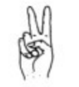

# 5. MediaPipe Human-robot Interaction

## 5.1 MediaPipe Introduction

### 5.1.1 MediaPipe Description

MediaPipe is an open-source framework of multi-media machine learning models. Cross-platform MediaPipe can run on mobile devices, workspace and servers, as well as support mobile GPU acceleration. It is also compatible with TensorFlow and TF Lite Inference Engine, and all kinds of TensorFlow and TF Lite models can be applied on it. Besides, MediaPipe supports GPU acceleration of mobile and embedded platform.


### 5.1.2 MediaPipe Pros and Cons

* **MediaPipe Pros**

(1) MediaPipe supports various platforms and languages, including iOS, Android, C++, Python, JAVAScript, Coral, etc.

(2) Swift running. Models can run in real-time.

(3) Models and codes are with high reuse rate.

* **MediaPipe Cons**

(1) For mobile devices, MediaPipe will occupy 10M or above.

(2) As it greatly depends on Tensorflow, you need to alter large amount of codes if you want to change it to other machine learning frameworks, which is not friendly to machine learning developer.

(3) It adopts static image which can improve efficiency, but make it difficult to find out the errors.

### 5.1.3 How to use MediaPipe

The figure below shows how to use MediaPipe. The solid line represents the part to be coded, and the dotted line indicates the part not to be coded. MediaPipe can offer the result and the function realization framework quickly.


* **Dependency**

MediaPipe utilizes OpenCV to process video, and uses [FFMPEG](https://www.ffmpeg.org/) to process audio data. Furthermore, it incorporates other essential dependencies, including OpenGL/Metal, Tensorflow, and Eigen.

For seamless usage of MediaPipe, we suggest gaining a basic understanding of OpenCV. To delve into OpenCV, you can find detailed information in OpenCV Computer Vision Lesson.

* **MediaPipe Solutions**

Solutions is based on the open-source pre-constructed sample of TensorFlow or TFLite. MediaPipe Solutions is built upon a framework, which provides 16 Solutions, including face detection, Face Mesh, iris, hand, posture, human body and so on.

### 5.1.4 MediaPipe Learning Resources

MediaPipe website：<https://developers.google.com/mediapipe>

MediaPipe Wiki：<http://i.bnu.edu.cn/wiki/index.php?title=Mediapipe>

MediaPipe github：<https://github.com/google/mediapipe>

Dlib website: <http://dlib.net/>

dlib github: <https://github.com/davisking/dlib>

## 5.2 Image Background Segmentation

###  5.2.1 Brief Overview of Operation

In this lesson, MediaPipe's Selfie Segmentation model is used to segment trained models from the background and then apply a virtual background, such as face and hand.

First, the MediaPipe selfie segmentation model is imported, and real-time video is obtained by subscribing to the camera topic.

Next, the image is processed and the segmentation mask is drawn onto the background image. Bilateral filtering is used to improve the segmentation around the edges.

Finally, the background is replaced with a virtual one.

###  5.2.2 Enabling and Disabling the Feature

:::{Note}

 When entering commands, be sure to use correct case and spacing. You can use the Tab key to auto-complete keywords.

:::

(1) Power on the device and connect via VNC remote desktop tool.


(2) Click the terminal icon  in the upper-left corner of the system desktop to open a command-line window.


(3) Enter the following command and press Enter to navigate to the directory where the feature's program is stored:

```
cd /home/ubuntu/ros2_ws/src/example/example
```

(4) Entering the following command and press Enter to start the feature.

```
python3 self_segmentation.py
```

###  5.2.3 Project Outcome

After the feature is started, the screen will show a completely gray virtual background. Once a person enters the frame, the person will be segmented from the background.

###  5.2.4 Program Brief Analysis

The source code for this program is located at:[/home/ubuntu/ros2_ws/src/example/example/self_segmentation.py](../_static/source_code/example.zip)

* **Basic Configuration**

(1) Building the Selfie Segmentation Model

Import the selfie segmentation model from the MediaPipe toolkit.

{lineno-start=48}

```
        with self.mp_selfie_segmentation.SelfieSegmentation(model_selection=1) as selfie_segmentation:
```

The first parameter model_selection specifies the model to be used. MediaPipe offers two models, the general model and the landscape model. Both models are based on MobileNetV3, modified for improved efficiency. The general model operates on a 256x256x3 (HWC) tensor and outputs a 256x256x1 tensor representing the segmentation mask.

The landscape model is similar to the general model but operates on a 144x256x3 (HWC) tensor. It has fewer FLOPs (floating-point operations), making it faster than the general model. Note: Before feeding the input image into the ML model, MediaPipe Selfie Segmentation automatically resizes the input to the required tensor dimensions.

* **Segmentation and Background Replacement**

(1) Drawing the Segmentation Mask

Based on the previously built selfie segmentation model, draw the segmentation map separating the person from the background in the image.

{lineno-start=61}

```
                results = selfie_segmentation.process(image)
```

(2) Edge Filtering

To improve segmentation around the edges, apply bilateral filtering to results.segmentation_mask.

{lineno-start=67}

```
                condition = np.stack((results.segmentation_mask,) * 3, axis=-1) > 0.1
```

The smaller the final threshold value of the function `np.stack((results.segmentation_mask,) * 3, axis=-1) > 0.1`, the more edge area is included.

(3) Background Replacement

Remove the background from the segmentation map and replace it with a virtual background.

{lineno-start=75}

```
                if bg_image is None:
                    bg_image = np.zeros(image.shape, dtype=np.uint8)
                    bg_image[:] = self.BG_COLOR
                
               
                output_image = np.where(condition, image, bg_image)
```

Use np.zeros(image.shape, dtype=np.uint8) to remove the background, and replace it with BG_COLOR, which can be a solid RGB color or an image. If using color, the color's RGB value should be input. If using an image, make sure it matches the camera's resolution.

{lineno-start=27}

```
        self.BG_COLOR = (192, 192, 192)  # gray
```

(4) Displaying the Output

Use `imshow()` function from cv2 library to display the camera feed in a designated window.

{lineno-start=80}

```
                cv2.imshow('MediaPipe Selfie Segmentation', result_image)
```

The first argument MediaPipe Selfie Segmentation is the window title, and the second argument result_image is the image to be displayed.

## 5.3 Gesture Recognition

###  5.3.1 Brief Overview of Operation

This lesson enables gesture-based control of the robot using a camera to recognize hand gestures.

The gesture recognition feature consists of two main components: gesture detection and action execution.

The system uses a MediaPipe-based model and color space conversion to locate and interpret the user's hand gestures.

MediaPipe is an open-source framework designed for building multimedia machine learning pipelines. It supports cross-platform deployment on mobile devices, desktops, and servers, and can leverage mobile GPU acceleration. MediaPipe is compatible with inference engines such as TensorFlow and TensorFlow Lite, allowing seamless integration with models from both platforms. Additionally, it offers GPU acceleration on mobile and embedded platforms.

Once a gesture is detected, corresponding servo commands are issued to control the robot car. For instance, when the gesture "**1**" is recognized, the robot moves forward.

For a complete list of gesture-action mappings, refer to the section 3. Project Outcome of this document.

###  5.3.2 Enabling and Disabling the Feature

:::{Note}

When entering commands, be sure to use correct case and spacing. You can use the Tab key to auto-complete keywords.

:::

(1) Power on the device and connect via VNC remote desktop tool.


(2) Click the terminal icon  in the upper-left corner of the system desktop to open a command-line window.


(3) Enter the following command and press Enter to navigate to the directory where the feature's program is stored:

```
cd /home/ubuntu/ros2_ws/src/example/example
```

(4) Enter the following command and press Enter.

```
python3 gesture_control_node.py
```

(5) Open a new terminal window and enter the following command to launch the feature.

```
ros2 service call /gesture_game_control/enter std_srvs/srv/Trigger {}
```

(6) In the same terminal, enable the gesture control feature by entering the following command.

```
ros2 service call /gesture_control_enable std_srvs/srv/SetBool "{data: true}"
```

(7) Open another terminal and launch the visualization interface. Select **"/image_gesture_recognition"**.

```
rqt
```


(8) To stop the feature, go back to the terminal from step 5 and enter the following command.

```
ros2 service call /gesture_control_enable std_srvs/srv/SetBool "{data: false}"
```

(9) Finally, press **Ctrl + C** in both the terminal windows from steps 4 and 7 to stop the running programs. If the program does not close immediately, press the keys again.

###  5.3.3 Project Outcome

:::{Note}

All actions are performed from the perspective of the TurboPi.

:::

Once activated, the robot will respond to different hand gestures as follows:

| Gesture     |                                                              | Action                                    |
| :---------- | :----------------------------------------------------------- | :---------------------------------------- |
| Gesture "1" |  | Move Forward                              |
| Gesture "2" |  | Move Backward                             |
| Gesture "3" |  | Strafe right                              |
| Gesture "4" |  | Strafe left                               |
| Gesture "5" |  | Rotate clockwise in place (1 turn)        |
| Gesture "6" |  | Rotate counterclockwise in place (1 turn) |

###  5.3.4 Program Brief Analysis

The source code for this demo is located at [/home/ubuntu/ros2_ws/src/example/example/gesture_control_node.py](../_static/source_code/example.zip)

* **Import the Necessary Libraries**

(1) In Python, libraries are imported using the import statement. In this program, libraries such as cv2 for image processing, numpy for numerical computation, and rclpy for the ROS 2 framework are included to support image operations, mathematical calculations, and robot control.

{lineno-start=1}

```
#!/usr/bin/env python3
import rclpy
from rclpy.node import Node
from sensor_msgs.msg import Image
from geometry_msgs.msg import Twist
from cv_bridge import CvBridge
import cv2
import time
import math
import numpy as np
import mediapipe as mp
from std_srvs.srv import SetBool, Trigger
from interfaces.srv import SetPoint, SetFloat64

from ros_robot_controller_msgs.msg import SetPWMServoState, PWMServoState
```

(2) Other commonly used libraries include those for OpenCV, time management, mathematics, threading, and inverse kinematics. To call a function from a library, use the format of library_name.function_name(parameter1, parameter2, …)

{lineno-start=}

```
time.sleep(0.01)
```

For example, calling time.sleep() uses the sleep function from the time library, which creates a delay.

Python also includes built-in libraries such as time, cv2, and math, which can be imported and used directly. Additionally, custom libraries can be created and used. For instance, the previously mentioned "**Heart**" file is a user-defined module for reading data.

* **Aliasing Function Libraries**

Some library names may be long or hard to remember. To simplify function calls, aliases are often used. For example:

```
from app.common import Heart
```

```
Heart(self, self.get_name() + '/heartbeat', 5, lambda _: self.exit_srv_callback(request=Trigger.Request(), response=Trigger.Response()))
```

After aliasing, functions from the Heart module can be called in a format of Heart.function_name(parameter1, parameter2), which makes the code more convenient and easier to read.

* **Main Function Analysis**

In Python, the main function of a program is defined as `__name__ == '__main__:'`. The program begins by calling the init() function to perform initialization. In this case, initialization includes resetting the camera to its starting position and reading the color threshold configuration file. Other typical initialization tasks may involve setting up ports, peripherals, and timers.

{lineno-start=276}

```
	def main(args=None):
    rclpy.init(args=args)
    node = GestureControlNode()
    rclpy.spin(node)
    node.destroy_node()
    rclpy.shutdown()

if __name__ == '__main__':
    main()
```

(1) When an image is received, the image_callback() function is triggered for image processing.

{lineno-start=196}

```
	    def image_callback(self, msg):
        """
        Image callback function (图像回调函数)
        1. Convert ROS image message to OpenCV format (1. 将ROS图像消息转换为OpenCV格式)
        2. If gesture recognition is enabled, process image with Mediapipe to get gesture result (2. 如果手势识别启动，则调用 Mediapipe 处理图像，获取手势结果)
           and when results are collected sufficiently, start a separate thread to execute robot control (avoid blocking image processing) (并将结果收集达到一定数量后，开启单独线程执行机器人控制命令（避免阻塞图像处理）)
        3. If in game mode, publish the processed image regardless of whether gesture recognition is running (3. 如果处于游戏模式，则无论是否进行识别，都发布处理后的图像)
        """
        # Convert ROS image message to OpenCV image (将 ROS 图像消息转换为 OpenCV 图像)
        img = self.bridge.imgmsg_to_cv2(msg, "bgr8")
        img_h, img_w = img.shape[:2]
        imgRGB = cv2.cvtColor(img, cv2.COLOR_BGR2RGB)

        # If gesture recognition is active, process image to get gesture result (如果启动了手势识别，则处理图像获得手势结果)
        if self.gesture_control_enabled:
            results = self.hands.process(imgRGB)
```

The `imgmsg_to_cv2()` function converts a ROS image message (msg) into a BGR format image compatible with OpenCV, stored in the variable img.

Within the `image_callback()` function, the image is processed.

{lineno-start=196}

```
	    def image_callback(self, msg):
        """
        Image callback function (图像回调函数)
        1. Convert ROS image message to OpenCV format (1. 将ROS图像消息转换为OpenCV格式)
        2. If gesture recognition is enabled, process image with Mediapipe to get gesture result (2. 如果手势识别启动，则调用 Mediapipe 处理图像，获取手势结果)
           and when results are collected sufficiently, start a separate thread to execute robot control (avoid blocking image processing) (并将结果收集达到一定数量后，开启单独线程执行机器人控制命令（避免阻塞图像处理）)
        3. If in game mode, publish the processed image regardless of whether gesture recognition is running (3. 如果处于游戏模式，则无论是否进行识别，都发布处理后的图像)
        """
        # Convert ROS image message to OpenCV image (将 ROS 图像消息转换为 OpenCV 图像)
        img = self.bridge.imgmsg_to_cv2(msg, "bgr8")
        img_h, img_w = img.shape[:2]
        imgRGB = cv2.cvtColor(img, cv2.COLOR_BGR2RGB)

        # If gesture recognition is active, process image to get gesture result (如果启动了手势识别，则处理图像获得手势结果)
        if self.gesture_control_enabled:
            results = self.hands.process(imgRGB)
            if results.multi_hand_landmarks:
                for hand_landmarks in results.multi_hand_landmarks:
                    # Draw hand skeleton (绘制手部骨架)
                    self.mp_drawing.draw_landmarks(img, hand_landmarks, self.mp_hands.HAND_CONNECTIONS)
                    # Convert normalized coordinates to image coordinates (将归一化坐标转换为图像坐标)
                    hand_local = [(landmark.x * img_w, landmark.y * img_h) for landmark in hand_landmarks.landmark]
                    # Only collect recognition results when no control command is currently executing (只有当没有正在执行控制命令时才收集识别结果)
                    if hand_local and not self.results_lock:
                        angle_list = self.hand_angle(hand_local)
                        gesture_results = self.gesture(angle_list)
                        # Display recognized gesture ID on image (在图像上显示识别结果编号)
                        cv2.putText(img, str(gesture_results), (20, 50), 
                                    cv2.FONT_HERSHEY_SIMPLEX, 2, (255, 100, 0), 3)
                        if gesture_results:
                            self.results_list.append(gesture_results)
                            # After collecting 5 results, compute the average as the final result and call the control function (收集到5个结果后计算平均值作为最终识别结果，并调用控制函数)
                            if len(self.results_list) >= 5:
                                self.gesture_num = int(np.mean(np.array(self.results_list)))
                                self.results_lock = True
                                self.results_list = []
                                # Execute control command in a separate thread to avoid blocking the image callback (在单独线程中执行控制命令，避免阻塞图像回调)
                                threading.Thread(target=self.control_robot, daemon=True).start()

        # If game mode is active, publish processed image (regardless of whether gesture recognition runs) (如果游戏模式激活，则发布处理后的图像（无论是否进行手势识别）)
        if self.gesture_game_active:
            image_msg = self.bridge.cv2_to_imgmsg(img, encoding="bgr8")
            self.image_gesture_pub.publish(image_msg)
```

(2) One key step is converting the image from BGR to RGB using the color space conversion function cv2.cvtColor().

{lineno-start=207}

```
	        imgRGB = cv2.cvtColor(img, cv2.COLOR_BGR2RGB)
```

The first parameter, img_copy, is the input image.

The second parameter, cv2.COLOR_BGR2RGB, specifies the conversion type, which converts BGR format to RGB format. For converting to LAB color space instead, the function cv2.COLOR_BGR2LAB should be used.

(3) The cv2.putText() function is used to draw text or strings onto an image. The parameters are as follows:

{lineno-start=223}

```
	                        cv2.putText(img, str(gesture_results), (20, 50), 
                                    cv2.FONT_HERSHEY_SIMPLEX, 2, (255, 100, 0), 3)
```

The first parameter, `img`, is the input image.

The second parameter, `str(gesture_results)`, is the text to be displayed.

The third parameter, `(20, 50)`, is the position of the text on the image.

The fourth parameter,` 0`, specifies the font type.

The fifth parameter, `2`, sets the font size.

The sixth parameter, `(255, 100, 0)`, sets the text color.

The seventh parameter, `3`, specifies the thickness of the text.

* **Subthread Analysis**

(1) Gesture Recognition

Gesture recognition is implemented using the MediaPipe framework, which identifies key landmarks of the hand and draws their coordinates. These coordinates are then used to extract relevant information and provide feedback for subsequent actions.

The system first checks whether any hand landmarks are detected. If so, the coordinates of the corresponding key points are calculated.

{lineno-start=213}

```
                for hand_landmarks in results.multi_hand_landmarks:
                    # Draw hand skeleton (绘制手部骨架)
                    self.mp_drawing.draw_landmarks(img, hand_landmarks, self.mp_hands.HAND_CONNECTIONS)
                    # Convert normalized coordinates to image coordinates (将归一化坐标转换为图像坐标)
                    hand_local = [(landmark.x * img_w, landmark.y * img_h) for landmark in hand_landmarks.landmark]
```

(2) Using these coordinates, the angles between vectors formed by specific key points are computed.

The main calculations are performed using two functions: vector_2d_angle() and hand_angle(). These functions are built into the MediaPipe framework.

{lineno-start=2199}

```
	                    if hand_local and not self.results_lock:
                        angle_list = self.hand_angle(hand_local)
                        gesture_results = self.gesture(angle_list)
```

{lineno-start=114}

```
	    def vector_2d_angle(self, v1, v2):
        """
        Calculate the angle (in degrees) between 2D vectors v1 and v2 (计算二维向量 v1 与 v2 的夹角（单位：度）)
        """
        v1_x, v1_y = v1
        v2_x, v2_y = v2
        try:
            angle_ = math.degrees(math.acos(
                (v1_x * v2_x + v1_y * v2_y) / (((v1_x ** 2 + v1_y ** 2) ** 0.5) * ((v2_x ** 2 + v2_y ** 2) ** 0.5))
            ))
        except Exception as e:
            angle_ = 65535.0
        if angle_ > 180.0:
            angle_ = 65535.0
        return angle_
```

{lineno-start=130}

```
	    def hand_angle(self, hand_):
        """
        Calculate finger angles based on hand keypoint coordinates (根据手部关键点坐标计算各手指的角度列表)
        """
        angle_list = []
        # Thumb (拇指)
        angle_ = self.vector_2d_angle(
            (int(hand_[0][0]) - int(hand_[2][0]), int(hand_[0][1]) - int(hand_[2][1])),
            (int(hand_[3][0]) - int(hand_[4][0]), int(hand_[3][1]) - int(hand_[4][1]))
        )
        angle_list.append(angle_)
        # Index finger (食指)
        angle_ = self.vector_2d_angle(
            (int(hand_[0][0]) - int(hand_[6][0]), int(hand_[0][1]) - int(hand_[6][1])),
            (int(hand_[7][0]) - int(hand_[8][0]), int(hand_[7][1]) - int(hand_[8][1]))
        )
        angle_list.append(angle_)
        # Middle finger (中指)
        angle_ = self.vector_2d_angle(
            (int(hand_[0][0]) - int(hand_[10][0]), int(hand_[0][1]) - int(hand_[10][1])),
            (int(hand_[11][0]) - int(hand_[12][0]), int(hand_[11][1]) - int(hand_[12][1]))
        )
        angle_list.append(angle_)
        # Ring finger (无名指)
        angle_ = self.vector_2d_angle(
            (int(hand_[0][0]) - int(hand_[14][0]), int(hand_[0][1]) - int(hand_[14][1])),
            (int(hand_[15][0]) - int(hand_[16][0]), int(hand_[15][1]) - int(hand_[16][1]))
        )
        angle_list.append(angle_)
        # Pinky finger (小指)
        angle_ = self.vector_2d_angle(
            (int(hand_[0][0]) - int(hand_[18][0]), int(hand_[0][1]) - int(hand_[18][1])),
            (int(hand_[19][0]) - int(hand_[20][0]), int(hand_[19][1]) - int(hand_[20][1]))
        )
        angle_list.append(angle_)
        return angle_list
```

(3) Based on the calculated vector angles, specific gestures are defined.

{lineno-start=167}

```
	    def gesture(self, angle_list):
        """
	        Determine gesture type based on finger angles, return gesture ID (1–6), or 0 if unrecognized (根据手指角度判断手势类型，返回一个手势编号（1～6），若无法识别返回0)
        """
        gesture_num = 0
        thr_angle = 65.0      # Finger straight angle threshold (手指伸直角度阈值)
        thr_angle_s = 49.0    # Finger bent angle threshold (手指弯曲角度阈值)
        thr_angle_thumb = 53.0  # Special threshold for thumb (拇指特殊阈值)
        if 65535.0 not in angle_list:
            if (angle_list[0] > 5) and (angle_list[1] < thr_angle_s) and (angle_list[2] > thr_angle) and \
               (angle_list[3] > thr_angle) and (angle_list[4] > thr_angle):
                gesture_num = 1
            elif (angle_list[0] > thr_angle_thumb) and (angle_list[1] < thr_angle_s) and (angle_list[2] < thr_angle_s) and \
                 (angle_list[3] > thr_angle) and (angle_list[4] > thr_angle):
                gesture_num = 2
            elif (angle_list[0] > thr_angle_thumb) and (angle_list[1] < thr_angle_s) and (angle_list[2] < thr_angle_s) and \
                 (angle_list[3] < thr_angle_s) and (angle_list[4] > thr_angle):
                gesture_num = 3
            elif (angle_list[0] > thr_angle_thumb) and (angle_list[1] < thr_angle_s) and (angle_list[2] < thr_angle_s) and \
                 (angle_list[3] < thr_angle_s) and (angle_list[4] < thr_angle_s):
                gesture_num = 4
            elif (angle_list[0] < thr_angle_s) and (angle_list[1] < thr_angle_s) and (angle_list[2] < thr_angle_s) and \
                 (angle_list[3] < thr_angle_s) and (angle_list[4] < thr_angle_s):
                gesture_num = 5
            elif (angle_list[0] < thr_angle_s) and (angle_list[1] > thr_angle) and (angle_list[2] > thr_angle) and \
                 (angle_list[3] > thr_angle) and (angle_list[4] < thr_angle_s):
                gesture_num = 6
        return gesture_num
```

(4) And then displayed on the return image.

{lineno-start=223}

```
	                        cv2.putText(img, str(gesture_results), (20, 50), 
                                    cv2.FONT_HERSHEY_SIMPLEX, 2, (255, 100, 0), 3)
```

(5) Each detected gesture is verified multiple times. Once the number of consistent detections exceeds a predefined threshold, a response is triggered.

{lineno-start=225}

```
	                        if gesture_results:
                            self.results_list.append(gesture_results)
                            # After collecting 5 results, compute the average as the final result and call the control function (收集到5个结果后计算平均值作为最终识别结果，并调用控制函数)
                            if len(self.results_list) >= 5:
                                self.gesture_num = int(np.mean(np.array(self.results_list)))
                                self.results_lock = True
                                self.results_list = []
                                # Execute control command in a separate thread to avoid blocking the image callback (在单独线程中执行控制命令，避免阻塞图像回调)
                                threading.Thread(target=self.control_robot, daemon=True).start()
```

(6) Robot Movement Execution

The function `control_robot()` is run as a subthread. Once a gesture is successfully recognized, this function is triggered to execute the corresponding robot movement.

It evaluates the image processing results and provides appropriate feedback, including control of single or multiple servos.

{lineno-start=240}

```
	    def control_robot(self):
        """
        Control robot movement based on recognized gesture ID (根据识别到的手势编号控制机器人运动)
        Note: this function runs in a separate thread and does not block the image callback (注意：此函数在单独线程中运行，不会阻塞图像处理回调)
        """
        twist = Twist()
        if self.gesture_num == 1:
            twist.linear.x = 0.5
            self.cmd_vel_pub.publish(twist)
            time.sleep(0.5)
        elif self.gesture_num == 2:
            twist.linear.x = -0.5
            self.cmd_vel_pub.publish(twist)
            time.sleep(0.5)
        elif self.gesture_num == 3:
            twist.linear.y = 0.5
            self.cmd_vel_pub.publish(twist)
            time.sleep(0.5)
        elif self.gesture_num == 4:
            twist.linear.y = -0.5
            self.cmd_vel_pub.publish(twist)
            time.sleep(0.5)
        elif self.gesture_num == 5:
            twist.angular.z = 10.0
            self.cmd_vel_pub.publish(twist)
        elif self.gesture_num == 6:
            twist.angular.z = -10.0
            self.cmd_vel_pub.publish(twist)
            time.sleep(3.0)

        # Send stop command (发送停止命令)
        self.cmd_vel_pub.publish(Twist())
        time.sleep(1)
        # Reset lock to allow next gesture control (重置锁，允许下一次手势识别控制)
        self.results_lock = False
```

(7) The recognized gesture is compared with the predefined gesture. If they match, a specific action is executed.

{lineno-start=246}

```
	        if self.gesture_num == 1:
            twist.linear.x = 0.5
            self.cmd_vel_pub.publish(twist)
            time.sleep(0.5)
        elif self.gesture_num == 2:
            twist.linear.x = -0.5
            self.cmd_vel_pub.publish(twist)
            time.sleep(0.5)
        elif self.gesture_num == 3:
            twist.linear.y = 0.5
            self.cmd_vel_pub.publish(twist)
            time.sleep(0.5)
        elif self.gesture_num == 4:
            twist.linear.y = -0.5
            self.cmd_vel_pub.publish(twist)
            time.sleep(0.5)
        elif self.gesture_num == 5:
            twist.angular.z = 10.0
            self.cmd_vel_pub.publish(twist)
        elif self.gesture_num == 6:
            twist.angular.z = -10.0
            self.cmd_vel_pub.publish(twist)
            time.sleep(3.0)
```

`self.gesture_num`: the number corresponding to the recognized gesture.

`twist.linear.x`: a positive value (range: 0–1) moves the robot forward, while a negative value (range: -1–0) moves it backward. The greater the absolute value, the higher the speed.

`twist.linear.y`: a positive value (range: 0–1) moves the robot to the left, while a negative value (range: -1–0) moves it to the right. The greater the absolute value, the higher the speed.

`twist.linear.z`: a positive value (range: 0–1) rotates the robot counterclockwise, while a negative value (range: -1–0) rotates it clockwise. The greater the absolute value, the higher the speed.

`time.sleep()`: defines the duration of the movement. This value must be positive.

###  5.3.5 Feature Extensions

* **Modify Movement Duration**

(1) Enter the following command and press Enter to navigate to the program's source directory.

```
cd /home/ubuntu/ros2_ws/src/example/example
```

(2) Open the program file by entering the command.

```
vim gesture_control_node.py
```

(3) Locate the line in the code as shown below.


(4) Press the i key to enter edit mode.


(5) Change time.sleep(0.5) to time.sleep(4) as shown below.


(6) Press the Esc key, then type the following command to save and exit:

```
:wq
```


(7) Finally, restart the gesture recognition program by entering the appropriate command and pressing Enter.

```
python3 gesture_control_node.py
```

## 5.4 Face Tracking

###  5.4.1 Brief Overview of Operation

In this session, the robot uses a camera to perform face detection, enabling both the car and the pan-tilt servos to follow the movement of a human face. Before getting started, make sure the camera alignment has been calibrated to minimize offset.

Among various applications of artificial intelligence, image recognition is one of the most widespread, with face recognition being one of the most prominent examples. It is commonly used in scenarios such as smart door locks and smartphone facial unlocking.

This face tracking feature consists of two main parts: face detection and tracking. The system first adjusts the pan-tilt to look upward to capture a face. A pre-trained face detection model is then used to identify faces in the video stream by scaling the image. Once a face is detected, its coordinates are converted back to match the original image dimensions. The system then identifies the largest detected face and outlines it with a bounding box.

Finally, based on the PID algorithm, the system compares the center of the image with the position of the detected face. It then adjusts the motors and servos accordingly to follow the face in real time.

The PID (Proportional–Integral–Derivative) algorithm is one of the most widely used automatic control methods. It operates by adjusting control inputs based on the proportional, integral, and derivative of the error. The PID controller is popular due to its simplicity, ease of implementation, broad applicability, and independently adjustable parameters.

###  5.4.2 Enabling and Disabling the Feature

:::{Note}

When entering commands, be sure to use correct case and spacing. You can use the Tab key to auto-complete keywords.

:::

(1) Power on the device and connect via VNC remote desktop tool.


(2) Click the terminal icon  in the upper-left corner of the system desktop to open a command-line window.


(3) Enter the following command and press Enter to navigate to the directory where the feature's program is stored:

```
cd /home/ubuntu/ros2_ws/src/example/example
```

(4) Enter the following command to start the program and open the camera feed.

```
python3 face_tracking.py
```

(5) Open a new terminal window and enter the following command to launch the feature.

```
ros2 service call /face_landmarker/set_running std_srvs/srv/SetBool data:\ true
```

(6) To stop the feature, enter the following command in step 5's terminal window.

```
ros2 service call /face_landmarker/set_running std_srvs/srv/SetBool data:\ false
```

(7) Finally, return to the terminal window opened in step 4 and press Ctrl+C to terminate the program. If it does not close immediately, press Ctrl+C multiple times.

###  5.4.3 Project Outcome

:::{Note}

For optimal performance, ensure that only one face is visible within the camera's field of view. The presence of multiple faces may affect detection accuracy.

:::

Once the face tracking mode is activated, the pan-tilt servo will first tilt upward to locate a face. When a face is successfully detected, a bounding box will appear around it. The robot and pan-tilt servos will then move in response to the face's position, effectively tracking its movement in real time.

###  5.4.4 Program Brief Analysis

The source code for this demo is located at [/home/ubuntu/ros2_ws/src/example/example/face_tracking.py](../_static/source_code/example.zip)

* **Import Libraries**

In Python, libraries are imported using the import statement. In this program, libraries such as cv2 for image processing, numpy for numerical computation, and rclpy for the ROS 2 framework are included to support image operations, mathematical calculations, and robot control.

{lineno-start=1}

```
#!/usr/bin/env python3
# encoding: utf-8
import os
import cv2
import rclpy
import queue
import threading
import numpy as np
import mediapipe as mp
import sdk.pid as pid
import sdk.yaml_handle as yaml_handle
from cv_bridge import CvBridge
from rclpy.node import Node
from sensor_msgs.msg import Image
from geometry_msgs.msg import Twist
from std_srvs.srv import SetBool, Trigger
from ros_robot_controller_msgs.msg import MotorsState, SetPWMServoState, PWMServoState
```

* **Main Function Analysis**

Initialization and Instantiation

{lineno-start=222}

```
def main():
    node = FaceMeshNode('face_landmarker')
    try:
        rclpy.spin(node)
    except KeyboardInterrupt:
        node.destroy_node()
        rclpy.shutdown()
        print('shutdown')
    finally:
        print('shutdown finish')

if __name__ == "__main__":
    main()
```

The init() function is called to initialize the TurboPi system.

{lineno-start=20}

```
    def __init__(self, name):
        rclpy.init()
        super().__init__(name)
        self.running = True
        self.bridge = CvBridge()
```

Within `init()` function, the `load_config()` function initializes the pan-tilt servos.

{lineno-start=39}

```
        self.servo_data = yaml_handle.get_yaml_data(yaml_handle.servo_file_path)
```

And the `reset_value()` function resets the servo and motor-related parameters.

{lineno-start=65}

```
    def reset_value(self):
        '''
        Reset parameter(重置参数)
        :return:
        '''
        self.center_x, self.center_y, self.area = -1, -1, 0
        self.__isRunning = False
        
        self.car_x_pid.clear()
        self.car_y_pid.clear()
        self.servo_x_pid.clear()
        self.servo_y_pid.clear()
```

* **Image Processing**

Captured images are stored in the variable img. If the image is valid (not empty), the `image_callback()` function is invoked for further processing.

{lineno-start=92}

```
    def image_callback(self, ros_image):
    
        cv_image = self.bridge.imgmsg_to_cv2(ros_image, "rgb8")
        rgb_image = np.array(cv_image, dtype=np.uint8)
        
        img_copy = rgb_image.copy()
        
        self.img_h, self.img_w = rgb_image.shape[:2]
```

(1) Inside the `run()` function, the `cv2.cvtColor()` function from the cv2 library is used to convert the image from BGR format to RGB format.

{lineno-start=101}

```
        imgRGB = cv2.cvtColor(img_copy, cv2.COLOR_BGR2RGB) # Convert the BGR image to RGB image(将BGR图像转为RGB图像)
```

The first parameter, `img_copy`, is the input image. The second parameter, `cv2.COLOR_BGR2RGB`, converts the BGR format to RGB format.

Next, the `process()` function from the faceDetection library is called to pass each frame to the face detection module.

{lineno-start=102}

```
        results = self.faceDetection.process(imgRGB) # Pass each frame image to the face recognition module(将每一帧图像传给人脸识别模块)
```

(2) The facial coordinate data obtained is then converted.

Since the image undergoes scaling during preprocessing, the coordinates of the detected faces do not match the original image size. Therefore, a coordinate conversion step is required after preprocessing.

{lineno-start=103}

```
        if results.detections:   # 如果检测不到人脸那就返回None(return None if face is not detected)
            for index, detection in enumerate(results.detections): # Return face index (which face) and coordinates of key points(返回人脸索引index(第几张脸)，和关键点的坐标信息)
                bboxC = detection.location_data.relative_bounding_box # Set up a bounding box to receive xywh (X-axis, Y-axis, width, height) and key information for all boxes(设置一个边界框，接收所有的框的xywh及关键点信息)
                
                # Convert the coordinates, width, and height of the bounding box from relative coordinates to pixel coordinates(将边界框的坐标点,宽,高从比例坐标转换成像素坐标)
                bbox = (int(bboxC.xmin * self.img_w), int(bboxC.ymin * self.img_h),  
                       int(bboxC.width * self.img_w), int(bboxC.height * self.img_h))
```

(3) The `cv2.rectangle()` function is used to draw bounding boxes around detected faces in the image.

{lineno-start=110}

```
                cv2.rectangle(rgb_image, bbox, (0,255,0), 2)  # Draw rectangular boxes on each frame image(在每一帧图像上绘制矩形框)
```

The function parameters are as follows:

Parameter 1: `img` — the input image

Parameter 2: `bbox` — the pixel coordinates of the bounding box

Parameter 3: `(0, 255, 0)` — the color of the rectangle's border, in BGR format, green in this case

Parameter 4: `2` — the thickness of the rectangle's border

A value of -1 for thickness would fill the rectangle with the specified color.

The X and Y coordinates of the bounding box are extracted for further use.

{lineno-start=111}

```
                x, y, w, h = bbox  # Get information of the recognition box, where xy represents the coordinates of the upper-left corner(获取识别框的信息,xy为左上角坐标点)
                self.center_x =  int(x + (w/2))
                self.center_y =  int(y + (h/2))
                self.area = int(w * h)
```

* **Displaying the Output**

The processed image is displayed in real time using the cv2.imshow() function, showing the result in a feedback window.

{lineno-start=153}

```
            cv2.imshow('face_landmarker', image)
            key = cv2.waitKey(1)
            if key == ord('q') or key == 27:  # Press q or esc to exit(按q或者esc退出)
                break
```

* **Subthread Analysis**

A sub-thread runs the  `main()` function, which controls both the pan-tilt servos and the mecanum-wheeled robot.

{lineno-start=158}

```
            if self.is_running:                
                if self.center_x != -1 and self.center_y != -1:  
                                  
                    # Camera pan-tilt tracking(摄像头云台追踪)
                    # Track based on the camera X-axis coordinates(根据摄像头X轴坐标追踪)
                    if abs(self.center_x - self.img_w/2.0) < 15: # If the movement amplitude is small, no action is required(移动幅度比较小，则不需要动)
                        self.center_x = self.img_w/2.0
                    self.servo_x_pid.SetPoint = self.img_w/2.0 # Set(设定)
                    self.servo_x_pid.update(self.center_x)     # Current(当前)
                    self.servo_x += int(self.servo_x_pid.output)  # Get PID output value(获取PID输出值)
                    
                    self.servo_x = 800 if self.servo_x < 800 else self.servo_x # Set servo range(设置舵机范围)
                    self.servo_x = 2200 if self.servo_x > 2200 else self.servo_x
```

{lineno-start=184}

```
                    # Vehicle following tracking(车身跟随追踪)
                    # Distance tracking based on the target size(根据目标大小进行远近追踪)
                    if abs(self.area - 30000) < 2000 or self.servo_y < 1100:
                        self.car_y_pid.SetPoint = self.area
                    else:
                        self.car_y_pid.SetPoint = 30000
                    self.car_y_pid.update(self.area)
                    dy = self.car_y_pid.output   # Get PID output value(获取PID输出值)
                    dy = 0 if abs(dy) < 20 else dy # Set velocity range(设置速度范围)
```

(1) Within main(), the PID algorithm is applied to control the rotation of the pan-tilt servos.

{lineno-start=159}

```
                if self.center_x != -1 and self.center_y != -1:  
                                  
                    # Camera pan-tilt tracking(摄像头云台追踪)
                    # Track based on the camera X-axis coordinates(根据摄像头X轴坐标追踪)
                    if abs(self.center_x - self.img_w/2.0) < 15: # If the movement amplitude is small, no action is required(移动幅度比较小，则不需要动)
                        self.center_x = self.img_w/2.0
                    self.servo_x_pid.SetPoint = self.img_w/2.0 # Set(设定)
                    self.servo_x_pid.update(self.center_x)     # Current(当前)
                    self.servo_x += int(self.servo_x_pid.output)  # Get PID output value(获取PID输出值)
                    
                    self.servo_x = 800 if self.servo_x < 800 else self.servo_x # Set servo range(设置舵机范围)
                    self.servo_x = 2200 if self.servo_x > 2200 else self.servo_x
                    
                    # Track based on the camera Y-axis coordinates(根据摄像头Y轴坐标追踪)
                    if abs(self.center_y - self.img_h/2.0) < 10: # If the movement amplitude is small, no action is required(移动幅度比较小，则不需要动)
                        self.center_y = self.img_h/2.0
                    self.servo_y_pid.SetPoint = self.img_h/2.0  
                    self.servo_y_pid.update(self.center_y)
                    self.servo_y -= int(self.servo_y_pid.output) # Gei PID output value(获取PID输出值)
                    
                    self.servo_y = 1000 if self.servo_y < 1000 else self.servo_y # Set servo range(设置舵机范围)
                    self.servo_y = 1900 if self.servo_y > 1900 else self.servo_y
                    self.pwm_controller([1, self.servo_y], [2, self.servo_x]) # Set servo movement(设置舵机移动)
```

The function `self.pwm_controller()` is responsible for controlling the PWM servos. For example, in `self.pwm_controller([1, self.servo_y], [2, self.servo_x])`.

The first parameter `[[1, servo_y], [2, servo_x]]` specifies the target positions of the servos. It is a list in which each element is a tuple consisting of a servo ID and its corresponding position value.

(2) Similarly, the movement of the mecanum-wheeled chassis is adjusted using the PID algorithm to control motor rotation.

{lineno-start=184}

```
                    # Vehicle following tracking(车身跟随追踪)
                    # Distance tracking based on the target size(根据目标大小进行远近追踪)
                    if abs(self.area - 30000) < 2000 or self.servo_y < 1100:
                        self.car_y_pid.SetPoint = self.area
                    else:
                        self.car_y_pid.SetPoint = 30000
                    self.car_y_pid.update(self.area)
                    dy = self.car_y_pid.output   # Get PID output value(获取PID输出值)
                    dy = 0 if abs(dy) < 20 else dy # Set velocity range(设置速度范围)
                    
                    # Track based on X-axis servo value(根据X轴舵机值进行追踪)
                    if abs(self.servo_x - self.servo2) < 15:
                        self.car_x_pid.SetPoint = self.servo_x
                    else:
                        self.car_x_pid.SetPoint = self.servo2
                    self.car_x_pid.update(self.servo_x)
                    dx = self.car_x_pid.output   # Get PID output value(获取PID输出值)
                    dx = 0 if abs(dx) < 20 else dx # Set velocity range(设置速度范围)
                   
                    twist.linear.x = dx / 100
                    twist.linear.y = dy / 100
                    
                    self.mecanum_pub.publish(twist)
                    
                    self.car_en = True
```

For example, in the code twist.linear.x = dx / 100 and twist.linear.y = dy / 100, 

the first parameter, `twist.linear.x`, defines the motor speed along the X-axis, 

and the second parameter, `twist.linear.y, defines the motor speed along the Y-axis.