# 6. Machine Learning

## 6.1 Introduction to Machine Learning

### 6.1.1 Overview

Artificial Intelligence (AI) is a new technological science focused on the theories, methods, technologies, and applications used to simulate, extend, and augment human intelligence.

AI encompasses various fields such as machine learning, computer vision, natural language processing, and deep learning. Among them, machine learning is a subfield of AI, and deep learning is a specific type of machine learning.

Since its inception, AI has seen rapid development in both theory and technology, with expanding application areas, gradually evolving into an independent discipline.

### 6.1.2 What Is Machine Learning

Machine Learning is the core of AI and the fundamental approach to enabling machine intelligence. It is an interdisciplinary field involving probability theory, statistics, approximation theory, convex analysis, algorithmic complexity, and more.


The essence of machine learning lies in enabling computers to simulate or implement human learning behaviors in order to acquire new knowledge or skills, and reorganize existing knowledge structures to continuously improve performance. From a practical perspective, machine learning involves training models using data and making predictions with those models.

Take AlphaGo as an example—it was the first AI program to defeat a professional human Go player and later a world champion. AlphaGo operates based on deep learning, which involves learning the underlying patterns and hierarchical representations from sample data to gain insights.

### 6.1.3 Categories of Machine Learning

Machine learning is generally classified into supervised learning and unsupervised learning, with the key distinction being whether the dataset's categories or patterns are known.

* **Supervised Learning**

Supervised learning provides a dataset along with correct labels or answers. The algorithm learns to map inputs to outputs based on this labeled data. This is the most common type of machine learning.

Labeled Data: Supervised learning uses training data that includes both input features and corresponding labels or outputs. Features describe the attributes of the data, while labels represent the target variable the model is expected to predict or classify. For instance, in image recognition, a large number of images of dogs can be labeled as "dog". The machine learns to recognize dogs in new images through this data.

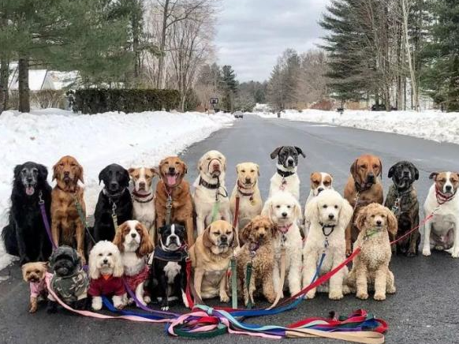

Model Selection: Choosing the appropriate model to represent the relationship in data is crucial. Common models include linear regression, logistic regression, decision trees, support vector machines (SVM), and deep neural networks. The choice depends on the data characteristics and the specific problem.

Feature Engineering: This involves preprocessing and transforming raw data to extract meaningful features. It includes data cleaning, handling missing values, normalization or standardization, feature selection, and feature transformation. Good feature engineering enhances model performance and generalization.

Training and Optimization: Using labeled training data, the model is trained to fit the underlying relationships. This typically involves defining a loss function, selecting an appropriate optimization algorithm, and iteratively adjusting model parameters to minimize the loss. Common optimization methods include gradient descent and stochastic gradient descent.

Model Evaluation: After training, the model is evaluated to assess its performance on new data. Common metrics include accuracy, precision, recall, F1-score, and ROC curves. Evaluating the model ensures it is suitable for real-world applications.

In summary, supervised learning involves using labeled training data to build a model that can classify or predict unseen data. Key steps include model selection, feature engineering, model training and optimization, and performance evaluation. Together, these steps form the foundation of supervised learning.

* **Unsupervised Learning**

Unsupervised learning involves providing the algorithm with data without labels or known answers. All data is treated equally, and the machine is expected to uncover hidden structures or patterns.

For example, in image classification, if you provide a set of images containing cats and dogs without any labels. The algorithm will analyze the data and automatically group the images into two categories—cat images and dog images—based on similarities.

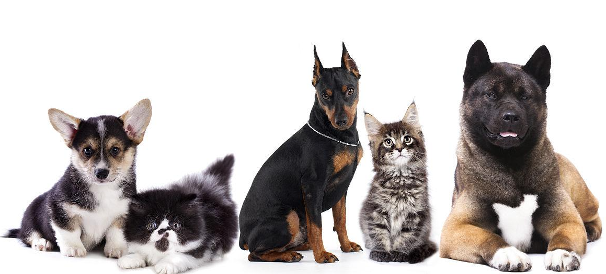

## 6.2 Introduction to Machine Learning Libraries

### 6.2.1 Common Machine Learning Frameworks

There are many machine learning frameworks available. The most commonly used include PyTorch, TensorFlow, PaddlePaddle, and MXNet.

* **PyTorch**

Torch is an open-source machine learning framework under the BSD License, widely used for its powerful multi-dimensional array operations. PyTorch is a machine learning library based on Torch but offers greater flexibility, supports dynamic computation graphs, and provides a Python interface.

Unlike TensorFlow's static computation graphs, PyTorch uses dynamic computation graphs, which can be modified in real-time according to the needs of the computation. PyTorch allows developers to accelerate tensor operations using GPUs, build dynamic graphs, and perform automatic differentiation.


* **Tensorflow**

TensorFlow is an open-source machine learning framework designed to simplify the process of building, training, evaluating, and saving neural networks. It enables the implementation of machine learning and deep learning concepts in the simplest way. With its foundation in computational algebra and optimization techniques,

TensorFlow allows for efficient mathematical computations. It can run on a wide range of hardware—from supercomputers to embedded systems—making it highly versatile. TensorFlow supports CPU, GPU, or both simultaneously. Compared to other frameworks, TensorFlow is best suited for industrial deployment, making it highly appropriate for use in production environments.

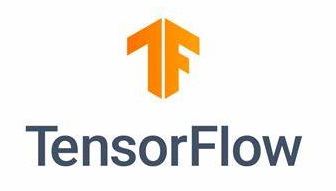

* **PaddlePaddle**

PaddlePaddle, developed by Baidu, is China's first open-source, industrial-grade deep learning platform. It integrates a deep learning training and inference framework, a library of foundational models, end-to-end development tools, and a rich suite of supporting components. Built on years of Baidu's R&D and real-world applications in deep learning, PaddlePaddle is powerful and versatile.

In recent years, deep learning has achieved outstanding performance across many fields such as image recognition, speech recognition, natural language processing, robotics, online advertising, medical diagnostics, and finance.

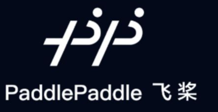

* **MXNet**

MXNet is another high-performance deep learning framework that supports multiple programming languages, including Python, C++, Scala, and R. It offers data flow graphs similar to those in Theano and TensorFlow and supports multi-GPU configuration. It also includes high-level components for model building, comparable to those in Lasagne and Blocks, and can run on nearly any hardware platform—including mobile devices.


MXNet is designed to maximize efficiency and flexibility. As an accelerated library, it provides powerful tools for developers to take full advantage of GPUs and cloud computing. MXNet supports distributed deployment via a parameter server and can scale almost linearly across multiple CPUs and GPUs.

## 6.3 Introduction to YOLOv5, Model Structure, and Execution Process

###  6.3.1 GPU Acceleration

* **Introduction to GPU-Accelerated Computing**

GPU stands for Graphics Processing Unit, which is also known as the display core, visual processor, or display chip. A GPU is a microprocessor designed to perform image rendering and image-related computation tasks on devices such as personal computers, workstations, game consoles, tablets, and smartphones.

GPU-accelerated computing refers to the use of both the GPU and CPU together to speed up the execution of scientific, analytical, engineering, consumer, and enterprise applications. This acceleration capability enables faster performance for applications running on various platforms including cars, smartphones, tablets, drones, and robots.

* **Performance Comparison: GPU vs. CPU**

The CPU is designed for general-purpose computing, which handles multitasking and system-level operations, but has limited computational throughput. In contrast, the GPU is designed for high-volume, repetitive calculations and excels at tasks involving massive parallelism, though it is less suited for complex logical operations.

Architecture Differences The CPU follows a serial architecture with a small number of powerful cores, making it ideal for executing single tasks quickly. The GPU adopts a parallel architecture with a large number of simpler cores, making it highly efficient at executing many tasks simultaneously.

In terms of hardware structure, the CPU is equipped with multiple functional modules, allowing it to handle complex computational environments. In contrast, the GPU has a relatively simpler architecture, with the majority of its transistors dedicated to stream processors and memory controllers.

In a CPU, most transistors are used to build control circuits and cache, with only a small portion allocated to actual computation. This design enhances the CPU's versatility, enabling it to process a wide range of data types and perform complex logical operations, but it also limits its computational performance.

In a GPU, however, most transistors are devoted to specialized circuits and pipelines. This configuration significantly boosts the GPU's processing speed and greatly enhances its floating-point computational power.

* **Advantages of GPU**

GPUs have a large number of cores and are suitable for large-scale parallel data processing, making them particularly advantageous for repetitive tasks in multimedia processing.

Take deep learning as an example—the neural network systems it relies on are designed to analyze massive amounts of data at high speed, and such analysis is exactly what GPUs excel at.

Moreover, the GPU architecture does not include dedicated image processing algorithms; instead, it is optimized based on CPU architecture. Therefore, in addition to image processing, GPUs are also widely used in fields such as scientific computing, cryptographic cracking, numerical analysis, big data processing, and financial analysis, where parallel computing is required.

###  6.3.2 TensorRT Acceleration

* **Introduction to TensorRT**

TensorRT is a high-performance deep learning inference SDK developed by NVIDIA. It includes a deep learning inference optimizer and runtime that enables low-latency and high-throughput deployment of inference applications.

TensorRT now supports deep learning frameworks such as TensorFlow, Caffe, MXNet, and PyTorch. By integrating TensorRT with NVIDIA GPUs, fast and efficient inference deployment can be achieved across most frameworks.

There are many optimization methods for deep learning models, such as weight quantization, weight sparsity, and channel pruning, which are typically performed during the training phase. In contrast, TensorRT optimizes already-trained models by improving the efficiency of the computational graph.

* **Optimization Methods**

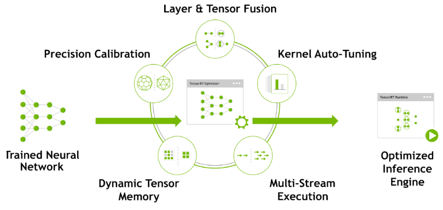

TensorRT employs the following optimization strategies:

① Precision Calibration

② Layer & Tensor Fusion

③ Kernel Auto-Tuning

④ Dynamic Tenser Memory

⑤ Multi-Stream Execution

(1) Precision Calibration for Weights and Activations

Most deep learning frameworks use 32-bit floating-point (FP32) precision for network tensors during training. After training, because inference does not require backpropagation, data precision can be reduced to formats like FP16 or INT8. Lowering data precision reduces memory usage and latency and shrinks the model size.

The following table shows the dynamic ranges for different precisions:

| **Precision** | **Dynamic Range**     |
| :------------ | :-------------------- |
| FP32          | −1.4×1038 ~ +1.4×1038 |
| FP16          | −65504 ~- +65504      |
| INT8          | −128 ~ +127           |

INT8 has only 256 distinct values. Using INT8 to represent FP32 values may result in information loss and degraded performance. However, TensorRT provides a fully automated calibration process to optimally convert FP32 data to INT8 with minimal performance loss.

(2) Layer and Tensor Fusion

Although CUDA cores compute tensors quickly, significant time can still be spent on kernel launches and input/output tensor read-write operations per layer, which wastes GPU resources and creates memory bandwidth bottlenecks.

TensorRT optimizes model structure by horizontally or vertically merging layers to reduce the total number of layers and the CUDA cores they occupy.

Horizontal fusion combines convolution, bias, and activation into a CBR structure, which occupies only one CUDA core. Vertical fusion merges layers with the same structure but different weights into a wider layer, also using only one CUDA core.

Additionally, for multi-branch merges, TensorRT can direct outputs to the correct memory address without copying, eliminating the concat layer and reducing memory access operations.

(3) Kernel Auto-Tuning

During inference, the network model performs calculations using CUDA kernels on the GPU. TensorRT automatically tunes CUDA kernels based on different algorithms, network models, and GPU platforms to ensure optimal performance on a given platform.

(4) Dynamic Tensor Memory

TensorRT assigns memory to each tensor only during its usage period to avoid redundant memory allocation. This reduces memory usage and improves memory reuse efficiency.

(5) Multi-Stream Execution

By utilizing CUDA streams, TensorRT enables parallel computation across multiple branches of the same input, maximizing parallel operation.

### 6.3.3 Yolov5 Model

* **Introduction to the YOLO Series of Models**

(1) YOLO Series

YOLO (You Only Look Once) is a One-stage, deep learning-based regression approach to object detection.

Before the advent of YOLOv1, the R-CNN family of algorithms dominated the object detection field. Although the R-CNN series achieved high detection accuracy, its Two-stage architecture limited its speed, making it unsuitable for real-time applications.

To address this issue, the YOLO series was developed. The core idea behind YOLO is to redefine object detection as a regression problem. It processes the entire image as input to the network and directly outputs Bounding Box coordinates along with their corresponding class labels. Compared to traditional object detection methods, YOLO offers faster detection speed and higher average precision.

(2) YOLOv5

YOLOv5 builds upon previous versions of the YOLO model, delivering significant improvements in both detection speed and accuracy.

A typical object detection algorithm can be divided into four modules: the input module, the backbone network, the neck network, and the head output module. Analyzing YOLOv5 according to these modules reveals the following enhancements:

① Input Module: During model training, YOLOv5 uses Mosaic data augmentation to improve training speed and accuracy. It also introduces adaptive anchor box calculation and adaptive image scaling.

② Backbone Network: YOLOv5 incorporates the Focus and CSP structures.

③ Neck Network: Similar to YOLOv4, YOLOv5 adopts the FPN+PAN architecture in this part, though there are differences in implementation details.

④ Head Output Module: While the anchor box mechanism in YOLOv5 remains consistent with YOLOv4, improvements include the use of the GIOU_Loss loss function and DIOU_NMS for filtering predicted bounding boxes.

For further learning, refer to the related resources linked below.

Ultra-Detailed Guide to YOLOv5 Model Training from Scratch

<u>Official YOLOv5 Tutorial</u>

<u>YOLOv5 in PyTorch \> ONNX - GitHub</u>

* **YOLOv5 Model Structure**

(1) Components

① Convolutional Layer: Feature Extraction

Convolution is the process where an entity at multiple past time points does or is subjected to the same action, influencing its current state. Convolution can be divided into convolution and multiplication.

Convolution can be understood as flipping the data, and multiplication as the accumulation of the influence that past data has on the current data. The data flipping is done to establish relationships between data points, facilitating the calculation of accumulated influence with a proper reference.


In YOLOv5, the data to be processed is images, which are two-dimensional in computer vision. Accordingly, the convolution is two-dimensional convolution. The purpose of 2D convolution is to extract features from images. To perform 2D convolution, it is necessary to understand the convolution kernel.

The convolution kernel is the unit region over which convolution calculation is performed each time. The unit is pixels, and the convolution sums the pixel values within the region. Typically, convolution is done by sliding the kernel across the image, and the kernel size is manually set.

When performing convolution, depending on the desired effect, the image borders may be padded with zeros or extended by a certain number of pixels, then the convolution results are placed back into the corresponding positions in the image.

For example, a 6×6 image is first expanded to 7×7, then convolved with the kernel, and finally the results are filled back into a blank 6×6 image.

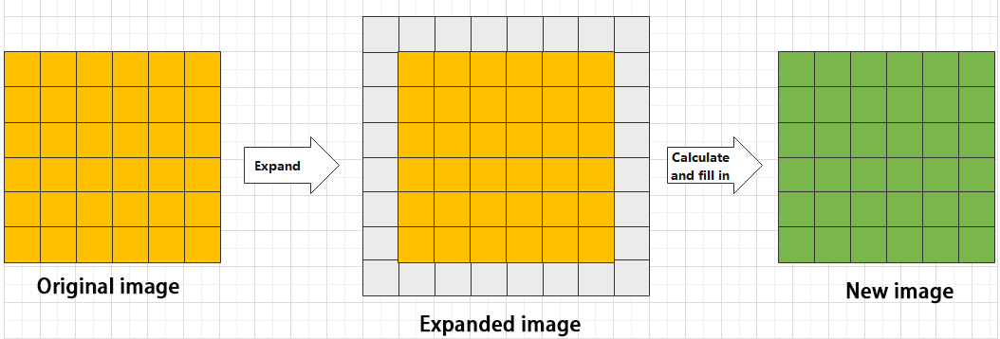

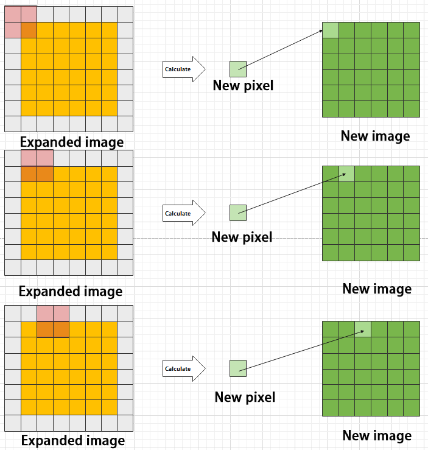

(2) Pooling Layer: Feature Amplification

The pooling layer, also called downsampling layer, is usually used together with convolution layers. After convolution, pooling performs further sampling on the extracted features. Pooling includes various types such as global pooling, average pooling, max pooling, etc., each producing different effects.

To make it easier to understand, max pooling is used here as an example. Before understanding max pooling, it is important to know about the filter, which is like the convolution kernel—a manually set region that slides over the image and selects pixels within the area.

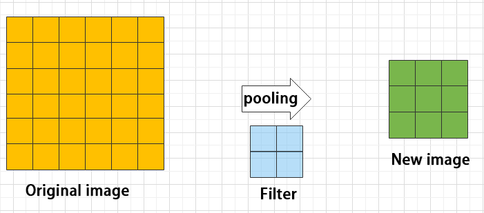

Max pooling keeps the most prominent features and discards others. For example, starting with a 6×6 image, applying a 2×2 filter for max pooling produces a new image with reduced size.

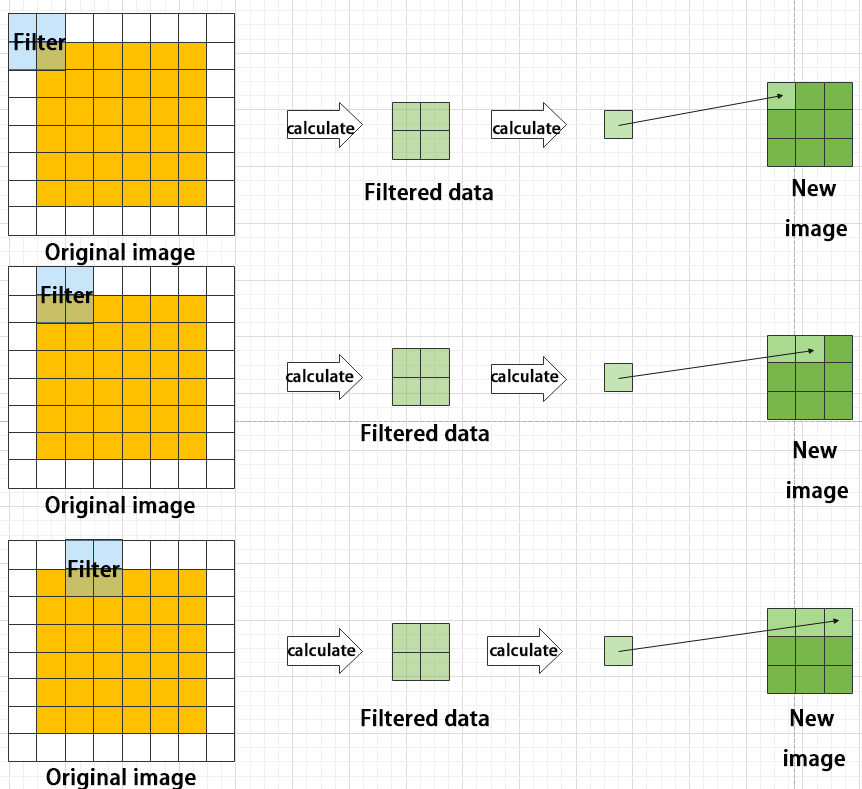

(3) Upsampling Layer: Restoring Image Size

Upsampling can be understood as "**reverse pooling**". After pooling, the image size shrinks, and upsampling restores the image back to its original size. However, only the size is restored, the pooled features are also modified accordingly.

For example, starting with a 6×6 image, applying a 3×3 filter for upsampling produces a new image.


(4) Batch Normalization Layer: Data Regularization

Batch normalization means rearranging the data neatly, which reduces the computational difficulty of the model and helps map data better into the activation functions.

Batch normalization reduces the loss rate of features during each calculation, retaining more features for the next computation. After multiple computations, the model's sensitivity to the data increases.

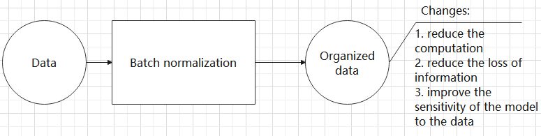

(5) ReLU Layer: Activation Function

Activation functions are added during model construction to introduce non-linearity. Without activation functions, each layer is essentially a matrix multiplication. Every layer's output is a linear function of the previous layer's input, so no matter how many layers the neural network has, the output is just a linear combination of the input. This prevents the model from adapting to actual situations.

There are many activation functions, commonly ReLU, Tanh, Sigmoid, etc. Here, ReLU is used as an example. ReLU is a piecewise function that replaces all values less than 0 with 0 and keeps positive values unchanged.


(6) ADD Layer: Tensor Addition

Features can be significant or insignificant. The ADD layer adds feature tensors together to enhance the significant features.


(7) Concat Layer: Tensor Concatenation

The Concat layer concatenates feature tensors to combine features extracted by different methods, thereby preserving more features.

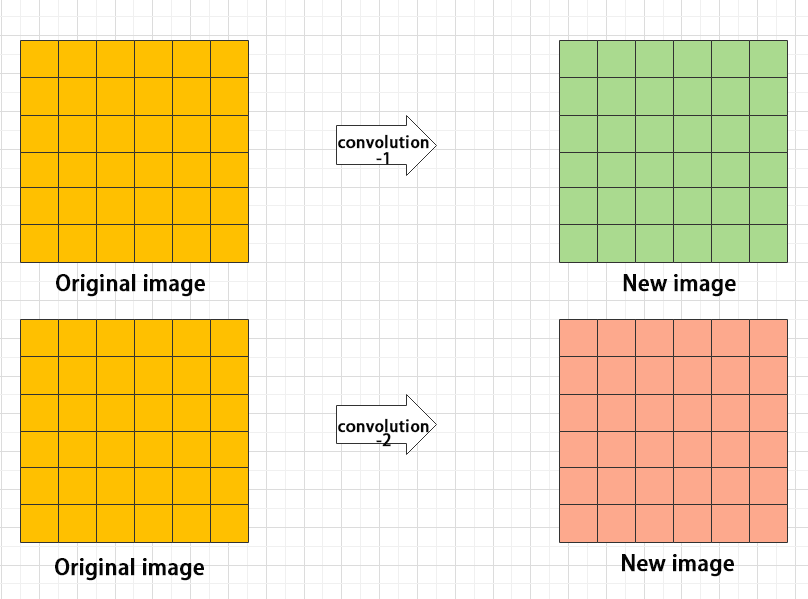

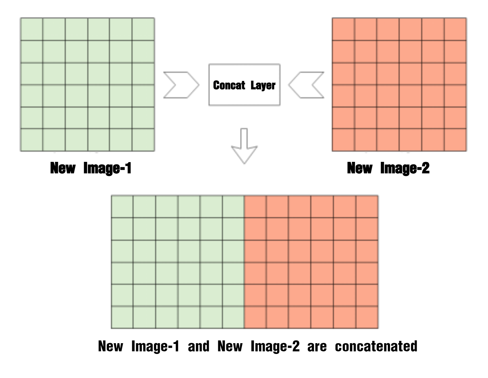

* **Composite Elements**

When building a model, using only the basic layers mentioned earlier can lead to overly lengthy, disorganized code with unclear hierarchy. To improve modeling efficiency, these basic elements are often grouped into modular units for reuse.

(1) Convolutional Block

A convolutional block consists of a convolutional layer, a batch normalization layer, and an activation function. The process follows this order: convolution → batch normalization → activation.

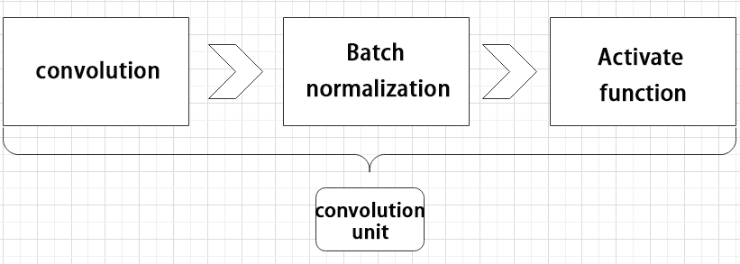

(2) Strided Sampling and Concatenation Unit（Focus）

The input image is first divided into multiple large regions. Then, small image patches located at the same relative position within each large region are concatenated together to form a new image. This effectively splits the input image into several smaller images. Finally, an initial sampling is performed on the images using a convolutional block.

As shown in the figure below, for a 6×6 image, if each large region is defined as 2×2, the image can be divided into 9 large regions, and each contains 4 small patches.

By taking the small patches at position 1 from each large region and concatenating them, a 3×3 image can be formed. The patches at other positions are concatenated in the same way.  

Ultimately, the original 6×6 image is decomposed into four 3×3 images.

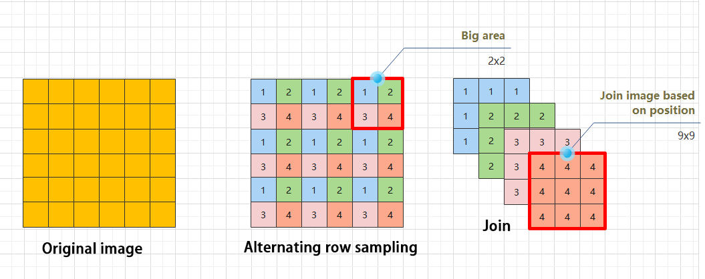

(3) Residual Block

The residual block enables the model to learn subtle variations in the image. Its structure is relatively simple and involves merging data from two paths.

In the first path, two convolutional blocks are used to extract features from the image. In the second path, the original image is passed through directly without convolution. Finally, the outputs from both paths are added together to enhance learning.

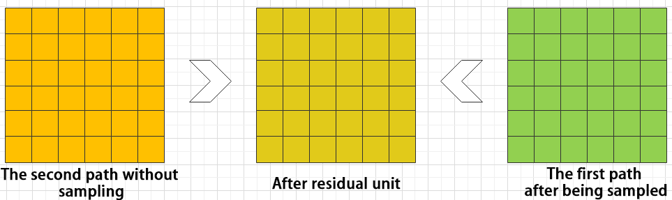

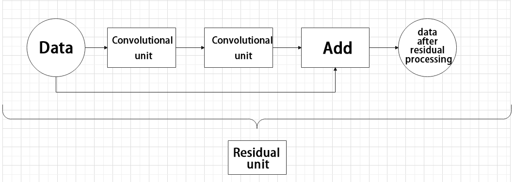

(4) Composite Convolutional Block

In YOLOv5, a key feature of the composite convolutional block is its customizable design, allowing convolutional blocks to be configured as needed. This structure also uses two paths whose outputs are merged.

The first path contains a single convolutional layer for feature extraction, while the second path includes 2𝑥+1 convolutional blocks followed by an additional convolutional layer. After sampling and concatenation, batch normalization is applied to standardize the data, followed by an activation function. Finally, a convolutional block is used to process the combined features.

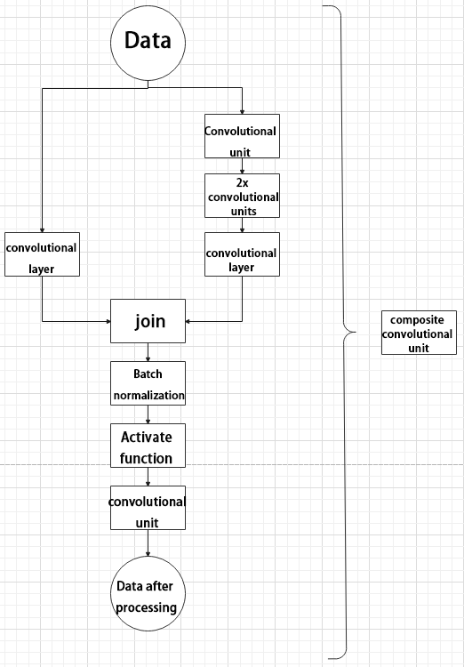

(5) Composite Residual Convolutional Block

The composite residual convolutional block modifies the composite convolutional block by replacing the 2𝑥 convolutional blocks with  
𝑥 residual blocks. In YOLOv5, this block is also customizable, allowing residual blocks to be tailored according to specific requirements.


(6) Composite Pooling Block

The output from a convolutional block is simultaneously passed through three separate max pooling layers, while an additional unprocessed copy is preserved. The resulting four feature maps are then concatenated and passed through a convolutional block. By processing data with the composite pooling block, the original features can be significantly enhanced and emphasized.

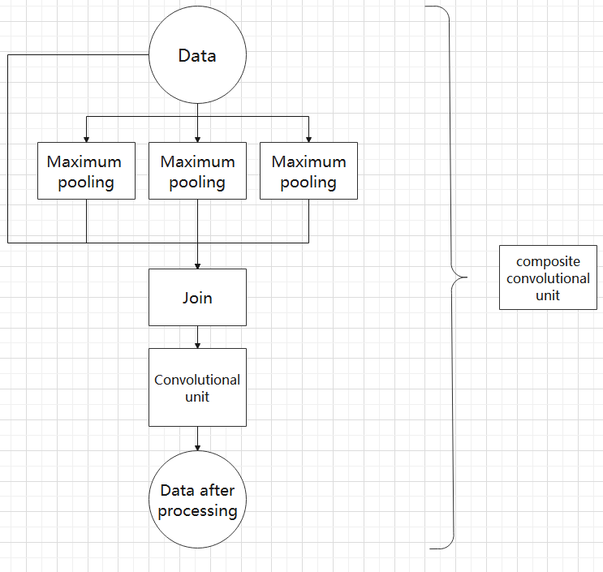

* **Structure**

YOLOv5 is composed of three main parts, each responsible for producing output at different spatial resolutions. These outputs are processed differently according to their respective sizes. The structure of YOLOv5's output is shown as the diagram below.

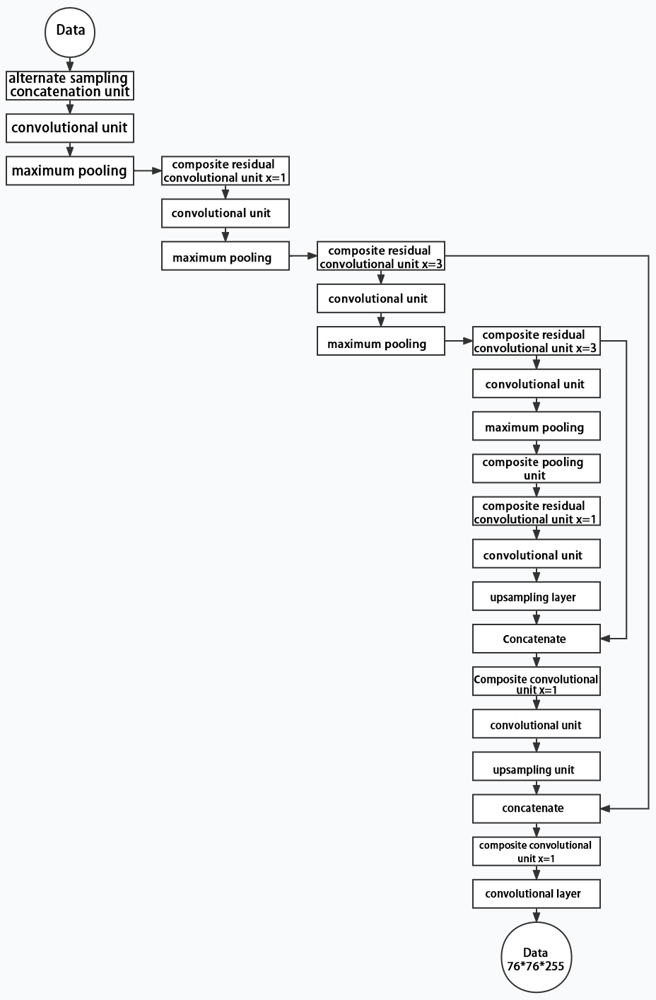

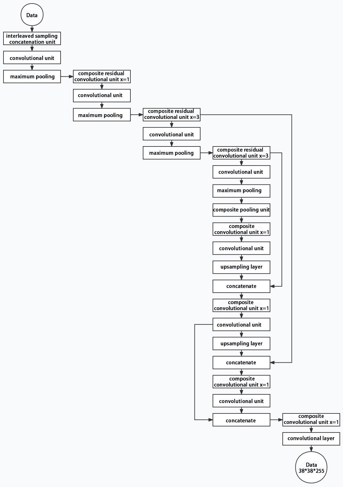

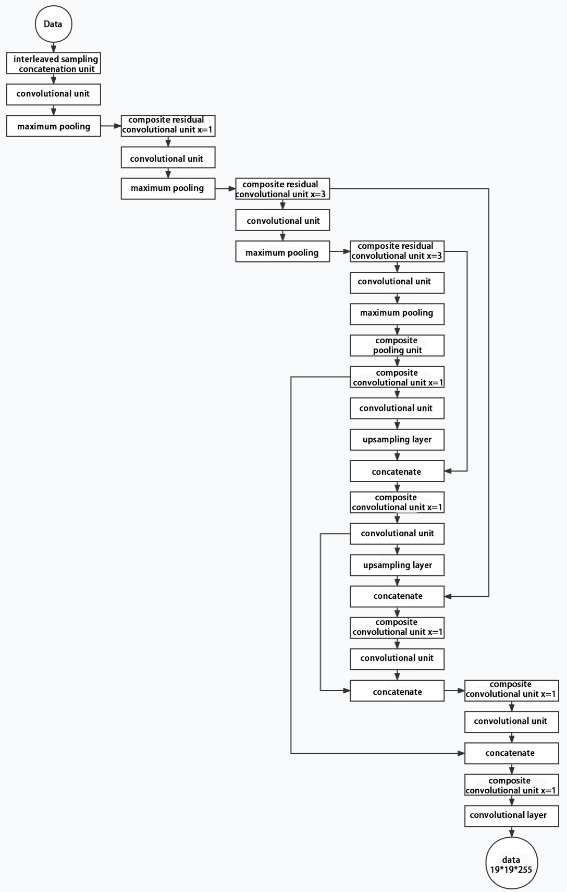

### 6.3.4 YOLOv5 Workflow

This section explains the model's processing flow using the concepts of prior boxes, predicted boxes, and anchor boxes.

* **Prior Box**

When an image is fed into the model, predefined regions of interest must be specified. These regions are marked using prior boxes, which serve as initial bounding box templates indicating potential object locations in the image.

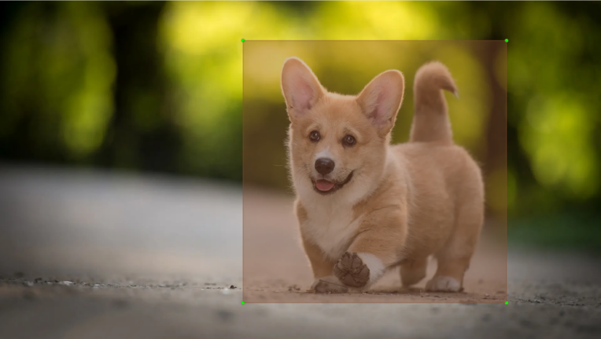

* **Predicted Box**

Predicted boxes are generated by the model as output and do not require manual input. When the first batch of training data is fed into the model, the predicted boxes are automatically created. The center points of predicted boxes tend to be located in areas where similar objects frequently appear.


* **Anchor Box**

Since predicted boxes may have deviations in size and location, anchor boxes are introduced to correct these predictions.

Anchor boxes are positioned based on the predicted boxes. By influencing the generation of subsequent predicted boxes, anchor boxes are placed around their relative centers to guide future predictions.

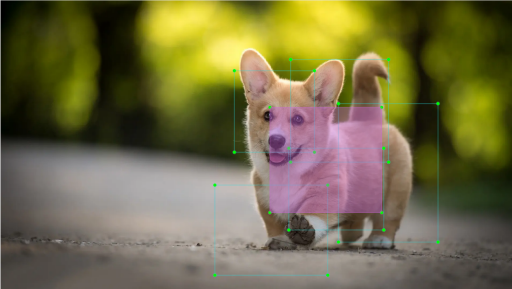

* **Project Process**

Once the bounding box annotations are complete, prior boxes appear on the image. When the image data is input into the model, predicted boxes are generated based on the locations of the prior boxes. Subsequently, anchor boxes are generated to adjust the predicted results. The weights from this round of training are then updated in the model.

With each new training iteration, the predicted boxes are influenced by the anchor boxes from the previous round. This process is repeated until the predicted boxes gradually align with the prior boxes in both size and location.

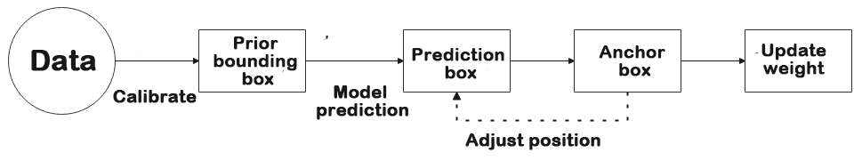

## 6.4 YOLOv5 Model Training

### 6.4.1  Image Collection and Annotation

Training a YOLOv5 model requires a large dataset, so you must first collect and annotate images to prepare for model training.

In this example, the demonstration uses traffic signs as target objects.

* **Image Collection**

(1) Power on the robot and connect it to a remote control tool like VNC.

(2) Click the terminal icon  in the system desktop to open a command-line window.

(3) Stop the app auto-start service by entering the following command:

```
~/.stop_ros.sh
```

(4) Start the monocular camera service with command:

```
ros2 launch peripherals usb_cam.launch.py
```

(5) Right-click inside the terminal window to split it, any method of splitting is fine.

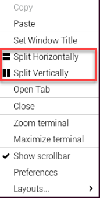

(6) Navigate to the image collection tool's directory and launch the tool by entering the following command:

```
cd ~/software/collect_picture && python3 main.py
```


The **"save number"** in the top-left corner of the tool interface shows the ID of the saved image. The "**existing**" shows how many images have already been saved.

(7) Click Choose to change the save path to the my_data folder automatically created by main.py located under the image collection tool directory.

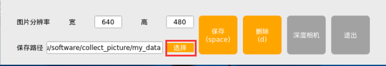

(8) After selecting the correct directory, click Choose.

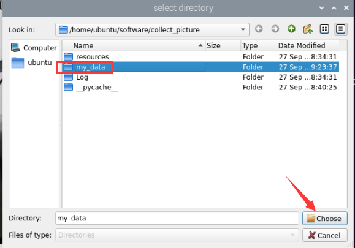

(9) Place the target object within the camera view and click the Save (space) button or press the spacebar to save the current camera frame.

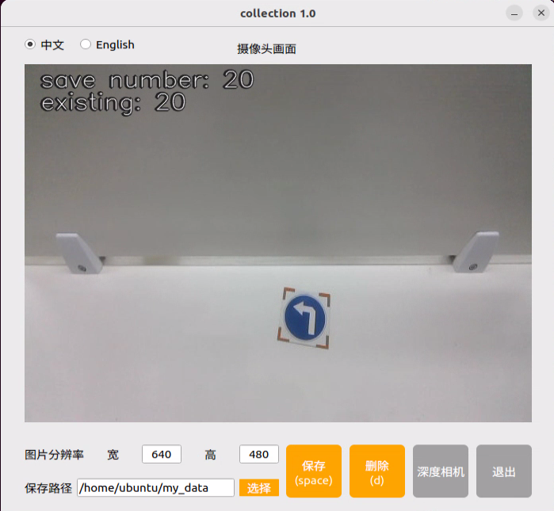

After pressing Save (space) or the spacebar, a folder named JPEGImages will be automatically created under the selected save path to store the images.

:::{Note}

To improve model reliability, capture the target object from various distances, angles, and tilts.

:::

(10) After collecting images, click the Exit button to close the tool.

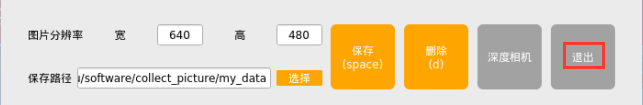

(11) Then press Ctrl + C in all opened terminal windows to exit—this completes the image collection process.

* **Image Annotation**

Once the images are collected, they need to be annotated. Annotation is essential for creating a functional dataset, as it tells the training model which parts of the image correspond to which categories. This allows the model to later identify those categories in new, unseen images.

:::{Note}

When entering commands, be sure to use correct case and spacing. You can use the Tab key to auto-complete keywords.

:::

(1) Open a terminal and enter the command to start the image annotation tool:

```
python3 ./software/labelImg/labelImg.py
```

Below is a table of common shortcut keys:

| **Function**                                                 | **Shortcut Key** | **Function**        |
| :----------------------------------------------------------- | :--------------- | :------------------ |
| 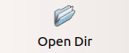 | Ctrl+U           | Select image folder |
| 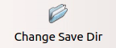 | Ctrl+R           | Select save folder  |
|  | W                | Create bounding box |
| 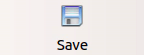 | Ctrl+S           | Save annotation     |
| 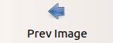 | A                | Previous image      |
| 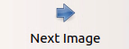 | D                | Next image          |

(2) Click the button  to open the folder where your images are stored. In this tutorial, select the directory used for image collection.

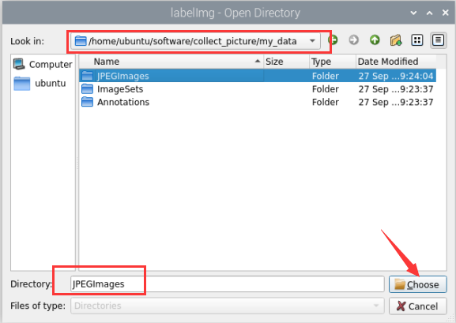

(3) Click Choose 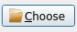 to open the folder.

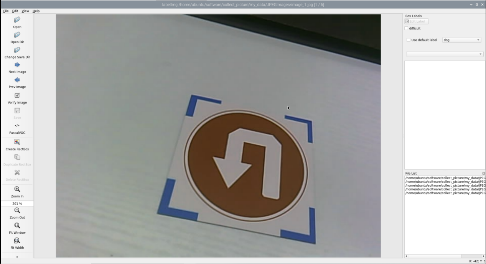

(4) Then click the Change Save Dir button  and select the annotation save folder, which is the Annotations directory located under the same path as the image collection.

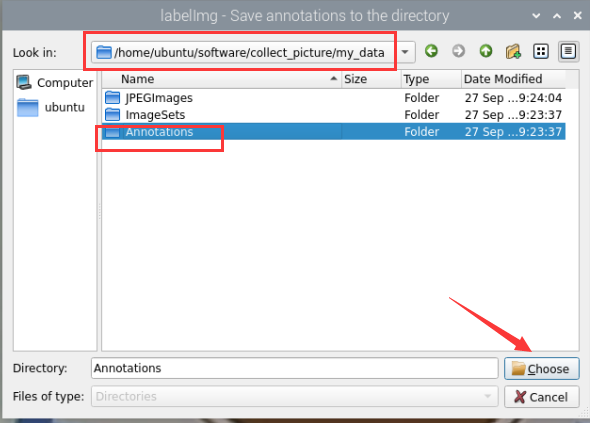

(5) Click Choose  to return to the annotation interface.

(6) Press the W key to begin creating a bounding box.

(7) Move the mouse to the desired location and hold the left mouse button to draw a box that covers the entire object. Release the left mouse button to finish drawing the box.

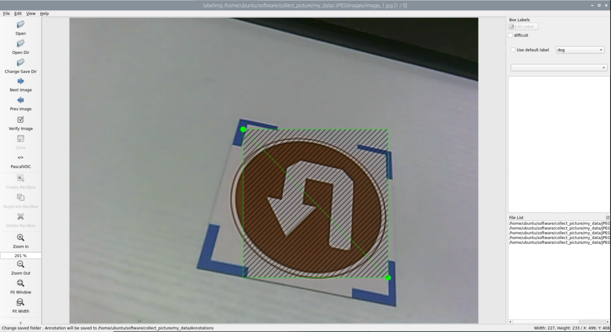

(8) In the popup window, name the category of the object, e.g., turn_around. After naming, click OK or press Enter to save the label.

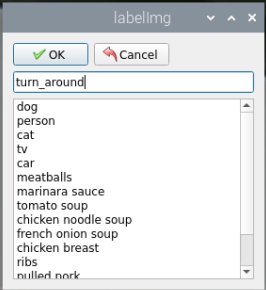

(9) Press Ctrl + S to save the annotation for the current image.

(10) As shown in the image below, the right side of the annotation tool interface is the label and bounding box management area. The red box highlights multiple annotation boxes placed on the same image. You can click the checkbox next to each label. When checked, the corresponding bounding box will be displayed and activated. When unchecked, it will be hidden and deactivated.

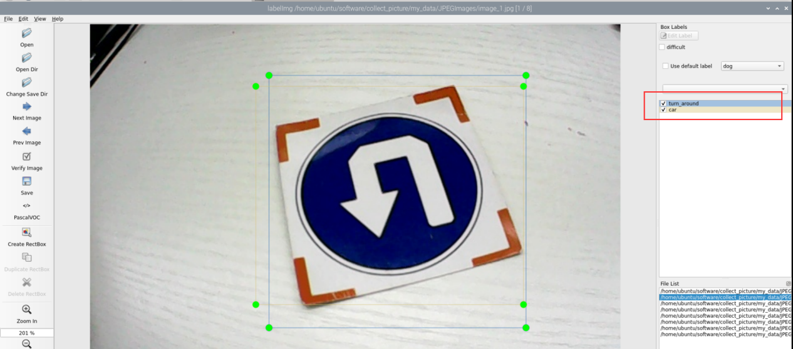

(11) Press D to move to the next image and repeat steps 7 to 9 to complete all annotations. Click the close button at the top-right corner of the tool to exit 

.

(12) Open a new terminal and enter the following command to view the annotation files:

```
cd software/collect_picture/my_data/Annotations && ls
```

### 6.4.2 Data Format Conversion

* **Getting Started**

Before starting this section, make sure you have completed image collection and annotation. For detailed steps, refer to section "**[1. Image Collection and Annotation]()**".

Before training images using the YOLOv5 model, you need to define class labels and convert the annotation data into the appropriate format.

* **Format Conversion**

Before starting this section, make sure you have completed image collection and annotation.

:::{Note}

When entering commands, be sure to use correct case and spacing. You can use the Tab key to auto-complete keywords.

:::

(1) Run the following command to write the class names used in this round of training into a specific text file:

```
gedit software/collect_picture/my_data/classes.names
```

(2) Press the **"i"** key and enter the annotated class name turn_around in the text file. If you have multiple class names, list each one on a new line.

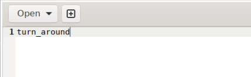

(3) Save and exit the file when done.

:::{Note}

The class names here must match the labels used in the labelImg annotation tool exactly.

:::

(4) Next, return to the terminal and run the following command to convert the annotation format:

```
python3 software/collect_picture/xml2yolo.py --data software/collect_picture/my_data --yaml software/collect_picture/my_data/data.yaml
```

:::{Note}

Make sure the paths to ~/software/xml2yolo.py and my_data match your actual file structure!

:::

This command uses three main parameters:

`xml2yolo.py`: A script that converts annotations from XML format to the YOLOv5 format. Make sure the path is correct.

`my_data`: The directory containing your annotated dataset.

`data.yaml`: A YAML file that specifies how the dataset is split and configured for training. It will be saved inside the my_data folder.

The following image shows a generated example of data.yaml:

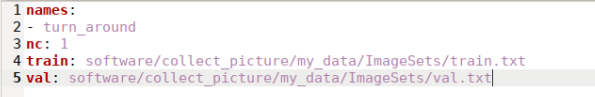

The items listed after names represent the types of labels. The nc field specifies the total number of label categories. train refers to the training set—a commonly used term in deep learning that indicates the data used for model training. The parameter following it is the path to the training images. Similarly, val refers to the validation set, which is used to verify the model's performance during the training process, and the path that follows indicates where the validation data is located. These file paths need to be set based on the actual location of your data. For example, if you plan to speed up the training process later by moving the dataset from the robot to a local PC or a cloud server, you'll need to update the train and val paths accordingly to reflect their new locations.

Finally, an XML file will be generated in the directory specified by the --data parameter. This file is used to record the path structure of the current dataset after it has been split. You can also change the save location of this file by modifying the last parameter following --yaml in Step 4.  

Be sure to remember the path to this XML file, as it will be required later during model training.

(5) Next, return to the command line terminal and enter the following command to open the yaml file:

```
gedit software/collect_picture/my_data/data.yaml
```

(6) In the opened file, change the relative paths of the train and val datasets to absolute paths.

These paths are originally set as relative to the directory where Step 4's command is executed.

However, in later stages, we will run commands from different directories that call this YAML file, which in turn references the paths to the training and validation data.

If the train and val paths remain as relative paths, the system will incorrectly assume they are relative to the current working directory where the new command is executed. This will result in errors when the files cannot be found.

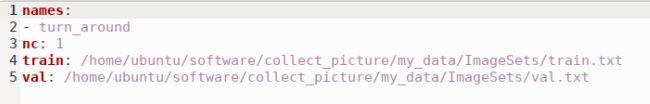

:::{Note}

To find the absolute path of a file or folder, navigate to the directory in the terminal and use the command: pwd

:::

(7) Then, go back to the terminal and enter the following command to open the validation set file:

```
gedit software/collect_picture/my_data/ImageSets/val.txt
```

Before editing:

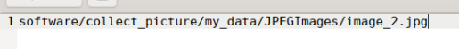

After editing:

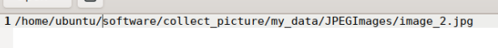

During model training, the program will automatically split the collected .jpg images from the **"Image Collection"** step into training and validation sets according to a set ratio. The split data is stored as relative paths in the corresponding train.txt and val.txt files.

To avoid the same issue as mentioned in Step 6, these relative paths should also be updated to absolute paths.

(8) Likewise, open the training set file using the following command:

```
gedit software/collect_picture/my_data/ImageSets/train.txt
```

Before editing:

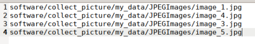

After editing:

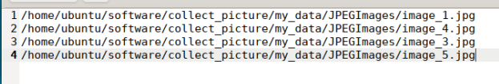

:::{Note}

If an error similar to the one shown below occurs after executing Step (4) in [Training the Model]() please go back to Step (7) and Step (8) in [Format Conversion]() to check whether they were executed correctly.

:::

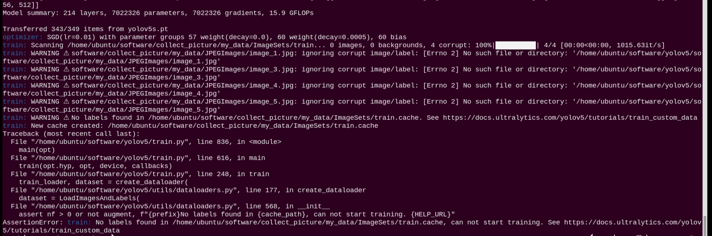

### 6.4.3 Model Training

:::{Note}

When entering commands, be sure to use correct case and spacing. You can use the Tab key to auto-complete keywords.

:::

* **Getting Started**

After converting the dataset format, you can proceed to the model training phase. Before starting, make sure the dataset with the correct format is ready. For details, refer to Section 2: Data Format Conversion.

* **Training the Model**

(1) Power on the robot and connect it to a remote control tool like VNC.

(2) Click the terminal icon  in the system desktop to open a command-line window.

(3) Enter the following command and press Enter to unzip the YOLOv5 package to the specified directory:

```
unzip software/yolov5.zip -d software/
```

(4) Enter the command to start training the model.

```
python3 software/yolov5/train.py --img 640 --batch 8 --epochs 300 --data software/collect_picture/my_data/data.yaml --weights software/yolov5/yolov5n.pt
```

In the command, the parameters stands for:  

--img: image size  

--batch: number of images per batch  

--epochs: number of training iterations  

--data: path to the dataset  

--weights: path to the pre-trained model

You can modify the parameters above based on your specific needs. To improve model accuracy, consider increasing the number of training epochs. Note that this will also increase training time.

If the following message appears, it means your network connection is unstable. Try switching to a network with proper scientific access (VPN/proxy) before running the command again.

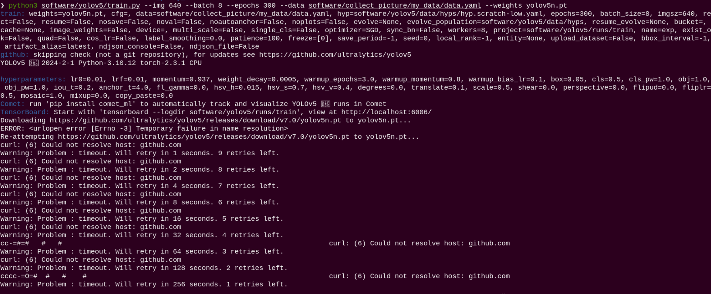

If the training process freezes and the last line in the terminal shows the message below:

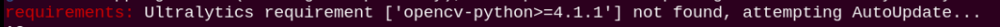

It means the program has detected that the OpenCV version installed on your Raspberry Pi does not match the system requirements, which may block the execution. However, this issue does not affect model training, and you can proceed in one of the following ways:

Method 1: Press CTRL+C once, bypass the warning, and the program will continue running.

Method 2: Comment out the related warning code in software/yolov5/train.py to prevent it from appearing next time.

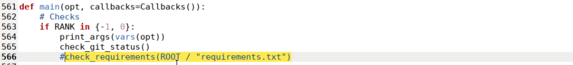

If you see the following output, it means the training process is running successfully.

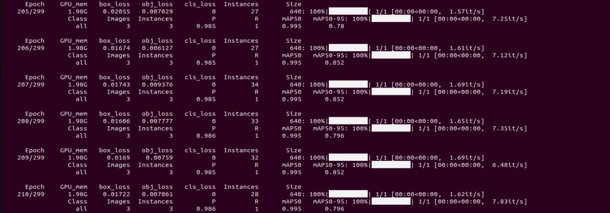

After training is complete, the terminal will display the path where the trained model files are saved. The training results are stored in the directory of yolov5/runs/train/exp.

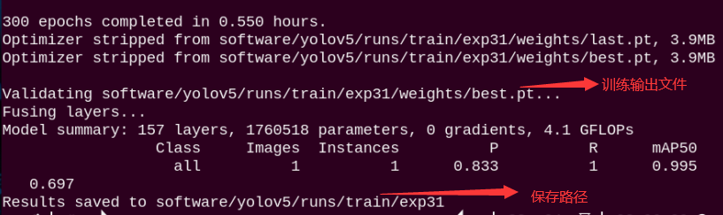

:::{Note}

The generated folder name under runs/train/ may vary. Please locate it accordingly.

:::

### 6.4.4 Traffic Sign Model Training

:::{Note}

The product names and reference paths mentioned in this document may vary. Please refer to the actual setup for accurate information. 

:::

When dealing with large datasets, it is not recommended to train models directly on the robot's onboard motherboard due to I/O speed and memory limitations. Instead, it is advised to use a PC with a dedicated GPU, which follows the same training steps, only requiring proper environment configuration.

If the traffic sign recognition in the autonomous driving scenario is not performing well, you can train a custom model by following the instructions in this section.

In the following instructions, screenshots may show different robot hostnames as different robots have similar environment setups. Simply follow the command steps in the document as described — it does not affect the execution.

* **Getting Started**

(1) Prepare a laptop for training. If you're using a desktop PC, make sure you have a Wi-Fi adapter, mouse, and other necessary peripherals.

(2) Use the previously learned method to install and open the remote control tool VNC.

* **Operation Steps**

(1) Image Collection

① Power on the robot and connect it to a remote control tool like VNC.

② Click the terminal icon  in the system desktop to open a command-line window.

③ Execute the following command to stop the APP service:

```
~/.stop_ros.sh
```

④ Execute the following command to start the camera service:

```
ros2 launch peripherals depth_camera.launch.py
```

⑤ Open a new terminal, navigate to the image collection tool directory, and run the image collection script:

```
cd software/collect_picture && python3 main.py
```


The **"save number"** in the top-left corner of the tool interface shows the ID of the saved image. The **"existing"** shows how many images have already been saved.

(6) Click Choose to change the save path to the my_data folder automatically created by main.py located under the image collection tool directory.


(7) Place the target object (traffic sign) within the camera's view. Press the **"Save (space)"** button or the spacebar to save the current camera frame. After pressing it, both save number and existing counters will increase by 1. This helps track the current image ID and total image count in the folder.

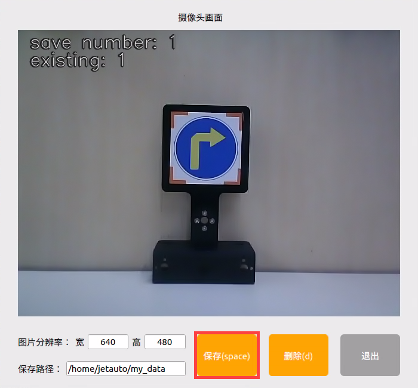

After pressing **"Save (space)"**, a folder named JPEGImages will be created under the selected save path to store the captured images.

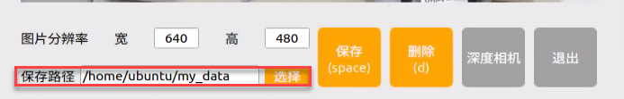

:::{Note}

* To improve model reliability, capture the target object from various distances, angles, and tilts.

* To ensure stable recognition, collect at least 200 images per category during the data collection phase.

  :::

(8) After collecting images, click the Exit button to close the tool.

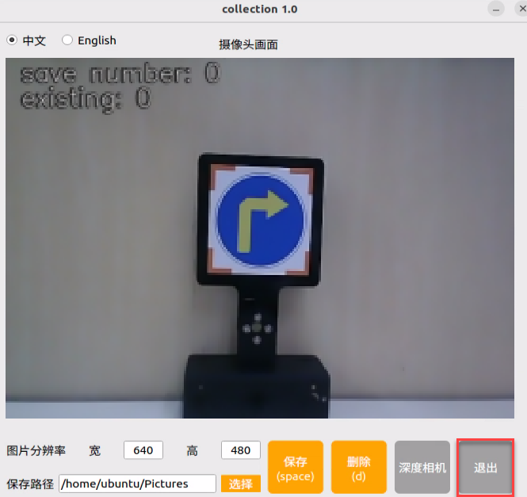

(2) Image Annotation

:::{Note}

When entering commands, be sure to use correct case and spacing. You can use the Tab key to auto-complete keywords.

:::

① Power on the robot and connect it to a remote control tool like VNC.

② Click the terminal icon  in the system desktop to open a command-line window.

③ Execute the following command to stop the APP service:

```
~/.stop_ros.sh
```

④ Open a new terminal and enter the following command.

```
python3 software/labelImg/labelImg.py
```

⑤ After opening the image annotation tool. Below is a table of common shortcut keys:


| **Function**                                                 | **Shortcut Key** | **Function**        |
| :----------------------------------------------------------- | :--------------- | :------------------ |
|  | Ctrl+U           | Select image folder |
|  | Ctrl+R           | Select save folder  |
|  | W                | Create bounding box |
|  | Ctrl+S           | Save annotation     |
|  | A                | Previous image      |
|  | D                | Next image          |

⑥ Click the button  to open the folder where your images are stored. In this tutorial, select the directory used for image collection.


⑦ Then click the Change Save Dir button  and select the annotation save folder, which is the Annotations directory located under the same path as the image collection.


⑦ Press the W key to begin creating a bounding box.

Move the mouse to the desired location and hold the left mouse button to draw a box that covers the entire object. Release the left mouse button to finish drawing the box.


⑧ In the popup window, name the category of the object, e.g., **right**. After naming, click OK or press Enter to save the label.

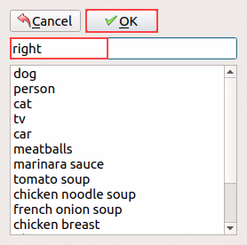

⑨ Press Ctrl + S to save the annotation for the current image.

⑩ Refer to Step 9) to complete the annotation of the remaining images.

⑪ Click the system status bar icon  to open the file manager and navigate to the directory /home/ubuntu/my_data/Annotations/. This is the same dataset path where the images were saved during Step 4.2.2 - Image Annotation. You will be able to view the annotation files corresponding to each image in this folder.

(3) Generating Related Files

① Click the terminal icon  in the system desktop to open a command-line window.

② Enter the following command to open the file for editing:

```
gedit software/collect_picture/my_data/classes.names
```

③ Press the **"i"** key to enter edit mode and add the class names for the target recognition objects. If you need to add multiple class names, enter one class name per line.

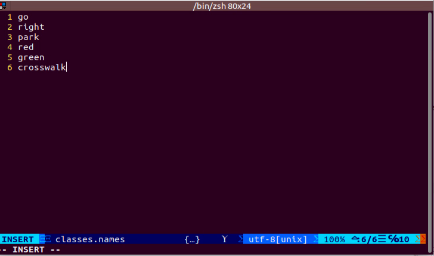

:::{Note}

The class names here must match the labels used in the labelImg annotation tool exactly.

:::

④ After editing, press **"Esc"**, then type **:wq** to save and close the file.


⑤ Next, enter the command to convert the data format and press Enter:

```
python3 software/collect_picture/xml2yolo.py --data software/collect_picture/my_data --yaml software/collect_picture/my_data/data.yaml
```

In this command, xml2yolo.py converts the annotated files into YOLO-compatible format, splits the dataset, and creates the training and validation sets.

If the prompt shown in the figure below appears, the conversion was successful.


The output paths depend on the actual storage location of the folders in your robot's file system. Paths may vary across devices, but the generated data.yaml file will correspond to your annotated dataset.

⑥ Return to the terminal and enter the following command to edit the yaml file, refer to Section 2.2 for detailed instructions:

```
gedit software/collect_picture/my_data/data.yaml
```

Then return to the terminal again and enter the following command to edit the val.txt file. The modification method is the same as described earlier:

```
gedit software/collect_picture/my_data/ImageSets/val.txt
```

Likewise, open the training set file using the following command:

```
gedit software/collect_picture/my_data/ImageSets/train.txt
```

(4) Training the Model

① Click the terminal icon  in the system desktop to open a command-line window.

② Enter the command to start training the model.

```
python3 software/yolov5/train.py --img 640 --batch 8 --epochs 300 --data software/collect_picture/my_data/data.yaml --weights yolov5n.pt
```

In the command, --img specifies the image size, --batch indicates the number of images input per batch, --epochs refers to the number of training iterations, representing how many times the machine learning model will go through the dataset. This value should be optimized based on the actual performance of the final model. In this example, the number of training epochs is set to 8 for quick testing. If the computer system is more powerful, this value can be increased to achieve better training results. --data is the path to the dataset, which refers to the folder containing the manually annotated data. --weights indicates the path to the pre-trained model weights. This specifies which .pt weight file the training process is based on. It's important to note whether you are using yolov5n.pt, yolov5s.pt, or another version.

You can modify the parameters above based on your specific needs. To improve model accuracy, consider increasing the number of training epochs. Note that this will also increase training time.

If you see the following output, it means the training process is running successfully.


After the model training is completed, the terminal will print the path where the output files are saved. Please make sure to record this path, as it will be needed later in the "Generating TensorRT Model Engine" step.

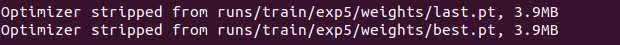

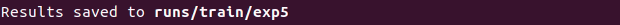

:::{Note}

If you run the training process multiple times, the folder name such as exp5 may change (e.g., exp2, exp3, etc.). Subsequent steps will depend on the name of this folder, so please pay close attention to it.

:::

(3) Using the Model

① Enter the following command and press Enter to stop the APP service:

```
~/.stop_ros.sh
```

② Navigate to the folder containing the training results:

```
cd software/yolov5/runs/train/exp5/weights
```

:::{Note}

Modify this path according to your actual directory. The path should match the location of the best.pt file outputted after training in step 4.2.4.

:::

③ Copy the trained model file to the yolov5 ROS2 package configuration folder:

```
cp -r best.pt ~/ros2_ws/src/yolov5_ros2/config
```

④ Start the depth camera node by entering:

```
ros2 launch peripherals depth_camera.launch.py
```

⑤ Open a new terminal, navigate to the yolov5 ROS2 launch files folder, and edit the launch file to specify the model as best:

```
cd ros2_ws/src/yolov5_ros2/launch && gedit yolov5_ros2.launch.py
```

As shown in the figure below, in the opened page, edit the node's model parameter by changing its value to the model filename best.

Before editing:

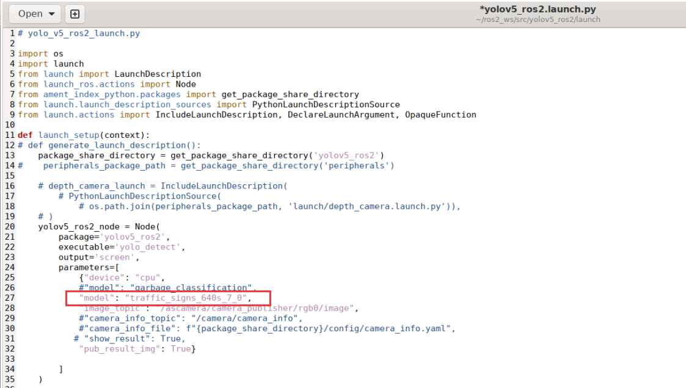

After editing:

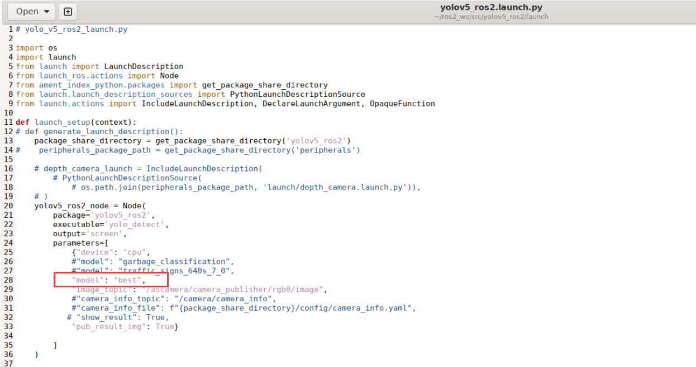

⑥ Execute the following command in the path specified in step 5) to launch the yolov5 node.

:::{Note}

This command can only be run in the /home/ubuntu/ros2_ws/src/yolov5_ros2/launch directory.

:::

```
ros2 launch yolov5_ros2.launch.py
```

⑦ Open a new terminal and enter the command to launch the rqt interface.

```
rqt
```

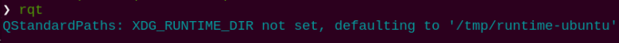

⑧ In the rqt window, select the image source as **"result_img"**. Then a popup window will display the real-time images captured by the camera and processed by the specified model. Place the training material within the camera view, and you will see the material being detected and outlined with bounding boxes. Above each bounding box, the program's recognition result and its confidence score will be displayed.

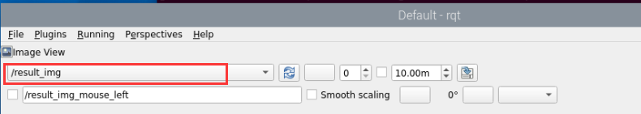

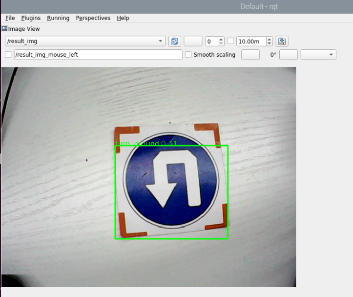

## 6.5 Traffic Sign Recognition

###  6.5.1 Brief Overview of Operation

This lesson demonstrates how to use a camera to recognize common traffic signs, including red lights, green lights, straight-ahead signs, stop signs, and crosswalks. The system uses image processing techniques to extract features such as color and shape from the camera feed, enabling the classification and identification of various traffic signs. Detected signs are labeled directly on the image output.

When the robot's camera is aimed at a target scene—for example, a handheld sign with a "**right turn**" symbol—the program activates the camera and begins real-time image capture. Each frame is analyzed using a built-in recognition algorithm. If a traffic sign is detected, the system outlines the area with a bounding box and labels it with the identified category and a confidence score. The higher the value, the more reliable the result. For example, a right turn sign is detected, the system will outline right and 0.87. Additionally, the image display shows the system's real-time processing speed in frames per second (FPS), such as "**FPS: 3.31**", to provide a clear view of performance and recognition efficiency.

The detection relies on a pre-trained model, such as a deep learning-based model, which has been trained to recognize specific traffic sign features—like the shape and color combinations of a right turn sign. Once the model finds a match, it calculates a confidence score and overlays a label on the image showing the name of the sign and the confidence value. FPS is also calculated and displayed to reflect the system's real-time performance.

###  6.5.2 Enabling and Disabling the Feature

:::{Note}

When entering commands, be sure to use correct case and spacing. You can use the Tab key to auto-complete keywords.

:::

(1) Power on the device and connect via VNC remote desktop tool.

(2) Click the terminal icon  in the upper-left corner of the system desktop to open a command-line window.

(3) Enter the following command and press Enter to navigate to the directory where the feature's program is stored:

```
cd /home/ubuntu/ros2_ws/src/example/example/yolov5
```

(4) Entering the following command and press Enter to start the feature.

```
python3 yolov5n.py
```

(5) Open a new terminal window  and start the camera by entering the following command, then select the /image_raw_yolov5 image feed.

```
rqt
```


(6) To exit the feature, press Ctrl+C in the terminal. If the program does not close successfully, try pressing Ctrl+C again.

###  6.5.3 Project Outcome

:::{Note}

For best results, perform traffic sign recognition in a well-lit environment to avoid errors caused by poor lighting.

:::

Once activated, the robot uses the camera to detect traffic signs. For instance, when a right turn sign is recognized, the system highlights it in blue with a bounding box and displays the label "**right**" along with the confidence score (e.g., "**0.87**"). The screen also shows the real-time FPS (e.g., "**FPS: 3.31**") to provide feedback on recognition speed and system performance.

###  6.5.4 Program Brief Analysis

The source code for this demo is located at [/home/ubuntu/ros2_ws//src/example/example/yolov5/yolov5n.py](). It implements a real-time object detection system using the YOLOv5n model, integrated with ROS2 for image processing and message communication.

* **Import Libraries**

{lineno-start=1}

```python
import cv2
import numpy as np
import onnxruntime as ort
import time
import rclpy
from rclpy.node import Node
from sensor_msgs.msg import Image
from std_msgs.msg import String
from cv_bridge import CvBridge
from rclpy.qos import QoSProfile
import random
```

(1) Image Processing Library

`cv2`: For image reading, processing, and drawing bounding boxes.

`numpy`: For numerical computation and array operations.

(2) Model Inference Library

`onnxruntime`: For loading and running the YOLOv5n ONNX model.

(3) ROS2 Communication Library

`rclpy`: ROS2 Python client library.

`cv_bridge`: For conversion between ROS and OpenCV image formats.

`sensor_msgs`: For image message types.

`std_msgs`: For string message types.

* **plot_one_box** 

{lineno-start=11}

```python
def plot_one_box(x, img, color=None, label=None, line_thickness=None):
    tl = (
            line_thickness or round(0.002 * (img.shape[0] + img.shape[1]) / 2) + 1
    )  # line/font thickness
    color = color or [random.randint(0, 255) for _ in range(3)]
    c1, c2 = (int(x[0]), int(x[1])), (int(x[2]), int(x[3]))
    cv2.rectangle(img, c1, c2, color, thickness=tl, lineType=cv2.LINE_AA)
    if label:
        tf = max(tl - 1, 1)  # font thickness
        t_size = cv2.getTextSize(label, 0, fontScale=tl / 3, thickness=tf)[0]
        c2 = c1[0] + t_size[0], c1[1] - t_size[1] - 3
        cv2.rectangle(img, c1, c2, color, -1, cv2.LINE_AA)  # filled
        cv2.putText(
            img,
            label,
            (c1[0], c1[1] - 2),
            0,
            tl / 3,
            [225, 255, 255],
            thickness=tf,
            lineType=cv2.LINE_AA,
        )
```

A function named `plot_one_box` is defined, primarily used to draw bounding boxes on images via OpenCV and add class labels next to the boxes. It is part of the result visualization process for object detection algorithms such as the YOLO series.

* **_make_grid**

{lineno-start=37}

```python
def _make_grid(nx, ny):
    xv, yv = np.meshgrid(np.arange(ny), np.arange(nx))
    return np.stack((xv, yv), 2).reshape((-1, 2)).astype(np.float32)
```

A function named `_make_grid` is defined to generate grid coordinates, which are used in scenarios such as object detection and image processing, for example, for generating anchor box coordinates. It is implemented based on the `NumPy` library.

* **cal_outputs**

{lineno-start=42}

```python
def cal_outputs(outs, nl, na, model_w, model_h, anchor_grid, stride):
    row_ind = 0
    grid = [np.zeros(1)] * nl
    for i in range(nl):
        h, w = int(model_w / stride[i]), int(model_h / stride[i])
        length = int(na * h * w)
        if grid[i].shape[2:4] != (h, w):
            grid[i] = _make_grid(w, h)

        outs[row_ind:row_ind + length, 0:2] = (outs[row_ind:row_ind + length, 0:2] * 2. - 0.5 + np.tile(
            grid[i], (na, 1))) * int(stride[i])
        outs[row_ind:row_ind + length, 2:4] = (outs[row_ind:row_ind + length, 2:4] * 2) ** 2 * np.repeat(
            anchor_grid[i], h * w, axis=0)
        row_ind += length
    return outs
```

A function named `cal_outputs` is defined to handle the post-processing of the model outputs (outs) in object detection tasks. It involves concepts such as grid coordinates (grid), anchor boxes (anchor_grid), and stride (stride). This function is commonly used in YOLO series object detection algorithms to convert the raw prediction values from the model into actual bounding box coordinates.

* **post_process_opencv**

{lineno-start=59}

```python
def post_process_opencv(outputs, model_h, model_w, img_h, img_w, thred_nms, thred_cond):
    conf = outputs[:, 4].tolist()
    c_x = outputs[:, 0] / model_w * img_w
    c_y = outputs[:, 1] / model_h * img_h
    w = outputs[:, 2] / model_w * img_w
    h = outputs[:, 3] / model_h * img_h
    p_cls = outputs[:, 5:]
    if len(p_cls.shape) == 1:
        p_cls = np.expand_dims(p_cls, 1)
    cls_id = np.argmax(p_cls, axis=1)

    p_x1 = np.expand_dims(c_x - w / 2, -1)
    p_y1 = np.expand_dims(c_y - h / 2, -1)
    p_x2 = np.expand_dims(c_x + w / 2, -1)
    p_y2 = np.expand_dims(c_y + h / 2, -1)
    areas = np.concatenate((p_x1, p_y1, p_x2, p_y2), axis=-1)

    areas = areas.tolist()
    ids = cv2.dnn.NMSBoxes(areas, conf, thred_cond, thred_nms)
    if len(ids) > 0:
        return np.array(areas)[ids], np.array(conf)[ids], cls_id[ids]
    else:
        return [], [], []
```

A function named `post_process_opencv` is defined, which serves as the core function in the post-processing stage of an object detection task. It is implemented based on OpenCV and its purpose is to convert the raw prediction outputs from the model into final detection boxes, including coordinates, confidence scores, and classes, that can be directly used for visualization and analysis.

* **infer_img**

{lineno-start=84}

```python
def infer_img(img0, net, model_h, model_w, nl, na, stride, anchor_grid, thred_nms=0.2, thred_cond=0.5):
    # Image preprocessing （图像预处理）
    img = cv2.resize(img0, [model_w, model_h], interpolation=cv2.INTER_AREA)
    img = cv2.cvtColor(img, cv2.COLOR_BGR2RGB)
    img = img.astype(np.float32) / 255.0
    blob = np.expand_dims(np.transpose(img, (2, 0, 1)), axis=0)

    # Model inference （模型推理）
    outs = net.run(None, {net.get_inputs()[0].name: blob})[0].squeeze(axis=0)

    # Output coordinate correction （输出坐标矫正）
    outs = cal_outputs(outs, nl, na, model_w, model_h, anchor_grid, stride)

    # Bounding box calculation （检测框计算）
    img_h, img_w, _ = np.shape(img0)
    boxes, confs, ids = post_process_opencv(outs, model_h, model_w, img_h, img_w, thred_nms, thred_cond)

    return boxes, confs, ids
```

A function named `infer_img` is defined as a complete inference process for object detection, combining OpenCV and deep learning models, and is likely based on ONNX Runtime or a similar framework. Its purpose is to perform object detection on an input image and output the bounding boxes, confidence scores, and class IDs.

* **\_\_init\_\_(self):** 

{lineno-start=104}

```python
class ImageProcessor(Node):
    def __init__(self):
        super().__init__('image_processor')

        # Model loading （模型加载）
        model_pb_path = "yolov5n.onnx"
        so = ort.SessionOptions()
        self.net = ort.InferenceSession(model_pb_path, so)

        # Label dictionary （标签字典）
        self.dic_labels = {
            0: "go",
            1: "right",
            2: "park",
            3: "red",
            4: "green",
            5: "crosswalk"
        }

        # Model parameters （模型参数）
        self.model_h = 480
        self.model_w = 640
        self.nl = 3
        self.na = 3
        self.stride = [8., 16., 32.]
        self.anchors = [[10, 13, 16, 30, 33, 23], [30, 61, 62, 45, 59, 119], [116, 90, 156, 198, 373, 326]]
        self.anchor_grid = np.asarray(self.anchors, dtype=np.float32).reshape(self.nl, -1, 2)

	        # Initialize CvBridge and publisher （初始化CvBridge和发布器）
        self.bridge = CvBridge()
        self.publisher = self.create_publisher(Image, '/image_raw_yolov5', QoSProfile(depth=10))
        self.detection_publisher = self.create_publisher(String, '/detection_result', QoSProfile(depth=10))  # New publisher （新的发布器）
        self.create_subscription(Image, '/image_raw', self.image_callback, 10)
```

A function named `__init__(self)` is defined as the initialization logic of a ROS2 node, incorporating object detection functionality. It is used to load the model, configure parameters, and initialize ROS2 communication components.

* **image_callback(self, msg)** 

{lineno-start=138}

```python
	def image_callback(self, msg):
        # Receive ROS image and convert to OpenCV image （获取 ROS 图像并转换为 OpenCV 图像）
        img0 = self.bridge.imgmsg_to_cv2(msg, "bgr8")

        # Infer image （推理图像）
        t1 = time.time()
        det_boxes, scores, ids = infer_img(img0, self.net, self.model_h, self.model_w, self.nl, self.na, self.stride, self.anchor_grid, thred_nms=0.2, thred_cond=0.5)
        t2 = time.time()

        # Draw bounding boxes （绘制检测框）
        for box, score, id in zip(det_boxes, scores, ids):
            label = '%s:%.2f' % (self.dic_labels[id], score)
            plot_one_box(box.astype(np.int16), img0, color=(255, 0, 0), label=label, line_thickness=None)

	        # Output FPS （输出 FPS）
        str_FPS = "FPS: %.2f" % (1. / (t2 - t1))
        cv2.putText(img0, str_FPS, (50, 50), cv2.FONT_HERSHEY_COMPLEX, 1, (0, 255, 0), 3)

        # Publish image （发布图像）
        img_msg = self.bridge.cv2_to_imgmsg(img0, encoding="bgr8")
        self.publisher.publish(img_msg)

        # Create and publish detection result message （创建并发布检测结果消息）
        detection_msg = String()
        detection_msg.data = ', '.join([f"{self.dic_labels[id]}: {score:.2f}" for id, score in zip(ids, scores)])
        self.detection_publisher.publish(detection_msg)  # Publish detection result （发布检测结果）
```

A function named `image_callback(self, msg)` is defined as the image callback function of a ROS2 node, implementing the complete object detection process. From receiving ROS image messages, performing inference, drawing detection boxes, calculating FPS, to publishing the results.

* **Main(args=None)**

{lineno-start=166}

```python
def main(args=None):
    rclpy.init(args=args)
    image_processor = ImageProcessor()
    rclpy.spin(image_processor)
    image_processor.destroy_node()
    rclpy.shutdown()
```

Used to start the node and keep it running.


