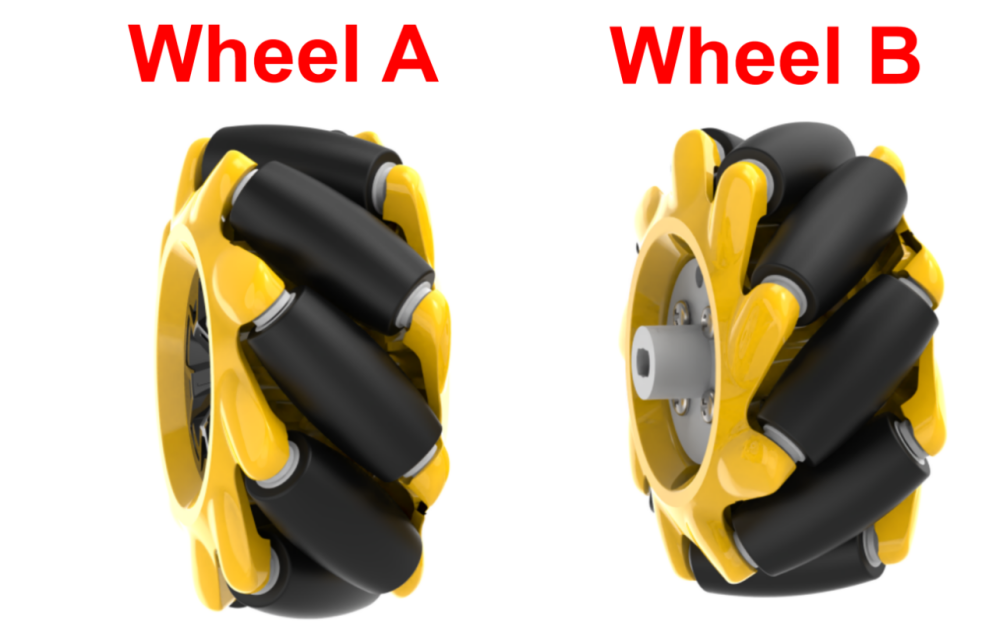
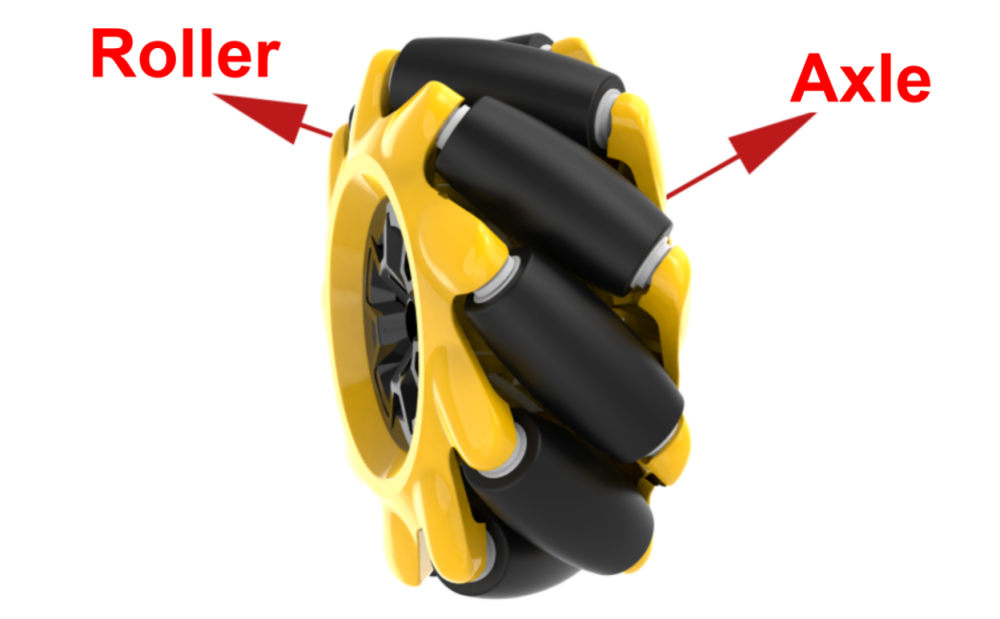
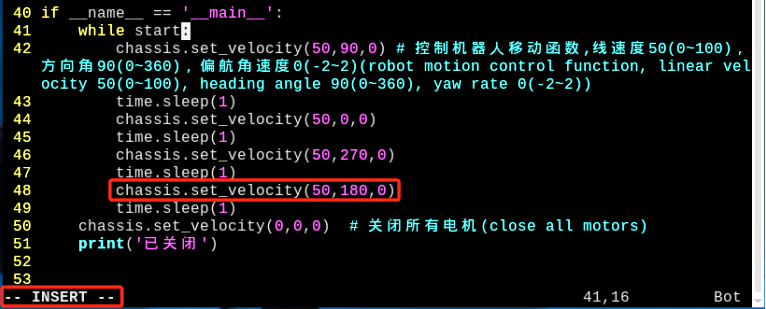

# 3. Motion Control Course

## 1. Introduction to Mecanum Wheel Car

### 1.1 Preface

TurboPi adopts mecanum wheels which move in all direction. According to direction of roller, wheels can be divided into wheel A and wheel B which are in mirror-image relationship with each other as pictured.



It features 360° movement, flexibility and stability. The combination of four mecanum wheels enables TurboPi to move more flexibly and achieve 360° movement.

### 1.2 Working Principle

**1.2.1 Mecanum Wheel Hardware Structure**



Mecanum wheel is composed of rollers and axles. Axle serves as main bracket of the whole wheel, and rollers are attached to the axle. The axel axis is at a 45-degree angle to the roller axis. In general, mecanum wheels work in a group of four, including two left wheels and two right wheels. A wheel and B wheel are symmetrical.
There are several combination of four mecanum wheels, such as AAAA, BBBB, AABB, ABAB, BABA. Not all combinations of wheels enable TurboPi to go forward, backward, and move left and right, etc. The combination of TurboPi's wheels are ABAB, which can realize omnidirectional movement.


**1.2.2 Mecanum Wheel Physical Characteristics**

The omnidirectional motion of the vehicle is achieved as the vector summation of propelling forces on the ground-engaging rollers can be in any direction by adjusting the wheel rotation direction and torque magnitude of the four wheels.
Due to the rollers at its rim oriented at an certain angle to the wheel circumference, the mecanum wheels can slip in sideways direction. The generatrix of small rollers are special. When the mecanum wheel revolves around its fixed axle, the envelope of each small roller is a cylindrical surface so that the wheel can roll forward continuously.
When conducting kinematic analysis, we can consider the kinematic model of mecanum wheels, which includes the following parameters:


(1) Vx: the velocity of the mecanum wheel in the X-axis forward/backward direction.

(2) Vy: the velocity of the mecanum wheel in the X-axis left/right direction.

(3) Vω: the angular velocity of the mecanum wheelbase (i.e., the speed at which the base rotates around its own center).

(4) VA、VB、VC、VD： the real-time speed of the four mecanum wheels.
The motion of the right front wheel in the plane can be decomposed into:

(5) VBx：the velocity of the mecanum wheel in the X-axis forward/backward direction.

(6) VBy：the velocity of the mecanum wheel in the X-axis left/right direction.

(7) L: represents the distance between the centers of the left and right wheels.

(8) H: represents the distance between the centers of the front and rear wheels.

(9) θω：the angle formed between the chassis center of gravity and the center of the right front wheel is 45°.

The kinematics of mecanum wheel baseboard can be analyzed base on these parameters.

### 1.3 Kinematics Analysis Formula Calculation

To simplify the mathematical module of kinematics, there are two ideal assumptions:

(1) The omni-directional wheel does not slip on the ground, while there is sufficient friction force between the ground and the wheel.

(2) The four wheels are distributed at the four corners of a rectangle or square, with the wheels parallel to each other.

The rigid body motion of the car is decomposed into three components here. Calculate the velocities of the four wheels when the output mecanum wheelbase translates along the X+, Y+, and Z+ directions. When these three simple motions are combined, you can use the combined formulas to calculate the speeds of the four wheels required for the composite motion of "translation + rotation". Then calculate the speeds of the four wheels required for the composite motion of "translation + rotation" by combining formulas when these three simple motions are combined.
VA, VB, VC, VD represent the speeds of wheels A, B, C, D respectively. That is also the speeds of motor. VX represents the speed of the car's translation along the X-axis. Vω represents the rotation speed of the car. L represents a half of the car's wheelbase L. H represents a half of the car's axle distance H. 

(3) When the robot translates along the X-axis, the velocity component of each wheel can be calculated using the following formula:


VA、VB、VC、VD represent the real-time velocity of four mecanum wheels and the speed of mecanum wheel in the X-axis direction. 

(4) When the robot translates along the Y-axis, the velocity component of each wheel can be calculated using the following formula:


Vy represents the speed of mecanum wheel in the Y-axis direction. 

(5) When the robot rotate along the Z-axis, the velocity component of each wheel can be calculated using the following formula:


 represents the angular velocity of mecanum wheel chassis. That is, the speed at which the base rotates around its own center.

(6) Combine the velocities in the X, Y, and Z directions, we can calculate the speeds of the four wheels based on the motion state of the car:


## 2. Going Forward

### 2.1 Program Description 

According to characteristic of mecanum wheel, only when four wheels rotates forward, car can go forward. The analysis of force is as pictured. 


Based on physical kinematics, when forces are equal and opposite to each other, they cancel each other out. Suppose wheel A and wheel B rotates at the same speed, a right force decomposed by wheel A and a left force decomposed by wheel B will cancel each other out, and then work together to make the zcar go forward. Based on Newton's second law (F=ma), if acceleration is forward, the final resultant force is also forward.

<p id="anchor_2_2"></p>

### 2.2 Start and Close the Game

:::{Note}
The input command should be case sensitive. Keywords can be complemented by **"Tab"** key.
:::

(1) Power on the robot and use VNC Viewer to connect to the remote desktop.


(2) Clickor press "Ctrl+Alt+T" to enter the LX terminal.


(3) Input command and press Enter to enter the catalog where game programs are stored.

```shell
cd TurboPi/MecanumControl/
```

(4) Input command and press Enter to start the game.

```shell
sudo python3 Car_Forward_Demo.py
```

(5) If you need to stop this game, you can press "Ctrl+C". If the game cannot be closed, you can try again.

### 2.3 Program Outcome

After game starts, TurboPi keeps going forward.


### 2.4 Function Extension

The default speed of going forward is 50. You can change the speed in the program. For example, 90.

(1) Clickor press "Ctrl+Alt+T" to open LX terminal.

(2) Input command and press Enter to enter the directory where game programs are stored.

```shell
cd TurboPi/MecanumControl/
```

(3) Input command and press Enter to open program file.

```shell
sudo vim Car_Forward_Demo.py
```

(4) Input command and press Enter to display the line number.

```shell
: set number
```

(5) Press "i" key to modify the content as pictured. When "INSERT" appears, you can start editing.


(6) In "chassis.set_velocity()" function, the first parameter refers to motor speed. Change it to 90. After modification, press Esc, input ":wq", and then press Enter to save and close the program file.

:::{Note}

adjust the speed from -100 to 100. When the value is positive, motors rotate forward. When it is negative, motors rotate backward. Since movement direction of car changes when value is set as negative, it is recommended to adjust the value within 0~100. 

:::

(7) After modification, run the program again according to [2.2 Start and Close the Game](#anchor_2_2) to check TurboPi performance.

### 2.5 Program Analysis

The program is stored in  **[home/pi/TurboPi/MecanumControl/Car_Forward_Demo.py]()**

chassis.set_velocity() function is mainly used to control motors. It has three parameters. Take `chassis.set_velocity(50,90,0)` as example.

① The first parameter "50" is motor linear velocity ranging from -100 to 100. When the value is negative, motor rotates backward.

② The second parameter "90" is movement direction of car. It ranges from 0 to 360 degree. 90 degrees corresponds to front, 270 degree corresponds to back, 0 degree corresponds to right and 180 degree corresponds to left.

③ The third parameter "0" is yaw rate ranging from -2.0 to 2.0. 0 means that there is no angular velocity. When the value is positive, car rotates clockwise. When it is negative, car rotates counterclockwise. The greater the absolute value, the faster the car moves.

## 3. Turn

### 3.1 Program Description 

According to characteristic of mecanum wheel, only when two left wheels rotate in reverse and two right wheels rotate forward, car turns counterclockwise on the spot. When two left wheels rotate forward and two right wheels rotate in reverse, car turns clockwise on the spot. The analysis of force is as pictured.


### 3.2 Start and Close the Game

:::{Note}
The input command should be case sensitive. Keywords can be complemented by **"Tab"** key.
:::

(1) Power on the robot and use VNC Viewer to connect to the remote desktop.


(2) Clickor press "Ctrl+Alt+T" to enter the LX terminal.

(3) Input command and press Enter to enter the catalog where game programs are stored.

```shell
cd TurboPi/MecanumControl/
```

(4) Input command and press Enter to start the game.

```shell
sudo python3 Car_Turn_Demo.py
```

(5) If you need to stop this game, you can press "Ctrl+C". If the game cannot be closed, you can try again.

### 3.3 Program Outcome

After game starts, TurboPi turns clockwise on the spot first, and then turns counterclockwise on the spot.


### 3.4 Function Extension

The default turning speed is 0.3. You can change the turning speed in the program. For example, 0.5.

(1) Click  or press "Ctrl+Alt+T" to open LX terminal.

(2) Input command and press Enter to enter the directory where game programs are stored.

```shell
cd TurboPi/MecanumControl/
```

(3) Input command and press Enter to open program file.

```shell
sudo vim Car_Turn_Demo.py
```

(4) Press "I" key to modify the content as pictured.


(5) The third parameter of "chassis.set_velocity()" function is turning speed. Change it to 0.5. After modification, press Esc, input ":wq", and then press Enter to save and close the program file.

:::{Note}
please adjust the speed between -2.0 and 2.0. When the parameter is positive number, TurboPi turns clockwise. When it is negative number, TurboPi turns counterclockwise. We recommend you to increase or decrease the parameter by small number.
:::

### 3.5 Program Analysis

The program is stored in **[/home/pi/TurboPi/MecanumControl/Car_Turn_Demo.py]()**

`set_velocity` function is mainly used to control motor. This function has three parameters. Take "chassis.set_velocity(0,90,0.3)" as example.

① The first parameter "0" is motor linear velocity ranging from -100 to 100 mm/s. When the value is negative number, motor rotates in reverse.

② The second parameter "90" is movement direction of car. It ranges from 0 to 360 degree. 90 degrees corresponds to front, 270 degree corresponds to back, 0 degree corresponds to right and 180 degree corresponds to left.

③ The third parameter "0.3" is yaw rate ranging from -2.0 to 2.0. 0 means that there is no angular velocity. When the value is positive number, car rotates clockwise. When it is negative number, car rotates counterclockwise. The greater the absolute value, the faster the car moves.

## 4. Move Forward, Backward, Left and Right

### 4.1 Program Description

According to characteristic of mecanum wheel, only when all wheels rotate forward, car goes forward. When all wheels rotate in reverse, car goes backward. When A wheels rotate in reverse and B wheels rotate forward, car moves left. When B wheels rotate in reverse and A wheels rotate forward, car moves right. The analysis of force is as pictured.


Based on physical kinematics, when forces are equal and opposite to each other, they cancel each other out. Suppose wheel A and wheel B rotates at the same speed, a right force decomposed by wheel A and a left force decomposed by wheel B will cancel each other out, and then work together to make the car go forward. Based on Newton's second law (F=ma), if acceleration is forward, the final resultant force is also forward.

### 4.2 Start and Close the Game

:::{Note}
The input command should be case sensitive. Keywords can be complemented by **"Tab"** key.
:::

(1) Power on the robot and use VNC Viewer to connect to the remote desktop.


(2) Click  or press **"Ctrl+Alt+T"** to enter the LX terminal.

(3) Input command and press Enter to enter the catalog where game programs are stored.

```shell
cd TurboPi/MecanumControl/
```

(4) Input command and press Enter to start the game.

```shell
sudo python3 Car_Move_Demo.py
```

(5) If you need to stop this game, you can press "Ctrl+C". If the game cannot be closed, you can try again.

### 4.3 Program Outcome

The default speed of going forward is 50. You can change the speed in the program. For example, 90.


### 4.4 Function Extension

The default speed of going forward is 50. You can change the speed in the program. For example, 90.

(1) Click  or press **"Ctrl+Alt+T"** to open LX terminal.

(2) Input command and press Enter to enter the directory where game programs are stored.

```shell
cd TurboPi/MecanumControl/
```

(3) Input command and press Enter to open program file.

```shell
sudo vim Car_Move_Demo.py
```

(4) Press "i" key to modify the content as pictured. When "INSERT" appears, you can start editing.



(5) In "chassis.set_velocity" function, the first parameter refers to motor speed. Change it to 90. After modification, press Esc, input ":wq", and then press Enter to save and close the program file.

:::{Note}
adjust the speed from -100 to 100. When the value is positive number, motors rotate forward. When it is negative number, motors rotate backward. Since movement direction of car changes when value is set as negative, it is recommended to adjust the value within 0~100.
:::

(6) After finishing modification, you can proceed "[2.2 Start and Close the Game](#anchor_2_2)" to check modified outcome.

### 4.5 Program Analysis

The program is stored in **[/home/pi/TurboPi/MecanumControl/Car_Move_Demo.py]()**

`set_velocity` function is mainly used to control motors. It has three parameters. Take `chassis.set_velocity(50,90,0)`as example.

① The first parameter "50" is motor linear velocity ranging from -100 to 100 mm/s. When the value is negative number, motor rotates in reverse.

② The second parameter "90" is movement direction of car. It ranges from 0 to 360 degree. 90 degrees corresponds to front, 270 degree corresponds to back, 0 degree corresponds to right and 180 degree corresponds to left.

③ The third parameter "0" is yaw rate ranging from -2.0 to 2.0. 0 means that there is no angular velocity. When the value is positive number, car rotates clockwise. When it is negative number, car rotates counterclockwise. The greater the absolute value, the faster the car moves.

## 5. Oblique Movement

### 5.1 Program Description 

According to characteristic of mecanum wheel, when A wheels don't move and B wheels rotate forward, car moves forward left. When A wheels don't move and B wheels rotate in reverse, car moves backward right. When B wheels don't move and A wheels rotate forward, car moves forward right. When B wheels don't move and A wheels rotate in reverse, car moves backward left. The analysis of force is as pictured.


### 5.2 Start and Close the Game

:::{Note}
The input command should be case sensitive. Keywords can be complemented by **"Tab"** key.
:::

(1) Power on the robot and use VNC Viewer to connect to the remote desktop.


(2) Click or press "Ctrl+Alt+T" to enter the LX terminal.

(3) Input command and press Enter to enter the catalog where game programs are stored.

```shell
cd TurboPi/MecanumControl/
```

(4) Input command and press Enter to start the game.

```shell
sudo python3 Car_Slant_Demo.py
```

(5) If you need to stop this game, you can press "Ctrl+C". If the game cannot be closed, you can try again.

### 5.3 Program Outcome

After game starts, TurboPi moves forward right, backward right, backward left and forward left in sequence.


### 5.4 Function Extension

The default angle of oblique movement is 45 degree. You can change the angle in the program. For example, change the angle of left forward movement to 60.   

(1) Click the icon in the top left corner and press **"Ctrl+Alt+T"** to open terminal.

(2) Input command and press Enter to enter the directory where game programs are stored.

```shell
cd TurboPi/MecanumControl/
```

(3) Input command and press Enter to open program file.

```shell
sudo vim Car_Slant_Demo.py
```

(4) Press **"i"** key to modify the content as pictured. When "INSERT" appears, you can start editing.


(5) In "chassis.set_velocity()" function, the second parameter refers to the angle of going forward. Change it to 60. After modification, press Esc, input ":wq", and then press Enter to save and close the program file.

:::{Note}
 adjust the angle between 0 and 360. 0 corresponds to right, 90 corresponds to forward, 180 corresponds to left and 270 corresponds to backward. 
:::

(6) After modification, repeat the operation in "[5.2 Operation Steps]()" to check robot performance.

### 5.5 Program Analysis

The program is stored in **[home/pi/TurboPi/MecanumControl/Car_Slant_Demo.py]()**

`Chassis.set_velocity` function is mainly used to control motors. It has three parameters. Take `chassis.set_velocity(50,45,0)` as example.

① The first parameter "50" is motor velocity ranging from -100 to 100 mm/s. When the value is negative number, motor rotates in reverse.

② The second parameter "45" is movement direction of car. It ranges from 0 to 360 degree. 90 degrees corresponds to front, 270 degree corresponds to back, 0 degree corresponds to right and 180 degree corresponds to left.

③ The third parameter "0" is yaw rate ranging from -2.0 to 2.0. 0 means that there is no angular velocity. When the value is positive number, car rotates clockwise. When it is negative number, car rotates counterclockwise. The greater the absolute value, the faster the car moves.

## 6. Drift

### 6.1 Program Description 

According to characteristic of mecanum wheel, when front two wheels don't move, hind A wheel rotates forward, hind B wheel rotates in reverse, car drifts counterclockwise. When front two wheels don't move, hind A wheel rotates in reverse, hind B wheel rotates forward, car drifts clockwise. The analysis of force is as pictured.


Based on physical kinematics, when forces are equal and opposite to each other, they cancel each other out. Take drifting counterclockwise as example. Suppose wheel A and wheel B rotates at the same speed, a right force decomposed by wheel A and a left force decomposed by wheel B will cancel each other out, and the direction of the resultant is to right. 

Based on Newton's second law (F=ma), if acceleration is on right, the final resultant force is on right. When front wheels don't move and hind wheels move, TurboPi can drift.

<p id="anchor_6_2"></p>

### 6.2 Start and Close the Game

:::{Note}
The input command should be case sensitive. Keywords can be complemented by **"Tab"** key.
:::

(1) Power on the robot and use VNC Viewer to connect to the remote desktop.


(2) Click or press "Ctrl+Alt+T" to enter the LX terminal.

(3) Input command and press Enter to enter the catalog where game programs are stored.

```shell
cd TurboPi/MecanumControl/
```

(4) Input command and press Enter to start the game.

```shell
sudo python3 Car_Drifting_Demo.py
```

(5) If you need to stop this game, you can press "Ctrl+C". If the game cannot be closed, you can try again.

### 6.3 Program Outcome

After game starts, TurboPi drifts clockwise first, and then drifts counterclockwise. 


### 6.4 Function Extension

After game starts, TurboPi drifts clockwise first, and then drifts counterclockwise. 

(1) Clickor press "Ctrl+Alt+T" to open LX terminal.

(2) Input command and press Enter to enter the directory where game programs are stored.

```shell
cd TurboPi/MecanumControl/
```

(3) Input command and press Enter to open program file.

```shell
sudo vim Car_Drifting_Demo.py
```

(4) Press "i" key to modify the content as pictured. When "INSERT" appears, you can start editing.


(5) In `chassis.set_velocity` function, the third parameter is drifting speed. Change it to 0.5. After modification, press Esc, input ":wq", and then press Enter to save and close the program file.

:::{Note}
 please adjust the speed between -2.0 and 2.0. When the parameter is positive number, TurboPi turns clockwise. When it is negative number, TurboPi turns counterclockwise. We recommend you to increase or decrease the parameter by small number.
:::

(6) After modification, repeat operation in "[6.2 Start and Close the Game](#anchor_6_2)" to check robot performance.

### 6.5 Program Analysis

The program is stored in **[/home/pi/TurboPi/MecanumControl/Car_Drifting_Demo.py]()**

set_velocity function is mainly used to control motor. This function has three parameters. Take "chassis.set_velocity(50,180,0.3)" as example.

① The first parameter "50" is motor velocity ranging from -100 to 100 mm/s. When the value is negative number, motor rotates in reverse.

② The second parameter "180" is movement direction of car. It ranges from 0 to 360 degree. 90 degrees corresponds to front, 270 degree corresponds to back, 0 degree corresponds to right and 180 degree corresponds to left.

③ The third parameter "0.3" is yaw rate ranging from -2.0 to 2.0. 0 means that there is no angular velocity. When the value is positive number, car rotates clockwise. When it is negative number, car rotates counterclockwise. The greater the absolute value, the faster the car moves.
