# 7. Network Configuration for Robot

## 7.1 Changing Wi-Fi Name and Password

When connecting a computer to the hotspot generated by the Raspberry Pi, the hotspot name usually starts with **"HW"**. However, if there are multiple TurboPi devices nearby, it may cause accidental connections. This section provides a detailed explanation of how to modify the default Wi-Fi name and password.

(1) Power on the TurboPi, and connect your computer to the hotspot it generates, typically named starting with **"HW"**. When connecting for the first time, the default password is hiwonder.

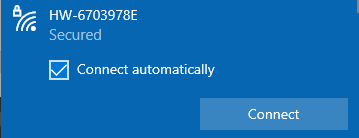

(2) Establish a VNC connection with the TurboPi.

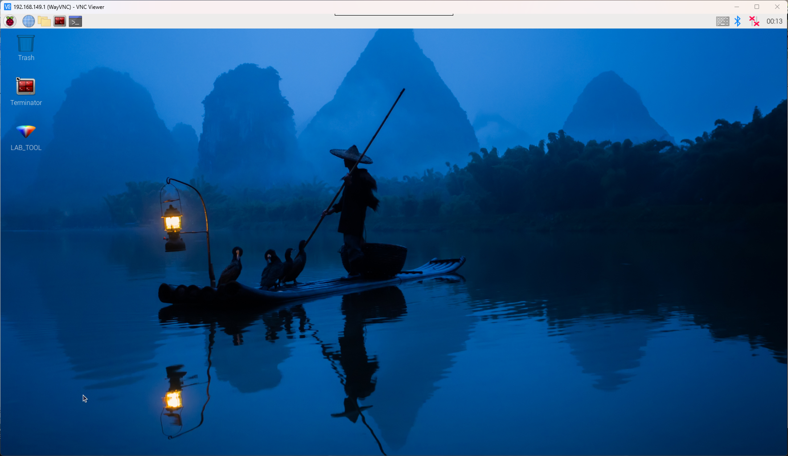

(3) Click the icon  in the top-left corner of the desktop, or press **Ctrl + Alt + T t**o open the terminal.


(4) In the terminal, enter the command "**cd hiwonder-toolbox**" and press Enter to navigate to the Wi-Fi configuration directory.

```
cd hiwonder-toolbox
```

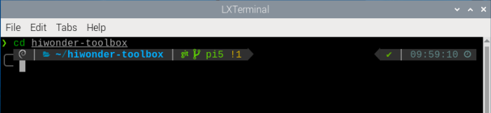

(5) Next, open the Wi-Fi configuration file using the command

```
sudo vim wifi_conf.py
```

(6) The interface is shown as below:

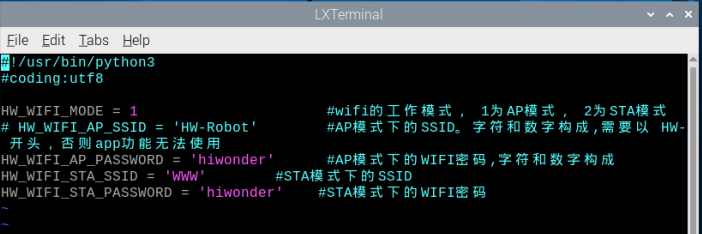

(7) Enter :set number and press Enter to show line numbers, you can set as needed.

```
:set number
```

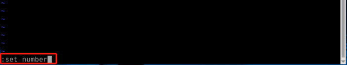

(8) Press the **"i"** key on your keyboard, and you will see **"--INSERT--"** at the bottom left of the screen, indicating that the file is now editable. You can now modify the file according to your needs, referring to the corresponding comments.

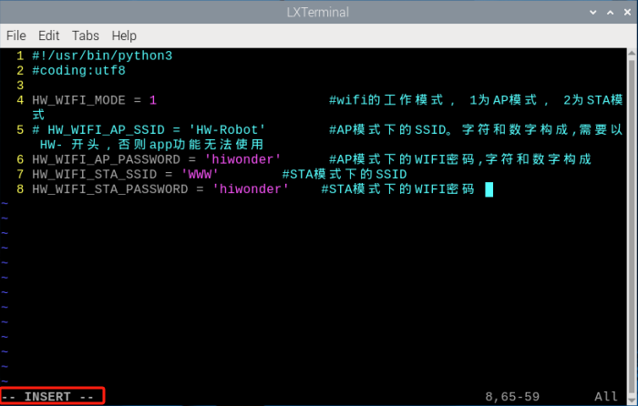

(9) Suppose you want to change the Wi-Fi name of the Raspberry Pi to **"HW-TurboPi"** and the password to **"123456789"**, then you only need to modify the program as shown in the figure below.

:::{Note}

You can set the Wi-Fi name and password according to your needs, but the following rules must be followed:

① The set Wi-Fi name cannot be the same as any existing router name and must start with "**HW**".

② The password must be at least 8 characters.

:::

To restore the original settings, simply reverse the above operations.

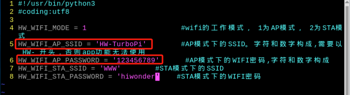

(10) After completing the modifications, press the "**ESC**" key on your keyboard, then enter :wq to save and exit the file.

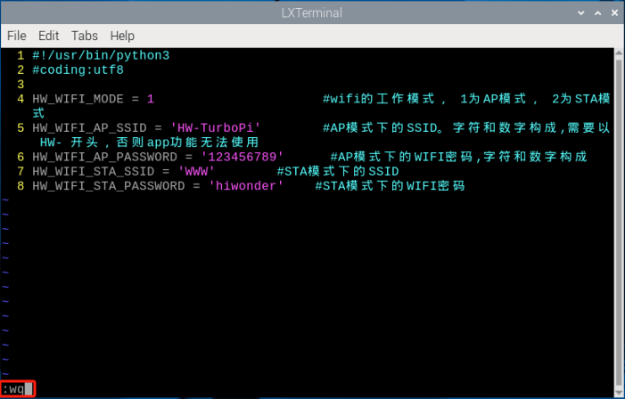

(11) Enter the command **"sudo systemctl restart hw_wifi.service"** in the terminal, and the VNC will automatically disconnect and restart.

```
sudo systemctl restart hw_wifi.service
```

(12) Wait for the device to reboot and connect to the **"HW-TurboPi"** network, with the password **"123456789".**

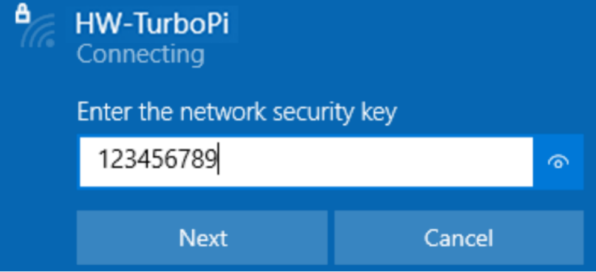

(13) Once connected successfully, wait for the VNC interface to refresh.

(14) After successful connection, the VNC remote desktop will display the desktop as shown in the figure below.


## 7.2 Modify Network Connection Mode

This section uses TurboPi as an example, and the same content applies to other products.

The previous lessons introduce how to connect the robot using LAN mode via the app on the phone. This section will explain in detail how to switch to LAN mode by modifying the Wi-Fi configuration file.

:::{Note}

After modification, if you want to switch back to direct connection mode, simply reverse the steps described below.

:::

(1) Power on the robot and connect your computer to the hotspot generated by the robot, usually starts with **"HW".**


(2) Establish a VNC connection with the robot.

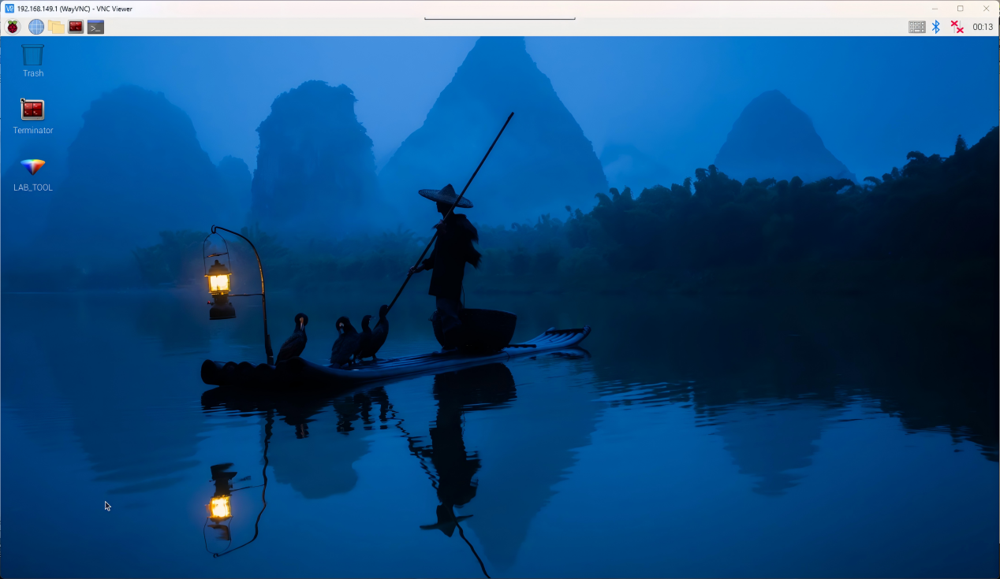

(3) Click the icon  in the top-left corner of the desktop, or press Ctrl + Alt + T to open the terminal.


(4) In the terminal, enter the command **"cd hiwonder-toolbox"** and press Enter to navigate to the Wi-Fi configuration directory.

```
cd hiwonder-toolbox
```


(5) Next, open the Wi-Fi configuration file using the command：

```
vim wifi_conf.py
```

(6) The interface is shown as below:

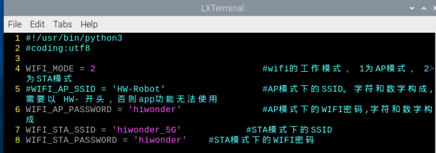

(7) Enter **":set number"** and press Enter to show line numbers, you can set as needed.

```
:set number
```

(8) Press the **"i"** key on your keyboard, and you will see **"--INSERT--"** at the bottom left of the screen.

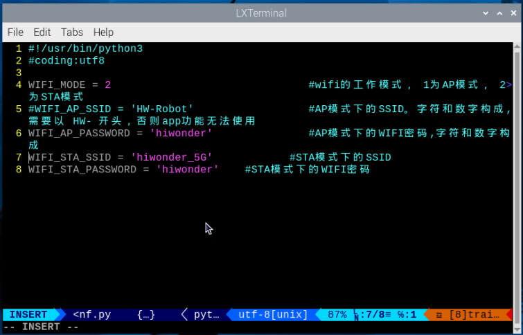

(9) Change the mode to STA (LAN) mode. Modify the program as shown in the example below.

:::{Note}

The following uses connection to the "**Hiwonder**" network as an example. You can modify it based on your need. To revert to the original configuration, change HW-WIFI-MODE = 2 back to 1 to switch the Wi-Fi mode to AP mode.

:::

**Avoid using campus networks or Wi-Fi names that contain Chinese characters.**

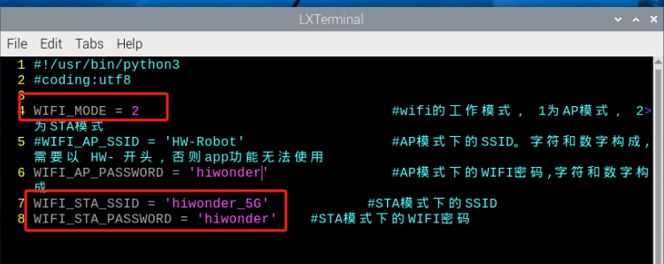

(10) After completing the modifications, press the **"ESC"** key on your keyboard, then enter :wq to save and exit the file.

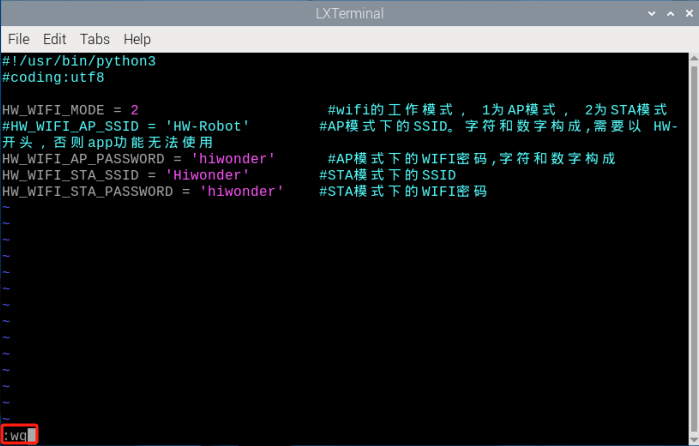

(11) Enter the command **"sudo systemctl restart wifi.service"** in the terminal, and the VNC will automatically disconnect and restart. If the robot's LED2 remains steadily on, it indicates the mode has been successfully changed to LAN.

```
sudo systemctl restart wifi.service
```

(12) To check the Raspberry Pi's IP address using the mobile app, first connect your phone to the same LAN, **"Hiwonder"** in this case.

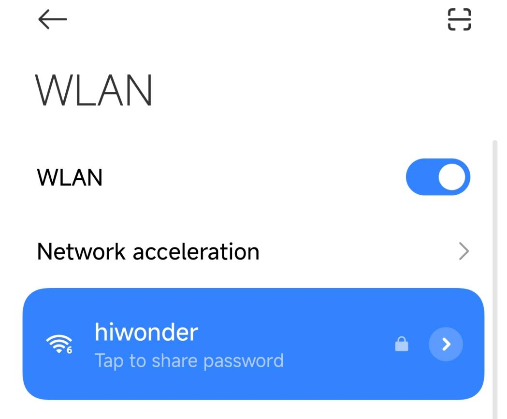

(13) Open the WonderPi app and select **"Standard" \> "TurboPi"**.

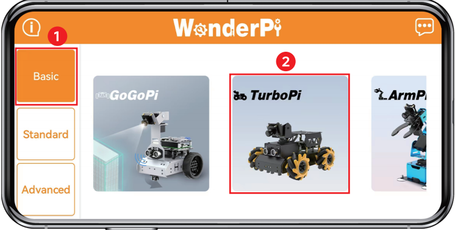

(14) Once the app connects to TurboPi, you'll see an icon like the one below indicating a successful connection.

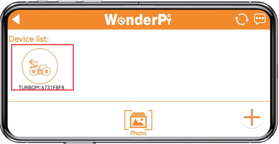

(15) Long-press the corresponding icon of your robot in the app to view its assigned IP address and Device ID.

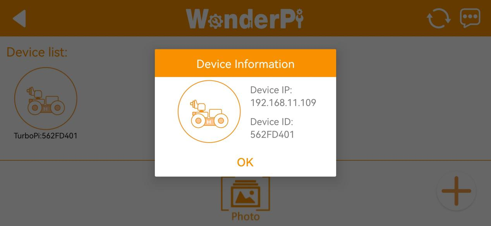

(16) Open the VNC software, enter the IP 192.168.11.109 to connect.  

(17) After a successful connection, the VNC remote desktop will display as shown below.

