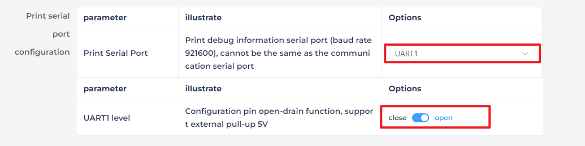

# 8. Large AI Model Courses

## 8.1 Introduction and Installation of Voice Module

### 8.1.1 Introduction to WonderEcho Pro

* **Overview**

WonderEcho Pro, also known as the AI Voice Interaction Box, is equipped with a high-performance noise-canceling microphone and a high-fidelity speaker. It uses a USB-to-audio module that is plug-and-play and requires no driver installation, and supports both playback and recording across multiple operating systems.

By integrating various voice processing modules, WonderEcho Pro uses advanced noise suppression algorithms to effectively filter background noise. It supports the entire voice interaction process—from wake word detection to speech recognition and response. Thanks to its modular design, each component can be independently developed and tested, such as wake word detection, voice activity detection, speech recognition, and synthesis.

* **Key Features & Specifications**

(1) Built-in microphone and speaker interface, supporting both audio input and output

(2) Plug-and-play functionality with driver-free operation. Compatible with multiple operating systems: Windows, macOS, Linux, Android

(3) USB 2.0 standard interface

(4) Control interface: USB

(5) Voice processing chip: CL1302

(6) Speaker output: 3.0W per channel (4Ω BTL)

(7) Power supply: 5V DC

* **Recording and Playback Test**

Here’s how to test recording and playback using a Raspberry Pi 5. The same steps also apply to compatible devices like the robots with Jetson controller.

(1) Connection Setup & Detection


If you're using a Raspberry Pi as the controller, you can use a remote desktop tool to access the Raspberry Pi desktop, such as VNC, see 1.5 Remote Desktop Installation and Connection. Check the top-right corner of the screen for microphone and speaker icons. If these icons are present, the device has been successfully connected.


If you're using a Jetson device, you can connect via NoMachine and check the top-right corner of the desktop for a speaker icon to confirm the audio output is recognized.


(2) Recording Test

① Open a terminal window. Run the following command to list available recording devices and find the card number 0. Note: -l is a lowercase "L". This number may vary by device, so use the actual number listed.

```
arecord -l
```


② Start recording with the following command, replacing 0 in red with the correct card number:

```
arecord -D hw:0,0 -f S16_LE -r 16000 -c 2 test.wav
```

③ This will create a test.wav file in the current directory.


④ You can try to speak into the microphone for around 5 seconds, then press Ctrl + C to stop recording.

(3) Playback Test

① In the same terminal, run the command below to check if the test.wav file exists:

```
ls
```


② If you see test.wav in the list, the recording was successful. Play the audio using the command:

```
aplay test.wav
```

### 8.1.2 WonderEchoPro Installation

:::{Note}

When installing the WonderEcho Pro, ensure that the front of the robot is facing forward, and the USB port of the WonderEcho Pro is facing to the right, which is opposite to the direction of the Raspberry Pi's USB ports.

:::


**Connect the WonderEcho Pro as shown in the diagram above, aligning the ports accordingly.**

### 8.1.3 Firmware Flashing

In this lesson, we will learn how to flash firmware onto the WonderEcho Pro.

* **Flashing the Firmware**

(1) Begin by connecting the WonderEcho Pro to your computer using a Type-C data cable.


(2) Open the file [ACK_UPDATE_TOOL.exe]() located in “[8.1.5 Appendix->Firmware Flashing Tool](). Select the **"CI1302"** chip and click **"Firmware Upgrade."**


**For this example, we will use the “hello hiwonder firmware” (Wake word: "hello hiwonder").**

(3) Select the firmware by locating the “hello hiwonder firmware (Wake word: hello hiwonder).bin” file under the “10.1.5 Appendix” path.


(4) Identify the correct COM port and select it.


(5) Press the RST button on the WonderEcho Pro to initiate the flashing process. Wait for the process to complete successfully.


* **Testing the Wake Word**

After flashing the firmware, follow the steps in “[10.1.5 Appendix->5.6 Serial Port Debugging Tool]() to install the serial port debugging tool. Then, follow the steps below to test whether the firmware is functioning correctly.

(1) Connect the WonderEcho Pro to your computer’s USB port using a Type-C to USB adapter.


(2) Open the Serial Port Utility, select the connected COM port (including CH340), and set the baud rate to 115200, as shown in the image below.


(3) Say the wake word **"hello hiwonder"** as configured in the firmware settings. The corresponding flag information **“AA 55 03 00 FB”** will appear on the right side, confirming that the wake word was successfully recognized.


### 8.1.4 Firmware Creation

In this lesson, we will learn how to create firmware for WonderEcho Pro.

* **Wake Word Firmware Creation**

We will use the wake word **“HELLO-HIWONDER”** as an example to demonstrate firmware creation. The process is also applicable for creating firmware with Chinese wake words. 

:::{Note}

For English wake words to be effective, they must be in uppercase.

:::

(1) First, open the ChipIntelli Voice AI Platform using the following link: https://aiplatform.chipintelli.com/home/index.html

(2) Click the **“Platform Features”** tab in the menu bar, then navigate to **“In-depth development of Product Firmware & SDK”** under the Product Development section.


(3) The system will prompt you to log in. If you do not have an account yet, please complete the registration first. For international users, we provide a shared account:**Username: 18033085495Password: hiwonder)**  

Once logged in, click **“In-depth development of Product Firmware & SDK”** again.


(4) When the page redirects, click the option  on the left panel to create a new product as shown in the image below. Product name and description can be customized. Other fields must be selected according to the red boxes in the example. Product type needs to select Select General -&gt; Smart Control Hub, then click **“Create”** to complete.


(5) Next, fill in the basic project information. Since we want to recognize English, set Language Type to English. Follow the image below for other required selections. Once completed, click “Continue”. If recognizing Chinese, simply set Speech Type and Acoustic Model to Chinese.


(6) Once you've entered the firmware configuration interface, we will focus on the steps for modifying key parameters. First, in the Algorithm Parameters section, enable the Echo Cancellation feature.


(7) In the Hardware Parameters section, set the Crystal Oscillator Source to Internal RC and disable Baud Rate Calibration.


(8) In the UART Print Settings, configure UART1 to Open-Drain Mode, supporting external 5V pull-up.



(9) For Communication UART Settings, set the Baud Rate to 115200 and configure UART0 to Open-Drain Mode, also supporting external 5V pull-up. After adjusting these settings, click Continue to move forward.


(10) The next step involves configuring the command words. You will need to choose a voice output for the wake-up command. For this example, select **“Dane – English Male Voice”** as the output voice. If you're using Chinese as the language, you may choose the voice option **“Chengcheng – Standard Boy Ver.1”**. The selection between Chinese and English voices is determined by the language settings configured in Step 5.


(11) Next, upload the command word configuration file. Navigate to the spreadsheet titled Command Phrase and Playback Protocol List V3 – English Template. Simply drag and drop the file into the upload area on the webpage.

:::{Note}

If you wish to change the wake word, open the spreadsheet and replace the default wake word HELLO-HIWONDER with your preferred word. Keep in mind that the English version of the firmware only supports English wake words, and mixed-language wake words are not allowed. Additionally, English wake words must be written in uppercase letters to function properly.

:::


(12) After uploading the file, you will see the command data populated in the table below.


(13) Click **“Submit”** and wait a few minutes for the firmware generation process to complete. Once finished, click **“Download”** to obtain your customized firmware.


### 8.1.5 Appendix

* Firmware Flashing Tool：[Firmware Flashing Tool.zip]()
* Serial Port Debugging Tool : [ch341ser.exe & serial_port_utility_603_0103.exe]()
* [（hello hiwonder）Command Phrase and Playback Protocol List V3 – English Template.xlsx]()
* [（小幻小幻）Command Phrase and Playback Protocol List V3 –Chinese Template.xlsx]()
* [hello hiwonder firmware (Wake word hello hiwonder).bin]()
* [turbopi Firmware（Wakeword：turbopi）.bin]()
* [小幻小幻 Firmware（Wakeword：小幻小幻）.bin]()

## 8.2 Large Models Basic Courses

### 8.2.1 Large Language Model Courses

* **Overview of Large Language Model**

A Large Language Model (LLM) is an advanced artificial intelligence model developed to comprehend and generate human language.


(1) Basic Concept

A Large Language Model (LLM) is a deep learning model trained on extensive text data, designed to either generate natural language text or comprehend the meaning of language. LLM is capable of performing various natural language tasks, such as text classification, question answering, and dialogue, making them a crucial step toward achieving advanced artificial intelligence. Unlike smaller models, LLM leverages a similar Transformer architecture and pretraining objectives (like Language Modeling), but are distinguished by their larger model size, greater training data, and enhanced computational resources.

(2) Features

**Massive Scale:** LLM are characterized by their vast parameter sizes, often reaching billions or even trillions of parameters. This immense scale allows them to capture a wealth of linguistic knowledge and complex syntactic structures.

**Pretraining and Fine-tuning:** LLM utilize a two-stage learning process: pretraining and fine-tuning. Initially, they are pretrained on large-scale, unlabeled text data, learning general language representations and knowledge. Subsequently, they are fine-tuned using labeled data to specialize in specific tasks, allowing them to excel across a wide range of NLP applications.

**Contextual Awareness:** LLM demonstrate exceptional contextual awareness, with their ability to understand and generate language deeply dependent on preceding text. This enables them to perform exceptionally well in tasks like dialogue, article generation, and contextual comprehension.

**Multilingual Capabilities:** LLM support multiple languages, extending beyond just English. This multilingual proficiency enables them to power cross-lingual and cross-cultural applications, enhancing their versatility and global reach.

**Multimodal Support:** Some LLMs have expanded to handle multimodal data, including text, images, and speech. This capability allows them to understand and generate content across various media types, opening up more diverse application possibilities.

**Emergent Properties:** LLM exhibit remarkable emergent properties, where performance improvements become apparent in large models but are absent in smaller ones. This makes them adept at handling more complex tasks and challenges.

**Cross-domain Applications:** LLM have been widely adopted across numerous fields, including text generation, machine translation, information retrieval, summarization, chatbots, and virtual assistants. Their influence is profound, impacting both daily life and work in significant ways.

**Ethical and Risk Considerations:** While LLM showcase impressive capabilities, they also raise important ethical and risk-related concerns, such as the potential generation of harmful content, privacy violations, and cognitive biases. As such, the development and deployment of LLM must be approached with careful consideration and caution.

(3) Working Principle

Large Language Model (LLM) are built on deep learning principles and are trained using massive datasets and substantial computational resources to develop neural networks with billions of parameters. Through iterative training and parameter optimization, these models learn to perform a wide range of tasks with high accuracy. The "**large**" in LLM reflects their immense scale—encompassing a vast number of parameters, extensive training data, and significant computational demands. This scale enables advanced models to achieve superior generalization capabilities and deliver increasingly accurate results, even in highly specialized domains.

Today, some of the most popular applications revolve around generative AI, such as language generation tools (e.g., ChatGPT) and image generation platforms (e.g., Midjourney). At the core of these applications is the concept of generation—the model's ability to predict and produce coherent content based on a given input.

(4) Application Scenarios

① Text Generation

Large Language Models are capable of generating diverse types of text, including news articles, stories, poems, and more. These capabilities make them well-suited for applications in content creation, creative writing, and automated storytelling.

② Text Classification

Large Language Models can classify text into various categories, such as sentiment analysis and topic identification. These capabilities are especially valuable in scenarios like public opinion analysis, information retrieval, and content moderation.

③  Machine Translation

Large Language Models excel at machine translation, enabling the conversion of text from one language to another. These capabilities are essential for cross-language communication, localization, and global collaboration.

④ Question-Answering Systems

Large Language Models can be used to build question-answering systems that respond to user queries. These applications are particularly valuable in areas such as intelligent customer support, knowledge retrieval, and information lookup.

<p id="anchor_19_1_1_2"></p>

* **Large Language Model Deployment**

:::{Note}

This section outlines the steps to register on the official OpenAI website and obtain the API key for the Large Language Model.

:::

(1) OpenAI Account Registration and Setup

① Copy the following URL: <https://platform.openai.com/docs/overvie>

Open the OpenAI website and click on the "**Sign Up**" button in the top right corner.


② Follow the prompts to register and log in using your Google, Microsoft, or Apple account.


③ Click on the settings icon, then select Billing, followed by Payment Methods, to link your payment method. Recharge your account to purchase tokens.


④ After completing the setup, click on API Keys, then select Create New Secret Key. Follow the prompts to fill in the required information. Once the key is created, make sure to save it for future use.


⑤ With these steps, the large model has been successfully created and deployed. You can now use the API in the upcoming lessons.

(2) OpenRouter Account Registration and Setup

① Copy the following URL: https://openrouter.ai/

Open the webpage in your browser and click "**Sign In**". Register using your Google account or another available login option.


② After logging in, click the icon in the top-right corner and select **"Credits"** to link your payment method.


③ To create an API key, go to **"API Keys"**, then click **"Create Key"**. Follow the prompts to complete the process. Once the key is generated, make sure to save it for future use.


④ At this point, the large model is successfully created and deployed. You can now use the API in the upcoming lessons.

<p id="anchor_19_1_1_3"></p>

* **Large Language Model Accessing**

:::{Note}

To proceed with this section, you will need to register on the appropriate website and obtain the API key for the large model (please refer to the file ["**8.2.1 Large Language Model Courses -> Large Language Model Deployment**"](#anchor_8.2.1_2)).

:::

It is important to ensure a stable network connection for the development board. For optimal performance, we also recommend connecting the main controller to a wired network for enhanced stability.


(1) Environment Configuration

:::{Note}

If you have purchased a robot from our company with built-in large model functionality, the environment is already pre-configured in the robot's image. You can directly proceed to Section 3 of this document to configure the API key.

:::

Install Vim and Gedit by running the corresponding commands. Install the necessary software packages and audio libraries required for PyAudio.

```
sudo apt update
```

```
sudo apt install vim
```

```
sudo apt install gedit
```

```
sudo apt install python3 python3-pip python3-all-dev python3-pyaudio portaudio19-dev libsndfile1
```


(2) Importing the Large Model Program Directory

① In this section, locate the '[Appendix -> Source Code](https://docs.hiwonder.com/projects/JetArm/en/latest/docs/resources_download.html)' folder within the same directory as this tutorial document.


② Using the MobaXterm remote connection tool (as outlined in the '5.5 Remote Access and File Transfer' tutorial), drag the folder into the root directory of the main controller. The software installation package can be found in the '[Appendix -\> Remote Access and File Transfer](https://docs.hiwonder.com/projects/JetArm/en/latest/docs/resources_download.html)' directory.


③ Next, execute the command to navigate to the **'speech_pkg' directory**.

```
cd ~/large_models/speech_pkg/
```

④ Execute the following commands to install the necessary third-party libraries.

```
pip3 install -r requirements.txt --break-system-packages
```

```
pip3 install dashscope --break-system-packages
```

```
pip3 install opencv-python --break-system-packages
```

```
pip3 install sympy==1.13.1 --break-system-packages
```

```
pip3 install torch --break-system-packages
```

⑤ Then, use the command in the terminal to navigate to the **'speech'** directory.

```
cd ~/large_models/speech_pkg/speech
```

⑥ Run the command to list the files in the **'speech'** directory.

```
ls
```


⑦ Depending on the type of main controller and Python version you're using, switch to the appropriate folder for packaging and distribution. This tutorial uses the Jetson Orin controller as an example.

| **Type of main controller** | **Python version** |
| --------------------------- | ------------------ |
| jetson_nano                 | 3.6                |
| jetson_orin                 | 3.10               |
| rpi5                        | 3.11               |
| rpi5_docker                 | 3.8                |

⑧ Execute the following command to navigate to the Jetson Orin folder.

```
cd jetson_orin/
```

⑨ Enter the command to copy the 'speech.so' file to the parent directory.

```
cp -r speech.so ..
```

⑩ Enter the command to navigate to the parent directory.

```
cd ../..
```

⑪ Execute the command to package the speech file for the Python environment.

```
pip3 install .
```

⑫ Enter the command to install and update the OpenAI Python library.

```
pip3 install openai -U
```

(3) Key Configuration

① Open the terminal and enter the following command to navigate to the directory for configuring the large model keys:

```
cd ~/large_models
```

② Then, open the configuration file by running:

```
vim config.py
```

③ Once the file is open, configure the OpenAI and OpenRouter keys by filling in the llm_api_key and vllm_api_key parameters, respectively (you can obtain these keys from the '[8.2.1 Large Language Model Courses -> Large Language Model Deployment](#anchor_8.2.1_2)' course).


For instance, copy the key created in Section 1.2 of this chapter and paste it into the appropriate field. To paste the key, place the cursor between the quotation marks, hold the **"Shift"** key, right-click, and select **"Paste"** .

:::{Note}

Do not mix keys from different models, as this may cause the functionality to malfunction

:::


④  After pasting, press the **'Esc'** key, then type the following command and press Enter to save the file:

```
:wq
```

(4) Running the Demo Program

Once the keys are configured, you can run the demo program (openai_llm_demo.py) to experience the text generation capabilities of the large model. For example, the program's prompt might be: 'Write a 50-word article about how technology is changing life.'


① To run the demo, enter the following command in the terminal:

```
python3 openai_llm_demo.py
```

② After running the program, the output will appear as shown in the image below.


* **Semantic Understanding with Large Language Model**

Before starting this section, make sure you have completed the API key configuration outlined in the file [8.2.1 Large Language Model Courses -\> Large Language Model Accessing](#anchor_8.2.1_3).

In this lesson, we'll use a large language model to analyze and summarize short passages of text.

(1) Start by opening a new terminal window, then navigate to the large model project directory:

```
cd large_models/
```

(2) Next, run the demo program with the following command:

```
python3 openai_llm_nlu_demo.py
```

(3) As shown in the output, the model demonstrates strong summarization abilities.


(4) The result matches the prompt defined in the program — where a passage of text is provided to the model, and it generates a concise summary.


* **Emotional Perception with Large Language Model**

To proceed with this section, ensure that you have completed the API key configuration as described in the file [8.2.1 Language Model Courses -> Large Language Model Accessing](#anchor_8.2.1_3).

In this lesson, we will use a large language model to assess its ability to perceive emotions based on descriptive words. We'll provide the model with emotional expressions and evaluate its response.

(1) Start by opening a new terminal window, then navigate to the large model project directory:

```
cd large_models/
```

(2) Next, run the demo program with the following command:

```
python3 openai_llm_er_demo.py
```

(3) From the output, you will see that the model successfully identifies and understands the emotions conveyed, providing a text-based response accordingly.


(4) In this program, we send two emotional expressions to the model: the first is an expression of sadness, **"So Sad"**. After the model responds, we then send an expression of happiness, "**Ha Ha**", and observe how the model reacts.


### 8.2.2 Large Speech Model Courses

* **Overview of Large Speech Model**

(1) What is a Large Speech Model?

A Speech Large Model (LSM) refers to a machine learning model that uses deep learning techniques to process and understand speech data. These models can be applied in a variety of tasks, such as speech recognition, speech synthesis, speech translation, and emotional analysis of speech. The design and training of these models typically require large amounts of speech data and substantial computational resources, which is why they are referred to as "**large models**".

(2) Why Do We Need Large Speech Model?

With the advancement of artificial intelligence and deep learning, traditional speech processing methods face many limitations. Large models leverage vast amounts of data and deep neural networks to learn and understand the complex features within speech, thereby improving the accuracy and naturalness of speech recognition and generation.

Their advantages include:

① High Accuracy: They maintain a high recognition rate even in noisy environments and with various accents.

② Naturalness: Speech generated by synthesis models is more natural, closely resembling human speech.

③ Versatility: These models support a wide range of languages and tasks, such as multilingual speech recognition, speech-to-text (STT), text-to-speech (TTS), and emotion recognition.

(3) Development of Speech Recognition Technology

Word-Level Speech Recognition: At this stage, speech recognition systems could only recognize individual words

Phrase-Level Speech Recognition: With the expansion of data and advancements in algorithms, speech recognition systems gradually gained the ability to recognize longer phrases, such as "**Please turn on my computer**".

Sentence-Level Speech Recognition: In recent years, with the emergence of AI large models, speech recognition systems have become capable of recognizing entire sentences and understanding their underlying meaning.

(4) Differences Between Large Speech Model and Traditional Speech Processing Technologies

① Processing Methods

Traditional Speech Processing Technologies: These typically rely on manual feature extraction and shallow models, such as Gaussian Mixture Models (GMM) and Hidden Markov Models (HMM), to process speech signals.

Large Speech Model: These use end-to-end learning, directly mapping raw speech waveforms to target outputs (such as text or another speech signal), reducing the reliance on manual feature extraction. They are typically based on deep learning architectures, such as Convolutional Neural Networks (CNN), Recurrent Neural Networks (RNN), and Transformers.

② Model Complexity

Traditional Speech Processing Technologies: These models are relatively simple, with fewer parameters.

Large Speech Model: These models have complex structures and a large number of parameters, enabling them to capture more subtle speech features and contextual information.

③ Recognition Capability

Traditional Speech Processing Technologies: These are highly adaptable to specific scenarios and conditions, but their recognition capability is limited when encountering new, unseen data.

Large Speech Model: Due to their large number of parameters and powerful learning ability, they offer superior recognition capabilities and can adapt to a wider variety of speech data and environments.

④Training Data Requirements

Traditional Speech Processing Technologies: These typically require less data for training, but the data must be highly annotated and of high quality.

Large Speech Model: These require vast amounts of training data to fully learn the complexities of speech, often necessitating large quantities of annotated data or the use of unsupervised/self-supervised learning methods.

(5) Core Technologies of Speech Large Model

① Automatic Speech Recognition (ASR)

ASR is the technology that converts human speech into text. The core steps of a speech recognition system include feature extraction, acoustic modeling, and language modeling.

② Text-to-Speech (TTS)

TTS is the technology that converts text into speech. Common speech synthesis models include the Tacotron series, FastSpeech, and VITS.

③ Speech Enhancement and Noise Reduction

Speech enhancement techniques are used to improve the quality of speech signals, typically for eliminating background noise and echoes. This is crucial for speech recognition applications in noisy environments.

(6) Applications of Speech Large Model

Intelligent Voice Assistants: For instance, Amazon Alexa and Google Home, which engage with users through voice interactions.

Customer Service Chatbots: In the customer service sector, speech large models assist businesses in enhancing service efficiency by swiftly processing customer inquiries through speech recognition technology, enabling 24/7 support.

Healthcare: Helping doctors with medical record-keeping, thus improving work efficiency.

Speech-to-Text: Speech large models excel in converting speech to text, offering accurate recognition and transcription in a variety of contexts. They are widely used in applications such as meeting transcription and subtitle generation.

* **Voice Device Introduction and Testing**

(1) Device Overview

① 6-Microphone Circular Array

Introduction：

The 6-Microphone Circular Array is a high-sensitivity, high signal-to-noise ratio microphone board. It features six analog silicon microphones arranged in a circular pattern. When paired with a main control board, it supports high-performance Acoustic Echo Cancellation (AEC), environmental noise reduction, and factory-level voice pickup from up to 10 meters.


Features and Specifications：

**Operating Voltage:** 3.3V (typical)

**Operating Current:** 0.8mA (typical)

**Operating Temperature:** -20°C (min), 25°C (typical), 70°C (max)

**Operating Humidity:** Up to 95% relative humidity (max)

(1) Recording and Playback Test

The following demonstration uses the Raspberry Pi 5 as an example. The connection and testing steps are also applicable to other compatible devices such as the Jetson series:

① Connection Illustration and Detection


If the main controller is a Raspberry Pi, you can use VNC remote desktop access (refer to the appendix: Remote Access and File Transfer) to log into the Raspberry Pi system. Once connected, check the upper right corner of the desktop for microphone and speaker icons. As shown in the image below, the presence of these icons indicates a successful connection.


If you're using a NVIDIA Jetson device, you can connect via the NoMachine remote access tool. After logging in, check the upper right corner of the system interface for the speaker icon to confirm successful detection.


② Recording Test

Next, open a new terminal window and enter the following command to check the available recording devices. Note that the -l option is a lowercase "**L**". You should see the card number (card) listed—for example, card 0. This is just an example; please refer to your actual query result.

```
arecord -l
```


Then, use the following command to start recording. Replace the red-marked card number (hw:0,0) with the actual number you found in the previous step:

```
arecord -D hw:0,0 -f S16_LE -r 16000 -c 2 test.wav
```

This will create a test.wav audio file in the current directory.

You can record a short 5-second sample, then press Ctrl + C to stop the recording.

③ Playback Test

After the recording is complete, you can check whether the audio file was successfully created by listing the contents of the current directory:

```
ls
```


If test.wav appears in the list, the recording was successful. To play back the recording, use the following command:

```
aplay test.wav
```

* **Voice Wake-Up**

In this lesson, we'll learn how to use a large speech model to activate the voice device by speaking a predefined wake word through a program.

(1) WonderEcho Pro Wake-Up

Device Check：

To proceed, we need to identify the USB device name assigned to the connected WonderEcho Pro or Circular Microphone Array (hereafter referred to as the voice device). Please follow the steps below carefully. 

:::{Note}

Do not connect any other USB devices during this process to avoid confusion.

:::

① First, disconnect the voice device, then open a terminal and run the following command:

```
ll /dev | grep USB
```

② Next, reconnect the voice device to the USB port on your main board and run the same command again:

```
ll /dev | grep USB
```

③ You should now see a newly listed USB port, such as ttyCH341USB1.  

Please take note of this device name—it may vary depending on the main controller being used.


Wake-Up Test：

① To begin, update the port number used in the program by editing the script. You'll also need to uncomment the line for the port you're using and comment out any unused ports.

```
vim wakeup_demo.py
```

Press i to enter edit mode and make the necessary changes as shown below (update the port number accordingly and adjust comments as needed).


Once the changes are complete, press ESC, then type :wq and press Enter to save and exit the editor.

② Next, return to the system interface and run the wake-up demo using the command below. Speak the wake word **"HELLO HIWONDER"** clearly toward the WonderEcho Pro voice device.  

If the output includes **"keyword detect"**, it indicates that the firmware has been successfully flashed and the wake word is functioning correctly.

```
python3 ~/large_models/wakeup_demo.py
```


(2) 6-Microphone Circular Array

As with the WonderEcho Pro, you can connect the 6-Microphone Circular Array to your main board (Raspberry Pi or NVIDIA Jetson) using a Type-C to USB cable.

Device Check:

For Jetson users, connect to the Jetson system using the NoMachine remote access tool. Once connected, check the desktop interface.  

If the 6-Microphone Circular Array icon appears on the left side of the desktop, it indicates the device has been successfully recognized.

Wake-Up Test:

① Open a new terminal window and run the following command to edit the wakeup_demo.py script:

```
vim ~/large_models/wakeup_demo.py
```

② Press i to enter edit mode.

③ Update the port to match the device port number you previously identified. Comment out the WonderEcho Pro configuration (add \# at the beginning of the corresponding line), and uncomment the line using the circular microphone array on line 11 as the input device (see red box in the referenced image).


④ Press ESC to return to command mode, then type :wq and press Enter to save and exit.


⑤ In the terminal, run the wake-up program with the following command:

```
python3 ~/large_models/wakeup_demo.py
```

⑥ After about 30 seconds of initialization, speak the wake word **"hello hiwonder"** to test the device.


(3) Brief Program Overview

This is a Python-based wake word detection script that utilizes the speech module to process audio input and detect a specific wake word (e.g., "**HELLO_HIWONDER**").

Source Code Path: [/home/ubuntu/large_models/wakeup_demo.py](../_static/source_code/19/wakeup_demo.zip)

Importing Required Modules

{lineno-start=5}

```
import os
import time
from speech import awake
```

`os`: Used for handling file paths and executing system-level commands.

`time`: Provides delay functions to prevent overly frequent detection attempts.

`speech`: The core module responsible for processing audio input and detecting the wake word.

Initializing the wonderecho Class

{lineno-start=9}

```
port = '/dev/ttyUSB0'
kws = awake.WonderEchoPro(port)
```

Attempts to Turn Off the Cooling Fan on Raspberry Pi 5

{lineno-start=13}

```
try:  # If a fan is present, it's recommended to turn it off before detection to reduce interference(如果有风扇，检测前推荐关掉减少干扰)
    os.system('pinctrl FAN_PWM op dh')
except:
    pass
```

Purpose: Attempts to turn off the cooling fan by executing the system command `pinctrl FAN_PWM op dh`. This helps minimize background noise from the fan that could interfere with wake word detection.

Error Handling: If the command fails (e.g., due to unsupported hardware), the program catches the exception and continues running without interruption.

Main Wake Word Detection Loop

{lineno-start=18}

```
kws.start() # Start detection(开始检测)
print('start...')
```

The program starts the wake word detection thread using kws.start().

It prints start... to indicate that detection has been successfully initiated.

Main Program Logic

{lineno-start=20}

```
while True:
    try:
        if kws.wakeup(): # Wake-up detected(检测到唤醒)
            print('hello hiwonder')
        time.sleep(0.02)
    except KeyboardInterrupt:
        kws.exit() # Cancel processing (关闭处理)
        try:
            os.system('pinctrl FAN_PWM a0')
        except:
            pass
        break
```

During each iteration, the program checks whether the wake word has been detected. If the wake word is detected, it prints keyword detected.

The detection frequency is controlled using time.sleep(0.02) to prevent excessive CPU usage.

Pressing Ctrl+C triggers a KeyboardInterrupt, which gracefully exits the detection loop.

Upon exit, the program calls kws.exit() to stop the wake word detection process.

The fan is then restored to its original state (if applicable).

(4) Extended Functionality

Modifying the Wake-Up Response Text

In this section, you'll learn how to change the message that appears after a successful wake word detection.

① For example, if the wake word "**HELLO_HIWONDER**" is detected, and you'd like the program to print "**hello**" instead of the default message, follow the steps below. Navigate to the large_models directory and open the script with:

```
vim wakeup_demo.py
```

② Press i to enter INSERT mode (you'll see -- INSERT -- at the bottom of the screen). Locate the line '**print('hello hiwonder')**', and modify it to 'print('hello')'

```
i
```


③ Press ESC, then type **:wq** and press Enter to save and exit.

```
:wq
```

④ Finally, run the program with:

```
python3 wakeup_demo.py
```


(5) Creating Custom Firmware for WonderEchoPro

If you'd like to create more advanced or customized wake words and voice commands, please refer to the document titled:  

"[**Appendix →  Firmware Flashing Tool → Creating Firmware for WonderEchoPro**](https://docs.hiwonder.com/projects/JetArm/en/latest/docs/resources_download.html)".

* **Speech Recognition**

(1) What is Speech Recognition?

Speech Recognition (Speech-to-Text, STT) is a technology that converts human speech signals into text or executable commands. In this course, we will implement speech recognition functionality using Alibaba OpenAI's Speech Recognition API.

(2) How It Works

The wave library is used to extract audio data. The extracted audio is then sent to OpenAI's ASR (Automatic Speech Recognition) model. The recognized text returned by the ASR model is stored in speech_result for use in subsequent processes.

(3) Preparation Before the Experiment

Before proceeding, refer to the course "[**8.2.2 Large Speech Model Courses -> Large Language Models Deployment**](#anchor_8.2.1_2)" to obtain your API key, and make sure to add it into the configuration file (config).

(4) Experiment Steps

① Power on the device and connect to it using MobaXterm.  

(For detailed instructions, please refer to [Appendix ->Remote Connection Tools and Instructions](https://docs.hiwonder.com/projects/JetArm/en/latest/docs/resources_download.html).)

② Navigate to the program directory by entering the following command:

```
cd large_models/
```

③ Open the configuration file to input your API Key by entering the command below. Press i to enter INSERT mode and enter your API Key. Once finished, press Esc, type :wq, and hit Enter to save and exit.

```
vim config.py
```


④ Run the speech recognition program with:

```
python3 openai_asr_demo.py
```

(5) Function Realization

After the program starts, the microphone will recognize the recorded audio content from the user and print the converted text output.


(6) Brief Program Analysis

This program implements a speech recognition system by calling OpenAI's Speech-to-Text API to convert audio files into text.

The program source code is located at: [/home/ubuntu/large_models/openai_asr_demo.py](../_static/source_code/19/openai_asr_demo.zip)

① Module Import

{lineno-start=6}

```
from speech import speech
```

The speech module encapsulates ASR (Automatic Speech Recognition) functionalities, such as connecting to an external ASR service.

② Define ASR Class

{lineno-start=11}

```
asr = speech.RealTimeOpenAIASR()
```

asr = speech.RealTimeOpenAIASR()

This line creates a real-time speech recognition object named asr. The RealTimeOpenAIASR class is used to interact with the speech recognition service.

③ Speech Recognition Functionality

{lineno-start=13}

```
asr.update_session(model='whisper-1', language='en', threshold=0.2, prefix_padding_ms=300, silence_duration_ms=800) 
```

An ASR client object is created to prepare for invoking the speech recognition service.

The asr.asr() method is called to send the audio file (wav) to the ASR service for recognition.

The recognized result (typically text) is printed to the console.

(7) Function Extension

You can modify the model name to enable speech recognition in various languages, such as Chinese, English, Japanese, and Korean.

① Enter the following command to edit the script:

```
vim openai_asr_demo.py
```

② Press the i key to enter INSERT mode, and update the model setting. For example, modify it to use the gpt-4o-transcribe model.

```
i
```


③ Then, run the program with the command:

```
python3 openai_asr_demo.py
```

④ Record a sample sentence such as "**Hello, can you hear me clearly?**", and the recognized text will be printed on the console.


* **Speech Synthesis**

(1) What is Speech Synthesis?

Speech synthesis (SS) is a technology that converts written text into intelligible spoken audio. It enables computers to generate natural, human-like speech for communication or information delivery.

In this course, we will run a program that processes text using a large language model and generates corresponding audio.

(2) How It Works

The program first sends the text to the OpenAI TTS (Text-to-Speech) model. The model returns the generated audio data, which is saved as a file named tts_audio.wav for playback or storage.

(3) Preparation Before the Experiment

Refer to the course "[**19.1 Large Models Basic Courses ->8.2.1Large Language Models Courses -> Large Language Models Deployment**](#anchor_8.2.1_2)" to obtain your API key, and update the configuration file accordingly.

(4) Experiment Steps

① Power on the device and connect to it using MobaXterm "(**refer to the [appendix -> Remote Connection Tools and Instructions](https://docs.hiwonder.com/projects/JetArm/en/latest/docs/resources_download.html) for detailed guidance**)".

② Navigate to the program directory by entering the following command:

```
cd large_models/
```

③ Open the configuration file to enter your API Key. After editing, press Esc, type :wq, and hit Enter to save and exit:

```
vim config.py
```


④ Finally, run the program with the following command:

```
python3 openai_tts_demo.py
```

(5) Function Realization

Upon running the program, it will play an audio message saying "**Hello, Can I Help You**", and simultaneously save the audio file with the same content to the following directory:  

[/home/ubuntu/large_models/resources/audio/](../_static/source_code/19/audio.zip)


(6) Brief Program Analysis

This program is a speech synthesis system based on OpenAI's Text-to-Speech (TTS) API, capable of converting text into audio files. It supports input text and outputs audio in formats like PCM, WAV, FLAC, AAC, Opus, and MP3. By specifying the desired text, the program sends the request to the API and returns the synthesized audio, which can be played or saved locally.

The source code for this program is located at:  [/home/ubuntu/large_models/openai_tts_demo.py](../_static/source_code/19/openai_tts_demo.zip)

① Module Import

{lineno-start=5}

```
from config import *
from speech import speech  
```

speech: This module encapsulates the TTS functionalities.

② Definition for TTS Class

{lineno-start=8}

```
tts = speech.RealTimeOpenAITTS()
tts.tts("Hello, Can I help you?") # https://platform.openai.com/docs/guides/text-to-speech
tts.tts("Hello, Can I help you?", model="tts-1", voice="onyx", speed=1.0, instructions='Speak in a cheerful and positive tone.')
tts.save_audio("Hello, Can I help you?", model="gpt-4o-mini-tts", voice="onyx", speed=1.0, instructions='Speak in a cheerful and positive tone.', audio_format='wav', save_path="./resources/audio/tts_audio.wav")
```

`speed`: Specifies the playback speed; the default value is 1.

For intelligent real-time applications, it is recommended to use the gpt-4o-mini-tts model. 

Other available models include tts-1 and tts-1-hd. tts-1 offers lower latency but with slightly reduced quality compared to tts-1-hd.

Voice Options: nova, shimmer, echo, onyx, fable, alloy, ash, sage, coral.

For more details, you can refer to the OpenAI documentation:

https://platform.openai.com/docs/guides/text-to-speech

③ Function Extension

To change the voice, follow these steps:

Step1 : Open the program by entering the command:

```
vim openai_tts_demo.py
```

Step2 : Press i on your keyboard to enter INSERT mode. Locate the line voice="**onyx**" and modify it to voice="**nova**".

```
i
```


Step3 : Press Esc, then type :wq and hit Enter to save and exit.

```
:wq
```


Step4 : Execute the program with the following command:

```
python3 openai_tts_demo.py
```


Once the program starts, the speaker will play the synthesized audio using the newly selected voice style.

* **Voice Interaction**

(1) What is Voice Interaction?

Voice Interaction (VI) refers to a method of communication between humans and computers or devices through spoken language. It integrates speech recognition and speech synthesis, enabling devices to both understand user commands and respond naturally, creating true two-way voice communication. To achieve natural voice interaction, factors such as semantic understanding and sentiment analysis must also be considered, allowing the system to accurately interpret user intent and provide appropriate responses.

This approach can be used as the foundation for developing our own AI assistant features.

(2) How It Works

First, the wake word detection module listens for a specific wake-up word. Once detected, it initiates audio recording. After recording, Automatic Speech Recognition (ASR) converts the audio into text, which is then sent to a Large Language Model (LLM) to generate an appropriate response. The generated text is subsequently converted into speech through a Text-to-Speech (TTS) module and played back to the user. This entire process enables seamless and natural interaction between the user and the voice assistant.

(3) Experiment Steps

① Power on the device and connect to it via MobaXterm (refer to Appendix [Remote Connection Tools and Instructions]() for connection guidance).

② To check the microphone's port number, first disconnect the microphone and run the command. Then reconnect the microphone and run the command again to determine the port number (Note: do not connect any other USB devices during this process).

```
ll /dev | grep USB
```

After disconnecting the microphone, no USB device should appear.


Upon reconnecting the microphone, a USB port (e.g., ttyCH341USB1) will be listed (make sure to note this device name). The device name may vary depending on the main controller.

③ Navigate to the program directory:

```
cd large_models/
```

④ Open the configuration file to enter your API Key. After editing, press Esc, then type :wq and hit Enter to save and exit:

```
vim config.py
```


⑤ Enter the port number you obtained and modify the corresponding microphone port settings for either WonderEcho Pro or the six-microphone setup. Uncomment the configuration for the port you intend to use and comment out the settings for any unused ports.

```
vim openai_interaciton_demo.py
```

If you are using the WonderEcho Pro, modify the corresponding section:

If you are using the 6-Microphone Array, modify the relevant section:


⑥ Run the program:

```
python3 openai_interaciton_demo.py
```

⑦ To stop the program at any time, simply press Ctrl+C.

(4) Function Realization

After successful execution, the voice device will announce 'I'm ready.' Then, upon hearing the wake-up word **'HELLO_HIWONDER,'** the device will respond with 'I'm here,' indicating that the assistant has been successfully awakened. You can now ask the AI assistant any questions:

For example: 'What are some fun places to visit in New York?'


(5) Brief Program Analysis

The program integrates voice recognition, speech synthesis, and intelligent response functionalities to create a voice assistant. Interaction is initiated through the wake-up word (HELLO_HIWONDER). Users can converse with the assistant via voice commands, and the assistant will respond using text-to-speech technology. The overall structure is clear, with distinct modules that are easy to expand and maintain.

The source code for this program is located at: [/home/ubuntu/large_models/openai_interaction_demo.py](../_static/source_code/19/openai_interaciton_demo.zip)

(1) Module Import

{lineno-start=5}

```
import os
import time
from config import *
from speech import awake
from speech import speech
```

time: Used to control the interval between program executions.

speech: The core module, integrating wake-up word detection, speech activity detection, speech recognition, TTS, and LLM.

(2) Definition of Audio File Paths

{lineno-start=11}

```
wakeup_audio_path = './resources/audio/en/wakeup.wav'
start_audio_path = './resources/audio/en/start_audio.wav'
no_voice_audio_path = './resources/audio/en/no_voice.wav'
```

This section configures the audio file paths used by various functional modules, such as wake-up sounds, recording storage paths, and prompt sounds.

The text-to-speech (TTS) module is initialized to convert LLM responses into speech.

(3) Main Functional Logic

{lineno-start=33}

```
def main():
    kws.start()
    while True:
        try:
            if kws.wakeup(): # Wake word detected(检测到唤醒词)
                speech.play_audio(wakeup_audio_path)  # Play wake-up sound(唤醒播放)
                asr_result = asr.asr() # Start voice recognition(开启录音识别)
                print('asr_result:', asr_result)
                if asr_result:
                    # Send the recognition result to the agent for a response(将识别结果传给智能体让他来回答)
                    response = client.llm(asr_result, model='gpt-4o-mini')
                    print('llm response:', response)
                    tts.tts(response)
                else:
                    speech.play_audio(no_voice_audio_path)
            time.sleep(0.02)
        except KeyboardInterrupt:
            kws.exit() 
            try:
                os.system('pinctrl FAN_PWM a0')
            except:
                pass
            break
        except BaseException as e:
            print(e)
```

Wake-up Detection: Continuously monitors for the wake-up word. Once detected, it stops the wake-up detection and plays the wake-up prompt sound.

Voice Processing: Records and recognizes the user's speech, uses the language model to generate a response, and then converts the response into speech for playback.

Error Handling: Catches exit signals and runtime errors to ensure the program exits safely and releases resources.

### 8.2.3 Vision Language Model Courses

* **Overview of Vision Language Model**

Vision Language Model (VLM) integrate visual recognition capabilities into traditional Language Model (LLM), enabling more powerful interactions between vision and language through multimodal inputs.

(1) Basic Concept

Vision Language Model (VLM) are a type of artificial intelligence model that leverages deep learning techniques to learn from and process large-scale visual data. These models often adopt convolutional neural network (CNN) architectures, enabling them to extract rich visual features from images or video streams and perform various tasks such as image classification, object detection, and facial recognition. In theory, VLM possess powerful capabilities in feature extraction and pattern recognition, making them widely applicable in fields like autonomous driving, facial recognition, and medical imaging analysis.

(2) Features

**Multimodal Input and Output**: VLM can process both images and text as input and generate various forms of output, including text, images, charts, and more.

**Powerful Visual-Semantic Understanding**: With extensive knowledge accumulated from large-scale visual datasets, VLMsexcel at tasks such as object detection, classification, and image captioning.

**Visual Question Answering (VQA):** VLM can engage in natural language conversations based on the content of input images, accurately answering vision-related questions.

**Image Generation:** Some advanced VLM are capable of generating simple image content based on given conditions.

**Deep Visual Understanding:** These models can recognize intricate details within images and explain underlying logical and causal relationships.

**Cross-Modal Reasoning:** VLM can leverage visual and linguistic information together, enabling reasoning across modalities, such as inferring from language to vision and vice versa.

**Unified Visual and Language Representation Space:** By applying attention mechanisms, VLM establish deep connections between visual and semantic information, achieving unified multimodal representations.

**Open Knowledge Integration:** VLM can integrate both structured and unstructured knowledge, enhancing their understanding of image content.

(3) How It Works

The working principle of Vision Language Model is primarily based on deep learning techniques, particularly Convolutional Neural Networks (CNNs) and Transformer architectures. Through multiple layers of neurons, these models perform feature extraction and information processing, enabling them to automatically recognize and understand complex patterns within images.

In a VLM, the input image first passes through several convolutional layers, where local features such as edges, textures, and shapes are extracted. Each convolutional layer is typically followed by an activation function (e.g., ReLU) to introduce non-linearity, allowing the model to learn more complex representations. Pooling layers are often used to reduce the dimensionality of the data while preserving important information, helping to optimize computational efficiency.

As the network deepens, it gradually transitions from extracting low-level features (like edges and corners) to higher-level features (such as objects and scenes). For classification tasks, the final feature vector is passed through fully connected layers to predict the probability of different target categories. For tasks like object detection and segmentation, the model outputs bounding boxes or masks to indicate the location and shape of objects within the image.

Transformer-based VLM divide images into small patches, treating them as sequential data, and apply self-attention mechanisms to capture global relationships within the image. This approach is particularly effective at modeling long-range dependencies, enabling VLM to excel at understanding complex visual scenes.

Training VLM typically requires large-scale labeled datasets. Through backpropagation, the model optimizes its parameters to minimize the loss between predictions and ground-truth labels. Pretraining on massive datasets allows the model to acquire general-purpose visual features, while fine-tuning on specific tasks further improves performance for specialized applications.

Thanks to this design, Visual Language Models are able to process and understand visual data effectively, and are widely used in applications like image classification, object detection, and image segmentation, driving rapid progress in the field of computer vision.

(4) Application Scenarios

① Image Captioning

VLM can automatically generate textual descriptions based on input images. This capability is particularly valuable for social media platforms, e-commerce websites, and accessibility technologies, such as providing visual content descriptions for visually impaired users.

② Visual Question Answering

Users can ask questions related to an image, such as "**What is in this picture?**" or "**What color is the car?**" The model analyzes the image content and provides accurate, natural-language responses, making it highly applicable in fields such as education, customer support, and information services.

③ Image Retrieval

In image search engines, users can perform searches using text descriptions, and Vision Language Model (VLM) can understand the descriptions and return relevant images. This capability is especially important on e-commerce platforms, where it allows users to find desired products more intuitively.

④ Augmented Reality (AR)

Vision Language Model (VLM) can provide real-time visual feedback and language-based explanations in augmented reality applications. When users view real-world scenes through a device's camera, the system can overlay relevant information or guidance, enhancing the overall user experience.

⑤ Content Creation and Editing

In design and creative tools, Vision Language Model (VLM) can generate relevant text content or suggestions based on a user's visual input (such as sketches or images), helping users complete creative work more efficiently.

⑥ Social Media Interaction

On social media platforms, VLM can generate appropriate comments or tags based on user-uploaded images, enhancing engagement and interaction.

⑦ Medical Imaging Analysis

In the healthcare field, VLM can be used to analyze medical images (such as X-rays and CT scans) and generate diagnostic reports or recommendations, assisting doctors in making more accurate decisions.

* **Vision Language Model Accessing**

:::{Note}

* This section requires the configuration of the API key in "[**8.2.3 Vision Language Model Accessing -> Vision Language Model Accessing**](#anchor_8.2.1_3)" before proceeding. Additionally, ensure that the images to be used in this section are imported.

* This experiment requires either an Ethernet cable or Wi-Fi connection to ensure the main control device can access the network properly.

  :::

(1) Experiment Steps

Execute the following command to navigate to the directory of Large Model.

```
cd large_models/
```

Run the program:

```
python3 openai_vllm_understand.py
```

(2) Function Realization

After running the program, the output printed matches our request of "**Describe the image**".


* **Vision Language Model: Object Detection**

:::{Note}

* This section requires the configuration of the API key in "[**8.2.3 Vision Language Module Courses -> Vision Language Model Accessing**](#anchor_8.2.1_3)" before proceeding. Additionally, ensure that the images to be used in this section are imported.

* This experiment requires either an Ethernet cable or Wi-Fi connection to ensure the main control device can access the network properly.

* In this course, we will use a program to transmit an image to the large model for recognition, which will then identify and locate the objects within the image by drawing bounding boxes around them.

:::

(1) Experiment Steps

① Execute the following command to navigate to the directory of Large Model.

```
cd large_models/
```

② Run the program:

```
python3 qwen_vllm_detect_demo.py
```

(2) Function Realization

After running the program, the positions of the fruits in the image will be circled.


(3) Function Expansion

We can switch the image and change the large model to experience different functionalities of various models.

Change Pictures:

① Click on the path box to navigate to the following directory: [/home/ubuntu/large_models/resources/pictures/](../_static/source_code/19/pictures.zip)

Here, you can drag in other images, for example, in the apples.png format.


② Then, input the command:

```
vim large_models/qwen_vllm_detect_demo.py
```

③ Press the "**i**" key on your keyboard, which will display **"INSERT"** at the bottom.

```
i
```


④ Change the image recognition path from: `./resources/pictures/test_image_understand.jpeg`

To: image = cv2.imread('./resources/pictures/apples.png')


⑤ Next, input the following command and execute the program again to see the results

```
python3 qwen_vllm_detect_demo.py
```


* **Vision Language Model: Scene Understanding**

:::{Note}

* This section requires the configuration of the API key in "[**Vision Language Model Accessing**](#anchor_8.2.1_3)" before proceeding. Additionally, ensure that the images to be used in this section are imported.

* This experiment requires either an Ethernet cable or Wi-Fi connection to ensure the main control device can access the network properly.

* In this course, we will use a program to send an image to the large model for recognition and generate a description of the content within the image.
:::
* 
(1) Experiment Steps

① Execute the following command to navigate to the directory of Large Model.

```
cd large_models/
```

② Run the program:

```
python3 openai_vllm_understand.py
```

(2) Function Realization

After running the program, the output printed matches our request of "**Describe the image**".


(3) Function Expansion

If you need to recognize your own image, you should place the image in the corresponding path and modify the image path in the program.

① First, drag your image directly into the ~/large_models/resources/pictures/ path using MobaXterm, and rename the image to test.png.


② Then, open the scene understanding script by entering the following command in the terminal:

```
vim ~/large_models/vllm_understand.py
```

③ Change the image path in the code to reflect the name of your image (e.g., test.png).


④ Run the program:

```
python3 ~/large_models/openai_vllm_understand.py
```


* **Vision Language Model: Optical Character Recognition** 

:::{Note}

* This section requires the configuration of the API key in "**1.3.2 Vision Language Model Accessing**" before proceeding. Additionally, ensure that the images to be used in this section are imported.

* This experiment requires either an Ethernet cable or Wi-Fi connection to ensure the main control device can access the network properly.

* In this course, we use a program to transmit an image to the large model for recognition, extracting and identifying the text within the image.

:::

(1) Experiment Steps

① Execute the following command to navigate to the directory of Large Model.

```
cd large_models/
```

② Run the program:

```
python3 openai_vllm_ocr.py
```

(2) Function Realization

After running the program, the output printed will be consistent with the content of the image sent.


(3) Function Expansion

We can switch the image and change the large model to experience different functionalities of various models.

Change Pictures：

① Drag the image directly into the `~/large_models/resources/pictures/` path using MobaXterm. Here, we can drag in the image named 'ocr1.png' as an example, and let the program recognize the text 'COME ON'.


② Then, input the command:

```
vim ~/large_models/openai_vllm_ocr.py
```

③ Press the **"i"** key on your keyboard, which will display **"INSERT"** at the bottom.

```
i
```


④ Change the image recognition path from: ./resources/pictures/ocr.jpeg

To: image = cv2.imread('./resources/pictures/ocr1.png')

```
image = cv2.imread('./resources/pictures/ocr1.png)
```

⑤ Run the program:

```
python3 ~/large_models/openai_vllm_ocr.py
```


### 8.2.4 Multimodal Model Basic Courses

* **Overview of Multimodal Model**

The emergence of Multimodal Model is built upon continuous advancements in the fields of Large Language Model (LLM) and Vision Language Model (VLM).

(1) Basic Concept

As LLM continue to improve in language understanding and reasoning capabilities, techniques such as instruction tuning, in-context learning, and chain-of-thought prompting have become increasingly widespread. However, despite their strong performance on language tasks, LLM still exhibit notable limitations in perceiving and understanding visual information such as images. At the same time, VLM have made significant strides in visual tasks such as image segmentation and object detection, and can now be guided by language instructions to perform these tasks, though their reasoning abilities still require further enhancement.

(2) Features

The core strength of Multimodal Model lies in their ability to understand and manipulate visual content through language instructions. Through pretraining and fine-tuning, these models learn the associations between different modalities—such as how to generate descriptions from images or how to identify and classify objects in visual data. Leveraging self-attention mechanisms from deep learning, Multimodal Model can effectively capture relationships across modalities, allowing them to synthesize information from multiple sources during reasoning and decision-making processes.

**Multimodal Fusion Capability:** Multimodal Model can process and understand multiple types of data simultaneously, including text, images, and audio. This fusion ability enables the models to build connections across modalities, leading to a more comprehensive understanding of information. For instance, a model can generate natural language descriptions based on an image or identify specific objects within an image based on a text query.

**Enhanced Contextual Understanding:** By integrating information from different modalities, Multimodal Model excel at contextual understanding. They can not only recognize content within a single modality but also combine clues from multiple sources to make more accurate judgments and decisions in complex tasks.

**Flexible Interaction Methods:** Users can interact with Multimodal Model through natural language instructions, making communication with the models more intuitive without requiring knowledge of complex programming or operations. For example, users can simply ask about details in an image, and the model can provide relevant answers.

**Scalability:** The architecture and training methods of Multimodal Model allow them to adapt to new modalities and tasks. As technology evolves, additional types of data—such as videos or sensor readings—can be incorporated, expanding their range of applications and capabilities.

**Strong Generative Capabilities:** Similar to large language models, Multimodal Model perform exceptionally well in generating both textual and visual content. They can produce natural language descriptions, summaries, and even create novel visual outputs, meeting a wide variety of application needs.

**Improved Reasoning Abilities:** Although challenges remain, Multimodal Model demonstrate significantly enhanced reasoning capabilities compared to traditional single-modality models. By integrating multimodal information, they can reason effectively in more complex scenarios, supporting advanced tasks such as logical reasoning and sentiment analysis.

**Adaptability and Personalization:** Multimodal Model can be fine-tuned to meet user-specific needs and preferences, enabling highly personalized services. This adaptability offers great potential for applications in fields such as education, entertainment, and customer service.

(3) How It Works

The working principle of Multimodal Model is built upon advanced deep learning and neural network technologies, with a core focus on fusing data from different modalities to understand and tackle complex tasks. At the foundation, Multimodal Model often adopt architectures similar to Transformers, which are highly effective at capturing relationships between different parts of input data. During training, these models are exposed to massive amounts of multimodal data—such as images, text, and audio—and leverage large-scale unsupervised learning for pretraining. Through this process, the models learn the commonalities and differences across modalities, enabling them to grasp the intrinsic connections between various types of information.

In practice, incoming text and visual data are first embedded into a shared representation space. Text inputs are transformed into vectors using word embedding techniques, while images are processed through methods like Convolutional Neural Networks (CNNs) to extract visual features. These vectors are then fed into the model's encoder, where self-attention mechanisms analyze the relationships across modalities, identifying and focusing on the most relevant information.

After encoding, the model generates a multimodal contextual representation that blends both the semantic information of the text and the visual features of the image. When a user provides a natural language instruction, the MLLM parses the input and interprets the intent by leveraging the contextual representation. This process involves reasoning and generation capabilities, allowing the model to produce appropriate responses based on its learned knowledge, or to perform specific actions in visual tasks.

Finally, the Multimodal Model's decoder translates the processed information into outputs that users can easily understand—such as generating textual descriptions or executing targeted visual operations. Throughout this process, the emphasis is on the fusion and interaction of information across different modalities, enabling Multimodal Model to excel at handling complex combinations of natural language and visual content. This integrated working mechanism empowers Multimodal Model with powerful functionality and flexibility across a wide range of application scenarios.

(4) Application Scenarios

① Education

Multimodal Model can be used to create personalized learning experiences. By combining text and visual content, the model can provide students with rich learning materials—for example, explaining scientific concepts through a mix of images and text to enhance understanding. Additionally, in online courses, the model can dynamically adjust content based on the learner's performance, offering customized learning suggestions in real time.

② Healthcare

Multimodal Model can assist doctors in diagnosis and treatment decisions. By analyzing medical images (such as X-rays or MRIs) alongside relevant medical literature, the model helps doctors access information more quickly and provides evidence-based recommendations. This application improves diagnostic accuracy and efficiency.

③ Entertainment

Multimodal Model can be used for content generation, such as automatically creating stories, scripts, or in-game dialogues. By incorporating visual elements, the model can provide rich scene descriptions for game developers, enhancing immersion. Additionally, on social media platforms, Multimodal Model can analyze user-generated images and text to help recommend suitable content.

④ Advertising and Marketing

Multimodal Model can analyze consumer behavior and preferences to generate personalized advertising content. By combining text and images, ads can better capture the attention of target audiences and improve conversion rates.

Finally, Multimodal Model also play a role in scientific research. By processing large volumes of literature and image data, the model can help researchers identify trends, generate hypotheses, or summarize findings, accelerating scientific discovery.

* **Agent Behavior Orchestration**

:::{Note}

* This section requires the configuration of the API key in "[**Vision Language Model Accessing**](#anchor_8.2.1_3)" before proceeding. Additionally, ensure that the images to be used in this section are imported.

* This experiment requires either an Ethernet cable or Wi-Fi connection to ensure the main control device can access the network properly.

* The purpose of this course experiment is to obtain data in a specified format returned by the large model based on the prompt words set in the model. During development, you can use the returned data for further tasks.

:::

(1) Experiment Steps

① To check the microphone's port number, first disconnect the microphone and run the command. Then reconnect the microphone and run the command again to determine the port number (Note: do not connect any other USB devices during this process).

```
ll /dev | grep USB
```

After disconnecting the microphone, no USB device should appear.


Upon reconnecting the microphone, a USB port (e.g., ttyCH341USB1) will be listed (make sure to note this device name). The device name may vary depending on the main controller.

② Execute the following command to navigate to the directory of Large Model.

```
cd large_models/
```

③ Open the configuration file to enter your API Key. After editing, press Esc, then type :wq and hit Enter to save and exit:

```
vim config.py
```


④ Fill in the detected port number and update the corresponding microphone port settings for either the WonderEcho Pro or the Six-channel Microphone.  

Uncomment the port you wish to use and comment out the settings for any unused ports.

```
vim openai_agent_demo.py
```

Modify the settings as follows. For WonderEcho Pro, update the corresponding configuration


For 6-channel Microphone, update the respective settings:


⑤ Run the program:

```
python3 openai_agent_demo.py
```

⑥ The program will print the prompts configured for the large model. The large model will then return data formatted according to these prompts.


(2) Function Realization

① After running the program, the voice device will announce, **"I'm ready".** At this point, say **"HELLO_HIWONDER"** to the device to activate the agent.  

When the device responds with "**I'm here**", it indicates that the agent has been successfully awakened. To modify the wake word. For the Six-channel Microphone, refer to Section 2.3 Voice Wake-Up – 2. 6-Microphone Circular Array for instructions on customizing the wake word. For WonderEcho Pro, refer to Section "[**Firmware Flashing Tool->WonderEchoPro Firmware Generation**](https://docs.hiwonder.com/projects/JetArm/en/latest/docs/resources_download.html)".

② After updating the wake word, you can say: "Take two steps forward, turn left and take one step back". The agent will respond according to the format we have defined.


## 8.3 Deployments of Multimodal Large Model

### 8.3.1 Obtaining and Configuring the Large Model API Key

* **OpenAI Account Registration and Setup**

(1) Registration

① Visit the following link to access the OpenAI platform, and sign up.

https://platform.openai.com/docs/overview


② You can register using your Google, Microsoft, or Apple account as prompted.


③ Once registered, click on the Settings icon, navigate to Billing, and then select Payment Methods to add a payment option. This is required to purchase tokens.


④ After setting up your billing information, go to the API Keys section, click Create New Secret Key, and follow the on-screen instructions. Be sure to save the key for future use.


With these steps completed, you’ve successfully created and deployed your large model API key, which will be used in the upcoming course sessions.

(2) Deploying the API Key

The configuration file for this program is located at: [/home/ubuntu/ros2_ws/src/large_models/large_models/config.py]()

① Use the following command and press Enter to navigate to the directory containing the configuration file:

```
cd /home/ubuntu/ros2_ws/src/large_models/large_models
```


② Enter the following command to open the configuration file and insert the OpenAI key:

```
gedit config.py
```


* **OpenRouter API Configuration**

(1) Visit the following link to access the OpenAI platform: <https://openrouter.ai/>

Click on **"Sign in"** and use your Google account or another supported account to register or log in.


(2) After logging in, click on the icon in the top-right corner, select **"Credits,"** and link your payment method.


(3) To create an API key: Navigate to **"API Keys"** and click **"Create Key.”** Then follow the prompts to generate your API key, and make sure to save it for future use.


(4) Use the following command and press Enter to navigate to the directory containing the configuration file:

```
cd /home/ubuntu/ros2_ws/src/large_models/large_models
```

(5) Open the configuration file using the following command, then paste your OpenRouter API key into it:

```
gedit config.py
```


### 8.3.2 Voice Control with Multimodal Large Model

* **Brief Overview of Operation**

When the program starts running, WonderEcho Pro will announce **“I am ready”** and begin monitoring the environment.

Say the wake word to activate WonderEcho Pro, and it will respond with **“I am here.”** By default, the firmware uses the wake word “Hello, Hiwonder”, please confirm the firmware version.

When the voice device is awakened, you can control the robot by voice commands. For example, go ahead for a second, then turn left, and then drift. The speech will be converted into text using the ASR API and passed to the large language model for processing. Once the model completes its reasoning, the result will be broadcast using the API and the corresponding action will be executed.

* **Getting Started**

(1) Confirm WonderEcho Pro Firmware

The default wake word for WonderEcho Pro is **“Hello, Hiwonder.”** If you wish to change the wake-up word to **“Xiaohuan Xiaohuan”** or **"TurboPi,"** please refer to the directory: [8. Large AI Model Courses->8.1 Introduction and Installation of Voice Module->8.1.3 Firmware Flashing]() and the tutorial video **“Firmware Flashing”.**

If you have previously flashed a different firmware, such as the one using the wake word “Xiaohuan Xiaohuan” or “TurboPi”, you must use the corresponding wake word.

Examples:  

If the **“Xiaohuan Xiaohuan”** firmware is flashed, the wake word is **“Xiaohuan Xiaohuan.”**  

If the **“TurboPi”** firmware is flashed, the wake word is **“TurboPi.”**

The examples in this course will assume the default factory wake word: “Hello, Hiwonder.”

(2) Configuring the Large Model API-KEY

By default, the program does not include the configuration of the Large Model-related API keys. Before activating features related to the Large AI Model, please refer to the section "14.3 Deployments of Multimodal Large Model \> 01 Obtaining and Configuring the Large Model API Key" to configure the necessary keys. This step is mandatory and cannot be skipped, as it is crucial for the proper functioning and experience of the large model features.

(3) Network Configuration

:::{Note}

The large model used in this lesson is an online model, so network access is required before getting started. Please prepare an Ethernet cable to connect the robot to the network, or switch the robot to LAN mode.

:::

The robot must be connected to the Internet during this feature, either in STA (LAN) mode or AP (direct connection) mode via Ethernet. For detailed instructions on network configuration, please refer to [7.Network Configuration for Robot->7.2 Modify Network Connection Mode]().

* **Enabling and Disabling the Feature**

:::{Note}

* Command input is case-sensitive and space-sensitive.

* The robot must be connected to the Internet, either in STA (LAN) mode or AP (direct connection) mode via Ethernet.

  :::

(1) Start the robot and refer to "[1.Read First \>1.8 Introduction to Docker Container and How to Access]()" to connect it to the remote control software VNC, and switch to the correct language version.

(2) On the Raspberry Pi desktop, double-click the **“Terminator”** icon  to open the terminal, and enter the ROS2 development environment.

(3) Enter the command to disable the app auto-start service.

```
~/.stop_ros.sh
```

(4) Entering the following command to start the feature.

```
ros2 launch large_models llm_control_move.launch.py
```


(5) When the terminal displays output shown in the figure, the device has completed initialization. Then, you can say the wake words: "Hello, Hiwonder".


(6) When the terminal displays the corresponding output shown in the figure and the device responds with "I am Here", it indicates successful activation. The system will begin recording the user’s voice command.


(7) You can phrase your commands as you desire to control the movement of TurboPi, such as "**Go ahead for a second, then turn left, and then drift**."


(8) Upon successful recognition by the speech recognition service of cloud-based large speech model, the parsed command will be displayed under the **publish asr result** output in the terminal.


(10) Upon receiving user input shown in the figure, the terminal will display output indicating that the cloud-based large language model has been successfully invoked. The model will interpret the command, generate a language response, and an action sequence ("action") that aligns with the intent of the command.

Then the robot will execute the actions defined in the **"action"** sequence.

:::{Note}

The response is automatically generated by the model. While the semantic content is accurate, the wording and structure may vary due to randomness in language generation.

:::


(10) When the terminal shows the output as shown in the following figure, it indicates that the Raspberry Pi has successfully invoked the voice synthesis service of the cloud-based voice large model. WonderEcho Pro will broadcast the audio synthesized by "response" in Step 9).


(11) When the terminal shows the output shown in the figure indicating the end of one interaction cycle, the system is ready for the next round. To initiate another interaction, repeat step 1 by speaking the wake words again.


(12) To exit the feature, press Ctrl+C in the terminal. If the feature does not exit immediately, press Ctrl+C multiple times.

(13) To disable the feature, open a terminal  and enter the following command to restart the mobile APP service:

```
sudo systemctl restart start_node.service
```

* **Project Outcome**

When the feature is activated, you can phrase your commands as you desire to control the TurboPi to perform forward and backward movements, left and right turns respectively or in sequence.

<table>
<colgroup>
<col  />
<col  />
<col  />
<col  />
</colgroup>
<tbody>
<tr>
<td >No.</td>
<td >Action</td>
<td >No.</td>
<td >Action</td>
</tr>
<tr>
<td >1</td>
<td >Go forward for one second forward</td>
<td >9</td>
<td ><p>Shake Head</p>
<p>shake_head</p></td>
</tr>
<tr>
<td >2</td>
<td ><p>Move backward for one second</p>
<p>back</p></td>
<td >10</td>
<td ><p>Red light</p>
<p>(255,0,0)</p></td>
</tr>
<tr>
<td >3</td>
<td >Turn left turn_left</td>
<td >11</td>
<td ><p>Green light</p>
<p>(0,255,0)</p></td>
</tr>
<tr>
<td >4</td>
<td >Turn right turn_right</td>
<td >12</td>
<td ><p>Blue light</p>
<p>(0.0,255)</p></td>
</tr>
<tr>
<td >5</td>
<td ><p>Strafe left</p>
<p>left_move</p></td>
<td >13</td>
<td ><p>Turn off the lights</p>
<p>(0.0,0)</p></td>
</tr>
<tr>
<td >6</td>
<td ><p>Strafe right</p>
<p>right_move</p></td>
<td >14</td>
<td ><p>Track red block</p>
<p>object_tracking('red')</p></td>
</tr>
<tr>
<td >7</td>
<td ><p>Drift</p>
<p>drift</p></td>
<td >15</td>
<td ><p>Follow black line</p>
<p>line_following('black')</p></td>
</tr>
<tr>
<td >8</td>
<td ><p>Nod</p>
<p>nod</p></td>
<td ></td>
<td ></td>
</tr>
</tbody>
</table>
:::{Note}

* For the text responses and action rules of the large model, please refer to the "PROMPT" section in the program file [/home/ubuntu/ros2_ws/src/large_models/large_models/llm_control_move.py]().

* The actions used in this feature is preset in the program library and the quantity is limited. The movement of TurboPi is controlled by calling the functions corresponding to the action strings designed by the large model. If the instruction involves unpreset actions, the program will not be able to execute, but the large model will recognize the instruction and give a response.

:::

* **Program Brief Analysis**

The program file is located at the directory: [/home/ubuntu/ros2_ws/src/large_models/launch/llm_control_move.launch.py]()

{lineno-start=1}

```
import os
from ament_index_python.packages import get_package_share_directory

from launch_ros.actions import Node
from launch.substitutions import LaunchConfiguration
from launch import LaunchDescription, LaunchService
from launch.launch_description_sources import PythonLaunchDescriptionSource
from launch.actions import IncludeLaunchDescription, DeclareLaunchArgument, OpaqueFunction

def launch_setup(context):
    mode = LaunchConfiguration('mode', default=1)
    mode_arg = DeclareLaunchArgument('mode', default_value=mode)

    controller_package_path = get_package_share_directory('controller')
    large_models_package_path = get_package_share_directory('large_models')
    peripherals_package_path = get_package_share_directory('peripherals')

    controller_launch = IncludeLaunchDescription(
        PythonLaunchDescriptionSource(
            os.path.join(controller_package_path, 'launch/controller.launch.py')),
    )
    large_models_launch = IncludeLaunchDescription(
        PythonLaunchDescriptionSource(
            os.path.join(large_models_package_path, 'launch/start.launch.py')),
        launch_arguments={'mode': mode}.items(),
    )

    sonar_controller_launch = IncludeLaunchDescription(
        PythonLaunchDescriptionSource(
            os.path.join(peripherals_package_path, 'launch/sonar_controller_node.launch.py')),
    )

    llm_control_move_node  = Node(
        package='large_models',
        executable='llm_control_move',
        output='screen',
    )

    return [large_models_launch,           
            controller_launch,
            sonar_controller_launch,
            llm_control_move_node,
            ]

def generate_launch_description():
    return LaunchDescription([
        OpaqueFunction(function = launch_setup)
    ])

if __name__ == '__main__':
    # Create a LaunchDescription object(创建一个LaunchDescription对象)
    ld = generate_launch_description()

    ls = LaunchService()
    ls.include_launch_description(ld)
    ls.run()
```

(1) Motion Control

The controller activates the motion control node to control the motor, servo, buzzer, etc. of the expansion board.

(2) Large Model Control Node

start activates the large model control node, which can achieve functions such as language detection, semantic understanding node, function execution, and response broadcast.

(3) Ultrasonic Node

The sonar_controller_node starts the ultrasonic node for real-time acquisition of ultrasonic data.

* **Program Brief Analysis**

The source code for this program is located at: [/home/ubuntu/ros2_ws/src/large_models/large_models/llm_control_move.py]()

{lineno-start=1}

```
#!/usr/bin/env python3
# encoding: utf-8
# @Author: Aiden
# @Date: 2025/02/20

import re
import time
import math
import rclpy
import threading
from speech import speech
from rclpy.node import Node
from large_models.config import *
from geometry_msgs.msg import Twist

from std_msgs.msg import String, Bool
from std_srvs.srv import Trigger, SetBool
from rclpy.executors import MultiThreadedExecutor
from rclpy.callback_groups import ReentrantCallbackGroup
```

(1) Import Libraries

The program has imported the following modules and libraries to implement functions such as the creation of ROS2 nodes, message publishing, service invocation, thread handling, and voice playback.

(2) Use Prompt Words According to the Selected Voice Type

{lineno-start=24}

```
	if os.environ["ASR_LANGUAGE"] == 'Chinese': 
    PROMPT = '''
```

The PROMPT variable defines the prompt message sent to the LLM. The LLM parse user input and generate output in JSON format containing actions and responses.

{lineno-start=60}

```
	else:
    PROMPT='''
# Role
You are a smart visual wheeled car. You need to generate corresponding json instructions based on the input content.
## Requirements and limitations
1. Find the corresponding instruction in the action function library according to the input action content, and output the corresponding instruction.
2. Weave a concise (10 to 30 words), witty and ever-changing feedback message for the action sequence, making the communication process interesting.
3. Directly output the json result, do not analyze, do not output extra content.
4. Format: {'action':['xx', “xx”], 'response':'xx'}
	## Structure requirements##：
- The "action" key carries an array of function name strings arranged in the order of execution. When the corresponding action function cannot be found, action outputs [].
- The "response" key is paired with a carefully crafted short reply, perfectly fitting the above word count and style requirements.
## Action function library
- Move forward for one second: forward
- Move backward for one second: back
- Turn left: turn_left
- Turn right: turn_right
- Drift: drift
- Nod: nod
- Shake head: shake_head
- Red light: (255,0,0)
- Green light: (0,255,0)
- Blue light: (0,0,255)
- Turn off the light: (0,0,0)
### Task example:
Input: Turn on the red light.
Output: {"action":["(255,0,0)"], "response":"The red light is on. Be careful to drive for ten thousand years. Is it a bit like the emergency brake in the movie?"}
Input: First move forward for two seconds.
Output: {'action':["forward", "forward"], "response":"Double hooves gallop forward!"}
Input: First turn left, then turn right.
Output: {"action":["turn_left", "turn_right"], "response":"Left turn becomes right turn, look at me controlling freely!"}
```

(3) Initialization of ROS 2 node

Call rclpy.init() to initialize the ROS2 environment and inherit the Node class to create a node instance.

{lineno-start=93}

```
	class LLMControlMove(Node):
    def __init__(self, name):
        rclpy.init()
        super().__init__(name)
```

(4) Variable Initialization

Define action (action list), llm_result (the result string returned by the large model), running (running flag), and result (the parsed result).

{lineno-start=98}

```
	    self.action = []
        self.interrupt = False
        self.llm_result = ''
        self.running = True
        self.result = ''
        self.action_finish = False
        self.play_audio_finish = False
```

(5) Publication and Subscriber Initialization

`tts_text_pub`: This publisher publishes the text message to the topic tts_node/tts_text. Send text to the speech synthesis module and let the robot give feedback to the user through voice

`llm_result_callback`: Subscribe to messages from the agent_process/result topic. This topic contains instructions generated from LLMS (Large Language Models)

`play_audio_finish_callback`: Subscribe to messages from the topic tts_node/play_finish. This topic tells the program whether the voice playback is completed.

{lineno-start=112}

```
	    self.tts_text_pub = self.create_publisher(String, 'tts_node/tts_text', 1)           
        self.awake_client = self.create_client(SetBool, 'vocal_detect/enable_wakeup')
        self.create_subscription(String, 'agent_process/result', self.llm_result_callback, 1)      
        self.create_subscription(Bool, 'tts_node/play_finish', self.play_audio_finish_callback, 1, callback_group=timer_cb_group)
        
        
        self.awake_client = self.create_client(SetBool, 'vocal_detect/enable_wakeup')
        self.awake_client.wait_for_service()
        self.create_subscription(Bool, 'vocal_detect/wakeup', self.wakeup_callback, 1)
        
        self.set_model_client = self.create_client(SetModel, 'agent_process/set_model')
        self.set_model_client.wait_for_service()

        self.set_prompt_client = self.create_client(SetString, 'agent_process/set_prompt')
        self.set_prompt_client.wait_for_service()
```

(6) Processing action (process)

When instructions are received from the LLM, the script parses the JSON data to obtain the actions that need to be performed, such as moving forward, rotating, etc.

{lineno-start=182}

```
	    def process(self):
        while self.running:           
            if self.llm_result != '':
                if 'action' in self.llm_result:
                    self.result = eval(self.llm_result[self.llm_result.find('{'):self.llm_result.find('}')+1])
                    if 'action' in self.result:
                        action_list = self.result['action']
                    if 'response' in self.result:
                        response = self.result['response']
                    else:
                        response = self.result
                else:
                    time.sleep(0.02)
                response_msg = String()
                response_msg.data = response
                self.tts_text_pub.publish(response_msg)
                
                for a in action_list: 
                    if self.interrupt:
                            self.get_logger().info('interrupt')
                            break 
                    if a == "forward":
                        twist = Twist()
                        twist.linear.x = 0.3
                        self.mecanum_pub.publish(twist)
                        time.sleep(1)  
                        self.mecanum_pub.publish(Twist())                      
                    elif a == "back":
                        twist = Twist()
                        twist.linear.x = -0.5
                        self.mecanum_pub.publish(twist)
                        time.sleep(1)  
                        self.mecanum_pub.publish(Twist())
```

### 8.3.3 Autonomous Line Following with Multimodal Large Model

* **Brief Overview of Operation**

When the program starts running, WonderEcho Pro will announce “I am ready” and begin monitoring the environment.

Say the wake word to activate WonderEcho Pro, and it will respond with “I am here.” By default, the firmware uses the wake word “Hello, Hiwonder”, please confirm the firmware version.

When the voice device is awakened, you can enable the line following feature by voice commands. For example, **Go along the black line**. The speech will be converted into text using the ASR API and passed to the large language model for processing. Once the model completes its reasoning, the result will be broadcast using the API from TTS and the corresponding action, line following, will be executed.

* **Getting Started**

(1) Confirm WonderEcho Pro Firmware

The default wake word for WonderEcho Pro is **“Hello, Hiwonder.”** If you wish to change the wake-up word to **“Xiaohuan Xiaohuan”** or **"TurboPi,"** please refer to the directory: [8. Large AI Model Courses->8.1 Introduction and Installation of Voice Module->8.1.3 Firmware Flashing]() and the tutorial video “Firmware Flashing”.

If you have previously flashed a different firmware, such as the one using the wake word “Xiaohuan Xiaohuan” or “TurboPi”, you must use the corresponding wake word.

Examples:  

If the **“Xiaohuan Xiaohuan”** firmware is flashed, the wake word is **“Xiaohuan Xiaohuan.”**  

If the **“TurboPi”** firmware is flashed, the wake word is **“TurboPi.”**

The examples in this course will assume the default factory wake word: **“Hello, Hiwonder.”**

(2) Configuring the Large Model API-KEY

By default, the program does not include the configuration of the Large Model-related API keys. Before activating features related to the Large AI Model, please refer to the section "14.3 Deployments of Multimodal Large Model \> 01 Obtaining and Configuring the Large Model API Key" to configure the necessary keys. This step is mandatory and cannot be skipped, as it is crucial for the proper functioning and experience of the large model features.

(3) Network Configuration

:::{Note}

The large model used in this lesson is an online model, so network access is required before getting started. Please prepare an Ethernet cable to connect the robot to the network, or switch the robot to LAN mode.

:::

The robot must be connected to the Internet during this feature, either in STA (LAN) mode or AP (direct connection) mode via Ethernet. For detailed instructions on network configuration, please refer to [7. Network Configuration for Robot->7.2 Modify Network Connection Mode]().

* **Enabling and Disabling the Feature**

:::{Note}

* Command input is case-sensitive and space-sensitive.

* The robot must be connected to the Internet, either in STA (LAN) mode or AP (direct connection) mode via Ethernet.

:::

(1) Start the robot and refer to "[1.Read First \>1.8 Introduction to Docker Container and How to Access]()" to connect it to the remote control software VNC, and switch to the correct language version.

(2) On the Raspberry Pi desktop, double-click the **“Terminator”** icon  to open the terminal, and enter the ROS2 development environment.

(3) Enter the command to disable the app auto-start service.

```
~/.stop_ros.sh
```

(4) Entering the following command to start the feature.

```
ros2 launch large_models llm_visual_patrol.launch.py
```

(5) When the terminal displays output shown in the figure, the device has completed initialization. Then, you can say the wake words: **"Hello, Hiwonder".**


(6) When the terminal displays the corresponding output shown in the figure and the device responds with "I am Here", it indicates successful activation. The system will begin recording the user’s voice command.

(7) You can phrase your commands as you desire to control the robot to start autonomous line following, such as "**Go along the black line**."


(8) Upon successful recognition by the speech recognition service of cloud-based large speech model, the parsed command will be displayed under the **publish asr result** output in the terminal.


(9) Upon receiving user input shown in the figure, the terminal will display output indicating that the cloud-based large language model has been successfully invoked. The model will interpret the command, generate a language response, and parse the command to enable autonomous line following.

Then, the robot sends a client request to the “Autonomous line following” node to set the color and activate the feature.

:::{Note}

The response is automatically generated by the model. While the semantic content is accurate, the wording and structure may vary due to randomness in language generation.

:::


(10) When the terminal shows the output as shown in the following figure, it indicates that the Raspberry Pi has successfully invoked the voice synthesis service of the cloud-based voice large model. WonderEcho Pro will broadcast the audio synthesized by "response" in Step (9).


:::{Note}

Once the “Autonomous Line Following” mode is activated, the feature will continue running. To stop it, press Ctrl+C in the command-line terminal.

:::

(11) When the terminal shows the output shown in the figure indicating the end of one interaction cycle, the system is ready for the next round. To initiate another interaction, repeat step 5 by speaking the wake words again.


(12) To exit the feature, press Ctrl+C in the terminal. If the feature does not exit immediately, press Ctrl+C multiple times.

(13) To disable the feature, open a terminal  and enter the following command to restart the mobile APP service:

```
sudo systemctl restart start_node.service
```

* **Project Outcome**

Once this feature is enabled, you can control TurboPi with voice commands. For example, saying **“Go along the black line”** will activate autonomous line following. In this mode, TurboPi will follow a black line as it moves. If the black line is not detected for more than 5 seconds, or if you wake the system again manually, the robot will exit the autonomous patrol task and return to standby mode.

For the text responses and action rules of the large model, please refer to the **"PROMPT"** section in the program file [/home/ubuntu/ros2_ws/src/large_models/large_models/llm_visual_patrol.py]().

The actions used in this feature is preset in the program library and the quantity is limited. The movement of TurboPi is controlled by calling the functions corresponding to the action strings designed by the large model. If the instruction involves unpreset actions, the program will not be able to execute, but the large model will recognize the instruction and give a response.

* **Program Brief Analysis**

The launch file is located at the directory:[/home/ubuntu/ros2_ws/src/large_models/launch/llm_visual_patrol.launch.py]()

{lineno-start=1}

```
import os
from ament_index_python.packages import get_package_share_directory

from launch_ros.actions import Node
from launch.substitutions import LaunchConfiguration
from launch import LaunchDescription, LaunchService
from launch.launch_description_sources import PythonLaunchDescriptionSource
from launch.actions import IncludeLaunchDescription, DeclareLaunchArgument, OpaqueFunction

def launch_setup(context):
    mode = LaunchConfiguration('mode', default=1)
    mode_arg = DeclareLaunchArgument('mode', default_value=mode)

    app_package_path = get_package_share_directory('app')
    controller_package_path = get_package_share_directory('controller')
    large_models_package_path = get_package_share_directory('large_models')
    peripherals_package_path = get_package_share_directory('peripherals')

    # large_models_base
    large_models_launch = IncludeLaunchDescription(
        PythonLaunchDescriptionSource(
            os.path.join(large_models_package_path, 'launch/start.launch.py')),
        launch_arguments={'mode': mode}.items(),
    )

    # sonar controller
    sonar_controller_launch = IncludeLaunchDescription(
        PythonLaunchDescriptionSource(
            os.path.join(peripherals_package_path, 'launch/sonar_controller_node.launch.py')),
    )

    # function node
    llm_visual_patrol_node  = Node(
        package='large_models',
        executable='llm_visual_patrol',
        output='screen',
    )
```

(1) Line Following Node

line_following_node is responsible for enabling the robot to follow lines.

(2) Large Model Control Node

start activates the large model control node, which can achieve functions such as language detection, semantic understanding node, function execution, and response broadcast.

(3) Ultrasonic Node

The sonar_controller_node starts the ultrasonic node for real-time acquisition of ultrasonic data.

* **Main Program Logic Analysis**

The source code for this program is located at: [/home/ubuntu/ros2_ws/src/large_models/large_models/llm_visual_patrol.py]()

{lineno-start=1}

```
#!/usr/bin/env python3
# encoding: utf-8
# @Author: Aiden
# @Date: 2024/11/18
import os
import re
import time
import rclpy
import threading
from speech import speech
from rclpy.node import Node
from std_msgs.msg import String, Bool
from std_srvs.srv import Trigger, SetBool, Empty


from large_models.config import *
from large_models_msgs.srv import SetModel, SetString, SetInt32

from rclpy.executors import MultiThreadedExecutor
from rclpy.callback_groups import ReentrantCallbackGroup
```

(1) Use Prompt Words According to the Selected Voice Type

{lineno-start=22}

```
	if os.environ["ASR_LANGUAGE"] == 'Chinese':
    PROMPT = '''
```

The PROMPT variable defines the prompt message sent to the LLM. The LLM parse user input and generate output in JSON format containing actions and responses.

{lineno-start=46}

```
	    PROMPT = '''
**Role
You are a smart robot that generates corresponding JSON commands based on user input.

**Requirements
- For every user input, search for matching commands in the action function library and output the corresponding JSON instruction.
- For each action sequence, craft a witty and creative response (10 to 30 characters) to make interactions delightful.
- Directly return the JSON result — do not include any explanations or extra text.
- There are four target colors: red, green, blue, and black.
- Format:
{
  "action": ["xx", "xx"],
  "response": "xx"
}

**Special Notes
The "action" field should contain a list of function names as strings, ordered by execution. If no matching action is found, output an empty list: [].
The "response" field should provide a concise and charming reply, staying within the word and tone guidelines.

**Action Function Library
Follow a line of a given color: line_following('black')

**Example
Input: Follow the red line
Output:
{
  "action": ["line_following('red')"],
  "response": "Roger that!"
}
    '''
```

(2) Import Libraries

The program has imported the following modules and libraries to implement functions such as the creation of ROS2 nodes, message publishing, service invocation, thread handling, and voice playback.

(3) Initialization of ROS 2 node

Call `rclpy.init()` to initialize the ROS2 environment and inherit the Node class to create a node instance.

{lineno-start=77}

```
	class LLMVisualPatrol(Node):
    def __init__(self, name):
        rclpy.init()
        super().__init__(name)
```

(4) Variable Initialization

Define action (action list), llm_result (the result string returned by the large model), running (running flag), and result (the parsed result).

{lineno-start=82}

```
	    self.action = []
        self.stop = True
        self.llm_result = ''
		        # self.llm_result = '{"action": ["line_following(\'black\')"], "response": "ok！"}'
        self.running = True
        self.action_finish = False
        self.play_audio_finish = False
```

(5) Publication and Subscriber Initialization

`tts_text_pub`: This publisher publishes the text message to the topic tts_node/tts_text. Send text to the speech synthesis module and let the robot give feedback to the user through voice

`llm_result_callback`: Subscribe to messages from the agent_process/result topic. This topic contains instructions generated from LLMS (Large Language Models)

`play_audio_finish_callback`: Subscribe to messages from the topic tts_node/play_finish. This topic tells the program whether the voice playback is completed.

{lineno-start=91}

```
	    self.tts_text_pub = self.create_publisher(String, 'tts_node/tts_text', 1)
        self.create_subscription(String, 'agent_process/result', self.llm_result_callback, 1)
        self.create_subscription(Bool, 'vocal_detect/wakeup', self.wakeup_callback, 1, callback_group=timer_cb_group)
        self.create_subscription(Bool, 'tts_node/play_finish', self.play_audio_finish_callback, 1, callback_group=timer_cb_group)
        self.awake_client = self.create_client(SetBool, 'vocal_detect/enable_wakeup')
        self.awake_client.wait_for_service()
        self.set_mode_client = self.create_client(SetInt32, 'vocal_detect/set_mode')
        self.set_mode_client.wait_for_service()

        self.set_model_client = self.create_client(SetModel, 'agent_process/set_model')
        self.set_model_client.wait_for_service()
```

(6) init_process Method

① It sets the Prompt for the LLM and stops the Mecanum-wheel robot's movement. Play Startup Audio. Start a new thread to run the process method. Creates a ROS 2 service ~/init_finish as a signal to indicate that the node has finished initialization.

② It loops through the list of actions and calls the appropriate ROS 2 services based on the action type.

③ If an action is **"line_following",** it extracts the required color information and calls the corresponding line-following service to begin tracking the line.

④ After all actions are executed, the interrupt flag is reset, the llm_result variable is cleared, and the voice wake-up functionality is re-enabled.

{lineno-start=116}

```
	    def init_process(self):
        self.timer.cancel()
        
        msg = SetModel.Request()
        msg.model = llm_model
        msg.model_type = 'llm'
        msg.api_key = api_key 
        msg.base_url = base_url
        self.send_request(self.set_model_client, msg)

        msg = SetString.Request()
        msg.data = PROMPT
        self.send_request(self.set_prompt_client, msg)
        
        init_finish = self.create_client(Trigger, 'line_following/init_finish')
        init_finish.wait_for_service()
        self.send_request(self.enter_client, Trigger.Request())
        speech.play_audio(start_audio_path)
        threading.Thread(target=self.process, daemon=True).start()
        self.create_service(Empty, '~/init_finish', self.get_node_state)
        self.get_logger().info('\033[1;32m%s\033[0m' % 'start')
        self.get_logger().info('\033[1;32m%s\033[0m' % PROMPT)
```

(7) Voice Wake-Up Stop Handling

When a voice wake-up signal is detected, the system may stop the robot—but only if large_model_tracking is set to True. This ensures that the voice wake-up signal is only responded to when the autonomous line following was initiated by the large language model.

{lineno-start=145}

```
	    def wakeup_callback(self, msg):
        if msg.data and self.llm_result:
            self.get_logger().info('wakeup interrupt')
            self.send_request(self.enter_client, Trigger.Request())
            self.stop = True
        elif msg.data and not self.stop:
            self.get_logger().info('wakeup interrupt')
            self.send_request(self.enter_client, Trigger.Request())
            self.stop = True
```

(8) main Function

The main function runs.

{lineno-start=207}

```
	def main():
    node = LLMVisualPatrol('llm_line_following')
    executor = MultiThreadedExecutor()
    executor.add_node(node)
    executor.spin()
    node.destroy_node()

if __name__ == "__main__":
    main()
```

* **Large Model-Based Line Following Logic Analysis**

(1) Large Model Interaction Logic Analysis

The source code for this demo is located at [/home/ubuntu/ros2_ws/src/app/app/line_following.py]()

This script receives the target line color information from the large model. The large model sends the target color name to this node by calling the ~/set_large_model_target_color service.

{lineno-start=292}

```
    def set_target_color_srv_callback(self, request, response):
        self.get_logger().info('\033[1;32m%s\033[0m' % "set_target_color")
        with self.lock:
            self.set_model = False
            self.__target_color = None
            x, y = request.data.x, request.data.y
            self.follower = None
            if x == -1 and y == -1:
                self.color_picker = None
            else:
                self.color_picker = ColorPicker(request.data, 5)
                self.mecanum_pub.publish(Twist())
                self.no_target_time = 0
        response.success = True
        response.message = "set_target_color"
        return response
```

(2) image_callback Function

① Target Loss Detection: When deflection_angle is None, it means the target line is not detected. In this case, the follower.lost_target_count counter is incremented. If large_model_tracking is True and the lost count exceeds a predefined threshold, the system considers the target lost. A timer is then triggered to stop the robot after a short delay.

② Target Reacquisition Detection: When deflection_angle is not None, the system detects the target line again. The follower.lost_target_count counter is reset, and the loss timer is canceled if active.

③ Motion Control The robot's movement is adjusted based on the output of the PID controller only when deflection_angle is not None, is_running is True, and no obstacles are detected.

{lineno-start=367}

```
    def image_callback(self, ros_image):
        cv_image = self.bridge.imgmsg_to_cv2(ros_image, "rgb8")
        rgb_image = np.array(cv_image, dtype=np.uint8)
        self.image_height, self.image_width = rgb_image.shape[:2]
        result_image = np.copy(rgb_image)  #  The image used to display the result(显示结果用的画面)
        target_detected = False # Flag indicating whether the target is detected (标志是否检测到目标)

        with self.lock:
            # Color picker and line recognition are exclusive. If there is color picker, start picking(颜色拾取器和识别巡线互斥, 如果拾取器存在就开始拾取)
            if self.color_picker is not None:  # Color picker exists(拾取器存在)
                try:
                    target_color, result_image = self.color_picker(rgb_image, result_image)
                    if target_color is not None:
                        self.color_picker = None
                        self.follower = LineFollower(target_color, self, None, False) 
                        self.get_logger().info("target color: {}".format(target_color))
                        target_detected = True # Color successfully picked, considered target detected (成功拾取颜色，认为检测到目标)
                except Exception as e:
                    self.get_logger().error(str(e))
```

(3) Auto-Stop Mechanism

① The start_stop_timer method starts a timer that waits 5 seconds before calling stop_after_lose.

② The stop_after_lose method stops the robot’s movement and sets the is_running flag to False to end the line-following.

{lineno-start=413}

```
            # Timeout check (超时检查)
            if target_detected:
                self.no_target_time = 0  # Reset counter (重置计数器)
            else:               
                if self.is_running:
                    if time.time() - self.last_target_time > self.no_target_threshold and self.exit_funcation:  
                        self.exit_funcation = False
                        self.get_logger().warn("未检测到目标超过5秒，退出巡线")
                        self.exit_srv_callback(Trigger.Request(), Trigger.Response())  # Exit (退出)
                        return  # Return early to avoid unnecessary operations (提前返回，避免后续不必要的操作)
```

### 8.3.4 Color Tracking with Multimodal Large Model

* **Brief Overview of Operation**

When the program starts running, WonderEcho Pro will announce “I am ready” and begin monitoring the environment.

Say the wake word to activate WonderEcho Pro, and it will respond with “I am here.” By default, the firmware uses the wake word “Hello, Hiwonder”, please confirm the firmware version.

When the voice device is awakened, you can enable the color tracking feature by voice commands. For example, **Track the red blocks**. The speech will be converted into text using the ASR API and passed to the large language model for processing. Once the model completes its reasoning, the result will be broadcast using the API from TTS and the corresponding action, line following, will be executed.

* **Getting Started**

(1) Confirm WonderEcho Pro Firmware

The default wake word for WonderEcho Pro is **“Hello, Hiwonder.”** If you wish to change the wake-up word to **“Xiaohuan Xiaohuan”** or **"TurboPi,"** please refer to the directory: [8.Large AI Model Courses -> 8.1 Introduction and Installation of Voice Module->8.1.3 Firmware Flashing]() and the tutorial video “Firmware Flashing”.

If you have previously flashed a different firmware, such as the one using the wake word **“Xiaohuan Xiaohuan”** or **“TurboPi”**, you must use the corresponding wake word.

Examples:  

If the “Xiaohuan Xiaohuan” firmware is flashed, the wake word is “Xiaohuan Xiaohuan.”  

If the “TurboPi” firmware is flashed, the wake word is “TurboPi.”

The examples in this course will assume the default factory wake word: “Hello, Hiwonder.”

(2) Configuring the Large Model API-KEY

By default, the program does not include the configuration of the Large Model-related API keys. Before activating features related to the Large AI Model, please refer to the section "14.3 Deployments of Multimodal Large Model \> 01 Obtaining and Configuring the Large Model API Key" to configure the necessary keys. This step is mandatory and cannot be skipped, as it is crucial for the proper functioning and experience of the large model features.

* **Network Configuration**

Note: The large model used in this lesson is an online model, so network access is required before getting started. Please prepare an Ethernet cable to connect the robot to the network, or switch the robot to LAN mode.

The robot must be connected to the Internet during this feature, either in STA (LAN) mode or AP (direct connection) mode via Ethernet. For detailed instructions on network configuration, please refer to [7. Network Configuration for Robot->7.2 Modify Network Connection Mode]().

* **Enabling and Disabling the Feature**

:::{Note}

* Command input is case-sensitive and space-sensitive.

* The robot must be connected to the Internet, either in STA (LAN) mode or AP (direct connection) mode via Ethernet.

:::

(1) Start the robot and refer to "[1.Read First \> 1.8 Introduction to Docker Container and How to Access]()" to connect it to the remote control software VNC, and switch to the correct language version.

(2) On the Raspberry Pi desktop, double-click the **“Terminator”** icon  to open the terminal, and enter the ROS2 development environment.

(3) Enter the command to disable the app auto-start service.

```
~/.stop_ros.sh
```

(4) Entering the following command to start the feature.

```
ros2 launch large_models llm_color_track.launch.py
```


(5) When the terminal displays output shown in the figure, the device has completed initialization. Then, you can say the wake words: "Hello, Hiwonder".


(6) When the terminal displays the corresponding output shown in the figure and the device responds with "I am Here", it indicates successful activation. The system will begin recording the user’s voice command.

(7) You can phrase your commands as you desire to control the robot to start color tracking, such as "**Track the red blocks**."


(8) Upon successful recognition by the speech recognition service of cloud-based large speech model, the parsed command will be displayed under the publish asr result output in the terminal.


(9) Upon receiving user input shown in the figure, the terminal will display output indicating that the cloud-based large language model has been successfully invoked. The model will interpret the command, generate a language response, and parse the command to enable autonomous line following.

Then, the robot sends a client request to the “color tracking” node to set the color and activate the feature.

:::{Note}

The response is automatically generated by the model. While the semantic content is accurate, the wording and structure may vary due to randomness in language generation.

:::


(10) When the terminal shows the output as shown in the following figure, it indicates that the Raspberry Pi has successfully invoked the voice synthesis service of the cloud-based voice large model. WonderEcho Pro will broadcast the audio synthesized by "response" in Step (9).


:::{Note}

Once the **“color tracking”** mode is activated, the feature will continue running. To stop it, press Ctrl+C in the command-line terminal.

:::

(11) When the terminal shows the output shown in the figure indicating the end of one interaction cycle, the system is ready for the next round. To initiate another interaction, repeat step 5 by speaking the wake words again.


(12) To exit the feature, press Ctrl+C in the terminal. If the feature does not exit immediately, press Ctrl+C multiple times.

* **Project Outcome**

Once the feature is activated, you can freely give voice commands such as “Track the red blocks” to control TurboPi’s color tracking. In color tracking mode, TurboPi will follow the red blocks. If TurboPi fails to detect the red blocks for more than 5 seconds, or if the system is manually reawakened, it will exit the color tracking task and return to standby (wake-up) mode.

For the text responses and action rules of the large model, please refer to the "PROMPT" section in the program file "/home/ubuntu/ros2_ws/src/large_models/large_models/llm_color_track".

The actions used in this feature is preset in the program library and the quantity is limited. The movement of TurboPi is controlled by calling the functions corresponding to the action strings designed by the large model. If the instruction involves unpreset actions, the program will not be able to execute, but the large model will recognize the instruction and give a response.

* **Program Brief Analysis**

The launch file is located at the directory:

The program file is located at the directory: [/home/ubuntu/ros2_ws/src/large_models/launch/llm_color_track.launch.py]()

{lineno-start=1}

```

import os
from ament_index_python.packages import get_package_share_directory

from launch_ros.actions import Node
from launch.substitutions import LaunchConfiguration
from launch import LaunchDescription, LaunchService
from launch.launch_description_sources import PythonLaunchDescriptionSource
from launch.actions import IncludeLaunchDescription, DeclareLaunchArgument, OpaqueFunction

def launch_setup(context):
    mode = LaunchConfiguration('mode', default=1)
    mode_arg = DeclareLaunchArgument('mode', default_value=mode)

    app_package_path = get_package_share_directory('app')
    controller_package_path = get_package_share_directory('controller')
    large_models_package_path = get_package_share_directory('large_models')
    peripherals_package_path = get_package_share_directory('peripherals')

    # large_models_base
    large_models_launch = IncludeLaunchDescription(
        PythonLaunchDescriptionSource(
            os.path.join(large_models_package_path, 'launch/start.launch.py')),
        launch_arguments={'mode': mode}.items(),
    )


    # function node
    llm_color_track_node  = Node(
        package='large_models',
        executable='llm_color_track',
        output='screen',
    )

    object_tracking_node_launch = IncludeLaunchDescription(
        PythonLaunchDescriptionSource(
            os.path.join(app_package_path, 'launch/object_tracking.launch.py')),
        launch_arguments={
            'debug': 'true',
        }.items(),
    )
```

(1) Color Tracking Control

object_tracking_node handles object color tracking.

(2) Large Model Control Node

start activates the large model control node, which can achieve functions such as language detection, semantic understanding node, function execution, and response broadcast.

* **Main Program Logic Analysis**

The source code for this program is located at: [/home/ubuntu/ros2_ws/src/large_models/large_models/llm_color_track.py]()

{lineno-start=5}

```
import os
import re
import time
import rclpy
import threading
from rclpy.node import Node
from std_msgs.msg import String, Bool
from std_srvs.srv import Trigger, SetBool, Empty

from speech import speech
from large_models.config import *
from large_models_msgs.srv import SetModel, SetString, SetInt32

from rclpy.executors import MultiThreadedExecutor
from rclpy.callback_groups import ReentrantCallbackGroup
```

(1) Use Prompt Words According to the Selected Voice Type

{lineno-start=21}

```
	if os.environ["ASR_LANGUAGE"] == 'Chinese':
    PROMPT = '''
```

The PROMPT variable defines the prompt message sent to the LLM. The LLM parse user input and generate output in JSON format containing actions and responses.

{lineno-start=44}

```
	    PROMPT = '''
**Role
You are an intelligent companion robot. Your job is to generate corresponding JSON commands based on the user’s input.

**Requirements
- For every user input, search the action function library for matching commands and return the corresponding JSON instruction.
- Craft a witty, ever-changing, and concise response (between 10 to 30 characters) for each action sequence to make interactions lively and fun.
- Output only the JSON result — do not include explanations or any extra text.
- Output format:{"action": ["xx", "xx"], "response": "xx"}

**Special Notes
The "action" key holds an array of function name strings arranged in execution order. If no match is found, return an empty array [].
The "response" key must contain a cleverly worded, short reply (10–30 characters), adhering to the tone and length guidelines above.

**Action Function Library
Track an object of a specific color: color_track('red')

**Example
Input: Track a green object
Output:
{"action": ["color_track('green')"], "response": "Got it!"}
    '''
```

(2) Import Libraries

The program has imported the following modules and libraries to implement functions such as the creation of ROS2 nodes, message publishing, service invocation, thread handling, and voice playback.

(3) Initialization of ROS 2 node

Call rclpy.init() to initialize the ROS2 environment and inherit the Node class to create a node instance.

{lineno-start=67}

```
	class LLMColorTrack(Node):
    def __init__(self, name):
        rclpy.init()
        super().__init__(name)
```

(4) Variable Initialization

Define action (action list), llm_result (the result string returned by the large model), running (running flag), and result (the parsed result).

{lineno-start=72}

```
        self.action = []
        self.stop = True
        self.llm_result = ''
		        # self.llm_result = '{"action": ["color_track(\'blue\')"], "response": "ok！"}'
        self.running = True
        self.action_finish = False
        self.play_audio_finish = False
```

(5) Publication and Subscriber Initialization

`tts_text_pub`: This publisher publishes the text message to the topic tts_node/tts_text. Send text to the speech synthesis module and let the robot give feedback to the user through voice

`llm_result_callback`: Subscribe to messages from the agent_process/result topic. This topic contains instructions generated from LLMS (Large Language Models)

`play_audio_finish_callback`: Subscribe to messages from the topic tts_node/play_finish. This topic tells the program whether the voice playback is completed.

{lineno-start=80}

```
	    timer_cb_group = ReentrantCallbackGroup()
        self.tts_text_pub = self.create_publisher(String, 'tts_node/tts_text', 1)
        self.create_subscription(String, 'agent_process/result', self.llm_result_callback, 1)
        self.create_subscription(Bool, 'vocal_detect/wakeup', self.wakeup_callback, 1, callback_group=timer_cb_group)
        self.create_subscription(Bool, 'tts_node/play_finish', self.play_audio_finish_callback, 1, callback_group=timer_cb_group)
        self.awake_client = self.create_client(SetBool, 'vocal_detect/enable_wakeup')
        self.awake_client.wait_for_service()
        self.set_mode_client = self.create_client(SetInt32, 'vocal_detect/set_mode')
        self.set_mode_client.wait_for_service()
```

(6) init_process Method

① It sets the Prompt for the LLM and stops the Mecanum-wheel robot's movement. Play Startup Audio. Start a new thread to run the process method. Creates a ROS 2 service ~/init_finish as a signal to indicate that the node has finished initialization.

② It loops through the list of actions and calls the appropriate ROS 2 services based on the action type.

③ If an action is "object_tracking", it extracts the required color information and calls the corresponding object_tracking service to begin tracking the color.

④ After all actions are executed, the interrupt flag is reset, the llm_result variable is cleared, and the voice wake-up functionality is re-enabled.

{lineno-start=106}

```
	    def init_process(self):
        self.timer.cancel()
        
        msg = SetModel.Request()
        msg.model = llm_model
        msg.model_type = 'llm'
        msg.api_key = api_key 
        msg.base_url = base_url
        self.send_request(self.set_model_client, msg)

        msg = SetString.Request()
        msg.data = PROMPT
        self.send_request(self.set_prompt_client, msg)
        
        init_finish = self.create_client(Trigger, 'object_tracking/init_finish')
        init_finish.wait_for_service()
        self.send_request(self.enter_client, Trigger.Request())
        speech.play_audio(start_audio_path)
        threading.Thread(target=self.process, daemon=True).start()
        self.create_service(Empty, '~/init_finish', self.get_node_state)
        self.get_logger().info('\033[1;32m%s\033[0m' % 'start')
        self.get_logger().info('\033[1;32m%s\033[0m' % PROMPT)
```

(7) Voice Wake-Up Stop Handling

When a voice wake-up signal is detected, the system may stop the robot—but only if large_model_tracking is set to True. This ensures that the voice wake-up signal is only responded to when the color tracking was initiated by the large language model.

{lineno-start=135}

```
	    def wakeup_callback(self, msg):
        if msg.data and self.llm_result:
            self.get_logger().info('wakeup interrupt')
            self.send_request(self.enter_client, Trigger.Request())
            self.stop = True
        elif msg.data and not self.stop:
            self.get_logger().info('wakeup interrupt')
            self.send_request(self.enter_client, Trigger.Request())
            self.stop = True
```

(8) main Function

The main function runs.

{lineno-start=197}

```
	def main():
    node = LLMColorTrack('llm_color_track')
    executor = MultiThreadedExecutor()
    executor.add_node(node)
    executor.spin()
    node.destroy_node()

if __name__ == "__main__":
    main()
```

* **Large Model-Based Color Tracking Logic Analysis**

(1) Large Model Interaction Logic Analysis

The source code for this demo is located at [/home/ubuntu/ros2_ws/src/app/app/tracking.py]()

Function This script receives the target line color information from the large model. The large model sends the target color name to this node by calling the ~/set_large_model_target_color service.

{lineno-start=607}

```
	    def set_large_model_target_color_srv_callback(self, request, response):
	        """AI model sets target color (chassis-only mode, auto exit in 5s if no target detected)（大模型设置目标颜色（单车体追踪，5秒未检测到目标自动退出））"""
        self.get_logger().info('\033[1;32m大模型设置目标颜色\033[0m')
        with self.lock:
            target_color_name = request.data.lower()
            if target_color_name not in ObjectTracker(None, self, None, True).range_rgb:
                response.success = False
                response.message = "无效颜色: '{}'. 有效颜色: {}".format(
                    target_color_name, ", ".join(ObjectTracker(None, self, None, True).range_rgb.keys()))
                return response

            self.tracker = ObjectTracker(None, self, target_color_name, True)
            self.__target_color = target_color_name
            self.set_model = True
            self.is_running = True
            self.tracker.set_color = target_color_name
            self.tracker.set_status = True

	            self.chassis_following_enabled = True  # Enable chassis-only tracking（仅启用车体追踪）
	            self.pan_tilt_enabled = False  # Disable pan-tilt tracking（禁用云台追踪）
            self.exit_funcation = True
	            self.last_target_time = time.time()  # Reset target detection time（重置目标检测时间）

            self.get_logger().info("车体追踪已启用")
            self.publish_rgb(*ObjectTracker(None, self, None, True).range_rgb[target_color_name])

            response.success = True
            response.message = "目标颜色设置为 '{}', 车体追踪已启用".format(target_color_name)
        return response
```

(2) image_callback Function

① If the tracker exists, it calls the tracker’s \_\_call\_\_ method to process the image and publishes motion control commands based on the results.

② If is_running is True, the motion control commands are published. Otherwise, the PID controller’s output is cleared (reset).

{lineno-start=376}

```
	    def image_callback(self, ros_image):
	        """Image processing callback（图像处理回调）"""
        cv_image = self.bridge.imgmsg_to_cv2(ros_image, "rgb8")
        rgb_image = np.array(cv_image, dtype=np.uint8)
        self.image_height, self.image_width = rgb_image.shape[:2]

        result_image = np.copy(rgb_image)
        target_pos = None
        target_radius = 0
        with self.lock:
            # Color selection logic (unchanged)（颜色选择逻辑（保持不变））
            if self.color_picker is not None:
                target_color, result_image = self.color_picker(rgb_image, result_image)
                if target_color is not None:
                    self.color_picker = None
                    self.tracker = ObjectTracker(target_color, self, None, False)
                    self.publish_rgb(target_color[1][0], target_color[1][1], target_color[1][2])
                    self.is_running = True
                    self.set_model = False
            elif self.color_picker is None and self.set_model:
                self.set_model = False
                self.tracker = ObjectTracker(None, self, self.__target_color, True)
                self.get_logger().info("初始化追踪器: {}".format(self.tracker))
```

(3) Auto-Stop Mechanism

① The start_stop_timer method starts a timer that waits 5 seconds before calling stop_after_lose.

② The stop_after_lose method stops the robot’s movement and sets the is_running flag to False to end the color tracking.

{lineno-start=406}

```
	            # Control logic（控制逻辑）
            if self.pan_tilt_enabled and not self.chassis_following_enabled:
	                # Pan-tilt-only tracking（单独云台追踪）
                if target_pos:
                    x, y = target_pos
                    servo_x, servo_y, _, _ = self.tracker.update_pid(x, y, self.image_width, self.image_height)
                    self.publish_servo(servo_x, servo_y)
                    self.last_target_time = time.time()
                else:
                    self.handle_target_lost_pan_tilt()
                    if time.time() - self.last_target_time > 5 and self.exit_funcation:
                        self.get_logger().info("5秒未检测到目标，自动退出")
                        self.exit_funcation = False
                        self.exit_srv_callback(Trigger.Request(), Trigger.Response()
```

## 8.4 Embodied AI Applications

### 8.4.1 Real-Time Detection in Embodied AI Applications

* **Brief Overview of Operation**

When the program starts running, WonderEcho Pro will announce “I am ready” and begin monitoring the environment.

Say the wake word to activate WonderEcho Pro, and it will respond with “I am here.” By default, the firmware uses the wake word “Hello, Hiwonder”, please confirm the firmware version.

By activating this feature, you can freely give voice commands, and TurboPi will recognize the current scene, analyze it, and verbally report its analysis results.

* **Getting Started**

(1) Confirm WonderEcho Pro Firmware

The default wake word for WonderEcho Pro is “Hello, Hiwonder.” If you wish to change the wake-up word to “Xiaohuan Xiaohuan” or "TurboPi," please refer to the directory: [8.Large AI Model Courses- >8.1 Introduction and Installation of Voice Module->8.1.3 Firmware Flashing]() and the tutorial video “Firmware Flashing”.

If you have previously flashed a different firmware, such as the one using the wake word **“Xiaohuan Xiaohuan”** or **“TurboPi”**, you must use the corresponding wake word.

Examples:  

If the **“Xiaohuan Xiaohuan”** firmware is flashed, the wake word is **“Xiaohuan Xiaohuan.”**  

If the “TurboPi” firmware is flashed, the wake word is **“TurboPi.”**

The examples in this course will assume the default factory wake word: **“Hello, Hiwonder.”**

(2) Configuring the Large Model API-KEY

By default, the program does not include the configuration of the Large Model-related API keys. Before activating features related to the Large AI Model, please refer to the section "[8.3 Deployments of Multimodal Large Model ->8.3.1 Obtaining and Configuring the Large Model API Key]()" to configure the necessary keys. This step is mandatory and cannot be skipped, as it is crucial for the proper functioning and experience of the large model features.

(3) Network Configuration

Note: The large model used in this lesson is an online model, so network access is required before getting started. Please prepare an Ethernet cable to connect the robot to the network, or switch the robot to LAN mode.

The robot must be connected to the Internet during this feature, either in STA (LAN) mode or AP (direct connection) mode via Ethernet. For detailed instructions on network configuration, please refer to [7. Network Configuration for Robot-> 7.2Modify Network Connection Mode]().

(4) Turn Off the Fan

① Click the terminal icon  in the system desktop to open a command-line window.

② Enter the command and press Enter to turn off the Raspberry Pi's cooling fan and reduce interference with audio recording.

```
pinctrl FAN_PWM op dh
```

* **Enabling and Disabling the Feature**

:::{Note}

* Command input is case-sensitive and space-sensitive.

* The robot must be connected to the Internet, either in STA (LAN) mode or AP (direct connection) mode via Ethernet.

:::

(1) Start the robot and refer to [1.Read First \> 1.8 Introduction to Docker Container and How to Access]() to connect it to the remote control software VNC, and switch to the correct language version.

(2) On the Raspberry Pi desktop, double-click the **“Terminator”** icon  to open the terminal, and enter the ROS2 development environment.

(3) Enter the command to disable the app auto-start service.

```
~/.stop_ros.sh
```

(4) Enter the command to launch the corresponding feature.

```
ros2 launch large_models vllm_with_camera.launch.py
```


(5) When the terminal displays output shown in the figure and the Circular Microphone Array announces "I am Ready", the voice device has completed initialization. Then, you can say the wake words: "**Hello, Hiwonder**".


(6) When the terminal displays the corresponding output shown in the figure and the device responds with "I am Here", it indicates successful activation. The system will begin recording the user’s voice command.


(7) You can phrase your commands as you desire to control the robot to start the feature, such as "**Describe what you saw**."

(8) When the terminal displays the next output as the reference image, it shows the recognized speech transcribed by the device.


(9) Upon successful recognition by the speech recognition service of cloud-based large speech model, the parsed command will be displayed under the publish_asr_result output in the terminal.


(10) Upon receiving user input shown in the figure, the terminal will display output indicating that the cloud-based large language model has been successfully invoked. The model will interpret the command and generate a language response.

:::{Note}

The response is automatically generated by the model. While the semantic content is accurate, the wording and structure may vary due to randomness in language generation.

:::

(11) When the terminal shows the output shown in the figure indicating the end of one interaction cycle, the system is ready for the next round. To initiate another interaction, repeat step 5 by speaking the wake words again.


(12) To exit the feature, press Ctrl+C in the terminal. If the feature does not exit immediately, press Ctrl+C multiple times.


(13) Click the terminal icon  in the system desktop to open a command-line window. Enter the following command to turn on the cooling fan.

```
pinctrl FAN_PWM op dl
```

* **Project Outcome**

Once the feature is activated, you can speak freely—for example: “Describe what you saw.” TurboPi will automatically analyze the scene within its field of view, think about what it sees, and describe the scene content in detail.

* **Program Brief Analysis**

(1) Launch File Analysis

File Path:[/home/ubuntu/ros2_ws/src/large_models/launch/vllm_with_camera.launch.py]()

① Import Libraries

{lineno-start=1}

```
import os
from ament_index_python.packages import get_package_share_directory

from launch_ros.actions import Node
from launch.substitutions import LaunchConfiguration
from launch import LaunchDescription, LaunchService
from launch.launch_description_sources import PythonLaunchDescriptionSource
from launch.actions import IncludeLaunchDescription, DeclareLaunchArgument, OpaqueFunction

def launch_setup(context):
    mode = LaunchConfiguration('mode', default=1)
    mode_arg = DeclareLaunchArgument('mode', default_value=mode)

    peripherals_package_path = get_package_share_directory('peripherals')
    sdk_package_path = get_package_share_directory('sdk')
    large_models_package_path = get_package_share_directory('large_models')

    depth_camera_launch = IncludeLaunchDescription(
        PythonLaunchDescriptionSource(
            os.path.join(peripherals_package_path, 'launch/usb_cam.launch.py')),
    )

    large_models_launch = IncludeLaunchDescription(
        PythonLaunchDescriptionSource(
            os.path.join(large_models_package_path, 'launch/start.launch.py')),
        launch_arguments={'mode': mode}.items(),
    )

    vllm_with_camera_node = Node(
        package='large_models',
        executable='vllm_with_camera',
        output='screen',
    )
```

`os`: used for handling file paths and operating system-related functions.

`ament_index_python.packages.get_package_share_directory`: retrieves the share directory path of ROS 2 package.

`launch_ros.actions.Node`: used to define ROS 2 nodes.

`launch.substitutions.LaunchConfiguration`: retrieves parameter values defined in the Launch file.

`LaunchDescription`, `LaunchService`: used to define and start the Launch file.

`launch_description_sources PythonLaunchDescriptionSource`: enables the inclusion of other Launch files.

`launch.actions.IncludeLaunchDescription`, `DeclareLaunchArgument`, `OpaqueFunction`: used to define actions and arguments within the Launch file.

② Definition of the launch_setup Function

{lineno-start=10}

```
def launch_setup(context):
    mode = LaunchConfiguration('mode', default=1)
    mode_arg = DeclareLaunchArgument('mode', default_value=mode)

    peripherals_package_path = get_package_share_directory('peripherals')
    sdk_package_path = get_package_share_directory('sdk')
    large_models_package_path = get_package_share_directory('large_models')

    depth_camera_launch = IncludeLaunchDescription(
        PythonLaunchDescriptionSource(
            os.path.join(peripherals_package_path, 'launch/usb_cam.launch.py')),
    )

    large_models_launch = IncludeLaunchDescription(
        PythonLaunchDescriptionSource(
            os.path.join(large_models_package_path, 'launch/start.launch.py')),
        launch_arguments={'mode': mode}.items(),
    )

    vllm_with_camera_node = Node(
        package='large_models',
        executable='vllm_with_camera',
        output='screen',
    )

    return [depth_camera_launch,
            large_models_launch,
            vllm_with_camera_node,
            ]
```

③ Camera Activation

depth_camera_launch starts the camera node to activate the camera.

④ Large Model Control Node

start activates the large model control node, which can achieve functions such as language detection, semantic understanding node, function execution, and response broadcast.

⑤ Motion Control

The controller activates the motion control node.

(2) Python File Analysis

The source code for this program is located at:[/home/ubuntu/ros2_ws/src/large_models/large_models/vllm_with_camera.py]()

① Import the necessary libraries

{lineno-start=5}

```
import cv2
import time
import queue
import rclpy
import threading
from cv_bridge import CvBridge
from rclpy.node import Node
from sensor_msgs.msg import Image
from std_msgs.msg import String, Bool
from std_srvs.srv import Trigger, SetBool, Empty
from rclpy.executors import MultiThreadedExecutor
from rclpy.callback_groups import ReentrantCallbackGroup

from speech import speech
from large_models.config import *
from large_models_msgs.srv import SetString, SetModel
```

cv2 is used for image processing and display, while the time module handles execution delays and time management. The threading and queue modules enable multithreaded task handling and communication between threads. The large_models.config module is used for configuring the large language model.

② VLLMWithCamera Class

{lineno-start=25}

```
class VLLMWithCamera(Node):
    def __init__(self, name):
        rclpy.init()
        super().__init__(name)
        self.image_queue = queue.Queue(maxsize=2)
        self.vllm_result = ''
        self.running = True
        self.action_finish = False
        self.play_audio_finish = False
        self.bridge = CvBridge()
        self.client = speech.OpenAIAPI(api_key, base_url)

        timer_cb_group = ReentrantCallbackGroup()
        self.tts_text_pub = self.create_publisher(String, 'tts_node/tts_text', 1)
        self.create_subscription(Image, 'image_raw', self.image_callback, 1)
        self.create_subscription(String, 'agent_process/result', self.vllm_result_callback, 1)
        self.create_subscription(Bool, 'tts_node/play_finish', self.play_audio_finish_callback, 1, callback_group=timer_cb_group)
        self.awake_client = self.create_client(SetBool, 'vocal_detect/enable_wakeup')
        self.awake_client.wait_for_service()
        self.set_model_client = self.create_client(SetModel, 'agent_process/set_model')
        self.set_model_client.wait_for_service()
        self.set_prompt_client = self.create_client(SetString, 'agent_process/set_prompt')
        self.set_prompt_client.wait_for_service()
        self.timer = self.create_timer(0.0, self.init_process, callback_group=timer_cb_group)

```

`display_size`: defines the size of the display window.

`rclpy.init()`: initializes the ROS 2 node.

`self.vllm_result`: stores results received from the agent_process/result topic.

`self.running`: a flag variable used to control the running state of the program.

`self.tts_text_pub`: a publisher is created for sending text data to the text-to-speech node.

`self.create_subscription`: creates subscribers to receive image messages, VLLM results, and playback completion signals.

`self.awake_client` and `self.set_model_client`: creates service clients for triggering the wake-up and model configuration services.

`self.timer`: creates a timer that triggers the init_process function.

③ get_node_state Method

{lineno-start=50}

```
    def get_node_state(self, request, response):
        return response
```

**return response**: returns a response object.

④ init_process Method

{lineno-start=53}

```
    def init_process(self):
        self.timer.cancel()
        
        msg = SetModel.Request()
        msg.model = vllm_model
        msg.model_type = 'vllm'
        if os.environ['ASR_LANGUAGE'] == 'Chinese':
            msg.model = stepfun_vllm_model
            msg.api_key = stepfun_api_key
            msg.base_url = stepfun_base_url
        else:
            msg.model = vllm_model
            msg.api_key = vllm_api_key
            msg.base_url = vllm_base_url
        self.send_request(self.set_model_client, msg)

        msg = SetString.Request()
        msg.data = VLLM_PROMPT
        self.send_request(self.set_prompt_client, msg)

        speech.play_audio(start_audio_path)
        threading.Thread(target=self.process, daemon=True).start()
        self.create_service(Empty, '~/init_finish', self.get_node_state)
        self.get_logger().info('\033[1;32m%s\033[0m' % 'start')
```

Set the prompt (PROMPT) for the LLM and play the startup audio. Start a new thread to run the process method. Creates a ROS 2 service ~/init_finish as a signal to indicate that the node has finished initialization.

It loops through the list of actions and calls the appropriate services based on the action type.

After all actions are executed, the interrupt flag is reset, the llm_result variable is cleared, and the voice wake-up functionality is re-enabled.

⑤ send_request Method

{lineno-start=78}

```
    def send_request(self, client, msg):
        future = client.call_async(msg)
        while rclpy.ok():
            if future.done() and future.result():
                return future.result()
```

`client.call_async(msg)`: makes an asynchronous service call.

`future.done()` and `future.result()`: check if the service call is complete and retrieve the result.

⑥ vllm_result_callback Method

{lineno-start=84}

```
    def vllm_result_callback(self, msg):
        self.vllm_result = msg.data
```

This callback receives results from the agent_process/result topic and stores them in self.vllm_result.

⑦ process Method

{lineno-start=87}

```
    def process(self):
        while self.running:
            image = self.image_queue.get(block=True)
            if self.vllm_result:
                msg = String()
                msg.data = self.vllm_result
                self.tts_text_pub.publish(msg)
                self.vllm_result = ''
                self.action_finish = True
            if self.play_audio_finish and self.action_finish:
                self.play_audio_finish = False
                self.action_finish = False
                msg = SetBool.Request()
                msg.data = True
                self.send_request(self.awake_client, msg)
            cv2.imshow('image', image)
            cv2.waitKey(1)
        cv2.destroyAllWindows()
```

`cv2.namedWindow` and `cv2.moveWindow`: create and position a window for image display.

`self.image_queue.get`: retrieves image data from the queue.

`self.vllm_result`: if a VLLM result is available, publishes it to the text-to-speech node.

`cv2.destroyAllWindows`: closes all OpenCV display windows.

⑧ play_audio_finish_callback Method

{lineno-start=106}

```
    def play_audio_finish_callback(self, msg):
        self.play_audio_finish = msg.data

```

It sends a request to enable the wake-up feature once audio playback is complete.

⑨ image_callback Method

{lineno-start=109}

```
    def image_callback(self, ros_image):
        try:
            rgb_image = self.bridge.imgmsg_to_cv2(ros_image, desired_encoding='bgr8')
            if self.image_queue.full():
                self.image_queue.get()
            self.image_queue.put(rgb_image)
        except Exception as e:
            self.get_logger().error(f"Error converting image: {e}")
```

It converts received ROS image messages to NumPy arrays and stores them in the queue.

⑩ main Method

{lineno-start=118}

```
def main():
    node = VLLMWithCamera('vllm_with_camera')
    executor = MultiThreadedExecutor()
    executor.add_node(node)
    executor.spin()
    node.destroy_node()
```

### 8.4.2 Intelligent Interaction in Embodied AI Applications

* **Brief Overview of Operation**

In this lesson, you will learn how to use large models to analyze real-time scenes and implement a human-robot interaction feature. Note: The large model used in this lesson is an online model, so network access is required before getting started. Please prepare an Ethernet cable to connect the robot to the network, or switch the robot to LAN mode.

When the program starts running, WonderEcho Pro will announce “I am ready” and begin the feature.

Say the wake word to activate WonderEcho Pro, and it will respond with “I am here.” By default, the firmware uses the wake word “Hello, Hiwonder”, please confirm the firmware version.

By activating this feature, you can freely give voice commands, and TurboPi will recognize the current scene, analyze it, and verbally report its analysis results.

* **Getting Started**

(1) Confirm WonderEcho Pro Firmware

The default wake word for WonderEcho Pro is “Hello, Hiwonder.” If you wish to change the wake-up word to “Xiaohuan Xiaohuan” or "TurboPi," please refer to the directory: [8. Large AI Model Courses->8.1 Introduction and Installation of Voice Module->8.1.3 Firmware Flashing]() and the tutorial video “Firmware Flashing”.

If you have previously flashed a different firmware, such as the one using the wake word **“Xiaohuan Xiaohuan”** or **“TurboPi”**, you must use the corresponding wake word.

Examples:  

If the “Xiaohuan Xiaohuan” firmware is flashed, the wake word is “Xiaohuan Xiaohuan.”  

If the “TurboPi” firmware is flashed, the wake word is “TurboPi.”

The examples in this course will assume the default factory wake word: “Hello, Hiwonder.”

(2) Configuring the Large Model API-KEY

By default, the program does not include the configuration of the Large Model-related API keys. Before activating features related to the Large AI Model, please refer to the section "14.3 Deployments of Multimodal Large Model \> 2.1 Obtaining and Configuring the Large Model API Key" to configure the necessary keys. This step is mandatory and cannot be skipped, as it is crucial for the proper functioning and experience of the large model features.

(3) Network Configuration

:::{Note}

The large model used in this lesson is an online model, so network access is required before getting started. Please prepare an Ethernet cable to connect the robot to the network, or switch the robot to LAN mode.

:::

The robot must be connected to the Internet during this feature, either in STA (LAN) mode or AP (direct connection) mode via Ethernet. For detailed instructions on network configuration, please refer to [7. Network Configuration for Robot->7.2 Modify Network Connection Mode]().

(4) Turn Off the Fan

① Click the terminal icon  in the system desktop to open a command-line window.

② Enter the command and press Enter to turn off the Raspberry Pi's cooling fan and reduce interference with audio recording.

```
pinctrl FAN_PWM op dh
```

* **Enabling and Disabling the Feature**

(1) Open the Terminator terminal  on the desktop and enter the following command to stop the auto-start service.

```
~/.stop_ros.sh
```

(2) Entering the following command to start the feature.

```
ros2 launch large_models vllm_smart_housekeeper.launch.py
```

(3) If you see the following output in the terminal, it means the program is running successfully.


(4) After the program starts successfully, say the wake word “Hello, Hiwonder” to activate the large language model. The robot will respond with the voice prompt “I am Here.”


(5) Then, you can give the robot a command, such as:  

“Have you seen the picture of carnivores and herbivores together? Remind me if there are any.” Once the robot successfully recognizes the command, relevant text information will be printed in the terminal. It will then intelligently analyze the image and respond with a spoken answer.


(6) To exit the feature, press Ctrl+C in the terminal.

* **Project Outcome**

After a successful wake-up, the robot will say “I am Here.” You can then give a command such as:  

“Have you seen the picture of carnivores and herbivores together? Remind me if there are any.”  

The robot will begin analyzing the current video feed, detecting and interpreting the content of the image. It will display the analysis results as text in the terminal and also read them aloud. If the command includes an alert action, the robot will execute the alert accordingly.

* **Program Brief Analysis**

The source code for this program is located inside the Docker container at: [/home/ubuntu/ros2_ws/src/large_models/large_models/vllm_smart_housekeeper.py]()

(1) Import the necessary libraries

{lineno-start=5}

```
import cv2
import json
import time
import queue
import rclpy
import threading
import subprocess  
import sdk.fps as fps
from rclpy.node import Node
from sensor_msgs.msg import Image
from std_msgs.msg import String, Bool
from std_srvs.srv import SetBool, Empty
from rclpy.executors import MultiThreadedExecutor
from rclpy.callback_groups import ReentrantCallbackGroup
from speech import speech
from large_models.config import *
from large_models_msgs.srv import SetString, SetModel
from cv_bridge import CvBridge
```

`cv2`: The OpenCV library used for computer vision tasks such as image processing, video capture, and display.

`large_models.config`: Used to load and manage configurations for large models.

`large_models_msgs.srv.SetString`: A custom ROS 2 service type for passing string-type service requests.

`large_models_msgs.srv.SetModel`: A custom ROS 2 service type used to set or configure models via service requests.

`ros_robot_controller_msgs.msg.BuzzerState`: A custom ROS 2 message type representing the state of a buzzer.

`cv_bridge.CvBridge`: A ROS 2-OpenCV bridge module that converts between ROS image messages and OpenCV image formats.

(2) Defining the Prompt

{lineno-start=49}

```
else:
    PROMPT = '''
You are a smart housekeeper robot. You can identify animals in real time and understand whether they are carnivores or herbivores.
If you find carnivores and herbivores together, please sound the alarm.
frormat:
{
    "type": "detect",
    "object": "xxx",
    "action": ["xxx"],
    "response": "xxxxx"
}

 - Example:    
        If the instruction is:
        "What animals are in front of you? If you find carnivores and herbivores together, please sound the alarm."
        You return: ## Output format (please only output the following content, do not say anything extra)
        {           
        "type": "detect",
        "object": "animal type",
        "action": ["alert()"],  
        "response": "Be careful, there are carnivores and herbivores together in front of you, which is dangerous! Remind what animals to stay away!"
        }
        '''
```

The prompt specifies the AI large model’s response format and executable tasks, providing task examples to help the model perform better.

(3) VLLMTrack Class

① Class Initialization and Constructor

{lineno-start=73}

```
class VLLMTrack(Node):
    def __init__(self, name):
        rclpy.init()
        super().__init__(name)
        self.fps = fps.FPS()
        self.image_queue = queue.Queue(maxsize=2)
        self.vllm_result = ''
```

Defines a class that inherits from the ROS Node class and initializes the ROS 2 environment.

② Core Member Variables Initialization

{lineno-start=85}

```
        self.client = speech.OpenAIAPI(api_key, base_url)
        self.tts_text_pub = self.create_publisher(String, 'tts_node/tts_text', 1)
        self.bridge = CvBridge()

        self.create_subscription(Image, 'image_raw', self.image_callback, 1)
        self.create_subscription(Bool, 'tts_node/play_finish', self.play_audio_finish_callback, 1,
                                 callback_group=timer_cb_group)
        self.create_subscription(String, 'agent_process/result', self.vllm_result_callback, 1)

        self.awake_client = self.create_client(SetBool, 'vocal_detect/enable_wakeup')
        self.awake_client.wait_for_service()
        self.set_model_client = self.create_client(SetModel, 'agent_process/set_model')
        self.set_model_client.wait_for_service()
        self.set_prompt_client = self.create_client(SetString, 'agent_process/set_prompt')
        self.set_prompt_client.wait_for_service()
```

`image_queue`: An image frame buffer queue with a capacity of 1.

`queue.Queue(maxsize=2)`: Defines a queue with a maximum size of 2 to store image frames. This queue is used in a multithreaded environment to safely pass image data between threads and avoid excessive memory usage.

`vllm_result`: A temporary storage for language model output, implemented as a simple shared data structure for threads.

`running`: A control flag to manage the running state of threads, ensuring safe termination of background processing threads.

`start_track`: A flag variable that controls whether the tracking task has started.

`bridge`: A converter between ROS and OpenCV image formats.

③ Callback Groups and Communication Components

{lineno-start=85}

```
        self.client = speech.OpenAIAPI(api_key, base_url)
        self.tts_text_pub = self.create_publisher(String, 'tts_node/tts_text', 1)
        self.bridge = CvBridge()

        self.create_subscription(Image, 'image_raw', self.image_callback, 1)
        self.create_subscription(Bool, 'tts_node/play_finish', self.play_audio_finish_callback, 1,
                                 callback_group=timer_cb_group)
        self.create_subscription(String, 'agent_process/result', self.vllm_result_callback, 1)

        self.awake_client = self.create_client(SetBool, 'vocal_detect/enable_wakeup')
        self.awake_client.wait_for_service()
        self.set_model_client = self.create_client(SetModel, 'agent_process/set_model')
        self.set_model_client.wait_for_service()
        self.set_prompt_client = self.create_client(SetString, 'agent_process/set_prompt')
        self.set_prompt_client.wait_for_service()
```

`self.create_publisher(String, 'tts_node/tts_text', 1)`: Creates a ROS publisher that sends text messages to the topic 'tts_node/tts_text' with QoS set to 1, meaning the last message is always retained.

`Subscribes to the 'tts_node/play_finish' topic`, uses the callback function play_audio_finish_callback to handle events when audio playback finishes.

`vllm_result subscription`: Subscribes to receive results from the large language model.

④ Service Clients

{lineno-start=94}

```
        self.awake_client = self.create_client(SetBool, 'vocal_detect/enable_wakeup')
        self.awake_client.wait_for_service()
```

Used to wake up the robot.

* Wake-up Client

  {lineno-start=96}

  ```
          self.set_model_client = self.create_client(SetModel, 'agent_process/set_model')
          self.set_model_client.wait_for_service()
  ```

- init_process Function

{lineno-start=106}

```
    def init_process(self):
        self.timer.cancel()
```

- Configure the VLLM Interface

{lineno-start=106}

```
    def init_process(self):
        self.timer.cancel()

        msg = SetModel.Request()
        msg.model = vllm_model
        msg.model_type = 'vllm'
        if os.environ['ASR_LANGUAGE'] == 'Chinese':
            msg.model = stepfun_vllm_model
            msg.api_key = stepfun_api_key
            msg.base_url = stepfun_base_url
        else:
            msg.model = vllm_model
            msg.api_key = vllm_api_key
            msg.base_url = vllm_base_url
        self.send_request(self.set_model_client, msg)

        msg = SetString.Request()
        msg.data = PROMPT
        self.send_request(self.set_prompt_client, msg)
```

- Stop Chassis Movement

{lineno-start=126}

```
        speech.play_audio(start_audio_path)
        threading.Thread(target=self.process, daemon=True).start()
        self.create_service(Empty, '~/init_finish', self.get_node_state)
        self.get_logger().info('\033[1;32m%s\033[0m' % 'start')
        self.get_logger().info('\033[1;32m%s\033[0m' % PROMPT)
```

Calls speech.play_audio(start_audio_path) to play a pre-recorded startup audio (“I’m Ready”).

⑤ process() Function

{lineno-start=152}

```
    def process(self):
        cv2.namedWindow('image', 0)
        while self.running:
            image = self.image_queue.get(block=True)
            if self.vllm_result:
                try:
                    response = json.loads(self.vllm_result.strip())  # Remove possible whitespace characters (移除可能存在的空白字符)
                    if "action" in response and isinstance(response['action'], list):
                        self.get_logger().info(f"Action list: {response['action']}")  # Print the action list (打印 action 列表)
                        # First check if an alert sound needs to be played (首先检查是否需要播放警报音)
                        if "alert()" in response['action']:  # Use 'alert()' as the trigger command for the alert (使用 'alert()' 作为触发警报的指令)
                            speech.play_audio(alert_audio_path)
                            response['action'].remove("alert()") # Remove to avoid repeated playback (移除，避免重复播放)
                    else:
                        self.get_logger().warn("JSON 响应中缺少 'action' 字段或不是列表，跳过动作执行。")

                    msg = String()
                    msg.data = response['response']
                    time.sleep(2)
                    self.tts_text_pub.publish(msg)
                    self.get_logger().info(response['response'])

                except (ValueError, TypeError) as e:
                    self.start_track = False
                    msg = String()
                    msg.data = str(e)  # Convert the exception to a string (将异常转换为字符串)
                    self.tts_text_pub.publish(msg)
                    self.get_logger().error(f"JSON 解析错误: {str(e)}")  # Log parsing failure using error level (使用 error 级别来记录解析失败)

                self.vllm_result = ''  # Clear the result *after* processing or failure (清除结果，*在* 处理或处理失败后)
                msg = SetBool.Request()
                msg.data = True
                self.send_request(self.awake_client, msg)
```

Retrieves an image from the image queue and obtains the processing result from the VLLM model.

Skips execution if the model response does not require any actions.

- Speech Synthesis

{lineno-start=168}

```
                    msg = String()
                    msg.data = response['response']
                    time.sleep(2)
                    self.tts_text_pub.publish(msg)
                    self.get_logger().info(response['response'])
```

Publishes the VLLM processing result to the TTS node for speech synthesis, then clears the VLLM result.

- Window Display

{lineno-start=186}

```
            self.fps.update()
            self.fps.show_fps(image)
            cv2.imshow('image', image)
            cv2.waitKey(1)

        cv2.destroyAllWindows()
```

Uses OpenCV to continuously display the camera feed.

⑥ main() Function

{lineno-start=202}

```
def main():
    node = VLLMTrack('vllm_track')
    executor = MultiThreadedExecutor()
    executor.add_node(node)
    executor.spin()
    node.destroy_node()

if __name__ == "__main__":
    main()
```

Starts the node and keeps it running.

### 8.4.3 Intelligent Obstacle Avoidance in Embodied AI Applications

* **Brief Overview of Operation**

In this lesson, you will learn how to use large models in combination with an ultrasonic sensor to perform obstacle avoidance based on voice commands. Note: The large model used in this lesson is an online model, so network access is required before getting started. Please prepare an Ethernet cable to connect the robot to the network, or switch the robot to LAN mode.

When the program starts running, WonderEcho Pro will announce “I am ready” and begin monitoring the environment.

Say the wake word to activate WonderEcho Pro, and it will respond with “I am here.” By default, the firmware uses the wake word “Hello, HiWonder”, please confirm the firmware version.

By activating this feature, you can freely give voice commands, enabling it to perform intelligent obstacle avoidance.

* **Getting Started**

(1) Confirm WonderEcho Pro Firmware

The default wake word for WonderEcho Pro is “Hello, HiWonder.” If you wish to change the wake-up word to “Xiaohuan Xiaohuan” or "TurboPi," please refer to the directory: [8.Large AI Model Courses->8.1 Introduction and Installation of Voice Module->8.1.3 Firmware Flashing]() and the tutorial video “Firmware Flashing”.

If you have previously flashed a different firmware, such as the one using the wake word **“Xiaohuan Xiaohuan”** or **“TurboPi”**, you must use the corresponding wake word.

Examples:  

If the **“Xiaohuan Xiaohuan”** firmware is flashed, the wake word is **“Xiaohuan Xiaohuan.”**  

If the **“TurboPi”** firmware is flashed, the wake word is **“TurboPi.”**

The examples in this course will assume the default factory wake word: **“Hello, HiWonder.”**

(2) Configuring the Large Model API-KEY

By default, the program does not include the configuration of the Large Model-related API keys. Before activating features related to the Large AI Model, please refer to the section [8.3 Deployments of Multimodal Large Model->8.3.1 Obtaining and Configuring the Large Model API Key]() to configure the necessary keys. This step is mandatory and cannot be skipped, as it is crucial for the proper functioning and experience of the large model features.

(3) Network Configuration

:::{Note}

The large model used in this lesson is an online model, so network access is required before getting started. Please prepare an Ethernet cable to connect the robot to the network, or switch the robot to LAN mode.

:::

The robot must be connected to the Internet during this feature, either in STA (LAN) mode or AP (direct connection) mode via Ethernet. For detailed instructions on network configuration, please refer to 13. Network Configuration for Robot\13.3 Modify Network Connection Mode.

(4) Turn Off the Fan

① Click the terminal icon  in the system desktop to open a command-line window.

② Enter the command and press Enter to turn off the Raspberry Pi's cooling fan and reduce interference with audio recording.

```
pinctrl FAN_PWM op dh
```

* **Enabling and Disabling the Feature**

(1) Start the robot and refer to "[1. Read First->1.8 Introduction to Docker Container and How to Access]() to connect it to the remote control software VNC, and switch to the correct language version.

(2) On the Raspberry Pi desktop, double-click the **“Terminator”** icon  to open the terminal, and enter the ROS2 development environment.

(3) Enter the command to disable the app auto-start service.

```
~/.stop_ros.sh
```

(4) Entering the following command to start the feature.

```
ros2 launch large_models vllm_obstacle_avoidance.launch.py
```

(5) If you see the following output in the terminal, it means the program is running successfully.


(6) After the program starts successfully, say the wake word “Hello, Hiwonder” to activate the large language model. The robot will respond with the voice prompt “I am Here.”


(7) Then, you can give the robot a command, such as:  

“**Stop when there is an obstacle 60 centimeters ahead, then turn left**.” Once the robot successfully recognizes the command, relevant text information will be printed in the terminal. It will then intelligently analyze the ultrasonic data and respond with a spoken answer.


(8) To exit the feature, press Ctrl+C in the terminal.

* **Project Outcome**

After a successful wake-up, the robot will say **“I am ready.”**  

You can then give a command such as:  

**“Stop when there is an obstacle 60 centimeters ahead, then turn left.”** The robot will analyze the current ultrasonic sensor data to detect obstacles. It will print the interpreted command and analysis result in the terminal, read the response aloud, and execute the corresponding actions based on your instruction.

(1) Program Brief Analysis

The source code for this program is located inside the Docker container at: [/home/ubuntu/ros2_ws/src/large_models/large_models/vllm_obstacle_avoidance.launch.py]()

(2) Import the necessary libraries

{lineno-start=5}

```
import cv2
import json
import time
import rclpy
import threading
from rclpy.node import Node
from std_msgs.msg import String, Bool, Int32
from std_srvs.srv import SetBool, Empty
from rclpy.executors import MultiThreadedExecutor
from rclpy.callback_groups import ReentrantCallbackGroup
from speech import speech
from large_models.config import *
from large_models_msgs.srv import SetString, SetModel
from ros_robot_controller_msgs.msg import BuzzerState
from geometry_msgs.msg import Twist
```

`cv2`: The OpenCV library used for computer vision tasks such as image processing, video capture, and display.

`large_models.config`: Used to load and manage configurations for large models.

`large_models_msgs.srv.SetString`: A custom ROS 2 service type for passing string-type service requests.

`large_models_msgs.srv.SetModel`: A custom ROS 2 service type used to set or configure models via service requests.

`ros_robot_controller_msgs.msg.BuzzerState`: A custom ROS 2 message type representing the state of a buzzer.

`cv_bridge.CvBridge`: A ROS 2-OpenCV bridge module that converts between ROS image messages and OpenCV image formats.

(3) Defining the Prompt

{lineno-start=58}

```
	else:
    PROMPT = '''
You are an intelligent robot that can recognize images in real time and output relevant information in the response.
I will give you a sentence, extract the distance and action from my words, and fill the obtained distance (in centimeters, converted to millimeters) and action into distance_one and action. The "action" key carries an array of function name strings arranged in execution order. When there is no corresponding action function, the action outputs [].
## Action function library
* Move forward: move_forward()
* Turn left: turn_left()        
* Stop moving: move_backward()
* Turn right: turn_right()
* Move left: move_left()
* Move right: move_right()
* Speed up: move_forward_fast()
* Slow down: move_forward_slow()
* Make a sound: buzzer()

- Format:
{
    "type": "detect",
    "object": "obstacle",
    "action": ["xx", "xx"],
    "distance_one": [300, 200],
    "response": "xxx"
}

## Example
Input: Move forward. If there is an obstacle 30cm ahead, slow down. If there is an obstacle 20cm ahead, turn left.
Output: {
        "type": "detect",
        "object": "obstacle",
        "action": ["move_forward()", "move_forward_slow()", "turn_right()"],
        "distance_one": [300, 200],
        "response": "Obstacle avoidance completed"
    }   
'''
```

The prompt specifies the AI large model’s response format and executable tasks, providing task examples to help the model perform better.

(4) VLLMTrack Class

{lineno-start=93}

```
	class VLLMTrack(Node):
    def __init__(self, name):
        rclpy.init()
        super().__init__(name)
```

Defines a class that inherits from the ROS Node class and initializes the ROS 2 environment.

(5) Core Member Variables Initialization

{lineno-start=97}

```
	    self.vllm_result = ''
        self.running = True
        self.data = []
        self.start_track = False
        timer_cb_group = ReentrantCallbackGroup()
        self.client = speech.OpenAIAPI(api_key, base_url)
```


`vllm_result`: A temporary storage for output generated by the large language model (LLM).

`running`: A control flag to manage the running state of threads, ensuring safe termination of background processing threads.

`data`: A list for storing additional data, initially empty.

`start_track`: A flag variable that controls whether the tracking task has started.

`bridge`: A converter between ROS and OpenCV image formats.

(6) Callback Groups and Communication Components

{lineno-start=102}

```
	    self.client = speech.OpenAIAPI(api_key, base_url)
        self.tts_text_pub = self.create_publisher(String, 'tts_node/tts_text', 1)
        self.buzzer_publisher = self.create_publisher(BuzzerState, 'ros_robot_controller/set_buzzer', 10)
        self.mecanum_pub = self.create_publisher(Twist, 'cmd_vel', 1)
        self.create_subscription(Bool, 'tts_node/play_finish', self.play_audio_finish_callback, 1, callback_group=timer_cb_group)
        self.create_subscription(String, 'agent_process/result', self.vllm_result_callback, 1, callback_group=timer_cb_group)
```

`tts_text_pub`: A publisher that sends text messages to the Text-to-Speech (TTS) module, uses QoS=1.

`buzzer_publisher`: A publisher responsible for controlling the buzzer status.

`mecanum_pub`: A publisher used to control the robot’s movement.

Create subscriptions to receive image data, with image_callback as the callback function.

Create subscriptions to receive audio playback completion events, with play_audio_finish_callback as the callback function.

Create subscriptions to receive VLLM processing results, with vllm_result_callback as the callback function.

(7) Service Clients

{lineno-start=109}

```
	    self.awake_client = self.create_client(SetBool, 'vocal_detect/enable_wakeup')
        self.awake_client.wait_for_service()
        self.set_model_client = self.create_client(SetModel, 'agent_process/set_model')
        self.set_model_client.wait_for_service()
        self.set_prompt_client = self.create_client(SetString, 'agent_process/set_prompt')
        self.set_prompt_client.wait_for_service()
```

`awake_client`: Controls voice wake-up functionality.

`set_model_client`: Used to specify which large model to use.

`set_prompt_client`: Defines prompts.

(8) Additional Member Variables

{lineno-start=116}

```
	    self.distance = 0
        self.distance_subscription = self.create_subscription(Int32,'sonar_controller/get_distance',self.distance_callback,1)

        self.timer = self.create_timer(0.0, self.init_process, callback_group=timer_cb_group)
        self.action_index = 0
        self.actions = []
        self.distances = []
        self.response_text = ""
        self.current_action = None
        self.action_start_time = None  # Record the start time of the action (记录动作开始时间)
        self.is_moving_forward = False # Used to indicate whether the robot is currently moving forward (用于标记是否正在前进)
        self.all_actions_completed = False  # Flag indicating whether all actions are completed (标记所有动作是否完成)
        self.initial_forward_executed = False # Whether the initial forward movement has been executed (初始前进是否执行过)
        self.tts_speaking = False # Flag to indicate if TTS is currently speaking
```

`distance`: Holds data from the distance sensor.

`distance_subscription`: Subscribes to the data from distance sensor.

`action_index`: The current action being executed.

`actions`: A list of actions that the robot should perform.

`distances`: A list of distance thresholds corresponding to specific actions.

`response_text`: Stores the text response generated by the large model.

`current_action`: The specific action currently being executed.

`action_start_time`: Timestamp of when the current action started.

`is_moving_forward`: A flag indicating whether the robot is currently moving forward.

`all_actions_completed`: A flag indicating whether all planned actions have been completed.

`initial_forward_executed`: A flag indicating whether the robot has already moved forward at the beginning.

`tts_speaking`: A flag indicating whether the TTS system is currently playing audio.

(9) init_process Function

{lineno-start=135}

```
	    def init_process(self):
        self.timer.cancel()


        msg = SetModel.Request()
        msg.model_type = 'vllm'
        if language == 'Chinese':
            msg.model = stepfun_vllm_model
            msg.api_key = stepfun_api_key
            msg.base_url = stepfun_base_url
        else:
            msg.api_key = vllm_api_key
            msg.base_url = vllm_base_url
            msg.model = vllm_model
        self.send_request(self.set_model_client, msg)

        msg = SetString.Request()
        msg.data = PROMPT
        self.send_request(self.set_prompt_client, msg)

        speech.play_audio(start_audio_path)
        threading.Thread(target=self.process, daemon=True).start()
        self.create_service(Empty, '~/init_finish', self.get_node_state)
        self.get_logger().info('\033[1;32m%s\033[0m' % 'start')
        self.get_logger().info('\033[1;32m%s\033[0m' % PROMPT)
```

Configures the VLLM API's Base URL and API key. Calls speech.play_audio(start_audio_path) to play a pre-recorded startup audio (“I’m Ready”).

(10) process() Function

{lineno-start=232}

```
	    def process(self):
        while self.running:
            # Only execute when there is an action command (只有有 action 指令时才会执行)
            if self.vllm_result and self.actions:
                current_distance = self.distances[self.action_index] if self.action_index < len(self.distances) else None
                current_action = self.actions[self.action_index]
```

Retrieves and processes results from the LLM.

Retrieves an image from the image queue and obtains the processing result from the VLLM model.

Extracts actionable content from the result.

If the large model output contains an action, it becomes the current action.

{lineno-start=239}

```
	                # First check if the action is move_backward. If so, execute directly without distance. (先判断是否是 move_backward, 如果是，不需要距离直接执行。)
                if current_action == "move_backward()":
                    self.stop_motion()
                    self.execute_action_for_one_second(current_action)
                    self.action_index += 1
                    if self.action_index >= len(self.actions):
                        self.all_actions_completed = True
                        self.all_actions_completed_callback()
                    continue

                # If the current action is move_forward (如果当前动作是 move_forward)
                if current_action == "move_forward()":
                    # If not currently moving forward, start moving forward (如果当前不在前进，则启动前进)
                    if not self.is_moving_forward:
                        self.start_moving_forward()
                        self.is_moving_forward = True
                    # If already moving forward, check distance to decide whether to stop (如果当前已经在前进，则根据距离判断是否停止)
                    elif current_distance is not None:
                        if self.distance <= current_distance:
                            self.stop_motion()  # Stop moving forward (停止前进)
                            self.is_moving_forward = False
                            self.get_logger().info(f"距离 {self.distance} 小于等于 {current_distance}, 停止并执行下一个动作")
                            self.action_index += 1  # Move to the next action (移动到下一个动作)
                            if self.action_index >= len(self.actions):
                                self.all_actions_completed = True
                                self.all_actions_completed_callback()
                            continue  # Execute the next action (执行下一个动作)
```

If the action is reverse, it executes directly without checking distance. If the action is forward, the robot checks the distance sensor to decide whether to proceed or stop.

{lineno-start=239}

```
	                # First check if the action is move_backward. If so, execute directly without distance. (先判断是否是 move_backward, 如果是，不需要距离直接执行。)
                if current_action == "move_backward()":
                    self.stop_motion()
                    self.execute_action_for_one_second(current_action)
                    self.action_index += 1
                    if self.action_index >= len(self.actions):
                        self.all_actions_completed = True
                        self.all_actions_completed_callback()
                    continue
```

{lineno-start=277}

```
	    def all_actions_completed_callback(self):
        """Callback function to execute after all actions are completed (所有动作完成后执行的回调函数.)"""
        if not self.tts_speaking:  # Ensure TTS is not speaking (确保 TTS 没有在说话)
            self.stop_motion()  # Stop all movements (停止所有运动)
            self.get_logger().info("finish")
            self.get_logger().info(self.response_text)
            self.tts_speaking = True  # Set TTS speaking flag

            self.vllm_result = ''  # Clear results (清空结果)
            self.all_actions_completed = False  # Reset all action completion flags (重置所有动作已完成标志)
            self.action_index = 0  # Reset action index to allow proper execution next time (重置 action index，以便下次正常运行)
            self.initial_forward_executed = False

            msg = SetBool.Request()
            msg.data = True
            self.send_request(self.awake_client, msg)
```

After all actions are executed, the function is called to handle the following steps. The function checks whether TTS is still playing to avoid overlapping speech.

Then, it calls stop_motion() to halt all robot movement and sends response_text to the TTS node to generate audio feedback.

It sets tts_speaking = True to indicate TTS is active.

Then, clears vllm_result in preparation for the next round of processing.

Resetting states.

Sets all_actions_completed = False.

Resets action_index = 0.

Resets initial_forward_executed = False.

Reactivates the voice wake-up service to wait for the next user command.

(11) main() Function

{lineno-start=363}

```
	def main():
    node = VLLMTrack('vllm_track')
    executor = MultiThreadedExecutor()
    executor.add_node(node)
    executor.spin()
    node.destroy_node()
```

Starts the node and keeps it running.