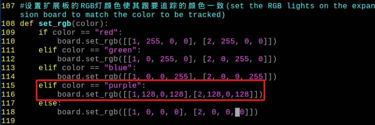
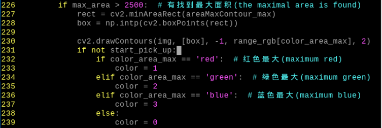
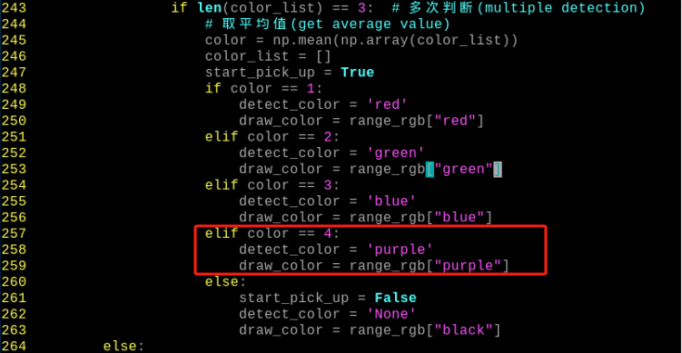
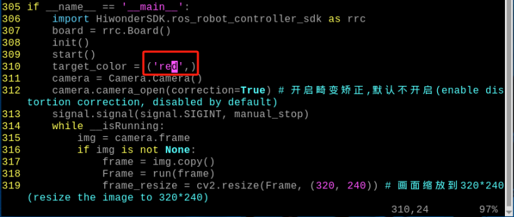

# AI视觉项目课程

## 1. 单个颜色识别

:::{Note}
玩法开始前请确保已参照"**[学前先看\ 5. 云台位置调节](https://docs.hiwonder.com/projects/TurboPi/en/latest/docs/1.getting_ready.html#id21)**"课程对云台舵机的偏差进行了调节。
:::

本节通过摄像头来识别颜色,识别到红色小球时，蜂鸣器发出滴滴报警声，并在回传画面中圈出，打印 "**Color：red**"。

### 1.1 实现原理 

颜色识别的实现分为颜色识别和识别后的执行反馈两部分。

首先颜色识别部分，先进行高斯滤波（对图像中进行减噪），通过Lab颜色空间来对物品的颜色进行转换(关于Lab颜色空间的这个部分可以前往教程资料中 "**[OpenCV视觉基础课程](https://docs.hiwonder.com/projects/General_basic_courses/en/latest/docs/6_opencv.html#)**"进行详细学习)。

接着通过颜色阈值对圆圈中的物体颜色进行识别，再对图像部分进行掩膜（掩膜是用选定的图像、图形或物体，对处理的图像进行全局或者局部遮挡）。

然后经过对物品图片开闭运算处理后，最后将轮廓最大的物体用圆圈圈出。

开运算：先对图像腐蚀后膨胀。作用：用来消除小的物体，平滑形状边界，并且不改变其面积。可以去除小颗粒噪声，断开物体之间的粘连。

闭运算：先对图像膨胀后腐蚀。作用：用来填充物体内的小空洞，连接邻近的物体，连接断开的轮廓线，平滑其边界的同时不改变面积。

在识别后对舵机、蜂鸣器进行设置，使小车根据不同颜色来做出对应的反馈。比如识别红色，蜂鸣器响一声。

关于详细对应的反馈效果，可参考本文档"**功能实现**"。

### 1.2 玩法开启及关闭步骤

:::{Note}
指令输入需严格区分大小写及空格，关键字可以使用"Tab"键进行补齐。
:::

1)  将设备开机，并参照课程资料的"**[学前先看\4. 远程工具安装与连接](https://docs.hiwonder.com/projects/TurboPi/en/latest/docs/1.getting_ready.html#id12)**"内容，通过VNC远程连接工具连接。


2)  点击系统桌面左上角的图标，或按下快捷键"**Ctrl+Alt+T**"打开LX终端。

3)  输入指令，按下回车，则可定位到存放玩法程序的目录。

```commandline
cd TurboPi/function_demo/
```

4)  输入指令，然后按下回车键，玩法启动。

```commandline
python3 individual_colors.py
```

5)  如需关闭此玩法，只需要在LX终端界面中按下"Ctrl+c"。若关闭失败，可多次按下。

### 1.3 功能实现

玩法开启后，通过摄像头来识别颜色,识别到红色小球时，蜂鸣器发出滴滴报警声，并在回传画面中圈出，打印 "Color：red"

:::{Note}
- **识别过程中，请尽量保证在光线充足环境下进行识别，避免因光线问题导致识别不准确。**
- **识别过程中，摄像头视觉范围之内的背景中，不要出现与要识别颜色相近或相同的物体，避免误识别。**
- **若颜色识别不准确可参照本文档"[调节颜色阈值](#anchor_1_4_1)"，对颜色阈值进行设置。**
:::

### 1.4 功能延伸

<p id="anchor_1_4_1"></p>

- #### 1.4.1 调节颜色阈值

在玩法体验的过程中，如识别物体颜色效果不佳，则需调节颜色阈值。**本节以调节红色为例，其他颜色设置方法皆可参考此方法，操作步骤如下：**

1)  双击系统桌面图标，在弹出的界面中点击"**执行**"。


2)  进入界面后，点击"**Connect**"连接摄像头。


3)  连接成功后，在界面右下角的颜色选项栏中选择"**red**"。


4)  若在弹出的界面中未出现回传画面，说明摄像头未连接成功，需检查一下摄像头连接线是否连接好。

下图界面右侧是实时回传画面，左侧是需要被采集的颜色。将摄像头对准红色小球，然后拖动下方的六个滑杆，使得左侧画面中红色小球的区域全部变为白色，其它区域为黑色。接着点击"**Save**"按钮保存数据。


- #### 1.4.2 更换默认识别颜色

颜色识别程序内置了三种颜色：红色、绿色以及蓝色，其中默认识别到红色，蜂鸣器发出滴滴报警声，并在回传画面中圈出，打印 "Color：red"。

**这里我们将识别颜色更换为绿色为例，具体修改步骤如下所示：**

1)  输入指令，并按下回车，切换至源码程序路径下。

```commandline
cd TurboPi/function_demo/
```

2)  然后再输入指令，并按下回车，即可打开程序文件。

```commandline
sudo vim individual_colors.py
```

3)  找到下图所示代码：


4)  按下键盘上的"**i**"键，进入到编辑模式。


5)  将下图红色框中的"red"换成"green"，如下图所示：


6)  接下来，保存我们修改的内容。按下"Esc"键，然后依次输入":wq"（注意wq前为冒号:），回车即可保存并退出。


7)  再次输入指令，并按下回车，即可开启颜色识别的玩法。

```commandline
python3 individual_colors.py
```

### 1.5 程序分析

该程序的源代码位于：**/home/pi/TurboPi/function_demo/individual_colors.py**

根据实现的效果，梳理程序的过程逻辑，如下图所示：


- #### 1.5.1 导入功能库

```py
import os
import sys
sys.path.append('/home/pi/TurboPi/')
import cv2
import math
import time
import datetime
import threading
import yaml_handle
import numpy as np
import HiwonderSDK.Misc as Misc
from HiwonderSDK.PID import PID
```

1)  导入opencv、时间、数学、线程相关的库。我们如果想要调用功能库里的函数，就可以使用"功能库名+函数名（参数，参数...）"如：

```py
time.sleep(0.01)
```

就是调用"**time**"库中的"**sleep**"函数，sleep()的作用是延时。

在python中有一些已经内置的库，我们直接导入调用就可以，比如"**time**"、"**cv2**"、"**math**"等。我们也可以自己写一个库，比如上面的"**yaml_handle**"文件读取库。

2. 实例化函数库。我们有些函数库的名称太长，并且不容易记忆，为了方便调用函数，我们经常会对函数库进行实例化，如：

```py
import HiwonderSDK.Board as Board
```

进行实例化后，在使用Board库中的函数，就可以像这样"**Board.函数名(参数,参数...)**"直接调用了，非常方便。

- #### 1.5.2 主函数分析

python程序中"**\_\_name\_\_ == '\_\_main\_\_:'**"就是程序的主函数，首先读取摄像图片。

```py
if __name__ == '__main__':
    import HiwonderSDK.ros_robot_controller_sdk as rrc
    board = rrc.Board()
    cap = cv2.VideoCapture(0)  
    if not cap.isOpened():
        print("Failed to open camera")
        sys.exit(-1)

    while True:
        ret, img = cap.read()
        if ret:
            Frame = run(img)
            cv2.imshow('frame', Frame)
            key = cv2.waitKey(1)
            if key == 27:  
                break
        else:
            time.sleep(0.01)

    cap.release()  
    cv2.destroyAllWindows()
```

**进入图像处理**

1)  函数run()进行图像处理。

```py
def run(img):
    global buzzer_flag
    frame_resize = cv2.resize(img, (320, 240), interpolation=cv2.INTER_NEAREST)
    frame_lab = cv2.cvtColor(frame_resize, cv2.COLOR_BGR2LAB)
    frame_mask = cv2.inRange(frame_lab,
                             (lab_data['red']['min'][0], lab_data['red']['min'][1], lab_data['red']['min'][2]),
                             (lab_data['red']['max'][0], lab_data['red']['max'][1], lab_data['red']['max'][2]))
```

- 对图片大小进行缩放，方便处理。

```py
frame_resize = cv2.resize(img, (320, 240), interpolation=cv2.INTER_NEAREST)
```

第一个参数"**img**"是输入图像。

第二个参数"（320，240）"是输出图像的大小。大小可以自己设定。

第三个参数"**interpolation=cv2.INTER_NEAREST**"是插值方式。INTER_NEAREST：最邻近插值。INTER_LINEAR：双线性插值，如果最后一个参数你不指定，将默认使用这种方法。INTER_CUBIC：4x4像素邻域内的双立方插值。INTER_LANCZOS4：8x8像素邻域内的Lanczos插值。

- 将图像转换到LAB空间，其中函数cv2.cvtColor()是颜色空间转换函数。


```py
frame_lab = cv2.cvtColor(frame_resize, cv2.COLOR_BGR2LAB)
```

第一个参数"frame_resize"是需要转化的图片

第二个参数"cv2.COLOR_BGR2LAB"是将BGR格式转换成LAB格式，如果要转换到RGB就可以使用"**cv2.COLOR_BGR2RGB**

- 将图像转换成二值图像，只有0和1，图像变得简单并且数据量减小，更容易处理。

采用cv2库中的inRange()函数对图像进行二值化处理。


```py
    frame_mask = cv2.inRange(frame_lab,
                             (lab_data['red']['min'][0], lab_data['red']['min'][1], lab_data['red']['min'][2]),
                             (lab_data['red']['max'][0], lab_data['red']['max'][1], lab_data['red']['max'][2]))
```

第一个参数"**frame_lab**"是输入图像；

第二个参数"**(lab_data\[i\]\['min'\]\[0\],lab_data\[i\]\['min'\]\[1\],lab_data\[i\]\['min'\]\[2\])**"是颜色阈值下限；

第三个参数"**(lab_data\[i\]\['max'\]\[0\],lab_data\[i\]\['max'\]\[1\],lab_data\[i\]\['max'\]\[2\])**"是颜色阈值上限；

- 为了降低干扰，令图像更平滑，需要对图像进行开运算和闭运算，开运算是先腐蚀再膨胀，闭运算是先膨胀再腐蚀。函数cv2.morphologyEx()是形态学函数。

```py
opened = cv2.morphologyEx(frame_mask, cv2.MORPH_OPEN, np.ones((6, 6), np.uint8))
closed = cv2.morphologyEx(opened, cv2.MORPH_CLOSE, np.ones((6, 6), np.uint8))
```

第一个参数"**frame_mask**"是输入图像。

第二个参数"**cv2.MORPH_OPEN**"是形态操作的类型。cv2.MORPH_ERODE（腐蚀）,cv2.MORPH_DILATE（膨胀）,cv2.MORPH_OPEN（开运算)，cv2.MORPH_CLOSE（闭运算）

第三个参数"**np.ones((6, 6)**"是卷积核。

第四个参数"**np.uint8**"是应用次数。

- 获取最大面积轮廓

完成上述的图像处理后，需要获取识别目标的轮廓，此处涉及cv2库中的findContours()函数。

```py
contours, _ = cv2.findContours(closed, cv2.RETR_EXTERNAL, cv2.CHAIN_APPROX_SIMPLE)
```

第一个参数"**closed**"是输入图像；

第二个参数"**cv2.RETR_EXTERNAL**"是轮廓的检索模式；

第三个参数"**cv2.CHAIN_APPROX_NONE)\[-2\]**"是轮廓的近似方法。

在获得的轮廓中寻找面积最大的轮廓，而为了避免干扰，需要设定一个最小值，仅当面积大于该值时，目标轮廓才有效。

```py
if areaMaxContour is not None:
    (centerX, centerY), radius = cv2.minEnclosingCircle(areaMaxContour)
    if radius >= 3 and not buzzer_flag:
        board.set_buzzer(1900, 0.1, 0.9, 1)# 设置蜂鸣器响0.1秒(set the buzzer to emit for 0.1 second)
        buzzer_flag = True
```

```py
for c in contours:
    contour_area_temp = math.fabs(cv2.contourArea(c))
    if contour_area_temp > contour_area_max:
        contour_area_max = contour_area_temp
        if contour_area_temp > 20:
            area_max_contour = c
return area_max_contour
```

- 在回传画面中圈出，打印 "**Color: red**"

```py
        if buzzer_flag:
            centerX = int(Misc.map(centerX, 0, 320, 0, 640))
            centerY = int(Misc.map(centerY, 0, 240, 0, 480))
            radius = int(Misc.map(radius, 0, 320, 0, 640))
            cv2.circle(img, (int(centerX), int(centerY)), int(radius), range_rgb['red'], 2)
            cv2.putText(img, "Color: red", (int(centerX) - 50, int(centerY) - 20), cv2.FONT_HERSHEY_SIMPLEX, 0.6, range_rgb['red'], 2)
```

**显示回传画面**

```py
while True:
    ret, img = cap.read()
    if ret:
        Frame = run(img)
        cv2.imshow('frame', Frame)
        key = cv2.waitKey(1)
        if key == 27:  
            break
        else:
            time.sleep(0.01)

cap.release()  
cv2.destroyAllWindows() 
```

函数cv2.imshow()的作用是在窗口显示图像，"**'frame'**"是窗口名称、"F**rame**"是显示内容。后面一定要有cv2.waitKey()，否则无法显示。

函数cv2.waitKey()的作用是等待按键输入，参数"**1**"是延迟时间。

<p id="anchor_2"></p>

## 2. 颜色识别

:::{Note}
玩法开始前请确保已参照"**[学前先看\ 5. 云台位置调节](https://docs.hiwonder.com/projects/TurboPi/en/latest/docs/1.getting_ready.html#id21)**"课程对云台舵机的偏差进行了调节。
:::

本节通过摄像头来识别颜色，当识别到红色，云台将"**点头**"，蓝色或绿色将"**摇头**"。

### 2.1 实验原理

颜色识别的实现分为颜色识别和识别后的执行反馈两部分。

首先颜色识别部分，先进行高斯滤波（对图像中进行减噪），通过Lab颜色空间来对物品的颜色进行转换(关于Lab颜色空间的这个部分可以前往 "**[OpenCV视觉基础课程](https://docs.hiwonder.com/projects/General_basic_courses/en/latest/docs/6_opencv.html#)**"进行详细学习)。

接着通过颜色阈值对圆圈中的物体颜色进行识别，再对图像部分进行掩膜（掩膜是用选定的图像、图形或物体，对处理的图像进行全局或者局部遮挡）。

然后经过对物品图片开闭运算处理后，最后将轮廓最大的物体用圆圈圈出。

开运算：先对图像腐蚀后膨胀。作用：用来消除小的物体，平滑形状边界，并且不改变其面积。可以去除小颗粒噪声，断开物体之间的粘连。

闭运算：先对图像膨胀后腐蚀。作用：用来填充物体内的小空洞，连接邻近的物体，连接断开的轮廓线，平滑其边界的同时不改变面积。

在识别后对舵机、蜂鸣器和RGB彩灯进行设置，使小车根据不同颜色来做出对应的反馈。比如识别红色，将小车设置为"点头"，蜂鸣器响一声，RGB彩灯亮红色。

关于详细对应的反馈效果，可参考本文档"[2.3 功能实现](#anchor_2_3)"。

<p id="anchor_2_2"></p>

### 2.2 玩法开启及关闭步骤

:::{Note}
指令输入需严格区分大小写及空格，关键字可以使用"**Tab**"键进行补齐。
:::

1)  将设备开机，并参照课程资料的"**[学前先看\4. 远程桌面工具安装与连接](https://docs.hiwonder.com/projects/TurboPi/en/latest/docs/1.getting_ready.html#id12)**"内容，通过VNC远程连接工具连接。


2)  点击系统桌面左上角的图标，或按下快捷键"**Ctrl+Alt+T**"打开LX终端。

3)  输入指令，按下回车，则可定位到存放玩法程序的目录。

```commandline
cd TurboPi/Functions/
```

4)  输入指令，然后按下回车键，玩法启动。

```commandline
python3 ColorDetect.py
```

5)  如需关闭此玩法，只需要在LX终端界面中按下"**Ctrl+c**"。若关闭失败，可多次按下。

<p id="anchor_2_3"> </p>

### 2.3 功能实现

玩法开启后，在识别后，摄像头根据不同颜色做出对应的反馈，效果如下表所示：

| **物体颜色** | **蜂鸣器** | **RGB灯** | **执行动作** | **打印内容** |
| :----------: | :--------: | :-------: | :----------: | :----------: |
|     红色     |   响一声   |   红色    |    "点头"    |     red      |
|     绿色     |   响一声   |   绿色    |    "摇头"    |    green     |
|     蓝色     |   响一声   |   蓝色    |    "摇头"    |     blue     |

:::{Note}
- **识别过程中，请尽量保证在光线充足环境下进行识别，避免因光线问题导致识别不准确。**
- **识别过程中，摄像头视觉范围之内的背景中，不要出现与要识别颜色相近或相同的物体，避免误识别。**
- **若颜色识别不准确可参照本文档"[调节颜色阈值](#anchor_2_4_1)"，对颜色阈值进行设置。**
:::

### 2.4 功能延伸

<p id="anchor_2_4_1"></p>

- #### 2.4.1 调节颜色阈值

在玩法体验的过程中，如识别物体颜色效果不佳，则需调节颜色阈值。**本节以调节红色为例，其他颜色设置方法皆可参考此方法，操作步骤如下**：

1)  双击系统桌面图标，在弹出的界面中点击"**Execute**"。


2)  进入界面后，点击"**Connect**"连接摄像头。


3)  连接成功后，在界面右下角的颜色选项栏中选择"**red**"。


4)  若在弹出的界面中未出现回传画面，说明摄像头未连接成功，需检查一下摄像头连接线是否连接好。

下图界面右侧是实时回传画面，左侧是需要被采集的颜色。将摄像头对准红色小球，然后拖动下方的六个滑杆，使得左侧画面中红色小球的区域全部变为白色，其它区域为黑色。接着点击"**Save**"按钮保存数据。


<p id="anchor_2_4_2"></p>

- #### 2.4.2 更换默认识别颜色

颜色识别程序内置了三种颜色：红色、绿色以及蓝色，其中默认识别到红色，摄像头便执行点头动作。

**这里我们将识别颜色更换为绿色为例，具体修改步骤如下所示：**

1)  输入指令，并按下回车，切换至源码程序路径下。

```commandline
cd TurboPi/Functions/
```

2)  然后再输入指令，并按下回车，即可打开程序文件。

```commandline
sudo vim ColorDetect.py
```

3)  找到下图所示代码：


:::{Note}
在键盘输入代码位置序号后，按下"Shift+G"键，可直接跳转到对应位置。（图示代码位置序号仅供参考，请以实际为准。）
:::

4)  按下键盘上的"**i**"键，进入到编辑模式。


5)  将"**detect_color == 'red'**"中的"**red**"换成"**green**"，如下图所示：


6)  接下来，保存我们修改的内容。按下"**Esc**"键，然后依次输入指令（注意wq前为冒号：），回车即可保存并退出。

```commandline
:wq
```

7)  再次输入指令，并按下回车，即可开启颜色识别的玩法。

```commandline
sudo python3 ColorDetect.py
```


- #### 2.4.3 增加新的识别颜色

除了内置三种识别的颜色，我们还可以设置其它可识别的颜色，**比如我们以紫色作为新增的识别颜色为例，具体的修改步骤如下**：

1)  双击系统桌面图标，然后弹出的提示框内直接选择"**Execute**"即可。


2)  在弹出的界面中选择"**Connect**"。


3)  点击"**Add**"，然后为新增颜色命名（这里以"**purple**"为例），再点击"**OK**"。


4)  然后点击颜色选框的下拉按钮，选择"**purple**"。


5)  将摄像头对准紫色物体，拖动L、A、B应的滑杆，直到左侧画面里要识别的颜色区域变为白色，其他区域变成黑色。


6)  最后，再点击"**Save**"，保存一下调节好的颜色阈值。


7)  修改完成后，我们可以检查一下修改的值是否成功被写入进去，输入指令，并按下回车，进入到程序代码所在目录。

```commandline
cd TurboPi
```

8)  再输入指令，并按下回车，打开程序文件。

```commandline
sudo vim lab_config.yaml
```

9)  打开颜色阈值程序文件后，即可查看紫色阈值参数。


10) 再按照"[更换默认识别颜色](#anchor_2_4_2)"1—2步骤，打开程序文件并按下"**i**"键进入编辑模式，找到如下图所示代码。


11) 手动输入添加"**'purple'**"和"**'purple': (128, 0, 128)**"，(128, 0, 128)为紫色的RGB值，此处需要调换RGB的顺序为BGR，因此处紫色的数值还是（128，0，128），颜色的RGB值可以前往-\>[RGB颜色查询器](http://tools.jb51.net/static/colorpicker/)查询）。


12) 接着找到如下图所示代码。


13) 手动输入添加框中内容，设置扩展板上的灯亮紫色（此处填写的是紫色的RGB值，颜色的RGB值可以前往-\>[RGB颜色查询器](http://tools.jb51.net/static/colorpicker/)查询）。如下图所示：



14) 接着找到如下图所示代码。


15) 手动输入添加框中内容，紫色面积最大时，令color=4如下图所示：



16) 接着找到如下图所示代码。


17) 手动输入添加框中内容，对是否识别到紫色进行判断。如下图所示：



18) 保存我们修改的内容。按下"**Esc**"键，然后依次输入指令（注意wq前为冒号:），回车即可保存并退出。

```commandline
:wq
```


19) 参照本文档"[2.2 玩法开启及关闭步骤](#anchor_2_2)"再次启动该玩法，将紫色物品放置到摄像头前，可看到摄像头将执行"**摇头**"动作。如果需要执行"**点头**"动作，参照"[更换默认识别颜色](#anchor_2_4_2)"将默认识别颜色改为紫色即可。

20) 如果需要添加其他颜色作为可识别颜色，可参考前面步骤进行操作。

### 2.5 程序参数说明

该程序的源代码位于：**/home/pi/TurboPi/Functions/ColorDetect.py**

根据实现的效果，梳理程序的过程逻辑，如下图所示：


- #### 2.5.1 导入功能库

```py
#!/usr/bin/python3
# coding=utf8
import sys
sys.path.append('/home/pi/TurboPi/')
import cv2
import time
import math
import signal
import Camera
import threading
import numpy as np
import yaml_handle
```

1)  导入opencv、时间、数学、线程相关的库。我们如果想要调用功能库里的函数，就可以使用"**功能库名+函数名（参数，参数...）**"如：

```py
time.sleep(0.01)
```

就是调用"**time**"库中的"**sleep**"函数，sleep()的作用是延时。

在python中有一些已经内置的库，我们直接导入调用就可以，比如"**time**"、"**cv2**"、"**math**"等。我们也可以自己写一个库，比如上面的"**yaml_handle**"文件读取库。

2. 实例化函数库。我们有些函数库的名称太长，并且不容易记忆，为了方便调用函数，我们经常会对函数库进行实例化，如：

```py
import HiwonderSDK.ros_robot_controller_sdk as rrc
board = rrc.Board()
```

进行实例化后，在使用board库中的函数，就可以像这样"**board.函数名(参数,参数...)**"直接调用了，非常方便。

- #### 2.5.2 主函数分析

python程序中"**\_\_name\_\_ == '\_\_main\_\_:'**"就是程序的主函数。首先调用函数init()进行初始化配置。本程序中初始化包括：舵机回到初始位置、读取颜色阈值文件。一般还有端口、外设、定时中断等配置，这些都要在初始化内容中完成。

```py
if __name__ == '__main__':
    import HiwonderSDK.ros_robot_controller_sdk as rrc
    board = rrc.Board()
    init()
    start()
    camera = Camera.Camera()
    camera.camera_open(correction=True) # 开启畸变矫正,默认不开启(enable distortion correction, disabled by default)
    signal.signal(signal.SIGINT, manual_stop)
```

**读取摄像头图像**

```py
while __isRunning:
    img = camera.frame
```

当玩法启动时，将图像存储在"**img**"中。

**进入图像处理**

读取到图像时，调用run()函数进行图像处理。

```py
if img is not None:
    frame = img.copy()
    Frame = run(frame) 
```

1)  函数img.copy()的作用是将"**img**"的内容复制给"**frame**"。

2)  函数run()进行图像处理。

```py
# 机器人图像处理(robot images processing)
def run(img):
    global __isRunning
    global start_pick_up
    global detect_color, draw_color, color_list
    
    if not __isRunning:  # 检测是否开启玩法，没有开启则返回原图像(check if the program is enabled, return the original image if not enabled)
        return img
    
    img_copy = img.copy()
    img_h, img_w = img.shape[:2]
    
    frame_resize = cv2.resize(img_copy, size, interpolation=cv2.INTER_NEAREST)
    frame_gb = cv2.GaussianBlur(frame_resize, (3, 3), 3)
    
    frame_lab = cv2.cvtColor(frame_gb, cv2.COLOR_BGR2LAB)  # 将图像转换到LAB空间(convert the image to the LAB space)

    color_area_max = None
    max_area = 0
    areaMaxContour_max = 0
    if not start_pick_up:
        for i in target_color:
            if i in lab_data:
                frame_mask = cv2.inRange(frame_lab,
                                             (lab_data[i]['min'][0],
                                              lab_data[i]['min'][1],
                                              lab_data[i]['min'][2]),
                                             (lab_data[i]['max'][0],
                                              lab_data[i]['max'][1],
                                              lab_data[i]['max'][2]))  #对原图像和掩模进行位运算(perform bitwise operation on the original image and mask)
                opened = cv2.morphologyEx(frame_mask, cv2.MORPH_OPEN, np.ones((3, 3), np.uint8))  # 开运算(opening operation)
                closed = cv2.morphologyEx(opened, cv2.MORPH_CLOSE, np.ones((3, 3), np.uint8))  # 闭运算(closing operation)
                contours = cv2.findContours(closed, cv2.RETR_EXTERNAL, cv2.CHAIN_APPROX_NONE)[-2]  # 找出轮廓(find contours)
                areaMaxContour, area_max = getAreaMaxContour(contours)  # 找出最大轮廓(find the maximal contour)
                if areaMaxContour is not None:
                    if area_max > max_area:  # 找最大面积(find the maximal area)
                        max_area = area_max
                        color_area_max = i
                        areaMaxContour_max = areaMaxContour
        if max_area > 2500:  # 有找到最大面积(the maximal area is found)
            rect = cv2.minAreaRect(areaMaxContour_max)
            box = np.intp(cv2.boxPoints(rect))
            
            cv2.drawContours(img, [box], -1, range_rgb[color_area_max], 2)
            if not start_pick_up:
                if color_area_max == 'red':  # 红色最大(maximum red)
                    color = 1
                elif color_area_max == 'green':  # 绿色最大(maximum green)
                    color = 2
                elif color_area_max == 'blue':  # 蓝色最大(maximum blue)
                    color = 3
                else:
                    color = 0
```

- 对图片大小进行缩放，方便处理。

```py
frame_resize = cv2.resize(img_copy, size, interpolation=cv2.INTER_NEAREST)
```

第一个参数"**img_copy**"是输入图像。

第二个参数"**size**"是输出图像的大小。大小可以自己设定。

第三个参数"**interpolation=cv2.INTER_NEAREST**"是插值方式。INTER_NEAREST：最邻近插值。INTER_LINEAR：双线性插值，如果最后一个参数你不指定，将默认使用这种方法。INTER_CUBIC：4x4像素邻域内的双立方插值。INTER_LANCZOS4：8x8像素邻域内的Lanczos插值。

- 高斯滤波

图像中总是会混入噪声，影响图像的质量，让特征不明显。根据不同的噪声种类选择对应的滤波方法，常见的有：高斯滤波、中值滤波、均值滤波等。

高斯滤波是一种线性平滑滤波，适用于消除高斯噪声，广泛应用于图像处理的减噪过程。

```py
frame_gb = cv2.GaussianBlur(frame_resize, (3, 3), 3)
```

第一个参数"**frame_resize**"是输入图像。

第二个参数"**(3, 3)**"是高斯内核大小。

第三个参数"**3**"是X方向上的高斯核标准偏差。

- 将图像转换到LAB空间，其中函数cv2.cvtColor()是颜色空间转换函数。

```py
frame_lab = cv2.cvtColor(frame_gb, cv2.COLOR_BGR2LAB)  # 将图像转换到LAB空间(convert the image to the LAB space)
```

第一个参数"**frame_gb**"是输入图像。

第二个参数"**cv2.COLOR_BGR2LAB**"是转换格式。"cv2.COLOR_BGR2LAB"是将BGR格式转换到LAB格式。如果要转换到RGB就可以使用"cv2.COLOR_BGR2RGB"。

- 将图像转换成二值图像，只有0和1，图像变得简单并且数据量减小，更容易处理。

采用cv2库中的inRange()函数对图像进行二值化处理。

```py
frame_mask = cv2.inRange(frame_lab,
                         (lab_data[i]['min'][0],
                          lab_data[i]['min'][1],
                          lab_data[i]['min'][2]),
                         (lab_data[i]['max'][0],
                          lab_data[i]['max'][1],
                          lab_data[i]['max'][2]))  #对原图像和掩模进行位运算(perform bitwise operation on the original image and mask)
```

第一个参数"**frame_lab**"是输入图像；

第二个参数"**(lab_data\[i\]\['min'\]\[0\],lab_data\[i\]\['min'\]\[1\],lab_data\[i\]\['min'\]\[2\])**"是颜色阈值下限；

第三个参数"**(lab_data\[i\]\['max'\]\[0\],lab_data\[i\]\['max'\]\[1\],lab_data\[i\]\['max'\]\[2\])**"是颜色阈值上限；

- 为了降低干扰，令图像更平滑，需要对图像进行开运算和闭运算，开运算是先腐蚀再膨胀，闭运算是先膨胀再腐蚀。函数cv2.morphologyEx()是形态学函数。

```py
opened = cv2.morphologyEx(frame_mask, cv2.MORPH_OPEN, np.ones((3, 3), np.uint8))  # 开运算(opening operation)
closed = cv2.morphologyEx(opened, cv2.MORPH_CLOSE, np.ones((3, 3), np.uint8))  # 闭运算(closing operation)
```

第一个参数"**frame_mask**"是输入图像。

第二个参数"**cv2.MORPH_OPEN**"是形态操作的类型。cv2.MORPH_ERODE（腐蚀）,cv2.MORPH_DILATE（膨胀）,cv2.MORPH_OPEN（开运算)，cv2.MORPH_CLOSE（闭运算）

第三个参数"**np.ones((3, 3)**"是卷积核。

第四个参数"**np.uint8**"是应用次数。

- 获取最大面积轮廓

完成上述的图像处理后，需要获取识别目标的轮廓，此处涉及cv2库中的findContours()函数。

```py
contours = cv2.findContours(closed, cv2.RETR_EXTERNAL, cv2.CHAIN_APPROX_NONE)[-2]  # 找出轮廓(find contours)
```

第一个参数"closed"是输入图像；

第二个参数"cv2.RETR_EXTERNAL"是轮廓的检索模式；

第三个参数"cv2.CHAIN_APPROX_NONE)\[-2\]"是轮廓的近似方法。

在获得的轮廓中寻找面积最大的轮廓，而为了避免干扰，需要设定一个最小值，仅当面积大于该值时，目标轮廓才有效。

```py
areaMaxContour, area_max = getAreaMaxContour(contours)  # 找出最大轮廓(find the maximal contour)
if areaMaxContour is not None:
    if area_max > max_area:  # 找最大面积(find the maximal area)
        max_area = area_max
        color_area_max = i
        areaMaxContour_max = areaMaxContour
        if max_area > 2500:  # 有找到最大面积(the maximal area is found)
            rect = cv2.minAreaRect(areaMaxContour_max)
            box = np.intp(cv2.boxPoints(rect))
```

```py
for c in contours:  # 历遍所有轮廓(iterate through all contours)
    contour_area_temp = math.fabs(cv2.contourArea(c))  # 计算轮廓面积(calculate contour area)
    if contour_area_temp > contour_area_max:
        contour_area_max = contour_area_temp
        if contour_area_temp > 300:  # 只有在面积大于300时，最大面积的轮廓才是有效的，以过滤干扰(only the maximal contour with an area greater than 300 is considered valid to filter out interference)
            area_max_contour = c

return area_max_contour, contour_area_max  # 返回最大的轮廓(return the maximal contour)
```

- 通过判断语句得到图像中面积最大的颜色。

```py
if not start_pick_up:
    if color_area_max == 'red':  # 红色最大(maximum red)
        color = 1
    elif color_area_max == 'green':  # 绿色最大(maximum green)
        color = 2
    elif color_area_max == 'blue':  # 蓝色最大(maximum blue)
        color = 3
    else:
        color = 0
        color_list.append(color)
        if len(color_list) == 3:  # 多次判断(multiple detection)
            # 取平均值(get average value)
            color = np.mean(np.array(color_list))
            color_list = []
            start_pick_up = True
            if color == 1:
                detect_color = 'red'
                draw_color = range_rgb["red"]
            elif color == 2:
                detect_color = 'green'
                draw_color = range_rgb["green"]
            elif color == 3:
                detect_color = 'blue'
                draw_color = range_rgb["blue"]
            else:
                start_pick_up = False
                detect_color = 'None'
                draw_color = range_rgb["black"]
```

**显示回传画面**

```py
frame_resize = cv2.resize(Frame, (320, 240)) # 画面缩放到320*240(resize the image to 320*240)
cv2.imshow('frame', frame_resize)
key = cv2.waitKey(1)
if key == 27:
    break
```

函数cv2.resize()的作用是把处理好的图像缩放到合适的大小。

函数cv2.imshow()的作用是在窗口显示图像，"'frame'"是窗口名称、"frame_resize"是显示内容。后面一定要有cv2.waitKey()，否则无法显示。

函数cv2.waitKey()的作用是等待按键输入，参数"1"是延迟时间。

- #### 2.5.3 子线程分析

小车移动函数move()作为子线程运行，当识别到颜色后，就会执行move()函数。

主要是对图像处理结果进行判断，再执行不同的反馈，包括了RGB灯、蜂鸣器等模块的控制。

```py
# 机器人移动逻辑处理(robot movement logic processing)
def move():
    global _stop
    global __isRunning
    global detect_color
    global start_pick_up


    while True:
        if __isRunning:
            if detect_color != 'None' and start_pick_up:  # 检测到色块(detected color block)
                board.set_buzzer(1900, 0.1, 0.9, 1)# 设置蜂鸣器响0.1秒(set the buzzer to emit for 0.1 second)
                set_rgb(detect_color) # 设置扩展板上的彩灯与检测到的颜色一样(set the colored light on the expansion board to match the detected color)

                if detect_color == 'red' :  # 检测到红色,点头(detecting red color, nodding)
                    for i in range(0,3):
                        board.pwm_servo_set_position(0.3, [[1, servo1-100]])
                        time.sleep(0.3)
                        board.pwm_servo_set_position(0.3, [[1, servo1+100]])
                        time.sleep(0.3)
                        board.pwm_servo_set_position(0.5, [[1, servo1]])  # 回到初始位置(return to the initial position)
                        time.sleep(0.5)       

                    else:                      # 检测到绿色或者蓝色，则摇头(detecting green or blue color, shaking head)
                        for i in range(0,3):
                            board.pwm_servo_set_position(0.35, [[2, servo2-150]])
                            time.sleep(0.35)
                            board.pwm_servo_set_position(0.35, [[2, servo2+150]])
                            time.sleep(0.35)
                            board.pwm_servo_set_position(0.5, [[2, servo2]])  # 回到初始位置(return to the initial position)
                            time.sleep(0.5)

                            _stop = True
                            detect_color = 'None'
                            start_pick_up = False
                            set_rgb(detect_color)

                        else:
                            time.sleep(0.01)
                        else:
                            if _stop:
                                initMove()  # 回到初始位置(return to the initial position)
                                _stop = False
                                time.sleep(1.5)               
                                time.sleep(0.01)
```

**点亮RGB灯**

根据识别的颜色，RGB灯颜色与识别的颜色一致。

```py
#设置扩展板的RGB灯颜色使其跟要追踪的颜色一致(set the RGB lights on the expansion board to match the color to be tracked)
def set_rgb(color):
    if color == "red":
        board.set_rgb([[1, 255, 0, 0], [2, 255, 0, 0]])
    elif color == "green":
        board.set_rgb([[1, 0, 255, 0], [2, 0, 255, 0]])
    elif color == "blue":
        board.set_rgb([[1, 0, 0, 255], [2, 0, 0, 255]])
    else:
        board.set_rgb([[1, 0, 0, 0], [2, 0, 0, 0]])
```

**驱动蜂鸣器**

```py
board.set_buzzer(1900, 0.1, 0.9, 1)# 设置蜂鸣器响0.1秒(set the buzzer to emit for 0.1 second)
```

函数set_buzzer()是驱动蜂鸣器，以代码set_buzzer(1900, 0.1, 0.9, 1)为例：

第一个参数"**1900**"是频率。

第二个参数"**0.1**"是蜂鸣器响的时间，单位为秒。。

第三个参数"**0.9**"是蜂鸣器停止响的时间，单位为秒。

第四个参数"**1**"是模式的重复次数，默认为1次。

**小车执行移动**

判断识别的颜色与设定颜色是否一致，执行点头或者摇头的动作。

```py
if detect_color == 'red' :  # 检测到红色,点头(detecting red color, nodding)
    for i in range(0,3):
        board.pwm_servo_set_position(0.3, [[1, servo1-100]])
        time.sleep(0.3)
        board.pwm_servo_set_position(0.3, [[1, servo1+100]])
        time.sleep(0.3)
        board.pwm_servo_set_position(0.5, [[1, servo1]])  # 回到初始位置(return to the initial position)
        time.sleep(0.5)       

    else:                      # 检测到绿色或者蓝色，则摇头(detecting green or blue color, shaking head)
        for i in range(0,3):
            board.pwm_servo_set_position(0.35, [[2, servo2-150]])
            time.sleep(0.35)
            board.pwm_servo_set_position(0.35, [[2, servo2+150]])
            time.sleep(0.35)
            board.pwm_servo_set_position(0.5, [[2, servo2]])  # 回到初始位置(return to the initial position)
            time.sleep(0.5)
```

函数board.pwm_servo_set_position()是控制PWM舵机，以代码"**board.pwm_servo_set_position(0.3, \[\[1, servo1-100\]\])**"为例：

第一个参数"**0.3**"是表示舵机运动的持续时间，单位为秒。

第二个参数"**\[\[1, servo1-100\]\]**"表示要设置的舵机位置。它是一个列表，每个元素是一个二元组，包含舵机的编号和位置值。

## 3. 目标位置识别

:::{Note}
玩法开始前请确保已参照"**[学前先看\ 5. 云台位置调节](https://docs.hiwonder.com/projects/TurboPi/en/latest/docs/1.getting_ready.html#id21)**"课程对云台舵机的偏差进行了调节。
:::

本节课可以通过摄像头进行颜色识别红绿蓝三色小球，并在回传画面中圈出，显示其XY坐标位置。

### 3.1 实现原理

目标追踪的实现可分为颜色识别和位置标记两部分。

首先颜色识别部分，先进行高斯滤波（对图像中进行减噪），通过Lab颜色空间来对物品的颜色进行转换(关于Lab颜色空间的这个部分可以前往"**第7章 OpenCV基础视觉课程**"课程进行详细学习)。

接着通过颜色阈值对圆圈中的物体颜色进行识别，再对图像部分进行掩膜（掩膜是用选定的图像、图形或物体，对处理的图像进行全局或者局部遮挡）。

然后经过对物品图片开闭运算处理后，最后将轮廓最大的物体用圆圈圈出。

开运算：先对图像腐蚀后膨胀。作用：用来消除小的物体，平滑形状边界，并且不改变其面积。可以去除小颗粒噪声，断开物体之间的粘连。

闭运算：先对图像膨胀后腐蚀。作用：用来填充物体内的小空洞，连接邻近的物体，连接断开的轮廓线，平滑其边界的同时不改变面积。

位置标记需要使用特定的检测算法。其基本原理是在图像中寻找符合预定义特征或模式的区域，然后返回这些区域的位置和边界框。

### 3.2 玩法开启及关闭步骤

指令的输入需严格区分大小写和空格，另外可按键盘"Tab"键进行关键词补齐。

1)  将设备开机，并参照课程资料的"**[学前先看\4. 远程工具安装与连接](https://docs.hiwonder.com/projects/TurboPi/en/latest/docs/1.getting_ready.html#id12)**"内容，通过VNC远程连接工具连接。


2)  点击系统桌面左上角的图标，或按下快捷键"Ctrl+Alt+T"打开LX终端。

3)  在打开的界面中，输入进入玩法程序所在目录的指令，按下回车键。

```commandline
cd TurboPi/function_demo/
```

3)  输入指令，然后按下回车，启动玩法。

```commandline
python3 Target_location_identification.py
```

3)  如需关闭此玩法，只需要在LX终端界面中按下"**Ctrl+c**"。若关闭失败，可多次按下。

### 3.3 功能实现

**程序默认颜色为红绿蓝三色小球，识别完成后在回传画面中圈出，并显示其XY坐标位置**。

:::{Note}
- **识别过程中，请尽量保证在光线充足环境下进行识别，避免因光线问题导致识别不准确。**
- **识别过程中，摄像头视觉范围之内的背景中，不要出现与要识别颜色相近或相同的物体，避免误识别。**
- **若颜色识别不准确可参照本文档"[调节颜色阈值](#anchor_3_4_1)"，对颜色阈值进行设置。**
:::

### 3.4 功能延伸

<p id="anchor_3_4_1"></p>

- #### 3.4.1 调节颜色阈值

在玩法体验的过程中，如识别物体颜色效果不佳，则需调节颜色阈值。**本节以调节红色为例，其他颜色设置方法皆可参考，操作步骤如下：**

1)  双击系统桌面图标，在弹出的界面中点击"**执行**"。


2)  进入界面后，点击"**Connect**"。


3)  连接成功后，在界面右下角的颜色选项栏中选择"**red**"。


4)  若在弹出的界面中未出现回传画面，说明摄像头未连接成功，需检查一下摄像头连接线是否连接好。

下图界面右侧是实时回传画面，左侧是需要被采集的颜色。将摄像头对准红色色块，然后拖动下方的六个滑杆，使得左侧画面中红色色块的区域全部变为白色，其它区域为黑色。接着点击"Save"按钮保存数据。


- #### 3.4.2 增加新的识别颜色

除了内置三种识别的颜色，我们还可以设置其它可识别的颜色，**比如我们以紫色作为新增的识别颜色为例，具体的修改步骤如下：**

1)  双击系统桌面图标，然后弹出的提示框内直接选择"**执行**"即可。


2)  在弹出的界面中依次选择"**Connect**"。


3)  点击"**Add**"，然后为新增颜色命名（这里以"**purple**"为例），再点击"**OK**"。


4)  然后点击颜色选框的下拉按钮，选择"**purple**"。


5)  将摄像头对准紫色物体，拖动L、A、B应的滑杆，直到左侧画面里要识别的颜色区域变为白色，其他区域变成黑色。


6)  最后，再点击"**Save**"，保存一下调节好的颜色阈值。


7)  修改完成后，我们可以检查一下修改的值是否成功被写入进去，输入指令，并按下回车，进入到程序代码所在目录。

```commandline
cd TurboPi/
```

8)  再输入指令，并按下回车，打开程序文件。

```commandline
sudo vim lab_config.yaml
```

9)  打开颜色阈值程序文件后，即可查看紫色阈值参数。


10) 接着找到如下图所示代码。


手动输入添加"**'purple': (255, 255, 114)**"，如下图所示：(255, 255, 114)为第9步查看的紫色阈值参数的max。

```py
'purple': (255, 255, 114)
```


### 3.5 程序说明

该程序的源代码位于：**/home/pi/TurboPi/function_demo/Target_location_identification.py**

根据实现的效果，梳理程序的过程逻辑，如下图所示：


- #### 3.5.1 导入功能库

```py
#!/usr/bin/python3
# coding=utf8
import os
import sys
sys.path.append('/home/pi/TurboPi/')
import cv2
import math
import time
import datetime
import threading
import yaml_handle
import numpy as np
import HiwonderSDK.Misc as Misc
from HiwonderSDK.PID import PID
```

1)  导入opencv、时间、数学、线程、逆运动学相关的库。我们如果想要调用功能库里的函数，就可以使用"**功能库名+函数名（参数，参数...）**"如：

```py
time.sleep(0.01)
```

就是调用"**time**"库中的"**sleep**"函数。sleep()的作用是延时。

在python中有一些已经内置的库，我们直接导入调用就可以，比如"**time**"、"**cv2**"、"**math**"等。我们也可以自己写一个库，比如上面的"**yaml_handle**"文件读取库等。

2)  实例化函数库。我们有些函数库的名称太长，并且不容易记忆，为了方便调用函数，我们经常会对函数库进行实例化，如：

```py
import HiwonderSDK.Misc as Misc
```

进行实例化后，在使用Board库中的函数，就可以像这样"**Board.函数名(参数,参数...)**"直接调用了，非常方便。

- #### 3.5.2 主函数分析

python程序中"**\_\_name\_\_ == '\_\_main\_\_:'**"就是程序的主函数。首先要打开摄像头，并读取视频流通过read方法可以读取到每一帧的图片，查找并标记小球颜色并显示结果。通过循环读取显示就可以实现视频的播放，在视频读取展示结束后使用release函数释放资源。

```py
if __name__ == '__main__':
    import HiwonderSDK.ros_robot_controller_sdk as rrc
    board = rrc.Board()
    cap = cv2.VideoCapture(0)
    if not cap.isOpened():
        print("Failed to open camera")
        sys.exit(-1)

    while True:
        ret, img = cap.read()
        if ret:
            frame = run(img)
            cv2.imshow('Frame', frame)
            key = cv2.waitKey(1)
            if key == 27:  # Press ESC to exit
                break
        else:
            time.sleep(0.01)

    cap.release()
    cv2.destroyAllWindows()
```

**读取摄像头图像**

```py
cap = cv2.VideoCapture(0)
```

当玩法启动时，首先读取摄像头。

**进入图像处理**

1)  函数run()进行图像处理。

```py
def run(img):
    global draw_color
    global detect_color
        
    img_copy = img.copy()
    img_h, img_w = img.shape[:2]

    frame_resize = cv2.resize(img_copy, size, interpolation=cv2.INTER_NEAREST)
    frame_gb = cv2.GaussianBlur(frame_resize, (3, 3), 3)
    frame_lab = cv2.cvtColor(frame_gb, cv2.COLOR_BGR2LAB)
```

- 对图片大小进行缩放，方便处理。

```py
frame_resize = cv2.resize(img_copy, size, interpolation=cv2.INTER_NEAREST)
```

第一个参数"**img_copy**"是输入图像。

第二个参数"**size**"是输出图像的大小。大小可以自己设定。

第三个参数"**interpolation=cv2.INTER_NEAREST**"是插值方式。INTER_NEAREST：最邻近插值。INTER_LINEAR：双线性插值，如果最后一个参数你不指定，将默认使用这种方法。INTER_CUBIC：4x4像素邻域内的双立方插值。INTER_LANCZOS4：8x8像素邻域内的Lanczos插值。

- 高斯滤波

图像中总是会混入噪声，影响图像的质量，让特征不明显。根据不同的噪声种类选择对应的滤波方法，常见的有：高斯滤波、中值滤波、均值滤波等。

高斯滤波是一种线性平滑滤波，适用于消除高斯噪声，广泛应用于图像处理的减噪过程。

```py
frame_gb = cv2.GaussianBlur(frame_resize, (3, 3), 3)
```

第一个参数"**frame_resize**"是输入图像。

第二个参数"**(3, 3)**"是高斯内核大小。

第三个参数"**3**"是X方向上的高斯核标准偏差。

- 将图像转换到LAB空间，其中函数cv2.cvtColor()是颜色空间转换函数。

```py
frame_gb = cv2.GaussianBlur(frame_resize, (3, 3), 3)
```

第一个参数"**frame_gb**"是输入图像。

第二个参数"**cv2.COLOR_BGR2LAB**"是转换格式。"**cv2.COLOR_BGR2LAB**"是将BGR格式转换到LAB格式。如果要转换到RGB就可以使用"**cv2.COLOR_BGR2RGB**"。

- 将图像转换成二值图像，只有0和1，图像变得简单并且数据量减小，更容易处理。

采用cv2库中的inRange()函数对图像进行二值化处理。

```py
frame_mask = cv2.inRange(frame_lab,
                         (lab_data[i]['min'][0],
                          lab_data[i]['min'][1],
                          lab_data[i]['min'][2]),
                         (lab_data[i]['max'][0],
                          lab_data[i]['max'][1],
                          lab_data[i]['max'][2]))
```

第一个参数"**frame_lab**"是输入图像；

第二个参数"**(lab_data\[i\]\['min'\]\[0\],lab_data\[i\]\['min'\]\[1\],lab_data\[i\]\['min'\]\[2\])**"是颜色阈值下限；

第三个参数"**(lab_data\[i\]\['max'\]\[0\],lab_data\[i\]\['max'\]\[1\],lab_data\[i\]\['max'\]\[2\])**"是颜色阈值上限；

- 为了降低干扰，令图像更平滑，需要对图像进行腐蚀和膨胀操作，腐蚀和膨胀是一种形态学操作，腐蚀通常用于减小图像中前景对象的尺寸或消除小的对象；膨胀通常用于增大图像中前景对象的尺寸或填补对象内部的小洞。

```py
eroded = cv2.erode(frame_mask, None, iterations=2)
dilated = cv2.dilate(eroded, None, iterations=2)
```

- 获取最大面积轮廓

完成上述的图像处理后，需要获取识别目标的轮廓，此处涉及cv2库中的findContours()函数。

```py
contours = cv2.findContours(dilated, cv2.RETR_EXTERNAL, cv2.CHAIN_APPROX_SIMPLE)[-2]
```

第一个参数"dilated"是输入图像；

第二个参数"**cv2.RETR_EXTERNAL**"是轮廓的检索模式；

第三个参数"**cv2.CHAIN_APPROX_NONE)\[-2\]**"是轮廓的近似方法。

在获得的轮廓中寻找面积最大的轮廓，而为了避免干扰，需要设定一个值，仅当面积大于该值时，目标轮廓才有效。

```py
areaMaxContour, area_max = getAreaMaxContour(contours)
if areaMaxContour is not None:
    if area_max > max_area:
        max_area = area_max
        color_area_max = i
        areaMaxContour_max = areaMaxContour

if max_area > 200:
```

- 获取位置信息

采用cv2库中的cv2.putText() 函数在图像上绘制文本

```py
cv2.putText(img, "Color: " + detect_color, (10, img.shape[0] - 10), cv2.FONT_HERSHEY_SIMPLEX, 0.65, draw_color, 2)
```

第一个参数"img"是输入图像；

第二个参数 "Color: " + detect_color"是要绘制的文本内容，通常以字符串形式传入；f'({centerX}, {centerY})' 是要绘制的文本，显示圆心 (centerX, centerY) 的坐标。

第三个参数"(10, img.shape\[0\] - 10)"与"(centerX, centerY - 20)"是文本在图像中的起始坐标点，即文本左下角的位置（x, y）；

第四个参数"cv2.FONT_HERSHEY_SIMPLEX"表示使用简单的字体；

第五个参数"0.65" 字体大小的缩放因子，指定文本字体的大小缩小到默认大小的0.65倍，参数"1.0"表示文本字体为默认颜色；

第六个参数"draw_color"是文本的颜色；range_rgb\[color_area_max\]是指识别到的最大颜色范围；

第六个参数"2"是文本字体的线条粗细。

**显示回传画面**

```py
if ret:
    frame = run(img)
    cv2.imshow('Frame', frame)
    key = cv2.waitKey(1)
    if key == 27:  # Press ESC to exit
        break
```

函数cv2.imshow()的作用是在窗口显示图像，"**'Frame'**"是窗口名称、"**frame**"是显示内容。后面一定要有cv2.waitKey()，否则无法显示。

函数cv2.waitKey()的作用是等待按键输入，参数"**1**"是延迟时间。

## 4. 目标追踪

:::{Note}
玩法开始前请确保已参照"**[学前先看\ 5. 云台位置调节](https://docs.hiwonder.com/projects/TurboPi/en/latest/docs/1.getting_ready.html#id21)**"课程对云台舵机的偏差进行了调节。
:::

本节课可以通过摄像头进行颜色识别并读取目标位置，控制TurboPi跟随目标的移动而移动。

### 4.1 实验原理

目标追踪的实现可分为颜色识别和追踪两部分。

首先颜色识别部分，先进行高斯滤波（对图像中进行减噪），通过Lab颜色空间来对物品的颜色进行转换(关于Lab颜色空间的这个部分可以前往"**[OpenCV视觉基础课程](https://docs.hiwonder.com/projects/General_basic_courses/en/latest/docs/6_opencv.html#)**"课程进行详细学习)。

接着通过颜色阈值对圆圈中的物体颜色进行识别，再对图像部分进行掩膜（掩膜是用选定的图像、图形或物体，对处理的图像进行全局或者局部遮挡）。

然后经过对物品图片开闭运算处理后，最后将轮廓最大的物体用圆圈圈出。

开运算：先对图像腐蚀后膨胀。作用：用来消除小的物体，平滑形状边界，并且不改变其面积。可以去除小颗粒噪声，断开物体之间的粘连。

闭运算：先对图像膨胀后腐蚀。作用：用来填充物体内的小空洞，连接邻近的物体，连接断开的轮廓线，平滑其边界的同时不改变面积。

追踪部分使用PID算法，根据目标的画面像素坐标与画面中心坐标进行比较，减小两个坐标之间的距离，从而实现目标追踪。

PID算法是应用最为广泛的一种自动控制器。在过程控制中，按误差的比例（P）、积分（I）和微分（D）进行控制。它具有原理简单，易于实现，适用面广，控制参数相互独立，参数的选定比较简单等优点。

<p id="anchor_4_2"></p>

### 4.2 玩法开启及关闭步骤

:::{Note}
指令的输入需严格区分大小写和空格，另外可按键盘"**Tab**"键进行关键词补齐。
:::

1)  将设备开机，并参照课程资料的"**[学前先看\4. 远程桌面工具安装与连接](https://docs.hiwonder.com/projects/TurboPi/en/latest/docs/1.getting_ready.html#id12)**"内容，通过VNC远程连接工具连接。


2)  点击系统桌面左上角的图标，或按下快捷键"**Ctrl+Alt+T**"打开LX终端。

3)  在打开的界面中，输入进入玩法程序所在目录的指令，按下回车键。

```commandline
cd TurboPi/Functions/
```

4. 输入指令，然后按下回车，启动玩法。

```commandline
python3 ColorTracking.py
```


5)  如需关闭此玩法，只需要在LX终端界面中按下"**Ctrl+c**"。若关闭失败，可多次按下。

### 4.3 功能实现

程序默认的追踪颜色为红色，玩法开启后，摄像头与小车将跟随红色物体的移动而移动。

:::{Note}
- 识别过程中，请尽量保证在光线充足环境下进行识别，避免因光线问题导致识别不准确。
- 识别过程中，摄像头视觉范围之内的背景中，不要出现与要识别颜色相近或相同的物体，避免误识别。
- 若颜色识别不准确可参照本文档"[调节颜色阈值](#anchor_4_4_1)"，对颜色阈值进行设置。
:::

### 4.4 功能延伸

<p id="anchor_4_4_1"></p>

- #### 4.4.1 调节颜色阈值

在玩法体验的过程中，如识别物体颜色效果不佳，则需调节颜色阈值。**本节以调节红色为例，其他颜色设置方法皆可参考，操作步骤如下：**

1)  双击系统桌面图标，在弹出的界面中点击"**Execute**"。


2)  进入界面后，点击"**Connect**"。


3)  连接成功后，在界面右下角的颜色选项栏中选择"**red**"。


4)  若在弹出的界面中未出现回传画面，说明摄像头未连接成功，需检查一下摄像头连接线是否连接好。

下图界面右侧是实时回传画面，左侧是需要被采集的颜色。将摄像头对准红色色块，然后拖动下方的六个滑杆，使得左侧画面中红色色块的区域全部变为白色，其它区域为黑色。接着点击"**Save**"按钮保存数据。


<p id="anchor_4_4_2"></p>

- #### 4.4.2 修改追踪颜色

**默认追踪颜色为红色，本节以修改为蓝色为例进行说明：**

1)  如需修改追踪的颜色，输入指令，并按下回车，切换至源码程序路径下。

```commandline
cd MasterPi/Functions/
```

2)  然后输入指令，并按下回车，打开程序文件。

```commandline
sudo vim ColorTracking.py
```

3)  找到下图所示代码：



:::{Note}
在键盘输入代码位置序号后，按下"Shift+G"键，可直接跳转到对应位置。（图示代码位置序号仅供参考，请以实际为准。）
:::

4)  按一下键盘的"**i**"键，进入编辑模式。


5)  将"**target_color = ('red',)**"中的"**red**"修改为"**blue**"，如下图所示：


:::{Note}
这里修改的颜色必须是下图颜色选项栏里出现的颜色，如想修改成其他颜色，可参照本文档"[增加新的识别颜色](#anchor_4_4_3)"步骤添加新的识别颜色。**
:::

6)  修改完成后，按下键盘上的"**Esc**"键，然后依次输入指令（注意wq前为冒号：），回车，即可保存并退出。

```commandline
:wq
```

<p id="anchor_4_4_3"></p>

- #### 4.4.3 增加新的识别颜色

除了内置三种识别的颜色，我们还可以设置其它可识别的颜色，**比如我们以紫色作为新增的识别颜色为例，具体的修改步骤如下：**

1)  双击系统桌面图标，然后弹出的提示框内直接选择"Execute"即可。


2)  在弹出的界面中依次选择"**Connect**"。


3)  点击"**Add**"，然后为新增颜色命名（这里以"**purple**"为例），再点击"**OK**"。


4)  然后点击颜色选框的下拉按钮，选择"**purple**"。


5)  将摄像头对准紫色物体，拖动L、A、B应的滑杆，直到左侧画面里要识别的颜色区域变为白色，其他区域变成黑色。


6)  最后，再点击"**Save**"，保存一下调节好的颜色阈值。


7)  修改完成后，我们可以检查一下修改的值是否成功被写入进去，输入指令，并按下回车，进入到程序代码所在目录。

```commandline
cd TurboPi/yaml
```

8)  再输入指令，并按下回车，打开程序文件。

```commandline
sudo vim lab_config.yaml
```

9)  打开颜色阈值程序文件后，即可查看紫色阈值参数。


10) 再按照本文档"[修改追踪颜色](#anchor_4_4_2)"1—2步骤，打开程序文件并按下"i"键进入编辑模式。接着找到如下图所示代码。


11) 手动输入添加"**'purple'**"和"**'purple': (128, 0, 128)**"，(128, 0, 128)为紫色的RGB值，此处需要调换RGB的顺序为BGR，因此处紫色的数值还是（128，0，128），颜色的RGB值可以前往-\>[RGB颜色查询器](http://tools.jb51.net/static/colorpicker/)查询）。


12) 接着找到如下图所示代码。


13) 手动输入添加框中内容，（颜色的RGB值可以前往-\>[RGB颜色查询器](http://tools.jb51.net/static/colorpicker/)查询）如下图所示：


14. 接着找到如下图所示代码。


15. 将"**'red'**"修改为"**'purple'**"，如下图所示：


16. 保存我们修改的内容。按下"**Esc**"键，然后依次输入指令（注意wq前为冒号：），回车即可保存并退出。

```commandline
:wq
```

17) 参照本文档"[4.2 玩法开启及关闭步骤](#anchor_4_2)"再次启动该玩法，将紫色物品放置到摄像头前，可看到小车追踪目标移动。如果需要添加其他颜色作为可识别颜色，可参考前面步骤进行操作。

- #### 4.4.4 启用车身追踪

在程序运行的过程中，若想要实现车身追踪，需添加麦轮移动的参数，具体实现方法如下所示：

1)  进入颜色追踪的路径下，并找到其程序文件。


2)  找到颜色追踪的main函数。


3)  在下方所示位置输入"**wheel_en = True**"启用车身跟随。


4)  按下"**Ctrl+S**"保存。

5)  重新输入启动颜色追踪的指令即可，参考"[4.2 玩法开启及关闭步骤](#anchor_4_2)"。

### 4.5 程序参数说明

该程序的源代码位于：**/home/pi/TurboPi/Functions/ColorTracking.py**

根据实现的效果，梳理程序的过程逻辑，如下图所示：


- #### 4.5.1 导入功能库

```py
#!/usr/bin/python3
# coding=utf8
import sys
sys.path.append('/home/pi/TurboPi/')
import cv2
import time
import math
import signal
import Camera
import threading
import numpy as np
import yaml_handle
import HiwonderSDK.PID as PID
import HiwonderSDK.Misc as Misc
import HiwonderSDK.mecanum as mecanum
```

1)  导入opencv、时间、数学、线程、逆运动学相关的库。我们如果想要调用功能库里的函数，就可以使用"**功能库名+函数名（参数，参数...）**"如：

```py
time.sleep(0.01)
```

就是调用"**time**"库中的"**sleep**"函数。sleep()的作用是延时。

在python中有一些已经内置的库，我们直接导入调用就可以，比如"**time**"、"**cv2**"、"**math**"等。我们也可以自己写一个库，比如上面的"**yaml_handle**"文件读取库等。

2)  实例化函数库。我们有些函数库的名称太长，并且不容易记忆，为了方便调用函数，我们经常会对函数库进行实例化，如：

```py
import HiwonderSDK.ros_robot_controller_sdk as rrc
board = rrc.Board()
```

进行实例化后，在使用board库中的函数，就可以像这样"**board.函数名(参数,参数...)**"直接调用了，非常方便。

- #### 4.5.2 主函数分析

python程序中"**\_\_name\_\_ == '\_\_main\_\_:**'"就是程序的主函数。首先调用函数init()进行初始化配置。本程序中初始化包括：舵机回到初始位置、读取颜色阈值文件。一般还有端口、外设、定时中断等配置。这些都要在初始化内容中完成。

初始化工作好之后，设定好默认追踪的颜色为红色，开启车身跟随。

```py
if __name__ == '__main__':
    import HiwonderSDK.ros_robot_controller_sdk as rrc
    board = rrc.Board()
    init()
    start()
    target_color = ('red',)
    camera = Camera.Camera()
    camera.camera_open(correction=True) # 开启畸变矫正,默认不开启(enable distortion correction, disabled by default)
    signal.signal(signal.SIGINT, manual_stop)
```

**读取摄像头图像**

```py
while __isRunning:
    img = camera.frame
```

当玩法启动时，将图像存储在"**img**"中。

**进入图像处理**

读取到图像时，调用run()函数进行图像处理。

```py
if img is not None:
    frame = img.copy()
    Frame = run(frame) 
```

1)  函数img.copy()的作用是将"**img**"的内容复制给"**frame**"。

2)  函数run()进行图像处理。

```py
# 机器人图像处理(robot images processing)
def run(img):
    global __isRunning, color_radius
    global color_center_x, color_center_y

    img_copy = img.copy()
    img_h, img_w = img.shape[:2]

    if not __isRunning:   # 检测是否开启玩法，没有开启则返回原图像(check if the program is enabled, return the original image if not enabled)
        return img

    frame_resize = cv2.resize(img_copy, size, interpolation=cv2.INTER_NEAREST)
    frame_gb = cv2.GaussianBlur(frame_resize, (3, 3), 3)   
    frame_lab = cv2.cvtColor(frame_gb, cv2.COLOR_BGR2LAB)  # 将图像转换到LAB空间(convert the image to the LAB space)

    area_max = 0
    areaMaxContour = 0
    for i in target_color:
        if i in lab_data:
            frame_mask = cv2.inRange(frame_lab,
                                     (lab_data[i]['min'][0],
                                      lab_data[i]['min'][1],
                                      lab_data[i]['min'][2]),
                                     (lab_data[i]['max'][0],
                                      lab_data[i]['max'][1],
                                      lab_data[i]['max'][2]))  #对原图像和掩模进行位运算 (perform bitwise operation on the original image and mask)
            opened = cv2.morphologyEx(frame_mask, cv2.MORPH_OPEN, np.ones((3, 3), np.uint8))  # 开运算(opening operation)
            closed = cv2.morphologyEx(opened, cv2.MORPH_CLOSE, np.ones((3, 3), np.uint8))  # 闭运算(closing operation)
            contours = cv2.findContours(closed, cv2.RETR_EXTERNAL, cv2.CHAIN_APPROX_NONE)[-2]  # 找出轮廓(find contours)
            areaMaxContour, area_max = getAreaMaxContour(contours)  # 找出最大轮廓(find the maximal contour)
            if area_max > 1000:  # 有找到最大面积(the maximal area is found)
                (center_x, center_y), radius = cv2.minEnclosingCircle(areaMaxContour)  # 获取最小外接圆(get the minimum circumcircle)
                color_radius = int(Misc.map(radius, 0, size[0], 0, img_w))
                color_center_x = int(Misc.map(center_x, 0, size[0], 0, img_w))
                color_center_y = int(Misc.map(center_y, 0, size[1], 0, img_h))
                if color_radius > 300:
                    color_radius = 0
                    color_center_x = -1
                    color_center_y = -1
                    return img

                cv2.circle(img, (color_center_x, color_center_y), color_radius, range_rgb[i], 2)

            else:
                color_radius = 0
                color_center_x = -1
                color_center_y = -1
```

- 对图片大小进行缩放，方便处理。

```py
frame_resize = cv2.resize(img_copy, size, interpolation=cv2.INTER_NEAREST)
```

第一个参数"**img_copy**"是输入图像。

第二个参数"**size**"是输出图像的大小。大小可以自己设定。

第三个参数"**interpolation=cv2.INTER_NEAREST**"是插值方式。INTER_NEAREST：最邻近插值。INTER_LINEAR：双线性插值，如果最后一个参数你不指定，将默认使用这种方法。INTER_CUBIC：4x4像素邻域内的双立方插值。INTER_LANCZOS4：8x8像素邻域内的Lanczos插值。

- 高斯滤波

图像中总是会混入噪声，影响图像的质量，让特征不明显。根据不同的噪声种类选择对应的滤波方法，常见的有：高斯滤波、中值滤波、均值滤波等。

高斯滤波是一种线性平滑滤波，适用于消除高斯噪声，广泛应用于图像处理的减噪过程。

```py
frame_gb = cv2.GaussianBlur(frame_resize, (3, 3), 3) 
```

第一个参数"**frame_resize**"是输入图像。

第二个参数"**(3, 3)**"是高斯内核大小。

第三个参数"**3**"是X方向上的高斯核标准偏差。

- 将图像转换到LAB空间，其中函数cv2.cvtColor()是颜色空间转换函数。

```py
frame_lab = cv2.cvtColor(frame_gb, cv2.COLOR_BGR2LAB)  # 将图像转换到LAB空间(convert the image to the LAB space)
```

第一个参数"**frame_gb**"是输入图像。

第二个参数"**cv2.COLOR_BGR2LAB**"是转换格式。"**cv2.COLOR_BGR2LAB**"是将BGR格式转换到LAB格式。如果要转换到RGB就可以使用"**cv2.COLOR_BGR2RGB**"。

- 将图像转换成二值图像，只有0和1，图像变得简单并且数据量减小，更容易处理。

采用cv2库中的inRange()函数对图像进行二值化处理。

```py
frame_mask = cv2.inRange(frame_lab,
                         (lab_data[i]['min'][0],
                          lab_data[i]['min'][1],
                          lab_data[i]['min'][2]),
                         (lab_data[i]['max'][0],
                          lab_data[i]['max'][1],
                          lab_data[i]['max'][2]))  #对原图像和掩模进行位运算 (perform bitwise operation on the original image and mask)
```

 第一个参数"**frame_lab**"是输入图像；

第二个参数"**(lab_data\[i\]\['min'\]\[0\],lab_data\[i\]\['min'\]\[1\],lab_data\[i\]\['min'\]\[2\])**"是颜色阈值下限；

第三个参数"**(lab_data\[i\]\['max'\]\[0\],lab_data\[i\]\['max'\]\[1\],lab_data\[i\]\['max'\]\[2\])**"是颜色阈值上限；

- 为了降低干扰，令图像更平滑，需要对图像进行开运算和闭运算，开运算是先腐蚀再膨胀，闭运算是先膨胀再腐蚀。函数cv2.morphologyEx()是形态学函数。

```py
opened = cv2.morphologyEx(frame_mask, cv2.MORPH_OPEN, np.ones((3, 3), np.uint8))  # 开运算(opening operation)
closed = cv2.morphologyEx(opened, cv2.MORPH_CLOSE, np.ones((3, 3), np.uint8))  # 闭运算(closing operation)
```

第一个参数"**frame_mask**"是输入图像。

第二个参数"**cv2.MORPH_OPEN**"是形态操作的类型。cv2.MORPH_ERODE（腐蚀）,cv2.MORPH_DILATE（膨胀）,cv2.MORPH_OPEN（开运算)，cv2.MORPH_CLOSE（闭运算）

第三个参数"**np.ones((3, 3)**"是卷积核。

第四个参数"**np.uint8**"是应用次数。

- 获取最大面积轮廓

完成上述的图像处理后，需要获取识别目标的轮廓，此处涉及cv2库中的findContours()函数。

```py
contours = cv2.findContours(closed, cv2.RETR_EXTERNAL, cv2.CHAIN_APPROX_NONE)[-2]  # 找出轮廓(find contours)
```

第一个参数"**closed**"是输入图像；

第二个参数"**cv2.RETR_EXTERNAL**"是轮廓的检索模式；

第三个参数"**cv2.CHAIN_APPROX_NONE)\[-2\]**"是轮廓的近似方法。

在获得的轮廓中寻找面积最大的轮廓，而为了避免干扰，需要设定一个值，仅当面积大于该值时，目标轮廓才有效。

```py
                areaMaxContour, area_max = getAreaMaxContour(contours)  # 找出最大轮廓(find the maximal contour)
                if areaMaxContour is not None:
                    if area_max > max_area:  # 找最大面积(find the maximal area)
                        max_area = area_max
                        color_area_max = i
                        areaMaxContour_max = areaMaxContour
        if max_area > 2500:  # 有找到最大面积(the maximal area is found)
            rect = cv2.minAreaRect(areaMaxContour_max)
            box = np.intp(cv2.boxPoints(rect))
```

```py
for c in contours:  # 历遍所有轮廓(iterate through all contours)
    contour_area_temp = math.fabs(cv2.contourArea(c))  # 计算轮廓面积(calculate contour area)
    if contour_area_temp > contour_area_max:
        contour_area_max = contour_area_temp
        if contour_area_temp > 300:  # 只有在面积大于300时，最大面积的轮廓才是有效的，以过滤干扰(only the maximal contour with an area greater than 300 is considered valid to filter out interference)
            areaMaxContour = c
return areaMaxContour, contour_area_max  # 返回最大的轮廓(return the maximal contour)
```

- 获取位置信息

采用cv2库中的cv2.minEnclosingCircle函数获取目标轮廓的最小外接圆，并得到最小外接圆的圆心坐标和半径。

```py
if area_max > 1000:  # 有找到最大面积(the maximal area is found)
    (center_x, center_y), radius = cv2.minEnclosingCircle(areaMaxContour)  # 获取最小外接圆(get the minimum circumcircle)
    color_radius = int(Misc.map(radius, 0, size[0], 0, img_w))
    color_center_x = int(Misc.map(center_x, 0, size[0], 0, img_w))
    color_center_y = int(Misc.map(center_y, 0, size[1], 0, img_h))
    if color_radius > 300:
        color_radius = 0
        color_center_x = -1
        color_center_y = -1
        return img
```

**显示回传画面**

```py
frame_resize = cv2.resize(Frame, (320, 240)) # 画面缩放到320*240(resize the image to 320*240)
cv2.imshow('frame', frame_resize)
key = cv2.waitKey(1)
if key == 27:
    break
```

函数cv2.resize()的作用是把处理好的图像缩放的合适大小。

函数cv2.imshow()的作用是在窗口显示图像，"'frame'"是窗口名称、"frame_resize"是显示内容。后面一定要有cv2.waitKey()，否则无法显示。

函数cv2.waitKey()的作用是等待按键输入，参数"1"是延迟时间。

主函数首先调用函数init()进行初始化配置。然后开始读取摄像头画面，进行图像处理。

- #### 4.5.3 子线程分析

当识别到颜色后，对应的会控制云台摄像头及车身进行追踪。

小车追踪使用PID算法，让摄像头中心靠近目标中心坐标。

PID算法是应用最为广泛的一种自动控制器。在过程控制中，按误差的比例（P）、积分（I）和微分（D）进行控制。

**云台追踪**

```py
while True:
    if __isRunning:
        if color_center_x != -1 and color_center_y != -1:
            # 摄像头云台追踪(camera pan-tilt tracking)
            # 根据摄像头X轴坐标追踪(track based on the camera X-axis coordinates)
            if abs(color_center_x - img_w/2.0) < 15: # 移动幅度比较小，则不需要动(if the movement amplitude is relatively small, no movement is required)
                color_center_x = img_w/2.0
                servo_x_pid.SetPoint = img_w/2.0    # 设定(set)
                servo_x_pid.update(color_center_x)  # 当前(current)
                servo_x += int(servo_x_pid.output)  # 获取PID输出值(get PID output value)

                servo_x = 800 if servo_x < 800 else servo_x  # 设置舵机范围(set servo range)
                servo_x = 2200 if servo_x > 2200 else servo_x

                # 根据摄像头Y轴坐标追踪(track based on the camera's Y-axis coordinates)
                if abs(color_center_y - img_h/2.0) < 10: # 移动幅度比较小，则不需要动(if the movement amplitude is relatively small, no movement is required)
                    color_center_y = img_h/2.0
                    servo_y_pid.SetPoint = img_h/2.0   # 设定(set)
                    servo_y_pid.update(color_center_y) # 当前(current)
                    servo_y -= int(servo_y_pid.output) # 获取PID输出值(get PID output value)

                    servo_y = 1200 if servo_y < 1200 else servo_y # 设置舵机范围(set servo range)
                    servo_y = 1900 if servo_y > 1900 else servo_y

                    board.pwm_servo_set_position(0.02, [[1, servo_y], [2, servo_x]]) # 设置舵机移动(set servo movement)
                    time.sleep(0.01)
```

函数board.pwm_servo_set_position()是控制PWM舵机，以代码"**board.pwm_servo_set_position(0.02, \[\[1, servo_y\], \[2, servo_x\]\])**"为例：

第一个参数"**0.02**"是表示舵机运动的持续时间，单位为秒。

第二个参数"**\[\[1, servo_y\], \[2, servo_x\]\]**"表示要设置的舵机位置。它是一个列表，每个元素是一个二元组，包含舵机的编号和位置值。

**车身追踪**

```py
# 车身跟随追踪(vehicle following tracking)
if wheel_en:
    # 根据目标大小进行远近追踪(distance tracking based on the target size)
    if abs(color_radius - 100) < 10: 
        car_y_pid.SetPoint = color_radius
    else:
        car_y_pid.SetPoint = 100
        car_y_pid.update(color_radius)
        dy = car_y_pid.output   # 获取PID输出值(get PID output value)
        dy = 0 if abs(dy) < 15 else dy # 设置速度范围(set velocity range)

        # 根据X轴舵机值进行追踪(track based on X-axis servo value)
        if abs(servo_x - servo2) < 15:
            car_x_pid.SetPoint = servo_x
        else:
            car_x_pid.SetPoint = servo2
            car_x_pid.update(servo_x)
            dx = car_x_pid.output   # 获取PID输出值(get PID output value)
            dx = 0 if abs(dx) < 15 else dx # 设置速度范围(set velocity range)

            car.translation(dx, dy) # 设置机器人移动（X轴速度，Y轴速度）(set robot movement (X-axis velocity, Y-axis velocity))
            car_en = True

            time.sleep(0.01)
```

车身追踪以"**car.translation(dx, dy)**"为例，其括号内的参数含义如下：

第一个参数："**dx**"指的是控制小车电机在x轴方向上的速度；

第二个参数："**dy**"指的是控制小车电机在y轴方向上的速度。

## 5. 智能巡线

:::{Note}
玩法开始前请确保已参照"**[学前先看\ 5. 云台位置调节](https://docs.hiwonder.com/projects/TurboPi/en/latest/docs/1.getting_ready.html#id21)**"课程，云台舵机的偏差进行了调节。
:::

本节课可以通过摄像头识别黑线，让TurboPi巡黑线行驶。

### 5.1 实验原理

智能巡线玩法的实现，由颜色识别和巡线行驶两部分组成

颜色识别部分，先进行高斯滤波（对图像中进行减噪），通过Lab颜色空间来对线条的颜色进行转换，(关于Lab颜色空间的这个部分可以前往 "**[OpenCV视觉基础课程](https://docs.hiwonder.com/projects/General_basic_courses/en/latest/docs/6_opencv.html#)**"进行详细学习)。

接着通过颜色阈值对框中的物体颜色进行识别，再对图像部分进行掩膜（掩膜是用选定的图像、图形或物体，对处理的图像进行全局或者局部遮挡）。

然后经过对物品图片开闭运算处理后，最后将轮廓最大的物体用方框框出，同时用圆点画出线条的中心点。

开运算：先对图像腐蚀后膨胀。作用：用来消除小的物体，平滑形状边界，并且不改变其面积。可以去除小颗粒噪声，断开物体之间的粘连。

闭运算：先对图像膨胀后腐蚀。作用：用来填充物体内的小空洞，连接邻近的物体，连接断开的轮廓线，平滑其边界的同时不改变面积。

当识别到黑色线条后，根据PID算法，将画面的中心坐标与实际黑线的坐标做比对，从而驱动电机让TurboPi沿着识别的黑色线条行驶。

PID算法是应用最为广泛的一种自动控制器。在过程控制中，按误差的比例（P）、积分（I）和微分（D）进行控制。它具有原理简单，易于实现，适用面广，控制参数相互独立，参数的选定比较简单等优点。

### 5.2 玩法开启及关闭步骤

:::{Note}
指令的输入需严格区分大小写和空格，关键字可按键盘"**Tab**"键进行补齐。
:::

1. 将TurboPi开机，并参照课程资料的"**[学前先看\4. 远程桌面工具安装与连接](https://docs.hiwonder.com/projects/TurboPi/en/latest/docs/1.getting_ready.html#id12)**"内容，通过VNC远程连接工具连接。


2. 单击系统桌面左上角的图标，或按下快捷键"**Ctrl+Alt+T**"打开LX终端。

3. 在打开的界面中，输入进入玩法程序所在目录的指令，按下回车键。

```commandline
cd TurboPi/Functions/
```

4. 然后输入启动玩法的指令，按下回车键。

```commandline
python3 VisualPatrol.py
```


5. 如需关闭此程序，可按下"**Ctrl+c**"，若关闭失败，可多次按下。

### 5.3 功能实现

程序默认TurboPi识别黑色。玩法开启后，TurboPi将沿黑线行驶。

可使用黑色电工胶带（3cm左右)，用于制作玩法地图。（可参考下图）


### 5.4 功能延伸

- #### 5.4.1 调节颜色阈值

当TurboPi沿黑线行驶效果不理想时，我们可以通过调节颜色阈值的方式，让TurboPi正常巡线行驶，步骤如下：

1)  双击系统桌面图标，在弹出的界面中点击"**Execute**"。


2)  进入界面后，点击"**Connect**"按钮，打开摄像头。


3)  连接成功后，在界面右下角的颜色选项栏中选择"**Black**"。


4)  若在弹出的界面中没有出现回传画面，说明摄像头未连接成功，需检查一下摄像头连接线是否连接好。

下图界面右侧是实时回传画面，左侧是经过处理转换的画面。将摄像头对准黑线，然后拖动下方的六个滑杆，使得左侧画面中黑线区域全部变为白色，其它区域为黑色。接着点击"**Save**"。


<p id="anchor_5_4_2"></p>

- #### 5.4.2 修改巡线颜色

程序内置了黑、红两种识别颜色，本节玩法默认巡黑线行驶，如需修改巡线的颜色，可按照以下方法进行修改。

1)  打开终端，输入指令，并按下回车，切换至源码程序路径下。

```commandline
cd TurboPi/Functions/
```

2. 然后输入指令，回车，打开程序文件。

```commandline
sudo vim VisualPatrol.py
```

3. 输入指令，按下回车，将行号调出来（用户根据需要自行设置即可）。

```commandline
: set number
```

4. 找到下图所示代码：


:::{Note}
在键盘输入代码位置序号后，按下"Shift+G"键，可直接跳转到对应位置。（图示代码位置序号仅供参考，请以实际为准。）
:::

5. 按一下键盘的"**i**"键，进入编辑模式。


6. 将"**target_color = ('black',)**"中的"**black**"修改为"**red**"，如下图所示：


7. 修改完成后，按下键盘上的"**Esc**"键，然后依次输入指令（注意wq前为冒号: ），回车，即可保存并退出。

```commandline
:wq
```

- #### 5.4.3 增加新的识别颜色

除了内置三种识别的颜色，我们还可以设置其它可识别的颜色，**比如我们以紫色作为新增的识别颜色为例，具体的修改步骤如下：**

1)  双击系统桌面图标，然后弹出的提示框内直接选择"**Execute**"即可。


2. 进入界面后，点击"**Connect**"按钮，打开摄像头。


3. 点击"**Add**"，然后为新增颜色命名（这里以"**purple**"为例），再点击"**OK**"。


4. 然后点击颜色选框的下拉按钮，选择"**purple**"。


5. 将摄像头对准紫色物体，拖动L、A、B应的滑杆，直到左侧画面里要识别的颜色区域变为白色，其他区域变成黑色。


6. 最后，再点击"**Save**"，保存一下调节好的颜色阈值。


7. 修改完成后，我们可以检查一下修改的值是否成功被写入进去，输入指令，并按下回车，进入到程序代码所在目录。

```commandline
cd TurboPi
```

8)  再输入指令，并按下回车，打开程序文件。

```commandline
sudo vim lab_config.yaml
```

9)  打开颜色阈值程序文件后，即可查看紫色阈值参数。


10) 再按照"[修改巡线颜色](#anchor_5_4_2)"1—2步骤，打开程序文件并按下"i"键进入编辑模式。

11) 接着找到如下图所示代码。


12) 按下"i"键，进入编辑模式。


13) 手动输入添加"**'purple': (255, 255, 114),**"，如下图所示：

:::{Note}
(255, 255, 114)为第9步查看的紫色阈值参数的max值。
:::


14) 接着找到如下图所示代码。


15) 将"**'black'**"修改为"**'purple'**"，如下图所示：


16) 保存我们修改的内容。按下"**Esc**"键，然后依次输入"**:wq**"（注意wq前为冒号: ），回车即可保存并退出。


17) 参照"[修改巡线颜色](#anchor_5_4_2)"将默认识别颜色改为紫色。参照"[2.玩法开启及关闭步骤](#_2.玩法开启及关闭步骤)"再次启动该玩法。可看到机器人沿紫线行驶。

18) 如果需要添加其他颜色作为可识别颜色，可参考前面步骤进行操作。

### 5.5 程序参数说明

该程序的源代码位于：**/home/pi/TurboPi/Functions/VisualPatrol.py**

根据实现的效果，梳理程序的过程逻辑，如下图所示：


- #### 5.5.1 导入库文件

```py
#!/usr/bin/python3
# coding=utf8
import sys
sys.path.append('/home/pi/TurboPi/')
import cv2
import time
import math
import signal
import Camera
import threading
import numpy as np
import yaml_handle
import HiwonderSDK.PID as PID
import HiwonderSDK.Misc as Misc
import HiwonderSDK.mecanum as mecanum
```

- #### 5.5.2 定义全局变量

```py
# 视觉巡线(visual patrol)
board = None
if sys.version_info.major == 2:
    print('Please run this program with python3!')
    sys.exit(0)


servo1 = 1500
servo2 = 1500
img_centerx = 320
line_centerx = -1
size = (640, 480)
target_color = ()
__isRunning = False
swerve_pid = PID.PID(P=0.001, I=0.00001, D=0.000001)

car = mecanum.MecanumChassis()

range_rgb = {
    'red': (0, 0, 255),
    'blue': (255, 0, 0),
    'green': (0, 255, 0),
    'black': (0, 0, 0),
    'white': (255, 255, 255),
}


lab_data = None
servo_data = None
def load_config():
    global lab_data, servo_data
    
    lab_data = yaml_handle.get_yaml_data(yaml_handle.lab_file_path)
    servo_data = yaml_handle.get_yaml_data(yaml_handle.servo_file_path)
```

- #### 5.5.3 主函数分析

**初始化与实例化工作**

```py
if __name__ == '__main__':
    import HiwonderSDK.ros_robot_controller_sdk as rrc
    board = rrc.Board()
    init()
    start()
    __isRunning = True
    target_color = ('black',)
    camera = Camera.Camera()
    camera.camera_open(correction=True) # 开启畸变矫正,默认不开启(enable distortion correction, disabled by default)
    signal.signal(signal.SIGINT, manual_stop)
```

1)  调用init()函数对TurboPi进行初始化工作。

```py
def init():
    print("VisualPatrol Init")
    load_config()
    reset()
    initMove()
```

- 在init()函数中调用load_config()函数对云台舵机进行初始化工作；

```py
def load_config():
    global lab_data, servo_data
    
    lab_data = yaml_handle.get_yaml_data(yaml_handle.lab_file_path)
    servo_data = yaml_handle.get_yaml_data(yaml_handle.servo_file_path)
```

- 接着调用reset()函数对舵机，电机变量参数进行重置；

```py
# 变量重置(variable reset)
def reset():
    global line_centerx
    global target_color
    global servo1, servo2
    
    line_centerx = -1
    target_color = ()
    servo1 = servo_data['servo1']+350
    servo2 = servo_data['servo2']
```

- 最后调用initMove()函数设置云台舵机初始的状态。

```py
# 初始位置(initial position)
def initMove():
    car_stop()
    board.pwm_servo_set_position(1, [[1, servo1], [2, servo2]])
```

2)  调用start()函数开启智能巡线的玩法。

```py
def start():
    global __isRunning
    reset()
    __isRunning = True
    print("VisualPatrol Start")
```

3. 巡线颜色设置为黑色。

```py
target_color = ('black',)
```

4. 对camera库进行实例化操作，并调用camera_open()函数开启相机畸变矫正。

```py
camera = Camera.Camera()
camera.camera_open(correction=True) # 开启畸变矫正,默认不开启(enable distortion correction, disabled by default)
```

**图像处理**

将图像存储在img中，若图像不为空，调用run()函数进行图像处理。

```py
while __isRunning:
    img = camera.frame
    if img is not None:
        frame = img.copy()
        Frame = run(frame) 
```

- 高斯滤波

图像中总是会混入噪声，影响图像的质量，让特征不明显。根据不同的噪声种类选择对应的滤波方法，常见的有：高斯滤波、中值滤波、均值滤波等。

高斯滤波是一种线性平滑滤波，适用于消除高斯噪声，广泛应用于图像处理的减噪过程。

```py
frame_gb = cv2.GaussianBlur(frame_resize, (3, 3), 3) 
```

第一个参数"**frame_resize**"是输入图像。

第二个参数"**(3, 3)**"是高斯内核大小。

第三个参数"**3**"是X方向上的高斯核标准偏差。

- 在run()函数中，先将图像分割成上、中、下三个部分。

```py
#将图像分割成上中下三个部分，这样处理速度会更快，更精确(segmenting the image into three parts (top, middle, and bottom) for faster and more accurate processing)
for r in roi:
    roi_h = roi_h_list[n]
    n += 1       
    blobs = frame_gb[r[0]:r[1], r[2]:r[3]]
```

- 再调用cv2库中的cvtColor()函数，将BGR图像转换到LAB空间。

```py
frame_lab = cv2.cvtColor(blobs, cv2.COLOR_BGR2LAB)  # 将图像转换到LAB空间(convert the image to the LAB space)
```

第一个参数"**blobs**"是输入图像；第二个参数"**cv2.COLOR_BGR2RGB**"是将BGR图像转换到LAB空间。

- 调用cv2库中的inRange()函数，对图像进行二值化处理。

```py
frame_mask = cv2.inRange(frame_lab,
                         (lab_data[i]['min'][0],
                          lab_data[i]['min'][1],
                          lab_data[i]['min'][2]),
                         (lab_data[i]['max'][0],
                          lab_data[i]['max'][1],
                          lab_data[i]['max'][2]))  #对原图像和掩模进行位运算(perform bitwise operation on the original image and mask)
```

第一个参数"**frame_lab**"是输入图像；第二个参数"**lab_data\[i\]\['min'\]**"是阈值下限；第三个参数"**lab_data\[i\]\['max'\]**"是阈值上限；

- 为了降低干扰，令图像更平滑，需要对图像进行腐蚀和膨胀处理。

```py
eroded = cv2.erode(frame_mask, cv2.getStructuringElement(cv2.MORPH_RECT, (3, 3)))  #腐蚀(corrosion)
dilated = cv2.dilate(eroded, cv2.getStructuringElement(cv2.MORPH_RECT, (3, 3))) #膨胀(dilation)
```

erode()函数用于对图像进行腐蚀操作。以代码"**eroded = cv2.erode(frame_mask, cv2.getStructuringElement(cv2.MORPH_RECT, (3, 3))**"为例，括号内的参数含义如下：

第一个参数"**frame_mask**"是输入图像；

第二个参数"**cv2.getStructuringElement(cv2.MORPH_RECT, (2, 2))**"是决定操作性质的结构元素或内核。其中，括号内的第一个参数是内核形状，第二个参数是内核尺寸。

dilate()函数用于对图像进行膨胀操作。此函数括号内参数的含义与erode()函数的相同。

- 完成上述的图像处理后，需要获取识别目标的轮廓，此处涉及cv2库中的findContours()函数。

```py
cnts = cv2.findContours(dilated , cv2.RETR_EXTERNAL, cv2.CHAIN_APPROX_TC89_L1)[-2]#找出所有轮廓(find all contours)
```

第一个参数"**dilated**"是输入图像；

第二个参数"**cv2.RETR_EXTERNAL**"是轮廓的检索模式；

第三个参数"**cv2.CHAIN_APPROX_NONE)\[-2\]**"是轮廓的近似方法。

- 在获得的轮廓中寻找面积最大的轮廓，并画出上、中、下三个部分的矩形。

```py
cnt_large, area = getAreaMaxContour(cnts)#找到最大面积的轮廓(find the contour with the largest area)
if cnt_large is not None:#如果轮廓不为空(if contour is not none)
    rect = cv2.minAreaRect(cnt_large)#最小外接矩形(minimum bounding rectangle)
    box = np.intp(cv2.boxPoints(rect))#最小外接矩形的四个顶点(the four vertices of the minimum bounding rectangle)
    for i in range(4):
        box[i, 1] = box[i, 1] + (n - 1)*roi_h + roi[0][0]
        box[i, 1] = int(Misc.map(box[i, 1], 0, size[1], 0, img_h))
        for i in range(4):                
            box[i, 0] = int(Misc.map(box[i, 0], 0, size[0], 0, img_w))

            cv2.drawContours(img, [box], -1, (0,0,255,255), 2)#画出四个点组成的矩形(draw a rectangle formed by four points)
```

- 计算并画出三个矩形的中心点，通过line_centerx变量判断TurboPi的偏转程度。

```py
#获取矩形的对角点(get the diagonal points of the rectangle)
pt1_x, pt1_y = box[0, 0], box[0, 1]
pt3_x, pt3_y = box[2, 0], box[2, 1]            
center_x, center_y = (pt1_x + pt3_x) / 2, (pt1_y + pt3_y) / 2#中心点(central point)
cv2.circle(img, (int(center_x), int(center_y)), 5, (0,0,255), -1)#画出中心点(draw central point)
center_.append([center_x, center_y])                        
#按权重不同对上中下三个中心点进行求和(sum the upper, middle, and lower center points based on different weights)
centroid_x_sum += center_x * r[4]
weight_sum += r[4]
if weight_sum != 0:
    #求最终得到的中心点(calculate the final center point)
    cv2.circle(img, (line_centerx, int(center_y)), 10, (0,255,255), -1)#画出中心点(draw central point)
```

**显示回传画面**

调用cv2库中的resize()函数对图形进行缩放，将其在回传画面中实时显示。

```py
frame_resize = cv2.resize(Frame, (320, 240))
cv2.imshow('frame', frame_resize)
key = cv2.waitKey(1)
if key == 27:
    break
```

- #### 5.5.4 线程分析

运行子线程，调用move()函数，来控制云台舵机和麦轮车的移动。

```py
# 运行子线程(run a sub-thread)
th = threading.Thread(target=move)
th.setDaemon(True)
th.start()

roi = [ # [ROI, weight]
    (240, 280,  0, 640, 0.1), 
    (340, 380,  0, 640, 0.3), 
    (430, 460,  0, 640, 0.6)
]

roi_h1 = roi[0][0]
roi_h2 = roi[1][0] - roi[0][0]
roi_h3 = roi[2][0] - roi[1][0]

roi_h_list = [roi_h1, roi_h2, roi_h3]
```

1)  在move()函数中，使用PID算法来调整电机的转动。

```py
def move():
    global line_centerx, car_en

    while True:
        if __isRunning:
            if line_centerx > 0:
                # 偏差比较小，不进行处理(the deviation is small, no processing needed)
                if abs(line_centerx-img_centerx) < 10:
                    line_centerx = img_centerx
                swerve_pid.SetPoint = img_centerx
                swerve_pid.update(line_centerx) 
                angle = -swerve_pid.output    # 获取PID输出值(get PID output value)
                
                car.set_velocity(50, 90, angle)
                car_en = True              
        else:
            if car_en:
                car_en = False
                car_stop()
            time.sleep(0.01)
```

电机控制以代码"**car.set_velocity(50, 90, angle)**"为例，括号内的参数含义如下：

第一个参数"**50**"是电机的线速度，取值范围为-100~100；

第二个参数："**90**"是电机的方向角，取值范围为0~360；

第三个参数："**angle**"是电机的偏航角，取值范围为-2~2。

## 6. 二维码识别

本节课可以通过摄像头识别二维码，让TurboPi根据识别到的二维码进行移动（二维码图片在本文档同目录下的"**二维码图片**"文件夹中，进行识别时用户可将其发送到手机或打印出来，打印大小为5\*5cm）。

### 6.1 实验原理

二维码是用某种特定的几何图形按一定规律在平面（二维方向上）分布的黑白相间的图形记录数据符号信息的。

在代码编制上巧妙地利用构成计算机内部逻辑基础的"**0**"、"**1**"比特流的概念，使用若干个与二进制相对应的几何形体来表示文字数值信息，通过图象输入设备或光电扫描设备自动识读，以实现信息自动处理。

它具有条码技术的一些共性：每种码制有其特定的字符集；每个字符占有一定的宽度；具有一定的校验功能等。

本节课，我们使用已生成的二维码模型，通过摄像头获取二维码的图像，并对它进行处理。

然后对二维码进行检测，获取二维码信息。

最后将识别到的二维码框出，并控制机器人做出对应的动作。

### 6.2 玩法开启及关闭步骤

:::{Note}
指令的输入需严格区分大小写和空格，另外可按键盘"**Tab**"键进行关键词补齐。
:::

1. 将TurboPi开机，并参照课程资料的"**[学前先看\4. 远程桌面工具安装与连接](https://docs.hiwonder.com/projects/TurboPi/en/latest/docs/1.getting_ready.html#id12)**"内容，通过VNC远程连接工具连接。


2. 单击系统桌面左上角的图标，或按下快捷键"**Ctrl+Alt+T**"打开LX终端。

3. 在打开的界面中，输入指令，按下回车键，切换到玩法程序所在目录。

```commandline
cd TurboPi/Functions/
```

4. 然后输入启动玩法的指令，按下回车键。

```commandline
python3 QuickMark.py
```


5. 如需关闭此程序，可按下"**Ctrl+c**"，若关闭失败，可重复多次按下。

### 6.3 功能实现

玩法开启后，摄像头识别到二维码时，会在回传画面中将二维码目标框出，并在左下角显示二维码图片的识别信息，TurboPi小车将进行移动（这里的前后左右是以TurboPi为第一视角的）。

| 二维码ID |        执行动作         |
| :------: | :---------------------: |
|    1     | TurboPi向前移动一段距离 |
|    2     | TurboPi向后移动一段距离 |
|    3     | TurboPi向右移动一段距离 |
|    4     | TurboPi向左移动一段距离 |


### 6.4 程序参数说明

该程序的源代码位于：**/home/pi/TurboPi/Functions/QuickMark.py**

根据实现的效果，梳理程序的过程逻辑，如下图所示：


- #### 6.4.1 导入库文件

```py
#!/usr/bin/python3
# coding=utf8
import sys
sys.path.append('/home/pi/TurboPi/')
import cv2
import time
import signal
import Camera
import threading
import numpy as np
import yaml_handle
from  pyzbar.pyzbar import  decode
import HiwonderSDK.mecanum as mecanum
```

- #### 6.4.2 定义全局变量

```py
# 二维码识别(QR code recognition)
board = None
if sys.version_info.major == 2:
    print('Please run this program with python3!')
    sys.exit(0)

car = mecanum.MecanumChassis()

servo1 = 1500
servo2 = 1500

car_stop = False
size = (640, 480)
results_num = None
__isRunning = False
results_lock = False

servo_data = None
def load_config():
    global servo_data
    
    servo_data = yaml_handle.get_yaml_data(yaml_handle.servo_file_path)
```

- #### 6.4.3 主函数分析

**初始化与实例化工作**

```py
if __name__ == '__main__':
    import HiwonderSDK.ros_robot_controller_sdk as rrc
    board = rrc.Board()
    init()
    start()
```

1)  调用init()函数对TurboPi进行初始化工作。

```py
# app初始化调用(app initialization call)
def init():
    print("QuickMark Init")
    load_config()
    reset()
    initMove()
```

- 在init()函数中调用load_config()函数对云台舵机进行初始化工作；

```py
def load_config():
    global servo_data
    
    servo_data = yaml_handle.get_yaml_data(yaml_handle.servo_file_path)
```

- 接着调用reset()函数对舵机，电机变量参数进行重置；

```py
# 变量重置(variable reset)
def reset(): 
    global car_stop
    global servo1, servo2
    global results_num, results_lock
    
    car_stop = False
    results_num = None
    results_lock = False
    servo1 = servo_data['servo1'] - 350
    servo2 = servo_data['servo2']
```

- 最后调用initMove()函数设置云台舵机初始和电机初始状态。

```py
# 初始位置(initial position)
def initMove():
    board.pwm_servo_set_position(1, [[1, servo1], [2, servo2]])
```

在initMove()函数中调用board库中的pwm_servo_set_position()函数调整云台舵机初始位置。以"**board.pwm_servo_set_position(1, \[\[1, servo1\], \[2, servo2\]\])**"代码为例：

第一个参数"**0.3**"是表示舵机运动的持续时间，单位为秒。

第二个参数"**\[\[1, servo1\], \[2, servo2\]\]**"表示要设置的舵机位置。它是一个列表，每个元素是一个二元组，包含舵机的编号和位置值。

2)  对camera库进行实例化操作，并调用camera_open()函数开启相机畸变矫正。

```py
camera = Camera.Camera()
camera.camera_open(correction=True) # 开启畸变矫正,默认不开启(enable distortion correction, disabled by default)
```

**图像处理**

1)  调用img.copy()函数，获取摄像头拍摄到的图像。

```py
results_num = 0
img_copy = img.copy()
img_h, img_w = img.shape[:2]
```

2. 调用pyzbar库中的decode()函数，对二维码图像解码。

```py
for barcode in decode(img_copy):
    i += 1
    data = barcode.data.decode('utf-8')
```

3. 给识别到的二维码图像添加一个方框并打印识别信息。

```py
cv2.polylines(img, [pts], True, (0,255,0), 3)
cv2.putText(img, 'Data:'+ data, (20,450), cv2.FONT_HERSHEY_SIMPLEX, 2, (0,255,255), 3)
```

先调用cv2库中cv2.polylines()函数将二维码框起来。以cv2.polylines(img, \[pts\], True, (0,255,0), 3)为例：

第一个参数："**img**"为ndarray类型（也可以为cv.imread），是可以直接读取的数据；

第二个参数："**pts**"为所画多边形的顶点坐标；

第三个参数："**True**"为所画多边形是闭合状态；

第四个参数："**(0,255,0)**"为所画多边形的线条颜色；

第五个参数："**3**"为所画多边形的线条宽度；

再调用cv2库中的cv2.putText()函数将解码信息打印出来。

1)  使用if语句判断解码信息是否为模型中的二维码，若是，则将识别到的信息值赋值给results_num变量。

```py
if i == 1:
    results_list.append(int(data))
    if len(results_list) == 5:
        results_num = np.mean(np.array(results_list))
        results_lock = True
        results_list = []
```

**显示回传画面**

调用cv2库中的resize()函数对图形进行缩放，将其在回传画面中实时显示。

```py
frame_resize = cv2.resize(Frame, (320, 240))
cv2.imshow('frame', frame_resize)
key = cv2.waitKey(1)
if key == 27:
    break
```

- #### 6.4.4 线程分析

运行子线程，调用move()函数，来控制云台舵机和麦轮车的移动。

```py
# 运行子线程(run a sub-threat)
th = threading.Thread(target=move)
th.setDaemon(True)
th.start()
```

在move()函数中，根据识别到的二维码信息（results_num变量的值），控制电机的转动。

```py
if results_num == 1: # 结果为1，机器人向前移动一段距离(result is 1, the robot moves forward a certain distance)
    car.set_velocity(45,90,0) # 控制机器人移动函数,线速度45(0~100)，方向角90(0~360)，偏航角速度0(-2~2)(robot motion control function, linear velocity 45(0~100), orientation angle 90(0~360), yaw rate 0(-2~2))
    time.sleep(1)
    car.set_velocity(0,90,0) 
elif results_num == 2: # 结果为2，机器人向后移动一段距离(result is 2, the robot moves backward a certain distance)
    car.set_velocity(45,270,0)
    time.sleep(1)
    car.set_velocity(0,90,0)
elif results_num == 3: # 结果为3，机器人向右移动一段距离(result is 3, the robot moves to the right a certain distance)
    car.set_velocity(45,0,0)
    time.sleep(1)
    car.set_velocity(0,90,0)
elif results_num == 4: # 结果为4，机器人向左移动一段距离(result is 4, the robot moves to the left a certain distance)
    car.set_velocity(45,180,0)
    time.sleep(1)
    car.set_velocity(0,90,0)
```

电机控制以代码"**car.set_velocity(45,90,0)**"为例，括号内的参数含义如下：

第一个参数："**45**"是电机的线速度，取值范围为-100~100；

第二个参数："**9**"是电机的方向角，取值范围为0~360；

第三个参数："**0**"是电机的偏航角，取值范围为-2~2。

## 7. 智能避障

本节课可以通过超声波传感器检测障碍物，当检测到障碍物时，小车会自动避开。

### 7.1 实验原理

我们这里使用的是可发光的超声波测距模块，在测距芯片内部集成超声波发射电路、超声波接收电路、数字处理电路等。模块采用IIC通信接口，能通过IIC通信进行读取超声波传感器测量的距离。

它具备两个探头，分别用于发射和接收超声波。


测距原理：测距时模块会自动发送8个40khz 的方波，然后检测是否有信号返回；如果有信号返回，便输出一个高电平，高电平持续的时间就是超声波从发射到返回的时间。

具体公式为：测试距离=(高电平时间\*声速(340M/S))/2

当智能避障玩法启动时，会通过超声波传感器测量与前方物体的距离，进而控制小车进行移动。当大于设定距离，小车将向前移动；当小于设定距离，小车将停止前进，转向避开障碍物。

<p id="anchor_7_2"></p>

### 7.2 玩法开启及关闭步骤

:::{Note}
指令的输入需严格区分大小写和空格，另外可按键盘"**Tab**"键进行关键词补齐。
:::

1. 将TurboPi开机，并参照课程资料的"**[学前先看\4. 远程桌面工具安装与连接](https://docs.hiwonder.com/projects/TurboPi/en/latest/docs/1.getting_ready.html#id12)**"内容，通过VNC远程连接工具连接。


2. 单击系统桌面左上角的图标，或按下快捷键"**Ctrl+Alt+T**"打开LX终端。

3. 在打开的界面中，输入指令，按下回车键，切换到玩法程序所在目录。

```commandline
cd TurboPi/Functions/
```

4. 然后输入指令，按下回车键，运行玩法程序。

```commandline
python3 Avoidance.py
```


5. 如需关闭此程序，可按下"**Ctrl+c**"，若关闭失败，可多次按下。

### 7.3 功能实现

玩法开启后，可在回传画面显示与被测物体的距离，当小车与被测物体距离小于等于30cm时，小车向左转；当距离大于30cm时，则继续向前行驶。

### 7.4 功能延伸

- #### 7.4.1 修改测距阈值

玩法默认的距离阈值为30cm，如需修改距离值，可参照以下步骤进行修改，本节以使小车与被测物体距离小于等于20cm左转为例进行修改。

1)  输入进入玩法程序所在目录的指令，按下回车键。

```commandline
cd TurboPi/Functions/
```

2)  输入指令，并按下回车，打开程序文件。

```commandline
sudo vim Avoidance.py
```

3. 输入指令，按下回车，将行号调出来（用户根据需要自行设置即可）。

```commandline
: set number
```

4. 找到下图所示代码：


:::{Note}
在键盘输入代码位置序号后，按下"Shift+G"键，可直接跳转到对应位置。（图示代码位置序号仅供参考，请以实际为准。）
:::

5. 按一下键盘的"**i**"键，进入到编辑模式。


6. 将"**Threshold = 30.0**"中的"**30.0**"修改为"**20.0**"，如下图所示：


7. 修改完成后，按下键盘上的"**Esc**"键，然后依次输入"**:wq**"（注意wq前为冒号：），回车，即可保存并退出。


8. 按照本文档的"[7.2 玩法开启及关闭步骤](#anchor_7_2)"内容，再次启动该玩法，小车即可在与被测物体距离小于或等于20cm时左转。

- #### 7.4.2 修改速度

如需修改小车移动的速度，可按照以下步骤进行修改，本节将以速度修改为20为例进行说明。

1)  输入指令，并按下回车，切换至源码程序路径下。

```commandline
cd TurboPi/Functions/
```

2. 然后输入指令，并按下回车，打开程序文件。

```commandline
sudo vim Avoidance.py
```

3. 找到下图所示代码：


:::{Note}
在键盘输入代码位置序号后，按下"Shift+G"键，可直接跳转到对应位置。（图示代码位置序号仅供参考，请以实际为准。）
:::

4. 按一下键盘的"**i**"键，进入编辑模式。


5. 将"**speed = 40**"中的"**40**"修改为"**20**"，如下图所示：


6. 修改完成后，按下键盘上的"**Esc**"键，然后依次输入指令（注意wq前为冒号：），回车，即可保存并退出。

```commandline
:wq
```


7. 按照本文档的"[7.2 玩法开启及关闭步骤](#anchor_7_2)"内容，再次启动该玩法，小车即以20的速度行驶。

### 7.5 程序参数说明

该程序的源代码位于：**/home/pi/TurboPi/Functions/Avoidance.py**

根据实现的效果，梳理程序的过程逻辑，如下图所示：


- #### 7.5.1 导入库文件

```py
#!/usr/bin/python3
#coding=utf8
import sys
sys.path.append('/home/pi/TurboPi/')
import cv2
import time
import signal
import Camera
import threading
import numpy as np
import yaml_handle
import pandas as pd
import HiwonderSDK.Sonar as Sonar
import HiwonderSDK.mecanum as mecanum
```

- #### 7.5.2 定义全局变量

```py
# 超声波避障(ultrasonic obstacle avoidance)
if sys.version_info.major == 2:
    print('Please run this program with python3!')
    sys.exit(0)
board = None
car = mecanum.MecanumChassis()

speed = 40
old_speed = 0
distance = 500
Threshold = 30.0
distance_data = []

TextSize = 12
TextColor = (0, 255, 255)

turn = True
forward = True
HWSONAR = None
stopMotor = True
__isRunning = False
```

- #### 7.5.3 主函数分析

**初始化与实例化工作**

```py
if __name__ == '__main__':
    import HiwonderSDK.ros_robot_controller_sdk as rrc
    board = rrc.Board()

    init()
    start()
    HWSONAR = Sonar.Sonar()
    camera = Camera.Camera()
    camera.camera_open(correction=True) # 开启畸变矫正,默认不开启(enable distortion correction, disabled by default)
    signal.signal(signal.SIGINT, manual_stop)
```

1)  调用init()函数对TurboPi进行初始化工作。

```py
# app初始化调用(app initialization call)
def init():
    print("Avoidance Init")
    initMove()
    reset()
```

- 在init()函数中调用initMove()函数设置云台舵机初始的初始状态；

```py
# 初始位置(initial position)
def initMove():
    car.set_velocity(0,90,0)
    servo_data = yaml_handle.get_yaml_data(yaml_handle.servo_file_path)
    servo1 = servo_data['servo1']
    servo2 = servo_data['servo2']
    board.pwm_servo_set_position(1, [[1, servo1], [2, servo2]])
```

- 接着调用reset()函数对舵机，电机变量参数进行重置；

```py
# 变量重置(variable reset)
def reset():
    global turn
    global speed
    global forward
    global distance
    global old_speed
    global Threshold
    global stopMotor
    global __isRunning
    
    speed = 40
    old_speed = 0
    distance = 500
    Threshold = 30.0
    turn = True
    forward = True
    stopMotor = True
    __isRunning = False
```

2)  调用start()给变量赋初值。

```py
# app开始玩法调用(app start program call)
def start():
    global __isRunning
    global stopMotor
    global forward
    global turn
    
    turn = True
    forward = True
    stopMotor = True
    __isRunning = True
    print("Avoidance Start")
```

3. 对camera库进行实例化操作，并调用camera_open()函数开启相机畸变矫正。

```py
camera = Camera.Camera()
camera.camera_open(correction=True) # 开启畸变矫正,默认不开启(enable distortion correction, disabled by default)
```

**传感器检测处理**

1)  调用HWSONAAR库中的getDistance()函数获取超声波的检测值，再将它存放到data列表中。

```py
dist = HWSONAR.getDistance() / 10.0 # 获取超声波传感器距离数据(get ultrasonic sensor distance data)

distance_data.append(dist) # 距离数据缓存到列表(cache distance data into a list)
data = pd.DataFrame(distance_data)
data_ = data.copy()
```

2. 为了防止误识别，我们取识别五次的平均值，来判断是否识别到了障碍物。

```py
u = data_.mean()  # 计算均值(calculate the mean value)
std = data_.std()  # 计算标准差(calculate standard deviation)

data_c = data[np.abs(data - u) <= std]
distance = data_c.mean()[0]

if len(distance_data) == 5: # 多次检测取平均值(take the average of multiple detections)
    distance_data.remove(distance_data[0])
```

3. 再调用cv2库中的putText()函数，将超声波测距之打印在画面上。

```py
return cv2.putText(img, "Dist:%.1fcm"%distance, (30, 480-30), cv2.FONT_HERSHEY_SIMPLEX, 1.2, TextColor, 2)  # 把超声波测距值打印在画面上(print the ultrasonic distance measurement on the screen)
```

**显示回传画面**

调用cv2库中的resize()函数对图形进行缩放，将其在回传画面中实时显示。

```py
while __isRunning:
    img = camera.frame
    if img is not None:
        frame = img.copy() # 复制图像(copy images)
        Frame = run(frame)  
        frame_resize = cv2.resize(Frame, (320, 240)) # 画面缩放到320*240(resize the image to 320*240)
        cv2.imshow('frame', frame_resize)
        key = cv2.waitKey(1)
        if key == 27:
            break
```

- #### 7.5.4 子线程分析

运行子线程，调用move()函数，来控制TurboPi小车的移动。

```py
# 运行子线程(run a sub-thread)
th = threading.Thread(target=move)
th.setDaemon(True)
th.start()
```

1)  在move()函数中，首先设定TurboPi移动的速度。

```py
while True:
    if __isRunning:   
        if speed != old_speed:   # 同样的速度值只设置一次 (set the same velocity value only once)
            old_speed = speed
            car.set_velocity(speed,90,0) # 控制机器人移动函数,线速度speed(0~100)，方向角90(0~360)，偏航角速度0(-2~2)(robot motion control function, linear velocity 0(0~100), orientation angle 90(0~360), yaw rate 0(-2~2))
```

电机控制以代码"**car.set_velocity(speed,90,0)**"为例，括号内的参数含义如下：

第一个参数"**speeed**"是电机的线速度，取值范围为-100~100；

第二个参数："**90**"是电机的方向角，取值范围为0~360；

第三个参数："**0**"是电机的偏航角，取值范围为-2~2。

2)  接着根据超声波的检测值，来判断是否遇到了障碍物，若没有障碍物，小车直行，遇到障碍物，小车转弯。

```py
            if distance <= Threshold:   # 检测是否达到距离阈值(check if distance threshold is reached)
                if turn: # 做一个判断防止重复发指令(implement a check to prevent duplicate commands)
                    turn = False
                    forward = True
                    stopMotor = True
                    car.set_velocity(0,90,-0.5) # 距离小于阈值，设置机器人向左转(if the distance is less than the threshold, set the robot to turn left)
                    time.sleep(0.5)
                
            else:
                if forward: # 做一个判断防止重复发指令(implement a check to prevent duplicate commands)
                    turn = True
                    forward = False
                    stopMotor = True
                    car.set_velocity(speed,90,0) # 距离大于阈值，设置机器人向前移动(if the distance is greater than the threshold, set the robot to move forward)
        else:
            if stopMotor: # 做一个判断防止重复发指令(implement a check to prevent duplicate commands)
                stopMotor = False
                car.set_velocity(0,90,0)  # 关闭所有电机(close all motors)
            turn = True
            forward = True
            time.sleep(0.03)
```

## 8. 人脸追踪

本节课程可通过摄像头进行人脸识别，实现小车和云台舵机跟随人脸的移动而移动。

开始前请确保已参照"**[学前先看\ 5. 云台位置调节](https://docs.hiwonder.com/projects/TurboPi/en/latest/docs/1.getting_ready.html#id21)**"对摄像头的偏差进行了调节。

### 8.1 实验原理

人工智能中最为一个广泛的应用当属图像识别，而图像识别中的人脸识别是最火热的应

用，常常应用于门锁和手机人脸解锁等场景。

人脸追踪玩法的实现分为人脸识别，和追踪两个部分。

首先是人脸识别，我们先设定云台向上看，来获取人脸，然后使用训练好的人脸模型，通过缩放画面检测人脸，接着将识别到的人脸坐标转换为未缩放前的坐标，进而判断是否为最大的人脸，并将识别到的人脸框出。

最后根据PID算法通过画面中的中心坐标与实际人脸的位置做比对，从而控制电机与舵机进行转动，来执行识别后的反馈。

PID算法是应用最为广泛的一种自动控制器。在过程控制中，按误差的比例（P）、积分（I）和微分（D）进行控制。它具有原理简单，易于实现，适用面广，控制参数相互独立，参数的选定比较简单等优点。

<p id="anchor_8_2"> </p>

### 8.2 玩法开启及关闭步骤

:::{Note}
指令的输入需严格区分大小写和空格，关键字可按键盘"**Tab**"键进行补齐。
:::

1. 将设备开机，并参照课程资料的"**[学前先看\4. 远程桌面工具安装与连接](https://docs.hiwonder.com/projects/TurboPi/en/latest/docs/1.getting_ready.html#id12)**"内容，通过VNC远程连接工具连接。


2. 单击系统桌面左上角的图标，或按下快捷键"**Ctrl+Alt+T**"打开LX终端。

3. 在打开的界面中，输入进入玩法程序所在目录的指令，按下回车键。

```commandline
cd TurboPi/Functions/
```

4. 然后输入启动玩法的指令，按下回车键。

```commandline
python3 FaceTracking.py
```

5. 如需关闭此程序，可按下"**Ctrl+c**"，若关闭失败，可多次按下。

### 8.3 功能实现

:::{Note}
在进行人脸追踪的玩法时，请确保摄像头的视觉范围内只出现一张人脸，若出现多个人脸的话，会影响实验效果。
:::

玩法开启后云台舵机先向上看，寻找人脸，当脸部被识别到后，会将人脸目标框出，此时云台舵机和小车会随着人脸的移动而移动。


### 8.4 程序参数说明

该程序的源代码位于：**/home/pi/TurboPi/Functions/FaceTracking.py**

根据实现的效果，梳理程序的过程逻辑，如下图所示：


- #### 8.4.1 导入库文件

```py
#!/usr/bin/python3
# coding=utf8
import sys
sys.path.append('/home/pi/TurboPi/')
import cv2
import time
import signal
import Camera
import threading
import yaml_handle
import mediapipe as mp
import HiwonderSDK.PID as PID
import HiwonderSDK.mecanum as mecanum
```

- #### 8.4.2 定义全局变量

```py
# 人脸追踪(face tracking)
board = None
if sys.version_info.major == 2:
    print('Please run this program with python3!')
    sys.exit(0)
 
car = mecanum.MecanumChassis()
# 导入人脸识别模块(import face recognition module)
Face = mp.solutions.face_detection
# 自定义人脸识别方法，最小的人脸检测置信度0.5(customize face recognition method, with minimum face detection confidence of 0.5)
faceDetection = Face.FaceDetection(min_detection_confidence=0.5)

servo1 = 1500
servo2 = 1500
servo_x = servo2
servo_y = servo1

size = (640, 480)
__isRunning = False
center_x, center_y, area = -1, -1, 0

car_x_pid = PID.PID(P=0.150, I=0.001, D=0.0001)
car_y_pid = PID.PID(P=0.002, I=0.001, D=0.0001)
servo_x_pid = PID.PID(P=0.1, I=0.0000, D=0.0000)  # pid初始化(pid initialization)
servo_y_pid = PID.PID(P=0.1, I=0.000, D=0.000)

servo_data = None
def load_config():
    global servo_data
    
    servo_data = yaml_handle.get_yaml_data(yaml_handle.servo_file_path)
```

- #### 8.4.3 主函数分析

**初始化与实例化工作**

```py
if __name__ == '__main__':
    import HiwonderSDK.ros_robot_controller_sdk as rrc
    board = rrc.Board()
    init()
    start()
    camera = Camera.Camera()
    camera.camera_open(correction=True) # 开启畸变矫正,默认不开启(enable distortion correction, disabled by default)
    signal.signal(signal.SIGINT, manual_stop)
```

1)  调用init()函数对TurboPi进行初始化工作。

```py
# app初始化调用(app initialization call)
def init():
    print("FaceTracking Init")
    load_config()
    reset()
    initMove()
```

- 在init()函数中调用load_config()函数对云台舵机进行初始化工作；

```py
def load_config():
    global servo_data
    
    servo_data = yaml_handle.get_yaml_data(yaml_handle.servo_file_path)
```

- 接着调用reset()函数对舵机，电机变量参数进行重置；


```py
# 变量重置(variable reset)
def reset():
    global servo1, servo2
    global servo_x, servo_y
    global center_x, center_y, area
    
    servo1 = servo_data['servo1'] - 350
    servo2 = servo_data['servo2']
    servo_x = servo2
    servo_y = servo1
    car_x_pid.clear()
    car_y_pid.clear()
    servo_x_pid.clear()
    servo_y_pid.clear()
    center_x, center_y, area = -1, -1, 0
```

- 最后调用initMove()函数设置云台舵机初始位置。

```py
# 初始位置(initial position)
def initMove():
    board.pwm_servo_set_position(1, [[1, servo1], [2, servo2]])

range_rgb = {
    'red': (0, 0, 255),
    'blue': (255, 0, 0),
    'green': (0, 255, 0),
    'black': (0, 0, 0),
    'white': (255, 255, 255),
}

# 关闭电机(close motor)
def car_stop():
    car.set_velocity(0,90,0)  # 关闭所有电机(close all motors)
```

2)  调用start()函数开启人脸追踪的玩法。

```py
def start():
    global __isRunning
    reset()
    __isRunning = True
    print("FaceTracking Start")
```

3. 对camera库进行实例化操作，并调用camera_open()函数开启相机畸变矫正。

```py
camera = Camera.Camera()
camera.camera_open(correction=True) # 开启畸变矫正,默认不开启(enable distortion correction, disabled by default)
```

**图像处理**

将图像存储在img中，若图像不为空，调用run()函数进行图像处理。

```py
while __isRunning:
    img = camera.frame
    if img is not None:
        frame = img.copy()
        Frame = run(frame) 
```

- 在run()函数中，采用cv2库中的cv2.cvtColor()函数将BGR图像转为RGB图像。

```py
imgRGB = cv2.cvtColor(img_copy, cv2.COLOR_BGR2RGB) # 将BGR图像转为RGB图像(convert the BGR image to RGB image)
```

第一个参数"**img_copy**"是输入图像；第二个参数"**cv2.COLOR_BGR2RGB**"是将BGR图像转化成RGB图像。

- 采用faceDetection库中的process()函数，将每一帧图像传给人脸识别模块。

```py
results = faceDetection.process(imgRGB) # 将每一帧图像传给人脸识别模块(pass each frame image to the face recognition module)
```

- 对获取到的人脸图像信息进行坐标转化。

由于图像在预处理过程中，会经过缩放处理，得到的人脸坐标与实际画面是不匹配的。因此，在完成图像预处理后，需要对坐标进行转换。

```py
if results.detections:   # 如果检测不到人脸那就返回None(return None if face is not detected)
    for index, detection in enumerate(results.detections): # 返回人脸索引index(第几张脸)，和关键点的坐标信息(return face index (which face) and coordinates of key points)
        bboxC = detection.location_data.relative_bounding_box # 设置一个边界框，接收所有的框的xywh及关键点信息(set up a bounding box to receive xywh (X-axis, Y-axis, width, height) and key information for all boxes)

        # 将边界框的坐标点,宽,高从比例坐标转换成像素坐标(convert the coordinates, width, and height of the bounding box from relative coordinates to pixel coordinates)
        bbox = (int(bboxC.xmin * img_w), int(bboxC.ymin * img_h),  
                int(bboxC.width * img_w), int(bboxC.height * img_h))
```

- 通过调用cv2库中的rectangle()函数，用矩形方框标识出回传画面内的人脸。

```py
cv2.rectangle(img, bbox, (0,255,0), 2)  # 在每一帧图像上绘制矩形框(draw rectangular boxes on each frame image)
```

函数括号内的参数含义如下：

第一个参数"**img**"是输入图像；

第二个参数"**bbox**"是矩形的像素坐标；；

第三个参数"**(0, 255, 0)**"是矩形边线颜色，其顺序为B、G、R，此处为绿色；

第四个参数"**2**"是矩形边线宽度。值为"-1"时，代表用参数四指定颜色填充矩形。

- 获取识别框的X、Y轴坐标信息

```py
x, y, w, h = bbox  # 获取识别框的信息,xy为左上角坐标点(get information of the recognition box, where xy represents the coordinates of the upper-left corner)
center_x =  int(x + (w/2))
center_y =  int(y + (h/2))
area = int(w * h)
```

**显示回传画面**

调用cv2库中的resize()函数对图形进行缩放，将其在回传画面中实时显示。

```py
frame_resize = cv2.resize(Frame, (320, 240)) # 画面缩放到320*240(resize the image to 320*240)
cv2.imshow('frame', frame_resize)
key = cv2.waitKey(1)
if key == 27:
    break
```

- #### 8.4.4 子线程分析

运行子线程调用move()函数，来控制云台舵机和麦轮车的移动。

```py
# 运行子线程(run a sub-thread)
th = threading.Thread(target=move)
th.setDaemon(True)
th.start()
```

1)  在move()函数中，使用PID算法来调整云台舵机的转动。

```py
if center_x != -1 and center_y != -1:
    # 摄像头云台追踪(camera pan-tilt tracking)
    # 根据摄像头X轴坐标追踪(track based on the camera X-axis coordinates)
    if abs(center_x - img_w/2.0) < 15: # 移动幅度比较小，则不需要动(if the movement amplitude is small, no action is required)
        center_x = img_w/2.0
        servo_x_pid.SetPoint = img_w/2.0 # 设定(set)
        servo_x_pid.update(center_x)     # 当前(current)
        servo_x += int(servo_x_pid.output)  # 获取PID输出值(get PID output value)

        servo_x = 800 if servo_x < 800 else servo_x # 设置舵机范围(set servo range)
        servo_x = 2200 if servo_x > 2200 else servo_x

        # 根据摄像头Y轴坐标追踪(track based on the camera Y-axis coordinates)
        if abs(center_y - img_h/2.0) < 10: # 移动幅度比较小，则不需要动(if the movement amplitude is small, no action is required)
            center_y = img_h/2.0
            servo_y_pid.SetPoint = img_h/2.0  
            servo_y_pid.update(center_y)
            servo_y -= int(servo_y_pid.output) # 获取PID输出值(gei PID output value)

            servo_y = 1000 if servo_y < 1000 else servo_y # 设置舵机范围(set servo range)
            servo_y = 1900 if servo_y > 1900 else servo_y
            # print(servo_y, center_y) 
            board.pwm_servo_set_position(0.02, [[1, servo_y], [2, servo_x]])  # 设置舵机移动(set servo movement)
```

函数board.pwm_servo_set_position()是控制PWM舵机，以代码"**board.pwm_servo_set_position(0.02, \[\[1, servo_y\], \[2, servo_x\]\])**"为例：

第一个参数"**0.02**"是表示舵机运动的持续时间，单位为秒。

第二个参数"**\[\[1, servo_y\], \[2, servo_x\]\]**"表示要设置的舵机位置。它是一个列表，每个元素是一个二元组，包含舵机的编号和位置值。

2)  同理，麦轮车的移动也是根据PID算法来调整电机转动的。

```py
# 车身跟随追踪(vehicle following tracking)
# 根据目标大小进行远近追踪(distance tracking based on the target size)
if abs(area - 30000) < 2000 or servo_y < 1100:
    car_y_pid.SetPoint = area
else:
    car_y_pid.SetPoint = 30000
    car_y_pid.update(area)
    dy = car_y_pid.output   # 获取PID输出值(get PID output value)
    dy = 0 if abs(dy) < 20 else dy # 设置速度范围(set velocity range)

    # 根据X轴舵机值进行追踪(track based on X-axis servo value)
    if abs(servo_x - servo2) < 15:
        car_x_pid.SetPoint = servo_x
    else:
        car_x_pid.SetPoint = servo2
        car_x_pid.update(servo_x)
        dx = car_x_pid.output   # 获取PID输出值(get PID output value)
        dx = 0 if abs(dx) < 20 else dx # 设置速度范围(set velocity range)

        car.translation(dx, dy) # 设置机器人移动（X轴速度，Y轴速度）(set robot movement (X-axis velocity, Y-axis velocity))
        car_en = True
```

电机控制以代码"**car.translation(dx, dy)**"为例，括号内的参数含义如下：

第一个参数"**dx**"是电机在x轴速度；

第二个参数："**dy**"是电机在y轴速度。

## 9. 红绿灯行驶

本节课可以通过摄像头识别红绿灯，使用巡线传感器，进行巡线行驶，遇到红灯时小车停下等待，遇到绿灯时小车继续巡线行驶。

### 9.1 实验原理

红绿灯行驶的实现分为颜色识别和巡线行驶两部分组成，关于颜色识别的内容可参考"**[2. 颜色识别](#anchor_2)**"的内容进行学习。下面我们来看巡线行驶。

这里是用四路巡线传感器来进行巡线行驶的。

首先四路巡线传感器会对黑线进行检测，让TurboPi小车沿着黑线方向行驶。

四路巡线传感器有4个探头，每个探头都有一个红外发射器和一个红外接收器。

根据黑色吸收红外线的特质，当探头处于黑色背景中，红外接收器就接收不到发射器发出的红外线，经施密特触发器整形后输出高电平，输出为 1；当探头处于白色或浅色的背景中，红外接收器接收到红外发射器发出的红外线，经施密特触发器整形后输出低电平，输出为 0（此时可观察到巡线传感器的背面对应的蓝色 LED 指示灯为1时亮起，为0时熄灭）。 接着在行驶过程中会用到摄像头中的颜色识别，如果TurboPi小车在前进过程中通过颜色识别，识别到红色信号灯，小车则停止前进，若识别到绿色信号灯，小车则继续前进。（颜色识别原理可参考"**[2. 颜色识别](#anchor_2)**"文档）

### 9.2 准备工作

参照"**[学前先看\2. 图文组装教程](https://docs.hiwonder.com/projects/TurboPi/en/latest/docs/1.getting_ready.html#id4)**"，先将四路巡线传感器安装到小车上，并用4pin线连接到树莓派扩展板的I2C接口，使用黑色电工胶带（3cm左右)，用于制作玩法地图（可参考下图）；红绿灯道具需用户自行购买，或使用红绿小球代替。


### 9.3 玩法开启及关闭步骤

:::{Note}
输入指令时需要严格区分大小写和空格，且可使用"Tab"键补齐关键词。**
:::

1. 将设备开机，并参照课程资料的"**[学前先看\4. 远程桌面工具安装与连接](https://docs.hiwonder.com/projects/TurboPi/en/latest/docs/1.getting_ready.html#id12)**"内容，通过VNC远程连接工具连接。


2. 双击系统桌面的图标，或按下快捷键"**Ctrl+Alt+T**"打开LX终端。

3. 输入指令，并按下回车。

```commandline
cd ~/TurboPi/Functions/
```

4. 输入指令，开启玩法。

```py
python3 LineFollower.py
```


5)  如需关闭此玩法，可在终端界面按下"**Ctrl+c**"。若关闭失败，请反复尝试。

### 9.4 功能实现

:::{Note}
机器人放置在地图中后，需要调整相机的角度，确保回传画面中不会出现机器人的机体部分，否则可能会影响玩法实现。**
:::

启动玩法后，将机器人放置在用黑色胶带制作的玩法地图中，当机器人前进到信号灯处，会识别信号灯的颜色，红色会停止，绿色则继续前进。

### 9.5 程序参数说明

该程序的源代码位于：**/home/pi/TurboPi/Functions/LineFollower.py**

根据实现的效果，梳理程序的过程逻辑，如下图所示：


- #### 9.5.1 导入功能库

```py
#!/usr/bin/python3
# coding=utf8
import sys
sys.path.append('/home/pi/TurboPi/')
import cv2
import time
import math
import signal
import Camera
import threading
import numpy as np
import yaml_handle
import HiwonderSDK.mecanum as mecanum
import HiwonderSDK.FourInfrared as infrared
```

1)  导入opencv、时间、数学、线程相关的库。我们如果想要调用功能库里的函数，就可以使用"**功能库名+函数名（参数，参数...）**"如：

```py
time.sleep(0.01)
```

就是调用"**time**"库中的"**sleep**"函数，sleep()的作用是延时。

在python中有一些已经内置的库，我们直接导入调用就可以，比如"**time**"、"**cv2**"、"**math**"等。我们也可以自己写一个库，比如上面的"**yaml_handle**"文件读取库。

2)  实例化函数库。我们有些函数库的名称太长，并且不容易记忆，为了方便调用函数，我们经常会对函数库进行实例化，如：

```py
car = mecanum.MecanumChassis()
line = infrared.FourInfrared()
```

进行实例化后，在使用mecanum库中的函数，就可以像这样"mecanum.函数名(参数,参数...)"直接调用了，非常方便。

- #### 9.5.2 主函数分析

python程序中"**\_\_name\_\_ == '\_\_main\_\_:**'"就是程序的主函数。首先调用函数init()进行初始化配置。本程序中初始化包括：舵机回到初始位置、读取颜色阈值文件。一般还有端口、外设、定时中断等配置，这些都要在初始化内容中完成。

```py
if __name__ == '__main__':
    import HiwonderSDK.ros_robot_controller_sdk as rrc
    board = rrc.Board()
    init()
    start()
```

**获取摄像头图像**

```py
while __isRunning:
    img = camera.frame
```

当玩法启动时，将图像存储在"**img**"中。

**进入图像处理**

读取到图像时，调用run()函数进行图像处理。

```py
if img is not None:
    frame = img.copy()
    Frame = run(frame) 
```

1)  函数img.copy()的作用是将"**img**"的内容复制给"**frame**"。

2)  函数run()进行图像处理。

- 对图片大小缩放，方便处理。

```py
frame_resize = cv2.resize(Frame, (320, 240))
```

第一个参数"**img_copy**"是输入图像。

第二个参数"**size**"是输出图像的大小。大小可以自己设定。

第三个参数"**interpolation=cv2.INTER_NEAREST**"是插值方式。INTER_NEAREST：最邻近插值。INTER_LINEAR：双线性插值，如果最后一个参数你不指定，将默认使用这种方法。INTER_CUBIC：4x4像素邻域内的双立方插值。INTER_LANCZOS4：8x8像素邻域内的Lanczos插值。

- 高斯滤波

图像中总是会混入噪声，影响图像的质量，让特征不明显。根据不同的噪声种类选择对应的滤波方法，常见的有：高斯滤波、中值滤波、均值滤波等。

高斯滤波是一种线性平滑滤波，适用于消除高斯噪声，广泛应用于图像处理的减噪过程。

```py
frame_gb = cv2.GaussianBlur(frame_resize, (3, 3), 3)
```

第一个参数"**frame_resize**"是输入图像。

第二个参数"**(3, 3)**"是高斯内核大小。

第三个参数"**3**"是X方向上的高斯核标准偏差。

- 将图像转换到LAB空间，其中函数cv2.cvtColor()是颜色空间转换函数。

```py
frame_lab = cv2.cvtColor(frame_gb, cv2.COLOR_BGR2LAB)  # 将图像转换到LAB空间(convert the image to the LAB space)
```

第一个参数"**frame_gb**"是输入图像。

第二个参数"**cv2.COLOR_BGR2LAB**"是转换格式。"**cv2.COLOR_BGR2LAB**"是将BGR格式转换到LAB格式。如果要转换到RGB就可以使用"**cv2.COLOR_BGR2RGB**"。

- 将图像转换成二值图像，只有0和1，图像变得简单并且数据量减小，更容易处理。

采用cv2库中的inRange()函数对图像进行二值化处理。

```py
frame_mask = cv2.inRange(frame_lab,
                         (lab_data[i]['min'][0],
                          lab_data[i]['min'][1],
                          lab_data[i]['min'][2]),
                         (lab_data[i]['max'][0],
                          lab_data[i]['max'][1],
                          lab_data[i]['max'][2]))  #对原图像和掩模进行位运算(perform bitwise operation on the original image and mask)
```

第一个参数"**frame_lab**"是输入图像；

第二个参数"**(lab_data\[i\]\['min'\]\[0\],lab_data\[i\]\['min'\]\[1\],lab_data\[i\]\['min'\]\[2\])**"是颜色阈值下限；

第三个参数"**(lab_data\[i\]\['max'\]\[0\],lab_data\[i\]\['max'\]\[1\],lab_data\[i\]\['max'\]\[2\])**"是颜色阈值上限；

- 为了降低干扰，令图像更平滑，需要对图像进行开运算和闭运算，开运算是先腐蚀再膨胀，闭运算是先膨胀再腐蚀。函数cv2.morphologyEx()是形态学函数。

```py
opened = cv2.morphologyEx(frame_mask, cv2.MORPH_OPEN, np.ones((3, 3), np.uint8))  # 开运算(opening operation)
closed = cv2.morphologyEx(opened, cv2.MORPH_CLOSE, np.ones((3, 3), np.uint8))  # 闭运算(closing operation)
```

第一个参数"**frame_mask**"是输入图像。

第二个参数"**cv2.MORPH_OPEN**"是形态操作的类型。cv2.MORPH_ERODE（腐蚀）,cv2.MORPH_DILATE（膨胀）,cv2.MORPH_OPEN（开运算)，cv2.MORPH_CLOSE（闭运算）

第三个参数"**np.ones((3, 3)**"是卷积核。

第四个参数"**np.uint8**"是应用次数。

- 完成上述的图像处理后，需要获取识别目标的轮廓，此处涉及cv2库中的findContours()函数。

```py
contours = cv2.findContours(closed, cv2.RETR_EXTERNAL, cv2.CHAIN_APPROX_NONE)[-2]  # 找出轮廓(find contours)
areaMaxContour, area_max = getAreaMaxContour(contours)  # 找出最大轮廓(find the maximal contour)
```

第一个参数"**closed**"是输入图像；

第二个参数"**cv2.RETR_EXTERNAL**"是轮廓的检索模式；

第三个参数"**cv2.CHAIN_APPROX_NONE)\[-2\]**"是轮廓的近似方法。

在获得的轮廓中寻找面积最大的轮廓，而为了避免干扰，需要设定一个最小值，仅当面积大于该值时，目标轮廓才有效。

```py
            if areaMaxContour is not None:
                if area_max > max_area:  # 找最大面积(find the maximal area)
                    max_area = area_max
                    color_area_max = i
                    areaMaxContour_max = areaMaxContour
    if max_area > 2500:  # 有找到最大面积(the maximal area is found)
        rect = cv2.minAreaRect(areaMaxContour_max)
        box = np.intp(cv2.boxPoints(rect))
        cv2.drawContours(img, [box], -1, range_rgb[color_area_max], 2)
```

```py
# 参数为要比较的轮廓的列表(the parameter is a list of contours to compare)
def getAreaMaxContour(contours):
    contour_area_temp = 0
    contour_area_max = 0
    area_max_contour = None

    for c in contours:  # 历遍所有轮廓(iterate through all contours)
        contour_area_temp = math.fabs(cv2.contourArea(c))  # 计算轮廓面积(calculate contour area)
        if contour_area_temp > contour_area_max:
            contour_area_max = contour_area_temp
            if contour_area_temp > 300:  # 只有在面积大于300时，最大面积的轮廓才是有效的，以过滤干扰(only the maximal contour with an area greater than 300 is considered valid to filter out interference)
                area_max_contour = c

    return area_max_contour, contour_area_max  # 返回最大的轮廓(return the maximal contour)
```

- 通过判断语句得到图像中面积最大的颜色。

```py
        if color_area_max == 'red':  # 红色最大(maximum red)
            color = 1
        elif color_area_max == 'green':  # 绿色最大(maximum green)
            color = 2
        else:
            color = 0
        color_list.append(color)
        
        if len(color_list) == 3:  # 多次判断(multiple detection)
            color = np.mean(np.array(color_list))# 取平均值(get average value)
            color_list = []
            start_pick_up = True
            if color == 1:
                detect_color = 'red'
                draw_color = range_rgb["red"]
            elif color == 2:
                detect_color = 'green'
                draw_color = range_rgb["green"]
            else:
                detect_color = 'None'
                draw_color = range_rgb["black"]
```

**显示回传画面**

```py
frame_resize = cv2.resize(Frame, (320, 240))
cv2.imshow('frame', frame_resize)
key = cv2.waitKey(1)
if key == 27:
    break
```

函数cv2.resize()的作用是把处理好的图像缩放到合适的大小。

函数cv2.imshow()的作用是在窗口显示图像，"**'frame'**"是窗口名称、"**frame_resize**"是显示内容。后面一定要有cv2.waitKey()，否则无法显示。

函数cv2.waitKey()的作用是等待按键输入，参数"**1**"是延迟时间。

- #### 9.5.3 子线程分析

小车移动函数move()作为子线程运行，当识别到颜色后，就会执行move()函数。

主要是对图像处理结果进行判断，再执行不同的反馈，包括了RGB灯、蜂鸣器、四路巡线等模块的控制。

```py
def move():
    global car_stop
    global __isRunning
    global detect_color    

    while True:
        if __isRunning:
            if detect_color != 'red':
                set_rgb(detect_color) # 设置扩展板上的彩灯与检测到的颜色一样(set the color light on the expansion board is match to the detected color)
                sensor_data = line.readData() # 读取4路循传感器数据(read 4-channel sensor data)
                # 2，3号传感器检测到黑线(servo No.2 and 3 detect the black line)
                if not sensor_data[0] and sensor_data[1] and sensor_data[2] and not sensor_data[3]:
                    car.set_velocity(35,90,0) # 机器人向前移动,线速度35(0~100)，方向角90(0~360)，偏航角速度0(-2~2)(robot move forward, linear velocity 35(0~100), orientation angle 90(0~360), yaw rate 0(-2~2))
                    car_stop = True
                # 3号传感器检测到黑线(servo No.3 detect the black line)
                elif not sensor_data[0] and not sensor_data[1] and sensor_data[2] and not sensor_data[3]:
                    car.set_velocity(35,90,0.03) # 机器人小右转(robot makes a slight right turn)
                    car_stop = True
                # 2号传感器检测到黑线(servo No.2 detect the black line)
                elif not sensor_data[0] and  sensor_data[1] and not sensor_data[2] and not sensor_data[3]:
                    car.set_velocity(35,90,-0.03) # 机器人小左转(robot makes a slight left turn)
                    car_stop = True
                # 4号传感器检测到黑线(servo No.4 detect the black line)
                elif not sensor_data[0] and not sensor_data[1] and not sensor_data[2] and sensor_data[3]:
                    car.set_velocity(35,90,0.3) # 机器人大右转(robot makes a sharp right turn)
                    car_stop = True
                # 1号传感器检测到黑线(servo No.1 detect the black line)
                elif sensor_data[0] and not sensor_data[1] and not sensor_data[2] and not sensor_data[3]:
                    car.set_velocity(35,90,-0.3) # 机器人大左转(robot makes a sharp left turn)
                    car_stop = True
                
                # 所有传感器检测到黑线,检测到横线，或者机器人被拿起了(all sensors detect the black line, a horizontal line, or the robot is picked up)
                elif sensor_data[0] and sensor_data[1] and sensor_data[2] and sensor_data[3]:
                    if car_stop:
                        car.set_velocity(0,90,0) # 机器人停止移动(robot stop moving)
                        car_stop = False
                    time.sleep(0.01)
                    
                if detect_color == 'green': # 检测到绿色(green is detected)
                    if not car_stop:
                        car.set_velocity(35,90,0) # 机器人向前移动(robot move forward)
                        car_stop = True
```

**点亮RGB灯**

根据识别的颜色，RGB灯颜色与识别的颜色一致。

```py
#设置扩展板的RGB灯颜色使其跟要追踪的颜色一致(set the color of the RGB lights on the expansion board to match the color to be tracked)
def set_rgb(color):
    if color == "red":
        board.set_rgb([[1, 255, 0, 0], [2, 255, 0, 0]])
    elif color == "green":
        board.set_rgb([[1, 0, 255, 0], [2, 0, 255, 0]])
    elif color == "blue":
        board.set_rgb([[1, 0, 0, 255], [2, 0, 0, 255]])
    else:
        board.set_rgb([[1, 0, 0, 0], [2, 0, 0, 0]])
```

**驱动蜂鸣器**

```py
board.set_buzzer(1900, 0.1, 0.9, 1)# 设置蜂鸣器响0.1秒(set the buzzer to emit for 0.1 second)
```

函数setBuzzer()是驱动蜂鸣器，以代码setBuzzer(1900, 0.1, 0.9, 1)为例：

第一个参数"**1900**"是频率。

第二个参数"**0.1**"是蜂鸣器响的时间，单位为秒。。

第三个参数"**0.9**"是蜂鸣器停止响的时间，单位为秒。

第四个参数"**1**"是模式的重复次数，默认为1次。

**小车执行移动**

小车巡黑线前进，当检测到红色，蜂鸣器响一声，扩展板上亮起红色灯，小车停止前进，检测到绿色，小车会继续前进。

```py
                if detect_color == 'green': # 检测到绿色(green is detected)
                    if not car_stop:
                        car.set_velocity(35,90,0) # 机器人向前移动(robot move forward)
                        car_stop = True

            else:  # 检测到红色(red is detected)
                if car_stop:
                    board.set_buzzer(1900, 0.1, 0.9, 1)# 设置蜂鸣器响0.1秒(set the buzzer to emit for 0.1 second)
                    set_rgb(detect_color) # 设置扩展板上的彩灯与检测到的颜色一样(set the color light on the expansion board is match to the detected color)
                    car.set_velocity(0,90,0) # 机器人停止移动(robot stop moving)
                    car_stop = False
                time.sleep(0.01)
```


## 10. 手势识别

本节课可以通过摄像头对手势进行识别，进而控制小车运动。

### 10.1 实验原理

手势识别玩法的实现分为手势识别处理和识别后的执行反馈两部分。

首先是手势识别部分，通过使用mediapipa模型以及颜色转换去找到手部模型并识别处理。

MediaPipe是一款开源的多媒体机器学习模型应用框架。可在移动设备、工作站和服务器上跨平台运行，并支持移动GPU加速。还支持TensorFlow和TF Lite的推理引擎（Inference Engine），任何TensorFlow和TF Lite的模型都可以在MediaPipe上使用。同时，在移动端和嵌入式平台，MediaPipe也支持设备本身的GPU加速。

然后在识别后对舵机进行设置，使小车根据不同手势来做出对应的反馈。比如识别手势数字"**1**"，将小车设置为"**前进**"。

关于详细对应的反馈效果，可参考本文档[10.3 功能实现](#anchor_10_3)。

### 10.2 玩法开启及关闭步骤

:::{Note}
指令输入需严格区分大小写及空格，关键字可以使用"Tab"键进行补齐。
:::

1)  将设备开机，并参照课程资料的"**[学前先看\4. 远程桌面工具安装与连接](https://docs.hiwonder.com/projects/TurboPi/en/latest/docs/1.getting_ready.html#id12)**"内容，通过VNC远程连接工具连接。


2)  点击系统桌面左上角的图标，或按下快捷键"**Ctrl+Alt+T**"打开LX终端。

3)  输入指令，按下回车，则可定位到存放玩法程序的目录。

```commandline
cd TurboPi/Functions/
```

4. 输入指令，然后按下回车键，玩法启动。

```commandline
python3 GestureRecognition.py
```

5. 如需关闭此玩法，只需要在LX终端界面中按下"**Ctrl+c**"。若关闭失败，可多次按下。

<p id="anchor_10_3"></p>

### 10.3 功能实现

玩法开启后，在识别后，小车根据不同手势执行对应的动作，效果如下表所示：

| 手势动作 | 手势图片 | 执行动作 |
|:--:|:--:|:--:|
| 手势"1" |  | "前进" |
| 手势"2" |  | "后退" |
| 手势"3" |  | "右平移" |
| 手势"4" |  | "左平移" |
| 手势"5" |  | "原地顺时针旋转一周" |
| 手势"6" |  | "原地逆时针旋转一周" |

:::{Note}
这里执行的动作都是都是以TurboPi小车为第一视角的。
:::

### 10.4 功能延伸

- #### 10.4.1 修改速度

如需修改小车移动的速度，可按照以下步骤进行修改，本节将以速度修改为90为例进行说明。

1)  输入指令，并按下回车，切换至源码程序路径下。

```commandline
cd TurboPi/Functions/
```

2. 然后再输入指令，并按下回车，即可打开程序文件。

```commandline
sudo vim GestureRecognition.py
```

4. 找到下图所示代码：


:::{Note}
在键盘输入代码位置序号后，按下"Shift+G"键，可直接跳转到对应位置。（图示代码位置序号仅供参考，请以实际为准。）
:::

5. 按下键盘上的"**i**"键，进入到编辑模式。


6. 将"**car.set_velocity(45,90,0)**"中的"**45**"换成"**90**"，如下图所示：


7. 接下来，保存我们修改的内容。按下"**Esc**"键，然后依次输入指令（注意wq前为冒号 : ），回车即可保存并退出。

```commandline
:wq
```

8. 再次输入指令，并按下回车，即可开启手势识别的玩法。

```commandline
sudo python3 GestureRecognition.py
```


- #### 10.4.2 修改运行时间

1)  输入指令，并按下回车，切换至源码程序路径下。

```commandline
cd TurboPi/Functions/
```

2. 输入指令，并按下回车，即可打开程序文件。

```commandline
sudo vim GestureRecognition.py
```

3. 找到下图所示代码。


4. 按下键盘上的"**i**"键，进入到编辑模式。


5. 将"**time.sleep(1)**"中的"**1**"改成"**4**"，如下图所示


6. 接下来，保存我们修改的内容。按下"**Esc**"键，然后依次输入指令（注意wq前为冒号：），回车即可保存并退出。

```commandline
:wq
```

7. 再次输入指令，并按下回车，即可开启手势识别的玩法。

```commandline
python3 GestureRecognition.py
```


### 10.5 程序参数说明

该程序的源代码位于：**/home/pi/TurboPi/Functions/GestureRecognition.py**

根据实现的效果，梳理程序的过程逻辑，如下图所示：


- #### 10.5.1 导入功能库

```py
#!/usr/bin/python3
# coding=utf8
import sys
sys.path.append('/home/pi/TurboPi/')
import cv2
import time
import math
import signal
import Camera
import threading
import numpy as np
import yaml_handle
import mediapipe as mp
import HiwonderSDK.mecanum as mecanum
```

1)  导入opencv、时间、数学、线程、逆运动学相关的库。我们如果想要调用功能库里的函数，就可以使用"**功能库名+函数名（参数，参数...）**"如：

```py
yime.sleep(0.01)
```

就是调用"**time**"库中的"**sleep**"函数，sleep()的作用是延时。

在python中有一些已经内置的库，我们直接导入调用就可以，比如"**time**"、"**cv2**"、"**math**"等。我们也可以自己写一个库，比如上面的"**yaml_handle**"文件读取库。

2)  实例化函数库。我们有些函数库的名称太长，并且不容易记忆，为了方便调用函数，我们经常会对函数库进行实例化，如：

```py
import HiwonderSDK.ros_robot_controller_sdk as rrc
board = rrc.Board()
```

进行实例化后，在使用board库中的函数，就可以像这样"**board.函数名(参数,参数...)**"直接调用了，非常方便。

- #### 10.5.2 主函数分析

python程序中"**\_\_name\_\_ == '\_\_main\_\_:'**"就是程序的主函数。首先调用函数init()进行初始化配置。本程序中初始化包括：摄像头回到初始位置、读取颜色阈值文件。一般还有端口、外设、定时中断等配置，这些都要在初始化内容中完成。

```py
if __name__ == '__main__':
    import HiwonderSDK.ros_robot_controller_sdk as rrc
    board = rrc.Board()
    init()
```

**读取摄像头图像**

```py
while __isRunning:
    img = camera.frame
```

当玩法启动时，将图像存储在"**img**"中。

**进入图像处理**

读取到图像时，调用run()函数进行图像处理。

```py
if img is not None:
    frame = img.copy()
    Frame = run(frame) 
```

函数img.copy()的作用是将"**img**"的内容复制给"**frame**"。

函数run()进行图像处理。

```py
def run(img):
    global __isRunning
    global gesture_num
    global results_lock
    global results_list
    
    if not __isRunning:  # 检测是否开启玩法，没有开启则返回原图像(check if the program is enabled, return the original image if not enabled)
        return img
    
    if results_lock: # 上一个动作还在执行,返回原图像(the previous action is still executing, return to the original image)
        return img

    gesture_num = 0
    img_copy = img.copy()
    img_h, img_w = img.shape[:2]
    imgRGB = cv2.cvtColor(img_copy, cv2.COLOR_BGR2RGB)
    results = hands.process(imgRGB)
    
    if results.multi_hand_landmarks:
        for hand_landmarks in results.multi_hand_landmarks:
            mp_drawing.draw_landmarks(img, hand_landmarks, mp_hands.HAND_CONNECTIONS)
            hand_local = [(landmark.x * img_w, landmark.y * img_h) for landmark in hand_landmarks.landmark]
            if hand_local:
                angle_list = hand_angle(hand_local)
                gesture_results = gesture(angle_list)
                cv2.putText(img, str(gesture_results), (20, 50), 0, 2, (255, 100, 0), 3)
                if gesture_results:
                    results_list.append(gesture_results)
                    if len(results_list) == 5:
                        gesture_num = np.mean(np.array(results_list))
                        results_lock = True
                        results_list = []
    
    return img
```

- 将图像从BGR转换为RGB，其中函数cv2.cvtColor()是颜色空间转换函数。

```py
imgRGB = cv2.cvtColor(img_copy, cv2.COLOR_BGR2RGB)
```

第一个参数"**img_copy**"是输入图像。

第二个参数"**cv2.COLOR_BGR2RGB**"是转换格式。"cv2.COLOR_BGR2RGB"是将BGR格式转换到RGB格式。如果要转换到LAB就可以使用"cv2.COLOR_BGR2LAB"。

- 调用cv2.putText()函数，该函数是可以对应的在图像上绘制字符串或者文本等信息。

```py
cv2.putText(img, str(gesture_results), (20, 50), 0, 2, (255, 100, 0), 3)
```

第一个参数"**img**"指的是输入的图像。

第二个参数"**str(gesture results)**"指的要绘制的内容信息。

第三个参数"**(20,50)**"是图像中字符串的坐标位置。

第四个参数"**0**"指的是字体的类型。

第五个参数"**2**"指的是字体的大小。

第六个参数"**(255,100,0)**"是绘制的字符串的颜色。

第七个参数"**3**"是线的粗细像素的大小。

**显示回传画面**

```py
frame_resize = cv2.resize(Frame, (320, 240))
cv2.imshow('frame', frame_resize)
key = cv2.waitKey(1)
if key == 27:
    break
```

函数cv2.resize()的作用是把处理好的图像缩放的合适大小。

函数cv2.imshow()的作用是在窗口显示图像，"**'frame'**"是窗口名称、"**frame_resize**"是显示内容。后面一定要有cv2.waitKey()，否则无法显示。

函数cv2.waitKey()的作用是等待按键输入，参数"**1**"是延迟时间。

- #### 10.5.3 子线程分析

**识别手势**

手势识别是通过mediapipe框架来构建手部的一个关键点，再绘制出关键点的坐标，进而获取系列信息并给下一步的执行提供反馈。

首先是判断是否有手部的关键点，如果有的话，就计算出对应的关键点坐标。

```py
if results.multi_hand_landmarks:
    for hand_landmarks in results.multi_hand_landmarks:
        mp_drawing.draw_landmarks(img, hand_landmarks, mp_hands.HAND_CONNECTIONS)
        hand_local = [(landmark.x * img_w, landmark.y * img_h) for landmark in hand_landmarks.landmark]
```

接着再通过这些坐标，对应地计算出它们的坐标以及向量的夹角角度

这里具体函数内的计算部分可以查看vector_2d_angle()函数以及hand_angle()函数，它们都是mediapipe框架中自带的函数。

```py
if hand_local:
    angle_list = hand_angle(hand_local)
    gesture_results = gesture(angle_list)
```

```py
def vector_2d_angle(v1, v2):
    # 求两个向量夹角(calculate the angle between two vectors)
    
    v1_x = v1[0]
    v1_y = v1[1]
    v2_x = v2[0]
    v2_y = v2[1]
    try:
        angle_ = math.degrees(math.acos(
            (v1_x * v2_x + v1_y * v2_y) / (((v1_x ** 2 + v1_y ** 2) ** 0.5) * ((v2_x ** 2 + v2_y ** 2) ** 0.5))))
    except:
        angle_ = 65535.0
    if angle_ > 180.0:
        angle_ = 65535.0
    return angle_
```

```py
def hand_angle(hand_):
    # 获取对应的手指相关向量的角度(get the angle of the corresponding finger-related vector)
    
    angle_list = []
    # ---------------------------- thumb
    angle_ = vector_2d_angle(
        ((int(hand_[0][0]) - int(hand_[2][0])), (int(hand_[0][1]) - int(hand_[2][1]))),
        ((int(hand_[3][0]) - int(hand_[4][0])), (int(hand_[3][1]) - int(hand_[4][1])))
    )
    angle_list.append(angle_)
    # ---------------------------- index
    angle_ = vector_2d_angle(
        ((int(hand_[0][0]) - int(hand_[6][0])), (int(hand_[0][1]) - int(hand_[6][1]))),
        ((int(hand_[7][0]) - int(hand_[8][0])), (int(hand_[7][1]) - int(hand_[8][1])))
    )
    angle_list.append(angle_)
    # ---------------------------- middle
    angle_ = vector_2d_angle(
        ((int(hand_[0][0]) - int(hand_[10][0])), (int(hand_[0][1]) - int(hand_[10][1]))),
        ((int(hand_[11][0]) - int(hand_[12][0])), (int(hand_[11][1]) - int(hand_[12][1])))
    )
    angle_list.append(angle_)
    # ---------------------------- ring
    angle_ = vector_2d_angle(
        ((int(hand_[0][0]) - int(hand_[14][0])), (int(hand_[0][1]) - int(hand_[14][1]))),
        ((int(hand_[15][0]) - int(hand_[16][0])), (int(hand_[15][1]) - int(hand_[16][1])))
    )
    angle_list.append(angle_)
    # ---------------------------- pink
    angle_ = vector_2d_angle(
        ((int(hand_[0][0]) - int(hand_[18][0])), (int(hand_[0][1]) - int(hand_[18][1]))),
        ((int(hand_[19][0]) - int(hand_[20][0])), (int(hand_[19][1]) - int(hand_[20][1])))
    )
    angle_list.append(angle_)
    return angle_list
```

接着通过向量夹角的角度这些来定义它们的手势。

```py
def gesture(angle_list):
    # 用手指相关的角度来定义手势(define gestures based on finger-related angles)
    
    gesture_num = 0
    thr_angle = 65.0
    thr_angle_s = 49.0
    thr_angle_thumb = 53.0
    if 65535.0 not in angle_list:
        if (angle_list[0] > 5) and (angle_list[1] < thr_angle_s) and (angle_list[2] > thr_angle) and (
                angle_list[3] > thr_angle) and (angle_list[4] > thr_angle):
            gesture_num = 1
        elif (angle_list[0] > thr_angle_thumb) and (angle_list[1] < thr_angle_s) and (angle_list[2] < thr_angle_s) and (
                angle_list[3] > thr_angle) and (angle_list[4] > thr_angle):
            gesture_num = 2
        elif (angle_list[0] > thr_angle_thumb) and (angle_list[1] < thr_angle_s) and (angle_list[2] < thr_angle_s) and (
                angle_list[3] < thr_angle_s) and (angle_list[4] > thr_angle):
            gesture_num = 3
        elif (angle_list[0] > thr_angle_thumb) and (angle_list[1] < thr_angle_s) and (angle_list[2] < thr_angle_s) and (
                angle_list[3] < thr_angle_s) and (angle_list[4] < thr_angle_s):
            gesture_num = 4
        elif (angle_list[0] < thr_angle_s) and (angle_list[1] < thr_angle_s) and (angle_list[2] < thr_angle_s) and (
                angle_list[3] < thr_angle_s) and (angle_list[4] < thr_angle_s):
            gesture_num = 5
        elif (angle_list[0] < thr_angle_s) and (angle_list[1] > thr_angle) and (angle_list[2] > thr_angle) and (
                angle_list[3] > thr_angle) and (angle_list[4] < thr_angle_s):
            gesture_num = 6

    return gesture_num
```

最后将定义好的手势打印在回传画面上。

```py
cv2.putText(img, str(gesture_results), (20, 50), 0, 2, (255, 100, 0), 3)
```

此时会对识别定义好的手势进行多次判断，如果多次判断达到了我们设定的阈值，那么就会执行反馈。

```py
if gesture_results:
    results_list.append(gesture_results)
    if len(results_list) == 5:
        gesture_num = np.mean(np.array(results_list))
        results_lock = True
        results_list = []
```

**小车执行移动**

小车移动函数move()作为子线程运行，当识别到手势后，就会执行move()函数。

主要是对图像处理结果进行判断，再执行不同的反馈，包括了单个舵机的控制、多个舵机的控制。

```py
# 机器人移动逻辑处理(robot movement logic processing)
def move():
    global __isRunning, stop_st
    global gesture_num, results_lock

    while True:
        if __isRunning:
            if results_lock and gesture_num:
                if gesture_num == 1: # 手势为1，机器人向前移动一段距离(gesture is 1, the robot moves forward a certain distance)
                    car.set_velocity(45,90,0) # 控制机器人移动函数,线速度45(0~100)，方向角90(0~360)，偏航角速度0(-2~2)(robot motion control function, linear velocity 45(0~100), orientation angle 90(0~360), yaw rate 0(-2~2))
                    time.sleep(1)
                    car.set_velocity(0,90,0) 
                elif gesture_num == 2: # 手势为2，机器人向后移动一段距离(gesture is 2, the robot moves backward a certain distance)
                    car.set_velocity(45,270,0)
                    time.sleep(1)
                    car.set_velocity(0,90,0)
                elif gesture_num == 3: # 手势为3，机器人向右移动一段距离(gesture is 3, the robot moves to the right a certain distance)
                    car.set_velocity(45,0,0)
                    time.sleep(1)
                    car.set_velocity(0,90,0)
                elif gesture_num == 4: # 手势为4，机器人向左移动一段距离(gesture is 4, the robot moves to the left a certain distance)
                    car.set_velocity(45,180,0)
                    time.sleep(1)
                    car.set_velocity(0,90,0)
                elif gesture_num == 5: # 手势为5，机器人顺时针转一圈(gesture is 5, the robot rotates clockwise for one full circle)
                    car.set_velocity(0,90,0.5)
                    time.sleep(3)
                    car.set_velocity(0,90,0)
                elif gesture_num == 6: # 手势为6，机器人逆时针转一圈(gesture is 6, the robot rotates anticlockwise for one full circle)
                    car.set_velocity(0,90,-0.5)
                    time.sleep(3)
                    car.set_velocity(0,90,0)
                    
                results_lock = False
                
            else:
                if stop_st:
                    initMove()  # 回到初始位置(return to the initial position)
                    car_stop() 
                    stop_st = False
                    time.sleep(0.5)               
                time.sleep(0.01)
        else:
            if stop_st:
                initMove()  # 回到初始位置(return to the initial position)
                car_stop() 
                stop_st = False
                time.sleep(0.5)               
            time.sleep(0.01)
```

判断识别到的手势与设定手势是否一致，对应执行不同动作。

```py
if gesture_num == 1: # 手势为1，机器人向前移动一段距离(gesture is 1, the robot moves forward a certain distance)
    car.set_velocity(45,90,0) # 控制机器人移动函数,线速度45(0~100)，方向角90(0~360)，偏航角速度0(-2~2)(robot motion control function, linear velocity 45(0~100), orientation angle 90(0~360), yaw rate 0(-2~2))
    time.sleep(1)
    car.set_velocity(0,90,0) 
elif gesture_num == 2: # 手势为2，机器人向后移动一段距离(gesture is 2, the robot moves backward a certain distance)
    car.set_velocity(45,270,0)
    time.sleep(1)
    car.set_velocity(0,90,0)
elif gesture_num == 3: # 手势为3，机器人向右移动一段距离(gesture is 3, the robot moves to the right a certain distance)
    car.set_velocity(45,0,0)
    time.sleep(1)
    car.set_velocity(0,90,0)
elif gesture_num == 4: # 手势为4，机器人向左移动一段距离(gesture is 4, the robot moves to the left a certain distance)
    car.set_velocity(45,180,0)
    time.sleep(1)
    car.set_velocity(0,90,0)
elif gesture_num == 5: # 手势为5，机器人顺时针转一圈(gesture is 5, the robot rotates clockwise for one full circle)
    car.set_velocity(0,90,0.5)
    time.sleep(3)
    car.set_velocity(0,90,0)
elif gesture_num == 6: # 手势为6，机器人逆时针转一圈(gesture is 6, the robot rotates anticlockwise for one full circle)
    car.set_velocity(0,90,-0.5)
    time.sleep(3)
    car.set_velocity(0,90,0)
```

函数car.set_velocity()是控制小车转速及方向，以代码"**car.set_velocity(45,90,0)**"为例：

第一个参数"**45**"是控制小车的线速度保持在45，线速度范围是0~100。

第二个参数"**90**"是方向角，范围是0~360度。

第三个参数"**0**"是偏航角速度，范围是-2~2。

