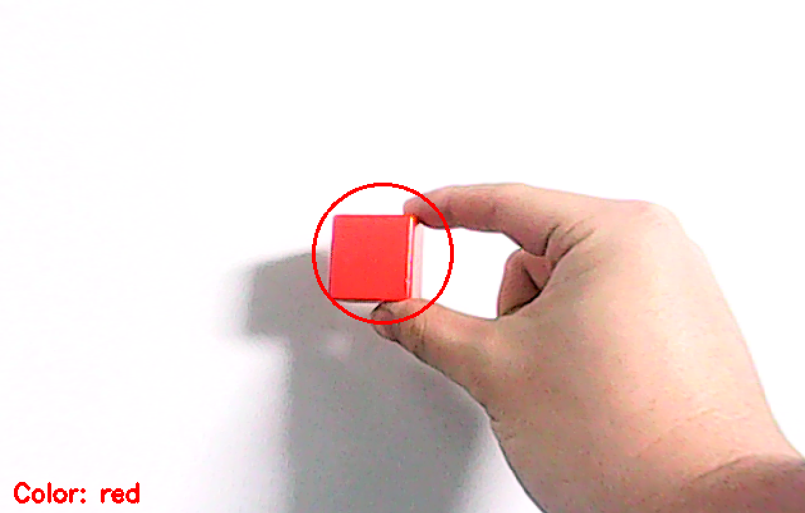
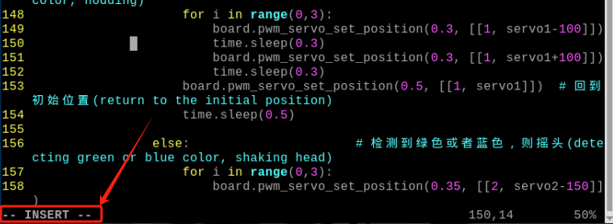
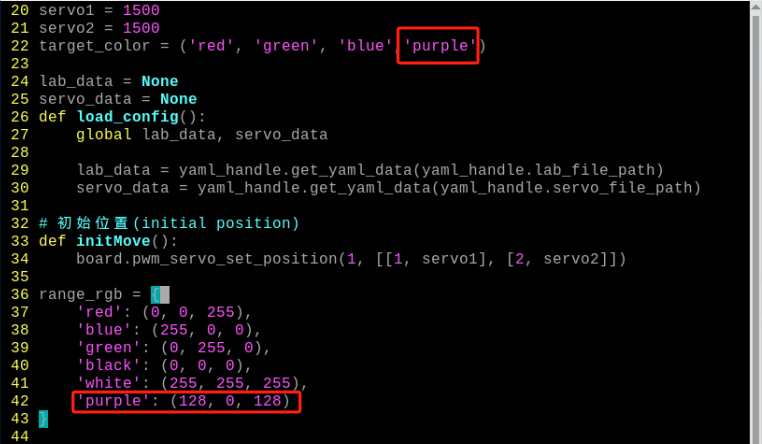
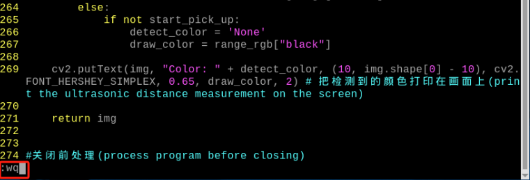
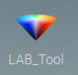
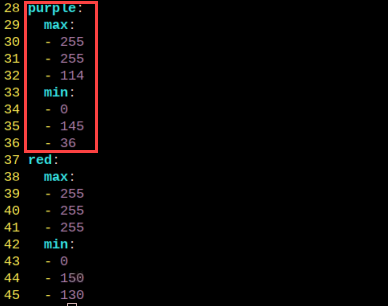

# 4. AI Vision Projects

## 4.1 Single Color Recognition 

In this section, the camera detects colors. When a red ball is recognized, the buzzer will emit a beep, and the red ball will be highlighted in the transmitted image with "**Color: red**" displayed.

### 4.1.1 Program Description

The implementation of color recognition consists of two parts: color detection and execution feedback after recognition.

First, for the color detection part, Gaussian filtering is applied to the image to reduce noise. The Lab color space is then used to convert the color of the object (you can learn more about the Lab color space in the "[**OpenCV Vision Basic Course**](https://docs.hiwonder.com/projects/General_basic_courses/en/latest/docs/6_opencv.html)" section of the tutorial materials).

Next, the object's color within the circle is recognized using color thresholding, followed by masking (masking involves using selected images, shapes, or objects to globally or locally obscure the image being processed). 

After performing morphological operations such as opening and closing on the object image, the object with the largest contour is circled. 
Opening: The image undergoes erosion followed by dilation. This operation removes small objects, smooths shape boundaries, and preserves the area. It can eliminate small noise particles and separate connected objects.  

Closing: The image undergoes dilation followed by erosion. This operation fills small holes within objects, connects nearby objects, closes broken contour lines, and smooths boundaries while preserving the area.

After recognition, the servo and buzzer are set up to provide feedback based on the detected color. For example, when red is detected, the buzzer will emit a sound.

For detailed feedback behavior, please refer to section [**4.1.3 Program Outcome**](#anchor_1_3).

### 4.1.2 Start and Close the Game

:::{Note}
The input command is case-sensitive, and keywords can be auto-completed using the Tab key.
:::

(1) Power on the robot and use VNC Viewer to connect to the remote desktop.


(2) Click the icon  in the top left corner of the system desktop or press the shortcut "**Ctrl+Alt+T**" to open the LX terminal.

(3) Execute the command to navigate to the directory where the program is located, then press Enter: 

```bash
cd TurboPi/function_demo/
```

(4) Enter the command and press Enter to start the program:

```bash
python3 individual_colors.py
```

(5) To close the program, simply press "**Ctrl+C**" in the LX terminal. If it does not close, press it multiple times.

<p id="anchor_1_3"></p>

### 4.1.3 Program Outcome

After starting the game, the camera will be used to detect colors. When a red ball is recognized, the buzzer will emit a beep sound, and the ball will be circled in the transmitted image, with "**Color: red**" printed.



:::{Note}
- During the recognition process, ensure the environment is well-lit to avoid inaccurate recognition due to poor lighting conditions.
-  Ensure that no objects with similar or matching colors to the target are present in the background within the camera's visual range, as this may cause misrecognition.
- If color recognition is inaccurate, refer to the section "[**4.1.5 Function Extensions -> Adjusting Color Thresholds**](#anchor_1_4_1)" in this document to adjust the color threshold settings.
:::

### 4.1.4 Program Analysis

The source code of this program is saved in: **[/home/pi/TurboPi/function_demo/individual_colors.py](https://store.hiwonder.com.cn/docs/turbopi/source_code/ai_aision_projects/individual_colors.zip)**

* **Import Function Library** 

{lineno-start=3}

```python
import os
import sys
sys.path.append('/home/pi/TurboPi/')
import cv2
import math
import time
import datetime
import threading
import yaml_handle
import numpy as np
import HiwonderSDK.Misc as Misc
from HiwonderSDK.PID import PID
```

(1) Import Libraries for OpenCV, Time, Math, and Threading

To use functions from a library, we can call them with the syntax:

```python
time.sleep(0.01)
```

For example, to call the `sleep` function from the `time` library, we use: 
In Python, several libraries like `time`, `cv2`, and `math` are built-in and can be directly imported and used. You can also create your own libraries, like the "**yaml_handle**" file-reading library mentioned above.

(2) Instantiate a Library

Some library names can be long and hard to remember. To simplify function calls, we often instantiate libraries. For example:

```python
import HiwonderSDK.Board as Board
```

After instantiating the library, we can call functions from the `Board` library using the shorter syntax:  

Board.function_name(parameter1, parameter2, ...)

This makes it much easier and more convenient to use.

* **Main Function Analysis** 

In a Python program, `__name__ == '__main__'` indicates the main function of the program, where the program starts by reading an image.

{lineno-start=76}

```python
if __name__ == '__main__':
    import HiwonderSDK.ros_robot_controller_sdk as rrc
    board = rrc.Board()
    cap = cv2.VideoCapture(0)  
    if not cap.isOpened():
        print("Failed to open camera")
        sys.exit(-1)

    while True:
        ret, img = cap.read()
        if ret:
            Frame = run(img)
            cv2.imshow('frame', Frame)
            key = cv2.waitKey(1)
            if key == 27:  
                break
        else:
            time.sleep(0.01)

    cap.release()  
    cv2.destroyAllWindows()
```

(1) Image Processing

Function `run()` for Image Processing

{lineno-start=46}

```python
def run(img):
    global buzzer_flag
    frame_resize = cv2.resize(img, (320, 240), interpolation=cv2.INTER_NEAREST)
    frame_lab = cv2.cvtColor(frame_resize, cv2.COLOR_BGR2LAB)
    frame_mask = cv2.inRange(frame_lab,
                             (lab_data['red']['min'][0], lab_data['red']['min'][1], lab_data['red']['min'][2]),
                             (lab_data['red']['max'][0], lab_data['red']['max'][1], lab_data['red']['max'][2]))
```

① Resizing the Image. The image size is resized to facilitate processing.

```python
frame_resize = cv2.resize(img, (320, 240), interpolation=cv2.INTER_NEAREST)
```

The first parameter `"img"` is the input image.
The second parameter `(320, 240)` specifies the output image size, which can be customized.
The third parameter `interpolation=cv2.INTER_NEAREST` defines the interpolation method.  

`INTER_NEAREST`: Nearest-neighbor interpolation.  

`INTER_LINEAR`: Bilinear interpolation (default if not specified).  

`INTER_CUBIC`: Bicubic interpolation over a 4x4 pixel neighborhood.  

`INTER_LANCZOS4`: Lanczos interpolation over an 8x8 pixel neighborhood.

② Convert the Image to LAB Color Space. The `cv2.cvtColor()` function is used for color space conversion.

```python
frame_lab = cv2.cvtColor(frame_resize, cv2.COLOR_BGR2LAB)
```

The first parameter `"frame_resize"` is the image to be converted.
The second parameter `cv2.COLOR_BGR2LAB` converts the image from BGR format to LAB format. To convert to RGB, use `cv2.COLOR_BGR2RGB`.

③ The image is simplified by converting it to a binary image, containing only 0s and 1s, which reduces the data size and makes it easier to process. The `cv2.inRange()` function is used for thresholding.

{lineno-start=50}

```python
frame_mask = cv2.inRange(frame_lab,
                         (lab_data['red']['min'][0], lab_data['red']['min'][1], lab_data['red']['min'][2]),
                         (lab_data['red']['max'][0], lab_data['red']['max'][1], lab_data['red']['max'][2]))
```

The first parameter `"frame_lab"` is the input image.
The second parameter `(lab_data[i]['min'][0], lab_data[i]['min'][1], lab_data[i]['min'][2])` specifies the lower color threshold.
The third parameter `(lab_data[i]['max'][0], lab_data[i]['max'][1], lab_data[i]['max'][2])` specifies the upper color threshold.

④ Apply Morphological Operations (Opening and Closing)

To reduce interference and smooth the image, morphological operations are applied. Opening is erosion followed by dilation, and closing is dilation followed by erosion. The `cv2.morphologyEx()` function is used.

{lineno-start=54}

```python
opened = cv2.morphologyEx(frame_mask, cv2.MORPH_OPEN, np.ones((6, 6), np.uint8))
closed = cv2.morphologyEx(opened, cv2.MORPH_CLOSE, np.ones((6, 6), np.uint8))
```

The first parameter `"frame_mask"` is the input image.
The second parameter `cv2.MORPH_OPEN` specifies the morphological operation (options include `cv2.MORPH_ERODE`, `cv2.MORPH_DILATE`, `cv2.MORPH_OPEN`, `cv2.MORPH_CLOSE`).
The third parameter `np.ones((6, 6))` specifies the convolution kernel.
The fourth parameter `np.uint8` defines the number of iterations to apply.

⑤ Find the Largest Contour

After completing the image processing, the largest contour is found using the `cv2.findContours()` function.

{lineno-start=56}

```python
contours, _ = cv2.findContours(closed, cv2.RETR_EXTERNAL, cv2.CHAIN_APPROX_SIMPLE)
```

The first parameter `"closed"` is the input image.
The second parameter `cv2.RETR_EXTERNAL` specifies the contour retrieval mode.
The third parameter `cv2.CHAIN_APPROX_NONE)[-2]` specifies the contour approximation method.
The largest contour is selected, and a minimum area threshold is set to ensure the target contour is valid only if its area exceeds this value.

{lineno-start=59}

```python
if areaMaxContour is not None:
    (centerX, centerY), radius = cv2.minEnclosingCircle(areaMaxContour)
    if radius >= 3 and not buzzer_flag:
        board.set_buzzer(1900, 0.1, 0.9, 1)# 设置蜂鸣器响0.1秒(set the buzzer to emit for 0.1 second)
        buzzer_flag = True
```

{lineno-start=35}

```python
for c in contours:
    contour_area_temp = math.fabs(cv2.contourArea(c))
    if contour_area_temp > contour_area_max:
        contour_area_max = contour_area_temp
        if contour_area_temp > 20:
            area_max_contour = c
return area_max_contour
```

⑥ Display the Result

The detected object is circled in the transmitted image, and "**Color: red**" is printed.

{lineno-start=64}

```python
        if buzzer_flag:
            centerX = int(Misc.map(centerX, 0, 320, 0, 640))
            centerY = int(Misc.map(centerY, 0, 240, 0, 480))
            radius = int(Misc.map(radius, 0, 320, 0, 640))
            cv2.circle(img, (int(centerX), int(centerY)), int(radius), range_rgb['red'], 2)
            cv2.putText(img, "Color: red", (int(centerX) - 50, int(centerY) - 20), cv2.FONT_HERSHEY_SIMPLEX, 0.6, range_rgb['red'], 2)
```

(2) Display the Transmitted Image

{lineno-start=84}

```python
while True:
    ret, img = cap.read()
    if ret:
        Frame = run(img)
        cv2.imshow('frame', Frame)
        key = cv2.waitKey(1)
        if key == 27:  
            break
        else:
            time.sleep(0.01)

cap.release()  
cv2.destroyAllWindows() 
```

The function `cv2.imshow()` is used to display an image in a window. The first parameter `"frame"` is the name of the window, and the second parameter `"Frame"` is the content to be displayed. 
It is important to include `cv2.waitKey()` after `cv2.imshow()`, as the image will not be displayed without it. 
The function `cv2.waitKey()` waits for a key press, and the parameter `1` specifies the delay time in milliseconds.

<p id="anchor_2"></p>

### 4.1.5 Function Extensions

<p id="anchor_1_4_1"></p>

* **Adjusting Color Thresholds**

If the color recognition performance is poor during the game experience, it may be necessary to adjust the color threshold. This section uses red as an example, and the same method can be applied to adjust other colors. Follow the steps below:

(1) Double-click  and in the popup interface, click **"Execute."**


(2) Once in the interface, click "**Connect**" to link the camera.


(3) After a successful connection, select "**red**" from the color options in the lower-right corner of the interface.


(4) If the transmitted image does not appear in the popup window, the camera may not have connected successfully. Check that the camera's connection cable is properly plugged in

In the interface shown below, the right side displays the real-time transmitted image, while the left side shows the color to be detected. Point the camera at the red ball, then adjust the six sliders at the bottom so that the red ball area on the left turns entirely white, and the other areas turn black. Afterward, click the "**Save**" button to save the settings.


* **Changing the Default Recognized Color** 

The color recognition program is pre-configured to recognize three colors: red, green, and blue. By default, the program identifies red, triggering the buzzer to emit a beep and drawing a circle around the red ball in the transmitted image, displaying "**Color: red**".

**To change the recognized color to green, follow these steps:**

(1) Enter the following command and press Enter to navigate to the source code directory:

```bash
cd TurboPi/function_demo/
```

(2) Then, enter the following command and press Enter to open the program file:

```bash
sudo vim individual_colors.py
```

(3) Locate the code shown in the image below:


(4) Press the **"i"** key on the keyboard to enter edit mode.


(5) Replace "**red**" (highlighted in red in the image) with "**green**", as shown in the image below:


(6) To save your changes, press the **"Esc"** key, then type **":wq"** (note the colon before "**wq**") and press Enter to save and exit.


(7) Enter the following command and press Enter to start the color recognition functionality: 

```bash
python3 individual_colors.py
```

<p id="anchor_4_2"></p>

## 4.2 Color Recognition

:::{Note}
before color recognition, please adjust the deviation of pan tilt according to the file in "**[Getting Ready\1.9 Adjust Pan-Tilt](https://docs.hiwonder.com/projects/TurboPi/en/latest/docs/1.getting_ready.html#adjust-pan-tilt)**".
:::

TurboPi recognizes color through its camera. When it recognizes red, pan tilt nods. When it recognizes blue and green, pan tilt shakes. 

### 4.2.1 Program Description

Color recognition game is divided into two parts, including color recognition and robot reaction. 
Firstly, TurboPi is programmed to recognize color. Program performs Gaussian filtering to remove noise on the picture. Then transform the color of object through Lab color space. For more detailed information of Lab color space, please check the file in  "**[OpenCV Vision Basic Course](https://docs.hiwonder.com/projects/General_basic_courses/en/latest/docs/6_opencv.html#)**".

Then, recognize the color of object in the circle by color threshold. Next, mask the image. (Mask is to cover the processed image locally or globally with specific image, pattern or item.) 

Next, perform open and close operations on images. Lastly, circle the object with the largest contour.

Open operation: perform corrosion and dilation in sequence on image. The function of open operation is to remove small object, smooth the edge of shape whose area won't be changed. This step can remove small particle noise and break the adhesion between objects.

Closed operation: perform dilation on the image first, then corrosion. The function of closed operation is to to fill small holes in objects, connect adjacent objects, connect disconnected contour lines, and smooth their boundaries without changing the area.

After color recognition, program sets servo, buzzer and RGB light to make TurboPi perform corresponding action based on different color. For example, when recognizing red, TurboPi nods and buzzer emits one beep. 

Please scroll down to get more information about robot's reaction in"[**4.2.3 Program Outcome**](#anchor_2_3)"。

<p id="anchor_2_2"></p>

### 4.2.2 Start and Close the Game

:::{Note}
The input command should be case sensitive. Keywords can be complemented by **"Tab"** key.
:::

(1) Power on the robot and use VNC Viewer to connect to the remote desktop.


(2) Click  or press "**Ctrl+Alt+T**" to enter the LX terminal.

(3) Input command and press Enter to enter the catalog where game programs are stored.

```bash
cd TurboPi/Functions/
```

(4) Input command and press Enter to start the game.

```bash
python3 ColorDetect.py
```

(5) If you need to stop this game, you can press "**Ctrl+C**". If the game cannot be closed, you can try again.

<p id="anchor_2_3"> </p>

### 4.2.3 Program Outcome

After game starts, TurboPi will react as follow when recognizing specific color.

<div style="width: fit-content;margin:0 auto">

| Color |    Buzzer     | Color of RGB light | TurboPi action | Printed content |
| :---: | :-----------: | :----------------: | :------------: | :-------------: |
|  Red  | emit one beep |        red         |     "**nod**"      |       red       |
| Green | emit one beep |       green        |    "**shake**"     |      green      |
| Blue  | emit one beep |        blue        |    "**shake**"     |      blue       |

</div>


:::{Note}

- Please operate in well-lit environment, since light can affect recognition result.
- Remove objects of the same color or similar color to the target object, otherwise TurboPi will misrecognize.
- If TurboPi cannot recognize color accurately, please refer to"[**4.2.5 Function Extension -> Adjust Color Threshold**](#anchor_2_4_1)"
:::


### 4.2.4 Program Analysis

The source code of this program is stored in **[/home/pi/TurboPi/Functions/ColorDetect.py](https://store.hiwonder.com.cn/docs/turbopi/source_code/ai_aision_projects/ColorDetect.zip)**

* **Import Function Library** 

{lineno-start=1}

```python
#!/usr/bin/python3
# coding=utf8
import sys
sys.path.append('/home/pi/TurboPi/')
import cv2
import time
import math
import signal
import Camera
import threading
import numpy as np
import yaml_handle
```

(1) Import OpenCV, time, mathematics and thread libraries. You can call functions in the library in this format, `library name + function name(parameter,parameter...)`

{lineno-start=177}

```python
time.sleep(0.01)
```

time.sleep (0.01) means that `sleep`function in `time` library is called. The function of sleep() is to delay.
There are some built-in libraries in Python, such as `time`, `cv2` and `math`, and you can directly import and call the library. Or you can write a library on your own, such as file reading library `yaml_handle`.

(2) Instantiate function library

Since name of some function libraries are too long and hard to remember, you can instantiate them making it convenient to call.

{lineno-start=276}

```python
import HiwonderSDK.ros_robot_controller_sdk as rrc
board = rrc.Board()
```

If you want to call functions in Board library after instantiation, you can input **"Board.function name(parameter,parameter...)"** which is handier.

* **Analyze Main Function** 

In python, `__name__' == '__main__` is main function of the program. The program firstly callsinit() function to initialize configuration. Configuration initialization includes ports, external devices, and timed interrupts, which are completed during initialization.

{lineno-start=275}

```python
if __name__ == '__main__':
    import HiwonderSDK.ros_robot_controller_sdk as rrc
    board = rrc.Board()
    init()
    start()
    camera = Camera.Camera()
    camera.camera_open(correction=True) # 开启畸变矫正,默认不开启(enable distortion correction, disabled by default)
    signal.signal(signal.SIGINT, manual_stop)
```

(1) Read Camera Image

{lineno-start=283}

```python
while __isRunning:
    img = camera.frame
```

After game starts, store the image in `img`. 

(2) Process Image

Call run() function to process the read image.

{lineno-start=285}

```python
if img is not None:
    frame = img.copy()
    Frame = run(frame) 
```

① The function of img.copy() function is to copy the content of "**img**" to "**frame**".

② run() function starts processing the image.

{lineno-start=185}

```python
# 机器人图像处理(robot images processing)
def run(img):
    global __isRunning
    global start_pick_up
    global detect_color, draw_color, color_list
    
    if not __isRunning:  # 检测是否开启玩法，没有开启则返回原图像(check if the program is enabled, return the original image if not enabled)
        return img
    
    img_copy = img.copy()
    img_h, img_w = img.shape[:2]
    
    frame_resize = cv2.resize(img_copy, size, interpolation=cv2.INTER_NEAREST)
    frame_gb = cv2.GaussianBlur(frame_resize, (3, 3), 3)
    
    frame_lab = cv2.cvtColor(frame_gb, cv2.COLOR_BGR2LAB)  # 将图像转换到LAB空间(convert the image to the LAB space)

    color_area_max = None
    max_area = 0
    areaMaxContour_max = 0
    if not start_pick_up:
        for i in target_color:
            if i in lab_data:
                frame_mask = cv2.inRange(frame_lab,
                                             (lab_data[i]['min'][0],
                                              lab_data[i]['min'][1],
                                              lab_data[i]['min'][2]),
                                             (lab_data[i]['max'][0],
                                              lab_data[i]['max'][1],
                                              lab_data[i]['max'][2]))  #对原图像和掩模进行位运算(perform bitwise operation on the original image and mask)
                opened = cv2.morphologyEx(frame_mask, cv2.MORPH_OPEN, np.ones((3, 3), np.uint8))  # 开运算(opening operation)
                closed = cv2.morphologyEx(opened, cv2.MORPH_CLOSE, np.ones((3, 3), np.uint8))  # 闭运算(closing operation)
                contours = cv2.findContours(closed, cv2.RETR_EXTERNAL, cv2.CHAIN_APPROX_NONE)[-2]  # 找出轮廓(find contours)
                areaMaxContour, area_max = getAreaMaxContour(contours)  # 找出最大轮廓(find the maximal contour)
                if areaMaxContour is not None:
                    if area_max > max_area:  # 找最大面积(find the maximal area)
                        max_area = area_max
                        color_area_max = i
                        areaMaxContour_max = areaMaxContour
        if max_area > 2500:  # 有找到最大面积(the maximal area is found)
            rect = cv2.minAreaRect(areaMaxContour_max)
            box = np.intp(cv2.boxPoints(rect))
            
            cv2.drawContours(img, [box], -1, range_rgb[color_area_max], 2)
            if not start_pick_up:
                if color_area_max == 'red':  # 红色最大(maximum red)
                    color = 1
                elif color_area_max == 'green':  # 绿色最大(maximum green)
                    color = 2
                elif color_area_max == 'blue':  # 蓝色最大(maximum blue)
                    color = 3
                else:
                    color = 0
```

(3) Scale the image to make it convenient for processing.

```python
frame_resize = cv2.resize(img_copy, size, interpolation=cv2.INTER_NEAREST)
```

The first parameter `img_copy` is the input image.

The second parameter `size` is the size of the output image. The size is decided by yourself.

The third parameter `interpolation=cv2.INTER_NEAREST` is the method of  interpolation. 

`INTER_NEAREST`: nearest neighbor interpolation.

`INTER_LINEAR`: bilinear interpolation. If you do not specify the last parameter, this method will be used by default. 

`INTER_CUBIC`: bicubic interpolation within a 4x4 pixel neighborhood. 

`INTER_LANCZOS4`: Lanczos interpolation within 8x8 pixel neighborhood.

(4) Gaussian Filtering

Noise is always mixed in the image, which affects the quality of images and makes the features less obvious. Select the corresponding filtering method according to different noise types. Gaussian filtering, median filtering and mean filtering are common method.

Gaussian filtering is a linear smoothing filter, which is suitable for eliminating Gaussian noise and is widely used in noise reduction during processing image.

{lineno-start=197}

```python
frame_gb = cv2.GaussianBlur(frame_resize, (3, 3), 3)
```

The first parameter `frame_resize` is the input image.
The second parameter `(3, 3)` is the size of Gaussian kernel.
The third parameter `3` is standard deviation of Gaussian kernel in X direction. 

(5) Convert the image into LAB space

cv2.cvtColor() is color space conversion function.

{lineno-start=199}

```python
frame_lab = cv2.cvtColor(frame_gb, cv2.COLOR_BGR2LAB)  # 将图像转换到LAB空间(convert the image to the LAB space)
```

The first parameter `frame_gb` is the input parameter.
The second parameter`cv2.COLOR_BGR2LAB`" refers to format conversion. `cv2.COLOR_BGR2LAB` means convert BGR into LAB.`cv2.COLOR_BGR2RGB`means convert LAB to RGB.

(6) Transform the image into binary image which only has 0 and 1. This step can simplify the image and decrease the amount of data so as to make processing easier.

Call inRange() function in cv2 library to transform the image into binary image.  

{lineno-start=207}

```python
frame_mask = cv2.inRange(frame_lab,
                         (lab_data[i]['min'][0],
                          lab_data[i]['min'][1],
                          lab_data[i]['min'][2]),
                         (lab_data[i]['max'][0],
                          lab_data[i]['max'][1],
                          lab_data[i]['max'][2]))  #对原图像和掩模进行位运算(perform bitwise operation on the original image and mask)
```

The first parameter `frame_lab` is the input image.
The second parameter`(lab_data[i]['min'][0],lab_data[i]['min'][1],lab_data[i]['min'][2])`is lower limit of color threshold.
The third parameter `(lab_data[i]['max'][0],lab_data[i]['max'][1],lab_data[i]['max'][2])` is upper limit of color threshold.

(7) To reduce disturbance and make image smoother, perform open and closed operations on the image. In open operation, corrosion is performed first, then dilation. In closed operation, the order is reversed.

{lineno-start=214}

```python
opened = cv2.morphologyEx(frame_mask, cv2.MORPH_OPEN, np.ones((3, 3), np.uint8))  # 开运算(opening operation)
closed = cv2.morphologyEx(opened, cv2.MORPH_CLOSE, np.ones((3, 3), np.uint8))  # 闭运算(closing operation)
```

The first parameter `frame_mask` is the input image.

The second parameter is the type of operation. `cv2.MORPH_ERODE(corrosion)`, `cv2.MORPH_DILATE(dilation)`, `cv2.MORPH_OPEN(open operation)`， `cv2.MORPH_CLOSE(closed operation)`.

The third parameter `np.ones((3, 3)` is convolution kernel.

The fourth parameter `np.uint8` is the times of application.

(8) Acquire the largest contour

After processing the image, obtain the contour of the target. findContours() in cv2 library is used. 

{lineno-start=216}

```python
contours = cv2.findContours(closed, cv2.RETR_EXTERNAL, cv2.CHAIN_APPROX_NONE)[-2]  # 找出轮廓(find contours)
```

The first parameter `closed` is the input image.

The second parameter `cv2.RETR_EXTERNAL` is the retrieval mode for contours

The third parameter `cv2.CHAIN_APPROX_NONE)[-2]` is approximation method.

Find the largest contour among the obtained contours. To avoid interference, you need to set a minimum. Only when the area is greater than this value, the target contour is valid.

{lineno-start=217}

```python
areaMaxContour, area_max = getAreaMaxContour(contours)  # 找出最大轮廓(find the maximal contour)
if areaMaxContour is not None:
    if area_max > max_area:  # 找最大面积(find the maximal area)
        max_area = area_max
        color_area_max = i
        areaMaxContour_max = areaMaxContour
        if max_area > 2500:  # 有找到最大面积(the maximal area is found)
            rect = cv2.minAreaRect(areaMaxContour_max)
            box = np.intp(cv2.boxPoints(rect))
```

{lineno-start=124}

```python
for c in contours:  # 历遍所有轮廓(iterate through all contours)
    contour_area_temp = math.fabs(cv2.contourArea(c))  # 计算轮廓面积(calculate contour area)
    if contour_area_temp > contour_area_max:
        contour_area_max = contour_area_temp
        if contour_area_temp > 300:  # 只有在面积大于300时，最大面积的轮廓才是有效的，以过滤干扰(only the maximal contour with an area greater than 300 is considered valid to filter out interference)
            area_max_contour = c

return area_max_contour, contour_area_max  # 返回最大的轮廓(return the maximal contour)
```

(9) Get the color with the largest area in the image through the judgment statement.

{lineno-start=204}

```python
if not start_pick_up:
    if color_area_max == 'red':  # 红色最大(maximum red)
        color = 1
    elif color_area_max == 'green':  # 绿色最大(maximum green)
        color = 2
    elif color_area_max == 'blue':  # 蓝色最大(maximum blue)
        color = 3
    else:
        color = 0
        color_list.append(color)
        if len(color_list) == 3:  # 多次判断(multiple detection)
            # 取平均值(get average value)
            color = np.mean(np.array(color_list))
            color_list = []
            start_pick_up = True
            if color == 1:
                detect_color = 'red'
                draw_color = range_rgb["red"]
            elif color == 2:
                detect_color = 'green'
                draw_color = range_rgb["green"]
            elif color == 3:
                detect_color = 'blue'
                draw_color = range_rgb["blue"]
            else:
                start_pick_up = False
                detect_color = 'None'
                draw_color = range_rgb["black"]
```

(10) Display Camera Returned Image

{lineno-start=288}

```python
frame_resize = cv2.resize(Frame, (320, 240)) # 画面缩放到320*240(resize the image to 320*240)
cv2.imshow('frame', frame_resize)
key = cv2.waitKey(1)
if key == 27:
    break
```

The function of `cv2.resize()` function is to scale the processed image to an appropriate size.

The function of the function `cv2.imshow()` is to display the image in the window. `frame` is the window name, `frame_resize` is the display content. There must be `cv2.waitKey()`, otherwise it cannot be displayed.

The function of `cv2.waitKey()` is to wait for key input. Parameter "1" is the delay time.

* **Analyze child thread** 

Motion function `move()` runs as child thread. When TurboPi recognizes color, move() function runs. 

This step is mainly to judge the image processing results, and then let TurboPi perform different actions, including controlling RGB light, buzzer and other modules.

{lineno-start=133}

```python
# 机器人移动逻辑处理(robot movement logic processing)
def move():
    global _stop
    global __isRunning
    global detect_color
    global start_pick_up

    while True:
        if __isRunning:
            if detect_color != 'None' and start_pick_up:  # 检测到色块(detected color block)
                board.set_buzzer(1900, 0.1, 0.9, 1)# 设置蜂鸣器响0.1秒(set the buzzer to emit for 0.1 second)
                set_rgb(detect_color) # 设置扩展板上的彩灯与检测到的颜色一样(set the colored light on the expansion board to match the detected color)

                if detect_color == 'red' :  # 检测到红色,点头(detecting red color, nodding)
                    for i in range(0,3):
                        board.pwm_servo_set_position(0.3, [[1, servo1-100]])
                        time.sleep(0.3)
                        board.pwm_servo_set_position(0.3, [[1, servo1+100]])
                        time.sleep(0.3)
                        board.pwm_servo_set_position(0.5, [[1, servo1]])  # 回到初始位置(return to the initial position)
                        time.sleep(0.5)       

                    else:                      # 检测到绿色或者蓝色，则摇头(detecting green or blue color, shaking head)
                        for i in range(0,3):
                            board.pwm_servo_set_position(0.35, [[2, servo2-150]])
                            time.sleep(0.35)
                            board.pwm_servo_set_position(0.35, [[2, servo2+150]])
                            time.sleep(0.35)
                            board.pwm_servo_set_position(0.5, [[2, servo2]])  # 回到初始位置(return to the initial position)
                            time.sleep(0.5)

                            _stop = True
                            detect_color = 'None'
                            start_pick_up = False
                            set_rgb(detect_color)

                        else:
                            time.sleep(0.01)
                        else:
                            if _stop:
                                initMove()  # 回到初始位置(return to the initial position)
                                _stop = False
                                time.sleep(1.5)               
                                time.sleep(0.01)
```

(1)  Turn on RGB light

RGB light emits the light of the recognized color.

{lineno-start=106}

```python
#设置扩展板的RGB灯颜色使其跟要追踪的颜色一致(set the RGB lights on the expansion board to match the color to be tracked)
def set_rgb(color):
    if color == "red":
        board.set_rgb([[1, 255, 0, 0], [2, 255, 0, 0]])
    elif color == "green":
        board.set_rgb([[1, 0, 255, 0], [2, 0, 255, 0]])
    elif color == "blue":
        board.set_rgb([[1, 0, 0, 255], [2, 0, 0, 255]])
    else:
        board.set_rgb([[1, 0, 0, 0], [2, 0, 0, 0]])
```

(2) Turn on Buzzer

{lineno-start=144}

```python
board.set_buzzer(1900, 0.1, 0.9, 1)# 设置蜂鸣器响0.1秒(set the buzzer to emit for 0.1 second)
```

`setBuzzer()` function is used to turn on buzzer. Take `set_buzzer(1900, 0.1, 0.9, 1)` as example.
The first parameter `1900` is the frequency.

The second parameter `0.1` is the buzzer time, in second.

The third parameter `0.9` is the time of buzzer stop sounding, in second.

The fourth parameter`1` is the repeat times of the mode, by default for one time.

(3) Make robot car move

Judge whether the color recognized by TurboPi is consistent with the set color. When recognizing specific color, it will nod or shake.

{lineno-start=147}

```python
if detect_color == 'red' :  # 检测到红色,点头(detecting red color, nodding)
    for i in range(0,3):
        board.pwm_servo_set_position(0.3, [[1, servo1-100]])
        time.sleep(0.3)
        board.pwm_servo_set_position(0.3, [[1, servo1+100]])
        time.sleep(0.3)
        board.pwm_servo_set_position(0.5, [[1, servo1]])  # 回到初始位置(return to the initial position)
        time.sleep(0.5)       

    else:                      # 检测到绿色或者蓝色，则摇头(detecting green or blue color, shaking head)
        for i in range(0,3):
            board.pwm_servo_set_position(0.35, [[2, servo2-150]])
            time.sleep(0.35)
            board.pwm_servo_set_position(0.35, [[2, servo2+150]])
            time.sleep(0.35)
            board.pwm_servo_set_position(0.5, [[2, servo2]])  # 回到初始位置(return to the initial position)
            time.sleep(0.5)
```

Board.setPWMServoPulse() function is used to control single servo. Take `board.pwm_servo_set_position(0.3, [[1, servo1-100]])` as example.

The first parameter `0.3` is the duration of servo, in seconds. 

The second parameter `[[1, servo1-100]]` is the servo position to be set. It is a list where each element is a tuple containing the servo number and position value.

### 4.2.5 Function Extension

<p id="anchor_2_4_1"></p>

* **Adjust Color threshold** 

If TurboPi cannot recognize color correctly, you need to adjust color threshold. Take adjusting red as example. Instruction is also applicable to other colors.

(1) Double click  open this software. Then click "**execute**". 


(2) Click "**Connect**" to turn on camera.


(3) After camera returned image shows up. Select "red" in drop-down menu.


(4) If there is no camera returned image, camera is not connected. Please check whether the camera cable is connected to Raspberry Pi board.

Image on right is real-time image transmitted by camera, and image on left displays the collected color. Focus camera on red ball. Then drag six sliders below to make the red ball turn white and other area turn black. After that, click "Save" button.


<p id="anchor_2_4_2"></p>

* **Change Default Recognition Color** 

There are three built-in colors, including red, green and blue, in the program. The default recognition color is red. 

You can change the default recognition color in the program, for example green. 

(1) Input command and press Enter to switch to the path where source codes are stored.

```bash
cd TurboPi/Functions/
```

(2) Input command and press Enter to open program file.

```bash
sudo vim ColorDetect.py
```

(3) Find the following codes.


:::{Note}
input line number, and then press "**Shift+G**" to jump to corresponding line. The line number in the above figure is for reference only, please refer to the file you open.
:::

(4) Press "**I**" key to start editing.



(5) Replace "**red**" with "green" in "**detect_color == 'red'**" as pictured:


(6) After modification, press "**Esc**" key, input "**:wq**" and then press Enter to save and close the file.

```bash
:wq
```

(7) Input command and press Enter to start color recognition.

```bash
python3 ColorDetect.py
```

* **Add New Recognition Color** 

Besides three built-in colors, you can add other colors, such as purple.

(1) Double click  open this software. Then click "**execute**". 


(2) Click "**Connect**" to turn on camera.


(3) Click "**Add**" and then name the color. After that, click "**OK**".


(4) Select the color you just added. For example, purple.


(5) Face the camera to the purple ball. Drag sliders of L, A and B to make the purple ball on left screen turn white and other area turn black.


(6) Lastly, click "**Save**" button to save the adjusted color threshold.

(7) Check whether the value is modified and written to the program. Input and press Enter to enter the catalog where the program source code is stored

```bash
cd TurboPi
```

(8) Input command and press Enter to open program file.

```bash
sudo vim lab_config.yaml
```

(9) Find the following parameters to check threshold value of purple.


(10) According to step 1-2 of the "[**4.4.2 Change Default Recognition Color**](#anchor_2_4_2)" and press Enter to open program file. Next, press "**I**" key to start editing. Find the following codes.


(11) Input `purple`and `purple': (128, 0, 128)`. (128, 0, 128) represents RGB value of purple. The order of the RGB order is needed to be switched to BGR. Therefore, the value of purple here is still (128, 0, 12). You can go to "[**RGB Color Extractor**](http://tools.jb51.net/static/colorpicker)" to check search the value of RGB.



(12) Jump to the codes as pictured.


(13) Add the content as marked manually. Set the light on the expansion board emits purple as pictured. The RGB value is purple here, you can go to "**RGB Color Extractor**" to check the RGB value of color.


(14) Find the following codes.


(15) Input the content as the figure shown. When the purple area is at its maximum, set color to 4 as shown in the following diagram:


(16) Locate the following codes.


(17) Input the content as the figure shown. Determine whether the purple color is recognized.


(18) After modification, press "**Esc**", input "**:wq**" and then press Enter to save and close the file.

```bash
:wq
```



(19)  Restart this game according to the instructions in "[**4.2.2 Start and Close the Game**](#anchor_2_2)". Hold a purple item in front of the camera. When recognizing purple, TurboPi will shake. If you want to make it nod, you can make purple default recognition color according to "[**4.2.5 Function Extension ->Change Default Recognition Color**](#anchor_2_4_2)".

(20) If you want to add other colors, you can follow previous steps.


## 4.3 Target Position Recognition

:::{Note}
before color recognition, please adjust the deviation of pan tilt according to the file in "**[Getting Ready\1.9 Adjust Pan-Tilt](https://docs.hiwonder.com/projects/TurboPi/en/latest/docs/1.getting_ready.html#adjust-pan-tilt)**".
:::

In this lesson, the camera will be used to recognize red, green, and blue balls. The detected balls will be highlighted in the live feed, and their XY coordinates will be displayed.

### 4.3.1 Program Description 

The implementation of target tracking can be divided into two parts: color recognition and position marking.

First, for the color recognition part, Gaussian filtering is applied to the image for noise reduction. The Lab color space is then used to convert the color of the objects (for more details on the Lab color space, please refer to the "**[OpenCV Vision Basic Course](https://docs.hiwonder.com/projects/General_basic_courses/en/latest/docs/6_opencv.html)**").

Next, color thresholding is used to identify the color of objects within the circle. The image is then masked (masking involves using a selected image, shape, or object to globally or locally occlude the processed image).

After performing morphological operations (open and close operations) on the object's image, the largest contour is outlined with a circle.

Opening operation: The image is eroded first and then dilated. This operation is used to remove small objects, smooth shape boundaries, and preserve the overall area. It helps remove small noise particles and separate objects that are connected.

Closing operation: The image is dilated first and then eroded. This operation is used to fill small holes within the objects, connect adjacent objects, and reconnect broken contour lines while smoothing the boundaries without changing the area.

Position marking requires specific detection algorithms. The basic principle is to search for areas in the image that match predefined features or patterns, then return the position and bounding box of these areas.

### 4.3.2 Start and Close the Game

:::{Note}

The input of commands must strictly distinguish between uppercase and lowercase letters, as well as spaces. Additionally, you can use the "**Tab**" key on the keyboard to auto-complete keywords.

:::

(1)  Power on the robot and use VNC Viewer to connect to the remote desktop.


(2) Click the icon  in the top left corner of the system desktop or press the shortcut **"Ctrl+Alt+T"** to open the LX terminal.

(3) In the terminal, enter the command to navigate to the directory where the program is located, then press Enter:

```bash
cd TurboPi/function_demo/
```

(4) Enter the command and press Enter to start the program:

```bash
python3 Target_location_identification.py
```

(5) To close the program, simply press "**Ctrl+C**" in the LX terminal. If it does not close, press it multiple times.

### 4.3.3 Program Outcome

The program defaults to recognizing red, green, and blue balls. After recognition, it will highlight the objects in the transmitted image and display their XY coordinates.


:::{Note}
- During the recognition process, ensure the environment is well-lit to avoid inaccurate recognition due to lighting issues.
-  Ensure there are no objects with similar or identical colors to the target colors within the camera's field of view to prevent misrecognition.
- If color recognition is inaccurate, refer to the section "[**4.3.5 Function Extension -> Adjusting Color Threshold**](#anchor_3_4_1)" in this document to adjust the color threshold settings.
:::


### 4.3.4 Program Analysis

The source code for this program is located at：**[/home/pi/TurboPi/function_demo/Target_location_identification.py](https://store.hiwonder.com.cn/docs/turbopi/source_code/ai_aision_projects/Target_location_identification.zip)**

* **Importing Libraries** 

{lineno-start=1}

```python
#!/usr/bin/python3
# coding=utf8
import os
import sys
sys.path.append('/home/pi/TurboPi/')
import cv2
import math
import time
import datetime
import threading
import yaml_handle
import numpy as np
import HiwonderSDK.Misc as Misc
from HiwonderSDK.PID import PID
```

(1)  Import the necessary libraries, including OpenCV, time, math, threading, and inverse kinematics. To call a function from a library, use the format `LibraryName.FunctionName(Parameters)`. For example:

{lineno-start=143}

```python
time.sleep(0.01)
```

This calls the `sleep` function from the `time` library, which is used for adding delays.
Python comes with several built-in libraries like `time`, `cv2`, `math`, which can be imported directly. You can also create your own libraries, such as the "yaml_handle" file reading library.

(2) Instantiating Libraries  

Sometimes, library names are long and hard to remember. To make function calls more convenient, we often instantiate libraries using shorter names. For example:

{lineno-start=13}

```python
import HiwonderSDK.Misc as Misc
```

After instantiation, functions from the `Board` library can be called as:

Board.FunctionName(Parameters)

This makes calling functions much easier.

* **Main Function Analysis** 

In a Python program, the `if __name__ == '__main__':` block indicates the main function. The program starts by opening the camera and reading the video stream. The `read()` method captures each frame of the image, where the program searches for and marks the color of the ball, then displays the result. The video is displayed through a loop, and once the display is finished, the `release()` function is called to release the resources.

{lineno-start=126}

```python
if __name__ == '__main__':
    import HiwonderSDK.ros_robot_controller_sdk as rrc
    board = rrc.Board()
    cap = cv2.VideoCapture(0)
    if not cap.isOpened():
        print("Failed to open camera")
        sys.exit(-1)

    while True:
        ret, img = cap.read()
        if ret:
            frame = run(img)
            cv2.imshow('Frame', frame)
            key = cv2.waitKey(1)
            if key == 27:  # Press ESC to exit
                break
        else:
            time.sleep(0.01)

    cap.release()
    cv2.destroyAllWindows()
```

(1) Capturing Camera Image

{lineno-start=129}

```python
cap = cv2.VideoCapture(0)
```

When the program starts, the camera is initialized.

(2)  Image Processing

① The `run()` function handles image processing.

{lineno-start=68}

```python
def run(img):
    global draw_color
    global detect_color
        
    img_copy = img.copy()
    img_h, img_w = img.shape[:2]

    frame_resize = cv2.resize(img_copy, size, interpolation=cv2.INTER_NEAREST)
    frame_gb = cv2.GaussianBlur(frame_resize, (3, 3), 3)
    frame_lab = cv2.cvtColor(frame_gb, cv2.COLOR_BGR2LAB)
```

**② Resize the image to make it easier to process.**

{lineno-start=75}

```python
frame_resize = cv2.resize(img_copy, size, interpolation=cv2.INTER_NEAREST)
```

The first parameter `img_copy` is the input image.
The second parameter `size` is the size of the output image, which can be set as needed.
The third parameter `interpolation=cv2.INTER_NEAREST` is the interpolation method. Options include:
`INTER_NEAREST`: Nearest-neighbor interpolation.
`INTER_LINEAR`: Bilinear interpolation (default if no other method is specified).
`INTER_CUBIC`: Bicubic interpolation in a 4x4 pixel neighborhood.
`INTER_LANCZOS4`: Lanczos interpolation in an 8x8 pixel neighborhood.

**③ Apply Gaussian Blur to reduce noise**

Gaussian blur is a linear smoothing filter used to eliminate Gaussian noise and is widely used in image denoising.

{lineno-start=76}

```python
frame_gb = cv2.GaussianBlur(frame_resize, (3, 3), 3)
```

The first parameter `frame_resize` is the input image.

The second parameter `(3, 3)` is the size of the Gaussian kernel.

The third parameter `3` is the standard deviation of the Gaussian kernel in the X-direction.

**④ Convert the image to LAB color space.**

{lineno-start=77}

```python
frame_lab = cv2.cvtColor(frame_gb, cv2.COLOR_BGR2LAB)
```

The first parameter `frame_gb` is the input image.
The second parameter `cv2.COLOR_BGR2LAB` specifies the conversion from BGR to LAB format. To convert to RGB, use `cv2.COLOR_BGR2RGB`.

**⑤ Convert the image to a binary image with only 0s and 1s, simplifying the image and reducing data for easier processing.**

{lineno-start=85}

```python
frame_mask = cv2.inRange(frame_lab,
                         (lab_data[i]['min'][0],
                          lab_data[i]['min'][1],
                          lab_data[i]['min'][2]),
                         (lab_data[i]['max'][0],
                          lab_data[i]['max'][1],
                          lab_data[i]['max'][2]))
```

The first parameter`frame_lab`is the input image.

The second parameter`(lab_data[i]['min'][0],lab_data[i]['min'][1],lab_data[i]['min'][2])`is the lower threshold for the color.

The third parameter`(lab_data[i]['max'][0],lab_data[i]['max'][1],lab_data[i]['max'][2])`is the upper threshold for the color.

 Perform erosion and dilation to smooth the image and reduce interference.

Erosion reduces the size of foreground objects and eliminates small objects, while dilation increases the size of foreground objects and fills small holes.

{lineno-start=92}

```python
eroded = cv2.erode(frame_mask, None, iterations=2)
dilated = cv2.dilate(eroded, None, iterations=2)
```

**⑥ Find the contour with the largest area**

After the image processing steps, use the `cv2.findContours()` function to find contours:

{lineno-start=94}

```python
contours = cv2.findContours(dilated, cv2.RETR_EXTERNAL, cv2.CHAIN_APPROX_SIMPLE)[-2]
```

The first parameter `dilated` is the input image.

The second parameter `cv2.RETR_EXTERNAL` specifies the contour retrieval mode.

The third parameter `cv2.CHAIN_APPROX_NONE)[-2]` specifies the contour approximation method.

The program searches for the largest contour and sets a threshold area to ensure the detected contour is valid.

{lineno-start=95}

```python
areaMaxContour, area_max = getAreaMaxContour(contours)
if areaMaxContour is not None:
    if area_max > max_area:
        max_area = area_max
        color_area_max = i
        areaMaxContour_max = areaMaxContour

if max_area > 200:
```

 **⑦ Extract the position information**

Use `cv2.putText()` to draw text on the image:

{lineno-start=122}

```python
cv2.putText(img, "Color: " + detect_color, (10, img.shape[0] - 10), cv2.FONT_HERSHEY_SIMPLEX, 0.65, draw_color, 2)
```

The first parameter `img` is the input image.

The second parameter `"Color: " + detect_color` is the text to display (e.g., the detected color).

The third parameter `(10, img.shape[0] - 10)` and `(centerX, centerY - 20)` specify the starting coordinates for the text (bottom-left position).

The fourth parameter `cv2.FONT_HERSHEY_SIMPLEX` specifies the font type.

The fifth parameter `0.65` is the scaling factor for the font size.

The sixth parameter `draw_color` is the color of the text.

The seventh parameter `2` specifies the thickness of the text line.

**⑧ Displaying the Return Image**

{lineno-start=136}

```python
if ret:
    frame = run(img)
    cv2.imshow('Frame', frame)
    key = cv2.waitKey(1)
    if key == 27:  # Press ESC to exit
        break
```

The `cv2.imshow()` function is used to display the image in a window. The first parameter is the window name (e.g., 'Frame'), and the second parameter is the image to display.  

The function `cv2.waitKey()` is used to wait for a key press; the parameter `1` specifies the delay time.

### 4.3.5 Function Extension

<p id="anchor_3_4_1"></p>

* **Adjusting Color Threshold** 

During the game experience, if the color recognition of objects is not accurate, you may need to adjust the color threshold. This section uses adjusting the red color as an example; the process for adjusting other colors is similar. Follow the steps below:

(1) Double-click the system desktop icon  and click "**Execute**" in the pop-up window.


(2) Once the interface opens, click "**Connect**".


(3) After a successful connection, select "**red**" from the color options in the bottom-right corner of the interface.


(4) If the transmitted image does not appear in the pop-up window, it indicates the camera is not connected properly. Check the camera connection cable to ensure it is securely connected.

The image on the right side of the interface shows the real-time transmitted video, and the left side shows the color to be captured.

Point the camera at the red color block, and then adjust the six sliders at the bottom to ensure that the red color block on the left side of the screen turns completely white, while other areas remain black.

Finally, click the "**Save**" button to save the data.


* **Adding New Recognizable Colors** 

In addition to the three built-in colors, you can add other recognizable colors. For example, let's add purple as a new recognizable color. Follow these steps:

(1) Double-click the system desktop icon, then select "**Execute**" in the pop-up prompt box.


(2) In the pop-up interface, select "**Connect**".


(3) Click "**Add**" and give the new color a name (e.g. "**purple**"), then click "**OK**".


(4) Next, click the dropdown button in the color selection box and choose "**purple**".


(5) Point the camera at the purple object, and adjust the L, A, and B sliders until the purple area in the left-side image turns white, while the rest of the image turns black.


(6) Finally, click "**Save**" to save the adjusted color threshold.


(7)  After completing the modifications, you can check if the new values have been successfully written by following these steps:

Input the command and press Enter to go to the program directory.

```bash
cd TurboPi/
```

(8) Then input the following command and press Enter to open the program file:

```bash
sudo vim lab_config.yaml
```

(9) In the opened color threshold program file, you can check the purple color threshold parameters.



(10) Find the code shown below.


Manually add `'purple': (255, 255, 114)`, where `(255, 255, 114)` is the max value of the purple threshold you viewed in Step 9. The updated code should look like this:

```python
'purple': (255, 255, 114)
```


## 4.4 Target Tracking

:::{Note}
before color recognition, please adjust the deviation of pan tilt according to the file in "**[Getting Ready\1.9 Adjust Pan-Tilt](https://docs.hiwonder.com/projects/TurboPi/en/latest/docs/1.getting_ready.html#id21)**".
:::

TurboPi recognizes color and read the location of target through its camera. Then it will move with the target.

### 4.4.1 Program Description 

Target tracking game is divided into two parts, including recognition and tracking.

Firstly, TurboPi is programmed to recognize color. Program performs Gaussian filtering to remove noise on the picture. Then transform the color of object through Lab color space. For more detailed information of Lab color space, please check the file in "**[OpenCV Vision Basic Course](https://docs.hiwonder.com/projects/General_basic_courses/en/latest/docs/6_opencv.html#)**".

Then, recognize the color of object in the circle by color threshold. Next, mask the image. (Mask is to cover the processed image locally or globally with specific image, pattern or item.)

After open and closed operations, circle the item with the largest contour. 

Open operation: perform corrosion and dilation in sequence on image. The function of open operation is to remove small object, smooth the edge of shape whose area won't be changed. This step can remove small particle noise and break the adhesion between objects.

Closed operation: perform dilation on the image first, then corrosion. The function of closed operation is to to fill small holes in objects, connect adjacent objects, connect disconnected contour lines, and smooth their boundaries without changing the area.

PID algorithm is used to realize color tracking. Comparing the pixel coordinate of the image of target with the coordinate of image center, reduce the distance between two coordinates to achieve target tracking  

PID algorithm is the most widely used autonomous controller which controls a process according to the ratio of errors, Proportional (P), Integral (I), and Derivative (D). With simple logic, it is easy to realize and can be widely applicable. And its control parameters are separate and it is easy to select the parameter.

<p id="anchor_4_2"></p>

### 4.4.2 Start and Close the Game

:::{Note}
The input command should be case sensitive. Keywords can be complemented by **"Tab"** key.
:::

(1) Power on the robot and use VNC Viewer to connect to the remote desktop.


(2) Click  or press "**Ctrl+Alt+T"** to enter the LX terminal.

(3) Input command and press Enter to enter the catalog where game programs are stored.

```bash
cd TurboPi/Functions/
```

(4) Input command and press Enter to start the game.

```bash
python3 ColorTracking.py
```

(5) If you need to stop this game, you can press **"Ctrl+C"**. If the game cannot be closed, you can try again.

### 4.4.3  Program Outcome

The program defaults to track red. After game starts, camera and car will move with red item.


:::{Note}

- Please operate in well-lit environment, since light can affect recognition result.
- Remove objects of the same color or similar color to the target object, otherwise TurboPi will misrecognize.
- If TurboPi cannot recognize color accurately, please refer to "[**4.4.5 Function Extension -> Adjust Color Threshold**](#anchor_4_4_1)".
:::


### 4.4.4 Program Analysis

The source code of this program is stored in **[/home/pi/TurboPi/Functions/ColorTracking.py]()**

* **Import Function Library** 

{lineno-start=1}

```python
#!/usr/bin/python3
# coding=utf8
import sys
sys.path.append('/home/pi/TurboPi/')
import cv2
import time
import math
import signal
import Camera
import threading
import numpy as np
import yaml_handle
import HiwonderSDK.PID as PID
import HiwonderSDK.Misc as Misc
import HiwonderSDK.mecanum as mecanum
```

(1) Import OpenCV, time, mathematics and thread libraries. You can call functions in the library in this format, 'library name + function name(parameter,parameter...)'.

```python
time.sleep(0.01)
```

time.sleep (0.01) means that `sleep` function in 'time' library is called. The function of sleep() is to delay.
There are some built-in libraries in Python, such as `time`, `cv2` and `math`  and you can directly import and call the library. Or you can write a library on your own, such as file reading library `yaml_handle`.

(2) Instantiate function library

Since name of some function libraries are too long and hard to remember, you can instantiate them making it convenient to call.

{lineno-start=306}

```python
import HiwonderSDK.ros_robot_controller_sdk as rrc
board = rrc.Board()
```

If you want to call functions in Board library after instantiation, you can input `Board.function name(parameter,parameter...)` which is handier.

* **Analyze Main Function** 

In python, `__name__ == '__main__:'` is main function of the program. The program firstly callsinit() function to initialize configuration. Configuration initialization includes ports, external devices, and timed interrupts, which are completed during initialization.

After initialization, set the default tracked color as red, and then start target tracking. 

{lineno-start=305}

```python
if __name__ == '__main__':
    import HiwonderSDK.ros_robot_controller_sdk as rrc
    board = rrc.Board()
    init()
    start()
    target_color = ('red',)
    camera = Camera.Camera()
    camera.camera_open(correction=True) # 开启畸变矫正,默认不开启(enable distortion correction, disabled by default)
    signal.signal(signal.SIGINT, manual_stop)
```

(1) Read Camera Image

Call `run()` function to process the read image.

{lineno-start=314}

```python
while __isRunning:
    img = camera.frame
```

After game starts, store the image in `img`.

(2) Process Image

Call run() function to process the read image.

{lineno-start=316}

```python
if img is not None:
    frame = img.copy()
    Frame = run(frame) 
```

① The function of img.copy() function is to copy the content of "img" to "frame".

② run() function starts processing the image.

{lineno-start=246}

```python
# 机器人图像处理(robot images processing)
def run(img):
    global __isRunning, color_radius
    global color_center_x, color_center_y

    img_copy = img.copy()
    img_h, img_w = img.shape[:2]

    if not __isRunning:   # 检测是否开启玩法，没有开启则返回原图像(check if the program is enabled, return the original image if not enabled)
        return img

    frame_resize = cv2.resize(img_copy, size, interpolation=cv2.INTER_NEAREST)
    frame_gb = cv2.GaussianBlur(frame_resize, (3, 3), 3)   
    frame_lab = cv2.cvtColor(frame_gb, cv2.COLOR_BGR2LAB)  # 将图像转换到LAB空间(convert the image to the LAB space)

    area_max = 0
    areaMaxContour = 0
    for i in target_color:
        if i in lab_data:
            frame_mask = cv2.inRange(frame_lab,
                                     (lab_data[i]['min'][0],
                                      lab_data[i]['min'][1],
                                      lab_data[i]['min'][2]),
                                     (lab_data[i]['max'][0],
                                      lab_data[i]['max'][1],
                                      lab_data[i]['max'][2]))  #对原图像和掩模进行位运算 (perform bitwise operation on the original image and mask)
            opened = cv2.morphologyEx(frame_mask, cv2.MORPH_OPEN, np.ones((3, 3), np.uint8))  # 开运算(opening operation)
            closed = cv2.morphologyEx(opened, cv2.MORPH_CLOSE, np.ones((3, 3), np.uint8))  # 闭运算(closing operation)
            contours = cv2.findContours(closed, cv2.RETR_EXTERNAL, cv2.CHAIN_APPROX_NONE)[-2]  # 找出轮廓(find contours)
            areaMaxContour, area_max = getAreaMaxContour(contours)  # 找出最大轮廓(find the maximal contour)
            if area_max > 1000:  # 有找到最大面积(the maximal area is found)
                (center_x, center_y), radius = cv2.minEnclosingCircle(areaMaxContour)  # 获取最小外接圆(get the minimum circumcircle)
                color_radius = int(Misc.map(radius, 0, size[0], 0, img_w))
                color_center_x = int(Misc.map(center_x, 0, size[0], 0, img_w))
                color_center_y = int(Misc.map(center_y, 0, size[1], 0, img_h))
                if color_radius > 300:
                    color_radius = 0
                    color_center_x = -1
                    color_center_y = -1
                    return img

                cv2.circle(img, (color_center_x, color_center_y), color_radius, range_rgb[i], 2)

            else:
                color_radius = 0
                color_center_x = -1
                color_center_y = -1
```

- **Scale the image to make it convenient for processing**

  {lineno-start=256}

```python
frame_resize = cv2.resize(img_copy, size, interpolation=cv2.INTER_NEAREST)
```

The first parameter `img_copy` is the input image.
The second parameter `size` is the size of the output image. The size is decided by yourself.
The third parameter`interpolation=cv2.INTER_NEAREST` is the method of  interpolation. INTER_NEAREST: nearest neighbor interpolation. INTER_LINEAR: bilinear interpolation. If you do not specify the last parameter, this method will be used by default. INTER_CUBIC: bicubic interpolation within a 4x4 pixel neighborhood. INTER_LANCZOS4: Lanczos interpolation within 8x8 pixel neighborhood.

- **Gaussian Filtering**

Noise is always mixed in the image, which affects the quality of images and makes the features less obvious. Select the corresponding filtering method according to different noise types. Gaussian filtering, median filtering and mean filtering are common method.
Gaussian filtering is a linear smoothing filter, which is suitable for eliminating Gaussian noise and is widely used in noise reduction during processing image.

{lineno-start=257}

```python
frame_gb = cv2.GaussianBlur(frame_resize, (3, 3), 3) 
```

The first parameter `frame_resize`is the input image.

The second parameter `(3, 3)` is the size of Gaussian kernel.

The third parameter `3` is standard deviation of Gaussian kernel in X direction.

- **Convert the image into LAB space. cv2.cvtColor() is color space conversion function**

  {lineno-start=258}

```python
frame_lab = cv2.cvtColor(frame_gb, cv2.COLOR_BGR2LAB)  # 将图像转换到LAB空间(convert the image to the LAB space)
```

The first parameter `frame_gb` is the input parameter.

The second parameter`cv2.COLOR_BGR2LAB` refers to format conversion. `cv2.COLOR_BGR2LAB` means convert BGR into LAB. `cv2.COLOR_BGR2RGB` means convert LAB to RGB.

- **Transform the image into binary image which only has 0 and 1. This step can simplify the image and decrease the amount of data so as to make processing easier.**

Call inRange() function in cv2 library to transform the image into binary image.

{lineno-start=264}

```python
frame_mask = cv2.inRange(frame_lab,
                         (lab_data[i]['min'][0],
                          lab_data[i]['min'][1],
                          lab_data[i]['min'][2]),
                         (lab_data[i]['max'][0],
                          lab_data[i]['max'][1],
                          lab_data[i]['max'][2]))  #对原图像和掩模进行位运算 (perform bitwise operation on the original image and mask)
```

The first parameter`frame_lab` is the input image.
The second parameter `(lab_data[i]['min'][0],lab_data[i]['min'][1],lab_data[i]['min'][2])` is lower limit of color threshold.
The third parameter `(lab_data[i]['max'][0],lab_data[i]['max'][1],lab_data[i]['max'][2])` is upper limit of color threshold.

{lineno-start=271}

```python
opened = cv2.morphologyEx(frame_mask, cv2.MORPH_OPEN, np.ones((3, 3), np.uint8))  # 开运算(opening operation)
closed = cv2.morphologyEx(opened, cv2.MORPH_CLOSE, np.ones((3, 3), np.uint8))  # 闭运算(closing operation)
```

The first parameter `frame_maskis` the input image.
The second parameter `cv2.MORPH_OPEN` is the type of operation. cv2.MORPH_ERODE(corrosion), cv2.MORPH_DILATE(dilation), cv2.MORPH_OPEN(open operation)， cv2.MORPH_CLOSE(closed operation)
The third parameter `np.ones((3, 3)` is convolution kernel.
The fourth parameter `np.uint8` is the times of application.

- **Acquire the largest contour**

After processing the image, obtain the contour of the target. findContours() in cv2 library is used.

{lineno-start=273}

```python
contours = cv2.findContours(closed, cv2.RETR_EXTERNAL, cv2.CHAIN_APPROX_NONE)[-2]  # 找出轮廓(find contours)
```

The first parameter `closed` is the input image.
The second parameter `cv2.RETR_EXTERNAL` is the retrieval mode for contours
The third parameter `cv2.CHAIN_APPROX_NONE)[-2]` is approximation method.
Find the largest contour among the obtained contours. To avoid interference, you need to set a minimum. Only when the area is greater than this value, the target contour is valid.

{lineno-start=274}

```python
                areaMaxContour, area_max = getAreaMaxContour(contours)  # 找出最大轮廓(find the maximal contour)
                if areaMaxContour is not None:
                    if area_max > max_area:  # 找最大面积(find the maximal area)
                        max_area = area_max
                        color_area_max = i
                        areaMaxContour_max = areaMaxContour
        if max_area > 2500:  # 有找到最大面积(the maximal area is found)
            rect = cv2.minAreaRect(areaMaxContour_max)
            box = np.intp(cv2.boxPoints(rect))
```

{lineno-start=162}

```python
for c in contours:  # 历遍所有轮廓(iterate through all contours)
    contour_area_temp = math.fabs(cv2.contourArea(c))  # 计算轮廓面积(calculate contour area)
    if contour_area_temp > contour_area_max:
        contour_area_max = contour_area_temp
        if contour_area_temp > 300:  # 只有在面积大于300时，最大面积的轮廓才是有效的，以过滤干扰(only the maximal contour with an area greater than 300 is considered valid to filter out interference)
            areaMaxContour = c
return areaMaxContour, contour_area_max  # 返回最大的轮廓(return the maximal contour)
```

- **Get the location**

Use cv2.minEnclosingCircle function in cv2 library to obtain the smallest circumscribed circle of the target contour, and the coordinate of circle center and radius. 

{lineno-start=275}

```python
if area_max > 1000:  # 有找到最大面积(the maximal area is found)
    (center_x, center_y), radius = cv2.minEnclosingCircle(areaMaxContour)  # 获取最小外接圆(get the minimum circumcircle)
    color_radius = int(Misc.map(radius, 0, size[0], 0, img_w))
    color_center_x = int(Misc.map(center_x, 0, size[0], 0, img_w))
    color_center_y = int(Misc.map(center_y, 0, size[1], 0, img_h))
    if color_radius > 300:
        color_radius = 0
        color_center_x = -1
        color_center_y = -1
        return img
```

* **Display Camera Returned Image**

  {lineno-start=319}

```python
frame_resize = cv2.resize(Frame, (320, 240)) # 画面缩放到320*240(resize the image to 320*240)
cv2.imshow('frame', frame_resize)
key = cv2.waitKey(1)
if key == 27:
    break
```

The function of cv2.resize() function is to scale the processed image to an appropriate size.
The function of the function cv2.imshow() is to display the image in the window. "**'frame'**" is the window name, `frame_resize` is the display content. There must be cv2.waitKey(), otherwise it cannot be displayed.
The function of `cv2.waitKey()` is to wait for key input. Parameter "**1**" is the delay time.
Main function calls init() function for initialization configuration first. Then read the camera image to process image.

* **Analyze child thread** 

When TurboPi recognizes the color, its camera pan tilt and body will move to track the item of specific color.

Car tracking is realized by PID algorithm which can make camera center approach the coordinate of target's center.

PID algorithm is the most widely used autonomous controller which controls a process according to the ratio of errors, Proportional (P), Integral (I), and Derivative (D).

(1) Pan Tilt Tracking

{lineno-start=178}

```python
while True:
    if __isRunning:
        if color_center_x != -1 and color_center_y != -1:
            # 摄像头云台追踪(camera pan-tilt tracking)
            # 根据摄像头X轴坐标追踪(track based on the camera X-axis coordinates)
            if abs(color_center_x - img_w/2.0) < 15: # 移动幅度比较小，则不需要动(if the movement amplitude is relatively small, no movement is required)
                color_center_x = img_w/2.0
                servo_x_pid.SetPoint = img_w/2.0    # 设定(set)
                servo_x_pid.update(color_center_x)  # 当前(current)
                servo_x += int(servo_x_pid.output)  # 获取PID输出值(get PID output value)

                servo_x = 800 if servo_x < 800 else servo_x  # 设置舵机范围(set servo range)
                servo_x = 2200 if servo_x > 2200 else servo_x

                # 根据摄像头Y轴坐标追踪(track based on the camera's Y-axis coordinates)
                if abs(color_center_y - img_h/2.0) < 10: # 移动幅度比较小，则不需要动(if the movement amplitude is relatively small, no movement is required)
                    color_center_y = img_h/2.0
                    servo_y_pid.SetPoint = img_h/2.0   # 设定(set)
                    servo_y_pid.update(color_center_y) # 当前(current)
                    servo_y -= int(servo_y_pid.output) # 获取PID输出值(get PID output value)

                    servo_y = 1200 if servo_y < 1200 else servo_y # 设置舵机范围(set servo range)
                    servo_y = 1900 if servo_y > 1900 else servo_y

                    board.pwm_servo_set_position(0.02, [[1, servo_y], [2, servo_x]]) # 设置舵机移动(set servo movement)
                    time.sleep(0.01)
```

Take `Board.setPWMServoPulse(1, servo_y, 20)` as example. See below to check the meaning of parameters.
The first parameter `1` is servo ID that is NO.1 servo.
The second parameter `servo_y` is servo pulse width. Pulse width of NO.1 servo ranges from 1200 to 1900.
The third parameter `20` is working time of servo.

(2) Car Tracking

{lineno-start=206}

```python
# 车身跟随追踪(vehicle following tracking)
if wheel_en:
    # 根据目标大小进行远近追踪(distance tracking based on the target size)
    if abs(color_radius - 100) < 10: 
        car_y_pid.SetPoint = color_radius
    else:
        car_y_pid.SetPoint = 100
        car_y_pid.update(color_radius)
        dy = car_y_pid.output   # 获取PID输出值(get PID output value)
        dy = 0 if abs(dy) < 15 else dy # 设置速度范围(set velocity range)

        # 根据X轴舵机值进行追踪(track based on X-axis servo value)
        if abs(servo_x - servo2) < 15:
            car_x_pid.SetPoint = servo_x
        else:
            car_x_pid.SetPoint = servo2
            car_x_pid.update(servo_x)
            dx = car_x_pid.output   # 获取PID输出值(get PID output value)
            dx = 0 if abs(dx) < 15 else dx # 设置速度范围(set velocity range)

            car.translation(dx, dy) # 设置机器人移动（X轴速度，Y轴速度）(set robot movement (X-axis velocity, Y-axis velocity))
            car_en = True

            time.sleep(0.01)
```

Take `car.translation(dx, dy)` as example. The meaning of parameters are as below.
The first parameter`dx` is motor speed in the direction of x axis.
The second parameter `dy` is motor speed in the direction of y axis.

### 4.4.5 Function Extension

<p id="anchor_4_4_1"></p>

* **Adjust Color threshold** 

If TurboPi cannot recognize color correctly, you need to adjust color threshold. Take adjusting red as example. Instruction is also applicable to other colors.

(1) Double click  open this software. Then click "**execute**".


(2) Click "**Connect**" to turn on camera


(3) After camera returned image shows up. Select "**red**" in drop-down menu.


(4) If there is no camera returned image, camera is not connected. Please check whether the camera cable is connected to Raspberry Pi board.

check whether the camera cable is connected to Raspberry Pi board.

Image on right is real-time image transmitted by camera, and image on left displays the collected color. Focus camera on red ball. Then drag six sliders below to make the red ball turn white and other area turn black. After that, click "**Save**" button.


<p id="anchor_4_4_2"></p>

* **Change Tracked Color** 

The default tracked color is red. You can change it to other colors, such as blue.

(1) If you need to change the tracked color, input command  and press Enter to switch to the path where source codes are stored.

```bash
cd MasterPi/Functions/
```

(2) Input command and press Enter to open program file.

```bash
sudo vim ColorTracking.py
```

(3) Find the following codes.


:::{Note}
input line number, and then press **"Shift+G"** to jump to corresponding line. The line number in the above figure is for reference only, please refer to the file you open.
:::

(4) Press **"I"** key to edit. When "insert" shows up, you can start editing.


(5)  Replace "**red**" with "**blue**" in "**target_color = ('red',)**" as pictured:


:::{Note}
you only can replace red with the color listed in the drop-down menu. If you want to change it to other colors, you can add new recognition color according to "[**4.4.3 Add New recognition Color**](#anchor_4_4_3)"
:::

(6)  After modification, press **"Esc"** key, input **":wq"** and then press Enter to save and close the file.

```bash
:wq
```

<p id="anchor_4_4_3"></p>

* **Add New Recognition Color** 

Besides three built-in colors, you can add other colors, such as purple.

(1) Double click  open this software. Then click "**execute**". 


(2) Click "**Connect**" to turn on camera.


(3) Click "**Add**" and then name the color (take "**purple**" as example here). After that, click **"OK".**


(4)  Select the color you just added. For example, purple.


(5) Face the camera to the purple ball. Drag sliders of L, A and B to make the purple ball on left screen turn white and other area turn black.


(6)  Lastly, click "**Save**" button to save the adjusted color threshold.


(7) Check whether the value is modified and written to the program. Input and press Enter to enter the catalog where the program source code is stored.

```bash
cd TurboPi/yaml
```

(8) Input command and press Enter to open program file.

```bash
sudo vim lab_config.yaml
```

(9) Find the following parameters to check threshold value of purple.


(10) According to step 1-2 in "[**Change Tracked Color**](#anchor_4_4_2)", press Enter to open program file. Next, press "**I**" key to start editing. Find the following codes.


(11)  Input `purple` and `'purple': (128, 0, 128)`. (128, 0, 128) represents RGB value of purple. The order of the RGB order is needed to be switched to BGR. Therefore, the value of purple here is still (128, 0, 12). You can go to [RGB Color Extractor](http://tools.jb51.net/static/colorpicker/) to check search the value of RGB.


(12)  Jump to the codes as pictured.


(13)  Add the content as marked manually. Set the light on the expansion board emits purple as pictured. The RGB value is purple here, you can go to [**RGB Color Extractor**](http://tools.jb51.net/static/colorpicker/) to check the RGB value of color.


(14) Find the following codes


(15) Change **"red"** to **"purple"**.


(16)  After modification, press **"Esc"**, input **":wq"** and then press Enter to save and close the file.

```bash
:wq
```

(17)  Restart this game according to the instructions in "[**4.4.2 Start and Close the Game**](#anchor_4_2)". Hold a purple item in front of the camera, and the TurboPi will move with it.

**4.4.4 Enable chassis tracking**

During program execution, to achieve chassis tracking, parameters for mecanum wheel movement need to be added. The specific implementation method is as follows:

(1) Navigate to the directory for color tracking and locate its program file.


(2) Locate the main function of the color tracking program.


(3) Enter "**wheel_en = True**" at the specified location below to enable chassis tracking.


(4) Press "Ctrl+S"to save

(5) Simply re-enter the command to start color tracking, following the steps in "[**4.4.2 Start and Close the Game**](#anchor_4_2)"

## 4.5 Line Following

:::{Note}
before color recognition, please adjust the deviation of pan tilt according to the file in "[**Getting Ready\1.9 Adjust Pan-Tilt**](https://docs.hiwonder.com/projects/TurboPi/en/latest/docs/1.getting_ready.html#adjust-pan-tilt)''
:::

TurboPi recognizes black line through camera, and then goes forward following the black line.

### 4.5.1 Program Description 

Line following game is divided into two parts, including color recognition and line following.

Firstly, TurboPi is programmed to recognize color. Program performs Gaussian filtering to remove noise on the picture. Then transform the color of object through Lab color space. For more detailed information of Lab color space, please check the file in [**OpenCV Vision Basic Course**](https://docs.hiwonder.com/projects/General_basic_courses/en/latest/docs/6_opencv.html)".

Then, recognize the color of object in the circle by color threshold. Next, mask the image. (Mask is to cover the processed image locally or globally with specific image, pattern or item.)
After open and closed operations, frame the item with the largest contour. At the same time, draw the center of line.

Open operation: perform corrosion and dilation in sequence on image. The function of open operation is to remove small object, smooth the edge of shape whose area won't be changed. This step can remove small particle noise and break the adhesion between objects.

Closed operation: perform dilation on the image first, then corrosion. The function of closed operation is to to fill small holes in objects, connect adjacent objects, connect disconnected contour lines, and smooth their boundaries without changing the area.

When TurboPi recognizes black line, the program will compare the coordinate of image center with the real coordinate of black line so as to drive the motor making TurboPi go forward following black line. 

The PID algorithm stands as the most widely adopted autonomous controller, regulating processes based on error proportions: Proportional (P), Integral (I), and Derivative (D). Its straightforward logic simplifies implementation and broadens its applicability. Additionally, its control parameters are distinct, facilitating parameter selection.

<p id="anchor_5_2"></p>

### 4.5.2 Start and Close the Game

:::{Note}
The input command should be case sensitive. Keywords can be complemented by **"Tab"** key.
:::

(1) Power on the robot and use VNC Viewer to connect to the remote desktop.


(2) Click  or press "**Ctrl+Alt+T**" to enter the LX terminal.

(3)  Input command and press Enter to enter the catalog where game programs are stored.

```bash
cd TurboPi/Functions/
```

(4) Input command and press Enter to start the game.

```bash
python3 VisualPatrol.py
```

(5) If you need to stop this game, you can press "**Ctrl+C**". If the game cannot be closed, you can try again.

### 4.5.3 Program Outcome

The default recognition color of line following game is black. After game starts, TurboPi goes forward following black line.


### 4.5.4 Program Analysis

The source code of this program is stored in **[/home/pi/TurboPi/Functions/VisualPatrol.py](https://store.hiwonder.com.cn/docs/turbopi/source_code/ai_aision_projects/VisualPatrol.zip)**

* **Import Function Library** 

{lineno-start=1}

```python
#!/usr/bin/python3
# coding=utf8
import sys
sys.path.append('/home/pi/TurboPi/')
import cv2
import time
import math
import signal
import Camera
import threading
import numpy as np
import yaml_handle
import HiwonderSDK.PID as PID
import HiwonderSDK.Misc as Misc
import HiwonderSDK.mecanum as mecanum
```

* **Define Global Variable** 

{lineno-start=18}

```python
# 视觉巡线(visual patrol)
board = None
if sys.version_info.major == 2:
    print('Please run this program with python3!')
    sys.exit(0)


servo1 = 1500
servo2 = 1500
img_centerx = 320
line_centerx = -1
size = (640, 480)
target_color = ()
__isRunning = False
swerve_pid = PID.PID(P=0.001, I=0.00001, D=0.000001)

car = mecanum.MecanumChassis()

range_rgb = {
    'red': (0, 0, 255),
    'blue': (255, 0, 0),
    'green': (0, 255, 0),
    'black': (0, 0, 0),
    'white': (255, 255, 255),
}


lab_data = None
servo_data = None
def load_config():
    global lab_data, servo_data
    
    lab_data = yaml_handle.get_yaml_data(yaml_handle.lab_file_path)
    servo_data = yaml_handle.get_yaml_data(yaml_handle.servo_file_path)
```

**5.5.3 Analyze Main Function**

(1) Initialize and Instantiate

{lineno-start=242}

```python
if __name__ == '__main__':
    import HiwonderSDK.ros_robot_controller_sdk as rrc
    board = rrc.Board()
    init()
    start()
    __isRunning = True
    target_color = ('black',)
    camera = Camera.Camera()
    camera.camera_open(correction=True) # 开启畸变矫正,默认不开启(enable distortion correction, disabled by default)
    signal.signal(signal.SIGINT, manual_stop)
```

① **Call init() function to initialize TurboPi.** 

{lineno-start=69}

```python
def init():
    print("VisualPatrol Init")
    load_config()
    reset()
    initMove()
```

- **Call load_config() function of init() function to initialize pan tilt servo.** 

  {lineno-start=46}

```python
def load_config():
    global lab_data, servo_data
    
    lab_data = yaml_handle.get_yaml_data(yaml_handle.lab_file_path)
    servo_data = yaml_handle.get_yaml_data(yaml_handle.servo_file_path)
```

- **Call reset() function to reset servo and motor variable.**

{lineno-start=58}

```python
# 变量重置(variable reset)
def reset():
    global line_centerx
    global target_color
    global servo1, servo2
    
    line_centerx = -1
    target_color = ()
    servo1 = servo_data['servo1']+350
    servo2 = servo_data['servo2']
```

- **Lastly, call initMove() function to set the initial status of pan tilt servo.** 

{lineno-start=52}

```python
# 初始位置(initial position)
def initMove():
    car_stop()
    board.pwm_servo_set_position(1, [[1, servo1], [2, servo2]])
```

**② Call start() function to start line following.** 

{lineno-start=76}

```python
def start():
    global __isRunning
    reset()
    __isRunning = True
    print("VisualPatrol Start")
```

**③ Set the followed color as black.**

{lineno-start=248}

```python
target_color = ('black',)
```

**④ Instantiate camera library, and call camera_open() function to enable camera distortion calibration.**  

{lineno-start=249}

```python
camera = Camera.Camera()
camera.camera_open(correction=True) # 开启畸变矫正,默认不开启(enable distortion correction, disabled by default)
```

(2) Process Image

Store the image in img. If the image is not empty, call run() function to process image.

{lineno-start=252} 

```python
while __isRunning:
    img = camera.frame
    if img is not None:
        frame = img.copy()
        Frame = run(frame) 
```

**①** **Gaussian Filtering**

Noise is always mixed in the image, which affects the quality of images and makes the features less obvious. Select the corresponding filtering method according to different noise types. Gaussian filtering, median filtering and mean filtering are common method.

Gaussian filtering is a linear smoothing filter, which is suitable for eliminating Gaussian noise and is widely used in noise reduction during processing image.

{lineno-start=176}

```python
frame_gb = cv2.GaussianBlur(frame_resize, (3, 3), 3) 
```

The first parameter `frame_resize` is the input image.

The second parameter`(3, 3)` is the size of Gaussian kernel.

The third parameter `3` is standard deviation of Gaussian kernel in X direction.

**② run() function segments the image into top, middle and bottom three parts.**  

{lineno-start=183}

```python
#将图像分割成上中下三个部分，这样处理速度会更快，更精确(segmenting the image into three parts (top, middle, and bottom) for faster and more accurate processing)
for r in roi:
    roi_h = roi_h_list[n]
    n += 1       
    blobs = frame_gb[r[0]:r[1], r[2]:r[3]]
```

**③ Call cvtColor() function in cv2 library to convert BGR image into LAB space.** 

{lineno-start=187}

```python
frame_lab = cv2.cvtColor(blobs, cv2.COLOR_BGR2LAB)  # 将图像转换到LAB空间(convert the image to the LAB space)
```

The first parameter `blobs` is the input image.

The second parameter `cv2.COLOR_BGR2RGB` is to convert BGR image into LAB space.

**④ Call inRange() function in cv2 library to perform binaryzation on the image.** 

{lineno-start=193}

```python
frame_mask = cv2.inRange(frame_lab,
                         (lab_data[i]['min'][0],
                          lab_data[i]['min'][1],
                          lab_data[i]['min'][2]),
                         (lab_data[i]['max'][0],
                          lab_data[i]['max'][1],
                          lab_data[i]['max'][2]))  #对原图像和掩模进行位运算(perform bitwise operation on the original image and mask)
```

The first parameter `frame_gb` is the input parameter. 

The second parameter `lab_data[i]['min']` is the lower limit of threshold. 

The third parameter `lab_data[i]['max']` is upper limit of threshold.

**⑤ To reduce disturbance and make image smoother, perform open and closed operations on the image.**

{lineno-start=200}

```python
eroded = cv2.erode(frame_mask, cv2.getStructuringElement(cv2.MORPH_RECT, (3, 3)))  #腐蚀(corrosion)
dilated = cv2.dilate(eroded, cv2.getStructuringElement(cv2.MORPH_RECT, (3, 3))) #膨胀(dilation)
```

erode() function is used to perform corrosion. Take`eroded = cv2.erode(frame_mask, cv2.getStructuringElement(cv2.MORPH_RECT, (3, 3))` as example. The meaning of parameters are as follow.
The first parameter `frame_mask` is the input image.
The second parameter `cv2.getStructuringElement(cv2.MORPH_RECT, (2, 2))` is the structural element or kernel that decides the operation nature. The first parameter in the bracket is the shape of kernel. The second parameter is the size of kernel.
dilate() function is employed to perform corrosion. The meaning of parameters in the bracket is the same as those of erode() function

⑥ **After previous operations, obtain the contour of target to be recognized. findContours() function is used here.** 

```python
cnts = cv2.findContours(dilated , cv2.RETR_EXTERNAL, cv2.CHAIN_APPROX_TC89_L1)[-2]#找出所有轮廓(find all contours)
```

The first parameter `dilated` is the input image.

The second parameter `cv2.RETR_EXTERNAL` is the contour retrieval mode.

The third parameter `cv2.CHAIN_APPROX_NONE)[-2]` is approximation method.

**⑦** **Find the largest contour among the obtained contours, and draw rectangles of top, middle and bottom parts.**

{lineno-start=204}

```py
cnt_large, area = getAreaMaxContour(cnts)#找到最大面积的轮廓(find the contour with the largest area)
if cnt_large is not None:#如果轮廓不为空(if contour is not none)
    rect = cv2.minAreaRect(cnt_large)#最小外接矩形(minimum bounding rectangle)
    box = np.intp(cv2.boxPoints(rect))#最小外接矩形的四个顶点(the four vertices of the minimum bounding rectangle)
    for i in range(4):
        box[i, 1] = box[i, 1] + (n - 1)*roi_h + roi[0][0]
        box[i, 1] = int(Misc.map(box[i, 1], 0, size[1], 0, img_h))
        for i in range(4):                
            box[i, 0] = int(Misc.map(box[i, 0], 0, size[0], 0, img_w))

            cv2.drawContours(img, [box], -1, (0,0,255,255), 2)#画出四个点组成的矩形(draw a rectangle formed by four points)
```

**⑧ Compute and draw the center of these three rectangles. Judge  deflection degree of TurboPi through line_centerx variable.**  

{lineno-start=216}

```py
#获取矩形的对角点(get the diagonal points of the rectangle)
pt1_x, pt1_y = box[0, 0], box[0, 1]
pt3_x, pt3_y = box[2, 0], box[2, 1]            
center_x, center_y = (pt1_x + pt3_x) / 2, (pt1_y + pt3_y) / 2#中心点(central point)
cv2.circle(img, (int(center_x), int(center_y)), 5, (0,0,255), -1)#画出中心点(draw central point)
center_.append([center_x, center_y])                        
#按权重不同对上中下三个中心点进行求和(sum the upper, middle, and lower center points based on different weights)
centroid_x_sum += center_x * r[4]
weight_sum += r[4]
if weight_sum != 0:
    #求最终得到的中心点(calculate the final center point)
    cv2.circle(img, (line_centerx, int(center_y)), 10, (0,255,255), -1)#画出中心点(draw central point)
```

(3)  Display camera returned image

Call `resize()` function in cv2 library to scale the image and display it on the camera returned image in real time.

{lineno-start=257}

```py
frame_resize = cv2.resize(Frame, (320, 240))
cv2.imshow('frame', frame_resize)
key = cv2.waitKey(1)
if key == 27:
    break
```

**5.5.4 Analyze child thread**

Run child thread and call `move()` function to control pan tilt servo and mecanum wheel chassis to move. 

{lineno-start=147}

```py
# 运行子线程(run a sub-thread)
th = threading.Thread(target=move)
th.setDaemon(True)
th.start()

roi = [ # [ROI, weight]
    (240, 280,  0, 640, 0.1), 
    (340, 380,  0, 640, 0.3), 
    (430, 460,  0, 640, 0.6)
]

roi_h1 = roi[0][0]
roi_h2 = roi[1][0] - roi[0][0]
roi_h3 = roi[2][0] - roi[1][0]

roi_h_list = [roi_h1, roi_h2, roi_h3]
```

(1) PID algorithm is used to adjust motor's rotation.

{lineno-start=126}

```py
def move():
    global line_centerx, car_en

    while True:
        if __isRunning:
            if line_centerx > 0:
                # 偏差比较小，不进行处理(the deviation is small, no processing needed)
                if abs(line_centerx-img_centerx) < 10:
                    line_centerx = img_centerx
                swerve_pid.SetPoint = img_centerx
                swerve_pid.update(line_centerx) 
                angle = -swerve_pid.output    # 获取PID输出值(get PID output value)
                
                car.set_velocity(50, 90, angle)
                car_en = True              
        else:
            if car_en:
                car_en = False
                car_stop()
            time.sleep(0.01)
```

Take `car.set_velocity(50, 90, angle)` as example. See below to learn the meaning in the bracket.  

The first parameter `50` is motor linear speed ranging from -100 to 100.

The second parameter `90` is direction angle of motor ranging from 0 to 360. 

The third parameter `angle` is yaw angle.

### 4.5.5 Function Extension

* **Adjust Color threshold** 

If TurboPi cannot go forward following black line well, you need to adjust color threshold.

(1) Double click  open this software. Then click "**execute**".


(2) Click "**Connect**" to turn on camera.


(3) After camera returned image shows up. Select "**black**" in drop-down menu.


(4) If there is no camera returned image, camera is not connected. Please check whether the camera cable is connected to Raspberry Pi board.

Image on right is real-time image transmitted by camera, and image on left displays the collected color. Focus camera on black line. Then drag six sliders 

below to make the black line turn white and other area turn black. After that, click **"Save"** button.


<p id="anchor_5_4_2"></p>

* **Change Tracked Color** 

There are two built-in recognition colors, namely black and red. TurboPi defaults to follow black line. If you need to change the color, follow the following steps to operate.

(1) Input command and press Enter to switch to the path where source codes are stored.

```bash
cd TurboPi/Functions/
```

(2) Input command and press Enter to open program file.

```bash
sudo vim VisualPatrol.py
```

(3) Input  the command and press Enter to display the line number.

```bash
: set number
```

(4) Find the following codes.


:::{Note}
input line number, and then press **"Shift+G"** to jump to corresponding line. The line number in the above figure is for reference only, please refer to the file you open.
:::

(5) Press **"i"** key to edit. When **"insert"** shows up, you can start editing.


(6)  Replace "**black**" with "red" of "target_color = ('black',)".


(7)  After modification, press "**Esc**" key, input "**:wq**" and then press Enter to save and close the file.

```bash
:wq
```

* **Add New Recognition Color** 

Besides two built-in colors, you can add other colors, such as purple.

(1) Double click  open this software. Then click "**execute**".


(2) Click "**Connect**" to turn on camera.


(3) Click "**Add**" and then name the color. After that, click "**OK**".


(4) Select the color you just added. For example, purple.


(5) Face the camera to the purple ball. Drag sliders of L, A and B to make the purple ball on left screen turn white and other area turn black.


(6)  Lastly, click "**Save**" button.


(7)  Check whether the value is modified and written to the program. Input and press Enter to enter the catalog where the program source code is stored.

```bash
cd TurboPi
```

(8) Input command and press Enter to open program file.

```bash
sudo vim lab_config.yaml
```

(9) Find the following parameters to check threshold value of purple.


(10) According to step 1-2 of the "[**5.4.2 Change Tracked Color**](#anchor_5_4_2)" and press Enter to open program file. Next, press "**I**" key to start editing. 

(11)  Find the following codes.


(12) Press "**I**" key to enter editing mode.


(13) Input "**'purple': (255, 255, 114)**" manually. "**(255, 255, 114)**" is the max value of purple obtained in step 9.

```python
'purple': (255, 255, 114)
```


(14)  Jump to the codes as pictured.


(15)  Change **"black"** to **"purple".**


(16) After modification, press **"Esc",** input **":wq"** and then press Enter to save and close the file.


(17)  Set the default recognition color as purple according to "[**4.5.5 Function Extension -> Change Tracked Color**](#anchor_5_4_2)". Then restart this game according to the instructions in "[**4.5.2 Start and Close the Game**](#anchor_5_2)". TurboPi can go forward following the purple line.

(18)  You can refer to the above steps if you need to add other colors as the recognizable color.

## 4.6 QR Code Recognition

TurboPi recognizes QR code through camera. When recognizing QR code, TurboPi performs corresponding action. The QR code image is located in the 'QR Code Images' folder in the same directory as this document. When scanning, users can either send it to their phones or print it out. The printed size should be 5*5cm.

### 4.6.1 Program Description

QR code consists of specific black and white geometric figures arranged in a 2D plane. It is used to record data. 

In coding, the concept of "**0**" and "**1**" bit streams that constitute the internal logic basis of the computer is used, and several geometric shapes corresponding to the binary are used to represent the text and numerical information. It can read by image input equipment and photoelectric scanning equipment to realize automatic information processing.

It has some common features of barcode technology. Each code system has its specific character set. Each character occupies a certain width. It has verification functions and so on.

The existed QR code model is used in this practice. The program obtains QR code through TurboPi's camera. Then process the obtained QR code image. 

Next, detect the QR code to extract information.

Lastly, frame the recognized QR code and control robot to perform corresponding action.

### 4.6.2 Start and Close the Game

:::{Note}
The input command should be case sensitive. Keywords can be complemented by **"Tab"** key.
:::

(1) Power on the robot and use VNC Viewer to connect to the remote desktop.


(2) Click  or press "**Ctrl+Alt+T"** to enter the LX terminal.

(3) Input command and press Enter to enter the catalog where game programs are stored.

```bash
cd TurboPi/Functions/
```

(4) Input command and press Enter to start the game.

```bash
python3 QuickMark.py
```

(5) If you need to stop this game, you can press "**Ctrl+C**". If the game cannot be closed, you can try again.

### 4.6.3  Program Outcome

After game starts, the QR code will be framed on the camera returned image when it is recognized. The information obtained from the QR code will be displayed at lower left corner. Note:In the table, the motion of moving forward, backward, left, and right are referenced from TurboPi's perspective.

<div style="width: fit-content;margin:0 auto">

| QR code ID |              Robot action               |
| :--------: | :-------------------------------------: |
|     1      | TurboPi goes forward a certain distance |
|     2      |     TurboPi goes backward a certain     |
|     3      |  TurboPi moves left a certain distance  |
|     4      | TurboPi moves right a certain distance  |

</div>


### 4.6.4 Program Analysis

The source code of this program is stored in **[/home/pi/TurboPi/Functions/QuickMark.py](https://store.hiwonder.com.cn/docs/turbopi/source_code/ai_aision_projects/QuickMark.zip)**

* **Import Function Library** 

{lineno-start=1}
```python
#!/usr/bin/python3
# coding=utf8
import sys
sys.path.append('/home/pi/TurboPi/')
import cv2
import time
import signal
import Camera
import threading
import numpy as np
import yaml_handle
from  pyzbar.pyzbar import  decode
import HiwonderSDK.mecanum as mecanum
```

* **Define Global Variable** 

{lineno-start=15}

```python
# 二维码识别(QR code recognition)
board = None
if sys.version_info.major == 2:
    print('Please run this program with python3!')
    sys.exit(0)

car = mecanum.MecanumChassis()

servo1 = 1500
servo2 = 1500

car_stop = False
size = (640, 480)
results_num = None
__isRunning = False
results_lock = False

servo_data = None
def load_config():
    global servo_data
    
    servo_data = yaml_handle.get_yaml_data(yaml_handle.servo_file_path)
```

* **Analyze Main Function**

(1) Initialize and Instantiate

{lineno-start=172}

```python
if __name__ == '__main__':
    import HiwonderSDK.ros_robot_controller_sdk as rrc
    board = rrc.Board()
    init()
    start()
```

① Call init() function to initialize TurboPi.

{lineno-start=54}

```python
# app初始化调用(app initialization call)
def init():
    print("QuickMark Init")
    load_config()
    reset()
    initMove()
```

- Call load_config() function of init() function to initialize pan tilt servo.

  {lineno-start=33}

```python
def load_config():
    global servo_data
    
    servo_data = yaml_handle.get_yaml_data(yaml_handle.servo_file_path)
```

- Call reset() function to reset servo and motor variable.

  {lineno-start=42}

```python
# 变量重置(variable reset)
def reset(): 
    global car_stop
    global servo1, servo2
    global results_num, results_lock
    
    car_stop = False
    results_num = None
    results_lock = False
    servo1 = servo_data['servo1'] - 350
    servo2 = servo_data['servo2']
```

- Lastly, call initMove() function to set the initial status of pan tilt servo.

  {lineno-start=38}

```python
# 初始位置(initial position)
def initMove():
    board.pwm_servo_set_position(1, [[1, servo1], [2, servo2]])
```

`pwm_servo_set_position()` function in Board library is called to adjust initial position of pan tilt servo. Take `board.pwm_servo_set_position(1, [[1, servo1], [2, servo 2]])` as example.

The first parameter `0.3` is the running duration of servo, in second. 

The second parameter `[[1, servo1], [2, servo2]]` is the servo positions to be set. It is a list where each element is a tuple containing the servo number and position value.

② Instantiate camera library, and call camera_open() function to enable camera distortion calibration.

{lineno-start=177}

```python
camera = Camera.Camera()
camera.camera_open(correction=True) # 开启畸变矫正,默认不开启(enable distortion correction, disabled by default)
```

(2)  Process Image

① Call img.copy() function to obtain the image taken by the camera. 

{lineno-start=144}

```python
results_num = 0
img_copy = img.copy()
img_h, img_w = img.shape[:2]
```

② Call decode() function in pyzbar library to decode the QR code image. 

{lineno-start=147}

```python
for barcode in decode(img_copy):
    i += 1
    data = barcode.data.decode('utf-8')
```

③ Add a box to the recognized QR code image and print the recognized information.

{lineno-start=151}

```python
cv2.polylines(img, [pts], True, (0,255,0), 3)
cv2.putText(img, 'Data:'+ data, (20,450), cv2.FONT_HERSHEY_SIMPLEX, 2, (0,255,255), 3)
```

Call cv2.polylines() function in cv2 library to frame the QR code. Take `cv2.polylines(img, [pts], True, (0,255,0), 3)` as example.   

The first parameter `img` is ndarray type which can be read directly. (It also can be cv.imread)               

The second parameter `pts` is the coordinate of the vertex of the drawn polygon. 

The third parameter `True` means that the drawn polygon is closed.    


The fourth parameter `(0,255,0)` is the color of polygon. 

The fifth parameter `3` is the width of the line of polygon. 

④ Use if statement to judge whether the decoded information is the QR code in the model. If it is, assign the recognized information value to results_num variable. 

{lineno-start=153}

```python
if i == 1:
    results_list.append(int(data))
    if len(results_list) == 5:
        results_num = np.mean(np.array(results_list))
        results_lock = True
        results_list = []
```

(3) Display camera returned image

Call resize() function in cv2 library to scale the image and display it on the camera returned image in real time.

{lineno-start=185}

```python
frame_resize = cv2.resize(Frame, (320, 240))
cv2.imshow('frame', frame_resize)
key = cv2.waitKey(1)
if key == 27:
    break
```

**6.4.4 Analyze child thread**

Run child thread and call move() function to control pan tilt servo and mecanum wheel chassis to move.

{lineno-start=124}

```python
# 运行子线程(run a sub-threat)
th = threading.Thread(target=move)
th.setDaemon(True)
th.start()
```

According to the recognized information of QR code (value of results_num variable), control motor to rotate with move() function.  

{lineno-start=92}

```python
if results_num == 1: # 结果为1，机器人向前移动一段距离(result is 1, the robot moves forward a certain distance)
    car.set_velocity(45,90,0) # 控制机器人移动函数,线速度45(0~100)，方向角90(0~360)，偏航角速度0(-2~2)(robot motion control function, linear velocity 45(0~100), orientation angle 90(0~360), yaw rate 0(-2~2))
    time.sleep(1)
    car.set_velocity(0,90,0) 
elif results_num == 2: # 结果为2，机器人向后移动一段距离(result is 2, the robot moves backward a certain distance)
    car.set_velocity(45,270,0)
    time.sleep(1)
    car.set_velocity(0,90,0)
elif results_num == 3: # 结果为3，机器人向右移动一段距离(result is 3, the robot moves to the right a certain distance)
    car.set_velocity(45,0,0)
    time.sleep(1)
    car.set_velocity(0,90,0)
elif results_num == 4: # 结果为4，机器人向左移动一段距离(result is 4, the robot moves to the left a certain distance)
    car.set_velocity(45,180,0)
    time.sleep(1)
    car.set_velocity(0,90,0)
```

Take `car.set_velocity(45,90,0)` ax example. The meaning of the parameters in the bracket is as below.

The first parameter `45` is linear velocity of motor. It ranges from -100 to 100.  

The second parameter `9` is direction angle of motor. It ranges from 0 to 360.

The third parameter `0` is yaw angle of motor. It ranges from -2 to 2.

## 4.7 Avoid Obstacle

TurboPi detects obstacle through ultrasonic sensor. When detecting obstacle, it will avoid the obstacle automatically. 

### 4.7.1 Program Description 

TurboPi is equipped with glowy ultrasonic sensor which integrates ultrasonic transmitting circuit, ultrasonic receiving circuit, digital processing circuit, etc. This module adopts IIC communication interface through which TurboPi reads the distance measured by ultrasonic sensor. 
Glowy ultrasonic sensor has two probes used to transmit and receive ultrasonic respectively.  


Ranging principle: the module automatically sends 8 square waves of 40khz, and then detect whether there is a signal return. If there is a signal return, it will output a high level. The duration of the high level is the time taken for ultrasonic to transmit and return.
Formula: distance=(time of high level*sound speed(340M/S))/2
When obstacle avoidance game starts, TurboPi ranges the distance from the object ahead through ultrasonic sensor so as to control the car to move. When the detected distance is smaller than the set threshold, TurboPi turns left. When the distance is greater than the set threshold, it keeps going forward.

<p id="anchor_7_2"></p>

### 4.7.2 Start and Close the Game

:::{Note}
The input command should be case sensitive. Keywords can be complemented by **"Tab"** key.
:::

(1) Power on the robot and use VNC Viewer to connect to the remote desktop.


(2) Click  or press **"Ctrl+Alt+T"** to enter the LX terminal.

(3) Input command and press Enter to enter the catalog where game programs are stored.

```bash
cd TurboPi/Functions/
```

(4) Input command and press Enter to start the game.

```bash
python3 Avoidance.py
```


(5) If you need to stop this game, you can press **"Ctrl+C"** . If the game cannot be closed, you can try again.

### 4.7.3 Program Outcome

After game starts, distance between TurboPi and the object is displayed on the camera returned image. When the distance is smaller or equal to 30cm, TurboPi turns left. When the distance is greater than 30cm, it keeps going forward. 


### 4.7.4 Program Analysis

The source code of this program is stored in **[/home/pi/TurboPi/Functions/Avoidance.py](https://store.hiwonder.com.cn/docs/turbopi/source_code/ai_aision_projects/Avoidance.zip)**

* **Import Function Library** 

{lineno-start=1}

```python
#!/usr/bin/python3
#coding=utf8
import sys
sys.path.append('/home/pi/TurboPi/')
import cv2
import time
import signal
import Camera
import threading
import numpy as np
import yaml_handle
import pandas as pd
import HiwonderSDK.Sonar as Sonar
import HiwonderSDK.mecanum as mecanum
```

* **Define Global Variable** 

{lineno-start=16}

```python
# 超声波避障(ultrasonic obstacle avoidance)

if sys.version_info.major == 2:
    print('Please run this program with python3!')
    sys.exit(0)
board = None
car = mecanum.MecanumChassis()

speed = 40
old_speed = 0
distance = 500
Threshold = 30.0
distance_data = []

TextSize = 12
TextColor = (0, 255, 255)

turn = True
forward = True
HWSONAR = None
stopMotor = True
__isRunning = False
```

* **Analyze Main Function** 

(1) Initialize and Instantiate

{lineno-start=200}

```python
if __name__ == '__main__':
    import HiwonderSDK.ros_robot_controller_sdk as rrc
    board = rrc.Board()

    init()
    start()
    HWSONAR = Sonar.Sonar()
    camera = Camera.Camera()
    camera.camera_open(correction=True) # 开启畸变矫正,默认不开启(enable distortion correction, disabled by default)
    signal.signal(signal.SIGINT, manual_stop)
```

① Call init() function to initialize TurboPi.

{lineno-start=68}

```python
# app初始化调用(app initialization call)
def init():
    print("Avoidance Init")
    initMove()
    reset()
```

- Call initMove() function of init() function to set the initial status of pan tilt servo.

{lineno-start=40}

```python
# 初始位置(initial position)
def initMove():
    car.set_velocity(0,90,0)
    servo_data = yaml_handle.get_yaml_data(yaml_handle.servo_file_path)
    servo1 = servo_data['servo1']
    servo2 = servo_data['servo2']
    board.pwm_servo_set_position(1, [[1, servo1], [2, servo2]])
```

- Call reset() function to reset servo and motor variable.

{lineno-start=48}

```python
# 变量重置(variable reset)
def reset():
    global turn
    global speed
    global forward
    global distance
    global old_speed
    global Threshold
    global stopMotor
    global __isRunning
    
    speed = 40
    old_speed = 0
    distance = 500
    Threshold = 30.0
    turn = True
    forward = True
    stopMotor = True
    __isRunning = False
```

② Call start() function to assign value to variable.

{lineno-start=75}

```python
# app开始玩法调用(app start program call)
def start():
    global __isRunning
    global stopMotor
    global forward
    global turn
    
    turn = True
    forward = True
    stopMotor = True
    __isRunning = True
    print("Avoidance Start")
```

③ Instantiate camera library, and call camera_open() function to enable camera distortion calibration.

{lineno-start=207}

```python
camera = Camera.Camera()
camera.camera_open(correction=True) # 开启畸变矫正,默认不开启(enable distortion correction, disabled by default)
```

(2) Detect and process with sensor

① Call getDistance() function in HWSONAAR library to obtain the detected value, and then store it in the data list.

{lineno-start=175}

```python
dist = HWSONAR.getDistance() / 10.0 # 获取超声波传感器距离数据(get ultrasonic sensor distance data)

distance_data.append(dist) # 距离数据缓存到列表(cache distance data into a list)
data = pd.DataFrame(distance_data)
data_ = data.copy()
```

② To prevent misidentification, take the average of five times of identification to determine whether an obstacle has been identified.

{lineno-start=180}

```python
u = data_.mean()  # 计算均值(calculate the mean value)
std = data_.std()  # 计算标准差(calculate standard deviation)

data_c = data[np.abs(data - u) <= std]
distance = data_c.mean()[0]

if len(distance_data) == 5: # 多次检测取平均值(take the average of multiple detections)
    distance_data.remove(distance_data[0])
```

③ Call `putText()` function in cv2 library to print the detected distance on the camera returned image.

{lineno-start=189}

```python
return cv2.putText(img, "Dist:%.1fcm"%distance, (30, 480-30), cv2.FONT_HERSHEY_SIMPLEX, 1.2, TextColor, 2)  # 把超声波测距值打印在画面上(print the ultrasonic distance measurement on the screen)
```

(3) Display camera returned image

Call resize() function in cv2 library to scale the image and display it on the camera returned image in real time.

{lineno-start=210}

```python
while __isRunning:
    img = camera.frame
    if img is not None:
        frame = img.copy() # 复制图像(copy images)
        Frame = run(frame)  
        frame_resize = cv2.resize(Frame, (320, 240)) # 画面缩放到320*240(resize the image to 320*240)
        cv2.imshow('frame', frame_resize)
        key = cv2.waitKey(1)
        if key == 27:
            break
```

* **Analyze child thread** 

Run child thread and call move() function to control TurboPi to move.

{lineno-start=164}

```python
# 运行子线程(run a sub-thread)
th = threading.Thread(target=move)
th.setDaemon(True)
th.start()
```

(1) Set TurboPi's speed first in move() function  

{lineno-start=136}

```python
while True:
    if __isRunning:   
        if speed != old_speed:   # 同样的速度值只设置一次 (set the same velocity value only once)
            old_speed = speed
            car.set_velocity(speed,90,0) # 控制机器人移动函数,线速度speed(0~100)，方向角90(0~360)，偏航角速度0(-2~2)(robot motion control function, linear velocity 0(0~100), orientation angle 90(0~360), yaw rate 0(-2~2))
```

Take `car.set_velocity(speed,90,0)` as example. The meaning of the parameters in the bracket is as below.

The first parameter `speed` is motor linear speed ranging from -100 to 100.

The second parameter `90` is direction angle of motor ranging from 0 to 360.

The third parameter `0` is yaw angle. It ranges from -2 to 2.

(2) Take `car.set_velocity(speed,90,0)` as example. The meaning of the parameters in the bracket is as below****

The first parameter `speed` is motor linear speed ranging from -100 to 100.

The second parameter `90` is direction angle of motor ranging from 0 to 360.

The third parameter `0` is yaw angle. It ranges from -2 to 2.

{lineno-start=142}

```python
            if distance <= Threshold:   # 检测是否达到距离阈值(check if distance threshold is reached)
                if turn: # 做一个判断防止重复发指令(implement a check to prevent duplicate commands)
                    turn = False
                    forward = True
                    stopMotor = True
                    car.set_velocity(0,90,-0.5) # 距离小于阈值，设置机器人向左转(if the distance is less than the threshold, set the robot to turn left)
                    time.sleep(0.5)
                
            else:
                if forward: # 做一个判断防止重复发指令(implement a check to prevent duplicate commands)
                    turn = True
                    forward = False
                    stopMotor = True
                    car.set_velocity(speed,90,0) # 距离大于阈值，设置机器人向前移动(if the distance is greater than the threshold, set the robot to move forward)
        else:
            if stopMotor: # 做一个判断防止重复发指令(implement a check to prevent duplicate commands)
                stopMotor = False
                car.set_velocity(0,90,0)  # 关闭所有电机(close all motors)
            turn = True
            forward = True
            time.sleep(0.03)
```
### 4.7.5  Function Extension

* **Change the Distance Threshold** 

The default distance threshold is 30cm. If you need to modify it, for example 20cm, you can refer to the following steps to operate. 

(1) Input command and press Enter to switch to the path where source codes are stored.

```bash
cd TurboPi/Functions/
```

(2) Input command and press Enter to open program file.

```bash
sudo vim Avoidance.py
```

(3) Input the command and press Enter to display the line number.

```bash
: set number
```

(4) Find the following codes.


:::{Note}
input line number, and then press **"Shift+G"** to jump to corresponding line. The line number in the above figure is for reference only, please refer to the file you open.
:::

(5) Press **"I"** key to edit. When **"insert"** shows up, you can start editing.


(6) Replace "**30.0**" with "**20.0**" of "**Threshold = 30.0**".


(7) After modification, press **"Esc"** key, input **":wq"** and then press Enter to save and close the file.


(8) Restart this game according to "[**4.7.2 Start and Close the Game**](#anchor_7_2)". TurboPi will turn left when the distance from the obstacle id smaller or equal to 20cm.

* **Change Speed** 

If you need to change the speed of TurboPi, for example 20, you can follow steps below to modify the value.

(1) Input command and press Enter to switch to the path where source codes are stored. 

```bash
cd TurboPi/Functions/
```

(2) Input command and press Enter to open program file.

```bash
sudo vim Avoidance.py
```

(3) Find the following codes.


:::{Note}
input line number, and then press "**Shift+G**" to jump to corresponding line. The line number in the above figure is for reference only, please refer to the file you open.
:::

(4) Press "**I**" key to edit. When "**insert**" shows up, you can start editing.


(5) Change "**40**" as "**20**" of "**speed = 40**".


(6) After modification, press **"Esc"** key, input **":wq"** and then press Enter to save and close the file.

```bash
:wq
```


(7) Restart the game according to "[**4.7.2 Start and Close the Game**](#anchor_7_2)". TurboPi will move at the speed of 20.

## 4.8 Face Tracking

:::{Note}
before color recognition, please adjust the deviation of pan tilt according to the file in ["**1. Getting Ready\1.9 Adjust Pan-Tilt**"](https://docs.hiwonder.com/projects/TurboPi/en/latest/docs/1.getting_ready.html#adjust-pan-tilt)'
:::

TurboPi recognizes human face through its camera. When it recognizes human face, the whole body, including pan tilt and car, moves with human face.

### 4.8.1 Program Description

The first is face recognition. The program controls pan tilt to look up to obtain the face, then use the trained face model to detect the face by zooming in on the screen. Next, convert the recognized face coordinates to the unscaled coordinates so as to judge whether it is the largest face. The recognized face will be framed.

Finally, use PID algorithm to compare the coordinates of screen center with real position of the face, so as to control motor and servo gear to move.

PID algorithm is the most widely used autonomous controller which controls a process according to the ratio of errors, Proportional (P), Integral (I), and Derivative (D). With simple logic, it is easy to realize and can be widely applicable. And its control parameters are separate and it is easy to select the parameter.

<p id="anchor_8_2"> </p>

### 4.8.2  Start and Close the Game

:::{Note}
The input command should be case sensitive. Keywords can be complemented by **"Tab"** key.
:::

(1) Power on the robot and use VNC Viewer to connect to the remote desktop.


(2) Click  or press "**Ctrl+Alt+T**" to enter the LX terminal.

(3) Input command and press Enter to enter the catalog where game programs are stored.

```bash
cd TurboPi/Functions/
```

(4) Input command and press Enter to start the game.

```bash
python3 FaceTracking.py
```

(5) If you need to stop this game, you can press "**Ctrl+C**". If the game cannot be closed, you can try again.

### 4.8.3 Program Outcome

:::{Note}
please ensure that only one face appears within the camera field of view. If there are multiple faces, it will affect the tracking effect.
:::

After the game starts, pan tilt looks up first to find the face. When recognized, the face will be framed. At this time, the pan tilt together with the car will move with the face.


### 4.8.4 Program Analysis

The source code of this program is stored in  **[/home/pi/TurboPi/Functions/FaceTracking.py](https://store.hiwonder.com.cn/docs/turbopi/source_code/ai_aision_projects/FaceTracking.zip)**

* **Import Function Library** 

{lineno-start=1}

```python
#!/usr/bin/python3
# coding=utf8
import sys
sys.path.append('/home/pi/TurboPi/')
import cv2
import time
import signal
import Camera
import threading
import yaml_handle
import mediapipe as mp
import HiwonderSDK.PID as PID
import HiwonderSDK.mecanum as mecanum
```

* **Define Global Variable** 

{lineno-start=15}

```python
# 人脸追踪(face tracking)
board = None
if sys.version_info.major == 2:
    print('Please run this program with python3!')
    sys.exit(0)
 
car = mecanum.MecanumChassis()
# 导入人脸识别模块(import face recognition module)
Face = mp.solutions.face_detection
# 自定义人脸识别方法，最小的人脸检测置信度0.5(customize face recognition method, with minimum face detection confidence of 0.5)
faceDetection = Face.FaceDetection(min_detection_confidence=0.5)

servo1 = 1500
servo2 = 1500
servo_x = servo2
servo_y = servo1

size = (640, 480)
__isRunning = False
center_x, center_y, area = -1, -1, 0

car_x_pid = PID.PID(P=0.150, I=0.001, D=0.0001)
car_y_pid = PID.PID(P=0.002, I=0.001, D=0.0001)
servo_x_pid = PID.PID(P=0.1, I=0.0000, D=0.0000)  # pid初始化(pid initialization)
servo_y_pid = PID.PID(P=0.1, I=0.000, D=0.000)

servo_data = None
def load_config():
    global servo_data
    
    servo_data = yaml_handle.get_yaml_data(yaml_handle.servo_file_path)
```

* **Analyze Main Function** 

(1) Initialize and Instantiate

{lineno-start=227}

```python
if __name__ == '__main__':
    import HiwonderSDK.ros_robot_controller_sdk as rrc
    board = rrc.Board()
    init()
    start()
    camera = Camera.Camera()
    camera.camera_open(correction=True) # 开启畸变矫正,默认不开启(enable distortion correction, disabled by default)
    signal.signal(signal.SIGINT, manual_stop)
```

① Call `init()` function to initialize TurboPi.

{lineno-start=81}

```python
# app初始化调用(app initialization call)
def init():
    print("FaceTracking Init")
    load_config()
    reset()
    initMove()
```

- Call `load_config()` function of  `init()` function to initialize pan tilt servo.

{lineno-start=42}

```python
def load_config():
    global servo_data
    
    servo_data = yaml_handle.get_yaml_data(yaml_handle.servo_file_path)
```

- Call `reset()` function to reset servo and motor variable.

{lineno-start=64}

```python
# 变量重置(variable reset)
def reset():
    global servo1, servo2
    global servo_x, servo_y
    global center_x, center_y, area
    
    servo1 = servo_data['servo1'] - 350
    servo2 = servo_data['servo2']
    servo_x = servo2
    servo_y = servo1
    car_x_pid.clear()
    car_y_pid.clear()
    servo_x_pid.clear()
    servo_y_pid.clear()
    center_x, center_y, area = -1, -1, 0
```

- Call `initMove()` function to set the initial position of pan tilt servo.

{lineno-start=48}

```python
# 初始位置(initial position)
def initMove():
    board.pwm_servo_set_position(1, [[1, servo1], [2, servo2]])

range_rgb = {
    'red': (0, 0, 255),
    'blue': (255, 0, 0),
    'green': (0, 255, 0),
    'black': (0, 0, 0),
    'white': (255, 255, 255),
}

# 关闭电机(close motor)
def car_stop():
    car.set_velocity(0,90,0)  # 关闭所有电机(close all motors)
```

② Call start() function to start face tracking. 

{lineno-start=89}

```python
def start():
    global __isRunning
    reset()
    __isRunning = True
    print("FaceTracking Start")
```

③ Instantiate camera library, and call camera_open() function to enable camera distortion calibration

{lineno-start=232}

```python
camera = Camera.Camera()
camera.camera_open(correction=True) # 开启畸变矫正,默认不开启(enable distortion correction, disabled by default)
```

(2) Process Image

Store the image in img. If the image is not empty, call run() function to process image. 

{lineno-start=235}

```python
while __isRunning:
    img = camera.frame
    if img is not None:
        frame = img.copy()
        Frame = run(frame) 
```

- Use cv2.cvtColor() function in cv2 library to convert BGR image into RGB image.

{lineno-start=198}

```python
imgRGB = cv2.cvtColor(img_copy, cv2.COLOR_BGR2RGB) # 将BGR图像转为RGB图像(convert the BGR image to RGB image)
```

The first parameter `img_copy` is the input image. The second parameter `cv2.COLOR_BGR2RGB` is to convert the BGR image into an RGB image.

- Use the process() function in faceDetection library to pass each frame of image to the face recognition module.

{lineno-start=199}

```python
results = faceDetection.process(imgRGB) # 将每一帧图像传给人脸识别模块(pass each frame image to the face recognition module)
```

- Convert the coordinates of the acquired face image

Since the image is scaled in the step of preprocessing, the obtained face coordinates do not match the actual picture. Therefore, the coordinates need to be converted after the image preprocessing is completed.

{lineno-start=200}

```python
if results.detections:   # 如果检测不到人脸那就返回None(return None if face is not detected)
    for index, detection in enumerate(results.detections): # 返回人脸索引index(第几张脸)，和关键点的坐标信息(return face index (which face) and coordinates of key points)
        bboxC = detection.location_data.relative_bounding_box # 设置一个边界框，接收所有的框的xywh及关键点信息(set up a bounding box to receive xywh (X-axis, Y-axis, width, height) and key information for all boxes)

        # 将边界框的坐标点,宽,高从比例坐标转换成像素坐标(convert the coordinates, width, and height of the bounding box from relative coordinates to pixel coordinates)
        bbox = (int(bboxC.xmin * img_w), int(bboxC.ymin * img_h),  
                int(bboxC.width * img_w), int(bboxC.height * img_h))
```

- Call rectangle() in cv2 library to mark the human face on camera returned image with rectangle. 

{lineno-start=207}

```python
cv2.rectangle(img, bbox, (0,255,0), 2)  # 在每一帧图像上绘制矩形框(draw rectangular boxes on each frame image)
```

The meaning of parameters in the bracket is as below

The second parameter `bbox` is pixel coordinates of rectangle;

The third parameter `(0, 255, 0)` is the color of rectangle edge. The values in the bracket correspond to B, G, R. This BGR value refers to green.

The fourth parameter `2` is the rectangle edge width. When it is "**-1**", it means to fill the rectangle with the color specified by parameter four.

- Access the coordinate of recognition box

{lineno-start=208}

```python
x, y, w, h = bbox  # 获取识别框的信息,xy为左上角坐标点(get information of the recognition box, where xy represents the coordinates of the upper-left corner)
center_x =  int(x + (w/2))
center_y =  int(y + (h/2))
area = int(w * h)
```

(3) Display camera returned image

Call `resize()` function in cv2 library to scale the image and display it on the camera returned image in real time.

{lineno-start=240}

```python
frame_resize = cv2.resize(Frame, (320, 240)) # 画面缩放到320*240(resize the image to 320*240)
cv2.imshow('frame', frame_resize)
key = cv2.waitKey(1)
if key == 27:
    break
```

* **Analyze child thread** 

Run child thread and call `move()` function to control pan tilt servo and mecanum wheel chassis to move

{lineno-start=181}

```python
# 运行子线程(run a sub-thread)
th = threading.Thread(target=move)
th.setDaemon(True)
th.start()
```

(1) PID algorithm is used to adjust motor's rotation

{lineno-start=124}

```python
if center_x != -1 and center_y != -1:
    # 摄像头云台追踪(camera pan-tilt tracking)
    # 根据摄像头X轴坐标追踪(track based on the camera X-axis coordinates)
    if abs(center_x - img_w/2.0) < 15: # 移动幅度比较小，则不需要动(if the movement amplitude is small, no action is required)
        center_x = img_w/2.0
        servo_x_pid.SetPoint = img_w/2.0 # 设定(set)
        servo_x_pid.update(center_x)     # 当前(current)
        servo_x += int(servo_x_pid.output)  # 获取PID输出值(get PID output value)

        servo_x = 800 if servo_x < 800 else servo_x # 设置舵机范围(set servo range)
        servo_x = 2200 if servo_x > 2200 else servo_x

        # 根据摄像头Y轴坐标追踪(track based on the camera Y-axis coordinates)
        if abs(center_y - img_h/2.0) < 10: # 移动幅度比较小，则不需要动(if the movement amplitude is small, no action is required)
            center_y = img_h/2.0
            servo_y_pid.SetPoint = img_h/2.0  
            servo_y_pid.update(center_y)
            servo_y -= int(servo_y_pid.output) # 获取PID输出值(gei PID output value)

            servo_y = 1000 if servo_y < 1000 else servo_y # 设置舵机范围(set servo range)
            servo_y = 1900 if servo_y > 1900 else servo_y
            # print(servo_y, center_y) 
            board.pwm_servo_set_position(0.02, [[1, servo_y], [2, servo_x]])  # 设置舵机移动(set servo movement)
```

Take `board.pwm_servo_set_position(0.02, [[1, servo_y], [2, servo_x]])` as example. See below to learn the meaning in the bracket.

The first parameter `0.02` is the running duration of servo, in second.

The second parameter `[[1, servo_y], [2, servo_x]]` is the servo positions to be set. It is a list where each element is a tuple containing the servo number and position value.

(2)  The movement of mecanum wheel car is also implemented by PID algorithm. The rotation of motor is adjusted according to PID algorithm

{lineno-start=147}

```python
# 车身跟随追踪(vehicle following tracking)
# 根据目标大小进行远近追踪(distance tracking based on the target size)
if abs(area - 30000) < 2000 or servo_y < 1100:
    car_y_pid.SetPoint = area
else:
    car_y_pid.SetPoint = 30000
    car_y_pid.update(area)
    dy = car_y_pid.output   # 获取PID输出值(get PID output value)
    dy = 0 if abs(dy) < 20 else dy # 设置速度范围(set velocity range)

    # 根据X轴舵机值进行追踪(track based on X-axis servo value)
    if abs(servo_x - servo2) < 15:
        car_x_pid.SetPoint = servo_x
    else:
        car_x_pid.SetPoint = servo2
        car_x_pid.update(servo_x)
        dx = car_x_pid.output   # 获取PID输出值(get PID output value)
        dx = 0 if abs(dx) < 20 else dx # 设置速度范围(set velocity range)

        car.translation(dx, dy) # 设置机器人移动（X轴速度，Y轴速度）(set robot movement (X-axis velocity, Y-axis velocity))
        car_en = True
```

Take `car.translation(dx, dy)` as an example. The meanings of the parameters in brackets are as follows.

The first parameter `dx` is speed of motor on x-axis.

The second parameter: `dy` is speed of motor on y-axis.

## 4.9 Autonomous Driving

TurboPi recognizes traffic light through camera and perform line following with line follower. When red light is on, it will stop to wait. It keeps driving when green light is on.

### 4.9.1 Program Description

The implementation of autonomous driving is divided into two parts, including color recognition and line following. To get more information about color recognition, please refer to "[**4.2 Color Recognition**](#anchor_4_2)". 
TurboPi adopts 4-channel line follower to perform line following.
First, line follower will detect the black line to enable TurboPi to drive along black line.
Line follower has 4 probes, and each probe is equipped with a pair of infrared transmitter and receiver.
As black can absorb infrared rays, infrared receiver cannot receive the infrared ray emitted by transmitter when its probes are in black surroundings. Infrared receiver will output a high level of 1. When the probe is in a white or light background, infrared receiver can receive the infrared rays emitted by the infrared transmitter, and outputs a low level of 0. (At this time, blue LED indicator on the back of the sensor is on when output is 1, and it is off when output is 0).
Then, TurboPi will recognize color as driving. If it detects red light, the car will stop going forward. If it recognizes green light, it will continue to go forward. (For the principle of color recognition, please refer to the "[**4.2 Color Recognition**](#anchor_4_2)")

### 4.9.2 Preparation

Install 4-channel line follower on TurboPi according to "[**Getting Ready\ 1.5 Assembly**](https://docs.hiwonder.com/projects/TurboPi/en/latest/docs/1.getting_ready.html#assembly)". Then connect line follower to I2C interface on Raspberry Pi expansion board with 4PIN wire. Next, use black electrical tape to make a line map as pictured. Users need to purchase the traffic lights separately, or use green and red balls as traffic light.


### 4.9.3 Start and Close the Game

:::{Note}
The input command should be case sensitive. Keywords can be complemented by **"Tab"** key.
:::

(1) Power on the robot and use VNC Viewer to connect to the remote desktop.


(2) Double click  or press "**Ctrl+Alt+T**" to enter the LX terminal.

(3) Input command and press Enter to enter the catalog where game programs are stored.

```bash
cd TurboPi/Functions/
```

(4) Input command and press Enter to start the game.

```bash
python3 LineFollower.py
```

(5) If you need to stop this game, you can press "**Ctrl+C**". If the game cannot be closed, you can try again.

### 4.9.4 Program Outcome

:::{Note}
 place the robot on the map you made. Then adjust the camera angle to ensure robot body will appear on the camera returned image, otherwise game effect will be influenced.
:::

After game starts, place robot on black line. When recognizing red light, TurboPi stops moving. When recognizing green light, it continues to go forward.


### 4.9.5 Program Analysis

The source code of this program is stored in **[/home/pi/TurboPi/Functions/LineFollower.py](https://store.hiwonder.com.cn/docs/turbopi/source_code/ai_aision_projects/LineFollower.zip)**

* **Import Function Library** 

{lineno-start=1}

```python
#!/usr/bin/python3
# coding=utf8
import sys
sys.path.append('/home/pi/TurboPi/')
import cv2
import time
import math
import signal
import Camera
import threading
import numpy as np
import yaml_handle
import HiwonderSDK.mecanum as mecanum
import HiwonderSDK.FourInfrared as infrared
```

(1) Import OpenCV, time, mathematics and thread libraries. You can call functions in the library in this format, 'library name + function name(parameter,parameter...)'.

{lineno-start=189}

```python
time.sleep(0.01)
```

time.sleep (0.01) means that 'sleep' function in 'time' library is called. The function of sleep() is to delay.
There are some built-in libraries in Python, such as `time`, `cv2` and `math`, and you can directly import and call the library. Or you can write a library on your own, such as file reading library `yaml_handle`.

(2) Instantiate function library

Since name of some function libraries are too long and hard to remember, you can instantiate them making it convenient to call.

{lineno-start=23}

```python
car = mecanum.MecanumChassis()
line = infrared.FourInfrared()
```

Since name of some function libraries are too long and hard to remember, you can instantiate them making it convenient to call.

**9.5.2 Analyze Main Function**

In python, `__name__ ==  '__main__:'` is main function of the program. The program firstly callsinit() function to initialize configuration. Configuration initialization includes ports, external devices, and timed interrupts, which are completed during initialization.

{lineno-start=282}

```python
if __name__ == '__main__':
    import HiwonderSDK.ros_robot_controller_sdk as rrc
    board = rrc.Board()
    init()
    start()
```

(1)  Read Camera Image

{lineno-start=290}

```python
while __isRunning:
    img = camera.frame
```

After game starts, store the image in **"img"**.

(2) Process Image 

Call run() function to process the read image.

{lineno-start=292}

```python
if img is not None:
    frame = img.copy()
    Frame = run(frame) 
```

① The function of `img.copy()` function is to copy the content of `img` to `frame`.

② `run()` function starts processing the image.

- Scale the image to make it convenient for processing.

{lineno-start=213}

```python
frame_resize = cv2.resize(Frame, (320, 240))
```

The first parameter `img_copy` is the input image.

The second parameter `size` is the size of the output image. The size is decided by yourself.

The third parameter`interpolation=cv2.INTER_NEAREST` is the method of  interpolation. INTER_NEAREST: nearest neighbor interpolation. INTER_LINEAR: bilinear interpolation. If you do not specify the last parameter, this method will be used by default. INTER_CUBIC: bicubic interpolation within a 4x4 pixel neighborhood. INTER_LANCZOS4: Lanczos interpolation within 8x8 pixel neighborhood.

- Gaussian Filtering

Noise is always mixed in the image, which affects the quality of images and makes the features less obvious. Select the corresponding filtering method according to different noise types. Gaussian filtering, median filtering and mean filtering are common method.

Gaussian filtering is a linear smoothing filter, which is suitable for eliminating Gaussian noise and is widely used in noise reduction during processing image.

{lineno-start=214}

```python
frame_gb = cv2.GaussianBlur(frame_resize, (3, 3), 3)
```

The first parameter `frame_resize` is the input image.

The second parameter`(3, 3)` is the size of Gaussian kernel.

The third parameter `3` is standard deviation of Gaussian kernel in X direction.

- Convert the image into LAB space. `cv2.cvtColor()` is color space conversion function.

{lineno-start=215}

```python
frame_lab = cv2.cvtColor(frame_gb, cv2.COLOR_BGR2LAB)  # 将图像转换到LAB空间(convert the image to the LAB space)
```

The first parameter `frame_gb` is the input parameter.

The second parameter`cv2.COLOR_BGR2LAB` refers to format conversion. `cv2.COLOR_BGR2LAB` means convert BGR into LAB. `cv2.COLOR_BGR2RGB` means convert LAB to RGB.

- Transform the image into binary image which only has 0 and 1. This step can simplify the image and decrease the amount of data so as to make processing easier.

{lineno-start=222}

```python
frame_mask = cv2.inRange(frame_lab,
                         (lab_data[i]['min'][0],
                          lab_data[i]['min'][1],
                          lab_data[i]['min'][2]),
                         (lab_data[i]['max'][0],
                          lab_data[i]['max'][1],
                          lab_data[i]['max'][2]))  #对原图像和掩模进行位运算(perform bitwise operation on the original image and mask)
```

The first parameter`frame_lab`is the input image.

The second parameter `(lab_data[i]['min'][0],lab_data[i]['min'][1],lab_data[i]['min'][2])` is lower limit of color threshold.

The third parameter `(lab_data[i]['max'][0],lab_data[i]['max'][1],lab_data[i]['max'][2])`is upper limit of color threshold.

- To reduce disturbance and make image smoother, perform open and closed operations on the image. In open operation, corrosion is performed first, then dilation. In closed operation, the order is reversed. cv2.morphologyEx() is a morphology function.

{lineno-start=229}

```python
opened = cv2.morphologyEx(frame_mask, cv2.MORPH_OPEN, np.ones((3, 3), np.uint8))  # 开运算(opening operation)
closed = cv2.morphologyEx(opened, cv2.MORPH_CLOSE, np.ones((3, 3), np.uint8))  # 闭运算(closing operation)
```

The first parameter `frame_mask`is the input image.

The second parameter `cv2.MORPH_OPEN` is the type of operation. cv2.MORPH_ERODE(corrosion), cv2.MORPH_DILATE(dilation), cv2.MORPH_OPEN(open operation)， cv2.MORPH_CLOSE(closed operation)

The third parameter `np.ones((3, 3) ` is convolution kernel.

The fourth parameter "**np.uint8**" is the times of application.

- After processing the image, obtain the contour of the target. findContours() in cv2 library is used.

{lineno-start=231}

```python
contours = cv2.findContours(closed, cv2.RETR_EXTERNAL, cv2.CHAIN_APPROX_NONE)[-2]  # 找出轮廓(find contours)
areaMaxContour, area_max = getAreaMaxContour(contours)  # 找出最大轮廓(find the maximal contour)
```

The second parameter`cv2.RETR_EXTERNAL` is the retrieval mode for contours

The third parameter `cv2.CHAIN_APPROX_NONE)[-2]`is approximation method.

Find the largest contour among the obtained contours. To avoid interference, you need to set a minimum. Only when the area is greater than this value, the target contour is valid.

{lineno-start=233}

```python
            if areaMaxContour is not None:
                if area_max > max_area:  # 找最大面积(find the maximal area)
                    max_area = area_max
                    color_area_max = i
                    areaMaxContour_max = areaMaxContour
    if max_area > 2500:  # 有找到最大面积(the maximal area is found)
        rect = cv2.minAreaRect(areaMaxContour_max)
        box = np.intp(cv2.boxPoints(rect))
        cv2.drawContours(img, [box], -1, range_rgb[color_area_max], 2)
```

{lineno-start=125}

```python
# 参数为要比较的轮廓的列表(the parameter is a list of contours to compare)
def getAreaMaxContour(contours):
    contour_area_temp = 0
    contour_area_max = 0
    area_max_contour = None

    for c in contours:  # 历遍所有轮廓(iterate through all contours)
        contour_area_temp = math.fabs(cv2.contourArea(c))  # 计算轮廓面积(calculate contour area)
        if contour_area_temp > contour_area_max:
            contour_area_max = contour_area_temp
            if contour_area_temp > 300:  # 只有在面积大于300时，最大面积的轮廓才是有效的，以过滤干扰(only the maximal contour with an area greater than 300 is considered valid to filter out interference)
                area_max_contour = c

    return area_max_contour, contour_area_max  # 返回最大的轮廓(return the maximal contour)
```

- Get the color with largest area through if statement. 

{lineno-start=243}

```python
        if color_area_max == 'red':  # 红色最大(maximum red)
            color = 1
        elif color_area_max == 'green':  # 绿色最大(maximum green)
            color = 2
        else:
            color = 0
        color_list.append(color)
        
        if len(color_list) == 3:  # 多次判断(multiple detection)
            color = np.mean(np.array(color_list))# 取平均值(get average value)
            color_list = []
            start_pick_up = True
            if color == 1:
                detect_color = 'red'
                draw_color = range_rgb["red"]
            elif color == 2:
                detect_color = 'green'
                draw_color = range_rgb["green"]
            else:
                detect_color = 'None'
                draw_color = range_rgb["black"]
```

(3)  Display Camera Returned Image

{lineno-start=295}

```python
frame_resize = cv2.resize(Frame, (320, 240))
cv2.imshow('frame', frame_resize)
key = cv2.waitKey(1)
if key == 27:
    break
```

The function of `cv2.resize()` function is to scale the processed image to an appropriate size.

The function of the function `cv2.imshow()` is to display the image in the window. "'**frame**'" is the window name, "**frame_resize**" is the display content. 

There must be cv2.waitKey(), otherwise it cannot be displayed.

The function of `cv2.waitKey()` is to wait for key input. Parameter "**1**" is the delay time.

**9.5.3 Analyze child thread**

move() function runs as a child thread. When the color is recognized, move() function will be executed.

It mainly judges the image processing results, and then control RGB light, buzzer, 4-channel line follower and other modules to give different feedback.

{lineno-start=140}

```python
def move():
    global car_stop
    global __isRunning
    global detect_color    

    while True:
        if __isRunning:
            if detect_color != 'red':
                set_rgb(detect_color) # 设置扩展板上的彩灯与检测到的颜色一样(set the color light on the expansion board is match to the detected color)
                sensor_data = line.readData() # 读取4路循传感器数据(read 4-channel sensor data)
                # 2，3号传感器检测到黑线(servo No.2 and 3 detect the black line)
                if not sensor_data[0] and sensor_data[1] and sensor_data[2] and not sensor_data[3]:
                    car.set_velocity(35,90,0) # 机器人向前移动,线速度35(0~100)，方向角90(0~360)，偏航角速度0(-2~2)(robot move forward, linear velocity 35(0~100), orientation angle 90(0~360), yaw rate 0(-2~2))
                    car_stop = True
                # 3号传感器检测到黑线(servo No.3 detect the black line)
                elif not sensor_data[0] and not sensor_data[1] and sensor_data[2] and not sensor_data[3]:
                    car.set_velocity(35,90,0.03) # 机器人小右转(robot makes a slight right turn)
                    car_stop = True
                # 2号传感器检测到黑线(servo No.2 detect the black line)
                elif not sensor_data[0] and  sensor_data[1] and not sensor_data[2] and not sensor_data[3]:
                    car.set_velocity(35,90,-0.03) # 机器人小左转(robot makes a slight left turn)
                    car_stop = True
                # 4号传感器检测到黑线(servo No.4 detect the black line)
                elif not sensor_data[0] and not sensor_data[1] and not sensor_data[2] and sensor_data[3]:
                    car.set_velocity(35,90,0.3) # 机器人大右转(robot makes a sharp right turn)
                    car_stop = True
                # 1号传感器检测到黑线(servo No.1 detect the black line)
                elif sensor_data[0] and not sensor_data[1] and not sensor_data[2] and not sensor_data[3]:
                    car.set_velocity(35,90,-0.3) # 机器人大左转(robot makes a sharp left turn)
                    car_stop = True
                
                # 所有传感器检测到黑线,检测到横线，或者机器人被拿起了(all sensors detect the black line, a horizontal line, or the robot is picked up)
                elif sensor_data[0] and sensor_data[1] and sensor_data[2] and sensor_data[3]:
                    if car_stop:
                        car.set_velocity(0,90,0) # 机器人停止移动(robot stop moving)
                        car_stop = False
                    time.sleep(0.01)
                    
                if detect_color == 'green': # 检测到绿色(green is detected)
                    if not car_stop:
                        car.set_velocity(35,90,0) # 机器人向前移动(robot move forward)
                        car_stop = True
```

(1) Turn on RGB Light

According to the recognized color, RGB light emits the light of the same color.

{lineno-start=112}

```python
#设置扩展板的RGB灯颜色使其跟要追踪的颜色一致(set the color of the RGB lights on the expansion board to match the color to be tracked)
def set_rgb(color):
    if color == "red":
        board.set_rgb([[1, 255, 0, 0], [2, 255, 0, 0]])
    elif color == "green":
        board.set_rgb([[1, 0, 255, 0], [2, 0, 255, 0]])
    elif color == "blue":
        board.set_rgb([[1, 0, 0, 255], [2, 0, 0, 255]])
    else:
        board.set_rgb([[1, 0, 0, 0], [2, 0, 0, 0]])
```

(2) Drive Buzzer

{lineno-start=185}

```python
board.set_buzzer(1900, 0.1, 0.9, 1)# 设置蜂鸣器响0.1秒(set the buzzer to emit for 0.1 second)
```

`Board.setBuzzer()` function is used to turn on or off buzzer. Take code `setBuzzer(1900, 0.1, 0.9, 1)` as example:

The first parameter`1900` is the frequency.

The second parameter `0.1` is the time of buzzer sounding, in second.

The third parameter `0.9` is the time of buzzer stop sounding, in second.

The fourth parameter `1` is the repeat times of mode, default is one time.

(3) Control TurboPi to move

TurboPi goes forward following black line. When detecting red, buzzer sounds once, indicator on expansion board turns red and it stops going forward. When detecting green, it will go forward.

{lineno-start=178}

```python
                if detect_color == 'green': # 检测到绿色(green is detected)
                    if not car_stop:
                        car.set_velocity(35,90,0) # 机器人向前移动(robot move forward)
                        car_stop = True

            else:  # 检测到红色(red is detected)
                if car_stop:
                    board.set_buzzer(1900, 0.1, 0.9, 1)# 设置蜂鸣器响0.1秒(set the buzzer to emit for 0.1 second)
                    set_rgb(detect_color) # 设置扩展板上的彩灯与检测到的颜色一样(set the color light on the expansion board is match to the detected color)
                    car.set_velocity(0,90,0) # 机器人停止移动(robot stop moving)
                    car_stop = False
                time.sleep(0.01)
```

## 4.10 Gesture Recognition

TurboPi recognizes gesture through its camera. After the gesture is recognized, the program controls TurboPi to move.

### 4.10.1 Program Description

The implementation of gesture recognition is divided into two parts, including gesture recognition and robot action.

Firstly, perform gesture recognition. Find and recognize the gesture model through mediapipe model and color conversion. 

MediaPipe is an open-source framework of multi-media machine learning models. Cross-platform MediaPipe can run on mobile devices, workspace and servers, as well as support mobile GPU acceleration. It is also compatible with TensorFlow and TF Lite Inference Engine, and all kinds of TensorFlow and TF Lite models can be applied on it. Besides, MediaPipe supports GPU acceleration of mobile and embedded platform.

After gesture recognition, program controls servo to enable TurboPi to perform different actions based on the recognized gesture. For example, TurboPi goes forward when recognizing number "**1**".

To get more information of robot actions, please refer to "[**4.10.3 Program Outcome**](#anchor_10_3)".

### 4.10.2  Start and Close the Game

:::{Note}
The input command should be case sensitive. Keywords can be complemented by **"Tab"** key.
:::

(1) Power on the robot and use VNC Viewer to connect to the remote desktop.


(2) Double click  or press "**Ctrl+Alt+T**" to enter the LX terminal.

(3) Input command and press Enter to enter the catalog where game programs are stored.

```bash
cd TurboPi/Functions/
```

(4) Input command and press Enter to start the game.

```bash
python3 GestureRecognition.py
```

(5) If you need to stop this game, you can press "**Ctrl+C**". If the game cannot be closed, you can try again.

<p id="anchor_10_3"></p>

### 4.10.3 Program Outcome

After game starts, TurboPi will perform actions listed according to the recognized gesture.

<table class="docutils" style="margin:0 auto" border="1">
    <thead>
        <tr>
            <th colspan="2">Gesture</th>
            <th>Robot action</th>
        </tr>
    </thead>
    <tbody>
        <tr>
            <td>Gesture "1"</td>
            <td></td>
            <td>Go forward </td>
        </tr>
        <tr>
            <td>Gesture"2"</td>
            <td></td>
            <td>Go backward</td>
        </tr>
        <tr>
            <td>Gesture"3"</td>
            <td></td>
            <td>Move right</td>
        </tr>
        <tr>
            <td>Gesture"4"</td>
            <td></td>
            <td>Move left</td>
        </tr>
        <tr>
            <td>Gesture"5"</td>
            <td></td>
            <td>Rotate clockwise once in place</td>
        </tr>
        <tr>
            <td>Gesture"6"</td>
            <td></td>
            <td>Rotate counterclockwise once in place</td>
        </tr>
    </tbody>
</table>


:::{Note}
TurboPi itself is taken as the first person view.
:::

### 4.10.4 Program Analysis

The source code of this program is stored in **[/home/pi/TurboPi/Functions/GestureRecognition.py](https://store.hiwonder.com.cn/docs/turbopi/source_code/ai_aision_projects/GestureRecognition.zip)**

* **Import Function Library** 

{lineno-start=1}

```python
#!/usr/bin/python3
# coding=utf8
import sys
sys.path.append('/home/pi/TurboPi/')
import cv2
import time
import math
import signal
import Camera
import threading
import numpy as np
import yaml_handle
import mediapipe as mp
import HiwonderSDK.mecanum as mecanum
```

(1) Import OpenCV, time, mathematics and thread libraries. You can call functions in the library in this format, 'library name + function name(parameter,parameter...)'.

{lineno-start=296}

```python
time.sleep(0.01)
```

time.sleep (0.01) means that `sleep`function in 'time' library is called. The function of sleep() is to delay.
There are some built-in libraries in Python, such as 'time', `cv2` and `math`, and you can directly import and call the library. Or you can write a library on your own, such as file reading library `yaml_handle`.

(2) Instantiate function library

Since name of some function libraries are too long and hard to remember, you can instantiate them making it convenient to call.

{lineno-start=278}

```python
import HiwonderSDK.ros_robot_controller_sdk as rrc
board = rrc.Board()
```

If you want to call functions in Board library after instantiation, you can input "**Board.function name(parameter,parameter...)**" which is handier.

* **Analyze Main Function** 

In python,`__name__ == '__main__:`"is main function of the program. The program firstly callsinit() function to initialize configuration. Configuration initialization includes ports, external devices, and timed interrupts, which are completed during initialization.

{lineno-start=277}

```python
if __name__ == '__main__':
    import HiwonderSDK.ros_robot_controller_sdk as rrc
    board = rrc.Board()
    init()
```

(1) Process Image

```python
while __isRunning:
    img = camera.frame
```

After game starts, store the image in "**img**".

(2) Process Image

Call run() function to process the read image.

{lineno-start=287}

```python
if img is not None:
    frame = img.copy()
    Frame = run(frame) 
```

The function of `img.copy()` function is to copy the content of "**img**" to "**frame**".

run() function starts processing the image.

{lineno-start=233}

```python
def run(img):
    global __isRunning
    global gesture_num
    global results_lock
    global results_list
    
    if not __isRunning:  # 检测是否开启玩法，没有开启则返回原图像(check if the program is enabled, return the original image if not enabled)
        return img
    
    if results_lock: # 上一个动作还在执行,返回原图像(the previous action is still executing, return to the original image)
        return img

    gesture_num = 0
    img_copy = img.copy()
    img_h, img_w = img.shape[:2]
    imgRGB = cv2.cvtColor(img_copy, cv2.COLOR_BGR2RGB)
    results = hands.process(imgRGB)
    
    if results.multi_hand_landmarks:
        for hand_landmarks in results.multi_hand_landmarks:
            mp_drawing.draw_landmarks(img, hand_landmarks, mp_hands.HAND_CONNECTIONS)
            hand_local = [(landmark.x * img_w, landmark.y * img_h) for landmark in hand_landmarks.landmark]
            if hand_local:
                angle_list = hand_angle(hand_local)
                gesture_results = gesture(angle_list)
                cv2.putText(img, str(gesture_results), (20, 50), 0, 2, (255, 100, 0), 3)
                if gesture_results:
                    results_list.append(gesture_results)
                    if len(results_list) == 5:
                        gesture_num = np.mean(np.array(results_list))
                        results_lock = True
                        results_list = []
    
    return img
```

① Transform image from BGR into RGB with `cv2.cvtColor()` function. 

{lineno-start=248}

```python
imgRGB = cv2.cvtColor(img_copy, cv2.COLOR_BGR2RGB)
```

The first parameter `img_copy` is the input image.

The second parameter `cv2.COLOR_BGR2RGB` is the conversion type. "**cv2.COLOR_BGR2RGB**" is to convert BGR to RGB. `cv2.COLOR_BGR2LAB` is to convert BGR to RGB.

② Call `cv2.putText()` function to add character string and text on corresponding image.

{lineno-start=258}

```python
cv2.putText(img, str(gesture_results), (20, 50), 0, 2, (255, 100, 0), 3)
```

The first parameter `img` refers to the input image.

The second parameter `str(gesture results)` is the content to be added.

The third parameter `(20,50)` is the coordinate of the string in the image.

The fourth parameter`0` refers to the font type.

The fifth parameter `2`refers to the font size.

The sixth parameter `(255,100,0)` is the color of the string.

The seventh parameter `3` is the width of line and pixel size..

(3)  Display Camera Returned Image

{lineno-start=290}

```python
frame_resize = cv2.resize(Frame, (320, 240))
cv2.imshow('frame', frame_resize)
key = cv2.waitKey(1)
if key == 27:
    break
```

The function of `cv2.resize()` function is to scale the processed image to an appropriate size.

The function of the function `cv2.imshow()` is to display the image in the window. "'**frame**'" is the window name, "**frame_resize**" is the display content. There must be cv2.waitKey(), otherwise it cannot be displayed.

The function of `cv2.waitKey()` is to wait for key input. Parameter "**1**" is the delay time.

* **Analyze child thread** 

(1)  Gesture Recognition

Gesture recognition is to build a key point of hand through mediapipe framework. Then draw coordinates of key point so as to obtain a series of information and provide feedback for the next step.
The first step is to judge whether there are key points of the hand. If there are, calculate coordinates of key points.

{lineno-start=251}

```python
if results.multi_hand_landmarks:
    for hand_landmarks in results.multi_hand_landmarks:
        mp_drawing.draw_landmarks(img, hand_landmarks, mp_hands.HAND_CONNECTIONS)
        hand_local = [(landmark.x * img_w, landmark.y * img_h) for landmark in hand_landmarks.landmark]
```

Then through these coordinates, calculate their coordinates and the included angle of the vector.

For calculation part, you can check `vector_2d_angle()` function and `hand_angle()` function, which come with the mediapipe framework.

{lineno-start=255}

```python
if hand_local:
    angle_list = hand_angle(hand_local)
    gesture_results = gesture(angle_list)
```

{lineno-start=150}

```python
def vector_2d_angle(v1, v2):
    # 求两个向量夹角(calculate the angle between two vectors)
    
    v1_x = v1[0]
    v1_y = v1[1]
    v2_x = v2[0]
    v2_y = v2[1]
    try:
        angle_ = math.degrees(math.acos(
            (v1_x * v2_x + v1_y * v2_y) / (((v1_x ** 2 + v1_y ** 2) ** 0.5) * ((v2_x ** 2 + v2_y ** 2) ** 0.5))))
    except:
        angle_ = 65535.0
    if angle_ > 180.0:
        angle_ = 65535.0
    return angle_
```

{lineno-start=166}

```python
def hand_angle(hand_):
    # 获取对应的手指相关向量的角度(get the angle of the corresponding finger-related vector)
    
    angle_list = []
    # ---------------------------- thumb
    angle_ = vector_2d_angle(
        ((int(hand_[0][0]) - int(hand_[2][0])), (int(hand_[0][1]) - int(hand_[2][1]))),
        ((int(hand_[3][0]) - int(hand_[4][0])), (int(hand_[3][1]) - int(hand_[4][1])))
    )
    angle_list.append(angle_)
    # ---------------------------- index
    angle_ = vector_2d_angle(
        ((int(hand_[0][0]) - int(hand_[6][0])), (int(hand_[0][1]) - int(hand_[6][1]))),
        ((int(hand_[7][0]) - int(hand_[8][0])), (int(hand_[7][1]) - int(hand_[8][1])))
    )
    angle_list.append(angle_)
    # ---------------------------- middle
    angle_ = vector_2d_angle(
        ((int(hand_[0][0]) - int(hand_[10][0])), (int(hand_[0][1]) - int(hand_[10][1]))),
        ((int(hand_[11][0]) - int(hand_[12][0])), (int(hand_[11][1]) - int(hand_[12][1])))
    )
    angle_list.append(angle_)
    # ---------------------------- ring
    angle_ = vector_2d_angle(
        ((int(hand_[0][0]) - int(hand_[14][0])), (int(hand_[0][1]) - int(hand_[14][1]))),
        ((int(hand_[15][0]) - int(hand_[16][0])), (int(hand_[15][1]) - int(hand_[16][1])))
    )
    angle_list.append(angle_)
    # ---------------------------- pink
    angle_ = vector_2d_angle(
        ((int(hand_[0][0]) - int(hand_[18][0])), (int(hand_[0][1]) - int(hand_[18][1]))),
        ((int(hand_[19][0]) - int(hand_[20][0])), (int(hand_[19][1]) - int(hand_[20][1])))
    )
    angle_list.append(angle_)
    return angle_list
```

Define gesture based on the included angle of vector.

{lineno-start=202}

```python
def gesture(angle_list):
    # 用手指相关的角度来定义手势(define gestures based on finger-related angles)
    
    gesture_num = 0
    thr_angle = 65.0
    thr_angle_s = 49.0
    thr_angle_thumb = 53.0
    if 65535.0 not in angle_list:
        if (angle_list[0] > 5) and (angle_list[1] < thr_angle_s) and (angle_list[2] > thr_angle) and (
                angle_list[3] > thr_angle) and (angle_list[4] > thr_angle):
            gesture_num = 1
        elif (angle_list[0] > thr_angle_thumb) and (angle_list[1] < thr_angle_s) and (angle_list[2] < thr_angle_s) and (
                angle_list[3] > thr_angle) and (angle_list[4] > thr_angle):
            gesture_num = 2
        elif (angle_list[0] > thr_angle_thumb) and (angle_list[1] < thr_angle_s) and (angle_list[2] < thr_angle_s) and (
                angle_list[3] < thr_angle_s) and (angle_list[4] > thr_angle):
            gesture_num = 3
        elif (angle_list[0] > thr_angle_thumb) and (angle_list[1] < thr_angle_s) and (angle_list[2] < thr_angle_s) and (
                angle_list[3] < thr_angle_s) and (angle_list[4] < thr_angle_s):
            gesture_num = 4
        elif (angle_list[0] < thr_angle_s) and (angle_list[1] < thr_angle_s) and (angle_list[2] < thr_angle_s) and (
                angle_list[3] < thr_angle_s) and (angle_list[4] < thr_angle_s):
            gesture_num = 5
        elif (angle_list[0] < thr_angle_s) and (angle_list[1] > thr_angle) and (angle_list[2] > thr_angle) and (
                angle_list[3] > thr_angle) and (angle_list[4] < thr_angle_s):
            gesture_num = 6

    return gesture_num
```

Print the defined gesture on the camera returned image.

```python
cv2.putText(img, str(gesture_results), (20, 50), 0, 2, (255, 100, 0), 3)
```

The recognized and defined gesture will be judged for multiple times. If several judgement meet the set threshold, robot perform corresponding action.

{lineno-start=259}

```python
if gesture_results:
    results_list.append(gesture_results)
    if len(results_list) == 5:
        gesture_num = np.mean(np.array(results_list))
        results_lock = True
        results_list = []
```

(2) Control TurboPi to move

`move()` function runs as a child thread. When TurboPi recognizes gesture, move() function will be executed. 
It mainly judges the image processing results, and then control single servo or several servos to enable TurboPi to perform different actions.

{lineno-start=94}

```python
# 机器人移动逻辑处理(robot movement logic processing)
def move():
    global __isRunning, stop_st
    global gesture_num, results_lock

    while True:
        if __isRunning:
            if results_lock and gesture_num:
                if gesture_num == 1: # 手势为1，机器人向前移动一段距离(gesture is 1, the robot moves forward a certain distance)
                    car.set_velocity(45,90,0) # 控制机器人移动函数,线速度45(0~100)，方向角90(0~360)，偏航角速度0(-2~2)(robot motion control function, linear velocity 45(0~100), orientation angle 90(0~360), yaw rate 0(-2~2))
                    time.sleep(1)
                    car.set_velocity(0,90,0) 
                elif gesture_num == 2: # 手势为2，机器人向后移动一段距离(gesture is 2, the robot moves backward a certain distance)
                    car.set_velocity(45,270,0)
                    time.sleep(1)
                    car.set_velocity(0,90,0)
                elif gesture_num == 3: # 手势为3，机器人向右移动一段距离(gesture is 3, the robot moves to the right a certain distance)
                    car.set_velocity(45,0,0)
                    time.sleep(1)
                    car.set_velocity(0,90,0)
                elif gesture_num == 4: # 手势为4，机器人向左移动一段距离(gesture is 4, the robot moves to the left a certain distance)
                    car.set_velocity(45,180,0)
                    time.sleep(1)
                    car.set_velocity(0,90,0)
                elif gesture_num == 5: # 手势为5，机器人顺时针转一圈(gesture is 5, the robot rotates clockwise for one full circle)
                    car.set_velocity(0,90,0.5)
                    time.sleep(3)
                    car.set_velocity(0,90,0)
                elif gesture_num == 6: # 手势为6，机器人逆时针转一圈(gesture is 6, the robot rotates anticlockwise for one full circle)
                    car.set_velocity(0,90,-0.5)
                    time.sleep(3)
                    car.set_velocity(0,90,0)
                    
                results_lock = False
                
            else:
                if stop_st:
                    initMove()  # 回到初始位置(return to the initial position)
                    car_stop() 
                    stop_st = False
                    time.sleep(0.5)               
                time.sleep(0.01)
        else:
            if stop_st:
                initMove()  # 回到初始位置(return to the initial position)
                car_stop() 
                stop_st = False
                time.sleep(0.5)               
            time.sleep(0.01)
```

Judge whether the recognized gesture is consistent with the set gesture. Then let TurboPi perform corresponding action.

{lineno-start=102}

```python
if gesture_num == 1: # 手势为1，机器人向前移动一段距离(gesture is 1, the robot moves forward a certain distance)
    car.set_velocity(45,90,0) # 控制机器人移动函数,线速度45(0~100)，方向角90(0~360)，偏航角速度0(-2~2)(robot motion control function, linear velocity 45(0~100), orientation angle 90(0~360), yaw rate 0(-2~2))
    time.sleep(1)
    car.set_velocity(0,90,0) 
elif gesture_num == 2: # 手势为2，机器人向后移动一段距离(gesture is 2, the robot moves backward a certain distance)
    car.set_velocity(45,270,0)
    time.sleep(1)
    car.set_velocity(0,90,0)
elif gesture_num == 3: # 手势为3，机器人向右移动一段距离(gesture is 3, the robot moves to the right a certain distance)
    car.set_velocity(45,0,0)
    time.sleep(1)
    car.set_velocity(0,90,0)
elif gesture_num == 4: # 手势为4，机器人向左移动一段距离(gesture is 4, the robot moves to the left a certain distance)
    car.set_velocity(45,180,0)
    time.sleep(1)
    car.set_velocity(0,90,0)
elif gesture_num == 5: # 手势为5，机器人顺时针转一圈(gesture is 5, the robot rotates clockwise for one full circle)
    car.set_velocity(0,90,0.5)
    time.sleep(3)
    car.set_velocity(0,90,0)
elif gesture_num == 6: # 手势为6，机器人逆时针转一圈(gesture is 6, the robot rotates anticlockwise for one full circle)
    car.set_velocity(0,90,-0.5)
    time.sleep(3)
    car.set_velocity(0,90,0)
```

`car.set_velocity()` function controls speed and direction of car. Take "**car.set_velocity(45,90,0)**" as an example.

The first parameter `45` is to control linear speed of car keeping at 45. The speed ranges from 0 to 100.

The second parameter `90` is direction angle between 0 and 360 degrees.

The third parameter `0` is yaw rate ranging from -2 to 2.

### 4.10.5 Function Extension

* **Change Speed** 

If you need to change the speed of TurboPi, for example 90, you can follow steps below to modify the value.

(1) Input command and press Enter to switch to the path where source codes are stored.

```bash
cd TurboPi/Functions/
```

(2) Input command and press Enter to open program file.

```bash
sudo vim GestureRecognition.py
```

(3) Find the following codes.


:::{Note}
input line number, and then press "**Shift+G**" to jump to corresponding line. The line number in the above figure is for reference only, please refer to the file you open.
:::

(4) Press "**I**" key to edit. When "**insert**" shows up, you can start editing.


(5) Change "**45**" as "**90**" of "**car.set_velocity(45,90,0)**" as pictured:


(6) After modification, press "**Esc**" key, input "**:wq**" and then press Enter to save and close the file.

```bash
:wq
```

(7) Input and press Enter to start gesture recognition. 

```bash
sudo python3 GestureRecognition.py
```

* **Change Working Time** 

(1) Input command and press Enter to switch to the path where source codes are stored.

```bash
cd TurboPi/Functions/
```

(2) Input command and press Enter to open program file.

```bash
sudo vim GestureRecognition.py
```

(3) Find the following codes.


(4) Press **"i"** key to edit. When "**insert**" shows up, you can start editing.


(5) Change "**1**" to "**4**" of "**time.sleep**" as pictured:


(6) After modification, press "**Esc**" key, input "**:wq**" and then press Enter to save and close the file.

```bash
:wq
```

(7) Input and press Enter to start gesture recognition.

```bash
python3 GestureRecognition.py
```